# Dockers 基本实验

实验环境最低要求：

- Ubuntu 18.04/ 1 CPU/ 2GB 内存/ 30GB磁盘

  

## Run：运行容器

安装Docker (国内场景)

```bash
apt -y install apt-transport-https ca-certificates curl software-properties-common

curl -fsSL https://mirrors.aliyun.com/docker-ce/linux/ubuntu/gpg | sudo apt-key add -
sudo add-apt-repository "deb [arch=amd64] https://mirrors.aliyun.com/docker-ce/linux/ubuntu $(lsb_release -cs) stable"

apt update -y 
apt install docker-ce -y 
```


原生常规安装Docker方法(可选)

```bash
curl -sSL https://get.docker.com/ | sh
usermod -aG docker chengzh
```


设置国内容器镜像缓存

```bash
mkdir /etc/docker
```


```bash
cat > /etc/docker/daemon.json << EOF
{
    "exec-opts": ["native.cgroupdriver=systemd"],
    "log-driver": "json-file",
    "log-opts": {
        "max-size": "100m",
        "max-file": "10"
    },
    "registry-mirrors": ["https://pqbap4ya.mirror.aliyuncs.com"]
}
EOF
```


```bash
systemctl restart docker
systemctl enable docker
```


查看docker 安装情况

```bash
docker version
```


```bash
root@node1:~# docker version
Client:
 Version:           20.10.12
 API version:       1.41
 Go version:        go1.16.2
 Git commit:        20.10.12-0ubuntu2~20.04.1
 Built:             Wed Apr  6 02:14:38 2022
 OS/Arch:           linux/amd64
 Context:           default
 Experimental:      true

Server:
 Engine:
  Version:          20.10.12
  API version:      1.41 (minimum version 1.12)
  Go version:       go1.16.2
  Git commit:       20.10.12-0ubuntu2~20.04.1
  Built:            Thu Feb 10 15:03:35 2022
  OS/Arch:          linux/amd64
  Experimental:     false
 containerd:
  Version:          1.5.9-0ubuntu1~20.04.6
  GitCommit:
 runc:
  Version:          1.1.0-0ubuntu1~20.04.2
  GitCommit:
 docker-init:
  Version:          0.19.0
  GitCommit:
```


基本映像操作

```bash
docker run -d -p 2048:80 alexwhen/docker-2048
```

这个命令是用来运行一个Docker容器的。详细解释如下：

1. `docker run`: Docker命令行的基本命令之一，用于创建并启动一个新的容器。

2. `-d`: 此参数表示在后台以分离模式（detached mode）运行容器，即在后台运行，不占用当前终端。

3. `-p 2048:80`: `-p` 参数用于映射容器的端口到宿主机的端口。在本例中，将容器内部的80端口映射到宿主机的2048端口。冒号左边的端口是宿主机端口，冒号右边的端口是容器端口。

4. `alexwhen/docker-2048`: 这是容器使用的镜像名，其中`alexwhen`是用户名，`docker-2048`是镜像仓库名。这个镜像是Docker Hub上一个预先构建好的包含2048游戏的镜像。

综上所述，这个命令运行了一个名为`alexwhen/docker-2048`的镜像，并将该容器的内部80端口映射到了宿主机的2048端口。使用这个命令后，你可以通过访问宿主机的2048端口（如`http://localhost:2048`）在浏览器中玩2048游戏。

```bash
root@node1:~# docker run -d -p 2048:80 alexwhen/docker-2048
Unable to find image 'alexwhen/docker-2048:latest' locally
latest: Pulling from alexwhen/docker-2048
Image docker.io/alexwhen/docker-2048:latest uses outdated schema1 manifest format. Please upgrade to a schema2 image for better future compatibility. More information at https://docs.docker.com/registry/spec/deprecated-schema-v1/
c862d82a67a2: Pull complete
a3ed95caeb02: Pull complete
69dbbd8c451d: Pull complete
e9b345a0f742: Pull complete
Digest: sha256:4913452e5bd092db9c8b005523127b8f62821867021e23a9acb1ae0f7d2432e1
Status: Downloaded newer image for alexwhen/docker-2048:latest
86b69fa85bc9a156384de0139f6cb722c37044c7e5436fe51a3a48b966b289f5
```


在宿主机上检查容器运行情况

```bash
docker ps
```


```bash
root@node1:~# docker ps
CONTAINER ID   IMAGE                  COMMAND                  CREATED          STATUS          PORTS                                   NAMES
86b69fa85bc9   alexwhen/docker-2048   "nginx -g 'daemon of…"   26 seconds ago   Up 25 seconds   0.0.0.0:2048->80/tcp, :::2048->80/tcp   busy_ride
```

重点关注上述输出的 `CONTAINER ID` 的值


查看映像

```bash
docker images
```


```bash
REPOSITORY             TAG       IMAGE ID       CREATED       SIZE
alexwhen/docker-2048   latest    7929bcd70e47   7 years ago   8.02MB
```


在浏览器上看看它长啥样


查看容器资源使用情况

```bash
docker stats
```


```bash
CONTAINER ID   NAME        CPU %     MEM USAGE / LIMIT     MEM %     NET I/O       BLOCK I/O   PIDS
86b69fa85bc9   busy_ride   0.00%     2.328MiB / 7.771GiB   0.03%     1.32kB / 0B   0B / 0B     2
```


看看2048容器内部的进程使用情况

```bash
docker top container ID
```


```bash
root@node1:~# docker top 86
UID                 PID                 PPID                C                   STIME               TTY                 TIME                CMD
root                26953               26929               0                   09:21               ?                   00:00:00            nginx: master process nginx -g daemon off;
systemd+            26991               26953               0                   09:21               ?                   00:00:00            nginx: worker process
```


如果有必要我们可以重启容器

```bash
docker restart container ID
```


```bash
root@node1:~# docker restart 86
86
root@node1:~# docker ps
CONTAINER ID   IMAGE                  COMMAND                  CREATED         STATUS          PORTS                                   NAMES
86b69fa85bc9   alexwhen/docker-2048   "nginx -g 'daemon of…"   9 minutes ago   Up 10 seconds   0.0.0.0:2048->80/tcp, :::2048->80/tcp   busy_ride
```


还可以停止容器

```bash
docker stop container ID
```


```bash
root@node1:~# docker stop 86
86
root@node1:~# docker ps
CONTAINER ID   IMAGE     COMMAND   CREATED   STATUS    PORTS     NAMES
```


因为docker ps只能看到活着的容器，如果不论死活都要看到则需要使用：

```bash
docker ps -a -q
```


```bash
root@node1:~# docker ps -a -q
86b69fa85bc9
```


如果需要启动之前被停止的容器

```bash
docker start container ID
```


```bash
root@node1:~# docker start 86
86
root@node1:~# docker ps
CONTAINER ID   IMAGE                  COMMAND                  CREATED          STATUS         PORTS                                   NAMES
86b69fa85bc9   alexwhen/docker-2048   "nginx -g 'daemon of…"   11 minutes ago   Up 5 seconds   0.0.0.0:2048->80/tcp, :::2048->80/tcp   busy_ride
```


运行更多容器

```bash
docker run -d -p 80:80 httpd
docker run -d -p 8000:80 tutum/wordpress
docker run -d -p 8080:80 dorowu/ubuntu-desktop-lxde-vnc
```


好了我们盘点这些大宝贝

```bash
docker ps

docker images
```


```bash
root@node1:~# docker ps
CONTAINER ID   IMAGE                            COMMAND                  CREATED             STATUS                   PORTS                                             NAMES
b8f97d31c80a   dorowu/ubuntu-desktop-lxde-vnc   "/startup.sh"            5 minutes ago       Up 5 minutes (healthy)   0.0.0.0:8080->80/tcp, :::8080->80/tcp             busy_zhukovsky
8bb09fdae118   tutum/wordpress                  "/run.sh"                17 minutes ago      Up 17 minutes            3306/tcp, 0.0.0.0:8000->80/tcp, :::8000->80/tcp   peaceful_tereshkova
95c53b5de2a7   httpd                            "httpd-foreground"       40 minutes ago      Up 40 minutes            0.0.0.0:80->80/tcp, :::80->80/tcp                 heuristic_meitner
86b69fa85bc9   alexwhen/docker-2048             "nginx -g 'daemon of…"   About an hour ago   Up 49 minutes            0.0.0.0:2048->80/tcp, :::2048->80/tcp             busy_ride
root@node1:~#
root@node1:~# docker images
REPOSITORY                       TAG       IMAGE ID       CREATED         SIZE
httpd                            latest    157dcdf23d6c   13 days ago     145MB
dorowu/ubuntu-desktop-lxde-vnc   latest    1a89db715923   20 months ago   1.32GB
tutum/wordpress                  latest    7e7f97a602ff   6 years ago     477MB
alexwhen/docker-2048             latest    7929bcd70e47   7 years ago     8.02MB
```


看看谁耗资源最多

```bash
docker stats
```


```bash
CONTAINER ID   NAME                  CPU %     MEM USAGE / LIMIT     MEM %     NET I/O       BLOCK I/O     PIDS
b8f97d31c80a   busy_zhukovsky        0.12%     121.1MiB / 7.771GiB   1.52%     936B / 0B     0B / 13.7MB   25
8bb09fdae118   peaceful_tereshkova   0.04%     80.75MiB / 7.771GiB   1.01%     1.01kB / 0B   0B / 39.1MB   24
95c53b5de2a7   heuristic_meitner     0.01%     6.41MiB / 7.771GiB    0.08%     1.15kB / 0B   0B / 0B       82
86b69fa85bc9   busy_ride             0.00%     2.234MiB / 7.771GiB   0.03%     1.37kB / 0B   0B / 0B       2
```


清空容器，无论死活

```bash
docker stop $(docker ps -a -q);docker rm $(docker ps -a -q)
```


```bash
root@node1:~# docker stop $(docker ps -a -q);docker rm $(docker ps -a -q)
b8f97d31c80a
8bb09fdae118
95c53b5de2a7
86b69fa85bc9
b8f97d31c80a
8bb09fdae118
95c53b5de2a7
86b69fa85bc9
root@node1:~# docker ps
CONTAINER ID   IMAGE     COMMAND   CREATED   STATUS    PORTS     NAMES
root@node1:~# docker images
REPOSITORY                       TAG       IMAGE ID       CREATED         SIZE
httpd                            latest    157dcdf23d6c   13 days ago     145MB
dorowu/ubuntu-desktop-lxde-vnc   latest    1a89db715923   20 months ago   1.32GB
tutum/wordpress                  latest    7e7f97a602ff   6 years ago     477MB
alexwhen/docker-2048             latest    7929bcd70e47   7 years ago     8.02MB
```

注意, 容器被清理,但是映像得以保留,并用于后续场景


##  Build： 构建容器镜像


先运行一个现成的容器,为方便后续操作,给容器命名为`myhttpd`

```bash
docker run -d --name myhttpd -p 80:80 httpd
```


查看容器列表

```bash
docker ps
```


```bash
root@node1:~# docker ps
CONTAINER ID   IMAGE     COMMAND              CREATED              STATUS              PORTS                               NAMES
5643afd38eb1   httpd     "httpd-foreground"   About a minute ago   Up About a minute   0.0.0.0:80->80/tcp, :::80->80/tcp   myhttpd
```


尝试使用curl访问该容器

```bash
curl localhost
```


```bash
root@node1:~# curl localhost
<html><body><h1>It works!</h1></body></html>
```


查看映像列表

```bash
docker images
```


```bash
root@node1:~# docker images
REPOSITORY                       TAG       IMAGE ID       CREATED         SIZE
httpd                            latest    157dcdf23d6c   13 days ago     145MB
dorowu/ubuntu-desktop-lxde-vnc   latest    1a89db715923   20 months ago   1.32GB
tutum/wordpress                  latest    7e7f97a602ff   6 years ago     477MB
alexwhen/docker-2048             latest    7929bcd70e47   7 years ago     8.02MB
```


看看这个映像文件的分层结构

```bash
docker image history httpd
```


```bash
root@node1:~# docker image history httpd
IMAGE          CREATED       CREATED BY                                      SIZE      COMMENT
157dcdf23d6c   13 days ago   /bin/sh -c #(nop)  CMD ["httpd-foreground"]     0B
<missing>      13 days ago   /bin/sh -c #(nop)  EXPOSE 80                    0B
<missing>      13 days ago   /bin/sh -c #(nop) COPY file:c432ff61c4993ecd…   138B
<missing>      13 days ago   /bin/sh -c #(nop)  STOPSIGNAL SIGWINCH          0B
<missing>      13 days ago   /bin/sh -c set -eux;   savedAptMark="$(apt-m…   59.9MB
<missing>      13 days ago   /bin/sh -c #(nop)  ENV HTTPD_PATCHES=           0B
<missing>      13 days ago   /bin/sh -c #(nop)  ENV HTTPD_SHA256=eb397fee…   0B
<missing>      13 days ago   /bin/sh -c #(nop)  ENV HTTPD_VERSION=2.4.54     0B
<missing>      13 days ago   /bin/sh -c set -eux;  apt-get update;  apt-g…   4.76MB
<missing>      13 days ago   /bin/sh -c #(nop) WORKDIR /usr/local/apache2    0B
<missing>      13 days ago   /bin/sh -c mkdir -p "$HTTPD_PREFIX"  && chow…   0B
<missing>      13 days ago   /bin/sh -c #(nop)  ENV PATH=/usr/local/apach…   0B
<missing>      13 days ago   /bin/sh -c #(nop)  ENV HTTPD_PREFIX=/usr/loc…   0B
<missing>      2 weeks ago   /bin/sh -c #(nop)  CMD ["bash"]                 0B
<missing>      2 weeks ago   /bin/sh -c #(nop) ADD file:1f1efd56601ebc26a…   80.5MB
```

这个输出描述了 `httpd` Docker 镜像的构建历史以及每个镜像层的内容。请允许我分析每个层：

1. `<missing> 2 weeks ago /bin/sh -c #(nop) ADD file:1f1efd56601ebc26a… 80.5MB`: 在这个层中，有一个文件被添加到镜像中，增加了80.5MB的大小。

2. `<missing> 13 days ago /bin/sh -c #(nop) ENV HTTPD_PREFIX=/usr/loc… 0B`: 这个层设置了环境变量`HTTPD_PREFIX`，值为`/usr/local/apache2`。这个层没有增加镜像的体积。

3. `<missing> 13 days ago /bin/sh -c #(nop) ENV PATH=/usr/local/apach… 0B`: 这个层设置了环境变量`PATH`，以包括`/usr/local/apache2/bin`。这个层没有增加镜像的体积。

4. `<missing> 13 days ago /bin/sh -c mkdir -p "HTTPD_PREFIX" && chow… 0B`: 这个层创建了一个目录(由之前设置的HTTPD_PREFIX环境变量指定）并更改了该目录的所有者。这个层没有增加镜像的体积。

5. `<missing> 13 days ago /bin/sh -c #(nop) WORKDIR /usr/local/apache2 0B`: 这个层将镜像的工作目录设置为`/usr/local/apache2`。这个层没有增加镜像的体积。

6. `<missing> 13 days ago /bin/sh -c set -eux; apt-get update; apt-g… 4.76MB`: 在这个层中，系统更新了软件包并安装了一些依赖，导致镜像增加了4.76MB的大小。

7. `<missing> 13 days ago /bin/sh -c #(nop) ENV HTTPD_VERSION=2.4.54 0B`: 这个层设置了环境变量`HTTPD_VERSION`，值为`2.4.54`。这个层没有增加镜像的体积。

8. `<missing> 13 days ago /bin/sh -c #(nop) ENV HTTPD_SHA256=eb397fee… 0B`: 这个层设置了环境变量`HTTPD_SHA256`，一个和`httpd`版本关联的哈希值。这个层没有增加镜像的体积。

9. `<missing> 13 days ago /bin/sh -c #(nop) ENV HTTPD_PATCHES= 0B`: 这个层设置了空的环境变量 `HTTPD_PATCHES`。这个层没有增加镜像的体积。

10. `<missing> 13 days ago /bin/sh -c set -eux; savedAptMark="(apt-m… 59.9MB`: 在这个层中，有额外的依赖和软件包被安装，导致镜像增加了59.9MB的大小。

11. `<missing> 13 days ago /bin/sh -c #(nop) STOPSIGNAL SIGWINCH 0B`: 这个层设置Docker容器的停止信号为`SIGWINCH`。这个层没有增加镜像的体积。

12. `<missing> 13 days ago /bin/sh -c #(nop) COPY file:c432ff61c4993ecd… 138B`: 在这个层中，有一个文件被复制到了镜像中，增加了138B的大小。

13. `<missing> 13 days ago /bin/sh -c #(nop) EXPOSE 80 0B`: 这个层告诉Docker容器将暴露80端口。这个层没有增加镜像的体积。

14. `157dcdf23d6c 13 days ago /bin/sh -c #(nop) CMD ["httpd-foreground"] 0B`: 这个层设置了镜像的默认命令，即在容器启动时运行`httpd-foreground`。这个层没有增加镜像的体积。

这些层一起构成了`httpd`镜像，每个层表示一个文件系统变更。最终结果是一个可以运行Apache HTTP服务器的Docker镜像。

针对httpd映像执行交互式操作

```bash
docker exec -it myhttpd bash
```


```bash
root@5643afd38eb1:/usr/local/apache2# dir
bin  build  cgi-bin  conf  error  htdocs  icons  include  logs  modules
root@5643afd38eb1:/usr/local/apache2# cd htdocs
root@5643afd38eb1:/usr/local/apache2/htdocs# dir
index.html
root@5643afd38eb1:/usr/local/apache2/htdocs# pwd
/usr/local/apache2/htdocs
```


为了修改这个html文件，我们得安装文本编辑器，比如nano

```bash
apt-get update && apt-get install -y nano
```


好了准备进行编辑

```bash
nano index.html
```


在初始形态上,随便加几个字

```html
<html><body><h1>Today is very happy!</h1></body></html>
```


修改好之后退出与容器的交互模式

```bash
root@5643afd38eb1:/usr/local/apache2/htdocs# exit
exit
```


查看更改后的效果

```bash
 curl localhost
```


```bash
root@node1:~# curl localhost
<html><body><h1>Today is very happy! </h1></body></html>
```


赶紧把咱的劳动成果也固化成映像，供之后复用

```bash
docker commit myhttpd httpdnew
```


查看映像列表

```bash
docker images
```


```bash
root@node1:~# docker images
REPOSITORY                       TAG       IMAGE ID       CREATED          SIZE
httpdnew                         latest    d079e3dd8acf   13 seconds ago   165MB
httpd                            latest    157dcdf23d6c   13 days ago      145MB
dorowu/ubuntu-desktop-lxde-vnc   latest    1a89db715923   20 months ago    1.32GB
tutum/wordpress                  latest    7e7f97a602ff   6 years ago      477MB
alexwhen/docker-2048             latest    7929bcd70e47   7 years ago      8.02MB
```

特别关注`httpdnew`的`size`


查看新映像的图层历史

```bash
docker image history httpdnew
```


看看新映像具体的效果

```bash
docker run -d -p 81:80 httpdnew
```


```bash
root@node1:~# docker image history httpdnew
IMAGE          CREATED              CREATED BY                                      SIZE      COMMENT
d079e3dd8acf   About a minute ago   httpd-foreground                                20MB
157dcdf23d6c   13 days ago          /bin/sh -c #(nop)  CMD ["httpd-foreground"]     0B
<missing>      13 days ago          /bin/sh -c #(nop)  EXPOSE 80                    0B
<missing>      13 days ago          /bin/sh -c #(nop) COPY file:c432ff61c4993ecd…   138B
<missing>      13 days ago          /bin/sh -c #(nop)  STOPSIGNAL SIGWINCH          0B
<missing>      13 days ago          /bin/sh -c set -eux;   savedAptMark="$(apt-m…   59.9MB
<missing>      13 days ago          /bin/sh -c #(nop)  ENV HTTPD_PATCHES=           0B
<missing>      13 days ago          /bin/sh -c #(nop)  ENV HTTPD_SHA256=eb397fee…   0B
<missing>      13 days ago          /bin/sh -c #(nop)  ENV HTTPD_VERSION=2.4.54     0B
<missing>      13 days ago          /bin/sh -c set -eux;  apt-get update;  apt-g…   4.76MB
<missing>      13 days ago          /bin/sh -c #(nop) WORKDIR /usr/local/apache2    0B
<missing>      13 days ago          /bin/sh -c mkdir -p "$HTTPD_PREFIX"  && chow…   0B
<missing>      13 days ago          /bin/sh -c #(nop)  ENV PATH=/usr/local/apach…   0B
<missing>      13 days ago          /bin/sh -c #(nop)  ENV HTTPD_PREFIX=/usr/loc…   0B
<missing>      2 weeks ago          /bin/sh -c #(nop)  CMD ["bash"]                 0B
<missing>      2 weeks ago          /bin/sh -c #(nop) ADD file:1f1efd56601ebc26a…   80.5MB
```

从给出的镜像层列表中，只有一层在最近的时间（约一分钟前）发生了变化：

```bash
d079e3dd8acf About a minute ago httpd-foreground 20MB
```

这一层的大小为 20MB，与之前的层相比，这一层显示了实际的镜像ID（`d079e3dd8acf`）而不是`<missing>`。这意味着这一层已经被更新。此层关联的命令是`httpd-foreground`，该命令可能表示正在运行Apache HTTP服务器的前台进程。

其他镜像层没有变化，仍然保持了原来的状态。

开始下一程之前，我们和过去小别

```bash
docker stop $(docker ps -a -q);docker rm $(docker ps -a -q)
```


创建httpd实验文件夹

```bash
mkdir httpd
```


进入到实验文件夹

```bash
cd httpd
```


创建index文件

```bash
nano index.html
```


创建index文件

```html
<html><body><h1>Build Ship and Run!</h1></body></html>
```


创建Dockerfile文件

```bash
nano Dockerfile 
```


```dockerfile
FROM httpd

MAINTAINER Abraham Cheng 

COPY . /usr/local/apache2/htdocs
```

这是一个简单的Dockerfile，用于构建一个具有自定义内容的Apache httpd web服务器镜像。以下是对各个指令的解释：

1. `FROM httpd`: 此指令表示基础镜像是官方的Apache httpd镜像。Docker将从Docker Hub获取此镜像并用作构建新镜像的基础。

2. `MAINTAINER Abraham Cheng`: 这是一个可选指令，用于为镜像设置维护者信息。在这个例子中，维护者是Abraham Cheng。虽然这个指令在现代Dockerfile中不常见（通常使用`LABEL maintainer="name"`替代），但它仍然有效。

3. `COPY . /usr/local/apache2/htdocs`: 这条指令将当前目录下的所有文件及文件夹复制到镜像的`/usr/local/apache2/htdocs`路径下。这是Apache httpd web服务器默认的网站根目录，因此复制的内容将作为网站的新内容。

这个Dockerfile的目的是基于官方的httpd镜像，将自定义内容部署到Apache web服务器上。在Docker编译这个Dockerfile（通过运行`docker build -t myhttpd .`）并创建一个新的镜像后，你可以运行这个镜像，它将启动一个Apache服务器，并使用`COPY`指令中复制的文件作为网站内容。


构建映像,

```bash
docker build -t myhttpd .
```

这个命令是用来构建一个新的Docker镜像的。让我逐步为您解析这个命令的每个部分：

1. `docker build`：这是Docker命令行工具的一个子命令，用于构建Docker镜像。它会根据当前目录下的Dockerfile文件中的指令来生成一个新的镜像。

2. `-t myhttpd`：`-t`选项是为新构建的镜像设置一个标签（tag），在这里将生成的镜像标签设为`myhttpd`。标签是用于区分和管理Docker镜像的便捷方式，它们一般包含用户名、仓库名和版本信息。在这个例子中，我们只使用了一个简单的标签`myhttpd`，未指定版本信息。

3. `.`：这是一个点（period），表示Docker命令应在当前目录中查找Dockerfile文件。Dockerfile包含了构建该镜像所需的全部操作步骤。

综上所述，这个命令就是从当前目录中的Dockerfile构建一个新的Docker镜像，并将其标记为`myhttpd`。在构建过程中，Docker会逐行执行Dockerfile中的指令，将中间产物作为临时层，最后将所有层组合成一个新的镜像。

```bash
root@node1:~/httpd# docker build -t myhttpd .
Sending build context to Docker daemon  3.072kB
Step 1/3 : FROM httpd
 ---> 157dcdf23d6c
Step 2/3 : MAINTAINER Abraham Cheng
 ---> Running in 1e8dbfa84956
Removing intermediate container 1e8dbfa84956
 ---> d2e5d1c35eaf
Step 3/3 : COPY . /usr/local/apache2/htdocs
 ---> b15f80031aa4
Successfully built b15f80031aa4
Successfully tagged myhttpd:latest
```


运行容器查看效果

```bash
docker run -d -p 80:80 myhttpd
```


```bash
curl localhost
```


```bash
root@node1:~/httpd# curl localhost
<html><body><h1>Build Ship and Run!</h1></body></html>
```


查看映像列表和新建映像图层历史

```bash
docker images
```


```bash
docker history myhttpd 
```


```bash
root@node1:~/httpd# docker images
REPOSITORY                       TAG       IMAGE ID       CREATED         SIZE
myhttpd                          latest    b15f80031aa4   2 minutes ago   145MB
httpdnew                         latest    d079e3dd8acf   9 minutes ago   165MB
httpd                            latest    157dcdf23d6c   13 days ago     145MB
dorowu/ubuntu-desktop-lxde-vnc   latest    1a89db715923   20 months ago   1.32GB
tutum/wordpress                  latest    7e7f97a602ff   6 years ago     477MB
alexwhen/docker-2048             latest    7929bcd70e47   7 years ago     8.02MB
root@node1:~/httpd# docker history myhttpd
IMAGE          CREATED         CREATED BY                                      SIZE      COMMENT
b15f80031aa4   2 minutes ago   /bin/sh -c #(nop) COPY dir:581fd85bc3c126c33…   127B
d2e5d1c35eaf   2 minutes ago   /bin/sh -c #(nop)  MAINTAINER Abraham Cheng     0B
157dcdf23d6c   13 days ago     /bin/sh -c #(nop)  CMD ["httpd-foreground"]     0B
<missing>      13 days ago     /bin/sh -c #(nop)  EXPOSE 80                    0B
<missing>      13 days ago     /bin/sh -c #(nop) COPY file:c432ff61c4993ecd…   138B
<missing>      13 days ago     /bin/sh -c #(nop)  STOPSIGNAL SIGWINCH          0B
<missing>      13 days ago     /bin/sh -c set -eux;   savedAptMark="$(apt-m…   59.9MB
<missing>      13 days ago     /bin/sh -c #(nop)  ENV HTTPD_PATCHES=           0B
<missing>      13 days ago     /bin/sh -c #(nop)  ENV HTTPD_SHA256=eb397fee…   0B
<missing>      13 days ago     /bin/sh -c #(nop)  ENV HTTPD_VERSION=2.4.54     0B
<missing>      13 days ago     /bin/sh -c set -eux;  apt-get update;  apt-g…   4.76MB
<missing>      13 days ago     /bin/sh -c #(nop) WORKDIR /usr/local/apache2    0B
<missing>      13 days ago     /bin/sh -c mkdir -p "$HTTPD_PREFIX"  && chow…   0B
<missing>      13 days ago     /bin/sh -c #(nop)  ENV PATH=/usr/local/apach…   0B
<missing>      13 days ago     /bin/sh -c #(nop)  ENV HTTPD_PREFIX=/usr/loc…   0B
<missing>      2 weeks ago     /bin/sh -c #(nop)  CMD ["bash"]                 0B
<missing>      2 weeks ago     /bin/sh -c #(nop) ADD file:1f1efd56601ebc26a…   80.5MB
```

在给出的新镜像层列表中，与最初的列表相比，有两个层次发生了变化：

```bash
b15f80031aa4 2 minutes ago /bin/sh -c #(nop) COPY dir:581fd85bc3c126c33… 127B
d2e5d1c35eaf 2 minutes ago /bin/sh -c #(nop) MAINTAINER Abraham Cheng 0B
```

1. 第一个变化是添加了一个`MAINTAINER`层：

```bash
d2e5d1c35eaf 2 minutes ago /bin/sh -c #(nop) MAINTAINER Abraham Cheng 0B
```

这个层声明了维护者为Abraham Cheng，并且其大小为0B（无实际内容文件）。

2. 第二个变化是一个新的`COPY`指令层：

```bash
b15f80031aa4 2 minutes ago /bin/sh -c #(nop) COPY dir:581fd85bc3c126c33… 127B
```

这一层复制了某个目录（`dir:581fd85bc3c126c33…`）到镜像中，并且这个操作导致了127B的空间增加。

其他镜像层没有变化，仍然保持了原来的状态。

大杀器,清理容器,但是不清理镜像

```bash
docker stop $(docker ps -a -q);docker rm $(docker ps -a -q)
```


## Ship：传输容器镜像


登陆到docker hub并推送映像

```bash
docker login
```


```bash
root@node1:~/httpd# docker login
Login with your Docker ID to push and pull images from Docker Hub. If you don't have a Docker ID, head over to https://hub.docker.com to create one.
Username: chengzh
Password:
WARNING! Your password will be stored unencrypted in /root/.docker/config.json.
Configure a credential helper to remove this warning. See
https://docs.docker.com/engine/reference/commandline/login/#credentials-store

Login Succeeded
```


给新映像打tag

```bash
docker tag myhttpd chengzh/httpd
```


```bash
root@node1:~/httpd# docker tag myhttpd chengzh/httpd
root@node1:~/httpd# docker images
REPOSITORY                       TAG       IMAGE ID       CREATED          SIZE
chengzh/httpd                    latest    b15f80031aa4   11 minutes ago   145MB
myhttpd                          latest    b15f80031aa4   11 minutes ago   145MB
httpdnew                         latest    d079e3dd8acf   18 minutes ago   165MB
httpd                            latest    157dcdf23d6c   13 days ago      145MB
dorowu/ubuntu-desktop-lxde-vnc   latest    1a89db715923   20 months ago    1.32GB
tutum/wordpress                  latest    7e7f97a602ff   6 years ago      477MB
alexwhen/docker-2048             latest    7929bcd70e47   7 years ago      8.02MB
```

重点关注 `chengzh/httpd`  


推送映像到docker hub

```bash
docker push chengzh/httpd
```


```bash
root@node1:~/httpd# docker push chengzh/httpd
Using default tag: latest
The push refers to repository [docker.io/chengzh/httpd]
d0a01e29609a: Pushed
df40ccf15557: Mounted from library/httpd
10d8cd84bc49: Mounted from library/httpd
8bb2d8abcb18: Mounted from library/httpd
2bccf7e3b941: Mounted from library/httpd
b5ebffba54d3: Mounted from library/httpd
latest: digest: sha256:a2dc4e63cc2938857a974d3f1721446239468d33ba95325054878198465acbcb size: 1573
```


在页面上进行确认

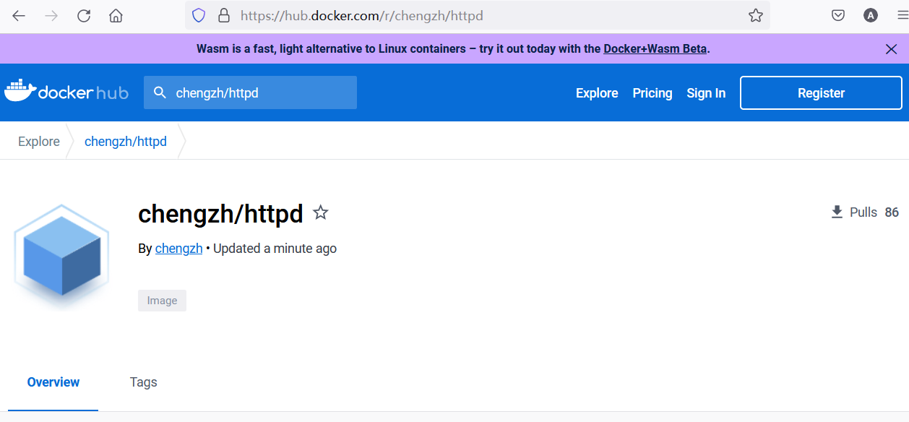


安装私有映像库

```bash
docker run -d -p 5000:5000 -v /usr/local/registry:/var/lib/registry --restart=always --name registry registry:2
```

这是一个使用`docker run`命令创建并运行一个新的Docker容器的示例。让我逐个解释每个参数及作用：

1. `docker run`：Docker命令，用于创建并启动新的容器。
2. `-d`：以“守护进程”模式运行容器（后台运行），不占用当前终端。
3. `-p 5000:5000`：端口映射，将容器内的5000端口映射到宿主机的5000端口。这允许你通过访问宿主机的5000端口来访问容器内部运行的服务。
4. `-v /usr/local/registry:/var/lib/registry`：卷映射，将宿主机的`/usr/local/registry`目录映射到容器内的`/var/lib/registry`目录。这使得容器能够读取和写入宿主机上的数据，实现数据持久化。
5. `--restart=always`：设置容器的重启策略为“始终”，意味着如果容器因某种原因停止运行，Docker将自动重新启动它。
6. `--name registry`：为这个容器设置一个自定义名称"registry"，方便识别和管理。
7. `registry:2`：指定使用的Docker镜像为`registry`，并使用版本`2`的标签。此镜像是Docker官方提供的Docker Registry镜像，用于搭建和管理Docker镜像存储仓库。

综上，该命令的作用是创建并运行一个名为"registry"的容器，基于Docker官方的Registry镜像版本2，将容器内的5000端口映射到宿主机的5000端口，并将宿主机的`/usr/local/registry`目录映射到容器内的`/var/lib/registry`目录。容器将以守护进程模式运行，并在停止后始终重启。

```bash
root@node1:~/httpd# docker run -d -p 5000:5000 -v /usr/local/registry:/var/lib/registry --restart=always --name registry registry:2
Unable to find image 'registry:2' locally
2: Pulling from library/registry
ca7dd9ec2225: Pull complete
c41ae7ad2b39: Pull complete
1ed0fc8a6161: Pull complete
21df229223d2: Pull complete
626897ccab21: Pull complete
Digest: sha256:ce14a6258f37702ff3cd92232a6f5b81ace542d9f1631966999e9f7c1ee6ddba
Status: Downloaded newer image for registry:2
835c71ecf3383a1af10bfbd189b0f47f91684f07d4b5f0e9374d163ab2764c02
root@node1:~/httpd# docker ps
CONTAINER ID   IMAGE        COMMAND                  CREATED          STATUS          PORTS                                       NAMES
835c71ecf338   registry:2   "/entrypoint.sh /etc…"   28 seconds ago   Up 27 seconds   0.0.0.0:5000->5000/tcp, :::5000->5000/tcp   registry
871c0232d678   myhttpd      "httpd-foreground"       16 minutes ago   Up 16 minutes   0.0.0.0:80->80/tcp, :::80->80/tcp           interesting_nobel
```


再次给映像打标签,使其匹配私有映像的地址

```bash
docker tag chengzh/httpd localhost:5000/httpd:v1.0
```


再次查看映像并找茬

```bash
docker images
```


```bash
root@node1:~/httpd# docker images
REPOSITORY                       TAG       IMAGE ID       CREATED          SIZE
chengzh/httpd                    latest    b15f80031aa4   17 minutes ago   145MB
myhttpd                          latest    b15f80031aa4   17 minutes ago   145MB
localhost:5000/httpd             v1.0      b15f80031aa4   17 minutes ago   145MB
httpdnew                         latest    d079e3dd8acf   25 minutes ago   165MB
httpd                            latest    157dcdf23d6c   13 days ago      145MB
registry                         2         81c944c2288b   5 weeks ago      24.1MB
dorowu/ubuntu-desktop-lxde-vnc   latest    1a89db715923   20 months ago    1.32GB
tutum/wordpress                  latest    7e7f97a602ff   6 years ago      477MB
alexwhen/docker-2048             latest    7929bcd70e47   7 years ago      8.02MB
```


将映像上传到本地映像库

```bash
docker push localhost:5000/httpd:v1.0
```


```
root@node1:~/httpd# docker push localhost:5000/httpd:v1.0
The push refers to repository [localhost:5000/httpd]
d0a01e29609a: Pushed
df40ccf15557: Pushed
10d8cd84bc49: Pushed
8bb2d8abcb18: Pushed
2bccf7e3b941: Pushed
b5ebffba54d3: Pushed
v1.0: digest: sha256:a2dc4e63cc2938857a974d3f1721446239468d33ba95325054878198465acbcb size: 1573
```


查看映像catalog

```bash
curl http://localhost:5000/v2/_catalog
```


```bash
root@node1:~/httpd# curl http://localhost:5000/v2/_catalog
{"repositories":["httpd"]}
```


使用浏览器进行查看

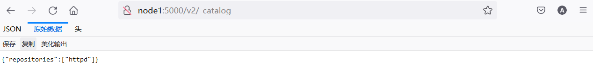


测试运行

```bash
docker run -d -p 80:80 localhost:5000/httpd:v1.0
```


```bash
docker ps
```


```bash
curl http://localhost
```


```bash
root@node1:~/httpd# docker run -d -p 80:80 localhost:5000/httpd:v1.0
ab8d22b43a7b90283e250ce9a67b55d6711655508c432dce50fc4c582791d794
root@node1:~/httpd# docker ps
CONTAINER ID   IMAGE                       COMMAND                  CREATED         STATUS         PORTS                                       NAMES
ab8d22b43a7b   localhost:5000/httpd:v1.0   "httpd-foreground"       3 seconds ago   Up 2 seconds   0.0.0.0:80->80/tcp, :::80->80/tcp           quirky_haslett
835c71ecf338   registry:2                  "/entrypoint.sh /etc…"   5 minutes ago   Up 5 minutes   0.0.0.0:5000->5000/tcp, :::5000->5000/tcp   registry
root@node1:~/httpd# curl localhost
<html><body><h1>Build Ship and Run!</h1></body></html>
```


大杀器

```bash
docker stop $(docker ps -a -q);docker rm $(docker ps -a -q)
```


# Docker 数据存储

## 数据卷

创建index.html文件

```bash
mkdir http

cd http

nano index.html
```


```html
<html><body><h1>Go West!</h1></body></html>
```


创建使用bind mount数据卷的容器

```bash
docker run -d -p 80:80 -v ~/http:/usr/local/apache2/htdocs httpd
```

这个命令创建并在后台运行一个名为httpd的Docker容器，它开放了80端口并将主机上的路径`~/http`映射到Apache HTTP服务器的默认文档根目录`/usr/local/apache2/htdocs`。

```bash
curl localhost
```


```bash
root@node1:~/http# docker run -d -p 80:80 -v ~/http:/usr/local/apache2/htdocs httpd
028743d3aa1584e7eddfd6955d7351b4d3fc3cb59b90e299269a3c1c5a5b61cd
root@node1:~/http# curl localhost
<html><body><h1>Go West!</h1></body></html>
```


尝试在宿主机修改index.html文件，并查看容器变化情况

```
nano index.html
```


```html
<html><body><h1>Go go big or go home!</h1></body></html>
```


```bash
curl localhost
```


```bash
root@node1:~/http# curl localhost
<html><body><h1>Go go big or go home!</h1></body></html>
```


## 托管数据卷

使用以下命令创建使启用managed volume的容器，注意它的端口是81

```bash
docker run -d -p 81:80 -v /usr/local/apache2/htdocs httpd
```

`-v /usr/local/apache2/htdocs`：与之前的命令稍有不同，这个命令在卷映射部分仅提供了容器内的目标路径。这将导致Docker使用一个匿名卷来存储数据。在这种情况下，它将不能直接映射到主机文件系统上的特定目录。当使用匿名卷时，文件将存储在主机文件系统的某个位置，容器ID在路径中标识。 如果你不需要直接查看或编辑这些文件，这种方法可能更加简洁。

查看容器页面

```bash
curl localhost:81
```


```bash
root@node1:~/http# curl localhost:81
<html><body><h1>It works!</h1></body></html>
```


查看容器详细配置

```
docker ps
```


```bash
CONTAINER ID   IMAGE     COMMAND              CREATED              STATUS              PORTS                               NAMES
f6fbd7a633e3   httpd     "httpd-foreground"   About a minute ago   Up About a minute   0.0.0.0:81->80/tcp, :::81->80/tcp   angry_rubin
028743d3aa15   httpd     "httpd-foreground"   7 minutes ago        Up 7 minutes        0.0.0.0:80->80/tcp, :::80->80/tcp   sad_greider
```

特别关注 `CONTAINER ID`


```bash
docker inspect container id
```


```bash
...
 "Mounts": [
            {
                "Type": "volume",
                "Name": "85b0a27fdce4f8a46831a7a826e5d4d9035985d033ee4c722468e9a77b2b3f2a",
                "Source": "/var/lib/docker/volumes/85b0a27fdce4f8a46831a7a826e5d4d9035985d033ee4c722468e9a77b2b3f2a/_data",
                "Destination": "/usr/local/apache2/htdocs",
                "Driver": "local",
                "Mode": "",
                "RW": true,
                "Propagation": ""
            }
        ],

...
```

特别关注 `source` 的属性


修改index.html，并查看结果

```bash
sudo nano source dir/index.html
```


```bash
root@node1:~/http# sudo nano /var/lib/docker/volumes/85b0a27fdce4f8a46831a7a826e5d4d9035985d033ee4c722468e9a77b2b3f2a/_data/index.html
root@node1:~/http# curl localhost:81
<html><body><h1>It works again!</h1></body></html>
```


清理现场

```bash
docker stop $(docker ps -a -q);docker rm $(docker ps -a -q)
```


# Docker 网络


## bridge 网络和 veth pair

在宿主机上列出所有的网络类型

```bash
docker network ls
```

 

```bash
root@node1:~/http# docker network ls
NETWORK ID     NAME      DRIVER    SCOPE
c42f94ef95f4   bridge    bridge    local
ae5dcb8841fa   host      host      local
7b606c3bae97   none      null      local
```


检查bridge网络

```bash
docker inspect bridge
```


```bash
root@node1:~/http# docker inspect bridge
[
    {
        "Name": "bridge",
        "Id": "c42f94ef95f44ede8b5a51dff776045ca8b3fd574f0354451f790f8010d48006",
        "Created": "2022-12-20T09:06:01.220165025+08:00",
        "Scope": "local",
        "Driver": "bridge",
        "EnableIPv6": false,
        "IPAM": {
            "Driver": "default",
            "Options": null,
            "Config": [
                {
                    "Subnet": "172.17.0.0/16"
                }
            ]
        },
        "Internal": false,
        "Attachable": false,
        "Ingress": false,
        "ConfigFrom": {
            "Network": ""
        },
        "ConfigOnly": false,
        "Containers": {},
        "Options": {
            "com.docker.network.bridge.default_bridge": "true",
            "com.docker.network.bridge.enable_icc": "true",
            "com.docker.network.bridge.enable_ip_masquerade": "true",
            "com.docker.network.bridge.host_binding_ipv4": "0.0.0.0",
            "com.docker.network.bridge.name": "docker0",
            "com.docker.network.driver.mtu": "1500"
        },
        "Labels": {}
    }
]
```


在宿主机上观察bridge 网络，注意观察veth

```bash
brctl show
```


```bash
root@node1:~/http# brctl show
bridge name     bridge id               STP enabled     interfaces
docker0         8000.0242a5e71d60       no
```

`brctl show`命令用于在Linux系统中查看和管理网桥（bridge）。网桥是一种网络设备，可以在类似于交换机的方式下转发网络数据帧。在Docker中，网络桥经常用于连接容器与主机网络。

在输出中，我们可以看到以下信息：

- `bridge name`: 网桥名称，这里是`docker0`。这是默认的Docker网络桥，当没有指定其他网络时，新创建的容器会自动连接到这个桥上。
- `bridge id`: 网桥ID，这里是`8000.0242a5e71d60`。它是一个内部标识符，用于唯一区分该网络桥。
- `STP enabled`: Spanning Tree Protocol (STP)是否启用，这里是`no`。STP是一个网络协议，用于防止网桥环路。在这个例子中，STP被禁用。
- `interfaces`: 与该网桥关联的网络接口。在您的输出中，没有与`docker0`关联的接口。这意味着当前没有使用该网桥的容器。

总之，您运行的`brctl show`命令显示了系统中存在一个名为`docker0`的网络桥，但目前没有与之关联的容器。这是Docker的默认网络桥，通常用于连接容器与主机网络。  

注意：如果 `brctl` 没有安装需要执行 `brctl sudo apt install bridge-utils`


查看宿主机网络配置，重点关注对应veth 配置细节

```bash
ip add
```


```bash
root@node1:~/http# ip add
1: lo: <LOOPBACK,UP,LOWER_UP> mtu 65536 qdisc noqueue state UNKNOWN group default qlen 1000
    link/loopback 00:00:00:00:00:00 brd 00:00:00:00:00:00
    inet 127.0.0.1/8 scope host lo
       valid_lft forever preferred_lft forever
    inet6 ::1/128 scope host
       valid_lft forever preferred_lft forever
2: eth0: <BROADCAST,MULTICAST,UP,LOWER_UP> mtu 1500 qdisc mq state UP group default qlen 1000
    link/ether 00:15:5d:01:03:32 brd ff:ff:ff:ff:ff:ff
    inet 192.168.1.231/24 brd 192.168.1.255 scope global noprefixroute eth0
       valid_lft forever preferred_lft forever
    inet6 2409:8a1e:6a62:de40:215:5dff:fe01:332/64 scope global dynamic mngtmpaddr
       valid_lft 258715sec preferred_lft 172315sec
    inet6 fe80::215:5dff:fe01:332/64 scope link
       valid_lft forever preferred_lft forever
3: docker0: <NO-CARRIER,BROADCAST,MULTICAST,UP> mtu 1500 qdisc noqueue state DOWN group default
    link/ether 02:42:a5:e7:1d:60 brd ff:ff:ff:ff:ff:ff
    inet 172.17.0.1/16 brd 172.17.255.255 scope global docker0
       valid_lft forever preferred_lft forever
    inet6 fe80::42:a5ff:fee7:1d60/64 scope link
       valid_lft forever preferred_lft forever
```


创建测试容器

```bash
docker run -d --name httpd1 httpd
```


在宿主机上观察brctl的变化

```bash
brctl show
```

 

```bash
root@node1:~/http# brctl show
bridge name     bridge id               STP enabled     interfaces
docker0         8000.0242a5e71d60       no              vethf3bd9f1
```

注意上述输出 `docker0` 增加了新的 `interfaces` 

与上一个`brctl show`命令的输出相比，现在的输出显示有一个网络接口已经关联到了网络桥`docker0`。

- `interfaces`: 与该网桥关联的网络接口现在列表中有一个接口，即`vethf3bd9f1`。这是一个虚拟以太网（veth）设备，用于连接容器与主机网络。它表示一个新的Docker容器已经被创建，并连接到了`docker0`网络桥。

这个变化表示已经创建了一个新的Docker容器，并且它已经成功地连接到了默认的网络桥`docker0`，从而使容器可以访问主机网络。

查看新增加的veth的细节

```bash
ip add
```


```bash
root@node1:~/http# ip add
1: lo: <LOOPBACK,UP,LOWER_UP> mtu 65536 qdisc noqueue state UNKNOWN group default qlen 1000
    link/loopback 00:00:00:00:00:00 brd 00:00:00:00:00:00
    inet 127.0.0.1/8 scope host lo
       valid_lft forever preferred_lft forever
    inet6 ::1/128 scope host
       valid_lft forever preferred_lft forever
2: eth0: <BROADCAST,MULTICAST,UP,LOWER_UP> mtu 1500 qdisc mq state UP group default qlen 1000
    link/ether 00:15:5d:01:03:32 brd ff:ff:ff:ff:ff:ff
    inet 192.168.1.231/24 brd 192.168.1.255 scope global noprefixroute eth0
       valid_lft forever preferred_lft forever
    inet6 2409:8a1e:6a62:de40:215:5dff:fe01:332/64 scope global dynamic mngtmpaddr
       valid_lft 259068sec preferred_lft 172668sec
    inet6 fe80::215:5dff:fe01:332/64 scope link
       valid_lft forever preferred_lft forever
3: docker0: <BROADCAST,MULTICAST,UP,LOWER_UP> mtu 1500 qdisc noqueue state UP group default
    link/ether 02:42:a5:e7:1d:60 brd ff:ff:ff:ff:ff:ff
    inet 172.17.0.1/16 brd 172.17.255.255 scope global docker0
       valid_lft forever preferred_lft forever
    inet6 fe80::42:a5ff:fee7:1d60/64 scope link
       valid_lft forever preferred_lft forever
29: vethf3bd9f1@if28: <BROADCAST,MULTICAST,UP,LOWER_UP> mtu 1500 qdisc noqueue master docker0 state UP group default
    link/ether 46:40:7f:aa:4c:3b brd ff:ff:ff:ff:ff:ff link-netnsid 0
    inet6 fe80::4440:7fff:feaa:4c3b/64 scope link
       valid_lft forever preferred_lft forever
```

这两次`ip add`命令的输出展示了主机上的网络接口信息。在第二个输出中，我们可以看到有一些变化，主要涉及到`docker0`网桥和与之关联的新接口`vethf3bd9f1@if28`。下面详细解释这些变化：

1. `docker0`网桥：
   - 第一个输出中，`docker0`的状态为`DOWN`。这表示尽管网络桥已激活，但它没有处于工作状态，因为没有与之关联的容器。
   - 第二个输出中，`docker0`的状态变为了`UP`。这表示网络桥现在已经连接到至少一个容器，并处于工作状态。

2. 新网络接口`vethf3bd9f1@if28`：
   - 在第二个输出中，我们可以看到一个新的网络接口`vethf3bd9f1@if28`。这是一个虚拟以太网设备（veth），它实现了容器和主机之间的网络连接。
   - `vethf3bd9f1@if28`的状态为`UP`，表示该接口激活并正常工作。
   - 它的`master`属性值为`docker0`，表明该接口已成功附着在`docker0`网桥上。这使得与之关联的容器可以通过网桥访问主机网络。

这些变化说明，一个新的Docker容器已经被创建，并通过新的虚拟以太网设备`vethf3bd9f1@if28`成功地连接到了`docker0`网络桥。这允许容器与主机网络通信，并使容器可以被外部访问（如果端口映射设置正确）。

在httpd1容器里观察eth0设置

```bash
docker exec -it httpd1 bash

apt-get update && apt-get install -y iproute2

ip a
```


```bash
root@33a31cced39b:/usr/local/apache2# ip a
1: lo: <LOOPBACK,UP,LOWER_UP> mtu 65536 qdisc noqueue state UNKNOWN group default qlen 1000
    link/loopback 00:00:00:00:00:00 brd 00:00:00:00:00:00
    inet 127.0.0.1/8 scope host lo
       valid_lft forever preferred_lft forever
28: eth0@if29: <BROADCAST,MULTICAST,UP,LOWER_UP> mtu 1500 qdisc noqueue state UP group default
    link/ether 02:42:ac:11:00:02 brd ff:ff:ff:ff:ff:ff link-netnsid 0
    inet 172.17.0.2/16 brd 172.17.255.255 scope global eth0
       valid_lft forever preferred_lft forever
```

观察此处的 `28: eth0@if29:` 


退出容器

```
exit 
```


在宿主机上观察bridge 网络，注意观察veth

```bash
docker inspect bridge
```


```bash
root@node1:~/http# docker inspect bridge
[
    {
        "Name": "bridge",
        "Id": "c42f94ef95f44ede8b5a51dff776045ca8b3fd574f0354451f790f8010d48006",
        "Created": "2022-12-20T09:06:01.220165025+08:00",
        "Scope": "local",
        "Driver": "bridge",
        "EnableIPv6": false,
        "IPAM": {
            "Driver": "default",
            "Options": null,
            "Config": [
                {
                    "Subnet": "172.17.0.0/16"
                }
            ]
        },
        "Internal": false,
        "Attachable": false,
        "Ingress": false,
        "ConfigFrom": {
            "Network": ""
        },
        "ConfigOnly": false,
        "Containers": {
            "33a31cced39bde3a6eaf12dce6cb1cf1071f05ebce6bef2c48a89445db855d67": {
                "Name": "httpd1",
                "EndpointID": "c4d4ebce2251275d4d5f3fcaaa98349b1dc31b30abb66fdffef6908d2e68a2bf",
                "MacAddress": "02:42:ac:11:00:02",
                "IPv4Address": "172.17.0.2/16",
                "IPv6Address": ""
            }
        },
        "Options": {
            "com.docker.network.bridge.default_bridge": "true",
            "com.docker.network.bridge.enable_icc": "true",
            "com.docker.network.bridge.enable_ip_masquerade": "true",
            "com.docker.network.bridge.host_binding_ipv4": "0.0.0.0",
            "com.docker.network.bridge.name": "docker0",
            "com.docker.network.driver.mtu": "1500"
        },
        "Labels": {}
    }
]
```

特别关注 `Containers` 部分


创建第二个httpd容器

```bash
docker run -d --name httpd2 httpd
```


在宿主机上观察新创建的veth

```bash
brctl show
```


```bash
root@node1:~/http# brctl show
bridge name     bridge id               STP enabled     interfaces
docker0         8000.0242a5e71d60       no              veth7f20d2a
                                                        vethf3bd9f1
```


宿主机上查看 veth 连接信息

```bash
ip link
```


```bash
root@node1:~/http# ip link
1: lo: <LOOPBACK,UP,LOWER_UP> mtu 65536 qdisc noqueue state UNKNOWN mode DEFAULT group default qlen 1000
    link/loopback 00:00:00:00:00:00 brd 00:00:00:00:00:00
2: eth0: <BROADCAST,MULTICAST,UP,LOWER_UP> mtu 1500 qdisc mq state UP mode DEFAULT group default qlen 1000
    link/ether 00:15:5d:01:03:32 brd ff:ff:ff:ff:ff:ff
3: docker0: <BROADCAST,MULTICAST,UP,LOWER_UP> mtu 1500 qdisc noqueue state UP mode DEFAULT group default
    link/ether 02:42:a5:e7:1d:60 brd ff:ff:ff:ff:ff:ff
29: vethf3bd9f1@if28: <BROADCAST,MULTICAST,UP,LOWER_UP> mtu 1500 qdisc noqueue master docker0 state UP mode DEFAULT group default
    link/ether 46:40:7f:aa:4c:3b brd ff:ff:ff:ff:ff:ff link-netnsid 0
31: veth7f20d2a@if30: <BROADCAST,MULTICAST,UP,LOWER_UP> mtu 1500 qdisc noqueue master docker0 state UP mode DEFAULT group default
    link/ether 42:f3:68:1b:f4:d3 brd ff:ff:ff:ff:ff:ff link-netnsid 1
```

此处的 `31: veth7f20d2a@if30:`  就是指向新容器的 `veth pair` 


在容器内部查看 `veth pair` 信息

```bash
docker exec -it httpd2 bash

cat /sys/class/net/eth0/iflink
```


```bash
root@node1:~/http# docker exec -it httpd2 bash
cat /sys/class/net/eth0/iflinkroot@ed8bda238d45:/usr/local/apache2#
root@ed8bda238d45:/usr/local/apache2# cat /sys/class/net/eth0/iflink
31
```


```bash
exit
```


## 自定义网络

创建自定义网络

```bash
docker network create --driver bridge --subnet 172.22.16.0/24 --gateway 172.22.16.1 mynetwork
```


检查mynetwork配置

```bash
docker network inspect mynetwork
```


```bash
root@node1:~/http# docker network inspect mynetwork
[
    {
        "Name": "mynetwork",
        "Id": "39c556a1568de424a113e0964fcf92a22d31284d114f8c297aabaeffcf06b672",
        "Created": "2022-12-20T15:04:11.052764603+08:00",
        "Scope": "local",
        "Driver": "bridge",
        "EnableIPv6": false,
        "IPAM": {
            "Driver": "default",
            "Options": {},
            "Config": [
                {
                    "Subnet": "172.22.16.0/24",
                    "Gateway": "172.22.16.1"
                }
            ]
        },
        "Internal": false,
        "Attachable": false,
        "Ingress": false,
        "ConfigFrom": {
            "Network": ""
        },
        "ConfigOnly": false,
        "Containers": {},
        "Options": {},
        "Labels": {}
    }
]
```


创建容器使用新建的自定义网络

```bash
docker run -d -p 83:80 --network=mynetwork --name httpd3 httpd
```


检查httpd3容器ip地址

```bash
docker exec -it httpd3 bash

apt-get update && apt-get install -y iproute2

ip add
```


```bash
root@3b8c2ca4f729:/usr/local/apache2# ip add
1: lo: <LOOPBACK,UP,LOWER_UP> mtu 65536 qdisc noqueue state UNKNOWN group default qlen 1000
    link/loopback 00:00:00:00:00:00 brd 00:00:00:00:00:00
    inet 127.0.0.1/8 scope host lo
       valid_lft forever preferred_lft forever
33: eth0@if34: <BROADCAST,MULTICAST,UP,LOWER_UP> mtu 1500 qdisc noqueue state UP group default
    link/ether 02:42:ac:16:10:02 brd ff:ff:ff:ff:ff:ff link-netnsid 0
    inet 172.22.16.2/24 brd 172.22.16.255 scope global eth0
       valid_lft forever preferred_lft forever
```


```bash
exit
```


在宿主机上为前述httpd1容器创建第二块网卡使其连接到mynetwork

```bash
docker network connect mynetwork httpd1
```


检查双网卡容器httpd1的网络设置，重点观察mynetwork的相关配置

```bash
docker container inspect httpd1
```


```bash
...
"Networks": {
                "bridge": {
                    "IPAMConfig": null,
                    "Links": null,
                    "Aliases": null,
                    "NetworkID": "c42f94ef95f44ede8b5a51dff776045ca8b3fd574f0354451f790f8010d48006",
                    "EndpointID": "c4d4ebce2251275d4d5f3fcaaa98349b1dc31b30abb66fdffef6908d2e68a2bf",
                    "Gateway": "172.17.0.1",
                    "IPAddress": "172.17.0.2",
                    "IPPrefixLen": 16,
                    "IPv6Gateway": "",
                    "GlobalIPv6Address": "",
                    "GlobalIPv6PrefixLen": 0,
                    "MacAddress": "02:42:ac:11:00:02",
                    "DriverOpts": null
                },
                "mynetwork": {
                    "IPAMConfig": {},
                    "Links": null,
                    "Aliases": [
                        "33a31cced39b"
                    ],
                    "NetworkID": "39c556a1568de424a113e0964fcf92a22d31284d114f8c297aabaeffcf06b672",
                    "EndpointID": "cc114d945773badea28d9fe841efa7a814a1d2c8edcb07fdc7b1dcf92901f006",
                    "Gateway": "172.22.16.1",
                    "IPAddress": "172.22.16.3",
                    "IPPrefixLen": 24,
                    "IPv6Gateway": "",
                    "GlobalIPv6Address": "",
                    "GlobalIPv6PrefixLen": 0,
                    "MacAddress": "02:42:ac:16:10:03",
                    "DriverOpts": {}
                }
...
```


在 httpd3 中ping httpd1

```bash
docker exec -it httpd3 bash

apt-get update && apt-get install -y iputils-ping

ping 172.22.16.3
```


```bash
root@3b8c2ca4f729:/usr/local/apache2# ping 172.22.16.3
PING 172.22.16.3 (172.22.16.3) 56(84) bytes of data.
64 bytes from 172.22.16.3: icmp_seq=1 ttl=64 time=0.064 ms
64 bytes from 172.22.16.3: icmp_seq=2 ttl=64 time=0.045 ms
64 bytes from 172.22.16.3: icmp_seq=3 ttl=64 time=0.051 ms
64 bytes from 172.22.16.3: icmp_seq=4 ttl=64 time=0.051 ms
64 bytes from 172.22.16.3: icmp_seq=5 ttl=64 time=0.048 ms
64 bytes from 172.22.16.3: icmp_seq=6 ttl=64 time=0.048 ms
```


```
apt-get update && apt-get install -y traceroute

traceroute 172.22.16.3
```


```bash
traceroute to 172.22.16.3 (172.22.16.3), 30 hops max, 60 byte packets
 1  httpd1.mynetwork (172.22.16.3)  0.257 ms  0.213 ms  0.200 ms
```


退出容器

```
exit
```


清理环境

```bash
docker stop $(docker ps -a -q);docker rm $(docker ps -a -q)
docker network rm mynetwork
```


```bash
root@node1:~/http# docker stop $(docker ps -a -q);docker rm $(docker ps -a -q)
3b8c2ca4f729
ed8bda238d45
33a31cced39b
3b8c2ca4f729
ed8bda238d45
33a31cced39b
root@node1:~/http# docker network rm mynetwork
mynetwork
```


再观察一下宿主机网络设置

```bash
brctl show

docker inspect bridge
```


```bash
root@node1:~/http# brctl show
bridge name     bridge id               STP enabled     interfaces
docker0         8000.0242a5e71d60       no
root@node1:~/http#
root@node1:~/http# docker inspect bridge
[
    {
        "Name": "bridge",
        "Id": "c42f94ef95f44ede8b5a51dff776045ca8b3fd574f0354451f790f8010d48006",
        "Created": "2022-12-20T09:06:01.220165025+08:00",
        "Scope": "local",
        "Driver": "bridge",
        "EnableIPv6": false,
        "IPAM": {
            "Driver": "default",
            "Options": null,
            "Config": [
                {
                    "Subnet": "172.17.0.0/16"
                }
            ]
        },
        "Internal": false,
        "Attachable": false,
        "Ingress": false,
        "ConfigFrom": {
            "Network": ""
        },
        "ConfigOnly": false,
        "Containers": {},
        "Options": {
            "com.docker.network.bridge.default_bridge": "true",
            "com.docker.network.bridge.enable_icc": "true",
            "com.docker.network.bridge.enable_ip_masquerade": "true",
            "com.docker.network.bridge.host_binding_ipv4": "0.0.0.0",
            "com.docker.network.bridge.name": "docker0",
            "com.docker.network.driver.mtu": "1500"
        },
        "Labels": {}
    }
]
```


# Docker 资源管理


## 内存分配限制

合理分配，循环释放测试

```bash
docker run -it -m 300M progrium/stress --vm 1 --vm-bytes 280M
```

  

```bash
root@node1:~/http# docker run -it -m 300M progrium/stress --vm 1 --vm-bytes 280M
Unable to find image 'progrium/stress:latest' locally
latest: Pulling from progrium/stress
Image docker.io/progrium/stress:latest uses outdated schema1 manifest format. Please upgrade to a schema2 image for better future compatibility. More information at https://docs.docker.com/registry/spec/deprecated-schema-v1/
a3ed95caeb02: Pull complete
871c32dbbb53: Pull complete
dbe7819a64dd: Pull complete
d14088925c6e: Pull complete
58026d51efe4: Pull complete
7d04a4fe1405: Pull complete
1775fca35fb6: Pull complete
5c319e267908: Pull complete
Digest: sha256:e34d56d60f5caae79333cee395aae93b74791d50e3841986420d23c2ee4697bf
Status: Downloaded newer image for progrium/stress:latest
WARNING: Your kernel does not support swap limit capabilities or the cgroup is not mounted. Memory limited without swap.
stress: info: [1] dispatching hogs: 0 cpu, 0 io, 1 vm, 0 hdd
stress: dbug: [1] using backoff sleep of 3000us
stress: dbug: [1] --> hogvm worker 1 [7] forked
stress: dbug: [7] allocating 293601280 bytes ...
stress: dbug: [7] touching bytes in strides of 4096 bytes ...
stress: dbug: [7] freed 293601280 bytes
stress: dbug: [7] allocating 293601280 bytes ...
stress: dbug: [7] touching bytes in strides of 4096 bytes ...
stress: dbug: [7] freed 293601280 bytes
stress: dbug: [7] allocating 293601280 bytes ...
stress: dbug: [7] touching bytes in strides of 4096 bytes ...
stress: dbug: [7] freed 293601280 bytes
stress: dbug: [7] allocating 293601280 bytes ...
stress: dbug: [7] touching bytes in strides of 4096 bytes ...
stress: dbug: [7] freed 293601280 bytes
stress: dbug: [7] allocating 293601280 bytes ...
stress: dbug: [7] touching bytes in strides of 4096 bytes ...
stress: dbug: [7] freed 293601280 bytes
stress: dbug: [7] allocating 293601280 bytes ...
stress: dbug: [7] touching bytes in strides of 4096 bytes ...
stress: dbug: [7] freed 293601280 bytes
stress: dbug: [7] allocating 293601280 bytes ...
...
```


需要使用ctrl c终止容器

```bash
^Cstress: FAIL: [1] (416) <-- worker 7 got signal 2
stress: WARN: [1] (418) now reaping child worker processes
stress: FAIL: [1] (422) kill error: No such process
stress: FAIL: [1] (452) failed run completed in 40s
```


反面例子

```bash
docker run -it -m 300M progrium/stress --vm 1 --vm-bytes 310M
```


```bash
root@node1:~/http# docker run -it -m 300M progrium/stress --vm 1 --vm-bytes 310M
WARNING: Your kernel does not support swap limit capabilities or the cgroup is not mounted. Memory limited without swap.
stress: info: [1] dispatching hogs: 0 cpu, 0 io, 1 vm, 0 hdd
stress: dbug: [1] using backoff sleep of 3000us
stress: dbug: [1] --> hogvm worker 1 [7] forked
stress: dbug: [7] allocating 325058560 bytes ...
stress: dbug: [7] touching bytes in strides of 4096 bytes ...
stress: FAIL: [1] (416) <-- worker 7 got signal 9
stress: WARN: [1] (418) now reaping child worker processes
stress: FAIL: [1] (422) kill error: No such process
stress: FAIL: [1] (452) failed run completed in 0s
```

很快内存耗尽，容器被强行终止


清理现场

```bash
docker stop $(docker ps -a -q);docker rm $(docker ps -a -q)
```


## CPU分配限制

创建两个不同优先级的容器，根据宿主机cpu数量设置参数,此处为2

```bash
docker run --name containerA -d  -c 1024 progrium/stress --cpu 2
docker run --name containerB -d  -c 512 progrium/stress --cpu 2
```


检查两个容器的cpu使用情况

```bash
docker stats
```


```bash
CONTAINER ID   NAME         CPU %     MEM USAGE / LIMIT     MEM %     NET I/O     BLOCK I/O   PIDS
cf6e7043b57b   containerB   65.70%    1.008MiB / 7.771GiB   0.01%     586B / 0B   0B / 0B     3
d79a9db0c11e   containerA   132.24%   1.062MiB / 7.771GiB   0.01%     806B / 0B   0B / 0B     3
```


关闭容器A，再检查cpu使用情况

```bash
docker stop containerA


docker stats
```


```bash
CONTAINER ID   NAME         CPU %     MEM USAGE / LIMIT     MEM %     NET I/O     BLOCK I/O   PIDS
cf6e7043b57b   containerB   198.09%   1.008MiB / 7.771GiB   0.01%     796B / 0B   0B / 0B     3
```


查看容器B内部的进程

```bash
docker top containerB
```


```bash
root@node1:~/http# docker top containerB
UID                 PID                 PPID                C                   STIME               TTY                 TIME                CMD
root                166847              166824              0                   15:24               ?                   00:00:00            /usr/bin/stress --verbose --cpu 2
root                166882              166847              52                  15:24               ?                   00:01:13            /usr/bin/stress --verbose --cpu 2
root                166883              166847              52                  15:24               ?                   00:01:12            /usr/bin/stress --verbose --cpu 2
```


清理现场

```bash
docker stop $(docker ps -a -q);docker rm $(docker ps -a -q)
```


# 使用 docker-compose 部署复杂应用


安装dockers-compose

```bash
apt install docker-compose
```

## 部署 WordPress

创建docker-compose文件

```bash
nano docker-compose.yml
```


```yaml
version: '3.3'
services:
   db:
     image: mysql:5.7
     volumes:
       - db_data:/var/lib/mysql
     restart: always
     environment:
       MYSQL_ROOT_PASSWORD: somewordpress
       MYSQL_DATABASE: wordpress
       MYSQL_USER: wordpress
       MYSQL_PASSWORD: wordpress

   wordpress:
     depends_on:
       - db
     image: wordpress:latest
     ports:
       - "8000:80"
     restart: always
     environment:
       WORDPRESS_DB_HOST: db:3306
       WORDPRESS_DB_USER: wordpress
       WORDPRESS_DB_PASSWORD: wordpress
volumes:
    db_data:
```

这个配置文件是用于创建和部署一个由两个容器组成的Docker Compose环境：一个MySQL数据库及一个WordPress应用。文件内容是基于YAML语法格式编写的，使用了Docker Compose的3.3版本。下面是关于各组件的详细解释：

1. `version: '3.3'`：定义了Docker Compose的文件版本。

然后是服务定义部分：

2. `services`：这里定义了我们要部署的两个服务。
   
   a) `db`：这个服务用于部署MySQL数据库。
      - `image: mysql:5.7`：使用的镜像是`mysql:5.7`。
      - `volumes`：这里定义一个卷，将容器内的`/var/lib/mysql`目录挂载到名为`db_data`的卷，以持久化数据库数据。
      - `restart: always`：如果这个容器出现任何意外情况，它将总是重新启动。
      - `environment`：这里设置了一些MySQL所需的环境变量。

   b) `wordpress`：这个服务用于部署WordPress应用。
      - `depends_on`：指定这个服务依赖于db服务，确保db服务首先启动。
      - `image: wordpress:latest`：使用的镜像是最新版本的`wordpress`。
      - `ports`：将容器的80端口映射到主机的8000端口，允许访问WordPress站点。
      - `restart: always`：如果这个容器出现任何意外情况，它将总是重新启动。
      - `environment`：这里设置了一些WordPress所需的环境变量，包括数据库连接信息。

3. `volumes`：此部分定义了一个名为`db_data`的卷，它被用于存储MySQL数据库的数据。这样即使数据库容器重新启动或删除，数据仍然可以被保留。

运行docker-compose

```bash
docker-compose up -d
```


```bash
root@node1:~# docker-compose up -d
Creating network "root_default" with the default driver
Creating volume "root_db_data" with default driver
Pulling db (mysql:5.7)...
5.7: Pulling from library/mysql
d26998a7c52d: Pull complete
4a9d8a3567e3: Pull complete
bfee1f0f349e: Pull complete
71ff8dfb9b12: Pull complete
bf56cbebc916: Pull complete
2e747e5e37d7: Pull complete
711a06e512da: Pull complete
3288d68e4e9e: Pull complete
49271f2d6d15: Pull complete
f782f6cac69c: Pull complete
701dea355691: Pull complete
Digest: sha256:6306f106a056e24b3a2582a59a4c84cd199907f826eff27df36406f227cd9a7d
Status: Downloaded newer image for mysql:5.7
Pulling wordpress (wordpress:latest)...
latest: Pulling from library/wordpress
025c56f98b67: Already exists
db4ab4019a6f: Pull complete
19c3d46c565a: Pull complete
7d52c3b9728a: Pull complete
075f56345cf3: Pull complete
84f1e4bf8884: Pull complete
33c195cea794: Pull complete
23c53708753b: Pull complete
3bba2691b9ce: Pull complete
ffec2fbde892: Pull complete
28e5d9f2c72e: Pull complete
af4d79f95c00: Pull complete
c765960147ec: Pull complete
1ca504b60df8: Pull complete
0fe9ebf0f00e: Pull complete
1a97859a7b0e: Pull complete
adf5a5af2aa6: Pull complete
e79a82e9f5f1: Pull complete
5d47d3a005c5: Pull complete
12cf3737dd75: Pull complete
ceb0f6853bcf: Pull complete
Digest: sha256:5e9bf24b13d1ee29c2f7bf086e544c2fd9aa4e60f0f4071f3f53beb20e079313
Status: Downloaded newer image for wordpress:latest
Creating root_db_1 ... done
Creating root_wordpress_1 ... done
```


查看容器和映像

```bash
docker ps

docker images
```


```bash
root@node1:~# docker ps
CONTAINER ID   IMAGE              COMMAND                  CREATED          STATUS          PORTS                                   NAMES
5d7e27f7e6ba   wordpress:latest   "docker-entrypoint.s…"   42 seconds ago   Up 41 seconds   0.0.0.0:8000->80/tcp, :::8000->80/tcp   root_wordpress_1
35cbfc35fd4f   mysql:5.7          "docker-entrypoint.s…"   43 seconds ago   Up 41 seconds   3306/tcp, 33060/tcp                     root_db_1
root@node1:~#
root@node1:~# docker images
REPOSITORY                       TAG       IMAGE ID       CREATED         SIZE
chengzh/httpd                    latest    b15f80031aa4   5 hours ago     145MB
myhttpd                          latest    b15f80031aa4   5 hours ago     145MB
localhost:5000/httpd             v1.0      b15f80031aa4   5 hours ago     145MB
httpdnew                         latest    d079e3dd8acf   5 hours ago     165MB
mysql                            5.7       d410f4167eea   13 days ago     495MB
wordpress                        latest    8b105c533d0c   13 days ago     615MB
httpd                            latest    157dcdf23d6c   13 days ago     145MB
registry                         2         81c944c2288b   5 weeks ago     24.1MB
dorowu/ubuntu-desktop-lxde-vnc   latest    1a89db715923   20 months ago   1.32GB
tutum/wordpress                  latest    7e7f97a602ff   6 years ago     477MB
alexwhen/docker-2048             latest    7929bcd70e47   7 years ago     8.02MB
progrium/stress                  latest    db646a8f4087   8 years ago     282MB
```


查看db容器，重点关注mount字段

```bash
docker inspect root_db_1
```


```bash
...
"Mounts": [
            {
                "Type": "volume",
                "Name": "root_db_data",
                "Source": "/var/lib/docker/volumes/root_db_data/_data",
                "Destination": "/var/lib/mysql",
                "Driver": "local",
                "Mode": "rw",
                "RW": true,
                "Propagation": ""
            }
        ],
...
```


查看docker volume

```bash
docker volume ls
```


```bash
root@node1:~# docker volume ls
DRIVER    VOLUME NAME
local     41d534750d3bb0a4d2a07b98b190f0d278d82c272fc1cd6f73eeba17db71536d
local     85b0a27fdce4f8a46831a7a826e5d4d9035985d033ee4c722468e9a77b2b3f2a
local     335d6617af41e391ad550d10c7b47146c2d2c364cf46750ded1e4446196cdbba
local     c948c4312f8b57b14b620a4ad5c5d1c6bedfe46eda33e1a82856eb20116876e4
local     root_db_data
```


查看数据卷 `root_db_data` 配置细节

```bash
docker inspect root_db_data
```


```bash
root@node1:~# docker inspect root_db_data
[
    {
        "CreatedAt": "2022-12-20T15:37:57+08:00",
        "Driver": "local",
        "Labels": {
            "com.docker.compose.project": "root",
            "com.docker.compose.version": "1.25.0",
            "com.docker.compose.volume": "db_data"
        },
        "Mountpoint": "/var/lib/docker/volumes/root_db_data/_data",
        "Name": "root_db_data",
        "Options": null,
        "Scope": "local"
    }
]
```


使用浏览器登录到wordpress,初始化,并且写一个blog

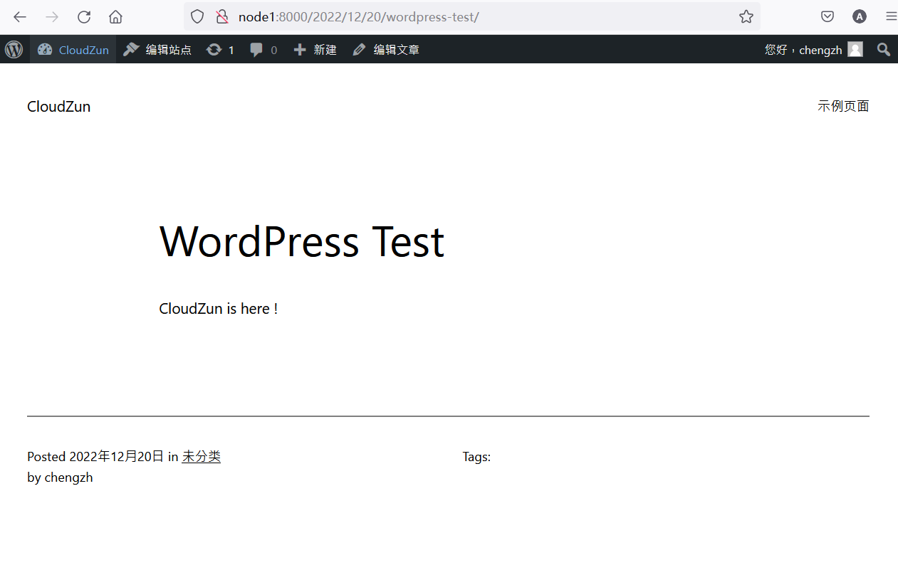

停止wordpress堆栈

```bash
docker-compose down
```


```bash
root@node1:~# docker-compose down
Stopping root_wordpress_1 ... done
Stopping root_db_1        ... done
Removing root_wordpress_1 ... done
Removing root_db_1        ... done
Removing network root_default
```


检查容器和数据卷

```bash
docker ps

docker volume ls
```


```bash
root@node1:~# docker ps
CONTAINER ID   IMAGE     COMMAND   CREATED   STATUS    PORTS     NAMES
root@node1:~#
root@node1:~# docker volume ls
DRIVER    VOLUME NAME
local     41d534750d3bb0a4d2a07b98b190f0d278d82c272fc1cd6f73eeba17db71536d
local     85b0a27fdce4f8a46831a7a826e5d4d9035985d033ee4c722468e9a77b2b3f2a
local     335d6617af41e391ad550d10c7b47146c2d2c364cf46750ded1e4446196cdbba
local     c948c4312f8b57b14b620a4ad5c5d1c6bedfe46eda33e1a82856eb20116876e4
local     root_db_data
```

可以观察到容器已经消失,但是数据卷还存留


使用浏览器刷新此前blog的地址

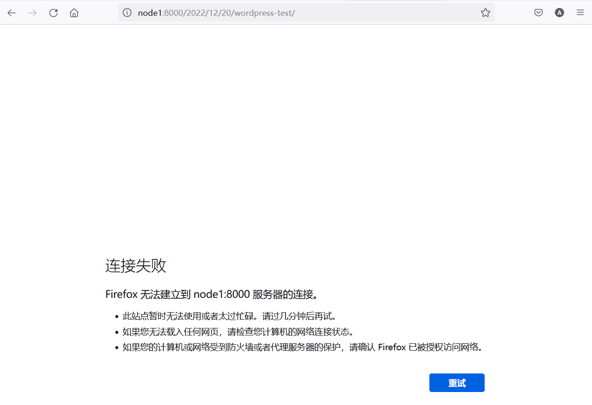

重建 wordpress 堆栈

```bash
docker-compose up -d
```


```bash
root@node1:~# docker-compose up -d
Creating network "root_default" with the default driver
Creating root_db_1 ... done
Creating root_wordpress_1 ... done
```


再次使用浏览器刷新此前blog的地址

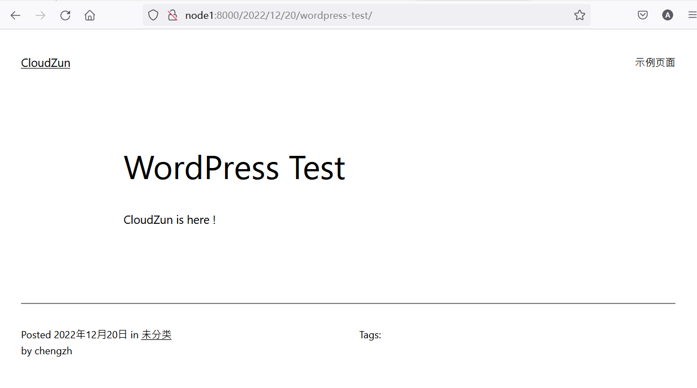

清理 wordpress 堆栈,并删除数据

```bash
docker-compose down --volumes
```


## 部署 NextCloud

> Nextcloud是一套用于创建网络硬盘的客户端－服务器软件。其功能与Dropbox相近，但Nextcloud是自由及开放源代码软件，每个人都可以在私人服务器上安装并执行它。

```bash
nano docker-compose.yml
```


```yaml
version: '2'

volumes:
  nextcloud:
  db:

services:
  db:
    image: mariadb:10.6
    restart: always
    command: --transaction-isolation=READ-COMMITTED --log-bin=binlog --binlog-format=ROW
    volumes:
      - db:/var/lib/mysql
    environment:
      - MYSQL_ROOT_PASSWORD=password
      - MYSQL_PASSWORD=password
      - MYSQL_DATABASE=nextcloud
      - MYSQL_USER=nextcloud

  app:
    image: nextcloud
    restart: always
    ports:
      - 8088:80
    links:
      - db
    volumes:
      - nextcloud:/var/www/html
    environment:
      - MYSQL_PASSWORD=password
      - MYSQL_DATABASE=nextcloud
      - MYSQL_USER=nextcloud
      - MYSQL_HOST=db
```

这是一个使用 Docker Compose 的配置文件，它定义了两个服务：数据库服务 `db` 和 应用服务 `app`。此文件使用的 Docker Compose 版本为 '2'。接下来，我将分别解释配置文件中的每个部分。

首先，我们定义了两个卷（volumes）：
1. `nextcloud`：用于存储 Nextcloud 应用数据的数据卷。
2. `db`：用于存储数据库数据的数据卷。

接下来定义了两个服务：
1. `db` 服务：
   - 使用 `mariadb:10.6` 镜像。
   - 使用 `always` 重启策略。这意味着当容器停止时，Docker 将始终尝试重新启动它。
   - 运行一个自定义命令，设置事务隔离级别（READ-COMMITTED），以及配置二进制日志（binlog）和其格式（ROW）。
   - 将名为 `db` 的数据卷挂载到 `/var/lib/mysql` 目录中。
   - 定义了一些环境变量，例如：MySQL root 用户的密码、普通用户（`nextcloud`）的密码、使用的数据库名称（`nextcloud`）以及所创建的用户名称（`nextcloud`）。

2. `app` 服务：
   - 使用 `nextcloud` 镜像。
   - 使用 `always` 重启策略。
   - 将容器中的 80 端口映射到宿主机的 8088 端口。
   - 通过 `links` 指令建立与 `db` 服务的连接。
   - 将名为 `nextcloud` 的数据卷挂载到 `/var/www/html` 目录中。
   - 定义了一些环境变量，例如：用于连接到数据库服务的 MySQL 密码、数据库名称、用户名以及主机名（`db`，即此配置文件中定义的数据库服务名）。

总结一下，这个 Docker Compose 文件定义了一个使用 Nextcloud 应用和 MariaDB 数据库的基本配置。Docker 将创建两个容器，它们分别运行 Nextcloud 和 MariaDB，Nextcloud 将使用命名数据卷将应用数据存储在宿主机上，而 MariaDB 则将数据库数据存储在另一个命名卷中。使用此配置文件，你可以通过运行 `docker-compose up` 命令来部署 Nextcloud 应用。

```bash
docker-compose up -d
```


# Docker 可视化管理


## 图形化UI

> Portainer是一款轻量级的Docker环境管理UI工具，可用于管理Docker宿主机和Docker Swarm集群。它提供了直观的用户界面，支持管理Docker堆栈、容器、镜像、卷、网络等。


安装 Portainer

```bash
docker run -d -p 9000:9000 --restart always -v /var/run/docker.sock:/var/run/docker.sock -v /opt/portainer:/data portainer/portainer -H unix:///var/run/docker.sock
```


使用 `node1:9000`访问 Portainer

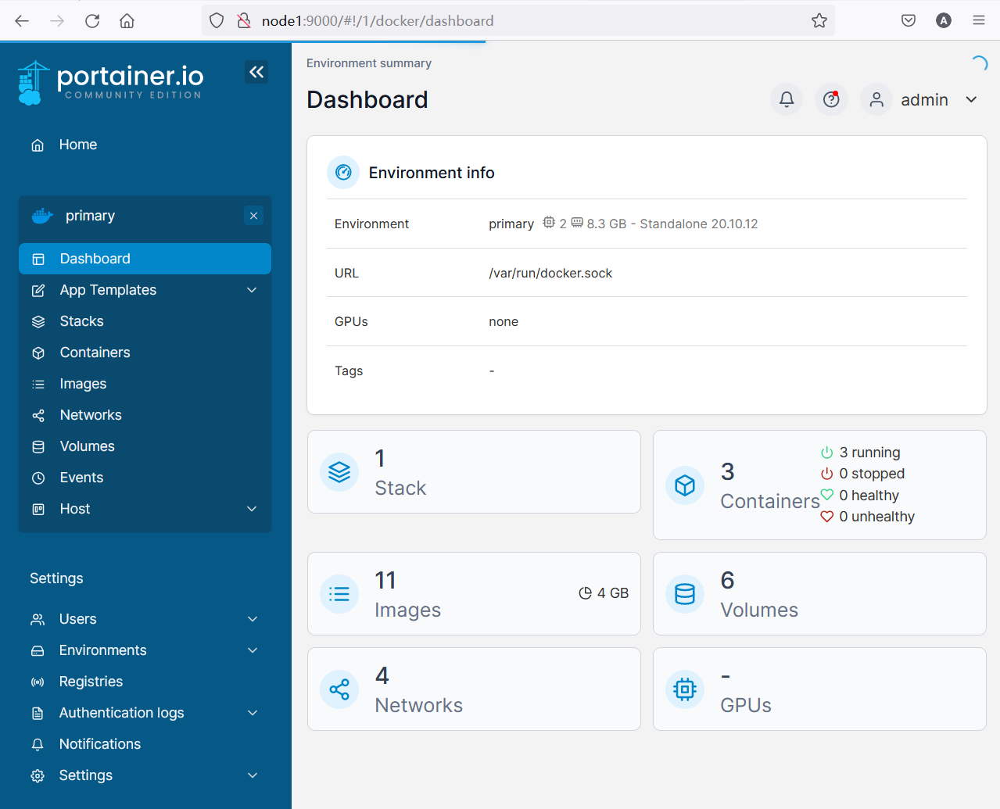


> Weave Scope是一个用于Docker和Kubernetes的可视化和监控工具。它提供了应用程序和整个基础架构的自上而下的视图，可以监控Kubernetes集群中的一系列资源的状态、资源使用情况、应用拓扑、scale等。此外，它还可以直接通过浏览器进入容器内部调试等。

安装 Weave scope 

```bash
sudo curl -L git.io/scope -o /usr/local/bin/scope
sudo chmod a+x /usr/local/bin/scope
sudo scope launch
```


```bash
root@node1:~# sudo curl -L git.io/scope -o /usr/local/bin/scope
  % Total    % Received % Xferd  Average Speed   Time    Time     Time  Current
                                 Dload  Upload   Total   Spent    Left  Speed
  0     0    0     0    0     0      0      0 --:--:-- --:--:-- --:--:--     0
  0     0    0     0    0     0      0      0 --:--:--  0:00:01 --:--:--     0
  0     0    0     0    0     0      0      0 --:--:--  0:00:02 --:--:--     0
  0     0    0     0    0     0      0      0 --:--:--  0:00:03 --:--:--     0
100 11259  100 11259    0     0   2683      0  0:00:04  0:00:04 --:--:-- 98922
root@node1:~# sudo chmod a+x /usr/local/bin/scope
root@node1:~# sudo scope launch
Unable to find image 'weaveworks/scope:1.13.2' locally
1.13.2: Pulling from weaveworks/scope
ba3557a56b15: Pull complete
3ac4c0e9800c: Pull complete
d052e74a4dae: Pull complete
aacb9bf49f73: Pull complete
06841e6f61a9: Pull complete
ee99b95c7732: Pull complete
dd0e726a9a15: Pull complete
05cb5f9d0d32: Pull complete
e956cf3e716a: Pull complete
Digest: sha256:8591bb11d72f784f784ac8414660759d40b7c0d8819011660c1cc94271480a83
Status: Downloaded newer image for weaveworks/scope:1.13.2
51b1151df12e744a9792aa6ecc76177cec5d310b8439195f4a098b68898fc6d0
Scope probe started
Weave Scope is listening at the following URL(s):
  * http://172.19.0.1:4040/
  * http://192.168.1.231:4040/
```


使用 `node1:4040` 访问 weavscope 

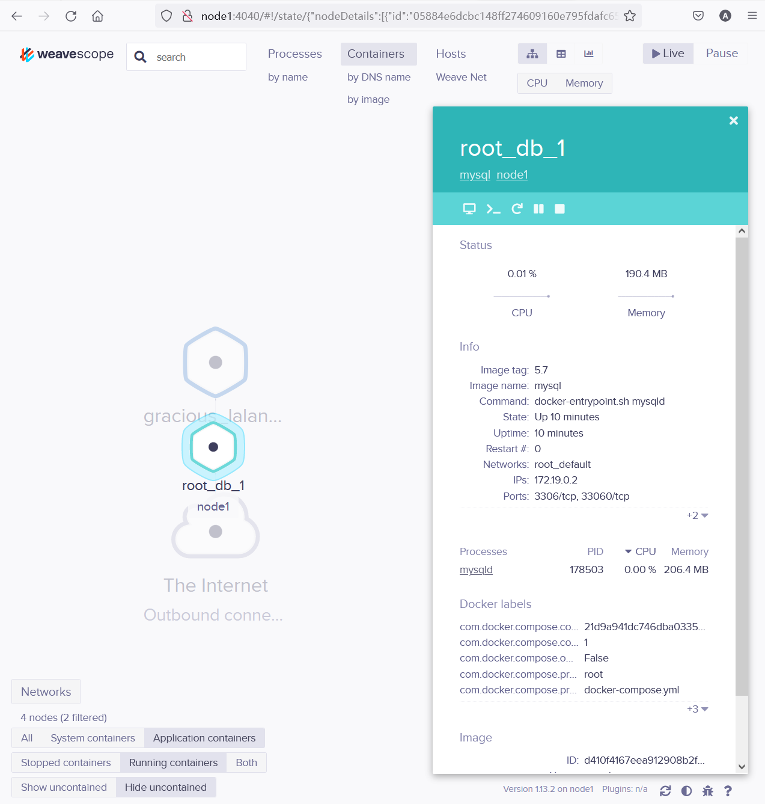

注意: weavescope工作在4040端口，不会要求创建管理员账号，非常危险，主要用于直观展现容器间的调用，也可以用于和容器 宿主机之间的交互式操作。


## 性能监控

> Prometheus是一个功能强大的监控报警系统，可以帮助用户实现对监控数据的查询、聚合、数据可视化以及告警等功能。它的使用范围主要针对性能和可用性监控，不适用于针对日志、事件、调用链等的监控。

安装 Prometheus 堆栈

```bash
git clone https://github.com/stefanprodan/dockprom  
cd dockprom 
ADMIN_USER=admin ADMIN_PASSWORD=admin docker-compose up -d
```


使用 Portainer 观察 dockprom 的容器部署结果

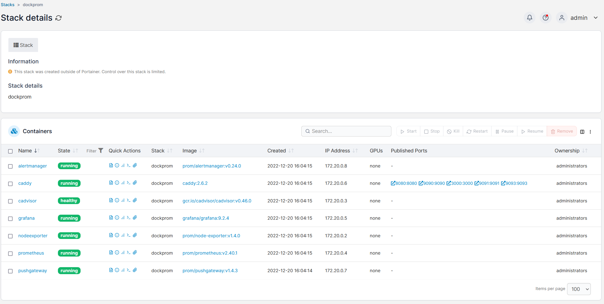


使用 `node1:3000` 访问 grafana ,用户名 密码均为 `admin`

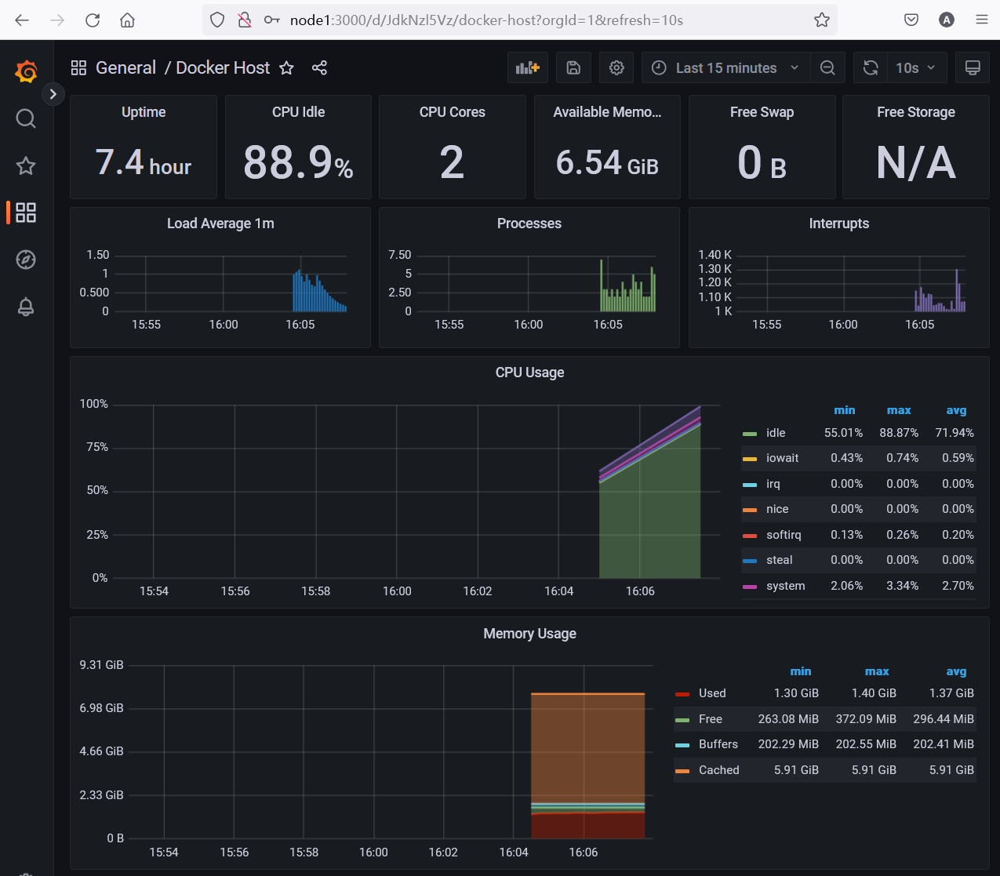

以上是报表 `Docker Host`的展示效果


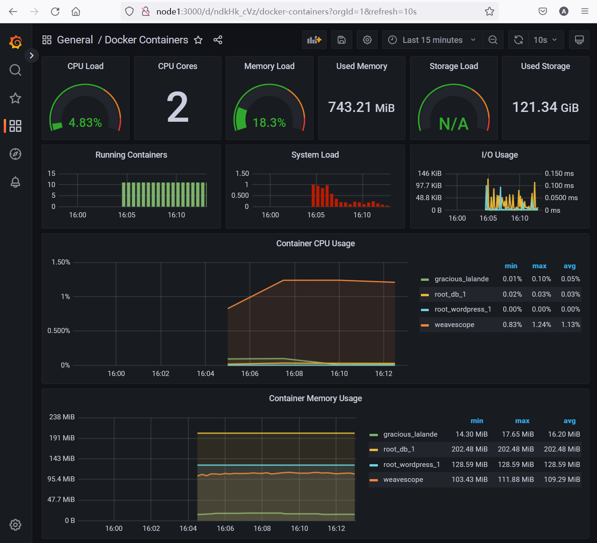

以上是报表 `Docker Containers`的展示效果


从weavescope页面中观察的  dockprom  堆栈中诸容器相互调用关系

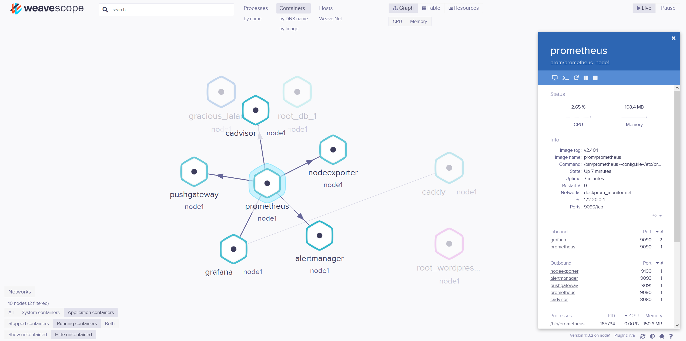


## 反向代理管理

> Nginx Proxy Manager是一个基于Docker镜像的代理管理器，只需要一个数据库即可运行。它提供美观且安全的管理界面，可轻松创建转发域、重定向、流和404主机，无需了解任何Nginx知识。它的最大特点是简单方便，即使没有Nginx基础的用户也能轻松完成反向代理的配置。此外，Nginx Proxy Manager还整合了Let's Encrypt证书申请，可轻松将网站转为HTTPS。

```bash
nano docker-compose.yml
```

```yaml
version: '3.8'
services:
  app:
    image: 'jc21/nginx-proxy-manager:latest'
    restart: unless-stopped
    ports:
      - '80:80'
      - '81:81'
      - '443:443'
    volumes:
      - ./data:/data
      - ./letsencrypt:/etc/letsencrypt
```

这是一个Docker Compose文件，使用Docker Compose的版本3.8。Docker Compose是一个用于定义和运行多容器Docker应用程序的工具。此配置文件定义了一个名为“app”的服务，其中包含以下设置：

1. `image`: 指定服务使用的Docker镜像 - `jc21/nginx-proxy-manager:latest`。这是一个具有Nginx反向代理管理器的镜像，用于管理、部署和监控Nginx反向代理服务器。

2. `restart`: 设置为`unless-stopped`，这意味着容器将在任何情况下重启，除非用户明确的停止它。

3. `ports`: 定义了服务需要公开的端口映射：
   - '80:80' 表示将宿主机的80端口映射到容器的80端口（HTTP）
   - '81:81' 表示将宿主机的81端口映射到容器的81端口（Nginx Proxy Manager的管理界面）
   - '443:443' 表示将宿主机的443端口映射到容器的443端口（HTTPS）

4. `volumes`: 定义了在宿主机和容器之间共享的存储卷：
   - `./data:/data` 映射宿主机上的`data`目录到容器的`/data`目录，通常用于存储Nginx反向代理的配置信息和数据库文件。
   - `./letsencrypt:/etc/letsencrypt` 映射宿主机上的`letsencrypt`目录到容器的`/etc/letsencrypt`目录，用于存储Let's Encrypt SSL证书。

简而言之，这是一个使用Docker Compose部署Nginx反向代理管理器的配置文件。当使用此配置文件运行`docker-compose up`时，它将自动下载和运行`jc21/nginx-proxy-manager`镜像，并按照上述配置绑定端口和存储卷。

```bash
docker-compose up -d
```

登陆界面：http://nodeip:81

默认凭据：

```
Email:    admin@example.com
Password: changeme
```


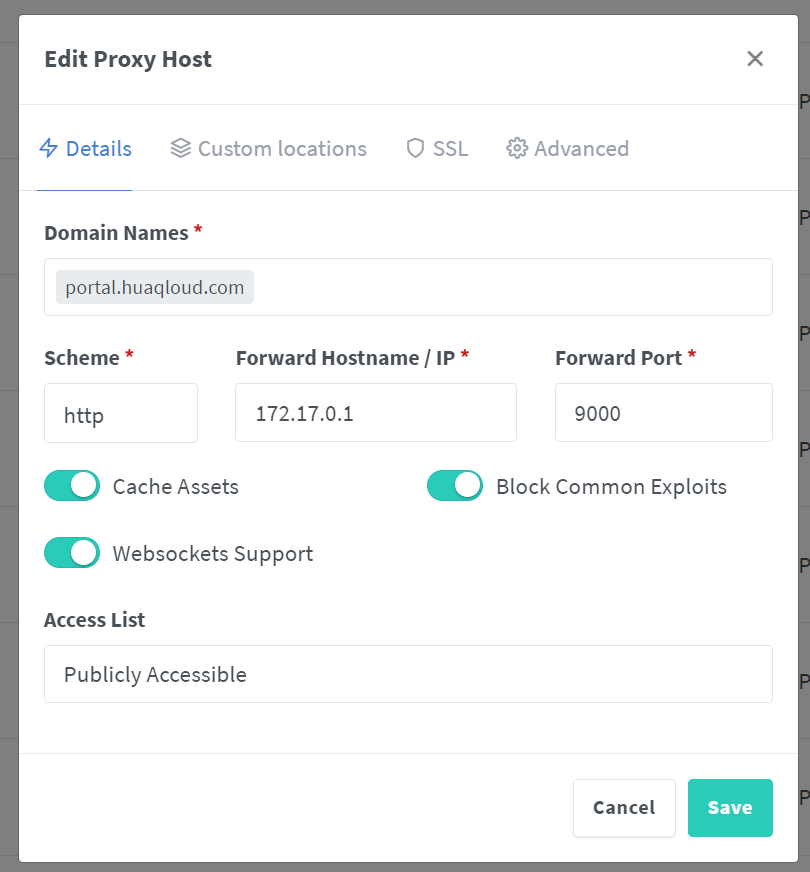

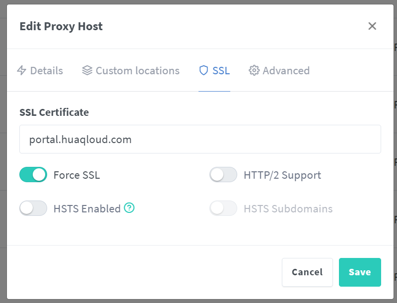

# 最简Docker CI/CD 实验场景

前提条件：

1. GitHub账号

2. Docker Hub账号

   

## 创建静态HTML文件和Dockerfile

**1. HTML文件**

这是一个最简单的HTML文件，名字可以为`index.html`：

```html
<!DOCTYPE html>
<html>
<head>
    <title>CICD Lab Page</title>
</head>
<body>
    <h1>Welcome to My Lab</h1>
    <p>Powered by Github + Docker hub </p>
    <p>version: 2023/5/31 11:27 </p>
    <p>Here is a link to my GitHub repository: <a href="https://github.com/cloudzun/cicdlab" target="_blank">https://github.com/cloudzun/cicdlab</a></p>
</body>
</html>
```

**2. Dockerfile**

以下是一个简单的Dockerfile，它基于Alpine Linux映像，并将你的静态页面复制到镜像中：

```dockerfile
# 使用Alpine Linux作为基础映像
FROM alpine:latest

# 安装lighttpd
RUN apk add --no-cache lighttpd

# 将你的静态页面复制到镜像中
COPY ./index.html /var/www/localhost/htdocs/index.html

# 暴露80端口
EXPOSE 80

# 当容器启动时运行lighttpd
CMD ["lighttpd", "-D", "-f", "/etc/lighttpd/lighttpd.conf"]
```

这个Dockerfile做了以下几件事：

1. 使用`Alpine Linux`作为基础映像。
2. 安装`lighttpd`，它是一个轻量级的HTTP服务器。
3. 将你的静态HTML页面复制到镜像中的`/var/www/localhost/htdocs/`目录。
4. 暴露了`80`端口，这是HTTP的默认端口。
5. 当容器启动时，运行`lighttpd`并保持前台运行。
   请注意，这个示例假设你的HTML文件名为`index.html`，并且它位于与`Dockerfile`相同的目录中。如果你的文件名或路径不同，你需要相应地修改COPY命令。

请将这个`Dockerfile`和你的`HTML`文件放在你的GitHub仓库中的同一个目录下，然后提交这些文件到GitHub。这就完成了第一步。


## 设置GitHub Acitons

1. 在你的项目根目录下创建一个新的文件夹名为`.github/workflows`。
2. 在`.github/workflows`文件夹中创建一个新的YAML文件，如`dockerimage.yml`。
3. 在`dockerimage.yml`中添加以下内容：

```yaml
name: Build and Push Docker Image

on:
  push:
    branches:
      - main # Change this to your default branch if it's not 'main'

jobs:
  build-and-push:
    runs-on: ubuntu-latest
    steps:
    - name: Checkout code
      uses: actions/checkout@v2
      
    - name: Login to DockerHub
      uses: docker/login-action@v1
      with:
        username: ${{ secrets.DOCKER_HUB_USERNAME }}
        password: ${{ secrets.DOCKER_HUB_ACCESS_TOKEN }}

    - name: Build and push Docker image
      uses: docker/build-push-action@v2
      with:
        context: .
        push: true
        tags: docker.io/${{ secrets.DOCKER_HUB_USERNAME }}/cicdlab:latest
```

此工作流程文件将在每次将更改推送到主分支时触发，并且会构建并将Docker映像推送到Docker Hub。

这是一个 GitHub Actions 配置文件，用于实现在向名为 "main" 的分支进行推送时，自动构建并将 Docker 镜像推送到 DockerHub 的功能。以下是关于配置文件各部分的解释：

1. `name: Build and Push Docker Image`：为此工作流分配一个名称。

2. `on`：定义触发此工作流的事件。
   - `push`：当有新的推送发生时触发。
   - `branches`：指定触发此工作流的分支名称。
     - `main`：分支名称（默认为“main”，如果使用其他名称，请进行修改）。

3. `jobs`：定义工作流中的任务。
   - `build-and-push`：为任务分配一个 ID。
   - `runs-on`: 定义任务执行的虚拟环境。在这里，使用的是最新版的 Ubuntu。

4. `steps`：任务中执行的一系列步骤。
   - 第一步（name: Checkout code）：检出仓库的代码。
   - 第二步（name: Login to DockerHub）：登录到 DockerHub。
     - 使用 `docker/login-action@v1`：标明用于登录 DockerHub 的 GitHub Action。
     - `with`：配置 GitHub Action 的参数。
       - `username` 和 `password`：从 GitHub Secrets 获取 DockerHub 的用户名和访问令牌。
   - 第三步（name: Build and push Docker image）：构建并推送 Docker 镜像。
     - 使用 `docker/build-push-action@v2`：标明用于构建和推送 Docker 镜像的 GitHub Action。
     - `with`：配置 GitHub Action 的参数。
       - `context`：指定构建上下文，这里是当前目录（`.`）。
       - `push`：是否推送镜像，这里设置为 `true`。
       - `tags`：定义 Docker 镜像的标签，包括 DockerHub 的用户名、仓库名称以及镜像的版本标签（在这里用 `latest` 标记最新版本）。

通过此配置文件，当您向 "main" 分支提交更改时，GitHub Actions 会自动构建并推送 Docker 镜像到 DockerHub。


在你的GitHub项目的`Settings`页面中，进入`Secrets`菜单，并添加你的Docker Hub用户名和访问令牌。这些密钥将在你的工作流中用于登录到Docker Hub。添加以下两个secret：

- `DOCKER_HUB_USERNAME` - 你的Docker Hub用户名
- `DOCKER_HUB_ACCESS_TOKEN` - 你的Docker Hub访问令牌

现在每次向`main`分支（或者你在`dockerimage.yml`中设置的默认分支）提交更改时，GitHub Actions都将自动构建一个新的Docker映像并将其推送到你的Docker Hub仓库。


## 创建 DOCKER_HUB_ACCESS_TOKEN

1. 登录你的Docker Hub账户。
2. 点击你的用户名，然后在下拉菜单中选择"Account Settings"。
3. 在左侧的菜单中，选择"Security"。
4. 在"New Access Token"下，给你的新令牌输入一个名字，然后点击"Create"。名字可以是任何你喜欢的名字，但最好选择一个能帮助你记住该令牌用途的名字。
5. 你的新令牌将显示在下一屏幕上。确保你复制了这个令牌，因为你将无法再次看到它。

6. 然后你可以将这个访问令牌复制到你的GitHub仓库的Secrets设置中（作为`DOCKER_HUB_ACCESS_TOKEN`）。


## 执行容器映像的自动构建

实际上，根据前面我们在GitHub Actions中设置的操作，每次你提交代码，都会触发GitHub Actions自动构建Docker镜像并将它推送到Docker Hub。因此，你并不需要在Docker Hub上设置自动构建。

GitHub Actions已经接管了这部分工作。每次你推送更改到GitHub，它都会自动构建新的Docker镜像，并使用你在GitHub Secrets中设置的Docker Hub凭据将镜像推送到Docker Hub。

所以，在这个设置中，Docker Hub主要作为存储和分发Docker镜像的平台，而真正的自动构建工作是由GitHub Actions完成的。

请确认你的GitHub Actions工作流正常工作，即当你向GitHub仓库提交更改时，可以在GitHub Actions的日志中看到构建和推送Docker镜像的过程，并且可以在Docker Hub的仓库中看到新的镜像。


## 使用Watchtower实现容器自动更新

需要在Docker主机上安装和运行Watchtower。Watchtower是一个Docker容器，可以监视其他容器，并在Docker Hub上发现新的映像时自动更新它们。

你可以使用以下命令启动Watchtower：

```bash
docker run -d --name watchtower -v /var/run/docker.sock:/var/run/docker.sock containrrr/watchtower --interval 30
```

在这个命令中，`--interval 30`参数使Watchtower每30秒检查一次更新。

现在，你需要确保你的应用容器启动时使用了正确的Docker Hub镜像标签。Watchtower通过比较Docker Hub上的新镜像和本地镜像的标签来判断是否有新版本可用。

如果你在运行你的应用容器时使用了类似`chengzh/cicdlab:latest`的标签，那么只要在Docker Hub上有新的`latest`标签出现，Watchtower就会发现并拉取新的映像，然后重启你的应用容器。

