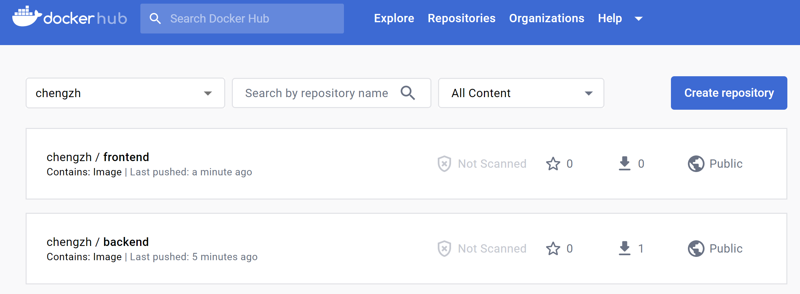

# Dockers 基本实验

实验环境最低要求：

- Ubuntu 18.04/ 1 CPU/ 2GB 内存/ 30GB磁盘

  

## Run：运行容器

安装Docker (国内场景)

```bash
apt -y install apt-transport-https ca-certificates curl software-properties-common

curl -fsSL https://mirrors.aliyun.com/docker-ce/linux/ubuntu/gpg | sudo apt-key add -
sudo add-apt-repository "deb [arch=amd64] https://mirrors.aliyun.com/docker-ce/linux/ubuntu $(lsb_release -cs) stable"

apt update -y 
apt install docker-ce -y 
```


原生常规安装Docker方法(可选)

```bash
curl -sSL https://get.docker.com/ | sh
usermod -aG docker chengzh
```


设置国内容器镜像缓存

```bash
mkdir /etc/docker
```


```bash
cat > /etc/docker/daemon.json << EOF
{
    "exec-opts": ["native.cgroupdriver=systemd"],
    "log-driver": "json-file",
    "log-opts": {
        "max-size": "100m",
        "max-file": "10"
    },
    "registry-mirrors": ["https://pqbap4ya.mirror.aliyuncs.com"]
}
EOF
```


```bash
systemctl restart docker
systemctl enable docker
```


查看docker 安装情况

```bash
docker version
```


```bash
root@node1:~# docker version
Client:
 Version:           20.10.12
 API version:       1.41
 Go version:        go1.16.2
 Git commit:        20.10.12-0ubuntu2~20.04.1
 Built:             Wed Apr  6 02:14:38 2022
 OS/Arch:           linux/amd64
 Context:           default
 Experimental:      true

Server:
 Engine:
  Version:          20.10.12
  API version:      1.41 (minimum version 1.12)
  Go version:       go1.16.2
  Git commit:       20.10.12-0ubuntu2~20.04.1
  Built:            Thu Feb 10 15:03:35 2022
  OS/Arch:          linux/amd64
  Experimental:     false
 containerd:
  Version:          1.5.9-0ubuntu1~20.04.6
  GitCommit:
 runc:
  Version:          1.1.0-0ubuntu1~20.04.2
  GitCommit:
 docker-init:
  Version:          0.19.0
  GitCommit:
```


基本映像操作

```bash
docker run -d -p 2048:80 alexwhen/docker-2048
```

这个命令是用来运行一个Docker容器的。详细解释如下：

1. `docker run`: Docker命令行的基本命令之一，用于创建并启动一个新的容器。

2. `-d`: 此参数表示在后台以分离模式（detached mode）运行容器，即在后台运行，不占用当前终端。

3. `-p 2048:80`: `-p` 参数用于映射容器的端口到宿主机的端口。在本例中，将容器内部的80端口映射到宿主机的2048端口。冒号左边的端口是宿主机端口，冒号右边的端口是容器端口。

4. `alexwhen/docker-2048`: 这是容器使用的镜像名，其中`alexwhen`是用户名，`docker-2048`是镜像仓库名。这个镜像是Docker Hub上一个预先构建好的包含2048游戏的镜像。

综上所述，这个命令运行了一个名为`alexwhen/docker-2048`的镜像，并将该容器的内部80端口映射到了宿主机的2048端口。使用这个命令后，你可以通过访问宿主机的2048端口（如`http://localhost:2048`）在浏览器中玩2048游戏。

```bash
root@node1:~# docker run -d -p 2048:80 alexwhen/docker-2048
Unable to find image 'alexwhen/docker-2048:latest' locally
latest: Pulling from alexwhen/docker-2048
Image docker.io/alexwhen/docker-2048:latest uses outdated schema1 manifest format. Please upgrade to a schema2 image for better future compatibility. More information at https://docs.docker.com/registry/spec/deprecated-schema-v1/
c862d82a67a2: Pull complete
a3ed95caeb02: Pull complete
69dbbd8c451d: Pull complete
e9b345a0f742: Pull complete
Digest: sha256:4913452e5bd092db9c8b005523127b8f62821867021e23a9acb1ae0f7d2432e1
Status: Downloaded newer image for alexwhen/docker-2048:latest
86b69fa85bc9a156384de0139f6cb722c37044c7e5436fe51a3a48b966b289f5
```


在宿主机上检查容器运行情况

```bash
docker ps
```


```bash
root@node1:~# docker ps
CONTAINER ID   IMAGE                  COMMAND                  CREATED          STATUS          PORTS                                   NAMES
86b69fa85bc9   alexwhen/docker-2048   "nginx -g 'daemon of…"   26 seconds ago   Up 25 seconds   0.0.0.0:2048->80/tcp, :::2048->80/tcp   busy_ride
```

重点关注上述输出的 `CONTAINER ID` 的值


查看映像

```bash
docker images
```


```bash
REPOSITORY             TAG       IMAGE ID       CREATED       SIZE
alexwhen/docker-2048   latest    7929bcd70e47   7 years ago   8.02MB
```


在浏览器上看看它长啥样


查看容器资源使用情况

```bash
docker stats
```


```bash
CONTAINER ID   NAME        CPU %     MEM USAGE / LIMIT     MEM %     NET I/O       BLOCK I/O   PIDS
86b69fa85bc9   busy_ride   0.00%     2.328MiB / 7.771GiB   0.03%     1.32kB / 0B   0B / 0B     2
```


看看2048容器内部的进程使用情况

```bash
docker top container ID
```


```bash
root@node1:~# docker top 86
UID                 PID                 PPID                C                   STIME               TTY                 TIME                CMD
root                26953               26929               0                   09:21               ?                   00:00:00            nginx: master process nginx -g daemon off;
systemd+            26991               26953               0                   09:21               ?                   00:00:00            nginx: worker process
```


如果有必要我们可以重启容器

```bash
docker restart container ID
```


```bash
root@node1:~# docker restart 86
86
root@node1:~# docker ps
CONTAINER ID   IMAGE                  COMMAND                  CREATED         STATUS          PORTS                                   NAMES
86b69fa85bc9   alexwhen/docker-2048   "nginx -g 'daemon of…"   9 minutes ago   Up 10 seconds   0.0.0.0:2048->80/tcp, :::2048->80/tcp   busy_ride
```


还可以停止容器

```bash
docker stop container ID
```


```bash
root@node1:~# docker stop 86
86
root@node1:~# docker ps
CONTAINER ID   IMAGE     COMMAND   CREATED   STATUS    PORTS     NAMES
```


因为docker ps只能看到活着的容器，如果不论死活都要看到则需要使用：

```bash
docker ps -a -q
```


```bash
root@node1:~# docker ps -a -q
86b69fa85bc9
```


如果需要启动之前被停止的容器

```bash
docker start container ID
```


```bash
root@node1:~# docker start 86
86
root@node1:~# docker ps
CONTAINER ID   IMAGE                  COMMAND                  CREATED          STATUS         PORTS                                   NAMES
86b69fa85bc9   alexwhen/docker-2048   "nginx -g 'daemon of…"   11 minutes ago   Up 5 seconds   0.0.0.0:2048->80/tcp, :::2048->80/tcp   busy_ride
```


运行更多容器

```bash
docker run -d -p 80:80 httpd
docker run -d -p 8000:80 tutum/wordpress
docker run -d -p 8080:80 dorowu/ubuntu-desktop-lxde-vnc
```


好了我们盘点这些大宝贝

```bash
docker ps

docker images
```


```bash
root@node1:~# docker ps
CONTAINER ID   IMAGE                            COMMAND                  CREATED             STATUS                   PORTS                                             NAMES
b8f97d31c80a   dorowu/ubuntu-desktop-lxde-vnc   "/startup.sh"            5 minutes ago       Up 5 minutes (healthy)   0.0.0.0:8080->80/tcp, :::8080->80/tcp             busy_zhukovsky
8bb09fdae118   tutum/wordpress                  "/run.sh"                17 minutes ago      Up 17 minutes            3306/tcp, 0.0.0.0:8000->80/tcp, :::8000->80/tcp   peaceful_tereshkova
95c53b5de2a7   httpd                            "httpd-foreground"       40 minutes ago      Up 40 minutes            0.0.0.0:80->80/tcp, :::80->80/tcp                 heuristic_meitner
86b69fa85bc9   alexwhen/docker-2048             "nginx -g 'daemon of…"   About an hour ago   Up 49 minutes            0.0.0.0:2048->80/tcp, :::2048->80/tcp             busy_ride
root@node1:~#
root@node1:~# docker images
REPOSITORY                       TAG       IMAGE ID       CREATED         SIZE
httpd                            latest    157dcdf23d6c   13 days ago     145MB
dorowu/ubuntu-desktop-lxde-vnc   latest    1a89db715923   20 months ago   1.32GB
tutum/wordpress                  latest    7e7f97a602ff   6 years ago     477MB
alexwhen/docker-2048             latest    7929bcd70e47   7 years ago     8.02MB
```


看看谁耗资源最多

```bash
docker stats
```


```bash
CONTAINER ID   NAME                  CPU %     MEM USAGE / LIMIT     MEM %     NET I/O       BLOCK I/O     PIDS
b8f97d31c80a   busy_zhukovsky        0.12%     121.1MiB / 7.771GiB   1.52%     936B / 0B     0B / 13.7MB   25
8bb09fdae118   peaceful_tereshkova   0.04%     80.75MiB / 7.771GiB   1.01%     1.01kB / 0B   0B / 39.1MB   24
95c53b5de2a7   heuristic_meitner     0.01%     6.41MiB / 7.771GiB    0.08%     1.15kB / 0B   0B / 0B       82
86b69fa85bc9   busy_ride             0.00%     2.234MiB / 7.771GiB   0.03%     1.37kB / 0B   0B / 0B       2
```


清空容器，无论死活

```bash
docker stop $(docker ps -a -q);docker rm $(docker ps -a -q)
```


```bash
root@node1:~# docker stop $(docker ps -a -q);docker rm $(docker ps -a -q)
b8f97d31c80a
8bb09fdae118
95c53b5de2a7
86b69fa85bc9
b8f97d31c80a
8bb09fdae118
95c53b5de2a7
86b69fa85bc9
root@node1:~# docker ps
CONTAINER ID   IMAGE     COMMAND   CREATED   STATUS    PORTS     NAMES
root@node1:~# docker images
REPOSITORY                       TAG       IMAGE ID       CREATED         SIZE
httpd                            latest    157dcdf23d6c   13 days ago     145MB
dorowu/ubuntu-desktop-lxde-vnc   latest    1a89db715923   20 months ago   1.32GB
tutum/wordpress                  latest    7e7f97a602ff   6 years ago     477MB
alexwhen/docker-2048             latest    7929bcd70e47   7 years ago     8.02MB
```

注意, 容器被清理,但是映像得以保留,并用于后续场景


##  Build： 构建容器镜像


先运行一个现成的容器,为方便后续操作,给容器命名为`myhttpd`

```bash
docker run -d --name myhttpd -p 80:80 httpd
```


查看容器列表

```bash
docker ps
```


```bash
root@node1:~# docker ps
CONTAINER ID   IMAGE     COMMAND              CREATED              STATUS              PORTS                               NAMES
5643afd38eb1   httpd     "httpd-foreground"   About a minute ago   Up About a minute   0.0.0.0:80->80/tcp, :::80->80/tcp   myhttpd
```


尝试使用curl访问该容器

```bash
curl localhost
```


```bash
root@node1:~# curl localhost
<html><body><h1>It works!</h1></body></html>
```


查看映像列表

```bash
docker images
```


```bash
root@node1:~# docker images
REPOSITORY                       TAG       IMAGE ID       CREATED         SIZE
httpd                            latest    157dcdf23d6c   13 days ago     145MB
dorowu/ubuntu-desktop-lxde-vnc   latest    1a89db715923   20 months ago   1.32GB
tutum/wordpress                  latest    7e7f97a602ff   6 years ago     477MB
alexwhen/docker-2048             latest    7929bcd70e47   7 years ago     8.02MB
```


看看这个映像文件的分层结构

```bash
docker image history httpd
```


```bash
root@node1:~# docker image history httpd
IMAGE          CREATED       CREATED BY                                      SIZE      COMMENT
157dcdf23d6c   13 days ago   /bin/sh -c #(nop)  CMD ["httpd-foreground"]     0B
<missing>      13 days ago   /bin/sh -c #(nop)  EXPOSE 80                    0B
<missing>      13 days ago   /bin/sh -c #(nop) COPY file:c432ff61c4993ecd…   138B
<missing>      13 days ago   /bin/sh -c #(nop)  STOPSIGNAL SIGWINCH          0B
<missing>      13 days ago   /bin/sh -c set -eux;   savedAptMark="$(apt-m…   59.9MB
<missing>      13 days ago   /bin/sh -c #(nop)  ENV HTTPD_PATCHES=           0B
<missing>      13 days ago   /bin/sh -c #(nop)  ENV HTTPD_SHA256=eb397fee…   0B
<missing>      13 days ago   /bin/sh -c #(nop)  ENV HTTPD_VERSION=2.4.54     0B
<missing>      13 days ago   /bin/sh -c set -eux;  apt-get update;  apt-g…   4.76MB
<missing>      13 days ago   /bin/sh -c #(nop) WORKDIR /usr/local/apache2    0B
<missing>      13 days ago   /bin/sh -c mkdir -p "$HTTPD_PREFIX"  && chow…   0B
<missing>      13 days ago   /bin/sh -c #(nop)  ENV PATH=/usr/local/apach…   0B
<missing>      13 days ago   /bin/sh -c #(nop)  ENV HTTPD_PREFIX=/usr/loc…   0B
<missing>      2 weeks ago   /bin/sh -c #(nop)  CMD ["bash"]                 0B
<missing>      2 weeks ago   /bin/sh -c #(nop) ADD file:1f1efd56601ebc26a…   80.5MB
```

这个输出描述了 `httpd` Docker 镜像的构建历史以及每个镜像层的内容。请允许我分析每个层：

1. `<missing> 2 weeks ago /bin/sh -c #(nop) ADD file:1f1efd56601ebc26a… 80.5MB`: 在这个层中，有一个文件被添加到镜像中，增加了80.5MB的大小。

2. `<missing> 13 days ago /bin/sh -c #(nop) ENV HTTPD_PREFIX=/usr/loc… 0B`: 这个层设置了环境变量`HTTPD_PREFIX`，值为`/usr/local/apache2`。这个层没有增加镜像的体积。

3. `<missing> 13 days ago /bin/sh -c #(nop) ENV PATH=/usr/local/apach… 0B`: 这个层设置了环境变量`PATH`，以包括`/usr/local/apache2/bin`。这个层没有增加镜像的体积。

4. `<missing> 13 days ago /bin/sh -c mkdir -p "HTTPD_PREFIX" && chow… 0B`: 这个层创建了一个目录(由之前设置的HTTPD_PREFIX环境变量指定）并更改了该目录的所有者。这个层没有增加镜像的体积。

5. `<missing> 13 days ago /bin/sh -c #(nop) WORKDIR /usr/local/apache2 0B`: 这个层将镜像的工作目录设置为`/usr/local/apache2`。这个层没有增加镜像的体积。

6. `<missing> 13 days ago /bin/sh -c set -eux; apt-get update; apt-g… 4.76MB`: 在这个层中，系统更新了软件包并安装了一些依赖，导致镜像增加了4.76MB的大小。

7. `<missing> 13 days ago /bin/sh -c #(nop) ENV HTTPD_VERSION=2.4.54 0B`: 这个层设置了环境变量`HTTPD_VERSION`，值为`2.4.54`。这个层没有增加镜像的体积。

8. `<missing> 13 days ago /bin/sh -c #(nop) ENV HTTPD_SHA256=eb397fee… 0B`: 这个层设置了环境变量`HTTPD_SHA256`，一个和`httpd`版本关联的哈希值。这个层没有增加镜像的体积。

9. `<missing> 13 days ago /bin/sh -c #(nop) ENV HTTPD_PATCHES= 0B`: 这个层设置了空的环境变量 `HTTPD_PATCHES`。这个层没有增加镜像的体积。

10. `<missing> 13 days ago /bin/sh -c set -eux; savedAptMark="(apt-m… 59.9MB`: 在这个层中，有额外的依赖和软件包被安装，导致镜像增加了59.9MB的大小。

11. `<missing> 13 days ago /bin/sh -c #(nop) STOPSIGNAL SIGWINCH 0B`: 这个层设置Docker容器的停止信号为`SIGWINCH`。这个层没有增加镜像的体积。

12. `<missing> 13 days ago /bin/sh -c #(nop) COPY file:c432ff61c4993ecd… 138B`: 在这个层中，有一个文件被复制到了镜像中，增加了138B的大小。

13. `<missing> 13 days ago /bin/sh -c #(nop) EXPOSE 80 0B`: 这个层告诉Docker容器将暴露80端口。这个层没有增加镜像的体积。

14. `157dcdf23d6c 13 days ago /bin/sh -c #(nop) CMD ["httpd-foreground"] 0B`: 这个层设置了镜像的默认命令，即在容器启动时运行`httpd-foreground`。这个层没有增加镜像的体积。

这些层一起构成了`httpd`镜像，每个层表示一个文件系统变更。最终结果是一个可以运行Apache HTTP服务器的Docker镜像。

针对httpd映像执行交互式操作

```bash
docker exec -it myhttpd bash
```


```bash
root@5643afd38eb1:/usr/local/apache2# dir
bin  build  cgi-bin  conf  error  htdocs  icons  include  logs  modules
root@5643afd38eb1:/usr/local/apache2# cd htdocs
root@5643afd38eb1:/usr/local/apache2/htdocs# dir
index.html
root@5643afd38eb1:/usr/local/apache2/htdocs# pwd
/usr/local/apache2/htdocs
```


为了修改这个html文件，我们得安装文本编辑器，比如nano

```bash
apt-get update && apt-get install -y nano
```


好了准备进行编辑

```bash
nano index.html
```


在初始形态上,随便加几个字

```html
<html><body><h1>Today is very happy!</h1></body></html>
```


修改好之后退出与容器的交互模式

```bash
root@5643afd38eb1:/usr/local/apache2/htdocs# exit
exit
```


查看更改后的效果

```bash
 curl localhost
```


```bash
root@node1:~# curl localhost
<html><body><h1>Today is very happy! </h1></body></html>
```


赶紧把咱的劳动成果也固化成映像，供之后复用

```bash
docker commit myhttpd httpdnew
```


查看映像列表

```bash
docker images
```


```bash
root@node1:~# docker images
REPOSITORY                       TAG       IMAGE ID       CREATED          SIZE
httpdnew                         latest    d079e3dd8acf   13 seconds ago   165MB
httpd                            latest    157dcdf23d6c   13 days ago      145MB
dorowu/ubuntu-desktop-lxde-vnc   latest    1a89db715923   20 months ago    1.32GB
tutum/wordpress                  latest    7e7f97a602ff   6 years ago      477MB
alexwhen/docker-2048             latest    7929bcd70e47   7 years ago      8.02MB
```

特别关注`httpdnew`的`size`


查看新映像的图层历史

```bash
docker image history httpdnew
```


看看新映像具体的效果

```bash
docker run -d -p 81:80 httpdnew
```


```bash
root@node1:~# docker image history httpdnew
IMAGE          CREATED              CREATED BY                                      SIZE      COMMENT
d079e3dd8acf   About a minute ago   httpd-foreground                                20MB
157dcdf23d6c   13 days ago          /bin/sh -c #(nop)  CMD ["httpd-foreground"]     0B
<missing>      13 days ago          /bin/sh -c #(nop)  EXPOSE 80                    0B
<missing>      13 days ago          /bin/sh -c #(nop) COPY file:c432ff61c4993ecd…   138B
<missing>      13 days ago          /bin/sh -c #(nop)  STOPSIGNAL SIGWINCH          0B
<missing>      13 days ago          /bin/sh -c set -eux;   savedAptMark="$(apt-m…   59.9MB
<missing>      13 days ago          /bin/sh -c #(nop)  ENV HTTPD_PATCHES=           0B
<missing>      13 days ago          /bin/sh -c #(nop)  ENV HTTPD_SHA256=eb397fee…   0B
<missing>      13 days ago          /bin/sh -c #(nop)  ENV HTTPD_VERSION=2.4.54     0B
<missing>      13 days ago          /bin/sh -c set -eux;  apt-get update;  apt-g…   4.76MB
<missing>      13 days ago          /bin/sh -c #(nop) WORKDIR /usr/local/apache2    0B
<missing>      13 days ago          /bin/sh -c mkdir -p "$HTTPD_PREFIX"  && chow…   0B
<missing>      13 days ago          /bin/sh -c #(nop)  ENV PATH=/usr/local/apach…   0B
<missing>      13 days ago          /bin/sh -c #(nop)  ENV HTTPD_PREFIX=/usr/loc…   0B
<missing>      2 weeks ago          /bin/sh -c #(nop)  CMD ["bash"]                 0B
<missing>      2 weeks ago          /bin/sh -c #(nop) ADD file:1f1efd56601ebc26a…   80.5MB
```

从给出的镜像层列表中，只有一层在最近的时间（约一分钟前）发生了变化：

```bash
d079e3dd8acf About a minute ago httpd-foreground 20MB
```

这一层的大小为 20MB，与之前的层相比，这一层显示了实际的镜像ID（`d079e3dd8acf`）而不是`<missing>`。这意味着这一层已经被更新。此层关联的命令是`httpd-foreground`，该命令可能表示正在运行Apache HTTP服务器的前台进程。

其他镜像层没有变化，仍然保持了原来的状态。

开始下一程之前，我们和过去小别

```bash
docker stop $(docker ps -a -q);docker rm $(docker ps -a -q)
```


创建httpd实验文件夹

```bash
mkdir httpd
```


进入到实验文件夹

```bash
cd httpd
```


创建index文件

```bash
nano index.html
```


创建index文件

```html
<html><body><h1>Build Ship and Run!</h1></body></html>
```


创建Dockerfile文件

```bash
nano Dockerfile 
```


```dockerfile
FROM httpd

MAINTAINER Abraham Cheng 

COPY . /usr/local/apache2/htdocs
```

这是一个简单的Dockerfile，用于构建一个具有自定义内容的Apache httpd web服务器镜像。以下是对各个指令的解释：

1. `FROM httpd`: 此指令表示基础镜像是官方的Apache httpd镜像。Docker将从Docker Hub获取此镜像并用作构建新镜像的基础。

2. `MAINTAINER Abraham Cheng`: 这是一个可选指令，用于为镜像设置维护者信息。在这个例子中，维护者是Abraham Cheng。虽然这个指令在现代Dockerfile中不常见（通常使用`LABEL maintainer="name"`替代），但它仍然有效。

3. `COPY . /usr/local/apache2/htdocs`: 这条指令将当前目录下的所有文件及文件夹复制到镜像的`/usr/local/apache2/htdocs`路径下。这是Apache httpd web服务器默认的网站根目录，因此复制的内容将作为网站的新内容。

这个Dockerfile的目的是基于官方的httpd镜像，将自定义内容部署到Apache web服务器上。在Docker编译这个Dockerfile（通过运行`docker build -t myhttpd .`）并创建一个新的镜像后，你可以运行这个镜像，它将启动一个Apache服务器，并使用`COPY`指令中复制的文件作为网站内容。


构建映像,

```bash
docker build -t myhttpd .
```

这个命令是用来构建一个新的Docker镜像的。让我逐步为您解析这个命令的每个部分：

1. `docker build`：这是Docker命令行工具的一个子命令，用于构建Docker镜像。它会根据当前目录下的Dockerfile文件中的指令来生成一个新的镜像。

2. `-t myhttpd`：`-t`选项是为新构建的镜像设置一个标签（tag），在这里将生成的镜像标签设为`myhttpd`。标签是用于区分和管理Docker镜像的便捷方式，它们一般包含用户名、仓库名和版本信息。在这个例子中，我们只使用了一个简单的标签`myhttpd`，未指定版本信息。

3. `.`：这是一个点（period），表示Docker命令应在当前目录中查找Dockerfile文件。Dockerfile包含了构建该镜像所需的全部操作步骤。

综上所述，这个命令就是从当前目录中的Dockerfile构建一个新的Docker镜像，并将其标记为`myhttpd`。在构建过程中，Docker会逐行执行Dockerfile中的指令，将中间产物作为临时层，最后将所有层组合成一个新的镜像。

```bash
root@node1:~/httpd# docker build -t myhttpd .
Sending build context to Docker daemon  3.072kB
Step 1/3 : FROM httpd
 ---> 157dcdf23d6c
Step 2/3 : MAINTAINER Abraham Cheng
 ---> Running in 1e8dbfa84956
Removing intermediate container 1e8dbfa84956
 ---> d2e5d1c35eaf
Step 3/3 : COPY . /usr/local/apache2/htdocs
 ---> b15f80031aa4
Successfully built b15f80031aa4
Successfully tagged myhttpd:latest
```


运行容器查看效果

```bash
docker run -d -p 80:80 myhttpd
```


```bash
curl localhost
```


```bash
root@node1:~/httpd# curl localhost
<html><body><h1>Build Ship and Run!</h1></body></html>
```


查看映像列表和新建映像图层历史

```bash
docker images
```


```bash
docker history myhttpd 
```


```bash
root@node1:~/httpd# docker images
REPOSITORY                       TAG       IMAGE ID       CREATED         SIZE
myhttpd                          latest    b15f80031aa4   2 minutes ago   145MB
httpdnew                         latest    d079e3dd8acf   9 minutes ago   165MB
httpd                            latest    157dcdf23d6c   13 days ago     145MB
dorowu/ubuntu-desktop-lxde-vnc   latest    1a89db715923   20 months ago   1.32GB
tutum/wordpress                  latest    7e7f97a602ff   6 years ago     477MB
alexwhen/docker-2048             latest    7929bcd70e47   7 years ago     8.02MB
root@node1:~/httpd# docker history myhttpd
IMAGE          CREATED         CREATED BY                                      SIZE      COMMENT
b15f80031aa4   2 minutes ago   /bin/sh -c #(nop) COPY dir:581fd85bc3c126c33…   127B
d2e5d1c35eaf   2 minutes ago   /bin/sh -c #(nop)  MAINTAINER Abraham Cheng     0B
157dcdf23d6c   13 days ago     /bin/sh -c #(nop)  CMD ["httpd-foreground"]     0B
<missing>      13 days ago     /bin/sh -c #(nop)  EXPOSE 80                    0B
<missing>      13 days ago     /bin/sh -c #(nop) COPY file:c432ff61c4993ecd…   138B
<missing>      13 days ago     /bin/sh -c #(nop)  STOPSIGNAL SIGWINCH          0B
<missing>      13 days ago     /bin/sh -c set -eux;   savedAptMark="$(apt-m…   59.9MB
<missing>      13 days ago     /bin/sh -c #(nop)  ENV HTTPD_PATCHES=           0B
<missing>      13 days ago     /bin/sh -c #(nop)  ENV HTTPD_SHA256=eb397fee…   0B
<missing>      13 days ago     /bin/sh -c #(nop)  ENV HTTPD_VERSION=2.4.54     0B
<missing>      13 days ago     /bin/sh -c set -eux;  apt-get update;  apt-g…   4.76MB
<missing>      13 days ago     /bin/sh -c #(nop) WORKDIR /usr/local/apache2    0B
<missing>      13 days ago     /bin/sh -c mkdir -p "$HTTPD_PREFIX"  && chow…   0B
<missing>      13 days ago     /bin/sh -c #(nop)  ENV PATH=/usr/local/apach…   0B
<missing>      13 days ago     /bin/sh -c #(nop)  ENV HTTPD_PREFIX=/usr/loc…   0B
<missing>      2 weeks ago     /bin/sh -c #(nop)  CMD ["bash"]                 0B
<missing>      2 weeks ago     /bin/sh -c #(nop) ADD file:1f1efd56601ebc26a…   80.5MB
```

在给出的新镜像层列表中，与最初的列表相比，有两个层次发生了变化：

```bash
b15f80031aa4 2 minutes ago /bin/sh -c #(nop) COPY dir:581fd85bc3c126c33… 127B
d2e5d1c35eaf 2 minutes ago /bin/sh -c #(nop) MAINTAINER Abraham Cheng 0B
```

1. 第一个变化是添加了一个`MAINTAINER`层：

```bash
d2e5d1c35eaf 2 minutes ago /bin/sh -c #(nop) MAINTAINER Abraham Cheng 0B
```

这个层声明了维护者为Abraham Cheng，并且其大小为0B（无实际内容文件）。

2. 第二个变化是一个新的`COPY`指令层：

```bash
b15f80031aa4 2 minutes ago /bin/sh -c #(nop) COPY dir:581fd85bc3c126c33… 127B
```

这一层复制了某个目录（`dir:581fd85bc3c126c33…`）到镜像中，并且这个操作导致了127B的空间增加。

其他镜像层没有变化，仍然保持了原来的状态。

大杀器,清理容器,但是不清理镜像

```bash
docker stop $(docker ps -a -q);docker rm $(docker ps -a -q)
```


## Ship：传输容器镜像


登陆到docker hub并推送映像

```bash
docker login
```


```bash
root@node1:~/httpd# docker login
Login with your Docker ID to push and pull images from Docker Hub. If you don't have a Docker ID, head over to https://hub.docker.com to create one.
Username: chengzh
Password:
WARNING! Your password will be stored unencrypted in /root/.docker/config.json.
Configure a credential helper to remove this warning. See
https://docs.docker.com/engine/reference/commandline/login/#credentials-store

Login Succeeded
```


给新映像打tag

```bash
docker tag myhttpd chengzh/httpd
```


```bash
root@node1:~/httpd# docker tag myhttpd chengzh/httpd
root@node1:~/httpd# docker images
REPOSITORY                       TAG       IMAGE ID       CREATED          SIZE
chengzh/httpd                    latest    b15f80031aa4   11 minutes ago   145MB
myhttpd                          latest    b15f80031aa4   11 minutes ago   145MB
httpdnew                         latest    d079e3dd8acf   18 minutes ago   165MB
httpd                            latest    157dcdf23d6c   13 days ago      145MB
dorowu/ubuntu-desktop-lxde-vnc   latest    1a89db715923   20 months ago    1.32GB
tutum/wordpress                  latest    7e7f97a602ff   6 years ago      477MB
alexwhen/docker-2048             latest    7929bcd70e47   7 years ago      8.02MB
```

重点关注 `chengzh/httpd`  


推送映像到docker hub

```bash
docker push chengzh/httpd
```


```bash
root@node1:~/httpd# docker push chengzh/httpd
Using default tag: latest
The push refers to repository [docker.io/chengzh/httpd]
d0a01e29609a: Pushed
df40ccf15557: Mounted from library/httpd
10d8cd84bc49: Mounted from library/httpd
8bb2d8abcb18: Mounted from library/httpd
2bccf7e3b941: Mounted from library/httpd
b5ebffba54d3: Mounted from library/httpd
latest: digest: sha256:a2dc4e63cc2938857a974d3f1721446239468d33ba95325054878198465acbcb size: 1573
```


在页面上进行确认


安装私有映像库

```bash
docker run -d -p 5000:5000 -v /usr/local/registry:/var/lib/registry --restart=always --name registry registry:2
```

这是一个使用`docker run`命令创建并运行一个新的Docker容器的示例。让我逐个解释每个参数及作用：

1. `docker run`：Docker命令，用于创建并启动新的容器。
2. `-d`：以“守护进程”模式运行容器（后台运行），不占用当前终端。
3. `-p 5000:5000`：端口映射，将容器内的5000端口映射到宿主机的5000端口。这允许你通过访问宿主机的5000端口来访问容器内部运行的服务。
4. `-v /usr/local/registry:/var/lib/registry`：卷映射，将宿主机的`/usr/local/registry`目录映射到容器内的`/var/lib/registry`目录。这使得容器能够读取和写入宿主机上的数据，实现数据持久化。
5. `--restart=always`：设置容器的重启策略为“始终”，意味着如果容器因某种原因停止运行，Docker将自动重新启动它。
6. `--name registry`：为这个容器设置一个自定义名称"registry"，方便识别和管理。
7. `registry:2`：指定使用的Docker镜像为`registry`，并使用版本`2`的标签。此镜像是Docker官方提供的Docker Registry镜像，用于搭建和管理Docker镜像存储仓库。

综上，该命令的作用是创建并运行一个名为"registry"的容器，基于Docker官方的Registry镜像版本2，将容器内的5000端口映射到宿主机的5000端口，并将宿主机的`/usr/local/registry`目录映射到容器内的`/var/lib/registry`目录。容器将以守护进程模式运行，并在停止后始终重启。

```bash
root@node1:~/httpd# docker run -d -p 5000:5000 -v /usr/local/registry:/var/lib/registry --restart=always --name registry registry:2
Unable to find image 'registry:2' locally
2: Pulling from library/registry
ca7dd9ec2225: Pull complete
c41ae7ad2b39: Pull complete
1ed0fc8a6161: Pull complete
21df229223d2: Pull complete
626897ccab21: Pull complete
Digest: sha256:ce14a6258f37702ff3cd92232a6f5b81ace542d9f1631966999e9f7c1ee6ddba
Status: Downloaded newer image for registry:2
835c71ecf3383a1af10bfbd189b0f47f91684f07d4b5f0e9374d163ab2764c02
root@node1:~/httpd# docker ps
CONTAINER ID   IMAGE        COMMAND                  CREATED          STATUS          PORTS                                       NAMES
835c71ecf338   registry:2   "/entrypoint.sh /etc…"   28 seconds ago   Up 27 seconds   0.0.0.0:5000->5000/tcp, :::5000->5000/tcp   registry
871c0232d678   myhttpd      "httpd-foreground"       16 minutes ago   Up 16 minutes   0.0.0.0:80->80/tcp, :::80->80/tcp           interesting_nobel
```


再次给映像打标签,使其匹配私有映像的地址

```bash
docker tag chengzh/httpd localhost:5000/httpd:v1.0
```


再次查看映像并找茬

```bash
docker images
```


```bash
root@node1:~/httpd# docker images
REPOSITORY                       TAG       IMAGE ID       CREATED          SIZE
chengzh/httpd                    latest    b15f80031aa4   17 minutes ago   145MB
myhttpd                          latest    b15f80031aa4   17 minutes ago   145MB
localhost:5000/httpd             v1.0      b15f80031aa4   17 minutes ago   145MB
httpdnew                         latest    d079e3dd8acf   25 minutes ago   165MB
httpd                            latest    157dcdf23d6c   13 days ago      145MB
registry                         2         81c944c2288b   5 weeks ago      24.1MB
dorowu/ubuntu-desktop-lxde-vnc   latest    1a89db715923   20 months ago    1.32GB
tutum/wordpress                  latest    7e7f97a602ff   6 years ago      477MB
alexwhen/docker-2048             latest    7929bcd70e47   7 years ago      8.02MB
```


将映像上传到本地映像库

```bash
docker push localhost:5000/httpd:v1.0
```


```
root@node1:~/httpd# docker push localhost:5000/httpd:v1.0
The push refers to repository [localhost:5000/httpd]
d0a01e29609a: Pushed
df40ccf15557: Pushed
10d8cd84bc49: Pushed
8bb2d8abcb18: Pushed
2bccf7e3b941: Pushed
b5ebffba54d3: Pushed
v1.0: digest: sha256:a2dc4e63cc2938857a974d3f1721446239468d33ba95325054878198465acbcb size: 1573
```


查看映像catalog

```bash
curl http://localhost:5000/v2/_catalog
```


```bash
root@node1:~/httpd# curl http://localhost:5000/v2/_catalog
{"repositories":["httpd"]}
```


使用浏览器进行查看


测试运行

```bash
docker run -d -p 80:80 localhost:5000/httpd:v1.0
```


```bash
docker ps
```


```bash
curl http://localhost
```


```bash
root@node1:~/httpd# docker run -d -p 80:80 localhost:5000/httpd:v1.0
ab8d22b43a7b90283e250ce9a67b55d6711655508c432dce50fc4c582791d794
root@node1:~/httpd# docker ps
CONTAINER ID   IMAGE                       COMMAND                  CREATED         STATUS         PORTS                                       NAMES
ab8d22b43a7b   localhost:5000/httpd:v1.0   "httpd-foreground"       3 seconds ago   Up 2 seconds   0.0.0.0:80->80/tcp, :::80->80/tcp           quirky_haslett
835c71ecf338   registry:2                  "/entrypoint.sh /etc…"   5 minutes ago   Up 5 minutes   0.0.0.0:5000->5000/tcp, :::5000->5000/tcp   registry
root@node1:~/httpd# curl localhost
<html><body><h1>Build Ship and Run!</h1></body></html>
```


大杀器

```bash
docker stop $(docker ps -a -q);docker rm $(docker ps -a -q)
```


# Docker 数据存储

## 数据卷

创建index.html文件

```bash
mkdir http

cd http

nano index.html
```


```html
<html><body><h1>Go West!</h1></body></html>
```


创建使用bind mount数据卷的容器

```bash
docker run -d -p 80:80 -v ~/http:/usr/local/apache2/htdocs httpd
```

这个命令创建并在后台运行一个名为httpd的Docker容器，它开放了80端口并将主机上的路径`~/http`映射到Apache HTTP服务器的默认文档根目录`/usr/local/apache2/htdocs`。

```bash
curl localhost
```


```bash
root@node1:~/http# docker run -d -p 80:80 -v ~/http:/usr/local/apache2/htdocs httpd
028743d3aa1584e7eddfd6955d7351b4d3fc3cb59b90e299269a3c1c5a5b61cd
root@node1:~/http# curl localhost
<html><body><h1>Go West!</h1></body></html>
```


尝试在宿主机修改index.html文件，并查看容器变化情况

```
nano index.html
```


```html
<html><body><h1>Go go big or go home!</h1></body></html>
```


```bash
curl localhost
```


```bash
root@node1:~/http# curl localhost
<html><body><h1>Go go big or go home!</h1></body></html>
```


## 托管数据卷

使用以下命令创建使启用managed volume的容器，注意它的端口是81

```bash
docker run -d -p 81:80 -v /usr/local/apache2/htdocs httpd
```

`-v /usr/local/apache2/htdocs`：与之前的命令稍有不同，这个命令在卷映射部分仅提供了容器内的目标路径。这将导致Docker使用一个匿名卷来存储数据。在这种情况下，它将不能直接映射到主机文件系统上的特定目录。当使用匿名卷时，文件将存储在主机文件系统的某个位置，容器ID在路径中标识。 如果你不需要直接查看或编辑这些文件，这种方法可能更加简洁。

查看容器页面

```bash
curl localhost:81
```


```bash
root@node1:~/http# curl localhost:81
<html><body><h1>It works!</h1></body></html>
```


查看容器详细配置

```
docker ps
```


```bash
CONTAINER ID   IMAGE     COMMAND              CREATED              STATUS              PORTS                               NAMES
f6fbd7a633e3   httpd     "httpd-foreground"   About a minute ago   Up About a minute   0.0.0.0:81->80/tcp, :::81->80/tcp   angry_rubin
028743d3aa15   httpd     "httpd-foreground"   7 minutes ago        Up 7 minutes        0.0.0.0:80->80/tcp, :::80->80/tcp   sad_greider
```

特别关注 `CONTAINER ID`


```bash
docker inspect container id
```


```bash
...
 "Mounts": [
            {
                "Type": "volume",
                "Name": "85b0a27fdce4f8a46831a7a826e5d4d9035985d033ee4c722468e9a77b2b3f2a",
                "Source": "/var/lib/docker/volumes/85b0a27fdce4f8a46831a7a826e5d4d9035985d033ee4c722468e9a77b2b3f2a/_data",
                "Destination": "/usr/local/apache2/htdocs",
                "Driver": "local",
                "Mode": "",
                "RW": true,
                "Propagation": ""
            }
        ],

...
```

特别关注 `source` 的属性


修改index.html，并查看结果

```bash
sudo nano source dir/index.html
```


```bash
root@node1:~/http# sudo nano /var/lib/docker/volumes/85b0a27fdce4f8a46831a7a826e5d4d9035985d033ee4c722468e9a77b2b3f2a/_data/index.html
root@node1:~/http# curl localhost:81
<html><body><h1>It works again!</h1></body></html>
```


清理现场

```bash
docker stop $(docker ps -a -q);docker rm $(docker ps -a -q)
```


# Docker 网络


## bridge 网络和 veth pair

在宿主机上列出所有的网络类型

```bash
docker network ls
```

 

```bash
root@node1:~/http# docker network ls
NETWORK ID     NAME      DRIVER    SCOPE
c42f94ef95f4   bridge    bridge    local
ae5dcb8841fa   host      host      local
7b606c3bae97   none      null      local
```


检查bridge网络

```bash
docker inspect bridge
```


```bash
root@node1:~/http# docker inspect bridge
[
    {
        "Name": "bridge",
        "Id": "c42f94ef95f44ede8b5a51dff776045ca8b3fd574f0354451f790f8010d48006",
        "Created": "2022-12-20T09:06:01.220165025+08:00",
        "Scope": "local",
        "Driver": "bridge",
        "EnableIPv6": false,
        "IPAM": {
            "Driver": "default",
            "Options": null,
            "Config": [
                {
                    "Subnet": "172.17.0.0/16"
                }
            ]
        },
        "Internal": false,
        "Attachable": false,
        "Ingress": false,
        "ConfigFrom": {
            "Network": ""
        },
        "ConfigOnly": false,
        "Containers": {},
        "Options": {
            "com.docker.network.bridge.default_bridge": "true",
            "com.docker.network.bridge.enable_icc": "true",
            "com.docker.network.bridge.enable_ip_masquerade": "true",
            "com.docker.network.bridge.host_binding_ipv4": "0.0.0.0",
            "com.docker.network.bridge.name": "docker0",
            "com.docker.network.driver.mtu": "1500"
        },
        "Labels": {}
    }
]
```


在宿主机上观察bridge 网络，注意观察veth

```bash
brctl show
```


```bash
root@node1:~/http# brctl show
bridge name     bridge id               STP enabled     interfaces
docker0         8000.0242a5e71d60       no
```

`brctl show`命令用于在Linux系统中查看和管理网桥（bridge）。网桥是一种网络设备，可以在类似于交换机的方式下转发网络数据帧。在Docker中，网络桥经常用于连接容器与主机网络。

在输出中，我们可以看到以下信息：

- `bridge name`: 网桥名称，这里是`docker0`。这是默认的Docker网络桥，当没有指定其他网络时，新创建的容器会自动连接到这个桥上。
- `bridge id`: 网桥ID，这里是`8000.0242a5e71d60`。它是一个内部标识符，用于唯一区分该网络桥。
- `STP enabled`: Spanning Tree Protocol (STP)是否启用，这里是`no`。STP是一个网络协议，用于防止网桥环路。在这个例子中，STP被禁用。
- `interfaces`: 与该网桥关联的网络接口。在您的输出中，没有与`docker0`关联的接口。这意味着当前没有使用该网桥的容器。

总之，您运行的`brctl show`命令显示了系统中存在一个名为`docker0`的网络桥，但目前没有与之关联的容器。这是Docker的默认网络桥，通常用于连接容器与主机网络。  

注意：如果 `brctl` 没有安装需要执行 `brctl sudo apt install bridge-utils`


查看宿主机网络配置，重点关注对应veth 配置细节

```bash
ip add
```


```bash
root@node1:~/http# ip add
1: lo: <LOOPBACK,UP,LOWER_UP> mtu 65536 qdisc noqueue state UNKNOWN group default qlen 1000
    link/loopback 00:00:00:00:00:00 brd 00:00:00:00:00:00
    inet 127.0.0.1/8 scope host lo
       valid_lft forever preferred_lft forever
    inet6 ::1/128 scope host
       valid_lft forever preferred_lft forever
2: eth0: <BROADCAST,MULTICAST,UP,LOWER_UP> mtu 1500 qdisc mq state UP group default qlen 1000
    link/ether 00:15:5d:01:03:32 brd ff:ff:ff:ff:ff:ff
    inet 192.168.1.231/24 brd 192.168.1.255 scope global noprefixroute eth0
       valid_lft forever preferred_lft forever
    inet6 2409:8a1e:6a62:de40:215:5dff:fe01:332/64 scope global dynamic mngtmpaddr
       valid_lft 258715sec preferred_lft 172315sec
    inet6 fe80::215:5dff:fe01:332/64 scope link
       valid_lft forever preferred_lft forever
3: docker0: <NO-CARRIER,BROADCAST,MULTICAST,UP> mtu 1500 qdisc noqueue state DOWN group default
    link/ether 02:42:a5:e7:1d:60 brd ff:ff:ff:ff:ff:ff
    inet 172.17.0.1/16 brd 172.17.255.255 scope global docker0
       valid_lft forever preferred_lft forever
    inet6 fe80::42:a5ff:fee7:1d60/64 scope link
       valid_lft forever preferred_lft forever
```


创建测试容器

```bash
docker run -d --name httpd1 httpd
```


在宿主机上观察brctl的变化

```bash
brctl show
```

 

```bash
root@node1:~/http# brctl show
bridge name     bridge id               STP enabled     interfaces
docker0         8000.0242a5e71d60       no              vethf3bd9f1
```

注意上述输出 `docker0` 增加了新的 `interfaces` 

与上一个`brctl show`命令的输出相比，现在的输出显示有一个网络接口已经关联到了网络桥`docker0`。

- `interfaces`: 与该网桥关联的网络接口现在列表中有一个接口，即`vethf3bd9f1`。这是一个虚拟以太网（veth）设备，用于连接容器与主机网络。它表示一个新的Docker容器已经被创建，并连接到了`docker0`网络桥。

这个变化表示已经创建了一个新的Docker容器，并且它已经成功地连接到了默认的网络桥`docker0`，从而使容器可以访问主机网络。

查看新增加的veth的细节

```bash
ip add
```


```bash
root@node1:~/http# ip add
1: lo: <LOOPBACK,UP,LOWER_UP> mtu 65536 qdisc noqueue state UNKNOWN group default qlen 1000
    link/loopback 00:00:00:00:00:00 brd 00:00:00:00:00:00
    inet 127.0.0.1/8 scope host lo
       valid_lft forever preferred_lft forever
    inet6 ::1/128 scope host
       valid_lft forever preferred_lft forever
2: eth0: <BROADCAST,MULTICAST,UP,LOWER_UP> mtu 1500 qdisc mq state UP group default qlen 1000
    link/ether 00:15:5d:01:03:32 brd ff:ff:ff:ff:ff:ff
    inet 192.168.1.231/24 brd 192.168.1.255 scope global noprefixroute eth0
       valid_lft forever preferred_lft forever
    inet6 2409:8a1e:6a62:de40:215:5dff:fe01:332/64 scope global dynamic mngtmpaddr
       valid_lft 259068sec preferred_lft 172668sec
    inet6 fe80::215:5dff:fe01:332/64 scope link
       valid_lft forever preferred_lft forever
3: docker0: <BROADCAST,MULTICAST,UP,LOWER_UP> mtu 1500 qdisc noqueue state UP group default
    link/ether 02:42:a5:e7:1d:60 brd ff:ff:ff:ff:ff:ff
    inet 172.17.0.1/16 brd 172.17.255.255 scope global docker0
       valid_lft forever preferred_lft forever
    inet6 fe80::42:a5ff:fee7:1d60/64 scope link
       valid_lft forever preferred_lft forever
29: vethf3bd9f1@if28: <BROADCAST,MULTICAST,UP,LOWER_UP> mtu 1500 qdisc noqueue master docker0 state UP group default
    link/ether 46:40:7f:aa:4c:3b brd ff:ff:ff:ff:ff:ff link-netnsid 0
    inet6 fe80::4440:7fff:feaa:4c3b/64 scope link
       valid_lft forever preferred_lft forever
```

这两次`ip add`命令的输出展示了主机上的网络接口信息。在第二个输出中，我们可以看到有一些变化，主要涉及到`docker0`网桥和与之关联的新接口`vethf3bd9f1@if28`。下面详细解释这些变化：

1. `docker0`网桥：
   - 第一个输出中，`docker0`的状态为`DOWN`。这表示尽管网络桥已激活，但它没有处于工作状态，因为没有与之关联的容器。
   - 第二个输出中，`docker0`的状态变为了`UP`。这表示网络桥现在已经连接到至少一个容器，并处于工作状态。

2. 新网络接口`vethf3bd9f1@if28`：
   - 在第二个输出中，我们可以看到一个新的网络接口`vethf3bd9f1@if28`。这是一个虚拟以太网设备（veth），它实现了容器和主机之间的网络连接。
   - `vethf3bd9f1@if28`的状态为`UP`，表示该接口激活并正常工作。
   - 它的`master`属性值为`docker0`，表明该接口已成功附着在`docker0`网桥上。这使得与之关联的容器可以通过网桥访问主机网络。

这些变化说明，一个新的Docker容器已经被创建，并通过新的虚拟以太网设备`vethf3bd9f1@if28`成功地连接到了`docker0`网络桥。这允许容器与主机网络通信，并使容器可以被外部访问（如果端口映射设置正确）。

在httpd1容器里观察eth0设置

```bash
docker exec -it httpd1 bash

apt-get update && apt-get install -y iproute2

ip a
```


```bash
root@33a31cced39b:/usr/local/apache2# ip a
1: lo: <LOOPBACK,UP,LOWER_UP> mtu 65536 qdisc noqueue state UNKNOWN group default qlen 1000
    link/loopback 00:00:00:00:00:00 brd 00:00:00:00:00:00
    inet 127.0.0.1/8 scope host lo
       valid_lft forever preferred_lft forever
28: eth0@if29: <BROADCAST,MULTICAST,UP,LOWER_UP> mtu 1500 qdisc noqueue state UP group default
    link/ether 02:42:ac:11:00:02 brd ff:ff:ff:ff:ff:ff link-netnsid 0
    inet 172.17.0.2/16 brd 172.17.255.255 scope global eth0
       valid_lft forever preferred_lft forever
```

观察此处的 `28: eth0@if29:` 


退出容器

```
exit 
```


在宿主机上观察bridge 网络，注意观察veth

```bash
docker inspect bridge
```


```bash
root@node1:~/http# docker inspect bridge
[
    {
        "Name": "bridge",
        "Id": "c42f94ef95f44ede8b5a51dff776045ca8b3fd574f0354451f790f8010d48006",
        "Created": "2022-12-20T09:06:01.220165025+08:00",
        "Scope": "local",
        "Driver": "bridge",
        "EnableIPv6": false,
        "IPAM": {
            "Driver": "default",
            "Options": null,
            "Config": [
                {
                    "Subnet": "172.17.0.0/16"
                }
            ]
        },
        "Internal": false,
        "Attachable": false,
        "Ingress": false,
        "ConfigFrom": {
            "Network": ""
        },
        "ConfigOnly": false,
        "Containers": {
            "33a31cced39bde3a6eaf12dce6cb1cf1071f05ebce6bef2c48a89445db855d67": {
                "Name": "httpd1",
                "EndpointID": "c4d4ebce2251275d4d5f3fcaaa98349b1dc31b30abb66fdffef6908d2e68a2bf",
                "MacAddress": "02:42:ac:11:00:02",
                "IPv4Address": "172.17.0.2/16",
                "IPv6Address": ""
            }
        },
        "Options": {
            "com.docker.network.bridge.default_bridge": "true",
            "com.docker.network.bridge.enable_icc": "true",
            "com.docker.network.bridge.enable_ip_masquerade": "true",
            "com.docker.network.bridge.host_binding_ipv4": "0.0.0.0",
            "com.docker.network.bridge.name": "docker0",
            "com.docker.network.driver.mtu": "1500"
        },
        "Labels": {}
    }
]
```

特别关注 `Containers` 部分


创建第二个httpd容器

```bash
docker run -d --name httpd2 httpd
```


在宿主机上观察新创建的veth

```bash
brctl show
```


```bash
root@node1:~/http# brctl show
bridge name     bridge id               STP enabled     interfaces
docker0         8000.0242a5e71d60       no              veth7f20d2a
                                                        vethf3bd9f1
```


宿主机上查看 veth 连接信息

```bash
ip link
```


```bash
root@node1:~/http# ip link
1: lo: <LOOPBACK,UP,LOWER_UP> mtu 65536 qdisc noqueue state UNKNOWN mode DEFAULT group default qlen 1000
    link/loopback 00:00:00:00:00:00 brd 00:00:00:00:00:00
2: eth0: <BROADCAST,MULTICAST,UP,LOWER_UP> mtu 1500 qdisc mq state UP mode DEFAULT group default qlen 1000
    link/ether 00:15:5d:01:03:32 brd ff:ff:ff:ff:ff:ff
3: docker0: <BROADCAST,MULTICAST,UP,LOWER_UP> mtu 1500 qdisc noqueue state UP mode DEFAULT group default
    link/ether 02:42:a5:e7:1d:60 brd ff:ff:ff:ff:ff:ff
29: vethf3bd9f1@if28: <BROADCAST,MULTICAST,UP,LOWER_UP> mtu 1500 qdisc noqueue master docker0 state UP mode DEFAULT group default
    link/ether 46:40:7f:aa:4c:3b brd ff:ff:ff:ff:ff:ff link-netnsid 0
31: veth7f20d2a@if30: <BROADCAST,MULTICAST,UP,LOWER_UP> mtu 1500 qdisc noqueue master docker0 state UP mode DEFAULT group default
    link/ether 42:f3:68:1b:f4:d3 brd ff:ff:ff:ff:ff:ff link-netnsid 1
```

此处的 `31: veth7f20d2a@if30:`  就是指向新容器的 `veth pair` 


在容器内部查看 `veth pair` 信息

```bash
docker exec -it httpd2 bash

cat /sys/class/net/eth0/iflink
```


```bash
root@node1:~/http# docker exec -it httpd2 bash
cat /sys/class/net/eth0/iflinkroot@ed8bda238d45:/usr/local/apache2#
root@ed8bda238d45:/usr/local/apache2# cat /sys/class/net/eth0/iflink
31
```


```bash
exit
```


## 自定义网络

创建自定义网络

```bash
docker network create --driver bridge --subnet 172.22.16.0/24 --gateway 172.22.16.1 mynetwork
```


检查mynetwork配置

```bash
docker network inspect mynetwork
```


```bash
root@node1:~/http# docker network inspect mynetwork
[
    {
        "Name": "mynetwork",
        "Id": "39c556a1568de424a113e0964fcf92a22d31284d114f8c297aabaeffcf06b672",
        "Created": "2022-12-20T15:04:11.052764603+08:00",
        "Scope": "local",
        "Driver": "bridge",
        "EnableIPv6": false,
        "IPAM": {
            "Driver": "default",
            "Options": {},
            "Config": [
                {
                    "Subnet": "172.22.16.0/24",
                    "Gateway": "172.22.16.1"
                }
            ]
        },
        "Internal": false,
        "Attachable": false,
        "Ingress": false,
        "ConfigFrom": {
            "Network": ""
        },
        "ConfigOnly": false,
        "Containers": {},
        "Options": {},
        "Labels": {}
    }
]
```


创建容器使用新建的自定义网络

```bash
docker run -d -p 83:80 --network=mynetwork --name httpd3 httpd
```


检查httpd3容器ip地址

```bash
docker exec -it httpd3 bash

apt-get update && apt-get install -y iproute2

ip add
```


```bash
root@3b8c2ca4f729:/usr/local/apache2# ip add
1: lo: <LOOPBACK,UP,LOWER_UP> mtu 65536 qdisc noqueue state UNKNOWN group default qlen 1000
    link/loopback 00:00:00:00:00:00 brd 00:00:00:00:00:00
    inet 127.0.0.1/8 scope host lo
       valid_lft forever preferred_lft forever
33: eth0@if34: <BROADCAST,MULTICAST,UP,LOWER_UP> mtu 1500 qdisc noqueue state UP group default
    link/ether 02:42:ac:16:10:02 brd ff:ff:ff:ff:ff:ff link-netnsid 0
    inet 172.22.16.2/24 brd 172.22.16.255 scope global eth0
       valid_lft forever preferred_lft forever
```


```bash
exit
```


在宿主机上为前述httpd1容器创建第二块网卡使其连接到mynetwork

```bash
docker network connect mynetwork httpd1
```


检查双网卡容器httpd1的网络设置，重点观察mynetwork的相关配置

```bash
docker container inspect httpd1
```


```bash
...
"Networks": {
                "bridge": {
                    "IPAMConfig": null,
                    "Links": null,
                    "Aliases": null,
                    "NetworkID": "c42f94ef95f44ede8b5a51dff776045ca8b3fd574f0354451f790f8010d48006",
                    "EndpointID": "c4d4ebce2251275d4d5f3fcaaa98349b1dc31b30abb66fdffef6908d2e68a2bf",
                    "Gateway": "172.17.0.1",
                    "IPAddress": "172.17.0.2",
                    "IPPrefixLen": 16,
                    "IPv6Gateway": "",
                    "GlobalIPv6Address": "",
                    "GlobalIPv6PrefixLen": 0,
                    "MacAddress": "02:42:ac:11:00:02",
                    "DriverOpts": null
                },
                "mynetwork": {
                    "IPAMConfig": {},
                    "Links": null,
                    "Aliases": [
                        "33a31cced39b"
                    ],
                    "NetworkID": "39c556a1568de424a113e0964fcf92a22d31284d114f8c297aabaeffcf06b672",
                    "EndpointID": "cc114d945773badea28d9fe841efa7a814a1d2c8edcb07fdc7b1dcf92901f006",
                    "Gateway": "172.22.16.1",
                    "IPAddress": "172.22.16.3",
                    "IPPrefixLen": 24,
                    "IPv6Gateway": "",
                    "GlobalIPv6Address": "",
                    "GlobalIPv6PrefixLen": 0,
                    "MacAddress": "02:42:ac:16:10:03",
                    "DriverOpts": {}
                }
...
```


在 httpd3 中ping httpd1

```bash
docker exec -it httpd3 bash

apt-get update && apt-get install -y iputils-ping

ping 172.22.16.3
```


```bash
root@3b8c2ca4f729:/usr/local/apache2# ping 172.22.16.3
PING 172.22.16.3 (172.22.16.3) 56(84) bytes of data.
64 bytes from 172.22.16.3: icmp_seq=1 ttl=64 time=0.064 ms
64 bytes from 172.22.16.3: icmp_seq=2 ttl=64 time=0.045 ms
64 bytes from 172.22.16.3: icmp_seq=3 ttl=64 time=0.051 ms
64 bytes from 172.22.16.3: icmp_seq=4 ttl=64 time=0.051 ms
64 bytes from 172.22.16.3: icmp_seq=5 ttl=64 time=0.048 ms
64 bytes from 172.22.16.3: icmp_seq=6 ttl=64 time=0.048 ms
```


```
apt-get update && apt-get install -y traceroute

traceroute 172.22.16.3
```


```bash
traceroute to 172.22.16.3 (172.22.16.3), 30 hops max, 60 byte packets
 1  httpd1.mynetwork (172.22.16.3)  0.257 ms  0.213 ms  0.200 ms
```


退出容器

```
exit
```


清理环境

```bash
docker stop $(docker ps -a -q);docker rm $(docker ps -a -q)
docker network rm mynetwork
```


```bash
root@node1:~/http# docker stop $(docker ps -a -q);docker rm $(docker ps -a -q)
3b8c2ca4f729
ed8bda238d45
33a31cced39b
3b8c2ca4f729
ed8bda238d45
33a31cced39b
root@node1:~/http# docker network rm mynetwork
mynetwork
```


再观察一下宿主机网络设置

```bash
brctl show

docker inspect bridge
```


```bash
root@node1:~/http# brctl show
bridge name     bridge id               STP enabled     interfaces
docker0         8000.0242a5e71d60       no
root@node1:~/http#
root@node1:~/http# docker inspect bridge
[
    {
        "Name": "bridge",
        "Id": "c42f94ef95f44ede8b5a51dff776045ca8b3fd574f0354451f790f8010d48006",
        "Created": "2022-12-20T09:06:01.220165025+08:00",
        "Scope": "local",
        "Driver": "bridge",
        "EnableIPv6": false,
        "IPAM": {
            "Driver": "default",
            "Options": null,
            "Config": [
                {
                    "Subnet": "172.17.0.0/16"
                }
            ]
        },
        "Internal": false,
        "Attachable": false,
        "Ingress": false,
        "ConfigFrom": {
            "Network": ""
        },
        "ConfigOnly": false,
        "Containers": {},
        "Options": {
            "com.docker.network.bridge.default_bridge": "true",
            "com.docker.network.bridge.enable_icc": "true",
            "com.docker.network.bridge.enable_ip_masquerade": "true",
            "com.docker.network.bridge.host_binding_ipv4": "0.0.0.0",
            "com.docker.network.bridge.name": "docker0",
            "com.docker.network.driver.mtu": "1500"
        },
        "Labels": {}
    }
]
```


# Docker 资源管理


## 内存分配限制

合理分配，循环释放测试

```bash
docker run -it -m 300M progrium/stress --vm 1 --vm-bytes 280M
```

  

```bash
root@node1:~/http# docker run -it -m 300M progrium/stress --vm 1 --vm-bytes 280M
Unable to find image 'progrium/stress:latest' locally
latest: Pulling from progrium/stress
Image docker.io/progrium/stress:latest uses outdated schema1 manifest format. Please upgrade to a schema2 image for better future compatibility. More information at https://docs.docker.com/registry/spec/deprecated-schema-v1/
a3ed95caeb02: Pull complete
871c32dbbb53: Pull complete
dbe7819a64dd: Pull complete
d14088925c6e: Pull complete
58026d51efe4: Pull complete
7d04a4fe1405: Pull complete
1775fca35fb6: Pull complete
5c319e267908: Pull complete
Digest: sha256:e34d56d60f5caae79333cee395aae93b74791d50e3841986420d23c2ee4697bf
Status: Downloaded newer image for progrium/stress:latest
WARNING: Your kernel does not support swap limit capabilities or the cgroup is not mounted. Memory limited without swap.
stress: info: [1] dispatching hogs: 0 cpu, 0 io, 1 vm, 0 hdd
stress: dbug: [1] using backoff sleep of 3000us
stress: dbug: [1] --> hogvm worker 1 [7] forked
stress: dbug: [7] allocating 293601280 bytes ...
stress: dbug: [7] touching bytes in strides of 4096 bytes ...
stress: dbug: [7] freed 293601280 bytes
stress: dbug: [7] allocating 293601280 bytes ...
stress: dbug: [7] touching bytes in strides of 4096 bytes ...
stress: dbug: [7] freed 293601280 bytes
stress: dbug: [7] allocating 293601280 bytes ...
stress: dbug: [7] touching bytes in strides of 4096 bytes ...
stress: dbug: [7] freed 293601280 bytes
stress: dbug: [7] allocating 293601280 bytes ...
stress: dbug: [7] touching bytes in strides of 4096 bytes ...
stress: dbug: [7] freed 293601280 bytes
stress: dbug: [7] allocating 293601280 bytes ...
stress: dbug: [7] touching bytes in strides of 4096 bytes ...
stress: dbug: [7] freed 293601280 bytes
stress: dbug: [7] allocating 293601280 bytes ...
stress: dbug: [7] touching bytes in strides of 4096 bytes ...
stress: dbug: [7] freed 293601280 bytes
stress: dbug: [7] allocating 293601280 bytes ...
...
```


需要使用ctrl c终止容器

```bash
^Cstress: FAIL: [1] (416) <-- worker 7 got signal 2
stress: WARN: [1] (418) now reaping child worker processes
stress: FAIL: [1] (422) kill error: No such process
stress: FAIL: [1] (452) failed run completed in 40s
```


反面例子

```bash
docker run -it -m 300M progrium/stress --vm 1 --vm-bytes 310M
```


```bash
root@node1:~/http# docker run -it -m 300M progrium/stress --vm 1 --vm-bytes 310M
WARNING: Your kernel does not support swap limit capabilities or the cgroup is not mounted. Memory limited without swap.
stress: info: [1] dispatching hogs: 0 cpu, 0 io, 1 vm, 0 hdd
stress: dbug: [1] using backoff sleep of 3000us
stress: dbug: [1] --> hogvm worker 1 [7] forked
stress: dbug: [7] allocating 325058560 bytes ...
stress: dbug: [7] touching bytes in strides of 4096 bytes ...
stress: FAIL: [1] (416) <-- worker 7 got signal 9
stress: WARN: [1] (418) now reaping child worker processes
stress: FAIL: [1] (422) kill error: No such process
stress: FAIL: [1] (452) failed run completed in 0s
```

很快内存耗尽，容器被强行终止


清理现场

```bash
docker stop $(docker ps -a -q);docker rm $(docker ps -a -q)
```


## CPU分配限制

创建两个不同优先级的容器，根据宿主机cpu数量设置参数,此处为2

```bash
docker run --name containerA -d  -c 1024 progrium/stress --cpu 2
docker run --name containerB -d  -c 512 progrium/stress --cpu 2
```


检查两个容器的cpu使用情况

```bash
docker stats
```


```bash
CONTAINER ID   NAME         CPU %     MEM USAGE / LIMIT     MEM %     NET I/O     BLOCK I/O   PIDS
cf6e7043b57b   containerB   65.70%    1.008MiB / 7.771GiB   0.01%     586B / 0B   0B / 0B     3
d79a9db0c11e   containerA   132.24%   1.062MiB / 7.771GiB   0.01%     806B / 0B   0B / 0B     3
```


关闭容器A，再检查cpu使用情况

```bash
docker stop containerA


docker stats
```


```bash
CONTAINER ID   NAME         CPU %     MEM USAGE / LIMIT     MEM %     NET I/O     BLOCK I/O   PIDS
cf6e7043b57b   containerB   198.09%   1.008MiB / 7.771GiB   0.01%     796B / 0B   0B / 0B     3
```


查看容器B内部的进程

```bash
docker top containerB
```


```bash
root@node1:~/http# docker top containerB
UID                 PID                 PPID                C                   STIME               TTY                 TIME                CMD
root                166847              166824              0                   15:24               ?                   00:00:00            /usr/bin/stress --verbose --cpu 2
root                166882              166847              52                  15:24               ?                   00:01:13            /usr/bin/stress --verbose --cpu 2
root                166883              166847              52                  15:24               ?                   00:01:12            /usr/bin/stress --verbose --cpu 2
```


清理现场

```bash
docker stop $(docker ps -a -q);docker rm $(docker ps -a -q)
```


# 使用 docker-compose 部署复杂应用


安装dockers-compose

```bash
apt install docker-compose
```

## 部署 WordPress

创建docker-compose文件

```bash
nano docker-compose.yml
```


```yaml
version: '3.3'
services:
   db:
     image: mysql:5.7
     volumes:
       - db_data:/var/lib/mysql
     restart: always
     environment:
       MYSQL_ROOT_PASSWORD: somewordpress
       MYSQL_DATABASE: wordpress
       MYSQL_USER: wordpress
       MYSQL_PASSWORD: wordpress

   wordpress:
     depends_on:
       - db
     image: wordpress:latest
     ports:
       - "8000:80"
     restart: always
     environment:
       WORDPRESS_DB_HOST: db:3306
       WORDPRESS_DB_USER: wordpress
       WORDPRESS_DB_PASSWORD: wordpress
volumes:
    db_data:
```

这个配置文件是用于创建和部署一个由两个容器组成的Docker Compose环境：一个MySQL数据库及一个WordPress应用。文件内容是基于YAML语法格式编写的，使用了Docker Compose的3.3版本。下面是关于各组件的详细解释：

1. `version: '3.3'`：定义了Docker Compose的文件版本。

然后是服务定义部分：

2. `services`：这里定义了我们要部署的两个服务。
   
   a) `db`：这个服务用于部署MySQL数据库。
      - `image: mysql:5.7`：使用的镜像是`mysql:5.7`。
      - `volumes`：这里定义一个卷，将容器内的`/var/lib/mysql`目录挂载到名为`db_data`的卷，以持久化数据库数据。
      - `restart: always`：如果这个容器出现任何意外情况，它将总是重新启动。
      - `environment`：这里设置了一些MySQL所需的环境变量。

   b) `wordpress`：这个服务用于部署WordPress应用。
      - `depends_on`：指定这个服务依赖于db服务，确保db服务首先启动。
      - `image: wordpress:latest`：使用的镜像是最新版本的`wordpress`。
      - `ports`：将容器的80端口映射到主机的8000端口，允许访问WordPress站点。
      - `restart: always`：如果这个容器出现任何意外情况，它将总是重新启动。
      - `environment`：这里设置了一些WordPress所需的环境变量，包括数据库连接信息。

3. `volumes`：此部分定义了一个名为`db_data`的卷，它被用于存储MySQL数据库的数据。这样即使数据库容器重新启动或删除，数据仍然可以被保留。

运行docker-compose

```bash
docker-compose up -d
```


```bash
root@node1:~# docker-compose up -d
Creating network "root_default" with the default driver
Creating volume "root_db_data" with default driver
Pulling db (mysql:5.7)...
5.7: Pulling from library/mysql
d26998a7c52d: Pull complete
4a9d8a3567e3: Pull complete
bfee1f0f349e: Pull complete
71ff8dfb9b12: Pull complete
bf56cbebc916: Pull complete
2e747e5e37d7: Pull complete
711a06e512da: Pull complete
3288d68e4e9e: Pull complete
49271f2d6d15: Pull complete
f782f6cac69c: Pull complete
701dea355691: Pull complete
Digest: sha256:6306f106a056e24b3a2582a59a4c84cd199907f826eff27df36406f227cd9a7d
Status: Downloaded newer image for mysql:5.7
Pulling wordpress (wordpress:latest)...
latest: Pulling from library/wordpress
025c56f98b67: Already exists
db4ab4019a6f: Pull complete
19c3d46c565a: Pull complete
7d52c3b9728a: Pull complete
075f56345cf3: Pull complete
84f1e4bf8884: Pull complete
33c195cea794: Pull complete
23c53708753b: Pull complete
3bba2691b9ce: Pull complete
ffec2fbde892: Pull complete
28e5d9f2c72e: Pull complete
af4d79f95c00: Pull complete
c765960147ec: Pull complete
1ca504b60df8: Pull complete
0fe9ebf0f00e: Pull complete
1a97859a7b0e: Pull complete
adf5a5af2aa6: Pull complete
e79a82e9f5f1: Pull complete
5d47d3a005c5: Pull complete
12cf3737dd75: Pull complete
ceb0f6853bcf: Pull complete
Digest: sha256:5e9bf24b13d1ee29c2f7bf086e544c2fd9aa4e60f0f4071f3f53beb20e079313
Status: Downloaded newer image for wordpress:latest
Creating root_db_1 ... done
Creating root_wordpress_1 ... done
```


查看容器和映像

```bash
docker ps

docker images
```


```bash
root@node1:~# docker ps
CONTAINER ID   IMAGE              COMMAND                  CREATED          STATUS          PORTS                                   NAMES
5d7e27f7e6ba   wordpress:latest   "docker-entrypoint.s…"   42 seconds ago   Up 41 seconds   0.0.0.0:8000->80/tcp, :::8000->80/tcp   root_wordpress_1
35cbfc35fd4f   mysql:5.7          "docker-entrypoint.s…"   43 seconds ago   Up 41 seconds   3306/tcp, 33060/tcp                     root_db_1
root@node1:~#
root@node1:~# docker images
REPOSITORY                       TAG       IMAGE ID       CREATED         SIZE
chengzh/httpd                    latest    b15f80031aa4   5 hours ago     145MB
myhttpd                          latest    b15f80031aa4   5 hours ago     145MB
localhost:5000/httpd             v1.0      b15f80031aa4   5 hours ago     145MB
httpdnew                         latest    d079e3dd8acf   5 hours ago     165MB
mysql                            5.7       d410f4167eea   13 days ago     495MB
wordpress                        latest    8b105c533d0c   13 days ago     615MB
httpd                            latest    157dcdf23d6c   13 days ago     145MB
registry                         2         81c944c2288b   5 weeks ago     24.1MB
dorowu/ubuntu-desktop-lxde-vnc   latest    1a89db715923   20 months ago   1.32GB
tutum/wordpress                  latest    7e7f97a602ff   6 years ago     477MB
alexwhen/docker-2048             latest    7929bcd70e47   7 years ago     8.02MB
progrium/stress                  latest    db646a8f4087   8 years ago     282MB
```


查看db容器，重点关注mount字段

```bash
docker inspect root_db_1
```


```bash
...
"Mounts": [
            {
                "Type": "volume",
                "Name": "root_db_data",
                "Source": "/var/lib/docker/volumes/root_db_data/_data",
                "Destination": "/var/lib/mysql",
                "Driver": "local",
                "Mode": "rw",
                "RW": true,
                "Propagation": ""
            }
        ],
...
```


查看docker volume

```bash
docker volume ls
```


```bash
root@node1:~# docker volume ls
DRIVER    VOLUME NAME
local     41d534750d3bb0a4d2a07b98b190f0d278d82c272fc1cd6f73eeba17db71536d
local     85b0a27fdce4f8a46831a7a826e5d4d9035985d033ee4c722468e9a77b2b3f2a
local     335d6617af41e391ad550d10c7b47146c2d2c364cf46750ded1e4446196cdbba
local     c948c4312f8b57b14b620a4ad5c5d1c6bedfe46eda33e1a82856eb20116876e4
local     root_db_data
```


查看数据卷 `root_db_data` 配置细节

```bash
docker inspect root_db_data
```


```bash
root@node1:~# docker inspect root_db_data
[
    {
        "CreatedAt": "2022-12-20T15:37:57+08:00",
        "Driver": "local",
        "Labels": {
            "com.docker.compose.project": "root",
            "com.docker.compose.version": "1.25.0",
            "com.docker.compose.volume": "db_data"
        },
        "Mountpoint": "/var/lib/docker/volumes/root_db_data/_data",
        "Name": "root_db_data",
        "Options": null,
        "Scope": "local"
    }
]
```


使用浏览器登录到wordpress,初始化,并且写一个blog


停止wordpress堆栈

```bash
docker-compose down
```


```bash
root@node1:~# docker-compose down
Stopping root_wordpress_1 ... done
Stopping root_db_1        ... done
Removing root_wordpress_1 ... done
Removing root_db_1        ... done
Removing network root_default
```


检查容器和数据卷

```bash
docker ps

docker volume ls
```


```bash
root@node1:~# docker ps
CONTAINER ID   IMAGE     COMMAND   CREATED   STATUS    PORTS     NAMES
root@node1:~#
root@node1:~# docker volume ls
DRIVER    VOLUME NAME
local     41d534750d3bb0a4d2a07b98b190f0d278d82c272fc1cd6f73eeba17db71536d
local     85b0a27fdce4f8a46831a7a826e5d4d9035985d033ee4c722468e9a77b2b3f2a
local     335d6617af41e391ad550d10c7b47146c2d2c364cf46750ded1e4446196cdbba
local     c948c4312f8b57b14b620a4ad5c5d1c6bedfe46eda33e1a82856eb20116876e4
local     root_db_data
```

可以观察到容器已经消失,但是数据卷还存留


使用浏览器刷新此前blog的地址


重建 wordpress 堆栈

```bash
docker-compose up -d
```


```bash
root@node1:~# docker-compose up -d
Creating network "root_default" with the default driver
Creating root_db_1 ... done
Creating root_wordpress_1 ... done
```


再次使用浏览器刷新此前blog的地址


清理 wordpress 堆栈,并删除数据

```bash
docker-compose down --volumes
```


## 部署 NextCloud

> Nextcloud是一套用于创建网络硬盘的客户端－服务器软件。其功能与Dropbox相近，但Nextcloud是自由及开放源代码软件，每个人都可以在私人服务器上安装并执行它。

```bash
nano docker-compose.yml
```


```yaml
version: '2'

volumes:
  nextcloud:
  db:

services:
  db:
    image: mariadb:10.6
    restart: always
    command: --transaction-isolation=READ-COMMITTED --log-bin=binlog --binlog-format=ROW
    volumes:
      - db:/var/lib/mysql
    environment:
      - MYSQL_ROOT_PASSWORD=password
      - MYSQL_PASSWORD=password
      - MYSQL_DATABASE=nextcloud
      - MYSQL_USER=nextcloud

  app:
    image: nextcloud
    restart: always
    ports:
      - 8088:80
    links:
      - db
    volumes:
      - nextcloud:/var/www/html
    environment:
      - MYSQL_PASSWORD=password
      - MYSQL_DATABASE=nextcloud
      - MYSQL_USER=nextcloud
      - MYSQL_HOST=db
```

这是一个使用 Docker Compose 的配置文件，它定义了两个服务：数据库服务 `db` 和 应用服务 `app`。此文件使用的 Docker Compose 版本为 '2'。接下来，我将分别解释配置文件中的每个部分。

首先，我们定义了两个卷（volumes）：
1. `nextcloud`：用于存储 Nextcloud 应用数据的数据卷。
2. `db`：用于存储数据库数据的数据卷。

接下来定义了两个服务：
1. `db` 服务：
   - 使用 `mariadb:10.6` 镜像。
   - 使用 `always` 重启策略。这意味着当容器停止时，Docker 将始终尝试重新启动它。
   - 运行一个自定义命令，设置事务隔离级别（READ-COMMITTED），以及配置二进制日志（binlog）和其格式（ROW）。
   - 将名为 `db` 的数据卷挂载到 `/var/lib/mysql` 目录中。
   - 定义了一些环境变量，例如：MySQL root 用户的密码、普通用户（`nextcloud`）的密码、使用的数据库名称（`nextcloud`）以及所创建的用户名称（`nextcloud`）。

2. `app` 服务：
   - 使用 `nextcloud` 镜像。
   - 使用 `always` 重启策略。
   - 将容器中的 80 端口映射到宿主机的 8088 端口。
   - 通过 `links` 指令建立与 `db` 服务的连接。
   - 将名为 `nextcloud` 的数据卷挂载到 `/var/www/html` 目录中。
   - 定义了一些环境变量，例如：用于连接到数据库服务的 MySQL 密码、数据库名称、用户名以及主机名（`db`，即此配置文件中定义的数据库服务名）。

总结一下，这个 Docker Compose 文件定义了一个使用 Nextcloud 应用和 MariaDB 数据库的基本配置。Docker 将创建两个容器，它们分别运行 Nextcloud 和 MariaDB，Nextcloud 将使用命名数据卷将应用数据存储在宿主机上，而 MariaDB 则将数据库数据存储在另一个命名卷中。使用此配置文件，你可以通过运行 `docker-compose up` 命令来部署 Nextcloud 应用。

```bash
docker-compose up -d
```


# Docker 可视化管理


## 图形化UI

> Portainer是一款轻量级的Docker环境管理UI工具，可用于管理Docker宿主机和Docker Swarm集群。它提供了直观的用户界面，支持管理Docker堆栈、容器、镜像、卷、网络等。


安装 Portainer

```bash
docker run -d -p 9000:9000 --restart always -v /var/run/docker.sock:/var/run/docker.sock -v /opt/portainer:/data portainer/portainer -H unix:///var/run/docker.sock
```


使用 `node1:9000`访问 Portainer


> Weave Scope是一个用于Docker和Kubernetes的可视化和监控工具。它提供了应用程序和整个基础架构的自上而下的视图，可以监控Kubernetes集群中的一系列资源的状态、资源使用情况、应用拓扑、scale等。此外，它还可以直接通过浏览器进入容器内部调试等。

安装 Weave scope 

```bash
sudo curl -L git.io/scope -o /usr/local/bin/scope
sudo chmod a+x /usr/local/bin/scope
sudo scope launch
```


```bash
root@node1:~# sudo curl -L git.io/scope -o /usr/local/bin/scope
  % Total    % Received % Xferd  Average Speed   Time    Time     Time  Current
                                 Dload  Upload   Total   Spent    Left  Speed
  0     0    0     0    0     0      0      0 --:--:-- --:--:-- --:--:--     0
  0     0    0     0    0     0      0      0 --:--:--  0:00:01 --:--:--     0
  0     0    0     0    0     0      0      0 --:--:--  0:00:02 --:--:--     0
  0     0    0     0    0     0      0      0 --:--:--  0:00:03 --:--:--     0
100 11259  100 11259    0     0   2683      0  0:00:04  0:00:04 --:--:-- 98922
root@node1:~# sudo chmod a+x /usr/local/bin/scope
root@node1:~# sudo scope launch
Unable to find image 'weaveworks/scope:1.13.2' locally
1.13.2: Pulling from weaveworks/scope
ba3557a56b15: Pull complete
3ac4c0e9800c: Pull complete
d052e74a4dae: Pull complete
aacb9bf49f73: Pull complete
06841e6f61a9: Pull complete
ee99b95c7732: Pull complete
dd0e726a9a15: Pull complete
05cb5f9d0d32: Pull complete
e956cf3e716a: Pull complete
Digest: sha256:8591bb11d72f784f784ac8414660759d40b7c0d8819011660c1cc94271480a83
Status: Downloaded newer image for weaveworks/scope:1.13.2
51b1151df12e744a9792aa6ecc76177cec5d310b8439195f4a098b68898fc6d0
Scope probe started
Weave Scope is listening at the following URL(s):
  * http://172.19.0.1:4040/
  * http://192.168.1.231:4040/
```


使用 `node1:4040` 访问 weavscope 


注意: weavescope工作在4040端口，不会要求创建管理员账号，非常危险，主要用于直观展现容器间的调用，也可以用于和容器 宿主机之间的交互式操作。


## 性能监控

> Prometheus是一个功能强大的监控报警系统，可以帮助用户实现对监控数据的查询、聚合、数据可视化以及告警等功能。它的使用范围主要针对性能和可用性监控，不适用于针对日志、事件、调用链等的监控。

安装 Prometheus 堆栈

```bash
git clone https://github.com/stefanprodan/dockprom  
cd dockprom 
ADMIN_USER=admin ADMIN_PASSWORD=admin docker-compose up -d
```


使用 Portainer 观察 dockprom 的容器部署结果


使用 `node1:3000` 访问 grafana ,用户名 密码均为 `admin`


以上是报表 `Docker Host`的展示效果


以上是报表 `Docker Containers`的展示效果


从weavescope页面中观察的  dockprom  堆栈中诸容器相互调用关系


## 反向代理管理

> Nginx Proxy Manager是一个基于Docker镜像的代理管理器，只需要一个数据库即可运行。它提供美观且安全的管理界面，可轻松创建转发域、重定向、流和404主机，无需了解任何Nginx知识。它的最大特点是简单方便，即使没有Nginx基础的用户也能轻松完成反向代理的配置。此外，Nginx Proxy Manager还整合了Let's Encrypt证书申请，可轻松将网站转为HTTPS。

```bash
nano docker-compose.yml
```

```yaml
version: '3.8'
services:
  app:
    image: 'jc21/nginx-proxy-manager:latest'
    restart: unless-stopped
    ports:
      - '80:80'
      - '81:81'
      - '443:443'
    volumes:
      - ./data:/data
      - ./letsencrypt:/etc/letsencrypt
```

这是一个Docker Compose文件，使用Docker Compose的版本3.8。Docker Compose是一个用于定义和运行多容器Docker应用程序的工具。此配置文件定义了一个名为“app”的服务，其中包含以下设置：

1. `image`: 指定服务使用的Docker镜像 - `jc21/nginx-proxy-manager:latest`。这是一个具有Nginx反向代理管理器的镜像，用于管理、部署和监控Nginx反向代理服务器。

2. `restart`: 设置为`unless-stopped`，这意味着容器将在任何情况下重启，除非用户明确的停止它。

3. `ports`: 定义了服务需要公开的端口映射：
   - '80:80' 表示将宿主机的80端口映射到容器的80端口（HTTP）
   - '81:81' 表示将宿主机的81端口映射到容器的81端口（Nginx Proxy Manager的管理界面）
   - '443:443' 表示将宿主机的443端口映射到容器的443端口（HTTPS）

4. `volumes`: 定义了在宿主机和容器之间共享的存储卷：
   - `./data:/data` 映射宿主机上的`data`目录到容器的`/data`目录，通常用于存储Nginx反向代理的配置信息和数据库文件。
   - `./letsencrypt:/etc/letsencrypt` 映射宿主机上的`letsencrypt`目录到容器的`/etc/letsencrypt`目录，用于存储Let's Encrypt SSL证书。

简而言之，这是一个使用Docker Compose部署Nginx反向代理管理器的配置文件。当使用此配置文件运行`docker-compose up`时，它将自动下载和运行`jc21/nginx-proxy-manager`镜像，并按照上述配置绑定端口和存储卷。

```bash
docker-compose up -d
```

登陆界面：http://nodeip:81

默认凭据：

```
Email:    admin@example.com
Password: changeme
```


# 最简Docker CI/CD 实验场景

前提条件：

1. GitHub账号

2. Docker Hub账号

   

## 创建静态HTML文件和Dockerfile

**1. HTML文件**

这是一个最简单的HTML文件，名字可以为`index.html`：

```html
<!DOCTYPE html>
<html>
<head>
    <title>CICD Lab Page</title>
</head>
<body>
    <h1>Welcome to My Lab</h1>
    <p>Powered by Github + Docker hub </p>
    <p>version: 2023/5/31 11:27 </p>
    <p>Here is a link to my GitHub repository: <a href="https://github.com/cloudzun/cicdlab" target="_blank">https://github.com/cloudzun/cicdlab</a></p>
</body>
</html>
```

**2. Dockerfile**

以下是一个简单的Dockerfile，它基于Alpine Linux映像，并将你的静态页面复制到镜像中：

```dockerfile
# 使用Alpine Linux作为基础映像
FROM alpine:latest

# 安装lighttpd
RUN apk add --no-cache lighttpd

# 将你的静态页面复制到镜像中
COPY ./index.html /var/www/localhost/htdocs/index.html

# 暴露80端口
EXPOSE 80

# 当容器启动时运行lighttpd
CMD ["lighttpd", "-D", "-f", "/etc/lighttpd/lighttpd.conf"]
```

这个Dockerfile做了以下几件事：

1. 使用`Alpine Linux`作为基础映像。
2. 安装`lighttpd`，它是一个轻量级的HTTP服务器。
3. 将你的静态HTML页面复制到镜像中的`/var/www/localhost/htdocs/`目录。
4. 暴露了`80`端口，这是HTTP的默认端口。
5. 当容器启动时，运行`lighttpd`并保持前台运行。
   请注意，这个示例假设你的HTML文件名为`index.html`，并且它位于与`Dockerfile`相同的目录中。如果你的文件名或路径不同，你需要相应地修改COPY命令。

请将这个`Dockerfile`和你的`HTML`文件放在你的GitHub仓库中的同一个目录下，然后提交这些文件到GitHub。这就完成了第一步。


## 设置GitHub Acitons

1. 在你的项目根目录下创建一个新的文件夹名为`.github/workflows`。
2. 在`.github/workflows`文件夹中创建一个新的YAML文件，如`dockerimage.yml`。
3. 在`dockerimage.yml`中添加以下内容：

```yaml
name: Build and Push Docker Image

on:
  push:
    branches:
      - main # Change this to your default branch if it's not 'main'

jobs:
  build-and-push:
    runs-on: ubuntu-latest
    steps:
    - name: Checkout code
      uses: actions/checkout@v2
      
    - name: Login to DockerHub
      uses: docker/login-action@v1
      with:
        username: ${{ secrets.DOCKER_HUB_USERNAME }}
        password: ${{ secrets.DOCKER_HUB_ACCESS_TOKEN }}

    - name: Build and push Docker image
      uses: docker/build-push-action@v2
      with:
        context: .
        push: true
        tags: docker.io/${{ secrets.DOCKER_HUB_USERNAME }}/cicdlab:latest
```

此工作流程文件将在每次将更改推送到主分支时触发，并且会构建并将Docker映像推送到Docker Hub。

这是一个 GitHub Actions 配置文件，用于实现在向名为 "main" 的分支进行推送时，自动构建并将 Docker 镜像推送到 DockerHub 的功能。以下是关于配置文件各部分的解释：

1. `name: Build and Push Docker Image`：为此工作流分配一个名称。

2. `on`：定义触发此工作流的事件。
   - `push`：当有新的推送发生时触发。
   - `branches`：指定触发此工作流的分支名称。
     - `main`：分支名称（默认为“main”，如果使用其他名称，请进行修改）。

3. `jobs`：定义工作流中的任务。
   - `build-and-push`：为任务分配一个 ID。
   - `runs-on`: 定义任务执行的虚拟环境。在这里，使用的是最新版的 Ubuntu。

4. `steps`：任务中执行的一系列步骤。
   - 第一步（name: Checkout code）：检出仓库的代码。
   - 第二步（name: Login to DockerHub）：登录到 DockerHub。
     - 使用 `docker/login-action@v1`：标明用于登录 DockerHub 的 GitHub Action。
     - `with`：配置 GitHub Action 的参数。
       - `username` 和 `password`：从 GitHub Secrets 获取 DockerHub 的用户名和访问令牌。
   - 第三步（name: Build and push Docker image）：构建并推送 Docker 镜像。
     - 使用 `docker/build-push-action@v2`：标明用于构建和推送 Docker 镜像的 GitHub Action。
     - `with`：配置 GitHub Action 的参数。
       - `context`：指定构建上下文，这里是当前目录（`.`）。
       - `push`：是否推送镜像，这里设置为 `true`。
       - `tags`：定义 Docker 镜像的标签，包括 DockerHub 的用户名、仓库名称以及镜像的版本标签（在这里用 `latest` 标记最新版本）。

通过此配置文件，当您向 "main" 分支提交更改时，GitHub Actions 会自动构建并推送 Docker 镜像到 DockerHub。


在你的GitHub项目的`Settings`页面中，进入`Secrets`菜单，并添加你的Docker Hub用户名和访问令牌。这些密钥将在你的工作流中用于登录到Docker Hub。添加以下两个secret：

- `DOCKER_HUB_USERNAME` - 你的Docker Hub用户名
- `DOCKER_HUB_ACCESS_TOKEN` - 你的Docker Hub访问令牌

现在每次向`main`分支（或者你在`dockerimage.yml`中设置的默认分支）提交更改时，GitHub Actions都将自动构建一个新的Docker映像并将其推送到你的Docker Hub仓库。


## 创建 DOCKER_HUB_ACCESS_TOKEN

1. 登录你的Docker Hub账户。
2. 点击你的用户名，然后在下拉菜单中选择"Account Settings"。
3. 在左侧的菜单中，选择"Security"。
4. 在"New Access Token"下，给你的新令牌输入一个名字，然后点击"Create"。名字可以是任何你喜欢的名字，但最好选择一个能帮助你记住该令牌用途的名字。
5. 你的新令牌将显示在下一屏幕上。确保你复制了这个令牌，因为你将无法再次看到它。

6. 然后你可以将这个访问令牌复制到你的GitHub仓库的Secrets设置中（作为`DOCKER_HUB_ACCESS_TOKEN`）。


## 执行容器映像的自动构建

实际上，根据前面我们在GitHub Actions中设置的操作，每次你提交代码，都会触发GitHub Actions自动构建Docker镜像并将它推送到Docker Hub。因此，你并不需要在Docker Hub上设置自动构建。

GitHub Actions已经接管了这部分工作。每次你推送更改到GitHub，它都会自动构建新的Docker镜像，并使用你在GitHub Secrets中设置的Docker Hub凭据将镜像推送到Docker Hub。

所以，在这个设置中，Docker Hub主要作为存储和分发Docker镜像的平台，而真正的自动构建工作是由GitHub Actions完成的。

请确认你的GitHub Actions工作流正常工作，即当你向GitHub仓库提交更改时，可以在GitHub Actions的日志中看到构建和推送Docker镜像的过程，并且可以在Docker Hub的仓库中看到新的镜像。


## 使用Watchtower实现容器自动更新

需要在Docker主机上安装和运行Watchtower。Watchtower是一个Docker容器，可以监视其他容器，并在Docker Hub上发现新的映像时自动更新它们。

你可以使用以下命令启动Watchtower：

```bash
docker run -d --name watchtower -v /var/run/docker.sock:/var/run/docker.sock containrrr/watchtower --interval 30
```

在这个命令中，`--interval 30`参数使Watchtower每30秒检查一次更新。

现在，你需要确保你的应用容器启动时使用了正确的Docker Hub镜像标签。Watchtower通过比较Docker Hub上的新镜像和本地镜像的标签来判断是否有新版本可用。

如果你在运行你的应用容器时使用了类似`chengzh/cicdlab:latest`的标签，那么只要在Docker Hub上有新的`latest`标签出现，Watchtower就会发现并拉取新的映像，然后重启你的应用容器。


# 演练：应用程序容器化


## 构建容器镜像


### 创建映像

创建实验目录

```bash
mkdir lab
cd lab
```


创建业务代码文件

```bash
nano app.py
```


```python
from flask import Flask
import os
app = Flask(__name__)
app.run(debug=True)

@app.route('/')
def hello_world():
    return 'Hello, my first docker images! ' + os.getenv("HOSTNAME") + ''
```

这是一个简单的 Python 程序，使用 Flask Web 框架创建一个基本的 Web 服务器。下面是对代码的解释：

1. `from flask import Flask`: 这一行导入了 Flask 类，这是使用 Flask 框架创建 Web 应用的基本类。
2. `import os`: 这一行导入了 Python 的内置 os 模块，它提供了一个与操作系统交互的接口。
3. `app = Flask(__name__)`: 这一行创建了一个 Flask 应用实例。`__name__` 参数通常用于确定应用的根路径。
4. `app.run(debug=True)`: 这一行运行了 Flask 应用，`debug=True` 表示应用将以调试模式运行。在调试模式下，应用会自动重新加载，如果发生错误，会显示详细的错误信息。
5. `@app.route('/')`: 这是一个装饰器，它告诉 Flask 应用，当用户访问根路径（即'/'）时，应该调用下面的函数。
6. `def hello_world():`: 定义了一个名为 `hello_world` 的函数。这个函数将在用户访问根路径时被调用。
7. `return 'Hello, my first docker images! ' + os.getenv("HOSTNAME") + ''`: 这一行返回了一个字符串，其中包含 "Hello, my first docker images!" 以及从环境变量中获取的 "HOSTNAME" 的值。当用户访问根路径时，他们将看到这个字符串。

总之，这是一个简单的 Flask Web 应用，它在根路径上提供了一个简单的响应，包括一条欢迎消息和从环境变量中获取的 "HOSTNAME" 的值。当这个应用被放入 Docker 容器中运行时，"HOSTNAME" 将是容器的 ID。

创建 Python 的依赖文件

```bash
echo "Flask==2.2.2" >> requirements.txt
```


创建 Dockerfile

```bash
nano Dockerfile
```


```Dockerfile
# syntax=docker/dockerfile:1

FROM python:3.8-slim-buster
RUN apt-get update && apt-get install -y procps vim apache2-utils && rm -rf /var/lib/apt/lists/*
WORKDIR /app
COPY requirements.txt requirements.txt
RUN pip3 install -r requirements.txt
COPY . .
CMD [ "python3", "-m" , "flask", "run", "--host=0.0.0.0"]
```

以下是对每一行的解释：

1. `# syntax=docker/dockerfile:1`: 这是一个注释，指定 Dockerfile 使用的语法版本。这里的版本是 1。
2. `FROM python:3.8-slim-buster`: 从名为 `python:3.8-slim-buster` 的基础镜像开始构建新的 Docker 镜像。这个镜像基于 Debian Buster，并包含了预安装的 Python 3.8 和一些最小化工具。
3. `RUN apt-get update && apt-get install -y procps vim apache2-utils && rm -rf /var/lib/apt/lists/*`: 这个 RUN 指令执行了一系列命令，用于更新包列表、安装一些额外的软件包（如 procps、vim 和 apache2-utils）以及清理缓存文件。这些软件包在新的镜像中将可用。
4. `WORKDIR /app`: 设置工作目录为 `/app`。接下来的指令（如 COPY 和 RUN）将在这个目录下执行。
5. `COPY requirements.txt requirements.txt`: 将当前构建上下文中的 `requirements.txt` 文件复制到镜像的工作目录中。这个文件包含了应用所需的 Python 包列表。
6. `RUN pip3 install -r requirements.txt`: 安装 `requirements.txt` 文件中列出的 Python 包。这些包将包含在新的镜像中，供应用程序使用。
7. `COPY . .`: 将当前构建上下文中的所有文件和目录复制到镜像的工作目录中。这通常包括应用程序的源代码。
8. `CMD [ "python3", "-m" , "flask", "run", "--host=0.0.0.0"]`: 设置容器的默认命令。当容器启动时，这个命令将被执行。这里的命令启动了 Flask 应用，并使用 `--host=0.0.0.0` 参数允许外部访问。


构建映像

```bash
root@node1:~/lab# dir
app.py  Dockerfile  requirements.txt
```


```bash
docker build -t hello-world-flask .
```

查看映像

```bash
docker iamges
```

```bash
ubuntu $ docker images
REPOSITORY          TAG               IMAGE ID       CREATED              SIZE
hello-world-flask   latest            56f87d5a4218   About a minute ago   163MB
python              3.8-slim-buster   a87430669f7e   38 hours ago         116MB
```


运行容器，并查看容器页面

```bash
docker run -d -p 8000:5000 hello-world-flask:latest

docker ps 

curl localhost:8000
```


```bash
$ docker run -d -p 8000:5000 hello-world-flask:latest
50f36bc7e03e925030d81677a0848be2b02d97eb9a71129de3813e03fa4879a7
ubuntu $ docker ps    
CONTAINER ID   IMAGE                      COMMAND                  CREATED         STATUS         PORTS                                       NAMES
50f36bc7e03e   hello-world-flask:latest   "python3 -m flask ru…"   8 seconds ago   Up 7 seconds   0.0.0.0:8000->5000/tcp, :::8000->5000/tcp   friendly_carver
ubuntu $ curl localhost:8000
Hello, my first docker images! 50f36bc7e03eubuntu $ 
```

这里总结了将业务代码构建为容器镜像的基本步骤：

1. 使用 `FROM` 命令指定一个已经安装了特定编程语言编译工具的基础镜像。在官方镜像仓库中可以找到所需的任何基础镜像。例如，对于 Java，可以使用 `eclipse-temurin:17-jdk-jammy`；对于 Golang，可以使用 `golang:1.16-alpine`。
2. 使用 `WORKDIR` 命令配置镜像的工作目录，如 `WORKDIR /app`。
3. 使用 `COPY` 命令将本地目录的源码复制到镜像的工作目录下，例如 `COPY .`。
4. 使用 `RUN` 命令下载业务依赖，例如 `pip3 install`。如果是静态语言，则需要进一步编译源码生成可执行文件。
5. 最后，使用 `CMD` 命令配置镜像的启动命令，即启动业务代码。


---


### 上传映像到 hub.docker.com


登录到容器映像库

```bash
docker login
```

给本地映像打标签

```bash
docker tag hello-world-flask chengzh/hello-world-flask
```

推送映像

```bash
docker push chengzh/hello-world-flask
```

```bash
ubuntu $ docker login
Login with your Docker ID to push and pull images from Docker Hub. If you don't have a Docker ID, head over to https://hub.docker.com to create one.
Username: chengzh
Password: 
WARNING! Your password will be stored unencrypted in /root/.docker/config.json.
Configure a credential helper to remove this warning. See
https://docs.docker.com/engine/reference/commandline/login/#credentials-store

Login Succeeded
ubuntu $ docker tag hello-world-flask chengzh/hello-world-flask
ubuntu $ docker images
REPOSITORY                  TAG               IMAGE ID       CREATED         SIZE
chengzh/hello-world-flask   latest            56f87d5a4218   7 minutes ago   163MB
hello-world-flask           latest            56f87d5a4218   7 minutes ago   163MB
python                      3.8-slim-buster   a87430669f7e   38 hours ago    116MB
ubuntu $ docker push chengzh/hello-world-flask
Using default tag: latest
The push refers to repository [docker.io/chengzh/hello-world-flask]
101fce4be7c9: Pushed 
e3cd84948409: Pushed 
728fc464d546: Pushed 
042c8a4e5706: Pushed 
1176f885248c: Pushed 
3dc8c69b841e: Mounted from library/python 
e85196541518: Mounted from library/python 
326bef06dac1: Mounted from library/python 
748ccc4fc823: Mounted from library/python 
60333954a7a8: Mounted from library/python 
latest: digest: sha256:6cd2283913db39d4d45620d073443c4c3a2cc91b25118f4236f205556bc84044 size: 2414
```


---


### 在另外一台 docker 宿主机上测试


下载映像

```bash
docker pull chengzh/hello-world-flask:latest
```

查看映像

```bash
docker images
```

```bash
ubuntu $ docker images
REPOSITORY                  TAG       IMAGE ID       CREATED          SIZE
chengzh/hello-world-flask   latest    56f87d5a4218   13 minutes ago   163MB
```

启动容器

```bash
docker run -d -p 8000:5000 chengzh/hello-world-flask:latest
```

查看容器

```bash
docker ps
```


```bash
ubuntu $ docker ps
CONTAINER ID   IMAGE                              COMMAND                  CREATED         STATUS         PORTS                                       NAMES
12dbcd7f0621   chengzh/hello-world-flask:latest   "python3 -m flask ru…"   2 minutes ago   Up 2 minutes   0.0.0.0:8000->5000/tcp, :::8000->5000/tcp   bold_lumiere
```

访问宿主机8000端口

```bash
curl localhost:8000
```

```text
Hello, my first docker images! 12dbcd7f0621
```


和容器进行交互

```bash
 docker exec -it 12dbcd7f0621 bash
```


```bash
ubuntu $  docker exec -it 12dbcd7f0621 bash
root@12dbcd7f0621:/app# ls
Dockerfile  __pycache__  app.py  requirements.txt
root@12dbcd7f0621:/app# 
```


## 为主流语言构建镜像


### Java 应用容器化 启动 Jar 包的构建方式

```bash
git clone https://github.com/cloudzun/gitops
```


```bash
cd gitops/docker/13/spring-boot
ls -al
```


```bash
root@node1:~# cd gitops/docker/13/spring-boot
root@node1:~/gitops/docker/13/spring-boot# ls -al
total 56
drwxr-xr-x 4 root root  4096 Feb 11 12:42 .
drwxr-xr-x 7 root root  4096 Feb 11 12:42 ..
-rw-r--r-- 1 root root   367 Feb 11 12:42 Dockerfile
-rw-r--r-- 1 root root   196 Feb 11 12:42 Dockerfile-Boot
-rw-r--r-- 1 root root     6 Feb 11 12:42 .dockerignore
-rw-r--r-- 1 root root   395 Feb 11 12:42 .gitignore
drwxr-xr-x 3 root root  4096 Feb 11 12:42 .mvn
-rwxr-xr-x 1 root root 10284 Feb 11 12:42 mvnw
-rw-r--r-- 1 root root  6734 Feb 11 12:42 mvnw.cmd
-rw-r--r-- 1 root root  1226 Feb 11 12:42 pom.xml
drwxr-xr-x 4 root root  4096 Feb 11 12:42 src
```


```bash
 nano src/main/java/com/example/demo/DemoApplication.java
```


```java
package com.example.demo;
import org.springframework.boot.SpringApplication;
import org.springframework.boot.autoconfigure.SpringBootApplication;
import org.springframework.web.bind.annotation.GetMapping;
import org.springframework.web.bind.annotation.RequestParam;
import org.springframework.web.bind.annotation.RestController;

@SpringBootApplication
@RestController
public class DemoApplication {
        public static void main(String[] args) {
                SpringApplication.run(DemoApplication.class, args);
        }

        @GetMapping("/hello")
        public String hello(@RequestParam(value = "name", defaultValue = "World") String name) {
                return String.format("Hello %s!", name);
        }
}

```

内容是 Demo 应用的主体文件，它包含一个 /hello 接口，使用 Get 请求访问后会返回 “Hello World”。


```bash
nano Dockerfile
```

```Dockerfile
# syntax=docker/dockerfile:1

FROM eclipse-temurin:17-jdk-jammy as builder
WORKDIR /opt/app
COPY .mvn/ .mvn
COPY mvnw pom.xml ./
RUN ./mvnw dependency:go-offline
COPY ./src ./src
RUN ./mvnw clean install


FROM eclipse-temurin:17-jre-jammy
WORKDIR /opt/app
EXPOSE 8080
COPY --from=builder /opt/app/target/*.jar /opt/app/*.jar
CMD ["java", "-jar", "/opt/app/*.jar" ]
```

这是一个 Dockerfile，用于构建一个基于 Maven 构建的 Java Web 应用的容器镜像。以下是对每条指令的解释：

1. `FROM eclipse-temurin:17-jdk-jammy as builder`：从官方的 Eclipse Temurin 镜像中拉取一个标记为 17-jdk-jammy 的版本，并将其命名为 builder。

2. `WORKDIR /opt/app`：在容器内设置工作目录为 /opt/app。

3. `COPY .mvn/ .mvn`：将本地目录下的 .mvn 文件夹复制到容器内的 .mvn 文件夹。

4. `COPY mvnw pom.xml ./`：将本地目录下的 mvnw 和 pom.xml 文件复制到容器内的当前工作目录。

5. `RUN ./mvnw dependency:go-offline`：在容器内运行 `./mvnw dependency:go-offline` 命令，下载应用所需的依赖包并缓存到本地。

6. `COPY ./src ./src`：将本地目录下的 ./src 文件夹复制到容器内的 ./src 文件夹。

7. `RUN ./mvnw clean install`：在容器内运行 `./mvnw clean install` 命令，使用 Maven 构建应用并打包成 jar。

8. `FROM eclipse-temurin:17-jre-jammy`：从官方的 Eclipse Temurin 镜像中拉取一个标记为 17-jre-jammy 的版本。

9. `WORKDIR /opt/app`：在容器内设置工作目录为 /opt/app。

10. `EXPOSE 8080`：声明镜像运行时监听的端口号为 8080。

11. `COPY --from=builder /opt/app/target/*.jar /opt/app/*.jar`：从之前命名为 builder 的容器中，将构建好的 jar 文件复制到当前容器的 /opt/app 目录下。

12. `CMD ["java", "-jar", "/opt/app/*.jar" ]`：设置容器启动时执行的默认命令，即运行 /opt/app 目录下的所有 jar 文件。

```bash
docker build -t spring-boot .
```

```bash
docker run --publish 8080:8080 spring-boot
```


```bash
curl localhost:8080/hello
```

```bash
root@node1:~# curl localhost:8080/hello
Hello World!root@node1:~#
```


### Spring Boot 插件的构建方式

```bash
nano Dockerfile-Boot
```


```Dockerfile
# syntax=docker/dockerfile:1

FROM eclipse-temurin:17-jdk-jammy

WORKDIR /app

COPY .mvn/ .mvn
COPY mvnw pom.xml ./
RUN ./mvnw dependency:resolve

COPY src ./src

CMD ["./mvnw", "spring-boot:run"]
```

这是一个 Dockerfile，用于构建一个基于 Maven 构建的 Java Web 应用的容器镜像。以下是对每条指令的解释：

1. `FROM eclipse-temurin:17-jdk-jammy`：从官方的 Eclipse Temurin 镜像中拉取一个标记为 17-jdk-jammy 的版本。

2. `WORKDIR /app`：在容器内设置工作目录为 /app。

3. `COPY .mvn/ .mvn`：将本地目录下的 .mvn 文件夹复制到容器内的 .mvn 文件夹。

4. `COPY mvnw pom.xml ./`：将本地目录下的 mvnw 和 pom.xml 文件复制到容器内的当前工作目录。

5. `RUN ./mvnw dependency:resolve`：在容器内运行 `./mvnw dependency:resolve` 命令，下载应用所需的依赖包并缓存到本地。

6. `COPY src ./src`：将本地目录下的 ./src 文件夹复制到容器内的 ./src 文件夹。

7. `CMD ["./mvnw", "spring-boot:run"]`：设置容器启动时执行的默认命令，即使用 Maven 启动 Spring Boot 应用。

```bash
docker build -t spring-boot . -f Dockerfile-Boot
```


```bash
docker run --publish 8080:8080 spring-boot
```


```bash
root@node1:~# curl localhost:8080/hello
Hello World!root@node1:~#
```


```bash
docker images
```

```bash
root@node1:~/gitops/docker/13/spring-boot# docker images
REPOSITORY                       TAG            IMAGE ID       CREATED          SIZE
spring-boot                      latest         a61a851ebb1e   17 seconds ago   525MB
<none>                           <none>         bf0a8dd08bed   24 minutes ago   284MB
```


### Golang 应用容器化

```bash
root@node1:~/gitops/docker/13/golang# dir
Dockerfile    Dockerfile-2  Dockerfile-4  Dockerfile-6  example  go.sum
Dockerfile-1  Dockerfile-3  Dockerfile-5  Dockerfile-7  go.mod   main.go
```


```bash
nano main.go
```

```go
package main

import (
        "net/http"
        "github.com/labstack/echo/v4"
)

func main() {
        e := echo.New()
        e.GET("/hello", func(c echo.Context) error {
                return c.String(http.StatusOK, "Hello World Golang")
        })
        e.Logger.Fatal(e.Start(":8080"))
}
```

这是一个简单的 Golang 程序，它使用 Echo 框架创建了一个 HTTP 服务器。服务器会监听 8080 端口，并为 "/hello" 路径提供一个响应。

```bash
nano Dockerfile
```


```Dockerfile
# syntax=docker/dockerfile:1
FROM golang:1.17 as builder

WORKDIR /opt/app
COPY go.* ./
RUN go mod download

COPY . .

ARG LD_FLAGS='-linkmode external -w -extldflags "-static"'
RUN go build -ldflags "$LD_FLAGS" -o example

FROM alpine as runner
WORKDIR /opt/app
COPY --from=builder /opt/app/example /opt/app/example

EXPOSE 8080
CMD ["/opt/app/example"]
```


这是一个 Dockerfile，用于构建一个 Go Web 应用的容器镜像。以下是对每条指令的解释：

1. `FROM golang:1.17 as builder`：从官方的 Golang 镜像中拉取一个标记为 1.17 的版本，并将其命名为 builder。

2. `WORKDIR /opt/app`：在容器内设置工作目录为 /opt/app。

3. `COPY go.* ./`：将本地目录下的 go.mod 和 go.sum 文件复制到容器内的当前工作目录。

4. `RUN go mod download`：在容器内运行 `go mod download` 命令，安装应用所需的依赖包。

5. `COPY . .`：将当前目录下的所有文件和文件夹复制到容器内的当前工作目录。

6. `ARG LD_FLAGS='-linkmode external -w -extldflags "-static"'`：定义一个 LD_FLAGS 的构建参数。

7. `RUN go build -ldflags "$LD_FLAGS" -o example`：在容器内运行 `go build` 命令，构建可执行二进制文件 example，并使用定义好的 LD_FLAGS。

8. `FROM alpine as runner`：从官方的 Alpine 镜像中拉取一个最新版本，并将其命名为 runner。

9. `WORKDIR /opt/app`：在容器内设置工作目录为 /opt/app。

10. `COPY --from=builder /opt/app/example /opt/app/example`：从之前命名为 builder 的容器中，将构建好的可执行二进制文件 example 复制到当前容器。

11. `EXPOSE 8080`：声明镜像运行时监听的端口号为 8080。

12. `CMD ["/opt/app/example"]`：设置容器启动时执行的默认命令，即运行 /opt/app/example 可执行文件。

```bash
docker build -t golang .
```


```bash
docker run --publish 8080:8080 golang
```

```bash
root@node1:~# curl localhost:8080/hello
Hello World Golangroot@node1:~#
```


### Node.js 应用容器化

```bash
root@node1:~/gitops/docker/13/node# ls -al
total 68
drwxr-xr-x  3 root root  4096 Feb 11 12:42 .
drwxr-xr-x  7 root root  4096 Feb 11 12:42 ..
-rw-r--r--  1 root root   230 Feb 11 12:42 app.js
-rw-r--r--  1 root root   589 Feb 11 12:42 Dockerfile
-rw-r--r--  1 root root    12 Feb 11 12:42 .dockerignore
drwxr-xr-x 59 root root  4096 Feb 11 12:42 node_modules
-rw-r--r--  1 root root   251 Feb 11 12:42 package.json
-rw-r--r--  1 root root 39326 Feb 11 12:42 package-lock.json
```

```bash
nano app.js
```

```node.js
const express = require('express')
const app = express()
const port = 3000

app.get('/hello', (req, res) => {
  res.send('Hello World Node.js')
})

app.listen(port, () => {
  console.log(`Example app listening on port ${port}`)
})
```

这个 Node.js 程序使用 Express 框架创建了一个简单的 HTTP 服务器，监听 3000 端口，并为 "/hello" 路径提供一个响应。


```bash
nano Dockerfile
```

```Dockerfile
# syntax=docker/dockerfile:1
FROM node:latest AS build
RUN sed -i "s@http://\(deb\|security\).debian.org@https://mirrors.aliyun.com@g" /etc/apt/sources.list
RUN apt-get update && apt-get install -y dumb-init
WORKDIR /usr/src/app
COPY package*.json ./
RUN npm ci --only=production


FROM node:16.17.0-bullseye-slim

ENV NODE_ENV production
COPY --from=build /usr/bin/dumb-init /usr/bin/dumb-init
USER node
WORKDIR /usr/src/app
COPY --chown=node:node --from=build /usr/src/app/node_modules /usr/src/app/node_modules
COPY --chown=node:node . /usr/src/app
CMD ["dumb-init", "node", "app.js"]
```


这是一个 Dockerfile，用于构建一个 Node.js Web 应用的容器镜像。以下是对每条指令的解释：

1. `FROM node:latest AS build`：从官方的 Node.js 镜像中拉取最新版本，并将其命名为 build。

2. `RUN sed -i "s@http://\(deb\|security\).debian.org@https://mirrors.aliyun.com@g" /etc/apt/sources.list`：更换系统源为阿里云源。

3. `RUN apt-get update && apt-get install -y dumb-init`：在容器内更新源并安装 dumb-init。

4. `WORKDIR /usr/src/app`：在容器内设置工作目录为 /usr/src/app。

5. `COPY package*.json ./`：将本地目录下以 `package` 开头并且后缀为 `.json` 的文件复制到容器内的当前工作目录。

6. `RUN npm ci --only=production`：在容器内运行 `npm ci` 命令，只安装生产环境所需的依赖包。

7. `FROM node:16.17.0-bullseye-slim`：从官方的 Node.js 镜像中拉取一个标记为 16.17.0-bullseye-slim 的版本。

8. `ENV NODE_ENV production`：设置 NODE_ENV 环境变量为 production。

9. `COPY --from=build /usr/bin/dumb-init /usr/bin/dumb-init`：从之前命名为 build 的容器复制 dumb-init 到当前容器。

10. `USER node`：切换成 node 用户。

11. `WORKDIR /usr/src/app`：在容器内设置工作目录为 /usr/src/app。

12. `COPY --chown=node:node --from=build /usr/src/app/node_modules /usr/src/app/node_modules`：从之前命名为 build 的容器复制已经安装好的依赖包到当前容器。

13. `COPY --chown=node:node . /usr/src/app`：将本地目录下的所有文件和文件夹复制到容器内的当前工作目录。

14. `CMD ["dumb-init", "node", "app.js"]`：设置容器启动时执行的默认命令，即使用 dumb-init 启动 node 进程执行 app.js 文件。


```bash
docker build -t nodejs .
```


```bash
docker run --publish 3000:3000 nodejs
```


```bash
root@node1:~# curl localhost:3000/hello
Hello World Node.js
```


### VUE 应用容器化： http-server 构建方式

```bash
root@node1:~/gitops/docker/13/vue/example# dir -al
total 96
drwxr-xr-x 5 root root  4096 Feb 11 12:42 .
drwxr-xr-x 3 root root  4096 Feb 11 12:42 ..
-rw-r--r-- 1 root root   202 Feb 11 12:42 Dockerfile
-rw-r--r-- 1 root root   290 Feb 11 12:42 Dockerfile-Nginx
-rw-r--r-- 1 root root    12 Feb 11 12:42 .dockerignore
-rw-r--r-- 1 root root   302 Feb 11 12:42 .gitignore
-rw-r--r-- 1 root root   337 Feb 11 12:42 index.html
-rw-r--r-- 1 root root   285 Feb 11 12:42 package.json
-rw-r--r-- 1 root root 44004 Feb 11 12:42 package-lock.json
drwxr-xr-x 2 root root  4096 Feb 11 12:42 public
-rw-r--r-- 1 root root   631 Feb 11 12:42 README.md
drwxr-xr-x 4 root root  4096 Feb 11 12:42 src
-rw-r--r-- 1 root root   300 Feb 11 12:42 vite.config.js
drwxr-xr-x 2 root root  4096 Feb 11 12:42 .vscode
```

```bash
nano Dockerfile
```

```bash
# syntax=docker/dockerfile:1

FROM node:lts-alpine
RUN npm install -g http-server
WORKDIR /app
COPY package*.json ./
RUN npm install
COPY . .
RUN npm run build

EXPOSE 8080
CMD [ "http-server", "dist" ]

```

这是一个 Dockerfile，用于构建一个 web 应用的容器镜像。以下是对每条指令的解释：

1. `FROM node:lts-alpine`：从官方的 Node.js 镜像中拉取一个标记为 lts-alpine 的版本。

2. `RUN npm install -g http-server`：在容器内全局安装 http-server 包。

3. `WORKDIR /app`：在容器内设置工作目录为 /app。

4. `COPY package*.json ./`：将本地目录下以 `package` 开头并且后缀为 `.json` 的文件复制到容器内的当前工作目录。

5. `RUN npm install`：在容器内运行 `npm install` 命令，安装应用所需的依赖包。

6. `COPY . .`：将当前目录下的所有文件和文件夹（除了前面已经复制的 package.json 文件）复制到容器内的当前工作目录。

7. `RUN npm run build`：在容器内运行 `npm run build` 命令，构建生产环境的应用代码。

8. `EXPOSE 8080`：声明镜像运行时监听的端口号为 8080。

9. `CMD [ "http-server", "dist" ]`：设置容器启动时执行的默认命令，即以当前工作目录下的 dist 目录为根目录启动 http-server。

```bash
docker build -t vue .
```

```bash
docker run --publish 8080:8080 vue
```

打开浏览器访问 http://localhost:8080 ，如果出现 Vue 示例应用的项目，说明镜像构建完成


### VUE 应用容器化：Nginx 构建方式

```bash
nano Dockerfile-Nginx
```

```Dockerfile
# syntax=docker/dockerfile:1

FROM node:lts-alpine as build-stage
WORKDIR /app
COPY package*.json ./
RUN npm install
COPY . .
RUN npm run build

FROM nginx:stable-alpine as production-stage
COPY --from=build-stage /app/dist /usr/share/nginx/html
EXPOSE 80
CMD ["nginx", "-g", "daemon off;"]

```

这是一个 Dockerfile，用于构建一个 web 应用的容器镜像。以下是对每条指令的解释：

1. `FROM node:lts-alpine as build-stage`：从官方的 Node.js 镜像中拉取一个标记为 lts-alpine 的版本，并将其命名为 build-stage。

2. `WORKDIR /app`：在容器内设置工作目录为 /app。

3. `COPY package*.json ./`：将本地目录下以 `package` 开头并且后缀为 `.json` 的文件复制到容器内的当前工作目录。

4. `RUN npm install`：在容器内运行 `npm install` 命令，安装应用所需的依赖包。

5. `COPY . .`：将当前目录下的所有文件和文件夹（除了前面已经复制的 package.json 文件）复制到容器内的当前工作目录。

6. `RUN npm run build`：在容器内运行 `npm run build` 命令，构建生产环境的应用代码。

7. `FROM nginx:stable-alpine as production-stage`：从官方的 Nginx 镜像中拉取一个标记为 stable-alpine 的版本，并将其命名为 production-stage。

8. `COPY --from=build-stage /app/dist /usr/share/nginx/html`：从之前命名为 build-stage 的容器复制构建好的代码到 Nginx 安装目录下的 html 文件夹中。

9. `EXPOSE 80`：声明镜像运行时监听的端口号为 80。

10. `CMD ["nginx", "-g", "daemon off;"]`：设置容器启动时执行的默认命令，即运行 Nginx 并以 daemon 形式运行。


```bash
docker build -t vue-nginx -f Dockerfile-Nginx .
```


```bash
docker run --publish 8080:80 vue-nginx
```

打开浏览器访问 http://localhost:8080 验证一下，如果出现和前面提到的 http-server 构建方式一样的 Vue 示例应用界面，就说明镜像构建成功了。


### 构建多平台镜像 (使用docker desktop演示)

确认experiment功能开启之后，创建构建器

```bash
docker buildx create --name builder
```

设置为默认构建器

```bash
docker buildx use builder
```

初始化构建器，这一步主要是启动 buildkit 容器

```bash
docker buildx inspect --bootstrap
```

```bash
chengzh@TB15P:~$ docker buildx inspect --bootstrap
[+] Building 28.0s (1/1) FINISHED
 => [internal] booting buildkit                                                                                                                                               28.0s
 => => pulling image moby/buildkit:buildx-stable-1                                                                                                                            23.8s
 => => creating container buildx_buildkit_builder0                                                                                                                             4.2s
Name:   builder
Driver: docker-container

Nodes:
Name:      builder0
Endpoint:  unix:///var/run/docker.sock
Status:    running
Platforms: linux/amd64, linux/amd64/v2, linux/amd64/v3, linux/arm64, linux/riscv64, linux/ppc64le, linux/s390x, linux/386, linux/mips64le, linux/mips64, linux/arm/v7, linux/arm/v6
```


```bash
git clone https://github.com/cloudzun/gitops
```

```bash
cd gitops/docker/13/multi-arch
```


```bash
root@node1:~/gitops/docker/13/multi-arch# ls -al
total 28
drwxr-xr-x 2 root root 4096 Feb 11 12:42 .
drwxr-xr-x 7 root root 4096 Feb 11 12:42 ..
-rw-r--r-- 1 root root  389 Feb 11 12:42 Dockerfile
-rw-r--r-- 1 root root 1075 Feb 11 12:42 go.mod
-rw-r--r-- 1 root root 6962 Feb 11 12:42 go.sum
-rw-r--r-- 1 root root  397 Feb 11 12:42 main.go

```

```bash
nano main.go
```

```go
package main
import (
    "net/http"
    "runtime"
    "github.com/gin-gonic/gin"
)
var (
    r = gin.Default()
)
func main() {
    r.GET("/", indexHandler)
    r.Run(":8080")
}
func indexHandler(c *gin.Context) {
    var osinfo = map[string]string{
        "arch":    runtime.GOARCH,
        "os":      runtime.GOOS,
        "version": runtime.Version(),
    }
    c.JSON(http.StatusOK, osinfo)
}
```

这是使用 Go 语言和 Gin 框架创建的 HTTP 服务器，它会在根路径 "/" 处接收 GET 请求并调用名为 indexHandler 的函数进行处理。

indexHandler 函数使用 runtime 包来获取当前操作系统的信息，并将其存储在一个 map[string]string 变量 osinfo 中。然后使用 gin.Context 结构体的 JSON 方法将 osinfo 变量编码成 JSON 格式并作为 HTTP 响应返回给客户端。

最后，该服务器会在本地主机的 8080 端口上运行，等待请求的到来

```bash
nano Dockerfile
```

```bash
# syntax=docker/dockerfile:1
FROM --platform=$BUILDPLATFORM golang:1.18 as build
ARG TARGETOS TARGETARCH
WORKDIR /opt/app
COPY go.* ./
RUN go mod download
COPY . .
RUN --mount=type=cache,target=/root/.cache/go-build \
GOOS=$TARGETOS GOARCH=$TARGETARCH go build -o /opt/app/example .

FROM ubuntu:latest
WORKDIR /opt/app
COPY --from=build /opt/app/example ./example
CMD ["/opt/app/example
```

这是一个 Dockerfile，用于构建一个 GO 应用的容器镜像。以下是对每条指令的解释：

1. `FROM --platform=$BUILDPLATFORM golang:1.18 as build`：从官方的 Golang 镜像中拉取一个标记为 1.18 的版本，并将其命名为 build。

2. `ARG TARGETOS TARGETARCH`：定义两个构建参数，分别为目标系统和架构。

3. `WORKDIR /opt/app`：在容器内设置工作目录为 /opt/app。

4. `COPY go.* ./`：将本地目录下的 go.mod 和 go.sum 文件复制到容器内的当前工作目录。

5. `RUN go mod download`：在容器内运行 `go mod download` 命令，安装应用所需的依赖包。

6. `COPY . .`：将当前目录下的所有文件和文件夹复制到容器内的当前工作目录。

7. `RUN --mount=type=cache,target=/root/.cache/go-build \ GOOS=$TARGETOS GOARCH=$TARGETARCH go build -o /opt/app/example .`：使用 `--mount` 标志来将 `go-build` 缓存挂载到容器中，然后在容器中使用环境变量 `$TARGETOS` 和 `$TARGETARCH` 构建应用程序，并将其输出到容器内的 `/opt/app/example` 文件中。

8. `FROM ubuntu:latest`：从官方的 Ubuntu 镜像中拉取最新版本。

9. `WORKDIR /opt/app`：在容器内设置工作目录为 /opt/app。

10. `COPY --from=build /opt/app/example ./example`：从之前命名为 build 的容器中，将构建好的可执行二进制文件 example 复制到当前容器内的 ./example 目录中。

11. `CMD ["/opt/app/example"]`：设置容器启动时执行的默认命令，即运行 /opt/app/example 可执行文件。

登录到容器镜像库，默认是docker hub

```bash
docker login
```

构建多平台镜像

```bash
docker buildx build --platform linux/amd64,linux/arm64 -t chengzh/multi-arch:latest --push  .
```


## 缩减镜像体积


### 基本构建


```bash
git clone https://github.com/cloudzun/gitops
```

```bash
cd gitops/docker/13/golang
```

```bash
dir -al
```

```bash
root@node1:~/gitops/docker/13/golang# dir -al
total 6612
drwxr-xr-x 2 root root    4096 Feb 11 13:39 .
drwxr-xr-x 7 root root    4096 Feb 11 12:42 ..
-rw-r--r-- 1 root root     354 Feb 11 12:42 Dockerfile
-rw-r--r-- 1 root root     120 Feb 11 12:42 Dockerfile-1
-rw-r--r-- 1 root root     127 Feb 11 12:42 Dockerfile-2
-rw-r--r-- 1 root root     105 Feb 11 12:42 Dockerfile-3
-rw-r--r-- 1 root root     279 Feb 11 12:42 Dockerfile-4
-rw-r--r-- 1 root root     286 Feb 11 12:42 Dockerfile-5
-rw-r--r-- 1 root root     287 Feb 11 12:42 Dockerfile-6
-rw-r--r-- 1 root root     279 Feb 11 12:42 Dockerfile-7
-rwxr-xr-x 1 root root 6716498 Feb 11 12:42 example
-rw-r--r-- 1 root root     599 Feb 11 12:42 go.mod
-rw-r--r-- 1 root root    2825 Feb 11 12:42 go.sum
-rw-r--r-- 1 root root     240 Feb 11 12:42 main.go
```

**Dockerfile-1**

```Dockerfile
# syntax=docker/dockerfile:1
FROM golang:1.17
WORKDIR /opt/app
COPY . .
RUN go build -o example
CMD ["/opt/app/example"]

```

这个 Dockerfile 描述的构建过程非常简单，首选 Golang:1.17 版本的镜像作为编译环境，将源码拷贝到镜像中，然后运行 go build 编译源码生成二进制可执行文件，最后配置启动命令。

这是一个简单的Dockerfile，用于构建一个Go语言应用程序的Docker镜像。Dockerfile是一种用于定义构建Docker镜像的文本文件。它描述了一系列命令和操作，可以将基础镜像转换为所需的新镜像。

下面是这个Dockerfile中的命令及其解释：

1. `FROM golang:1.17`：这行代码表示我们选择基于官方的"golang"镜像，版本为1.17。Docker会从Docker Hub拉取这个镜像并作为构建的基础。

2. `WORKDIR /opt/app`：设置工作目录为`/opt/app`。在镜像中，后续所有的操作都将相对于此目录执行。

3. `COPY . .`：复制当前上下文中的所有文件和目录到工作目录（`/opt/app`）。

4. `RUN go build -o example`：使用`go build`命令来编译当前目录下的Go代码，编译后的可执行文件命名为`example`。这个命令会在镜像构建过程中执行。

5. `CMD ["/opt/app/example"]`：这行代码指定了容器启动时运行的默认命令。在这种情况下，当容器启动时，将运行`/opt/app/example`程序。

这个Dockerfile的主要目的是创建一个包含Go应用程序的Docker镜像。使用它构建的镜像，当运行时会自动启动并执行该Go应用程序。


```bash
docker build -t golang:1 -f Dockerfile-1 .
```

查看映像

```bash
docker images
```

查看映像历史

```bash
docker history golang:1
```

```bash
root@node1:~/gitops/docker/13/golang# docker images
REPOSITORY   TAG       IMAGE ID       CREATED              SIZE
golang       1         ddb59fef2a33   12 seconds ago   1.04GB
golang       1.17      742df529b073   7 months ago     942MB
```

```bash
root@node1:~/gitops/docker/13/golang# docker history golang:1
IMAGE          CREATED          CREATED BY                                      SIZE      COMMENT
74dbc784726c   12 minutes ago   /bin/sh -c #(nop)  CMD ["/opt/app/example"]     0B
f32a98328157   12 minutes ago   /bin/sh -c go build -o example                  90.3MB
09aefcaec12f   12 minutes ago   /bin/sh -c #(nop) COPY dir:f9adead7af783e6c7…   6.72MB
df00d7d44056   12 minutes ago   /bin/sh -c #(nop) WORKDIR /opt/app              0B
276895edf967   13 months ago    /bin/sh -c #(nop) WORKDIR /go                   0B
<missing>      13 months ago    /bin/sh -c mkdir -p "$GOPATH/src" "$GOPATH/b…   0B
<missing>      13 months ago    /bin/sh -c #(nop)  ENV PATH=/go/bin:/usr/loc…   0B
<missing>      13 months ago    /bin/sh -c #(nop)  ENV GOPATH=/go               0B
<missing>      13 months ago    /bin/sh -c set -eux;  arch="$(dpkg --print-a…   408MB
<missing>      13 months ago    /bin/sh -c #(nop)  ENV GOLANG_VERSION=1.17.5    0B
<missing>      13 months ago    /bin/sh -c #(nop)  ENV PATH=/usr/local/go/bi…   0B
<missing>      13 months ago    /bin/sh -c set -eux;  apt-get update;  apt-g…   227MB
<missing>      13 months ago    /bin/sh -c apt-get update && apt-get install…   152MB
<missing>      13 months ago    /bin/sh -c set -ex;  if ! command -v gpg > /…   18.9MB
<missing>      13 months ago    /bin/sh -c set -eux;  apt-get update;  apt-g…   10.7MB
<missing>      13 months ago    /bin/sh -c #(nop)  CMD ["bash"]                 0B
<missing>      13 months ago    /bin/sh -c #(nop) ADD file:c03517c5ddbed4053…   124MB
```

从返回的结果来看，这个 Dockerfile 构建的镜像大小非常惊人，Golang 示例程序使用 go build 命令编译后，二进制可执行文件大约 6M 左右，但容器化之后，镜像达到 900M，显然需要进一步优化镜像大小。

1. `74dbc784726c` - 创建于12分钟前，用于设置默认命令。CMD ["/opt/app/example"] 指定了当容器运行时将执行的命令。
2. `f32a98328157` - 创建于12分钟前，用于构建Go应用程序。go build -o example 会编译Go代码并输出一个名为`example`的可执行文件。
3. `09aefcaec12f` - 创建于12分钟前，复制文件到镜像。COPY dir:f9adead7af783e6c7… 将当前目录下的文件复制到镜像中。
4. `df00d7d44056` - 创建于12分钟前，设置工作目录。WORKDIR /opt/app 指定了在容器内执行命令时使用的默认工作目录。
5. `276895edf967` - 创建于13个月前，设置工作目录。WORKDIR /go 是旧的Go工作目录，已被废弃但仍存在于这个镜像中。
6. `<missing>` - 创建于13个月前，创建目录。这个层创建了 "$GOPATH/src" 和 "$GOPATH/bin" 两个目录。
7. `<missing>` - 创建于13个月前，设置环境变量。ENV PATH=/go/bin:/usr/loc… 设置了PATH环境变量，将Go的bin目录加入到PATH中。
8. `<missing>` - 创建于13个月前，设置环境变量。ENV GOPATH=/go 设置了Go的GOPATH环境变量。
9. `<missing>` - 创建于13个月前，安装Go编程语言。这一层用于下载和安装Go编程语言的特定版本。
10. `<missing>` - 创建于13个月前，设置环境变量。ENV GOLANG_VERSION=1.17.5 设置了Go的版本。
11. `<missing>` - 创建于13个月前，设置环境变量。ENV PATH=/usr/local/go/bi… 将Go的bin目录加入到PATH中。
12. `<missing>` - 创建于13个月前，更新软件包和安装依赖。这一层用于更新Debian软件包并安装一些必要的依赖。
13. `<missing>` - 创建于13个月前，更新软件包和安装依赖。这一层用于更新Debian软件包并安装一些必要的依赖。
14. `<missing>` - 创建于13个月前，安装GPG。这一层用于安装GPG工具，用于验证下载文件的签名。
15. `<missing>` - 创建于13个月前，更新软件包和安装依赖。这一层用于更新Debian软件包并安装一些必要的依赖。
16. `<missing>` - 创建于13个月前，设置默认命令。CMD ["bash"] 指定了当容器运行时，如果没有其他命令被指定，将执行`bash`。
17. `<missing>` - 创建于13个月前，添加文件到镜像。ADD file:c03517c5ddbed4053… 这一层将一个文件（很可能是基础镜像所需的文件系统）添加到镜像中。这是构建这个Golang镜像的基础层，通常基于某个Linux发行版，如Debian或Alpine。

总结：这个Docker镜像是基于Golang编程语言构建的。它包含了Go编程环境以及一些必要的依赖。这个镜像的主要目的是为了编译和运行Go应用程序。在这个镜像的基础上，有一些额外的层被添加，用于设置工作目录，复制文件，构建Go应用程序，以及设置默认的运行命令。当运行一个基于这个镜像的容器时，它会执行`/opt/app/example`作为默认命令


### 替换镜像

**Dockerfile-2**

```Dockerfile
# syntax=docker/dockerfile:1
FROM golang:1.17-alpine
WORKDIR /opt/app
COPY . .
RUN go build -o example
CMD ["/opt/app/example"]
```

将 Golang:1.17 基础镜像替换为 golang:1.17-alpine 版本，一般来说，Alpine 版本的镜像相比较普通镜像来说删除了一些非必需的系统应用，所以镜像体积更小

与之前的Dockerfile相比，唯一的差异在于基础镜像的选择。在此Dockerfile中，我们使用的基础镜像是：

```dockerfile
FROM golang:1.17-alpine
```

这里选择的是`golang:1.17-alpine`镜像，它基于Alpine Linux（一种轻量级的Linux发行版）。相较于之前的`golang:1.17`镜像，Alpine版本的镜像体积更小，适用于对容器镜像体积有要求的场景。Alpine镜像在保持核心功能的同时精简了不必要的组件和库，从而降低了镜像的大小。

需要注意的是，Alpine镜像由于缺少部分常见软件包，可能会导致某些依赖问题和兼容性问题。在选择此镜像时，请确保应用程序能在Alpine环境中正常工作。

其余Dockerfile中的命令与上一个例子保持一致，用于设置工作目录、复制文件、编译并执行Go应用程序。


```bash
docker build -t golang:2 -f Dockerfile-2 .
```

查看映像

```bash
docker images
```

查看映像历史

```bash
docker history golang:2
```


```bash
root@node1:~/gitops/docker/13/golang# docker images
REPOSITORY   TAG           IMAGE ID       CREATED          SIZE
golang       2             bfe63d3346bb   31 seconds ago   411MB
golang       1             ddb59fef2a33   6 minutes ago    1.04GB
golang       1.17-alpine   270c4f58750f   7 months ago     314MB
golang       1.17          742df529b073   7 months ago     942MB
```

```bash
root@node1:~/gitops/docker/13/golang# docker history golang:2
IMAGE          CREATED          CREATED BY                                      SIZE      COMMENT
96de41a9c9f3   28 minutes ago   /bin/sh -c #(nop)  CMD ["/opt/app/example"]     0B
40318a9af90b   28 minutes ago   /bin/sh -c go build -o example                  90.3MB
0bf118996932   29 minutes ago   /bin/sh -c #(nop) COPY dir:f9adead7af783e6c7…   6.72MB
d093f960daa8   29 minutes ago   /bin/sh -c #(nop) WORKDIR /opt/app              0B
d8bf44a3f6b4   14 months ago    /bin/sh -c #(nop) WORKDIR /go                   0B
<missing>      14 months ago    /bin/sh -c mkdir -p "$GOPATH/src" "$GOPATH/b…   0B
<missing>      14 months ago    /bin/sh -c #(nop)  ENV PATH=/go/bin:/usr/loc…   0B
<missing>      14 months ago    /bin/sh -c #(nop)  ENV GOPATH=/go               0B
<missing>      14 months ago    /bin/sh -c set -eux;  apk add --no-cache --v…   309MB
<missing>      14 months ago    /bin/sh -c #(nop)  ENV GOLANG_VERSION=1.17.5    0B
<missing>      14 months ago    /bin/sh -c #(nop)  ENV PATH=/usr/local/go/bi…   0B
<missing>      14 months ago    /bin/sh -c [ ! -e /etc/nsswitch.conf ] && ec…   17B
<missing>      14 months ago    /bin/sh -c apk add --no-cache ca-certificates   519kB
<missing>      14 months ago    /bin/sh -c #(nop)  CMD ["/bin/sh"]              0B
<missing>      14 months ago    /bin/sh -c #(nop) ADD file:9233f6f2237d79659…   5.59MB
```


### 本地编译

**Dockerfile-3**

在本地先编译出可执行文件，再将它复制到一个更小体积的 ubuntu 镜像内，直接引入了不包含 Golang 编译工具的 ubuntu 镜像作为基础运行环境，接下来使用 docker build 命令构建镜像

```bash
CGO_ENABLED=0 GOOS=linux GOARCH=amd64 go build -o example .
```

```bash
root@node1:~/gitops/docker/13/golang# CGO_ENABLED=0 GOOS=linux GOARCH=amd64 go build -o example .
go: downloading github.com/labstack/echo/v4 v4.9.0
go: downloading github.com/labstack/gommon v0.3.1
go: downloading golang.org/x/crypto v0.0.0-20210817164053-32db794688a5
go: downloading golang.org/x/net v0.0.0-20211015210444-4f30a5c0130f
go: downloading github.com/mattn/go-colorable v0.1.11
go: downloading github.com/mattn/go-isatty v0.0.14
go: downloading github.com/valyala/fasttemplate v1.2.1
go: downloading golang.org/x/sys v0.0.0-20211103235746-7861aae1554b
go: downloading github.com/valyala/bytebufferpool v1.0.0
go: downloading golang.org/x/text v0.3.7
```

```Dockerfile
# syntax=docker/dockerfile:1
FROM ubuntu:latest
WORKDIR /opt/app
COPY example ./
CMD ["/opt/app/example"]
```

这个新的Dockerfile与之前讨论的两个Dockerfile的主要差异在于基础镜像。此次，基础镜像是 `ubuntu:latest`，而不是之前使用的 `golang:1.17` 或者 `golang:1.17-alpine`。

差异部分解释如下：

**基础镜像**: 这个Dockerfile选择了`ubuntu:latest`作为基础镜像，这意味着构建的容器会基于最新的Ubuntu版本。而之前的两个Dockerfile分别使用了`golang:1.17`和`golang:1.17-alpine`镜像。这两个Golang镜像都已经包含了Go编译器和运行环境。而在这个新的Dockerfile中，你需要手动安装Go编译器（该Dockerfile中没有这个步骤，此处有误）。

之前的Dockerfile：

- 第一个：基于官方的`golang:1.17`镜像。
- 第二个：基于Alpine Linux的`golang:1.17-alpine`镜像（更小的体积）。

除了基础镜像不同之外，这个新的Dockerfile的其他部分与之前的两个Dockerfile相似。工作目录（WORKDIR）设置为`/opt/app`，源代码文件被复制到容器的当前工作目录，CMD在启动容器时执行Go应用程序。

需要注意的是，这个新的Dockerfile不能直接使用，因为它_没有_安装Go编译器。


```bash
docker build -t golang:3 -f Dockerfile-3 .
```

查看映像

```bash
docker images
```

查看映像历史

```bash
docker history golang:3
```

```bash
root@node1:~/gitops/docker/13/golang# docker images
REPOSITORY   TAG           IMAGE ID       CREATED          SIZE
golang       3             27414418a1cb   30 seconds ago   84.8MB
golang       2             bfe63d3346bb   2 minutes ago    411MB
golang       1             ddb59fef2a33   9 minutes ago    1.04GB
ubuntu       latest        74f2314a03de   13 days ago      77.8MB
golang       1.17-alpine   270c4f58750f   7 months ago     314MB
golang       1.17          742df529b073   7 months ago     942MB
```

```bash
root@node1:~/gitops/docker/13/golang# docker history golang:3
IMAGE          CREATED              CREATED BY                                      SIZE      COMMENT
27414418a1cb   About a minute ago   /bin/sh -c #(nop)  CMD ["/opt/app/example"]     0B        
e4e0c73fee4e   About a minute ago   /bin/sh -c #(nop) COPY file:20d600ca265b298d…   6.98MB    
0398b920df19   About a minute ago   /bin/sh -c #(nop) WORKDIR /opt/app              0B        
74f2314a03de   13 days ago          /bin/sh -c #(nop)  CMD ["/bin/bash"]            0B        
<missing>      13 days ago          /bin/sh -c #(nop) ADD file:fb4c8244f4468cdd3…   77.8MB    
<missing>      13 days ago          /bin/sh -c #(nop)  LABEL org.opencontainers.…   0B        
<missing>      13 days ago          /bin/sh -c #(nop)  LABEL org.opencontainers.…   0B        
<missing>      13 days ago          /bin/sh -c #(nop)  ARG LAUNCHPAD_BUILD_ARCH     0B        
<missing>      13 days ago          /bin/sh -c #(nop)  ARG RELEASE                  0B   
```

这是另一个Golang Docker镜像的构建历史。以下是对这个输出的详细解释：

1. `27414418a1cb` - 创建于大约1分钟前，用于设置默认命令。CMD ["/opt/app/example"] 指定了当容器运行时将执行的命令。
2. `e4e0c73fee4e` - 创建于大约1分钟前，复制文件到镜像。COPY file:20d600ca265b298d… 将指定文件复制到镜像中。
3. `0398b920df19` - 创建于大约1分钟前，设置工作目录。WORKDIR /opt/app 指定了在容器内执行命令时使用的默认工作目录。
4. `74f2314a03de` - 创建于13天前，设置默认命令。CMD ["/bin/bash"] 指定了当容器运行时，如果没有其他命令被指定，将执行`/bin/bash`。
5. `<missing>` - 创建于13天前，添加文件到镜像。ADD file:fb4c8244f4468cdd3… 这一层将一个文件（很可能是基础镜像所需的文件系统）添加到镜像中。这是构建这个Golang镜像的基础层，通常基于某个Linux发行版，如Debian或Alpine。
6. `<missing>` - 创建于13天前，设置标签。LABEL org.opencontainers… 设置了一个标签，提供有关镜像的元数据。
7. `<missing>` - 创建于13天前，设置标签。LABEL org.opencontainers… 设置了另一个标签，提供有关镜像的元数据。
8. `<missing>` - 创建于13天前，设置构建参数。ARG LAUNCHPAD_BUILD_ARCH 设置了一个构建参数，用于指定构建时的体系结构。
9. `<missing>` - 创建于13天前，设置构建参数。ARG RELEASE 设置了一个构建参数，用于指定构建时的Golang版本。

总结：这个Docker镜像也是基于Golang编程语言构建的。它包含了Go编程环境以及一些必要的依赖。在这个镜像的基础上，有一些额外的层被添加，用于设置工作目录，复制文件，以及设置默认的运行命令。当运行一个基于这个镜像的容器时，它会执行`/opt/app/example`作为默认命令。与前一个镜像相比，这个镜像具有更少的层次和更简洁的构建历史。

从返回内容可以看出，这种构建方式生成的镜像只有 84.8M，在体积上比最初的 1.04G 缩小了 90% 。镜像的最终大小就相当于 ubuntu:latest 的大小加上 Golang 二进制可执行文件的大小。

不过，这种方式将应用的编译过程拆分到了宿主机上，这会让 Dockerfile 失去描述应用编译和打包的作用，不是一个好的实践


### 多阶段构建

多阶段构建的本质其实就是将镜像构建过程拆分成编译过程和运行过程。

- 第一个阶段对应编译的过程，负责生成可执行文件；
- 第二个阶段对应运行过程，也就是拷贝第一阶段的二进制可执行文件，并为程序提供运行环境，最终镜像也就是第二阶段生成的镜像。

Dockerfile-4

```Dockerfile
# syntax=docker/dockerfile:1

# Step 1: build golang binary
FROM golang:1.17 as builder
WORKDIR /opt/app
COPY . .
RUN go build -o example

# Step 2: copy binary from step1
FROM ubuntu:latest
WORKDIR /opt/app
COPY --from=builder /opt/app/example ./example
CMD ["/opt/app/example"]
```

该Dockerfile与先前讨论的第三个Dockerfile相似，但有一些关键差异。这个Dockerfile使用了多阶段构建，更加优化且更为高效。它分为两个阶段：

第一阶段（构建Go应用程序二进制文件）：

1. 从`golang:1.17`镜像构建，将其命名为"builder"。
2. 设置工作目录为`/opt/app`。
3. 将本地目录下的所有文件复制到`/opt/app`。
4. 使用`go build`命令，将源代码编译为名为`example`的可执行文件。

第二阶段（运行Go应用程序二进制文件）：

1. 从`ubuntu:latest`镜像构建。
2. 设置工作目录为`/opt/app`。
3. 使用`COPY`命令中的`--from=builder`选项，从第一阶段复制`example`文件到`/opt/app`目录，同时重命名为`example`。
4. 使用`CMD`指令在启动容器时执行Go应用程序。

与之前基于`ubuntu:latest`镜像的Dockerfile相比，这个Dockerfile的优势在于：

1. 使用了多阶段构建，将构建二进制文件和运行二进制文件的过程分开。这样可以减小最终镜像的体积，因为第二阶段只包含必要的二进制文件。
2. 无需在`ubuntu:latest`中手动安装Go编译器，因为第一个阶段使用了`golang:1.17`镜像，它已经包括编译器。这简化了Dockerfile并使得构建过程更加高效。

```bash
docker build -t golang:4 -f Dockerfile-4 .
```

查看映像

```bash
docker images
```

查看映像历史

```bash
docker history golang:4
```


```bash
root@node1:~/gitops/docker/13/golang# docker images
REPOSITORY   TAG           IMAGE ID       CREATED          SIZE
golang       4             54c92336ac1c   30 seconds ago   84.7MB
<none>       <none>        c564c307d3c2   31 seconds ago   1.04GB
golang       3             27414418a1cb   3 minutes ago    84.8MB
golang       2             bfe63d3346bb   5 minutes ago    411MB
golang       1             ddb59fef2a33   11 minutes ago   1.04GB
ubuntu       latest        74f2314a03de   13 days ago      77.8MB
golang       1.17-alpine   270c4f58750f   7 months ago     314MB
golang       1.17          742df529b073   7 months ago     942MB
```

```bash
root@node1:~/gitops/docker/13/golang# docker history golang:4
IMAGE          CREATED          CREATED BY                                      SIZE      COMMENT
54c92336ac1c   59 seconds ago   /bin/sh -c #(nop)  CMD ["/opt/app/example"]     0B        
138f936e2b64   59 seconds ago   /bin/sh -c #(nop) COPY file:2bd00ab8d3308a9a…   6.88MB    
0398b920df19   3 minutes ago    /bin/sh -c #(nop) WORKDIR /opt/app              0B        
74f2314a03de   13 days ago      /bin/sh -c #(nop)  CMD ["/bin/bash"]            0B        
<missing>      13 days ago      /bin/sh -c #(nop) ADD file:fb4c8244f4468cdd3…   77.8MB    
<missing>      13 days ago      /bin/sh -c #(nop)  LABEL org.opencontainers.…   0B        
<missing>      13 days ago      /bin/sh -c #(nop)  LABEL org.opencontainers.…   0B        
<missing>      13 days ago      /bin/sh -c #(nop)  ARG LAUNCHPAD_BUILD_ARCH     0B        
<missing>      13 days ago      /bin/sh -c #(nop)  ARG RELEASE                  0B 
```


### 进一步压缩

**Dockerfile-5**

```Dockerfile
# syntax=docker/dockerfile:1

# Step 1: build golang binary
FROM golang:1.17 as builder
WORKDIR /opt/app
COPY . .
RUN CGO_ENABLED=0 go build -o example

# Step 2: copy binary from step1
FROM alpine
WORKDIR /opt/app
COPY --from=builder /opt/app/example ./example
CMD ["/opt/app/example"]

```

这个Dockerfile与之前的多阶段构建Dockerfile非常相似，但有一些关键差异。最大的区别是在第二阶段使用`alpine`镜像而不是`ubuntu:latest`镜像。以下是Dockerfile的详细解释：

第一阶段（构建Go应用程序二进制文件）：

1. 从`golang:1.17`镜像构建，将其命名为"builder"。
2. 设置工作目录为`/opt/app`。
3. 将本地目录下的所有文件复制到`/opt/app`。
4. 使用`CGO_ENABLED=0`禁用CGO，然后使用`go build`命令，将源代码编译为名为`example`的可执行文件。

第二阶段（运行Go应用程序二进制文件）：

1. 从`alpine`镜像构建。
2. 设置工作目录为`/opt/app`。
3. 使用`COPY`命令中的`--from=builder`选项，从第一阶段复制`example`文件到`/opt/app`目录，同时重命名为`example`。
4. 使用`CMD`指令在启动容器时执行Go应用程序。

与先前的多阶段Dockerfile相比，此Dockerfile具有以下优点：

1. 第二阶段使用`alpine`镜像，它比`ubuntu:latest`镜像更小，可以生成更小的最终镜像，减少资源消耗和运行成本。
2. 禁用CGO，使得应用程序在不支持glibc的系统上运行得更好，例如Alpine Linux。这提高了可移植性和兼容性。

总的来说，这个Dockerfile实现了更加优化且高效的Go应用程序构建和运行过程。

```bash
docker build -t golang:5 -f Dockerfile-5 .
```

查看映像

```bash
docker images
```

查看映像历史

```bash
docker history golang:5
```


```bash
root@node1:~/gitops/docker/13/golang# docker images
REPOSITORY   TAG           IMAGE ID       CREATED          SIZE
golang       5             419b26609935   31 seconds ago   13.9MB
<none>       <none>        a4de3e3e3d49   34 seconds ago   1.05GB
golang       4             54c92336ac1c   2 minutes ago    84.7MB
<none>       <none>        c564c307d3c2   2 minutes ago    1.04GB
golang       3             27414418a1cb   5 minutes ago    84.8MB
golang       2             bfe63d3346bb   7 minutes ago    411MB
golang       1             ddb59fef2a33   13 minutes ago   1.04GB
ubuntu       latest        74f2314a03de   13 days ago      77.8MB
alpine       latest        b2aa39c304c2   4 weeks ago      7.05MB
golang       1.17-alpine   270c4f58750f   7 months ago     314MB
golang       1.17          742df529b073   7 months ago     942MB
```

```bash
root@node1:~/gitops/docker/13/golang# docker history golang:5
IMAGE          CREATED              CREATED BY                                      SIZE      COMMENT
419b26609935   About a minute ago   /bin/sh -c #(nop)  CMD ["/opt/app/example"]     0B        
f98d161a91f7   About a minute ago   /bin/sh -c #(nop) COPY file:767cca1c08627393…   6.82MB    
4a7f1f27187d   About a minute ago   /bin/sh -c #(nop) WORKDIR /opt/app              0B        
b2aa39c304c2   4 weeks ago          /bin/sh -c #(nop)  CMD ["/bin/sh"]              0B        
<missing>      4 weeks ago          /bin/sh -c #(nop) ADD file:40887ab7c06977737…   7.05MB
```

这是另一个Golang Docker镜像的构建历史。以下是对这个输出的详细解释：

1. `419b26609935` - 创建于大约1分钟前，用于设置默认命令。CMD ["/opt/app/example"] 指定了当容器运行时将执行的命令。
2. `f98d161a91f7` - 创建于大约1分钟前，复制文件到镜像。COPY file:767cca1c08627393… 将指定文件复制到镜像中。
3. `4a7f1f27187d` - 创建于大约1分钟前，设置工作目录。WORKDIR /opt/app 指定了在容器内执行命令时使用的默认工作目录。
4. `b2aa39c304c2` - 创建于4周前，设置默认命令。CMD ["/bin/sh"] 指定了当容器运行时，如果没有其他命令被指定，将执行`/bin/sh`。
5. `<missing>` - 创建于4周前，添加文件到镜像。ADD file:40887ab7c06977737… 这一层将一个文件（很可能是基础镜像所需的文件系统）添加到镜像中。这是构建这个Golang镜像的基础层，通常基于某个Linux发行版，如Debian或Alpine。

总结：这个Docker镜像也是基于Golang编程语言构建的。它包含了Go编程环境以及一些必要的依赖。在这个镜像的基础上，有一些额外的层被添加，用于设置工作目录，复制文件，以及设置默认的运行命令。当运行一个基于这个镜像的容器时，它会执行`/opt/app/example`作为默认命令。这个镜像的层次和构建历史比之前镜像更简洁，只包含了必要的层。

由于 Alpine 镜像和常规 Linux 发行版存在一些差异，通常并不推荐在生产环境下使用 Alpine 镜像作为业务的运行镜像


### 极限压缩

把第二个阶段的镜像替换为一个“空镜像”，这个空镜像称为 scratch 镜像，将 Dockerfile-4 第二阶段的构建替换为 scratch 镜像

Dockerfile-6

```Dockerfile
# syntax=docker/dockerfile:1

# Step 1: build golang binary
FROM golang:1.17 as builder
WORKDIR /opt/app
COPY . .
RUN CGO_ENABLED=0 go build -o example

# Step 2: copy binary from step1
FROM scratch
WORKDIR /opt/app
COPY --from=builder /opt/app/example ./example
CMD ["/opt/app/example"]
```

在这个Dockerfile中，有几个不同之处：

1. 使用`scratch`镜像：
   最显著的区别是这个Dockerfile在第二阶段使用了`scratch`镜像，而不是之前的`ubuntu:latest`或`alpine`镜像。`scratch`是一个空白镜像，不包含任何文件系统或工具。使用`scratch`镜像，生成的Docker镜像仅包含了您复制进去的文件，使得镜像尺寸非常小，减少了资源消耗。

2. 运行时不需要CGO：
   在编译Go应用程序时，`CGO_ENABLED=0`禁用了C语言扩展。这意味着在编译过程中，不会链接任何C语言库，这对于使用`scratch`镜像很有帮助，因为它不包含任何C语言运行时库。你可以得到一个全静态编译的可执行文件，这使得应用程序能够在没有任何操作系统支持的情况下运行。

这个Dockerfile相较于之前的版本，更加高效且精简。由于使用了`scratch`镜像，生成的Docker镜像会更小，从而减少存储和传输资源消耗。同时，禁用CGO可以简化应用程序的运行环境，这在`scratch`镜像中非常有用。

```bash
docker build -t golang:6 -f Dockerfile-6 .
```

查看映像

```bash
docker images
```

查看映像历史

```bash
docker history golang:6
```

```bash
root@node1:~/gitops/docker/13/golang# docker images
REPOSITORY   TAG           IMAGE ID       CREATED          SIZE
golang       6             d05c2b689d37   33 seconds ago   6.82MB
golang       5             419b26609935   2 minutes ago    13.9MB
<none>       <none>        a4de3e3e3d49   2 minutes ago    1.05GB
golang       4             54c92336ac1c   3 minutes ago    84.7MB
<none>       <none>        c564c307d3c2   3 minutes ago    1.04GB
golang       3             27414418a1cb   6 minutes ago    84.8MB
golang       2             bfe63d3346bb   9 minutes ago    411MB
golang       1             ddb59fef2a33   15 minutes ago   1.04GB
ubuntu       latest        74f2314a03de   13 days ago      77.8MB
alpine       latest        b2aa39c304c2   4 weeks ago      7.05MB
golang       1.17-alpine   270c4f58750f   7 months ago     314MB
golang       1.17          742df529b073   7 months ago     942MB
```

```bash
root@node1:~/gitops/docker/13/golang# docker history golang:6
IMAGE          CREATED          CREATED BY                                      SIZE      COMMENT
d05c2b689d37   57 seconds ago   /bin/sh -c #(nop)  CMD ["/opt/app/example"]     0B        
26a048c3fc5b   58 seconds ago   /bin/sh -c #(nop) COPY file:767cca1c08627393…   6.82MB    
b3cfc770d142   58 seconds ago   /bin/sh -c #(nop) WORKDIR /opt/app              0B  
```

这是又一个Golang Docker镜像的构建历史。以下是对这个输出的详细解释：

1. `d05c2b689d37` - 创建于57秒前，用于设置默认命令。CMD ["/opt/app/example"] 指定了当容器运行时将执行的命令。
2. `26a048c3fc5b` - 创建于58秒前，复制文件到镜像。COPY file:767cca1c08627393… 将指定文件复制到镜像中。
3. `b3cfc770d142` - 创建于58秒前，设置工作目录。WORKDIR /opt/app 指定了在容器内执行命令时使用的默认工作目录。

总结：这个Docker镜像也是基于Golang编程语言构建的。然而，与之前的镜像相比，这个镜像的层次和构建历史更加简洁。它仅包含了设置工作目录，复制文件，以及设置默认的运行命令这三个层。当运行一个基于这个镜像的容器时，它会执行`/opt/app/example`作为默认命令。注意，这个镜像可能不包含完整的Golang编程环境，因此在使用这个镜像时需要注意确保环境的兼容性。

scratch 镜像是一个空白镜像，甚至连 shell 都没有，所以也无法进入容器查看文件或进行调试。在生产环境中，如果对安全有极高的要求，可以考虑把 scratch 作为程序的运行镜像。


### 复用构建缓存，加快构建过程

要使用 Golang 依赖的缓存，最简单的办法是：先复制依赖文件，再下载依赖，最后再复制源码进行编译。

Dockerfile-7

```Dockerfile
# syntax=docker/dockerfile:1

# Step 1: build golang binary
FROM golang:1.17 as builder
WORKDIR /opt/app
COPY go.* ./
RUN go mod download
COPY . .
RUN CGO_ENABLED=0 go build -o example

# Step 2: copy binary from step1
FROM scratch
WORKDIR /opt/app
COPY --from=builder /opt/app/example ./example
CMD ["/opt/app/example"]
```

在这个Dockerfile中的不同之处：

分离Go模块依赖下载：
相较于前一个Dockerfile，这个Dockerfile在编译步骤之前，首先复制了`go.*`文件（如`go.mod`和`go.sum`）到工作目录，然后执行`go mod download`。这样可以下载并缓存Go模块依赖，从而在构建缓存中保存它们。这样，在每次代码变更而依赖不变的情况下，Docker 都会复用第 4 行和第 5 行产生的构建缓存，这可以加速镜像构建过程。

将依赖下载和源代码复制分成两个步骤的优点是，只有当项目的依赖发生更改时（即更改了`go.mod`或`go.sum`文件），`go mod download`步骤才会失效并重新运行。换句话说，当你修改项目的源代码，而不是依赖项时，`go mod download`使用的是构建缓存，从而加快了构建速度。

除了这个差异之外，这个Dockerfile与之前的版本保持一致，继续使用`scratch`镜像以创建一个极小的容器镜像，并禁用CGO来生成全静态编译的可执行文件。


```bash
docker build -t golang:7 -f Dockerfile-7 .
```

查看映像

```bash
docker images
```

查看映像历史

```bash
docker history golang:7
```

```bash
root@node1:~/gitops/docker/13/golang# docker images
REPOSITORY   TAG           IMAGE ID       CREATED              SIZE
golang       7             990cb70181c3   24 seconds ago   13.9MB
<none>       <none>        4d777e500587   25 seconds ago   1.05GB
golang       6             d05c2b689d37   5 minutes ago    6.82MB
golang       5             419b26609935   7 minutes ago    13.9MB
<none>       <none>        a4de3e3e3d49   7 minutes ago    1.05GB
golang       4             54c92336ac1c   9 minutes ago    84.7MB
<none>       <none>        c564c307d3c2   9 minutes ago    1.04GB
golang       3             27414418a1cb   12 minutes ago   84.8MB
golang       2             bfe63d3346bb   14 minutes ago   411MB
golang       1             ddb59fef2a33   20 minutes ago   1.04GB
ubuntu       latest        74f2314a03de   13 days ago      77.8MB
alpine       latest        b2aa39c304c2   4 weeks ago      7.05MB
golang       1.17-alpine   270c4f58750f   7 months ago     314MB
golang       1.17          742df529b073   7 months ago     942MB
```


```bash
root@node1:~/gitops/docker/13/golang# docker history golang:7
IMAGE          CREATED          CREATED BY                                      SIZE      COMMENT
990cb70181c3   14 seconds ago   /bin/sh -c #(nop)  CMD ["/opt/app/example"]     0B        
abf475bd2ed2   15 seconds ago   /bin/sh -c #(nop) COPY file:2bd00ab8d3308a9a…   6.88MB    
4a7f1f27187d   7 minutes ago    /bin/sh -c #(nop) WORKDIR /opt/app              0B        
b2aa39c304c2   4 weeks ago      /bin/sh -c #(nop)  CMD ["/bin/sh"]              0B        
<missing>      4 weeks ago      /bin/sh -c #(nop) ADD file:40887ab7c06977737…   7.05MB  
```


## 使用Github Action 自动构建映像


### 定义 build.yaml

示例repo：https://github.com/cloudzun/kubernetes-example/tree/main/.github/workflows

```yaml
name: build

on:
  push:
    branches:
      - 'main'

env:
  DOCKERHUB_USERNAME: cloudzun  # 替换为自己的docker hub 账号

jobs:
  docker:
    runs-on: ubuntu-latest
    steps:
      - name: Checkout
        uses: actions/checkout@v3
      - name: Set outputs
        id: vars
        run: echo "::set-output name=sha_short::$(git rev-parse --short HEAD)"
      - name: Set up QEMU
        uses: docker/setup-qemu-action@v2
      - name: Set up Docker Buildx
        uses: docker/setup-buildx-action@v2
      - name: Login to Docker Hub
        uses: docker/login-action@v2
        with:
          username: ${{ env.DOCKERHUB_USERNAME }}
          password: ${{ secrets.DOCKERHUB_TOKEN }}
      - name: Build backend and push
        uses: docker/build-push-action@v3
        with:
          context: backend
          push: true
          tags: ${{ env.DOCKERHUB_USERNAME }}/backend:${{ steps.vars.outputs.sha_short }}
      - name: Build frontend and push
        uses: docker/build-push-action@v3
        with:
          context: frontend
          push: true
          tags: ${{ env.DOCKERHUB_USERNAME }}/frontend:${{ steps.vars.outputs.sha_short }}
```

这是一个GitHub Actions的工作流程配置文件，用于在推送到`main`分支时自动构建并推送Docker镜像到Docker Hub。以下是详细解释：

1. `name: build`：为此GitHub Actions工作流程命名为"build"。
2. `on`：指定触发此工作流程的条件。
   - `push`：当有新的推送事件时触发。
   - `branches`：指定仅在推送到`main`分支时触发此工作流程。
3. `env`：设置环境变量。
   - `DOCKERHUB_USERNAME: cloudzun`：设置Docker Hub用户名为"cloudzun"。请将此值替换为自己的Docker Hub用户名。
4. `jobs`：定义工作流程中的任务。
   - `docker`：定义一个名为"docker"的任务。
   - `runs-on: ubuntu-latest`：指定任务运行在最新版的Ubuntu虚拟环境上。
5. `steps`：定义任务中的步骤。
   - `Checkout`：使用`actions/checkout@v3` action，将代码库检出到虚拟环境中。
   - `Set outputs`：设置输出变量。使用`git rev-parse --short HEAD`命令获取当前提交的sha_short值，并将其存储为输出变量`sha_short`。
   - `Set up QEMU`：使用`docker/setup-qemu-action@v2` action，设置QEMU模拟器，以支持跨平台的Docker镜像构建。
   - `Set up Docker Buildx`：使用`docker/setup-buildx-action@v2` action，设置Docker Buildx，它是一个Docker CLI插件，用于扩展原生的Docker构建功能。
   - `Login to Docker Hub`：使用`docker/login-action@v2` action，登录到Docker Hub。使用环境变量`DOCKERHUB_USERNAME`和GitHub仓库的密钥`DOCKERHUB_TOKEN`进行身份验证。
   - `Build backend and push`：使用`docker/build-push-action@v3` action，构建名为"backend"的Docker镜像并推送到Docker Hub。将镜像的标签设置为`用户名/backend:sha_short`。
   - `Build frontend and push`：使用`docker/build-push-action@v3` action，构建名为"frontend"的Docker镜像并推送到Docker Hub。将镜像的标签设置为`用户名/frontend:sha_short`。


在这个工作流中，这 7 个阶段会具体执行下面几件事。
当有新的提交推送到`main`分支时，这个GitHub Actions工作流会自动执行以下操作：

1.  检出仓库：将Git仓库的源代码检出到GitHub Actions运行的虚拟环境中。    
2.  获取当前提交的短SHA值：获取当前推送事件对应的提交的短SHA值（`sha_short`），并将其存储为输出变量，用于后续步骤中构建Docker镜像的标签。    
3.  设置QEMU模拟器：安装并配置QEMU模拟器，使得Docker镜像可以跨平台构建。    
4.  设置Docker Buildx：安装并配置Docker Buildx插件，用于扩展Docker原生的构建功能。    
5.  登录到Docker Hub：使用环境变量中的Docker Hub用户名和GitHub仓库中的Docker Hub令牌（密钥）登录到Docker Hub。    
6.  构建并推送后端Docker镜像：    
    -   使用`backend`目录下的Dockerfile构建名为"backend"的Docker镜像。
    -   为构建的镜像设置标签，格式为`用户名/backend:sha_short`。
    -   将构建好的Docker镜像推送到Docker Hub。
7.  构建并推送前端Docker镜像：    
    -   使用`frontend`目录下的Dockerfile构建名为"frontend"的Docker镜像。
    -   为构建的镜像设置标签，格式为`用户名/frontend:sha_short`。
    -   将构建好的Docker镜像推送到Docker Hub。

总之，当有新的提交推送到`main`分支时，这个GitHub Actions工作流会自动构建并推送名为"backend"和"frontend"的Docker镜像到Docker Hub，并使用当前提交的短SHA值（`sha_short`）作为镜像标签。


### 创建 Docker Hub Access Token

要在Docker Hub上创建一个访问令牌（Access Token），请按照以下步骤操作：

1.  登录到的Docker Hub账户。    
2.  点击右上角的头像，然后从下拉菜单中选择`Account Settings`（帐户设置）。    
3.  在左侧的导航菜单中，点击`Security`（安全）。    
4.  点击`New Access Token`（新访问令牌）按钮。    
5.  输入一个描述性的令牌名称，例如“GitHub Actions”，然后点击`Create`（创建）按钮。
6.  成功创建令牌后，一个弹出窗口会显示新生成的访问令牌。请务必立即复制此令牌，因为以后将无法再次查看它。如果不小心关闭了窗口，需要生成一个新的访问令牌。    

现在已经创建了一个Docker Hub访问令牌，可以在API调用、命令行工具或GitHub Actions工作流程中使用它进行身份验证。为了安全起见，请不要在公共场所共享的访问令牌。

接下来，可以在GitHub仓库中创建一个Docker Hub Secret，用于存储刚刚创建的访问令牌。这样，在GitHub Actions工作流程中，可以通过`${{ secrets.DOCKERHUB_TOKEN }}`引用这个Secret。


### 创建 Github Docker Hub Secret

进入 kubernetes-example 仓库的 Settings 页面，点击左侧的“Secrets”，进入“Actions”菜单，然后点击右侧“New repository secret”创建新的 Secret。

在 Name 输入框中输入 DOCKERHUB_TOKEN，这样在 GitHub Action 的 Step 中，就可以通过 ${{ secrets.DOCKERHUB_TOKEN }} 表达式来获取它的值。在 Secret 输入框中输入刚才复制的 Docker Hub Token，点击“Add secret”创建。

要在GitHub仓库中创建一个Docker Hub Secret，需要执行以下步骤：

1.  登录到的GitHub账户，然后转到要为其创建Secret的仓库。    
2.  点击仓库页面顶部的`Settings`（设置）选项卡。    
3.  在左侧的导航菜单中，点击`Secrets and Variables`。    
4.  点击页面右上角的`New repository secret`（新建仓库密钥）按钮。    
5.  输入一个名称，例如`DOCKERHUB_TOKEN`，并输入的Docker Hub访问令牌（也可以是密码）作为值。点击`Add secret`（添加密钥）按钮以保存。    

现在，已经成功创建了一个名为`DOCKERHUB_TOKEN`的Secret，它存储了的Docker Hub访问令牌。在GitHub Actions工作流程中，可以通过`${{ secrets.DOCKERHUB_TOKEN }}`引用这个Secret。

请注意，为了安全起见，GitHub不允许在工作流程日志中显示Secret的值，因此它们会自动被隐藏。此外，为了防止泄露，GitHub不允许在公共仓库的Forks上的工作流程中使用Secret。


### 触发 GitHub Action Workflow

```bash
git clone https://github.com/cloudzun/kubernetes-example
```

```bash
cd kubernetes-example
```

向仓库提交一个空 commit

```bash
git commit --allow-empty -m "Trigger Build"
```

使用 git push 来推送到仓库，这将触发工作流

```bash
git push origin main
```





