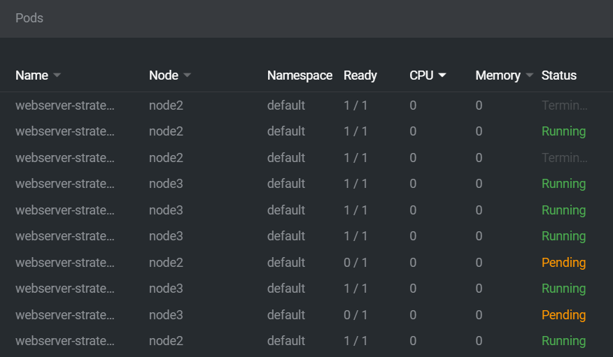
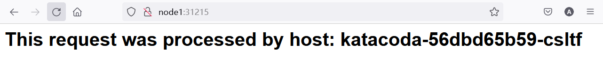
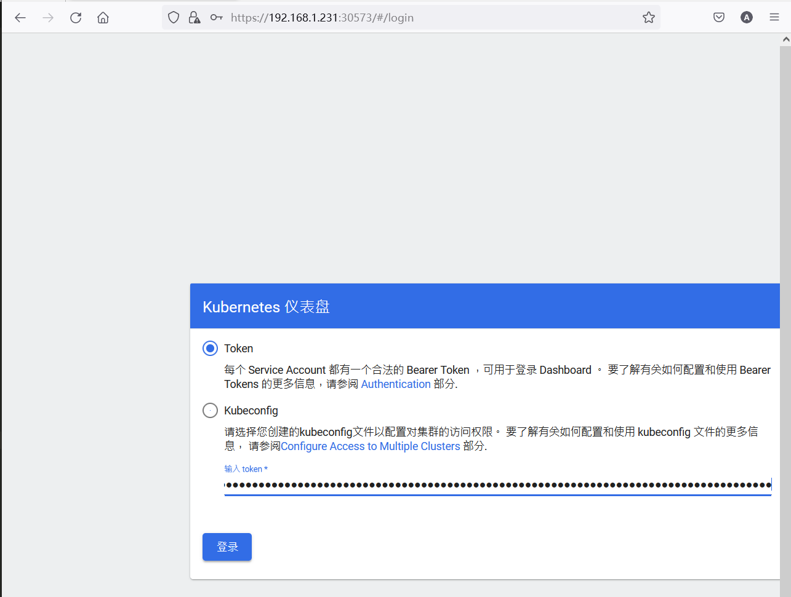
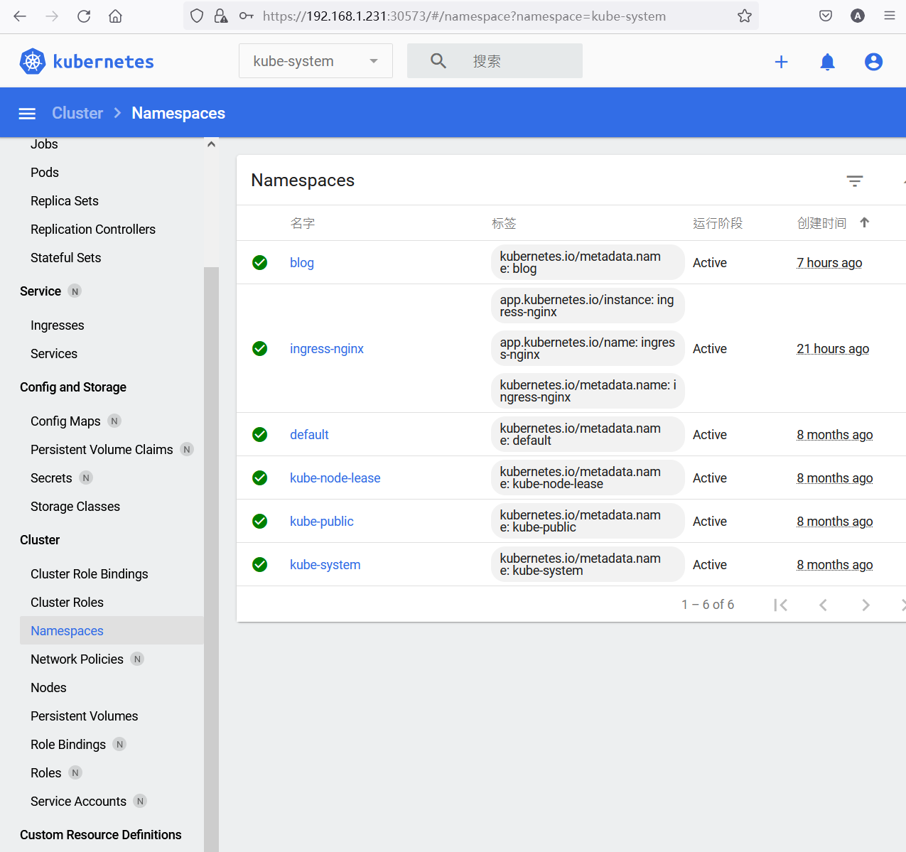

# K8S 群集的安装

## 手动安装 1.23

环境说明:

- 虚拟机硬件规格: 4CPU 8G 内存 127G 硬盘空间
- 虚拟机数量: 3台
- 虚拟机操作系统: Ubuntu 20.04
- 虚拟化平台: hyper-v
- 三台虚拟机的命名为node 1 node 2 node3 其中 node1 为 master 承载控制平面,其余两台机器 node2 node3 作为 work node 运行主句平面
- 三台虚拟机的 ip 地址分别为 192.168.1.231 192.168.1.232  192.168.1.233

### 系统基本配置

关闭 swap

```bash
sudo swapoff -a

sudo rm /swap.img
```


编辑配置文件

```bash
nano /etc/fstab 
```


注释最后一行

```text
# / was on /dev/vda1 during installation
```

 

配置主机名, 以 master 为例

```bash
hostnamectl set-hostname node1
```


设置静态 IP 地址

安装nmcli

```bash
apt install network-manager -y 
```

修改配置文件

```bash
nano /etc/netplan/01-netcfg.yaml
```


```yaml
network:
    version: 2
    renderer: NetworkManager
    ethernets:
        eth0:
            dhcp4: no #设置成no
        eth1:
            dhcp4: true
        eth2:
            dhcp4: true
        eth3:
            dhcp4: true
        eth4:
            dhcp4: true
```


```
nano /etc/netplan/00-installer-config.yaml
```


```yaml
network:
  version: 2
  ethernets:
    eth0:   # 配置的网卡的名称
      addresses: [192.168.1.231/24]   # 配置的静态ip地址和掩码
      dhcp4: no    # 关闭dhcp4
      optional: true
      gateway4: 192.168.1.1 # 网关地址
      nameservers:
        addresses: [192.168.1.1]  # DNS服务器地址，多个DNS服务器地址需要用英文逗号分隔开，可不配置
```


使静态 IP 配置生效

```bash
netplan apply
```


设置静态名称解析,考虑到后续会使用 node2 作为 `nfs` 服务器,此处预先做好名称解析

```bash
cat >> /etc/hosts << EOF
192.168.1.231 node1
192.168.1.232 node2 nfs
192.168.1.233 node3
EOF
```


修改 apt 源

```bash
sudo nano /etc/apt/sources.list
```

清空/etc/apt/sources.list，并添加如下内容,如果是在阿里云上的vm，这步可以跳过


```text
deb Index of /ubuntu/ bionic main restricted universe multiverse
deb-src Index of /ubuntu/ bionic main restricted universe multiverse

deb Index of /ubuntu/ bionic-security main restricted universe multiverse
deb-src Index of /ubuntu/ bionic-security main restricted universe multiverse

deb Index of /ubuntu/ bionic-updates main restricted universe multiverse
deb-src Index of /ubuntu/ bionic-updates main restricted universe multiverse

deb Index of /ubuntu/ bionic-proposed main restricted universe multiverse
deb-src Index of /ubuntu/ bionic-proposed main restricted universe multiverse

deb Index of /ubuntu/ bionic-backports main restricted universe multiverse
deb-src Index of /ubuntu/ bionic-backports main restricted universe multiverse
```


执行 apt 源更新操作

```bash
apt update -y 
```


### 调整系统设置

清空防火墙规则

```bash
iptables -F
```


\5. 修改内核参数

```bash
apt-get install procps
```


```bash
nano /etc/sysctl.d/k8s.conf
```


```bash
net.ipv4.ip_forward = 1
vm.swappiness = 0
```


```bash
sysctl -p /etc/sysctl.d/k8s.conf
```


加载内核模块

```bash
cat > /etc/modules-load.d/modules.conf <<EOF
br_netfilter
ip_vs
ip_vs_rr
ip_vs_wrr
ip_vs_sh
nf_conntrack_ipv4
EOF
```


```bash
for i in br_netfilter ip_vs ip_vs_rr ip_vs_wrr ip_vs_sh nf_conntrack_ipv4;do modprobe $i;done
```

对于 20.04 之后的系统,此处可能有报错,但是不影响最终安装


### 安装容器运行时

 安装 docker, (1.23 还能支持 docker 作为容器运行时, 考虑到 docker 可以兼容更多的实验场景, 所以此例中保留使用 docker)

```bash
apt -y install apt-transport-https ca-certificates curl software-properties-common
```


```bash
curl -fsSL https://mirrors.aliyun.com/docker-ce/linux/ubuntu/gpg | sudo apt-key add -
sudo add-apt-repository "deb [arch=amd64] https://mirrors.aliyun.com/docker-ce/linux/ubuntu $(lsb_release -cs) stable"
```


```bash
apt update -y 
apt install docker-ce -y 
```


可选, 国际互联网直达安装方式

```bash
# curl -sSL https://get.docker.com/ | sh
# usermod -aG docker chengzh
```


```bash
mkdir /etc/docker
```


```bash
cat > /etc/docker/daemon.json << EOF
{
    "exec-opts": ["native.cgroupdriver=systemd"],
    "log-driver": "json-file",
    "log-opts": {
        "max-size": "100m",
        "max-file": "10"
    },
    "registry-mirrors": ["https://pqbap4ya.mirror.aliyuncs.com"]
}
EOF
```


```bash
systemctl restart docker
systemctl enable docker
```


### 安装 kubeadm、kubectl、kubelet

```
apt-get update && apt-get install -y apt-transport-https
```


```bash
root@node1:~# apt-get update && apt-get install -y apt-transport-https
Hit:1 http://repo.huaweicloud.com/ubuntu focal InRelease
Hit:2 http://repo.huaweicloud.com/ubuntu focal-updates InRelease
Hit:3 http://repo.huaweicloud.com/ubuntu focal-backports InRelease
Hit:4 http://repo.huaweicloud.com/ubuntu focal-security InRelease
Hit:5 https://mirrors.aliyun.com/docker-ce/linux/ubuntu focal InRelease
Hit:6 https://mirrors.aliyun.com/kubernetes/apt kubernetes-xenial InRelease
Reading package lists... Done
Reading package lists... Done
Building dependency tree
Reading state information... Done
apt-transport-https is already the newest version (2.0.9).
0 upgraded, 0 newly installed, 0 to remove and 171 not upgraded.
```


```bash
curl https://mirrors.aliyun.com/kubernetes/apt/doc/apt-key.gpg | apt-key add - 
```


```bash
root@node1:~# curl https://mirrors.aliyun.com/kubernetes/apt/doc/apt-key.gpg | apt-key add -
  % Total    % Received % Xferd  Average Speed   Time    Time     Time  Current
                                 Dload  Upload   Total   Spent    Left  Speed
100  2426  100  2426    0     0  20913      0 --:--:-- --:--:-- --:--:-- 20913
OK
```


```bash
cat > /etc/apt/sources.list.d/kubernetes.list << EOF 
deb https://mirrors.aliyun.com/kubernetes/apt/ kubernetes-xenial main
EOF
```


```bash
apt update -y 
```


```bash
root@node1:~# cat > /etc/apt/sources.list.d/kubernetes.list << EOF
> deb https://mirrors.aliyun.com/kubernetes/apt/ kubernetes-xenial main
> EOF
root@node1:~# apt update -y
Hit:1 http://repo.huaweicloud.com/ubuntu focal InRelease
Hit:2 http://repo.huaweicloud.com/ubuntu focal-updates InRelease
Hit:3 http://repo.huaweicloud.com/ubuntu focal-backports InRelease
Hit:4 http://repo.huaweicloud.com/ubuntu focal-security InRelease
Hit:5 https://mirrors.aliyun.com/docker-ce/linux/ubuntu focal InRelease
Hit:6 https://mirrors.aliyun.com/kubernetes/apt kubernetes-xenial InRelease
Reading package lists... Done
Building dependency tree
Reading state information... Done
171 packages can be upgraded. Run 'apt list --upgradable' to see them.
```


```bash
apt-cache madison kubelet
```


```bash
root@node1:~# apt-cache madison kubelet
   kubelet |  1.26.0-00 | https://mirrors.aliyun.com/kubernetes/apt kubernetes-xenial/main amd64 Packages
   kubelet |  1.25.5-00 | https://mirrors.aliyun.com/kubernetes/apt kubernetes-xenial/main amd64 Packages
   kubelet |  1.25.4-00 | https://mirrors.aliyun.com/kubernetes/apt kubernetes-xenial/main amd64 Packages
   kubelet |  1.25.3-00 | https://mirrors.aliyun.com/kubernetes/apt kubernetes-xenial/main amd64 Packages
   kubelet |  1.25.2-00 | https://mirrors.aliyun.com/kubernetes/apt kubernetes-xenial/main amd64 Packages
   kubelet |  1.25.1-00 | https://mirrors.aliyun.com/kubernetes/apt kubernetes-xenial/main amd64 Packages
   kubelet |  1.25.0-00 | https://mirrors.aliyun.com/kubernetes/apt kubernetes-xenial/main amd64 Packages
   kubelet |  1.24.9-00 | https://mirrors.aliyun.com/kubernetes/apt kubernetes-xenial/main amd64 Packages
   kubelet |  1.24.8-00 | https://mirrors.aliyun.com/kubernetes/apt kubernetes-xenial/main amd64 Packages
   kubelet |  1.24.7-00 | https://mirrors.aliyun.com/kubernetes/apt kubernetes-xenial/main amd64 Packages
   kubelet |  1.24.6-00 | https://mirrors.aliyun.com/kubernetes/apt kubernetes-xenial/main amd64 Packages
   kubelet |  1.24.5-00 | https://mirrors.aliyun.com/kubernetes/apt kubernetes-xenial/main amd64 Packages
   kubelet |  1.24.4-00 | https://mirrors.aliyun.com/kubernetes/apt kubernetes-xenial/main amd64 Packages
   kubelet |  1.24.3-00 | https://mirrors.aliyun.com/kubernetes/apt kubernetes-xenial/main amd64 Packages
   kubelet |  1.24.2-00 | https://mirrors.aliyun.com/kubernetes/apt kubernetes-xenial/main amd64 Packages
   kubelet |  1.24.1-00 | https://mirrors.aliyun.com/kubernetes/apt kubernetes-xenial/main amd64 Packages
   kubelet |  1.24.0-00 | https://mirrors.aliyun.com/kubernetes/apt kubernetes-xenial/main amd64 Packages
   kubelet | 1.23.15-00 | https://mirrors.aliyun.com/kubernetes/apt kubernetes-xenial/main amd64 Packages
   kubelet | 1.23.14-00 | https://mirrors.aliyun.com/kubernetes/apt kubernetes-xenial/main amd64 Packages
   kubelet | 1.23.13-00 | https://mirrors.aliyun.com/kubernetes/apt kubernetes-xenial/main amd64 Packages
   kubelet | 1.23.12-00 | https://mirrors.aliyun.com/kubernetes/apt kubernetes-xenial/main amd64 Packages
   kubelet | 1.23.11-00 | https://mirrors.aliyun.com/kubernetes/apt kubernetes-xenial/main amd64 Packages
   kubelet | 1.23.10-00 | https://mirrors.aliyun.com/kubernetes/apt kubernetes-xenial/main amd64 Packages
   kubelet |  1.23.9-00 | https://mirrors.aliyun.com/kubernetes/apt kubernetes-xenial/main amd64 Packages
   kubelet |  1.23.8-00 | https://mirrors.aliyun.com/kubernetes/apt kubernetes-xenial/main amd64 Packages
   kubelet |  1.23.7-00 | https://mirrors.aliyun.com/kubernetes/apt kubernetes-xenial/main amd64 Packages
   kubelet |  1.23.6-00 | https://mirrors.aliyun.com/kubernetes/apt kubernetes-xenial/main amd64 Packages
   kubelet |  1.23.5-00 | https://mirrors.aliyun.com/kubernetes/apt kubernetes-xenial/main amd64 Packages
   kubelet |  1.23.4-00 | https://mirrors.aliyun.com/kubernetes/apt kubernetes-xenial/main amd64 Packages
   kubelet |  1.23.3-00 | https://mirrors.aliyun.com/kubernetes/apt kubernetes-xenial/main amd64 Packages
   kubelet |  1.23.2-00 | https://mirrors.aliyun.com/kubernetes/apt kubernetes-xenial/main amd64 Packages
   kubelet |  1.23.1-00 | https://mirrors.aliyun.com/kubernetes/apt kubernetes-xenial/main amd64 Packages
   kubelet |  1.23.0-00 | https://mirrors.aliyun.com/kubernetes/apt kubernetes-xenial/main amd64 Packages
   kubelet | 1.22.17-00 | https://mirrors.aliyun.com/kubernetes/apt kubernetes-xenial/main amd64 Packages
```


安装 `1.23.00` 

```bash
apt install -y kubelet=1.23.0-00 kubeadm=1.23.0-00  kubectl=1.23.0-00
```


可选:安装当前最新版本 

```text
apt install -y kubelet kubeadm kubectl
```


### 安装数据平面

启用`master` (只在 `node1` 上操作)


```bash
kubeadm config print init-defaults  > kubeadm-config.yaml
```


```bash
nano kubeadm-config.yaml
```


```yaml
apiVersion: kubeadm.k8s.io/v1beta3
bootstrapTokens:
- groups:
  - system:bootstrappers:kubeadm:default-node-token
  token: abcdef.0123456789abcdef
  ttl: 24h0m0s
  usages:
  - signing
  - authentication
kind: InitConfiguration
localAPIEndpoint:
  advertiseAddress: 192.168.1.231 # 替换为node1 ip
  bindPort: 6443
nodeRegistration:
  criSocket: /var/run/dockershim.sock
  imagePullPolicy: IfNotPresent
  name: node1 # 注意主机名
  taints: null
---
apiServer:
  timeoutForControlPlane: 4m0s
apiVersion: kubeadm.k8s.io/v1beta3
certificatesDir: /etc/kubernetes/pki
clusterName: kubernetes
controllerManager: {}
dns: {}
etcd:
  local:
    dataDir: /var/lib/etcd
imageRepository: registry.cn-hangzhou.aliyuncs.com/google_containers # 替换为aliyun源
kind: ClusterConfiguration
kubernetesVersion: 1.23.0 # 注意版本号
networking:
  dnsDomain: cluster.local
  serviceSubnet: 10.96.0.0/12
  podSubnet: 10.244.0.0/16 # 增加podSubnet
scheduler: {}
```


初始化控制平面

```bash
kubeadm init --config kubeadm-config.yaml
```


```bash
root@node1:~# kubeadm init --config kubeadm-config.yaml
[init] Using Kubernetes version: v1.23.0
[preflight] Running pre-flight checks
[preflight] Pulling images required for setting up a Kubernetes cluster
[preflight] This might take a minute or two, depending on the speed of your internet connection
[preflight] You can also perform this action in beforehand using 'kubeadm config images pull'
[certs] Using certificateDir folder "/etc/kubernetes/pki"
[certs] Generating "ca" certificate and key
[certs] Generating "apiserver" certificate and key
[certs] apiserver serving cert is signed for DNS names [kubernetes kubernetes.default kubernetes.default.svc kubernetes.default.svc.cluster.local node1] and IPs [10.96.0.1 192.168.1.231]
[certs] Generating "apiserver-kubelet-client" certificate and key
[certs] Generating "front-proxy-ca" certificate and key
[certs] Generating "front-proxy-client" certificate and key
[certs] Generating "etcd/ca" certificate and key
[certs] Generating "etcd/server" certificate and key
[certs] etcd/server serving cert is signed for DNS names [localhost node1] and IPs [192.168.1.231 127.0.0.1 ::1]
[certs] Generating "etcd/peer" certificate and key
[certs] etcd/peer serving cert is signed for DNS names [localhost node1] and IPs [192.168.1.231 127.0.0.1 ::1]
[certs] Generating "etcd/healthcheck-client" certificate and key
[certs] Generating "apiserver-etcd-client" certificate and key
[certs] Generating "sa" key and public key
[kubeconfig] Using kubeconfig folder "/etc/kubernetes"
[kubeconfig] Writing "admin.conf" kubeconfig file
[kubeconfig] Writing "kubelet.conf" kubeconfig file
[kubeconfig] Writing "controller-manager.conf" kubeconfig file
[kubeconfig] Writing "scheduler.conf" kubeconfig file
[kubelet-start] Writing kubelet environment file with flags to file "/var/lib/kubelet/kubeadm-flags.env"
[kubelet-start] Writing kubelet configuration to file "/var/lib/kubelet/config.yaml"
[kubelet-start] Starting the kubelet
[control-plane] Using manifest folder "/etc/kubernetes/manifests"
[control-plane] Creating static Pod manifest for "kube-apiserver"
[control-plane] Creating static Pod manifest for "kube-controller-manager"
[control-plane] Creating static Pod manifest for "kube-scheduler"
[etcd] Creating static Pod manifest for local etcd in "/etc/kubernetes/manifests"
[wait-control-plane] Waiting for the kubelet to boot up the control plane as static Pods from directory "/etc/kubernetes/manifests". This can take up to 4m0s
[apiclient] All control plane components are healthy after 7.002121 seconds
[upload-config] Storing the configuration used in ConfigMap "kubeadm-config" in the "kube-system" Namespace
[kubelet] Creating a ConfigMap "kubelet-config-1.23" in namespace kube-system with the configuration for the kubelets in the cluster
NOTE: The "kubelet-config-1.23" naming of the kubelet ConfigMap is deprecated. Once the UnversionedKubeletConfigMap feature gate graduates to Beta the default name will become just "kubelet-config". Kubeadm upgrade will handle this transition transparently.
[upload-certs] Skipping phase. Please see --upload-certs
[mark-control-plane] Marking the node node1 as control-plane by adding the labels: [node-role.kubernetes.io/master(deprecated) node-role.kubernetes.io/control-plane node.kubernetes.io/exclude-from-external-load-balancers]
[mark-control-plane] Marking the node node1 as control-plane by adding the taints [node-role.kubernetes.io/master:NoSchedule]
[bootstrap-token] Using token: abcdef.0123456789abcdef
[bootstrap-token] Configuring bootstrap tokens, cluster-info ConfigMap, RBAC Roles
[bootstrap-token] configured RBAC rules to allow Node Bootstrap tokens to get nodes
[bootstrap-token] configured RBAC rules to allow Node Bootstrap tokens to post CSRs in order for nodes to get long term certificate credentials
[bootstrap-token] configured RBAC rules to allow the csrapprover controller automatically approve CSRs from a Node Bootstrap Token
[bootstrap-token] configured RBAC rules to allow certificate rotation for all node client certificates in the cluster
[bootstrap-token] Creating the "cluster-info" ConfigMap in the "kube-public" namespace
[kubelet-finalize] Updating "/etc/kubernetes/kubelet.conf" to point to a rotatable kubelet client certificate and key
[addons] Applied essential addon: CoreDNS
[addons] Applied essential addon: kube-proxy

Your Kubernetes control-plane has initialized successfully!

To start using your cluster, you need to run the following as a regular user:

  mkdir -p $HOME/.kube
  sudo cp -i /etc/kubernetes/admin.conf $HOME/.kube/config
  sudo chown $(id -u):$(id -g) $HOME/.kube/config

Alternatively, if you are the root user, you can run:

  export KUBECONFIG=/etc/kubernetes/admin.conf

You should now deploy a pod network to the cluster.
Run "kubectl apply -f [podnetwork].yaml" with one of the options listed at:
  https://kubernetes.io/docs/concepts/cluster-administration/addons/

Then you can join any number of worker nodes by running the following on each as root:

kubeadm join 192.168.1.231:6443 --token abcdef.0123456789abcdef \
        --discovery-token-ca-cert-hash sha256:9fdb7cd01761c26967244a421b1eb45c0ab1949c10016707c53d8477f76375a7
```


配置访问群集

```bash
mkdir -p $HOME/.kube
cp -i /etc/kubernetes/admin.conf $HOME/.kube/config
chown $(id -u):$(id -u) $HOME/.kube/config
```


部署网络插件


```bash
kubectl create -f https://raw.githubusercontent.com/cloudzun/k8slab/main/install/calico.yaml
```


```bash
curl https://docs.projectcalico.org/manifests/calico.yaml -O
kubectl apply -f calico.yaml
```


```bash
root@node1:~# curl https://docs.projectcalico.org/manifests/calico.yaml -O
  % Total    % Received % Xferd  Average Speed   Time    Time     Time  Current
                                 Dload  Upload   Total   Spent    Left  Speed
100  229k  100  229k    0     0   313k      0 --:--:-- --:--:-- --:--:--  313k
root@node1:~# kubectl apply -f calico.yaml
poddisruptionbudget.policy/calico-kube-controllers created
serviceaccount/calico-kube-controllers created
serviceaccount/calico-node created
configmap/calico-config created
customresourcedefinition.apiextensions.k8s.io/bgpconfigurations.crd.projectcalico.org created
customresourcedefinition.apiextensions.k8s.io/bgppeers.crd.projectcalico.org created
customresourcedefinition.apiextensions.k8s.io/blockaffinities.crd.projectcalico.org created
customresourcedefinition.apiextensions.k8s.io/caliconodestatuses.crd.projectcalico.org created
customresourcedefinition.apiextensions.k8s.io/clusterinformations.crd.projectcalico.org created
customresourcedefinition.apiextensions.k8s.io/felixconfigurations.crd.projectcalico.org created
customresourcedefinition.apiextensions.k8s.io/globalnetworkpolicies.crd.projectcalico.org created
customresourcedefinition.apiextensions.k8s.io/globalnetworksets.crd.projectcalico.org created
customresourcedefinition.apiextensions.k8s.io/hostendpoints.crd.projectcalico.org created
customresourcedefinition.apiextensions.k8s.io/ipamblocks.crd.projectcalico.org created
customresourcedefinition.apiextensions.k8s.io/ipamconfigs.crd.projectcalico.org created
customresourcedefinition.apiextensions.k8s.io/ipamhandles.crd.projectcalico.org created
customresourcedefinition.apiextensions.k8s.io/ippools.crd.projectcalico.org created
customresourcedefinition.apiextensions.k8s.io/ipreservations.crd.projectcalico.org created
customresourcedefinition.apiextensions.k8s.io/kubecontrollersconfigurations.crd.projectcalico.org created
customresourcedefinition.apiextensions.k8s.io/networkpolicies.crd.projectcalico.org created
customresourcedefinition.apiextensions.k8s.io/networksets.crd.projectcalico.org created
clusterrole.rbac.authorization.k8s.io/calico-kube-controllers created
clusterrole.rbac.authorization.k8s.io/calico-node created
clusterrolebinding.rbac.authorization.k8s.io/calico-kube-controllers created
clusterrolebinding.rbac.authorization.k8s.io/calico-node created
daemonset.apps/calico-node created
deployment.apps/calico-kube-controllers created
```


记录 kubeadmin join

```bash
kubeadm join 192.168.1.231:6443 --token abcdef.0123456789abcdef \
        --discovery-token-ca-cert-hash sha256:9fdb7cd01761c26967244a421b1eb45c0ab1949c10016707c53d8477f76375a7
```


### 加入节点到群集及基本检查

在 node2 node3 上运行以下命令加入到群集

```bash
kubeadm join 192.168.1.231:6443 --token abcdef.0123456789abcdef \
        --discovery-token-ca-cert-hash sha256:9fdb7cd01761c26967244a421b1eb45c0ab1949c10016707c53d8477f76375a7
```


在所有节点上设置 kubelet 自动启动

```bash
systemctl enable kubelet
```


检查节点状态

```bash
kubectl get node -o wide
```


```bash
root@node1:~# kubectl get node -o wide
NAME    STATUS   ROLES                  AGE     VERSION   INTERNAL-IP     EXTERNAL-IP   OS-IMAGE             KERNEL-VERSION      CONTAINER-RUNTIME
node1   Ready    control-plane,master   13m     v1.23.0   192.168.1.231   <none>        Ubuntu 20.04.4 LTS   5.4.0-107-generic   docker://20.10.14
node2   Ready    <none>                 2m19s   v1.23.0   192.168.1.232   <none>        Ubuntu 20.04.4 LTS   5.4.0-107-generic   docker://20.10.14
node3   Ready    <none>                 2m19s   v1.23.0   192.168.1.233   <none>        Ubuntu 20.04.4 LTS   5.4.0-107-generic   docker://20.10.14
```


检查 pod 运行状态

```
kubectl get pod -n kube-system -o wide
```


```bash
root@node1:~# kubectl get pod -n kube-system -o wide
NAME                                       READY   STATUS    RESTARTS   AGE     IP               NODE    NOMINATED NODE   READINESS GATES
calico-kube-controllers-7b8458594b-x2xqk   1/1     Running   0          9m22s   10.244.166.131   node1   <none>           <none>
calico-node-fslt9                          1/1     Running   0          6m10s   192.168.1.232    node2   <none>           <none>
calico-node-hn9jk                          1/1     Running   0          9m22s   192.168.1.231    node1   <none>           <none>
calico-node-s6mlj                          1/1     Running   0          6m10s   192.168.1.233    node3   <none>           <none>
coredns-65c54cc984-6c8lv                   1/1     Running   0          17m     10.244.166.130   node1   <none>           <none>
coredns-65c54cc984-w6hjd                   1/1     Running   0          17m     10.244.166.129   node1   <none>           <none>
etcd-node1                                 1/1     Running   0          17m     192.168.1.231    node1   <none>           <none>
kube-apiserver-node1                       1/1     Running   0          17m     192.168.1.231    node1   <none>           <none>
kube-controller-manager-node1              1/1     Running   0          17m     192.168.1.231    node1   <none>           <none>
kube-proxy-km7bd                           1/1     Running   0          17m     192.168.1.231    node1   <none>           <none>
kube-proxy-ph8nf                           1/1     Running   0          6m10s   192.168.1.232    node2   <none>           <none>
kube-proxy-tgb7w                           1/1     Running   0          6m10s   192.168.1.233    node3   <none>           <none>
kube-scheduler-node1                       1/1     Running   0          17m     192.168.1.231    node1   <none>           <none>
```


创建测试用deployment

```bash
kubectl create deployment katacoda --image=katacoda/docker-http-server --replicas=3
```


查看pod创建过程

```bash
kubectl get pod -o wide
```


```bash
root@node1:~# kubectl get pod -o wide
NAME                        READY   STATUS    RESTARTS   AGE     IP             NODE    NOMINATED NODE   READINESS GATES
katacoda-56dbd65b59-b98h7   1/1     Running   0          2m40s   10.244.135.1   node3   <none>           <none>
katacoda-56dbd65b59-cvvr8   1/1     Running   0          2m40s   10.244.104.1   node2   <none>           <none>
katacoda-56dbd65b59-d274w   1/1     Running   0          2m40s   10.244.135.2   node3   <none>           <none>
```

关注pod的ip地址以及所处节点


尝试访问不同节点上的pod

```text
curl 10.244.104.1

curl 10.244.135.2
```


如果有类似以下显示则没问题

```bash
root@node1:~# curl 10.244.104.1
<h1>This request was processed by host: katacoda-56dbd65b59-cvvr8</h1>
root@node1:~# curl 10.244.135.2
<h1>This request was processed by host: katacoda-56dbd65b59-d274w</h1>
```


### 常见安装问题

如果只有一台机器,需要做单节点群集,输入以下命令即可

```bash
kubectl taint node node1 node-role.kubernetes.io/master-
```


节点加入群集之后始终无法ready，使用以下步骤逐出群集

```bash
kubectl drain k8s-0005 --delete-local-data --force --ignore-daemonsets
kubectl delete node  k8s-0005
```


重新加入群集

```bash
kubeadm join …………
```


忘记join key

```bash
kubeadm token create  --print-join-command
```


清理此前的安装痕迹

```bash
kubeadm reset
```


## 手动安装 1.27


### 环境说明

**硬件环境**

- 虚拟机硬件规格: 4CPU 8G 内存 127G 硬盘空间
- 虚拟机数量: 3台
- 虚拟机操作系统: Ubuntu 20.04
- 虚拟化平台: hyper-v
- 三台虚拟机的命名为node 1 node 2 node3 其中 node1 为 master 承载控制平面,其余两台机器 node2 node3 作为 work node 
- 三台虚拟机的 ip 地址分别为 192.168.1.231 192.168.1.232 192.168.1.233

**组件版本**

- kubernetes：1.27.2
- containerd：1.7
- runc：1.1.3
- libeseccomp：2.5.4
- etcd：3.5.7

**安装包资源**

链接：https://pan.baidu.com/s/1ohbRCxv3sAtog25wr4nBhQ 
提取码：5e6n

请从上述连接下载所需资源，首先安装MobaXterm作为ssh terminal
将这一节涉及的安装包和yaml文件上传到到每个节点


### **节点基本配置**

配置主机名, 以 master 为例

```shell
hostnamectl set-hostname node1
```

设置静态 IP 地址

安装nmcli

```shell
apt install network-manager -y 
```


修改配置文件

```shell
nano /etc/netplan/01-netcfg.yaml
```

```yaml
network:
    version: 2
    renderer: NetworkManager
    ethernets:
        eth0:
            dhcp4: no #设置成no
        eth1:
            dhcp4: true
        eth2:
            dhcp4: true
        eth3:
            dhcp4: true
        eth4:
            dhcp4: true
```


```
nano /etc/netplan/00-installer-config.yaml
```

```yaml
network:
  version: 2
  ethernets:
    eth0:   # 配置的网卡的名称
      addresses: [192.168.1.231/24]   # 配置的静态ip地址和掩码
      dhcp4: no    # 关闭dhcp4
      optional: true
      gateway4: 192.168.1.1 # 网关地址
      nameservers:
        addresses: [192.168.1.1]  # DNS服务器地址，多个DNS服务器地址需要用英文逗号分隔开，可不配置
```


使静态 IP 配置生效

```shell
netplan apply
```


设置静态名称解析,考虑到后续会使用 node2 作为 `nfs` 服务器,此处预先做好名称解析

```shell
cat >> /etc/hosts << EOF
192.168.1.231 node1
192.168.1.232 node2 nfs
192.168.1.233 node3
EOF
```


### 安装containerd

安装容器运行时containerd

```bash
tar Cxzvf /usr/local containerd-1.7.0-linux-amd64.tar.gz
```


(可选)

```bash
wget https://github.com/containerd/containerd/releases/download/v1.7.0/containerd-1.7.0-linux-amd64.tar.gz
tar Cxzvf /usr/local containerd-1.7.0-linux-amd64.tar.gz
```


创建启动containerd的systemd服务
```bash
cat << EOF >> /lib/systemd/system/containerd.service
[Unit]
Description=containerd container runtime
Documentation=https://containerd.io
After=network.target local-fs.target

[Service]
ExecStartPre=-/sbin/modprobe overlay
ExecStart=/usr/local/bin/containerd

Type=notify
Delegate=yes
KillMode=process
Restart=always
RestartSec=5
# Having non-zero Limit*s causes performance problems due to accounting overhead
# in the kernel. We recommend using cgroups to do container-local accounting.
LimitNPROC=infinity
LimitCORE=infinity
LimitNOFILE=infinity
# Comment TasksMax if your systemd version does not supports it.
# Only systemd 226 and above support this version.
TasksMax=infinity
OOMScoreAdjust=-999

[Install]
WantedBy=multi-user.target
EOF
```


containerd服务开机自启

```bash
systemctl daemon-reload
systemctl enable --now containerd
```


配置containerd的配置文件，并启动containerd服务

```bash
mkdir -p /etc/containerd
containerd config default | tee /etc/containerd/config.toml
str1="registry.k8s.io/pause:3.8"
str2="registry.aliyuncs.com/google_containers/pause:3.9"
sed -i "/sandbox_image/ s%${str1}%${str2}%g" /etc/containerd/config.toml
sed -i '/SystemdCgroup/ s/false/true/g' /etc/containerd/config.toml
systemctl restart containerd && systemctl status containerd
```


### 安装runc和cni

快捷步骤
```bash
install -m 755 runc.amd64 /usr/local/sbin/runc
```

```bash
mkdir -p /opt/cni/bin
tar xf  cni-plugins-linux-amd64-v1.1.1.tgz -C /opt/cni/bin/
```


可选步骤

```bash
wget https://github.com/opencontainers/runc/releases/download/v1.1.3/runc.amd64
install -m 755 runc.amd64 /usr/local/sbin/runc
```

```bash
wget https://github.com/containernetworking/plugins/releases/download/v1.1.1/cni-plugins-linux-amd64-v1.1.1.tgz
mkdir -p /opt/cni/bin
tar xf  cni-plugins-linux-amd64-v1.1.1.tgz -C /opt/cni/bin/
```


### 节点系统设置

关闭临时分区
```bash
swapoff -a
sed -i '/swap/ s%/swap%#/swap%g' /etc/fstab
```

这两个命令分别用于关闭 Linux 系统的 swap 分区和修改 /etc/fstab 文件来防止系统重启后自动开启 swap 分区。

第一个命令 `swapoff -a` 的作用是关闭所有的 swap 分区。这个命令通常在部署 Kubernetes 等要求不使用 swap 分区的应用时使用，因为 Kubernetes 默认不支持 swap 分区。`-a` 参数表示关闭所有的 swap 分区。此操作会将 swap 分区中的数据移到内存中。

第二个命令 `sed -i '/swap/ s%/swap%#/swap%g' /etc/fstab` 用于修改 /etc/fstab 文件。/etc/fstab 是一个配置文件，用于描述系统中的分区和文件系统，以及它们的挂载选项和自动挂载设置。

- `sed` 是一个流编辑器（stream editor），可以用来对文本文件进行修改操作。
- `-i`：表示对原始文件进行直接修改，而不是输出到标准输出。
- `'/swap/ s%/swap%#/swap%g'`：这是 `sed` 命令的主要操作部分。
  * `'/swap/'`：表示查找包含字符串 "swap" 的行。
  * `s%[pattern]%[replacement]%g`：是一个替换操作。`s` 表示替换，`g` 表示全局替换。`%` 作为分隔符，也可以使用其他字符如 `/`、`:` 等。
    + `[pattern]`：表示需要查找的字符串，这里是 "/swap"。
    + `[replacement]`：表示替换后的字符串，这里是 "#/swap"。
  * 这个操作的意思是将 `/swap` 替换为 `#/swap`，用 "#" 注释掉 swap 相关的行，防止系统在启动时自动挂载 swap 分区。

这两个命令的目的是为了满足 Kubernetes 对 swap 分区的特殊要求，在部署 Kubernetes 前执行这两个命令可以确保 swap 分区被禁用。在 Kubernetes 集群中禁用 swap 分区有助于提高性能和保证资源分配的准确性。


修改内核参数

```bash
modprobe overlay
modprobe br_netfilter
cat <<EOF >> /etc/modules-load.d/k8s.conf
overlay
br_netfilter
EOF
cat <<EOF >> /etc/sysctl.d/k8s.conf
net.bridge.bridge-nf-call-ip6tables = 1
net.bridge.bridge-nf-call-iptables = 1
net.ipv4.ip_forward = 1
EOF
sysctl --system
```

这些命令用于加载一些模块和设置某些内核参数，以便满足 Kubernetes 网络设置的要求。下面是每个命令的详细解释：

1. `modprobe overlay`：加载 overlay 文件系统模块。overlay 文件系统允许将多个目录融合在一起，提供统一的视图。这对于 Docker 和 Kubernetes 运行容器时的文件系统是必需的。

2. `modprobe br_netfilter`：加载 br_netfilter 模块。这个模块是用于在桥接网络设备上进行 iptables 删选的，对于 Kubernetes 网络实现（如Flannel、Calico等）是必需的。

3. 将 "overlay" 和 "br_netfilter" 模块添加到 `/etc/modules-load.d/k8s.conf` 文件中。`/etc/modules-load.d/` 目录下的配置文件用于指定系统启动时需要自动加载的内核模块。这样，在系统启动时这些模块会被自动加载。

4. 将一些针对 Kubernetes 网络设置的内核参数添加到 `/etc/sysctl.d/k8s.conf` 文件中：
   - `net.bridge.bridge-nf-call-ip6tables = 1`：允许在桥接网络中应用 ip6tables 规则。
   - `net.bridge.bridge-nf-call-iptables = 1`：允许在桥接网络中应用 iptables 规则。
   - `net.ipv4.ip_forward = 1`：启用 IPv4 包转发。这对于实现 Kubernetes 集群内不同节点间的网络通信是必需的。

   `/etc/sysctl.d/` 目录下的配置文件用于设置和覆盖系统默认的内核参数。

5. `sysctl --system`：应用所有配置文件中的内核参数设置。这个命令会读取 `/etc/sysctl.d/` 和其他相关目录下的所有配置文件，并为内核参数应用这些设置。这样我们刚才添加的针对 Kubernetes 的内核参数设置就会生效。

总之，这些命令的目的是加载必要的内核模块和设置内核参数，以满足 Kubernetes 网络要求。这些设置对于运行 Kubernetes 集群中的容器和实现集群内的网络通信非常重要。


### 安装 kubeadm、kubectl、kubelet

更新apt源，添加国内aliyun源

```bash
apt-get update && apt-get install -y apt-transport-https ca-certificates
curl https://mirrors.aliyun.com/kubernetes/apt/doc/apt-key.gpg | apt-key add - 
cat <<EOF >/etc/apt/sources.list.d/kubernetes.list
deb https://mirrors.aliyun.com/kubernetes/apt/ kubernetes-xenial main
EOF
apt-get update
```

这组命令执行的是在一个基于 Debian（例如 Ubuntu）的 Linux 系统上安装 Kubernetes 相关软件的操作。下面是对这些命令的解释：

1. `apt-get update`：更新系统的软件包列表，确保可以获取到最新的可用软件包版本。
2. `apt-get install -y apt-transport-https ca-certificates`：安装 `apt-transport-https` 和 `ca-certificates` 软件包。`apt-transport-https` 允许从支持 HTTPS 的存储库下载软件包，`ca-certificates` 提供了一组受信任的根证书，用于在系统上验证 SSL/TLS 证书。
3. `curl https://mirrors.aliyun.com/kubernetes/apt/doc/apt-key.gpg | apt-key add -`：从阿里云镜像站点下载 Kubernetes 的 GPG 公钥，并将其添加到系统的受信任密钥列表中。这是为了验证后续安装的 Kubernetes 软件包的完整性和来源。
4. `cat <<EOF >/etc/apt/sources.list.d/kubernetes.list`：这一行命令创建了一个名为 `/etc/apt/sources.list.d/kubernetes.list` 的新文件并写入接下来的几行内容。
5. `deb https://mirrors.aliyun.com/kubernetes/apt/ kubernetes-xenial main`：这行定义了一个新的 APT（Advanced Package Tool）软件仓库，用于从阿里云镜像站点获取名为 `kubernetes-xenial` 的软件包。这是 Kubernetes 软件包在 Ubuntu 16.04（代号为 Xenial Xerus）上的发行版本。
6. `EOF`：表示写入到 `/etc/apt/sources.list.d/kubernetes.list` 文件的内容结束。
7. `apt-get update`：再次执行 `apt-get update` 命令以更新软件包列表，这时已经包含了新添加的 Kubernetes 软件仓库。

执行完这组命令后，您就可以使用 `apt-get install` 命令来安装 Kubernetes 的组件，例如 `kubectl`、`kubelet` 和 `kubeadm` 等。这些组件将用于部署和管理 Kubernetes 集群。


安装最新版本的kube三兄弟（本例中是1.27.2）

```bash
apt-get install -y kubelet kubeadm kubectl
```


查看当前可用版本、软件仓库地址和版本说明

```bash
apt-cache madison kubelet
```


以安装 `1.26.5`为例

```shell
apt install -y kubelet=1.26.5-00 kubeadm=1.26.5-00  kubectl=1.26.5-00
```


设置 kubelet 自动启动

```bash
systemctl enable kubelet
```


禁止更新（可选）

```bash
apt-mark hold kubelet kubeadm kubectl
systemctl enable --now kubelet
```


### 在master节点上初始化群集

使用kubeadm init创建群集
```bash
kubeadm init --image-repository registry.aliyuncs.com/google_containers --apiserver-advertise-address=192.168.1.231 --pod-network-cidr=10.244.0.0/16 --control-plane-endpoint=node1
```

这是一个使用 kubeadm 在 Kubernetes 集群中初始化控制平面节点的命令。下面是对命令中各部分的解释：

1. `kubeadm init`：这是用于初始化 Kubernetes 控制平面节点的命令。

2. `--image-repository registry.aliyuncs.com/google_containers`：这是指定 Kubernetes 组件镜像仓库的参数，将镜像仓库设置为阿里云提供的 Google 容器镜像仓库。这通常有助于在中国区加速镜像拉取速度。

3. `--apiserver-advertise-address=192.168.1.231`：这是指定 Kubernetes API 服务器应该发布（广播）的 IP 地址，即其他 Kubernetes 组件和客户端如 kubectl 将在该 IP 地址下访问 API 服务器。在这里，它设置为 `192.168.1.231`。

4. `--pod-network-cidr=10.244.0.0/16`：这是指定 Pod 网络的 CIDR，通常与您所选用的容器网络插件相关。在这里，它设置为 `10.244.0.0/16`。您可能会根据实际需求调整这个值。

5. `--control-plane-endpoint=node1`：这是指定控制平面节点的访问端点。在这里，它设置为 `node1`，其中 `node1` 通常可解析为控制平面节点的 IP 地址或 FQDN。这可以通过修改 `/etc/hosts` 文件或使用 DNS 服务器来实现。

此命令在执行之后，会开始部署 Kubernetes 控制平面（API 服务器、etcd、控制器管理器、调度器等组件）。在初始化成功后，它会返回一条提示，告诉您如何让后续 worker 节点加入当前创建的 Kubernetes 集群。

以下是 `kubeadm init` 输出示例
```bash
root@node1:~# kubeadm init --image-repository registry.aliyuncs.com/google_containers --apiserver-advertise-address=192.168.1.231 --pod-network-cidr=10.244.0.0/16 --control-plane-endpoint=node1
[init] Using Kubernetes version: v1.27.2
[preflight] Running pre-flight checks
[preflight] Pulling images required for setting up a Kubernetes cluster
[preflight] This might take a minute or two, depending on the speed of your internet connection
[preflight] You can also perform this action in beforehand using 'kubeadm config images pull'
W0613 12:34:04.059814   19392 images.go:80] could not find officially supported version of etcd for Kubernetes v1.27.2, falling back to the nearest etcd version (3.5.7-0)
[certs] Using certificateDir folder "/etc/kubernetes/pki"
[certs] Generating "ca" certificate and key
[certs] Generating "apiserver" certificate and key
[certs] apiserver serving cert is signed for DNS names [kubernetes kubernetes.default kubernetes.default.svc kubernetes.default.svc.cluster.local node1] and IPs [10.96.0.1 192.168.1.231]
[certs] Generating "apiserver-kubelet-client" certificate and key
[certs] Generating "front-proxy-ca" certificate and key
[certs] Generating "front-proxy-client" certificate and key
[certs] Generating "etcd/ca" certificate and key
[certs] Generating "etcd/server" certificate and key
[certs] etcd/server serving cert is signed for DNS names [localhost node1] and IPs [192.168.1.231 127.0.0.1 ::1]
[certs] Generating "etcd/peer" certificate and key
[certs] etcd/peer serving cert is signed for DNS names [localhost node1] and IPs [192.168.1.231 127.0.0.1 ::1]
[certs] Generating "etcd/healthcheck-client" certificate and key
[certs] Generating "apiserver-etcd-client" certificate and key
[certs] Generating "sa" key and public key
[kubeconfig] Using kubeconfig folder "/etc/kubernetes"
[kubeconfig] Writing "admin.conf" kubeconfig file
[kubeconfig] Writing "kubelet.conf" kubeconfig file
[kubeconfig] Writing "controller-manager.conf" kubeconfig file
[kubeconfig] Writing "scheduler.conf" kubeconfig file
[kubelet-start] Writing kubelet environment file with flags to file "/var/lib/kubelet/kubeadm-flags.env"
[kubelet-start] Writing kubelet configuration to file "/var/lib/kubelet/config.yaml"
[kubelet-start] Starting the kubelet
[control-plane] Using manifest folder "/etc/kubernetes/manifests"
[control-plane] Creating static Pod manifest for "kube-apiserver"
[control-plane] Creating static Pod manifest for "kube-controller-manager"
[control-plane] Creating static Pod manifest for "kube-scheduler"
[etcd] Creating static Pod manifest for local etcd in "/etc/kubernetes/manifests"
W0613 12:34:34.072785   19392 images.go:80] could not find officially supported version of etcd for Kubernetes v1.27.2, falling back to the nearest etcd version (3.5.7-0)
[wait-control-plane] Waiting for the kubelet to boot up the control plane as static Pods from directory "/etc/kubernetes/manifests". This can take up to 4m0s
[apiclient] All control plane components are healthy after 5.501728 seconds
[upload-config] Storing the configuration used in ConfigMap "kubeadm-config" in the "kube-system" Namespace
[kubelet] Creating a ConfigMap "kubelet-config" in namespace kube-system with the configuration for the kubelets in the cluster
[upload-certs] Skipping phase. Please see --upload-certs
[mark-control-plane] Marking the node node1 as control-plane by adding the labels: [node-role.kubernetes.io/control-plane node.kubernetes.io/exclude-from-external-load-balancers]
[mark-control-plane] Marking the node node1 as control-plane by adding the taints [node-role.kubernetes.io/control-plane:NoSchedule]
[bootstrap-token] Using token: k9xdbb.93w7qgngp6f80lpc
[bootstrap-token] Configuring bootstrap tokens, cluster-info ConfigMap, RBAC Roles
[bootstrap-token] Configured RBAC rules to allow Node Bootstrap tokens to get nodes
[bootstrap-token] Configured RBAC rules to allow Node Bootstrap tokens to post CSRs in order for nodes to get long term certificate credentials
[bootstrap-token] Configured RBAC rules to allow the csrapprover controller automatically approve CSRs from a Node Bootstrap Token
[bootstrap-token] Configured RBAC rules to allow certificate rotation for all node client certificates in the cluster
[bootstrap-token] Creating the "cluster-info" ConfigMap in the "kube-public" namespace
[kubelet-finalize] Updating "/etc/kubernetes/kubelet.conf" to point to a rotatable kubelet client certificate and key
[addons] Applied essential addon: CoreDNS
[addons] Applied essential addon: kube-proxy

Your Kubernetes control-plane has initialized successfully!

To start using your cluster, you need to run the following as a regular user:

  mkdir -p $HOME/.kube
  sudo cp -i /etc/kubernetes/admin.conf $HOME/.kube/config
  sudo chown $(id -u):$(id -g) $HOME/.kube/config

Alternatively, if you are the root user, you can run:

  export KUBECONFIG=/etc/kubernetes/admin.conf

You should now deploy a pod network to the cluster.
Run "kubectl apply -f [podnetwork].yaml" with one of the options listed at:
  https://kubernetes.io/docs/concepts/cluster-administration/addons/

You can now join any number of control-plane nodes by copying certificate authorities
and service account keys on each node and then running the following as root:

  kubeadm join node1:6443 --token k9xdbb.93w7qgngp6f80lpc \
        --discovery-token-ca-cert-hash sha256:b879926b019e3f39daa52e93d48f397fdbf44c068b6fcf7299010068fbc3a5ee \
        --control-plane

Then you can join any number of worker nodes by running the following on each as root:

kubeadm join node1:6443 --token k9xdbb.93w7qgngp6f80lpc \
        --discovery-token-ca-cert-hash sha256:b879926b019e3f39daa52e93d48f397fdbf44c068b6fcf7299010068fbc3a5ee

```


在master节点上面执行以下命令，用于配置kubectl命令连接到集群。

```bash
  mkdir -p $HOME/.kube
  sudo cp -i /etc/kubernetes/admin.conf $HOME/.kube/config
  sudo chown $(id -u):$(id -g) $HOME/.kube/config
```


### 安装网络插件


快捷步骤
```bash
kubectl apply -f calico.yaml
```


使用在线版本yaml

```bash
kubectl apply -f  https://raw.githubusercontent.com/cloudzun/K8SKB/main/02-k8s-basic/calico.yaml
```


检查calico安装进度

```bash
kubectl get pods -n kube-system -l k8s-app=calico-node
```


### 将节点加入群集

新worknode 
```bash
kubeadm join node1:6443 --token k9xdbb.93w7qgngp6f80lpc \
        --discovery-token-ca-cert-hash sha256:b879926b019e3f39daa52e93d48f397fdbf44c068b6fcf7299010068fbc3a5ee
```


新控制平面

```bash
  kubeadm join node1:6443 --token k9xdbb.93w7qgngp6f80lpc \
        --discovery-token-ca-cert-hash sha256:b879926b019e3f39daa52e93d48f397fdbf44c068b6fcf7299010068fbc3a5ee \
        --control-plane
```


如果忘记 join key

```shell
kubeadm token create  --print-join-command
```


### 安装后操作

检查节点状态
```bash
kubectl get node -o wide
```


检查kube-system pod运行状态

```bash
kubectl get pod -n kube-system -o wide
```


去除master污点，启用单节点群集

```bash
kubectl taint node node1 node-role.kubernetes.io/control-plane:NoSchedule-
```


创建测试用负载

```bash
kubectl create deployment katacoda --image=katacoda/docker-http-server --replicas=3
```


查看pod创建过程

```shell
kubectl get pod -o wide
```

```shell
root@node1:~# kubectl get pod -o wide
NAME                        READY   STATUS    RESTARTS   AGE     IP             NODE    NOMINATED NODE   READINESS GATES
katacoda-56dbd65b59-b98h7   1/1     Running   0          2m40s   10.244.135.1   node3   <none>           <none>
katacoda-56dbd65b59-cvvr8   1/1     Running   0          2m40s   10.244.104.1   node2   <none>           <none>
katacoda-56dbd65b59-d274w   1/1     Running   0          2m40s   10.244.135.2   node3   <none>           <none>
```

​	关注pod的ip地址以及所处节点


尝试访问不同节点上的pod

```
curl 10.244.104.1

curl 10.244.135.2
```


如果有类似以下显示则没问题

```shell
root@node1:~# curl 10.244.104.1
<h1>This request was processed by host: katacoda-56dbd65b59-cvvr8</h1>
root@node1:~# curl 10.244.135.2
<h1>This request was processed by host: katacoda-56dbd65b59-d274w</h1>
```


打印config文件用于连接lens

```bash
cat  $HOME/.kube/config
```


节点加入群集之后始终无法ready，使用以下步骤逐出群集
```shell
kubectl drain k8s-0005 --delete-local-data --force --ignore-daemonsets
kubectl delete node  k8s-0005
```


重新加入群集

```shell
kubeadm join …………
```


清理此前的安装痕迹

```shell
kubeadm reset
```


## 使用 sealyun 快速安装


下载 sealos

```bash
wget  https://github.com/labring/sealos/releases/download/v4.1.3/sealos_4.1.3_linux_amd64.tar.gz  && \
    tar -zxvf sealos_4.1.3_linux_amd64.tar.gz sealos &&  chmod +x sealos && mv sealos /usr/bin
```


创建配置文件

```bash
sealos gen labring/kubernetes:v1.25.0 labring/helm:v3.8.2 labring/calico:v3.24.1 --masters 192.168.1.231 --nodes 192.168.1.232,192.168.1.233 --passwd 2wsx#EDC > Clusterfile
```


编辑配置文件

```bash
nano Clusterfile
```


```yaml
apiVersion: apps.sealos.io/v1beta1
kind: Cluster
metadata:
  creationTimestamp: null
  name: default
spec:
  hosts:
  - ips:
    - 192.168.1.231:22
    roles:
    - master
    - amd64
  - ips:
    - 192.168.1.232:22
    - 192.168.1.233:22
    roles:
    - node
    - amd64
  image:
  - labring/kubernetes:v1.25.5
  - labring/calico:v3.22.1
  ssh:
    passwd: 2wsx#EDC
    pk: /root/.ssh/id_rsa
    port: 22
    user: root
status: {} # 将以下内容复制到Clusterfile中
---
apiVersion: kubeadm.k8s.io/v1beta2
kind: ClusterConfiguration
networking:
  podSubnet: 10.244.0.0/16
---
apiVersion: apps.sealos.io/v1beta1
kind: Config
metadata:
  name: calico
spec:
  path: manifests/calico.yaml
  data: |
    apiVersion: operator.tigera.io/v1
    kind: Installation
    metadata:
      name: default
    spec:
      # Configures Calico networking.
      calicoNetwork:
        # Note: The ipPools section cannot be modified post-install.
        ipPools:
        - blockSize: 26
          # Note: Must be the same as podCIDR
          cidr: 10.244.0.0/16
          encapsulation: IPIP
          natOutgoing: Enabled
          nodeSelector: all()
        nodeAddressAutodetectionV4:
          interface: "eth.*|en.*"
```


安装群集

```bash
sealos apply -f Clusterfile
```


大概五分钟之后安装就绪

```bash
LAST DEPLOYED: Fri Dec 23 11:11:27 2022
NAMESPACE: tigera-operator
STATUS: deployed
REVISION: 1
TEST SUITE: None
2022-12-23T11:11:30 info succeeded in creating a new cluster, enjoy it!
2022-12-23T11:11:30 info
      ___           ___           ___           ___       ___           ___
     /\  \         /\  \         /\  \         /\__\     /\  \         /\  \
    /::\  \       /::\  \       /::\  \       /:/  /    /::\  \       /::\  \
   /:/\ \  \     /:/\:\  \     /:/\:\  \     /:/  /    /:/\:\  \     /:/\ \  \
  _\:\~\ \  \   /::\~\:\  \   /::\~\:\  \   /:/  /    /:/  \:\  \   _\:\~\ \  \
 /\ \:\ \ \__\ /:/\:\ \:\__\ /:/\:\ \:\__\ /:/__/    /:/__/ \:\__\ /\ \:\ \ \__\
 \:\ \:\ \/__/ \:\~\:\ \/__/ \/__\:\/:/  / \:\  \    \:\  \ /:/  / \:\ \:\ \/__/
  \:\ \:\__\    \:\ \:\__\        \::/  /   \:\  \    \:\  /:/  /   \:\ \:\__\
   \:\/:/  /     \:\ \/__/        /:/  /     \:\  \    \:\/:/  /     \:\/:/  /
    \::/  /       \:\__\         /:/  /       \:\__\    \::/  /       \::/  /
     \/__/         \/__/         \/__/         \/__/     \/__/         \/__/

                  Website :https://www.sealos.io/
                  Address :github.com/labring/sealos
```


查看节点信息

```bash
kubectl get node -o wide
```


```bash
root@node1:~# kubectl get node -o wide
NAME    STATUS   ROLES           AGE     VERSION   INTERNAL-IP     EXTERNAL-IP   OS-IMAGE             KERNEL-VERSION      CONTAINER-RUNTIME
node1   Ready    control-plane   3m36s   v1.25.0   192.168.1.231   <none>        Ubuntu 20.04.4 LTS   5.4.0-107-generic   containerd://1.6.14
node2   Ready    <none>          2m59s   v1.25.0   192.168.1.232   <none>        Ubuntu 20.04.4 LTS   5.4.0-107-generic   containerd://1.6.14
node3   Ready    <none>          3m      v1.25.0   192.168.1.233   <none>        Ubuntu 20.04.4 LTS   5.4.0-107-generic   containerd://1.6.14
```


查看 pod 信息

```bash
kubectl get pod -A
```


```bash
root@node1:~# kubectl get pod -A
NAMESPACE          NAME                                       READY   STATUS    RESTARTS   AGE
calico-apiserver   calico-apiserver-54c55595f4-bknlk          1/1     Running   0          2m1s
calico-apiserver   calico-apiserver-54c55595f4-sp97p          1/1     Running   0          2m1s
calico-system      calico-kube-controllers-85666c5b94-qkbmf   1/1     Running   0          2m59s
calico-system      calico-node-dm442                          1/1     Running   0          3m1s
calico-system      calico-node-gzgnj                          1/1     Running   0          3m1s
calico-system      calico-node-zkfw2                          1/1     Running   0          3m1s
calico-system      calico-typha-7bffcd8675-h24lb              1/1     Running   0          3m2s
calico-system      calico-typha-7bffcd8675-m89nk              1/1     Running   0          2m52s
calico-system      csi-node-driver-7r772                      2/2     Running   0          2m23s
calico-system      csi-node-driver-bf8kl                      2/2     Running   0          2m35s
calico-system      csi-node-driver-fcbb7                      2/2     Running   0          2m32s
kube-system        coredns-565d847f94-nmkbj                   1/1     Running   0          3m42s
kube-system        coredns-565d847f94-psjh2                   1/1     Running   0          3m42s
kube-system        etcd-node1                                 1/1     Running   0          3m57s
kube-system        kube-apiserver-node1                       1/1     Running   0          3m59s
kube-system        kube-controller-manager-node1              1/1     Running   0          3m59s
kube-system        kube-proxy-h84mx                           1/1     Running   0          3m24s
kube-system        kube-proxy-kxn9d                           1/1     Running   0          3m43s
kube-system        kube-proxy-q5kgm                           1/1     Running   0          3m25s
kube-system        kube-scheduler-node1                       1/1     Running   0          3m59s
kube-system        kube-sealos-lvscare-node2                  1/1     Running   0          3m17s
kube-system        kube-sealos-lvscare-node3                  1/1     Running   0          3m18s
tigera-operator    tigera-operator-6675dc47f4-wtqm2           1/1     Running   0          3m7s
```


查看服务信息

```bash
root@node1:~# kubectl get svc
NAME         TYPE        CLUSTER-IP   EXTERNAL-IP   PORT(S)   AGE
kubernetes   ClusterIP   10.96.0.1    <none>        443/TCP   4m28s
root@node1:~# kubectl get svc -n kube-system

NAME       TYPE        CLUSTER-IP   EXTERNAL-IP   PORT(S)                  AGE
kube-dns   ClusterIP   10.96.0.10   <none>        53/UDP,53/TCP,9153/TCP   4m35s
```


## 使用在线沙盒

如果没有足够的硬件资源,可以考虑使用 https://killercoda.com/ 提供的 [Kubernetes Playground](https://killercoda.com/playgrounds/scenario/kubernetes) ,目前已经支持最新的 `1.26` 版本.

```bash
controlplane $ kubectl get node -o wide
NAME           STATUS   ROLES           AGE     VERSION   INTERNAL-IP   EXTERNAL-IP   OS-IMAGE             KERNEL-VERSION      CONTAINER-RUNTIME
controlplane   Ready    control-plane   3d12h   v1.26.0   172.30.1.2    <none>        Ubuntu 20.04.5 LTS   5.4.0-131-generic   containerd://1.6.12
node01         Ready    <none>          3d11h   v1.26.0   172.30.2.2    <none>        Ubuntu 20.04.5 LTS   5.4.0-131-generic   containerd://1.6.12
```


使用要点:

- 建议使用 `Github` 账号进行注册,体验最好.
- 如果没有 `Github` 账号,可以使用国内的信箱进行注册,但是可能会在开启场景的时候用邮件再次激活.
- 每个场景最长运行时间是1小时.
- 目前 Playground 环境免费.


## (可选) 基本操作

查看 node

```bash
kubectl get node -o wide
```


查看 pod

```bash
kubect get pod -o wide
```


查看所有的 pod

```bash
kubectl get pod -A -o wide
```


查看 ns

```bash
kubectl get ns
```


查看 kube-system 下的pod

```bash
kubectl get pod -n kube-system
```


```bash
kubectl get pod -n kube-system | grep calico
```


创建命名空间

```bash
kubectl create ns lab
```


查看命名空间

```bash
kubectl get ns -o wide
```


查看命名空间详细信息

```bash
kubectl describe ns kube-system
```


查看命名空间的定义文件

```bash
kubectl get ns lab -o yaml
```


创建 pod

```bash
kubectl run katacoda --image=katacoda/docker-http-server -n lab
```


查看新建的 pod

```bash
kubectl get pod -n lab -o wide
```

*特别留意pod的ip地址，以及所在节点


使用 pod 的 ip 访问pod

```bash
curl 10.244.29.132
```


查看 pod 详细信息

```bash
kubectl describe pod katacoda -n lab
```


查看 pod 的日志

```bash
kubectl logs katacoda -n lab
```


查看 pod 的 yaml 文件

```bash
kubectl get -o yaml katacoda -n lab
```


查看修改界面

```bash
KUBE_EDITOR="nano" kubectl edit pod katacoda -n lab
```


为特定资源对象添加标签：

```bash
kubectl label ns lab name=lab
```


查看标签：

```bash
kubectl get ns --show-labels
```


修改标签：

```bash
kubectl label ns lab name=cka --overwrite
```


删除标签：

```bash
kubectl label ns lab name-
```


删除 pod

```bash
kubectl delete pod katacoda -n lab
```


删除 ns

```bash
kubectl delete ns lab
```


# 解析Pod


克隆实验脚本

```bash
git clone https://github.com/cloudzun/k8slab/

cd k8slab/

git branch -a

git checkout v1.23
```


## Lab 1 极简创建 pod


使用命令行创建pod，注意两个必须的属性名称和映像

```bash
kubectl run nginx --image=nginx
```


查看pod

```bash
kubectl get pods
```


```bash
root@node1:~/k8slab# kubectl get pods
NAME    READY   STATUS    RESTARTS   AGE
nginx   1/1     Running   0          97s
```


观测其他属性，比如 ip 地址，所在节点

```bash
kubectl get pods -o wide 
```


```bash
NAME    READY   STATUS    RESTARTS   AGE    IP             NODE    NOMINATED NODE   READINESS GATES
nginx   1/1     Running   0          116s   10.244.135.2   node3   <none>           <none>
```


删除现有 pod，准备另起炉灶

```bash
kubectl delete pod nginx
```


```bash
root@node1:~/k8slab# kubectl delete pod nginx
pod "nginx" deleted
```


查看 yaml 样例

```bash
kubectl run nginx --image=nginx --dry-run=client -o yaml
```


```yaml
apiVersion: v1
kind: Pod
metadata:
  creationTimestamp: null
  labels:
    run: nginx
  name: nginx
spec:
  containers:
  - image: nginx
    name: nginx
    resources: {}
  dnsPolicy: ClusterFirst
  restartPolicy: Always
status: {}
```


查看 kind 定义

```bash
kubectl api-resources
```


```bash
root@node1:~/k8slab# kubectl api-resources
NAME                              SHORTNAMES   APIVERSION                             NAMESPACED   KIND
bindings                                       v1                                     true         Binding
componentstatuses                 cs           v1                                     false        ComponentStatus
configmaps                        cm           v1                                     true         ConfigMap
endpoints                         ep           v1                                     true         Endpoints
events                            ev           v1                                     true         Event
limitranges                       limits       v1                                     true         LimitRange
namespaces                        ns           v1                                     false        Namespace
nodes                             no           v1                                     false        Node
persistentvolumeclaims            pvc          v1                                     true         PersistentVolumeClaim
persistentvolumes                 pv           v1                                     false        PersistentVolume
pods                              po           v1                                     true         Pod
podtemplates                                   v1                                     true         PodTemplate
replicationcontrollers            rc           v1                                     true         ReplicationController
resourcequotas                    quota        v1                                     true         ResourceQuota
secrets                                        v1                                     true         Secret
serviceaccounts                   sa           v1                                     true         ServiceAccount
services                          svc          v1                                     true         Service
mutatingwebhookconfigurations                  admissionregistration.k8s.io/v1        false        MutatingWebhookConfiguration
validatingwebhookconfigurations                admissionregistration.k8s.io/v1        false        ValidatingWebhookConfiguration
customresourcedefinitions         crd,crds     apiextensions.k8s.io/v1                false        CustomResourceDefinition
apiservices                                    apiregistration.k8s.io/v1              false        APIService
controllerrevisions                            apps/v1                                true         ControllerRevision
daemonsets                        ds           apps/v1                                true         DaemonSet
deployments                       deploy       apps/v1                                true         Deployment
replicasets                       rs           apps/v1                                true         ReplicaSet
statefulsets                      sts          apps/v1                                true         StatefulSet
tokenreviews                                   authentication.k8s.io/v1               false        TokenReview
localsubjectaccessreviews                      authorization.k8s.io/v1                true         LocalSubjectAccessReview
selfsubjectaccessreviews                       authorization.k8s.io/v1                false        SelfSubjectAccessReview
selfsubjectrulesreviews                        authorization.k8s.io/v1                false        SelfSubjectRulesReview
subjectaccessreviews                           authorization.k8s.io/v1                false        SubjectAccessReview
horizontalpodautoscalers          hpa          autoscaling/v2                         true         HorizontalPodAutoscaler
cronjobs                          cj           batch/v1                               true         CronJob
jobs                                           batch/v1                               true         Job
certificatesigningrequests        csr          certificates.k8s.io/v1                 false        CertificateSigningRequest
leases                                         coordination.k8s.io/v1                 true         Lease
bgpconfigurations                              crd.projectcalico.org/v1               false        BGPConfiguration
bgppeers                                       crd.projectcalico.org/v1               false        BGPPeer
blockaffinities                                crd.projectcalico.org/v1               false        BlockAffinity
caliconodestatuses                             crd.projectcalico.org/v1               false        CalicoNodeStatus
clusterinformations                            crd.projectcalico.org/v1               false        ClusterInformation
felixconfigurations                            crd.projectcalico.org/v1               false        FelixConfiguration
globalnetworkpolicies                          crd.projectcalico.org/v1               false        GlobalNetworkPolicy
globalnetworksets                              crd.projectcalico.org/v1               false        GlobalNetworkSet
hostendpoints                                  crd.projectcalico.org/v1               false        HostEndpoint
ipamblocks                                     crd.projectcalico.org/v1               false        IPAMBlock
ipamconfigs                                    crd.projectcalico.org/v1               false        IPAMConfig
ipamhandles                                    crd.projectcalico.org/v1               false        IPAMHandle
ippools                                        crd.projectcalico.org/v1               false        IPPool
ipreservations                                 crd.projectcalico.org/v1               false        IPReservation
kubecontrollersconfigurations                  crd.projectcalico.org/v1               false        KubeControllersConfiguration
networkpolicies                                crd.projectcalico.org/v1               true         NetworkPolicy
networksets                                    crd.projectcalico.org/v1               true         NetworkSet
endpointslices                                 discovery.k8s.io/v1                    true         EndpointSlice
events                            ev           events.k8s.io/v1                       true         Event
flowschemas                                    flowcontrol.apiserver.k8s.io/v1beta2   false        FlowSchema
prioritylevelconfigurations                    flowcontrol.apiserver.k8s.io/v1beta2   false        PriorityLevelConfiguration
ingressclasses                                 networking.k8s.io/v1                   false        IngressClass
ingresses                         ing          networking.k8s.io/v1                   true         Ingress
networkpolicies                   netpol       networking.k8s.io/v1                   true         NetworkPolicy
runtimeclasses                                 node.k8s.io/v1                         false        RuntimeClass
poddisruptionbudgets              pdb          policy/v1                              true         PodDisruptionBudget
podsecuritypolicies               psp          policy/v1beta1                         false        PodSecurityPolicy
clusterrolebindings                            rbac.authorization.k8s.io/v1           false        ClusterRoleBinding
clusterroles                                   rbac.authorization.k8s.io/v1           false        ClusterRole
rolebindings                                   rbac.authorization.k8s.io/v1           true         RoleBinding
roles                                          rbac.authorization.k8s.io/v1           true         Role
priorityclasses                   pc           scheduling.k8s.io/v1                   false        PriorityClass
csidrivers                                     storage.k8s.io/v1                      false        CSIDriver
csinodes                                       storage.k8s.io/v1                      false        CSINode
csistoragecapacities                           storage.k8s.io/v1beta1                 true         CSIStorageCapacity
storageclasses                    sc           storage.k8s.io/v1                      false        StorageClass
volumeattachments                              storage.k8s.io/v1                      false        VolumeAttachment
```


查看 version 定义

```bash
kubectl explain pods
```


```bash
root@node1:~/k8slab# kubectl explain pods
KIND:     Pod
VERSION:  v1

DESCRIPTION:
     Pod is a collection of containers that can run on a host. This resource is
     created by clients and scheduled onto hosts.

FIELDS:
   apiVersion   <string>
     APIVersion defines the versioned schema of this representation of an
     object. Servers should convert recognized schemas to the latest internal
     value, and may reject unrecognized values. More info:
     https://git.k8s.io/community/contributors/devel/sig-architecture/api-conventions.md#resources

   kind <string>
     Kind is a string value representing the REST resource this object
     represents. Servers may infer this from the endpoint the client submits
     requests to. Cannot be updated. In CamelCase. More info:
     https://git.k8s.io/community/contributors/devel/sig-architecture/api-conventions.md#types-kinds

   metadata     <Object>
     Standard object's metadata. More info:
     https://git.k8s.io/community/contributors/devel/sig-architecture/api-conventions.md#metadata

   spec <Object>
     Specification of the desired behavior of the pod. More info:
     https://git.k8s.io/community/contributors/devel/sig-architecture/api-conventions.md#spec-and-status

   status       <Object>
     Most recently observed status of the pod. This data may not be up to date.
     Populated by the system. Read-only. More info:
     https://git.k8s.io/community/contributors/devel/sig-architecture/api-conventions.md#spec-and-status
```


创建yaml文件，使用最简配置

```bash
nano nginx.yaml
```


```yaml
apiVersion: v1
kind: Pod
metadata:
  name: nginx
spec:
  containers:
  - name: nginx
    image: nginx
```


创建pod

```bash
kubectl apply -f nginx.yaml
```


查看pod

```bash
kubectl get pod -o wide
```


```bash
root@node1:~/k8slab/pod# kubectl get pod -o wide
NAME    READY   STATUS    RESTARTS   AGE   IP             NODE    NOMINATED NODE   READINESS GATES
nginx   1/1     Running   0          92s   10.244.135.3   node3   <none>           <none>
```


使用pod ip地址访问pod

```bash
curl 10.244.135.3 
```


```bash
root@node1:~/k8slab/pod# curl 10.244.135.3
<!DOCTYPE html>
<html>
<head>
<title>Welcome to nginx!</title>
<style>
html { color-scheme: light dark; }
body { width: 35em; margin: 0 auto;
font-family: Tahoma, Verdana, Arial, sans-serif; }
</style>
</head>
<body>
<h1>Welcome to nginx!</h1>
<p>If you see this page, the nginx web server is successfully installed and
working. Further configuration is required.</p>

<p>For online documentation and support please refer to
<a href="http://nginx.org/">nginx.org</a>.<br/>
Commercial support is available at
<a href="http://nginx.com/">nginx.com</a>.</p>

<p><em>Thank you for using nginx.</em></p>
</body>
</html>
```


查看 pod 详细信息,分段查看重点字段内容

```bash
kubectl describe pod nginx
```


```bash
root@node1:~/k8slab/pod# kubectl describe pod nginx
Name:         nginx
Namespace:    default
Priority:     0
Node:         node3/192.168.1.233
Start Time:   Wed, 21 Dec 2022 09:31:18 +0800
Labels:       <none>
Annotations:  cni.projectcalico.org/containerID: 7f025169ec66a6ef670d4fd85f624e8e075ea8b69617241e42451f901afa6f5f
              cni.projectcalico.org/podIP: 10.244.135.3/32
              cni.projectcalico.org/podIPs: 10.244.135.3/32
Status:       Running
IP:           10.244.135.3
IPs:
  IP:  10.244.135.3
Containers:
  nginx:
    Container ID:   docker://c59e02a1d5109f634fe979319deb390d752d167714bed390929bdec8db302462
    Image:          nginx
    Image ID:       docker-pullable://nginx@sha256:0d17b565c37bcbd895e9d92315a05c1c3c9a29f762b011a10c54a66cd53c9b31
    Port:           <none>
    Host Port:      <none>
    State:          Running
      Started:      Wed, 21 Dec 2022 09:31:34 +0800
    Ready:          True
    Restart Count:  0
    Environment:    <none>
    Mounts:
      /var/run/secrets/kubernetes.io/serviceaccount from kube-api-access-wbl6x (ro)
Conditions:
  Type              Status
  Initialized       True
  Ready             True
  ContainersReady   True
  PodScheduled      True
Volumes:
  kube-api-access-wbl6x:
    Type:                    Projected (a volume that contains injected data from multiple sources)
    TokenExpirationSeconds:  3607
    ConfigMapName:           kube-root-ca.crt
    ConfigMapOptional:       <nil>
    DownwardAPI:             true
QoS Class:                   BestEffort
Node-Selectors:              <none>
Tolerations:                 node.kubernetes.io/not-ready:NoExecute op=Exists for 300s
                             node.kubernetes.io/unreachable:NoExecute op=Exists for 300s
Events:
  Type    Reason     Age    From               Message
  ----    ------     ----   ----               -------
  Normal  Scheduled  3m41s  default-scheduler  Successfully assigned default/nginx to node3
  Normal  Pulling    3m41s  kubelet            Pulling image "nginx"
  Normal  Pulled     3m26s  kubelet            Successfully pulled image "nginx" in 15.296929104s
  Normal  Created    3m26s  kubelet            Created container nginx
  Normal  Started    3m26s  kubelet            Started container nginx
```


查看pod yaml文件

```bash
kubectl get pods -o yaml
```


```bash
root@node1:~/k8slab/pod# kubectl get pods -o yaml
apiVersion: v1
items:
- apiVersion: v1
  kind: Pod
  metadata:
    annotations:
      cni.projectcalico.org/containerID: 7f025169ec66a6ef670d4fd85f624e8e075ea8b69617241e42451f901afa6f5f
      cni.projectcalico.org/podIP: 10.244.135.3/32
      cni.projectcalico.org/podIPs: 10.244.135.3/32
      kubectl.kubernetes.io/last-applied-configuration: |
        {"apiVersion":"v1","kind":"Pod","metadata":{"annotations":{},"name":"nginx","namespace":"default"},"spec":{"containers":[{"image":"nginx","name":"nginx"}]}}
    creationTimestamp: "2022-12-21T01:31:18Z"
    name: nginx
    namespace: default
    resourceVersion: "3940"
    uid: eba4b72c-0fc8-41ec-a86b-c5b183668801
  spec:
    containers:
    - image: nginx
      imagePullPolicy: Always
      name: nginx
      resources: {}
      terminationMessagePath: /dev/termination-log
      terminationMessagePolicy: File
      volumeMounts:
      - mountPath: /var/run/secrets/kubernetes.io/serviceaccount
        name: kube-api-access-wbl6x
        readOnly: true
    dnsPolicy: ClusterFirst
    enableServiceLinks: true
    nodeName: node3
    preemptionPolicy: PreemptLowerPriority
    priority: 0
    restartPolicy: Always
    schedulerName: default-scheduler
    securityContext: {}
    serviceAccount: default
    serviceAccountName: default
    terminationGracePeriodSeconds: 30
    tolerations:
    - effect: NoExecute
      key: node.kubernetes.io/not-ready
      operator: Exists
      tolerationSeconds: 300
    - effect: NoExecute
      key: node.kubernetes.io/unreachable
      operator: Exists
      tolerationSeconds: 300
    volumes:
    - name: kube-api-access-wbl6x
      projected:
        defaultMode: 420
        sources:
        - serviceAccountToken:
            expirationSeconds: 3607
            path: token
        - configMap:
            items:
            - key: ca.crt
              path: ca.crt
            name: kube-root-ca.crt
        - downwardAPI:
            items:
            - fieldRef:
                apiVersion: v1
                fieldPath: metadata.namespace
              path: namespace
  status:
    conditions:
    - lastProbeTime: null
      lastTransitionTime: "2022-12-21T01:31:18Z"
      status: "True"
      type: Initialized
    - lastProbeTime: null
      lastTransitionTime: "2022-12-21T01:31:34Z"
      status: "True"
      type: Ready
    - lastProbeTime: null
      lastTransitionTime: "2022-12-21T01:31:34Z"
      status: "True"
      type: ContainersReady
    - lastProbeTime: null
      lastTransitionTime: "2022-12-21T01:31:18Z"
      status: "True"
      type: PodScheduled
    containerStatuses:
    - containerID: docker://c59e02a1d5109f634fe979319deb390d752d167714bed390929bdec8db302462
      image: nginx:latest
      imageID: docker-pullable://nginx@sha256:0d17b565c37bcbd895e9d92315a05c1c3c9a29f762b011a10c54a66cd53c9b31
      lastState: {}
      name: nginx
      ready: true
      restartCount: 0
      started: true
      state:
        running:
          startedAt: "2022-12-21T01:31:34Z"
    hostIP: 192.168.1.233
    phase: Running
    podIP: 10.244.135.3
    podIPs:
    - ip: 10.244.135.3
    qosClass: BestEffort
    startTime: "2022-12-21T01:31:18Z"
kind: List
metadata:
  resourceVersion: ""
  selfLink: ""
```


进入pod中的容器（亦可使用/bin/sh）

```bash
kubectl exec -it nginx -- /bin/bash
```


```bash
root@node1:~/k8slab/pod# kubectl exec -it nginx -- /bin/bash
root@nginx:/#
```


在容器上下文里查看DNS地址

```bash
cat /etc/resolv.conf 
```


```bash
root@nginx:/# cat /etc/resolv.conf
nameserver 10.96.0.10
search default.svc.cluster.local svc.cluster.local cluster.local
options ndots:5
```


退出容器上下文

```bash
exit
```


```bash
root@nginx:/# exit
exit
root@node1:~/k8slab/pod#
```


查看pod日志

```bash
kubectl logs nginx
```


```bash
root@node1:~/k8slab/pod# kubectl logs nginx
/docker-entrypoint.sh: /docker-entrypoint.d/ is not empty, will attempt to perform configuration
/docker-entrypoint.sh: Looking for shell scripts in /docker-entrypoint.d/
/docker-entrypoint.sh: Launching /docker-entrypoint.d/10-listen-on-ipv6-by-default.sh
10-listen-on-ipv6-by-default.sh: info: Getting the checksum of /etc/nginx/conf.d/default.conf
10-listen-on-ipv6-by-default.sh: info: Enabled listen on IPv6 in /etc/nginx/conf.d/default.conf
/docker-entrypoint.sh: Launching /docker-entrypoint.d/20-envsubst-on-templates.sh
/docker-entrypoint.sh: Launching /docker-entrypoint.d/30-tune-worker-processes.sh
/docker-entrypoint.sh: Configuration complete; ready for start up
2022/12/21 01:31:34 [notice] 1#1: using the "epoll" event method
2022/12/21 01:31:34 [notice] 1#1: nginx/1.21.5
2022/12/21 01:31:34 [notice] 1#1: built by gcc 10.2.1 20210110 (Debian 10.2.1-6)
2022/12/21 01:31:34 [notice] 1#1: OS: Linux 5.4.0-107-generic
2022/12/21 01:31:34 [notice] 1#1: getrlimit(RLIMIT_NOFILE): 1048576:1048576
2022/12/21 01:31:34 [notice] 1#1: start worker processes
2022/12/21 01:31:34 [notice] 1#1: start worker process 32
2022/12/21 01:31:34 [notice] 1#1: start worker process 33
2022/12/21 01:31:34 [notice] 1#1: start worker process 34
2022/12/21 01:31:34 [notice] 1#1: start worker process 35
10.244.166.128 - - [21/Dec/2022:01:34:09 +0000] "GET / HTTP/1.1" 200 615 "-" "curl/7.68.0" "-"
```


加参数查看滚动日志,因为没有活动部分,所以暂时看不到日志滚动

```bash
kubectl  logs -f  nginx
```


## Lab 2 创建多容器 pod


使用示例文件创建yaml文件

```bash
nano many-pods.yaml
```


```yaml
apiVersion: v1
kind: Pod
metadata:
  name: many-pods
spec:
  containers:
  - name: nginx
    image: nginx
  - name: redis # 多容器
    image: redis
  - name: memcached # 多容器
    image: memcached
```


创建pod

```bash
kubectl apply -f many-pods.yaml
```


查看pod

```bash
kubectl get pods
```


```bash
root@node1:~/k8slab/pod# kubectl get pods
NAME        READY   STATUS    RESTARTS   AGE
many-pods   3/3     Running   0          77s
nginx       1/1     Running   0          19m
```


查看pod详细信息

```bash
kubectl describe pod many-pods
```


```bash
root@node1:~/k8slab/pod# kubectl describe pod many-pods
Name:         many-pods
Namespace:    default
Priority:     0
Node:         node2/192.168.1.232
Start Time:   Wed, 21 Dec 2022 09:49:38 +0800
Labels:       <none>
Annotations:  cni.projectcalico.org/containerID: cb6fcbd0725be62e5aca863637a2a369a111e74e651e95f68ad2aa26edfca8d9
              cni.projectcalico.org/podIP: 10.244.104.3/32
              cni.projectcalico.org/podIPs: 10.244.104.3/32
Status:       Running
IP:           10.244.104.3
IPs:
  IP:  10.244.104.3
Containers:
  nginx:
    Container ID:   docker://a8f1b238fa227303c0776cf075e353cf119c9d95f50f1df514747bc32d318857
    Image:          nginx
    Image ID:       docker-pullable://nginx@sha256:0d17b565c37bcbd895e9d92315a05c1c3c9a29f762b011a10c54a66cd53c9b31
    Port:           <none>
    Host Port:      <none>
    State:          Running
      Started:      Wed, 21 Dec 2022 09:49:47 +0800
    Ready:          True
    Restart Count:  0
    Environment:    <none>
    Mounts:
      /var/run/secrets/kubernetes.io/serviceaccount from kube-api-access-t7jvl (ro)
  redis:
    Container ID:   docker://1c0e8225f660bfb476e0de742d1e26571288252f34907cf7a4782f487e5d0d5c
    Image:          redis
    Image ID:       docker-pullable://redis@sha256:db485f2e245b5b3329fdc7eff4eb00f913e09d8feb9ca720788059fdc2ed8339
    Port:           <none>
    Host Port:      <none>
    State:          Running
      Started:      Wed, 21 Dec 2022 09:50:05 +0800
    Ready:          True
    Restart Count:  0
    Environment:    <none>
    Mounts:
      /var/run/secrets/kubernetes.io/serviceaccount from kube-api-access-t7jvl (ro)
  memcached:
    Container ID:   docker://59551cfbc50dbcc09a67bbd61ed6faf04b5654bec3dee36ad923d355ad3e41fa
    Image:          memcached
    Image ID:       docker-pullable://memcached@sha256:a7895a53299404c294de9d8b0627c2585e924c389783f77c30df0cf6a316750c
    Port:           <none>
    Host Port:      <none>
    State:          Running
      Started:      Wed, 21 Dec 2022 09:50:07 +0800
    Ready:          True
    Restart Count:  0
    Environment:    <none>
    Mounts:
      /var/run/secrets/kubernetes.io/serviceaccount from kube-api-access-t7jvl (ro)
Conditions:
  Type              Status
  Initialized       True
  Ready             True
  ContainersReady   True
  PodScheduled      True
Volumes:
  kube-api-access-t7jvl:
    Type:                    Projected (a volume that contains injected data from multiple sources)
    TokenExpirationSeconds:  3607
    ConfigMapName:           kube-root-ca.crt
    ConfigMapOptional:       <nil>
    DownwardAPI:             true
QoS Class:                   BestEffort
Node-Selectors:              <none>
Tolerations:                 node.kubernetes.io/not-ready:NoExecute op=Exists for 300s
                             node.kubernetes.io/unreachable:NoExecute op=Exists for 300s
Events:
  Type    Reason     Age    From               Message
  ----    ------     ----   ----               -------
  Normal  Scheduled  4m18s  default-scheduler  Successfully assigned default/many-pods to node2
  Normal  Pulling    4m17s  kubelet            Pulling image "nginx"
  Normal  Pulled     4m9s   kubelet            Successfully pulled image "nginx" in 7.743984739s
  Normal  Created    4m9s   kubelet            Created container nginx
  Normal  Started    4m9s   kubelet            Started container nginx
  Normal  Pulling    4m9s   kubelet            Pulling image "redis"
  Normal  Pulled     3m51s  kubelet            Successfully pulled image "redis" in 17.374983329s
  Normal  Created    3m51s  kubelet            Created container redis
  Normal  Started    3m51s  kubelet            Started container redis
  Normal  Pulling    3m51s  kubelet            Pulling image "memcached"
  Normal  Pulled     3m49s  kubelet            Successfully pulled image "memcached" in 1.700556634s
  Normal  Created    3m49s  kubelet            Created container memcached
  Normal  Started    3m49s  kubelet            Started container memcached
```


进入pod中的容器

```bash
kubectl exec -it many-pods -- /bin/bash
```


```bash
root@node1:~/k8slab/pod# kubectl exec -it many-pods -- /bin/bash
Defaulted container "nginx" out of: nginx, redis, memcached
root@many-pods:/#
```

因为没有指定容器名字，因此进入的是第一个容器


退出nginx容器上下文

```text
exit
```


加-c参数进入redis容器

```bash
kubectl exec -it many-pods -c redis -- /bin/bash
```


在redis容器上下文执行redis-cli

```bash
redis-cli
```


退出redis容器上下文，需执行两次

```bash
exit
```


```bash
root@node1:~/k8slab/pod# kubectl exec -it many-pods -c redis -- /bin/bash
root@many-pods:/data# redis-cli
127.0.0.1:6379> exit
root@many-pods:/data# exit
exit
```


加-c参数进入memcached容器

```bash
kubectl exec -it many-pods -c memcached -- /bin/bash
```


在memcached容器上下文执行命令

```bash
memcached --help
```


```bash
root@node1:~/k8slab/pod# kubectl exec -it many-pods -c memcached -- /bin/bash
memcache@many-pods:/$ memcached --help
memcached 1.6.12
-p, --port=<num>          TCP port to listen on (default: 11211)
-U, --udp-port=<num>      UDP port to listen on (default: 0, off)
-s, --unix-socket=<file>  UNIX socket to listen on (disables network support)
-a, --unix-mask=<mask>    access mask for UNIX socket, in octal (default: 700)
-A, --enable-shutdown     enable ascii "shutdown" command
-l, --listen=<addr>       interface to listen on (default: INADDR_ANY)
                          if TLS/SSL is enabled, 'notls' prefix can be used to
                          disable for specific listeners (-l notls:<ip>:<port>)
-d, --daemon              run as a daemon
-r, --enable-coredumps    maximize core file limit
-u, --user=<user>         assume identity of <username> (only when run as root)
-m, --memory-limit=<num>  item memory in megabytes (default: 64)
-M, --disable-evictions   return error on memory exhausted instead of evicting
-c, --conn-limit=<num>    max simultaneous connections (default: 1024)
-k, --lock-memory         lock down all paged memory
-v, --verbose             verbose (print errors/warnings while in event loop)
-vv                       very verbose (also print client commands/responses)
-vvv                      extremely verbose (internal state transitions)
-h, --help                print this help and exit
-i, --license             print memcached and libevent license
-V, --version             print version and exit
-P, --pidfile=<file>      save PID in <file>, only used with -d option
-f, --slab-growth-factor=<num> chunk size growth factor (default: 1.25)
-n, --slab-min-size=<bytes> min space used for key+value+flags (default: 48)
-L, --enable-largepages  try to use large memory pages (if available)
-D <char>     Use <char> as the delimiter between key prefixes and IDs.
              This is used for per-prefix stats reporting. The default is
              ":" (colon). If this option is specified, stats collection
              is turned on automatically; if not, then it may be turned on
              by sending the "stats detail on" command to the server.
-t, --threads=<num>       number of threads to use (default: 4)
-R, --max-reqs-per-event  maximum number of requests per event, limits the
                          requests processed per connection to prevent
                          starvation (default: 20)
-C, --disable-cas         disable use of CAS
-b, --listen-backlog=<num> set the backlog queue limit (default: 1024)
-B, --protocol=<name>     protocol - one of ascii, binary, or auto (default: auto-negotiate)
-I, --max-item-size=<num> adjusts max item size
                          (default: 1m, min: 1k, max: 1024m)
-S, --enable-sasl         turn on Sasl authentication
-F, --disable-flush-all   disable flush_all command
-X, --disable-dumping     disable stats cachedump and lru_crawler metadump
-W  --disable-watch       disable watch commands (live logging)
-Y, --auth-file=<file>    (EXPERIMENTAL) enable ASCII protocol authentication. format:
                          user:pass\nuser2:pass2\n
-e, --memory-file=<file>  (EXPERIMENTAL) mmap a file for item memory.
                          use only in ram disks or persistent memory mounts!
                          enables restartable cache (stop with SIGUSR1)
-Z, --enable-ssl          enable TLS/SSL
-o, --extended            comma separated list of extended options
                          most options have a 'no_' prefix to disable
   - maxconns_fast:       immediately close new connections after limit (default: enabled)
   - hashpower:           an integer multiplier for how large the hash
                          table should be. normally grows at runtime. (default starts at: 0)
                          set based on "STAT hash_power_level"
   - tail_repair_time:    time in seconds for how long to wait before
                          forcefully killing LRU tail item.
                          disabled by default; very dangerous option.
   - hash_algorithm:      the hash table algorithm
                          default is murmur3 hash. options: jenkins, murmur3, xxh3
   - no_lru_crawler:      disable LRU Crawler background thread.
   - lru_crawler_sleep:   microseconds to sleep between items
                          default is 100.
   - lru_crawler_tocrawl: max items to crawl per slab per run
                          default is 0 (unlimited)
   - read_buf_mem_limit:  limit in megabytes for connection read/response buffers.
                          do not adjust unless you have high (20k+) conn. limits.
                          0 means unlimited (default: 0)
   - no_lru_maintainer:   disable new LRU system + background thread.
   - hot_lru_pct:         pct of slab memory to reserve for hot lru.
                          (requires lru_maintainer, default pct: 20)
   - warm_lru_pct:        pct of slab memory to reserve for warm lru.
                          (requires lru_maintainer, default pct: 40)
   - hot_max_factor:      items idle > cold lru age * drop from hot lru. (default: 0.20)
   - warm_max_factor:     items idle > cold lru age * this drop from warm. (default: 2.00)
   - temporary_ttl:       TTL's below get separate LRU, can't be evicted.
                          (requires lru_maintainer, default: 61)
   - idle_timeout:        timeout for idle connections. (default: 0, no timeout)
   - slab_chunk_max:      (EXPERIMENTAL) maximum slab size in kilobytes. use extreme care. (default: 512)
   - watcher_logbuf_size: size in kilobytes of per-watcher write buffer. (default: 256)
   - worker_logbuf_size:  size in kilobytes of per-worker-thread buffer
                          read by background thread, then written to watchers. (default: 64)
   - track_sizes:         enable dynamic reports for 'stats sizes' command.
   - no_hashexpand:       disables hash table expansion (dangerous)
   - modern:              enables options which will be default in future.
                          currently: nothing
   - no_modern:           uses defaults of previous major version (1.4.x)

   - External storage (ext_*) related options (see: https://memcached.org/extstore)
   - ext_path:            file to write to for external storage.
                          ie: ext_path=/mnt/d1/extstore:1G
   - ext_page_size:       size in megabytes of storage pages. (default: 64)
   - ext_wbuf_size:       size in megabytes of page write buffers. (default: 4)
   - ext_threads:         number of IO threads to run. (default: 1)
   - ext_item_size:       store items larger than this (bytes, default 512)
   - ext_item_age:        store items idle at least this long (seconds, default: no age limit)
   - ext_low_ttl:         consider TTLs lower than this specially (default: 0)
   - ext_drop_unread:     don't re-write unread values during compaction (default: disabled)
   - ext_recache_rate:    recache an item every N accesses (default: 2000)
   - ext_compact_under:   compact when fewer than this many free pages
                          (default: 1/4th of the assigned storage)
   - ext_drop_under:      drop COLD items when fewer than this many free pages
                          (default: 1/4th of the assigned storage)
   - ext_max_frag:        max page fragmentation to tolerate (default: 0.80)
   - slab_automove_freeratio: ratio of memory to hold free as buffer.
                          (see doc/storage.txt for more info, default: 0.010)
   - ssl_chain_cert:      certificate chain file in PEM format
   - ssl_key:             private key, if not part of the -ssl_chain_cert
   - ssl_keyformat:       private key format (PEM, DER or ENGINE) (default: PEM)
   - ssl_verify_mode:     peer certificate verification mode, default is 0(None).
                          valid values are 0(None), 1(Request), 2(Require)
                          or 3(Once)
   - ssl_ciphers:         specify cipher list to be used
   - ssl_ca_cert:         PEM format file of acceptable client CA's
   - ssl_wbuf_size:       size in kilobytes of per-connection SSL output buffer
                          (default: 16)
   - ssl_session_cache:   enable server-side SSL session cache, to support session
                          resumption
   - ssl_min_version:     minimum protocol version to accept (default: tlsv1.2)
                          valid values are 0(tlsv1.0), 1(tlsv1.1), 2(tlsv1.2), or 3(tlsv1.3).
-N, --napi_ids            number of napi ids. see doc/napi_ids.txt for more details
```


退出memcache容器上下文

```text
exit
```


```bash
memcache@many-pods:/$ exit
exit
```

清理pod

```bash
kubectl delete -f many-pods.yaml 
```


## Lab 3 定义 pod 的 DNS


使用示例文件创建 yaml 文件

```bash
nano nginx-dns.yaml
```


```yaml
apiVersion: v1
kind: Pod
metadata:
  name: nginx-dns
spec:
  dnsPolicy: Default # 和宿主机的DNS配置相同
  containers:
  - name: nginx
    image: nginx
```


创建pod

```bash
kubectl apply -f nginx-dns.yaml 
```


进入pod中的容器

```text
kubectl exec -it nginx-dns /bin/bash
```


查看容器内的DNS设置

```text
cat /etc/resolv.conf   
```


退出容器上下文

```text
exit
```


```bash
root@node1:~/k8slab/pod# kubectl exec -it nginx-dns /bin/bash
kubectl exec [POD] [COMMAND] is DEPRECATED and will be removed in a future version. Use kubectl exec [POD] -- [COMMAND] instead.
root@nginx-dns:/# cat /etc/resolv.conf
nameserver 192.168.1.249
root@nginx-dns:/# exit
exit
```


查看nginx pod的dns设置

```bash
kubectl exec -it nginx /bin/bash
```


```bash
cat /etc/resolv.conf  
```


```bash
exit
```


```bash
root@node1:~/k8slab/pod# kubectl exec -it nginx /bin/bash
kubectl exec [POD] [COMMAND] is DEPRECATED and will be removed in a future version. Use kubectl exec [POD] -- [COMMAND] instead.
root@nginx:/# cat /etc/resolv.conf
nameserver 10.96.0.10
search default.svc.cluster.local svc.cluster.local cluster.local
options ndots:5
root@nginx:/# exit
exit
```


查看host本机DNS，和上述容器的DNS设置进行对比

```bash
cat /etc/resolv.conf   
```


```bash
root@node1:~/k8slab/pod# cat /etc/resolv.conf
# Dynamic resolv.conf(5) file for glibc resolver(3) generated by resolvconf(8)
#     DO NOT EDIT THIS FILE BY HAND -- YOUR CHANGES WILL BE OVERWRITTEN
# 127.0.0.53 is the systemd-resolved stub resolver.
# run "systemd-resolve --status" to see details about the actual nameservers.

nameserver 127.0.0.53
options timeout:1 single-request-reopen
```


清理pod

```bash
kubectl delete -f nginx-dns.yaml 
```


## Lab 4 定义 pod 的监听端口


使用示例文件创建yaml文件

```bash
nano nginx-ports.yaml
```


```yaml
apiVersion: v1
kind: Pod
metadata:
  name: nginx-ports
spec:
  dnsPolicy: Default
  containers:
  - name: nginx
    image: nginx
    ports:
    - name: web-port
      containerPort: 80 # 容器暴露的端口
      protocol: TCP
      hostPort: 80 # 主机监听端口
```


创建pod

```bash
kubectl apply -f nginx-ports.yaml 
```


查看pod

```text
kubectl get pods -o wide
```


```bash
root@node1:~/k8slab/pod# kubectl get pods -o wide
NAME          READY   STATUS    RESTARTS   AGE   IP             NODE    NOMINATED NODE   READINESS GATES
nginx         1/1     Running   0          38m   10.244.135.3   node3   <none>           <none>
nginx-ports   1/1     Running   0          8s    10.244.104.5   node2   <none>           <none>
```


观察该pod运行在那个node上，使用nodeip进行访问,此例中是node2

```bash
curl http://nodeip
```


```bash
root@node1:~/k8slab/pod# curl node2
<!DOCTYPE html>
<html>
<head>
<title>Welcome to nginx!</title>
<style>
html { color-scheme: light dark; }
body { width: 35em; margin: 0 auto;
font-family: Tahoma, Verdana, Arial, sans-serif; }
</style>
</head>
<body>
<h1>Welcome to nginx!</h1>
<p>If you see this page, the nginx web server is successfully installed and
working. Further configuration is required.</p>

<p>For online documentation and support please refer to
<a href="http://nginx.org/">nginx.org</a>.<br/>
Commercial support is available at
<a href="http://nginx.com/">nginx.com</a>.</p>

<p><em>Thank you for using nginx.</em></p>
</body>
</html>
```


清理pod

```bash
kubectl delete -f nginx-ports.yaml 
```

监听端口会和后续实验冲突，建议清理


## Lab 5 定义映像拉取策略


使用示例文件创建yaml文件

```bash
nano nginx-imagePullPolicy.yaml
```


```yaml
apiVersion: v1
kind: Pod
metadata:
  name: nginx-imagepullpolicy
spec:
  dnsPolicy: Default
  containers:
  - name: nginx
    image: nginx
    imagePullPolicy: Always # 拉取策略
    ports:
    - name: web-port
      containerPort: 80
      protocol: TCP
      hostPort: 80 
```


创建pod

```bash
kubectl apply -f nginx-imagePullPolicy.yaml 
```


查看pod

```bash
kubectl get pods -o wide
```


清理pod

```bash
kubectl delete -f nginx-imagePullPolicy.yaml 
```


## Lab 6 注入环境变量


查看本机环境变量

```bash
env
```


```bash
root@node1:~/k8slab/pod# env
SHELL=/bin/bash
HISTSIZE=1000
LANGUAGE=en_US:
HISTTIMEFORMAT=%F %T root
PWD=/root/k8slab/pod
LOGNAME=root
XDG_SESSION_TYPE=tty
MOTD_SHOWN=pam
HOME=/root
LANG=en_US.UTF-8
LS_COLORS=rs=0:di=01;34:ln=01;36:mh=00:pi=40;33:so=01;35:do=01;35:bd=40;33;01:cd=40;33;01:or=40;31;01:mi=00:su=37;41:sg=30;43:ca=30;41:tw=30;42:ow=34;42:st=37;44:ex=01;32:*.tar=01;31:*.tgz=01;31:*.arc=01;31:*.arj=01;31:*.taz=01;31:*.lha=01;31:*.lz4=01;31:*.lzh=01;31:*.lzma=01;31:*.tlz=01;31:*.txz=01;31:*.tzo=01;31:*.t7z=01;31:*.zip=01;31:*.z=01;31:*.dz=01;31:*.gz=01;31:*.lrz=01;31:*.lz=01;31:*.lzo=01;31:*.xz=01;31:*.zst=01;31:*.tzst=01;31:*.bz2=01;31:*.bz=01;31:*.tbz=01;31:*.tbz2=01;31:*.tz=01;31:*.deb=01;31:*.rpm=01;31:*.jar=01;31:*.war=01;31:*.ear=01;31:*.sar=01;31:*.rar=01;31:*.alz=01;31:*.ace=01;31:*.zoo=01;31:*.cpio=01;31:*.7z=01;31:*.rz=01;31:*.cab=01;31:*.wim=01;31:*.swm=01;31:*.dwm=01;31:*.esd=01;31:*.jpg=01;35:*.jpeg=01;35:*.mjpg=01;35:*.mjpeg=01;35:*.gif=01;35:*.bmp=01;35:*.pbm=01;35:*.pgm=01;35:*.ppm=01;35:*.tga=01;35:*.xbm=01;35:*.xpm=01;35:*.tif=01;35:*.tiff=01;35:*.png=01;35:*.svg=01;35:*.svgz=01;35:*.mng=01;35:*.pcx=01;35:*.mov=01;35:*.mpg=01;35:*.mpeg=01;35:*.m2v=01;35:*.mkv=01;35:*.webm=01;35:*.ogm=01;35:*.mp4=01;35:*.m4v=01;35:*.mp4v=01;35:*.vob=01;35:*.qt=01;35:*.nuv=01;35:*.wmv=01;35:*.asf=01;35:*.rm=01;35:*.rmvb=01;35:*.flc=01;35:*.avi=01;35:*.fli=01;35:*.flv=01;35:*.gl=01;35:*.dl=01;35:*.xcf=01;35:*.xwd=01;35:*.yuv=01;35:*.cgm=01;35:*.emf=01;35:*.ogv=01;35:*.ogx=01;35:*.aac=00;36:*.au=00;36:*.flac=00;36:*.m4a=00;36:*.mid=00;36:*.midi=00;36:*.mka=00;36:*.mp3=00;36:*.mpc=00;36:*.ogg=00;36:*.ra=00;36:*.wav=00;36:*.oga=00;36:*.opus=00;36:*.spx=00;36:*.xspf=00;36:
SSH_CONNECTION=192.168.1.72 61498 192.168.1.231 22
LESSCLOSE=/usr/bin/lesspipe %s %s
XDG_SESSION_CLASS=user
TERM=xterm
LESSOPEN=| /usr/bin/lesspipe %s
USER=root
DISPLAY=localhost:10.0
SHLVL=1
XDG_SESSION_ID=4
XDG_RUNTIME_DIR=/run/user/0
SSH_CLIENT=192.168.1.72 61498 22
XDG_DATA_DIRS=/usr/local/share:/usr/share:/var/lib/snapd/desktop
PATH=/usr/local/sbin:/usr/local/bin:/usr/sbin:/usr/bin:/sbin:/bin:/usr/games:/usr/local/games:/snap/bin
DBUS_SESSION_BUS_ADDRESS=unix:path=/run/user/0/bus
SSH_TTY=/dev/pts/0
_=/usr/bin/env
OLDPWD=/root/k8slab
```


进入nginx pod中的容器

```bash
kubectl exec -it nginx -- /bin/bash
```


查看容器的环境变量

```text
env
```

*查看变量的格式


退出容器上下文

```text
exit
```


```bash
root@node1:~/k8slab/pod# kubectl exec -it nginx -- /bin/bash
root@nginx:/# env
KUBERNETES_SERVICE_PORT_HTTPS=443
KUBERNETES_SERVICE_PORT=443
HOSTNAME=nginx
PWD=/
PKG_RELEASE=1~bullseye
HOME=/root
KUBERNETES_PORT_443_TCP=tcp://10.96.0.1:443
NJS_VERSION=0.7.1
TERM=xterm
SHLVL=1
KUBERNETES_PORT_443_TCP_PROTO=tcp
KUBERNETES_PORT_443_TCP_ADDR=10.96.0.1
KUBERNETES_SERVICE_HOST=10.96.0.1
KUBERNETES_PORT=tcp://10.96.0.1:443
KUBERNETES_PORT_443_TCP_PORT=443
PATH=/usr/local/sbin:/usr/local/bin:/usr/sbin:/usr/bin:/sbin:/bin
NGINX_VERSION=1.21.5
_=/usr/bin/env
root@nginx:/# exit
exit
```


使用示例文件创建yaml文件

```bash
nano nginx-env.yaml
```


```yaml
apiVersion: v1
kind: Pod
metadata:
  name: nginx-env
spec:
  dnsPolicy: Default
  containers:
  - name: nginx
    image: nginx
    imagePullPolicy: Always
    env: # 环境变量
    - name: mysqlhost
      value: "10.96.0.110"
    - name: mysqlport
      value: "3306"
    - name: mysqldb
      value: "wordpress"
    ports:
    - name: web-port
      containerPort: 80
      protocol: TCP
```


创建pod

```bash
kubectl apply -f nginx-env.yaml 
```


进入pod中的容器

```bash
kubectl exec -it nginx-env -- /bin/bash
```


查看容器的环境变量

```bash
env
```

*验证环境变量


退出容器上下文

```text
exit
```


```bash
root@node1:~/k8slab/pod# kubectl exec -it nginx-env -- /bin/bash
root@nginx-env:/# env
KUBERNETES_SERVICE_PORT_HTTPS=443
KUBERNETES_SERVICE_PORT=443
HOSTNAME=nginx-env
PWD=/
PKG_RELEASE=1~bullseye
HOME=/root
KUBERNETES_PORT_443_TCP=tcp://10.96.0.1:443
mysqlhost=10.96.0.110
NJS_VERSION=0.7.1
mysqlport=3306
TERM=xterm
SHLVL=1
KUBERNETES_PORT_443_TCP_PROTO=tcp
KUBERNETES_PORT_443_TCP_ADDR=10.96.0.1
mysqldb=wordpress
KUBERNETES_SERVICE_HOST=10.96.0.1
KUBERNETES_PORT=tcp://10.96.0.1:443
KUBERNETES_PORT_443_TCP_PORT=443
PATH=/usr/local/sbin:/usr/local/bin:/usr/sbin:/usr/bin:/sbin:/bin
NGINX_VERSION=1.21.5
_=/usr/bin/env
root@nginx-env:/# exit
exit
```


清理pod

```bash
kubectl delete -f nginx-env.yaml 
```


## Lab 7 定义 pod 执行的任务

查看nginx的Dockefile，着重查看最后一行

```bash
CMD ["nginx", "-g", "daemon off;"]
```


进入 nginx pod中的容器

```bash
kubectl exec -it nginx -- /bin/bash
```


安装procps

```bash
apt update
apt install -y procps
```


查看nginx的启动参数

```text
ps -ef 
```


```bash
root@nginx:/# ps -ef
UID          PID    PPID  C STIME TTY          TIME CMD
root           1       0  0 01:31 ?        00:00:00 nginx: master process nginx -g daemon off;
nginx         32       1  0 01:31 ?        00:00:00 nginx: worker process
nginx         33       1  0 01:31 ?        00:00:00 nginx: worker process
nginx         34       1  0 01:31 ?        00:00:00 nginx: worker process
nginx         35       1  0 01:31 ?        00:00:00 nginx: worker process
root          60       0  0 02:43 pts/0    00:00:00 /bin/bash
root         404      60  0 02:44 pts/0    00:00:00 ps -ef
```


退出容器上下文

```text
exit
```


使用示例文件创建yaml文件

```bash
nano nginx-args.yaml
```


```yaml
apiVersion: v1
kind: Pod
metadata:
  name: nginx-args
  namespace: default
  labels:
    app: nginx-args
spec:
  dnsPolicy: Default
  containers:
  - name: nginx
    image: nginx
    imagePullPolicy: Always
    command: #启动参数
    - sleep 
    args:
    - "3600"
    env:
    - name: mysqlhost
      value: "10.96.0.110"
    - name: mysqlport
      value: "3306"
    - name: mysqldb
      value: "wordpress"
    ports:
    - name: web-port
      containerPort: 80
      protocol: TCP
```


创建pod

```bash
kubectl apply -f nginx-args.yaml 
```


进入 nginx-env pod中的容器

```bash
kubectl exec -it nginx-args -- /bin/bash
```


安装procps，如果速度慢，可以根据备注中的提示换源

```bash
apt update
apt install procps
```


查看nginx的启动参数

```bash
ps -ef 
```


```bash
root@nginx-args:/# ps -ef
UID          PID    PPID  C STIME TTY          TIME CMD
root           1       0  0 02:50 ?        00:00:00 sleep 3600
root           7       0  0 02:50 pts/0    00:00:00 /bin/bash
root         351       7  0 02:52 pts/0    00:00:00 ps -ef
```


退出容器上下文

```bash
exit
```


清理pod

```bash
kubectl delete -f  nginx-args.yaml 
```


## Lab 8 增加标签和注解


使用示例文件创建yaml文件

```bash
nano nginx-annotation.yaml
```


```yaml
apiVersion: v1
kind: Pod
metadata:
  name: nginx-annotation
  namespace: default
  labels:
    app: nginx-annotation # 标签
  annotations:
    app: nginx-annotation # 注解
spec:
  dnsPolicy: Default
  containers:
  - name: nginx
    image: nginx
    imagePullPolicy: Always
    command:
    - sleep 
    args:
    - "3600"
    env:
    - name: mysqlhost
      value: "10.96.0.110"
    - name: mysqlport
      value: "3306"
    - name: mysqldb
      value: "wordpress"
    ports:
    - name: web-port
      containerPort: 80
      protocol: TCP
```


创建pod

```bash
kubectl apply -f nginx-annotation.yaml
```


查看pod，重点关注标签和注解

```bash
kubectl describe pod nginx-annotation
```


```bash
root@node1:~/k8slab/pod# kubectl describe pod nginx-annotation
Name:         nginx-annotation
Namespace:    default
Priority:     0
Node:         node2/192.168.1.232
Start Time:   Wed, 21 Dec 2022 10:57:08 +0800
Labels:       app=nginx-annotation
Annotations:  app: nginx-annotation
              cni.projectcalico.org/containerID: e4988e9d61d50c402228beaa70df89d25aff372d9c2ffe6eae4cc5714919a73a
              cni.projectcalico.org/podIP: 10.244.104.8/32
              cni.projectcalico.org/podIPs: 10.244.104.8/32
Status:       Pending
IP:
IPs:          <none>
Containers:
  nginx:
    Container ID:
    Image:         nginx
    Image ID:
    Port:          80/TCP
    Host Port:     0/TCP
    Command:
      sleep
    Args:
      3600
    State:          Waiting
      Reason:       ContainerCreating
    Ready:          False
    Restart Count:  0
    Environment:
      mysqlhost:  10.96.0.110
      mysqlport:  3306
      mysqldb:    wordpress
    Mounts:
      /var/run/secrets/kubernetes.io/serviceaccount from kube-api-access-qvh52 (ro)
Conditions:
  Type              Status
  Initialized       True
  Ready             False
  ContainersReady   False
  PodScheduled      True
Volumes:
  kube-api-access-qvh52:
    Type:                    Projected (a volume that contains injected data from multiple sources)
    TokenExpirationSeconds:  3607
    ConfigMapName:           kube-root-ca.crt
    ConfigMapOptional:       <nil>
    DownwardAPI:             true
QoS Class:                   BestEffort
Node-Selectors:              <none>
Tolerations:                 node.kubernetes.io/not-ready:NoExecute op=Exists for 300s
                             node.kubernetes.io/unreachable:NoExecute op=Exists for 300s
Events:
  Type    Reason     Age   From               Message
  ----    ------     ----  ----               -------
  Normal  Scheduled  6s    default-scheduler  Successfully assigned default/nginx-annotation to node2
  Normal  Pulling    6s    kubelet            Pulling image "nginx"
```


清理pod

```bash
kubectl delete -f nginx-annotation.yaml 
```


## Lab 9 使用主机网络


使用示例文件创建yaml文件

```bash
nano nginx-hostnetwork.yaml
```


```yaml
apiVersion: v1
kind: Pod
metadata:
  name: nginx-hostnetwork
  namespace: default
  labels:
    app: nginx-hostnetwork
  annotations:
    app: nginx-hostnetwork
spec:
  dnsPolicy: Default
  hostNetwork: true # 使用主机网络
  containers:
  - name: nginx
    image: nginx
    imagePullPolicy: Always
    command:
    - sleep 
    args:
    - "3600"
    env:
    - name: mysqlhost
      value: "10.96.0.110"
    - name: mysqlport
      value: "3306"
    - name: mysqldb
      value: "wordpress"
    ports:
    - name: web-port
      containerPort: 80
      protocol: TCP
```


创建pod

```bash
kubectl apply -f nginx-hostnetwork.yaml 
```


查看pod

```text
kubectl get pod -o wide
```

如果pod无法创建成功，请检查端口冲突


```bash
root@node1:~/k8slab/pod# kubectl get pod -o wide
NAME                READY   STATUS    RESTARTS   AGE   IP              NODE    NOMINATED NODE   READINESS GATES
nginx               1/1     Running   0          94m   10.244.135.3    node3   <none>           <none>
nginx-hostnetwork   1/1     Running   0          21s   192.168.1.232   node2   <none>           <none>
```


删除端口冲突的pod（可选）

```bash
# kubectl delete pod nginx-ports
```


查看kubernetes网络配置

```text
nano kubeadm-config.yaml 
```
*查看podSubnet字段

或者
```bash
grep -A1 CALICO_IPV4POOL_CIDR calico.yaml 
```

```bash
root@node1:~# grep -A1 CALICO_IPV4POOL_CIDR calico.yaml
            - name: CALICO_IPV4POOL_CIDR
              value: "10.244.0.0/16"

```

清理pod

```bash
kubectl delete -f nginx-hostnetwork.yaml
```


## Lab 10 定义 pod volume：hostpath


使用示例文件创建yaml文件

```bash
nano nginx-volume-hostpath.yaml
```


```yaml
apiVersion: v1
kind: Pod
metadata:
  name: nginx-volume-hostpath
  namespace: default
  labels:
    app: nginx-volume-hostpath
  annotations:
    app: nginx-volume-hostpath
spec:
  dnsPolicy: Default
  hostNetwork: false
  restartPolicy: Always
  volumes: # 定义卷
  - name: web-root
    hostPath:
      path: /data
  containers:
  - name: nginx
    image: nginx
    imagePullPolicy: Always
    volumeMounts: # 挂接卷
    - name: web-root
      mountPath: /data
    command:
    - sleep 
    args:
    - "3600"
    env:
    - name: mysqlhost
      value: "10.96.0.110"
    - name: mysqlport
      value: "3306"
    - name: mysqldb
      value: "wordpress"
    ports:
    - name: web-port
      containerPort: 80
      protocol: TCP
```


创建pod

```bash
kubectl apply -f nginx-volume-hostpath.yaml
```


进入pod中的容器

```text
kubectl exec -it nginx-volume-hostpath -- /bin/bash
```


查看路径

```bash
df -hT
```

*重点关注 /data 目录


尝试创建文件

```bash
cd /data/
touch aaa
touch bbb
echo "abraham is here" > ccc
ls 
```


```bash
root@node1:~/k8slab/pod# kubectl exec -it nginx-volume-hostpath -- /bin/bash
root@nginx-volume-hostpath:/# df -hT
Filesystem     Type     Size  Used Avail Use% Mounted on
overlay        overlay  125G  6.6G  113G   6% /
tmpfs          tmpfs     64M     0   64M   0% /dev
tmpfs          tmpfs    3.9G     0  3.9G   0% /sys/fs/cgroup
/dev/sda1      ext4     125G  6.6G  113G   6% /data
shm            tmpfs     64M     0   64M   0% /dev/shm
tmpfs          tmpfs    7.7G   12K  7.7G   1% /run/secrets/kubernetes.io/serviceaccount
tmpfs          tmpfs    3.9G     0  3.9G   0% /proc/acpi
tmpfs          tmpfs    3.9G     0  3.9G   0% /proc/scsi
tmpfs          tmpfs    3.9G     0  3.9G   0% /sys/firmware
root@nginx-volume-hostpath:/# cd /data/
touch aaa
touch bbb
echo "abraham is here" > ccc
ls
aaa  bbb  ccc
root@nginx-volume-hostpath:/data#
```


退出容器上下文

```bash
exit
```


查看pod,关注pod所在的节点

```bash
kubectl get pod -o wide
```


此例中,该 pod 被调度到 node2 上

```bash
root@node1:~/k8slab/pod# kubectl get pod -o wide
NAME                    READY   STATUS    RESTARTS   AGE    IP             NODE    NOMINATED NODE   READINESS GATES
nginx                   1/1     Running   0          153m   10.244.135.3   node3   <none>           <none>
nginx-volume-hostpath   1/1     Running   0          4m9s   10.244.104.9   node2   <none>           <none>
```


在上述节点上下文中执行以下操作查看文件

```bash
cd /data/
ls
cat ccc
```


```bash
root@node2:~# cd /data/
root@node2:/data# ls
aaa  bbb  ccc
root@node2:/data# cat ccc
abraham is here
root@node2:/data#
```


排空pod所在节点

```bash
kubectl drain node2 --ignore-daemonsets --force
```


```bash
root@node1:~/k8slab/pod# kubectl drain node2 --ignore-daemonsets --force
node/node2 cordoned
WARNING: deleting Pods not managed by ReplicationController, ReplicaSet, Job, DaemonSet or StatefulSet: default/nginx-volume-hostpath; ignoring DaemonSet-managed Pods: kube-system/calico-node-57snh, kube-system/kube-proxy-qkfvc
evicting pod default/nginx-volume-hostpath
pod/nginx-volume-hostpath evicted
node/node2 drained
```


查看node

```bash
kubectl get node
```


```bash
root@node1:~/k8slab/pod# kubectl get node
NAME    STATUS                     ROLES                  AGE    VERSION
node1   Ready                      control-plane,master   242d   v1.23.0
node2   Ready,SchedulingDisabled   <none>                 242d   v1.23.0
node3   Ready                      <none>                 242d   v1.23.0
```


重新创建 pod

```bash
kubectl apply -f nginx-volume-hostpath.yaml 
```


查看 pod 

```bash
kubectl get pod -o wide
```


```bash
root@node1:~/k8slab/pod# kubectl get pod -o wide
NAME                    READY   STATUS    RESTARTS   AGE    IP             NODE    NOMINATED NODE   READINESS GATES
nginx                   1/1     Running   0          161m   10.244.135.3   node3   <none>           <none>
nginx-volume-hostpath   1/1     Running   0          20s    10.244.135.4   node3   <none>           <none>
```

注意这一次 pod 被调度到了 `node3` 上


再次进入 pod 中的容器

```bash
kubectl exec -it nginx-volume-hostpath -- /bin/bash
```


查看路径

```text
df -hT
```


```bash
root@node1:~/k8slab/pod# kubectl exec -it nginx-volume-hostpath -- /bin/bash
root@nginx-volume-hostpath:/# df -hT
Filesystem     Type     Size  Used Avail Use% Mounted on
overlay        overlay  125G  6.6G  113G   6% /
tmpfs          tmpfs     64M     0   64M   0% /dev
tmpfs          tmpfs    3.9G     0  3.9G   0% /sys/fs/cgroup
/dev/sda1      ext4     125G  6.6G  113G   6% /data
shm            tmpfs     64M     0   64M   0% /dev/shm
tmpfs          tmpfs    7.7G   12K  7.7G   1% /run/secrets/kubernetes.io/serviceaccount
tmpfs          tmpfs    3.9G     0  3.9G   0% /proc/acpi
tmpfs          tmpfs    3.9G     0  3.9G   0% /proc/scsi
tmpfs          tmpfs    3.9G     0  3.9G   0% /sys/firmware
```

重点关注 /data 目录


查看文件

```bash
cd /data/
ls
```


```bash
root@nginx-volume-hostpath:/# cd /data/
ls
root@nginx-volume-hostpath:/data#
```

荡然无存


退出容器上下文

```bash
exit
```


清理 pod

```bash
kubectl delete -f nginx-volume-hostpath.yaml 
```


恢复此前被排空的节点

```bash
kubectl uncordon node2
```


确认节点状态

```bash
kubectl get node 
```


```bash
root@node1:~/k8slab/pod# kubectl uncordon node2
node/node2 uncordoned
root@node1:~/k8slab/pod# kubectl get node
NAME    STATUS   ROLES                  AGE    VERSION
node1   Ready    control-plane,master   242d   v1.23.0
node2   Ready    <none>                 242d   v1.23.0
node3   Ready    <none>                 242d   v1.23.0
```


## Lab 11 定义 pod volume：emptyDir


使用示例文件创建yaml文件

```bash
nano nginx-volume-emptydir.yaml
```


```yaml
apiVersion: v1
kind: Pod
metadata:
  name: nginx-volume-emptydir
  namespace: default
  labels:
    app: nginx-volume-emptydir
  annotations:
    app: nginx-volume-emptydir
spec:
  dnsPolicy: Default
  hostNetwork: false
  restartPolicy: Always
  volumes:
  - name: web-root
    hostPath:
      path: /data
  - name: web-path # 不用定义本地路径
    emptyDir: 
  containers:
  - name: nginx
    image: nginx
    imagePullPolicy: Always
    volumeMounts:
    - name: web-root
      mountPath: /data
    - name: web-path # 挂接emptyDir
      mountPath: /www
    command:
    - sleep 
    args:
    - "3600"
    env:
    - name: mysqlhost
      value: "10.96.0.110"
    - name: mysqlport
      value: "3306"
    - name: mysqldb
      value: "wordpress"
    ports:
    - name: web-port
      containerPort: 80
      protocol: TCP
```


创建pod

```bash
kubectl apply -f nginx-volume-emptydir.yaml 
```


查看 pod, 确认 pod 所在的节点

```bash
kubectl get pod -o wide
```


```bash
root@node1:~/k8slab/pod# kubectl get pod -o wide
NAME                    READY   STATUS    RESTARTS   AGE    IP              NODE    NOMINATED NODE   READINESS GATES
nginx                   1/1     Running   0          174m   10.244.135.3    node3   <none>           <none>
nginx-volume-emptydir   1/1     Running   0          37s    10.244.104.10   node2   <none>           <none>
```

此例中, pod 被调度到 `node2` 

 


进入pod中的容器

```bash
kubectl exec -it nginx-volume-emptydir -- /bin/bash
```


查看路径

```text
df -hT
```


```bash
root@node1:~/k8slab/pod# kubectl exec -it nginx-volume-emptydir -- /bin/bash
root@nginx-volume-emptydir:/# df -hT
Filesystem     Type     Size  Used Avail Use% Mounted on
overlay        overlay  125G  6.6G  113G   6% /
tmpfs          tmpfs     64M     0   64M   0% /dev
tmpfs          tmpfs    3.9G     0  3.9G   0% /sys/fs/cgroup
/dev/sda1      ext4     125G  6.6G  113G   6% /data
shm            tmpfs     64M     0   64M   0% /dev/shm
tmpfs          tmpfs    7.7G   12K  7.7G   1% /run/secrets/kubernetes.io/serviceaccount
tmpfs          tmpfs    3.9G     0  3.9G   0% /proc/acpi
tmpfs          tmpfs    3.9G     0  3.9G   0% /proc/scsi
tmpfs          tmpfs    3.9G     0  3.9G   0% /sys/firmware
```

看不到此前定义的www目录


尝试盲操作进入www目录，并创建文件

```bash
cd /www/
touch aaa
ls
```


```bash
root@nginx-volume-emptydir:/# cd /www/
touch aaa
ls
aaa
root@nginx-volume-emptydir:/www#
```


退出容器上下文

```bash
exit
```


删除并重新创建 pod

```bash
kubectl delete -f nginx-volume-emptydir.yaml
kubectl apply -f nginx-volume-emptydir.yaml 
```


查看pod

```bash
kubectl get pod -o wide
```


```bash
root@node1:~/k8slab/pod# kubectl get pod -o wide
NAME                    READY   STATUS    RESTARTS   AGE    IP              NODE    NOMINATED NODE   READINESS GATES
nginx                   1/1     Running   0          3h2m   10.244.135.3    node3   <none>           <none>
nginx-volume-emptydir   1/1     Running   0          22s    10.244.104.11   node2   <none>           <none>
```

确认pod所在的节点没有变化


再次进入pod中的容器

```bash
kubectl exec -it nginx-volume-emptydir -- /bin/bash
```


尝试进入WWW目录，并查看文件列表

```bash
cd /www/
ls
```


```bash
root@node1:~/k8slab/pod# kubectl exec -it nginx-volume-emptydir -- /bin/bash
root@nginx-volume-emptydir:/# cd /www/
ls
root@nginx-volume-emptydir:/www#
```

都是空的所以这个故事告诉我们emptyDir就是一场空


退出容器上下文

```bash
exit
```


清理 pod

```bash
kubectl delete -f nginx-volume-emptydir.yaml
```


## Lab 12 使用 initcontainer 执行初始化作业


使用示例文件创建yaml文件

```bash
nano nginx-initcontainer.yaml
```


```yaml
apiVersion: v1
kind: Pod
metadata:
  name: nginx-initcontainer
  namespace: default
  labels:
    app: nginx-initcontainer
  annotations:
    app: nginx-initcontainer
spec:
  dnsPolicy: Default
  hostNetwork: false
  restartPolicy: Always
  volumes:
  - name: web-root
    hostPath:
      path: /data
  - name: web-path # 定义emptyDir
    emptyDir: 
  initContainers:  # 定义initContainers
  - name: pullcode
    image: busybox # initContainer使用的映像
    volumeMounts:
    - name: web-path # initContainers挂接emptyDir
      mountPath: /data
    command:
    - /bin/sh
    - -c
    - "echo hello > /data/index.html"
  containers:
  - name: nginx
    image: nginx
    imagePullPolicy: Always
    volumeMounts:
    - name: web-root
      mountPath: /data
    - name: web-path # 主容器挂接emptyDir
      mountPath: /usr/share/nginx/html
    env:
    - name: mysqlhost
      value: "10.96.0.110"
    - name: mysqlport
      value: "3306"
    - name: mysqldb
      value: "wordpress"
    ports:
    - name: web-port
      containerPort: 80
      protocol: TCP
```

这个 YAML 文件定义了一个包含 init container（初始化容器）和主容器的 Kubernetes Pod。以下是这个 YAML 文件的详细解释：

1. 对象类型：`Pod`

2. 元数据：
   - Pod 名称：`nginx-initcontainer`
   - 命名空间：`default`
   - 标签：`app: nginx-initcontainer`
   - 注释：`app: nginx-initcontainer`

3. Pod 规格 (spec)：
   - DNS 策略：使用默认 DNS 策略
   - 主机网络：禁用（使用 Pod 网络）
   - 重启策略：始终重启
   - 卷定义：
     - web-root：使用主机路径（节点上的 `/data` 目录）
     - web-path：使用 `emptyDir` 类型，这是一个临时空目录，只存在于 Pod 生命周期内

4. 初始化容器（initContainers）：
   - 名称：`pullcode`
   - 镜像：`busybox`
   - 卷挂载：
     - web-path 卷挂载到 `/data` 路径
   - 命令：执行 shell（`/bin/sh`）命令：创建一个包含字符串 "hello" 的 `/data/index.html` 文件

5. 主容器：
   - 名称：`nginx`
   - 镜像：`nginx`
   - 镜像拉取策略：始终拉取镜像
   - 卷挂载：
     - web-root 卷挂载到 `/data` 路径
     - web-path（来自 init container）卷挂载到 `/usr/share/nginx/html` 路径
   - 环境变量：
     - mysqlhost：指定 MySQL 主机 IP 地址
     - mysqlport：指定 MySQL 端口
     - mysqldb：指定 MySQL 数据库名称，即 "wordpress"
   - 容器端口定义：
     - web-port(TCP)：监听 80 端口

通过这个 Pod 定义，初始化容器首先在 `/data/index.html` 创建一个包含 "hello" 的文件。然后，主容器使用 nginx 镜像挂载文件路径并运行，以便在 80 端口上提供来自 init container 创建的文件。同时，设置了一些环境变量（如 MySQL 主机、端口和数据库名称），以便容器访问 MySQL 数据。


创建pod

```bash
kubectl apply -f nginx-initcontainer.yaml 
```


查看pod详细信息

```bash
kubectl describe pod nginx-initcontainer
```


```bash
root@node1:~/k8slab/pod# kubectl describe pod nginx-initcontainer
Name:         nginx-initcontainer
Namespace:    default
Priority:     0
Node:         node2/192.168.1.232
Start Time:   Wed, 21 Dec 2022 12:37:10 +0800
Labels:       app=nginx-initcontainer
Annotations:  app: nginx-initcontainer
              cni.projectcalico.org/containerID: 84fca80df678823a6592b9ecbaaa739f4cfa6e2976ce4b33b39bea61e24bd764
              cni.projectcalico.org/podIP: 10.244.104.12/32
              cni.projectcalico.org/podIPs: 10.244.104.12/32
Status:       Running
IP:           10.244.104.12
IPs:
  IP:  10.244.104.12
Init Containers:
  pullcode:
    Container ID:  docker://59ed5179755b437db3617d82e838622cb49887439eb5c55fb7cf3657a9b1bb4b
    Image:         busybox
    Image ID:      docker-pullable://busybox@sha256:5acba83a746c7608ed544dc1533b87c737a0b0fb730301639a0179f9344b1678
    Port:          <none>
    Host Port:     <none>
    Command:
      /bin/sh
      -c
      echo hello > /data/index.html
    State:          Terminated
      Reason:       Completed
      Exit Code:    0
      Started:      Wed, 21 Dec 2022 12:37:12 +0800
      Finished:     Wed, 21 Dec 2022 12:37:12 +0800
    Ready:          True
    Restart Count:  0
    Environment:    <none>
    Mounts:
      /data from web-path (rw)
      /var/run/secrets/kubernetes.io/serviceaccount from kube-api-access-px7rf (ro)
Containers:
  nginx:
    Container ID:   docker://67212890cd2cdce6b5746ea99309272d0656c0a0301d1c8654853b9c60af9ec9
    Image:          nginx
    Image ID:       docker-pullable://nginx@sha256:0d17b565c37bcbd895e9d92315a05c1c3c9a29f762b011a10c54a66cd53c9b31
    Port:           80/TCP
    Host Port:      0/TCP
    State:          Running
      Started:      Wed, 21 Dec 2022 12:37:14 +0800
    Ready:          True
    Restart Count:  0
    Environment:
      mysqlhost:  10.96.0.110
      mysqlport:  3306
      mysqldb:    wordpress
    Mounts:
      /data from web-root (rw)
      /usr/share/nginx/html from web-path (rw)
      /var/run/secrets/kubernetes.io/serviceaccount from kube-api-access-px7rf (ro)
Conditions:
  Type              Status
  Initialized       True
  Ready             True
  ContainersReady   True
  PodScheduled      True
Volumes:
  web-root:
    Type:          HostPath (bare host directory volume)
    Path:          /data
    HostPathType:
  web-path:
    Type:       EmptyDir (a temporary directory that shares a pod's lifetime)
    Medium:
    SizeLimit:  <unset>
  kube-api-access-px7rf:
    Type:                    Projected (a volume that contains injected data from multiple sources)
    TokenExpirationSeconds:  3607
    ConfigMapName:           kube-root-ca.crt
    ConfigMapOptional:       <nil>
    DownwardAPI:             true
QoS Class:                   BestEffort
Node-Selectors:              <none>
Tolerations:                 node.kubernetes.io/not-ready:NoExecute op=Exists for 300s
                             node.kubernetes.io/unreachable:NoExecute op=Exists for 300s
Events:
  Type    Reason     Age    From               Message
  ----    ------     ----   ----               -------
  Normal  Scheduled  3m1s   default-scheduler  Successfully assigned default/nginx-initcontainer to node2
  Normal  Pulling    3m     kubelet            Pulling image "busybox"
  Normal  Pulled     2m59s  kubelet            Successfully pulled image "busybox" in 1.245820983s
  Normal  Created    2m59s  kubelet            Created container pullcode
  Normal  Started    2m58s  kubelet            Started container pullcode
  Normal  Pulling    2m58s  kubelet            Pulling image "nginx"
  Normal  Pulled     2m57s  kubelet            Successfully pulled image "nginx" in 244.484639ms
  Normal  Created    2m57s  kubelet            Created container nginx
  Normal  Started    2m57s  kubelet            Started container nginx
```

确定容器的启动和执行


查看pod

```text
kubectl get pod -o wide
```


```bash
root@node1:~/k8slab/pod# kubectl get pod -o wide
NAME                  READY   STATUS    RESTARTS   AGE     IP              NODE    NOMINATED NODE   READINESS GATES
nginx                 1/1     Running   0          3h9m    10.244.135.3    node3   <none>           <none>
nginx-initcontainer   1/1     Running   0          3m54s   10.244.104.12   node2   <none>           <none>
```

确定容器的 ip 地址


访问pod

```bash
curl http://10.244.104.12 
```


```bash
root@node1:~/k8slab/pod# curl http://10.244.104.12
hello
```


进入pod中的容器

```bash
kubectl exec -it nginx-initcontainer -- /bin/bash
```


在pod上下文中检查初始化过程注入的文件

```text
cd /usr/share/nginx/html/
ls
cat index.html 
```


```bash
root@node1:~/k8slab/pod# kubectl exec -it nginx-initcontainer -- /bin/bash
Defaulted container "nginx" out of: nginx, pullcode (init)
root@nginx-initcontainer:/# cd /usr/share/nginx/html/
ls
cat index.html
index.html
hello
root@nginx-initcontainer:/usr/share/nginx/html#
```

此处应该有hello


退出容器上下文

```bash
exit
```


尝试查看initcontainer的日志

```text
kubectl logs nginx-initcontainer pullcode
```


```bash
root@node1:~/k8slab/pod# kubectl logs nginx-initcontainer pullcode
root@node1:~/k8slab/pod#
```

因为场景过于简单，此处为空


清理pod

```bash
kubectl delete -f nginx-initcontainer.yaml 
```


## Lab 13 设置主机 host


使用示例文件创建yaml文件

```bash
nano nginx-hostaliases.yaml
```


```yaml
apiVersion: v1
kind: Pod
metadata:
  name: nginx-hostaliases
  namespace: default
  labels:
    app: nginx-hostaliases
  annotations:
    app: nginx-hostaliases
spec:
  dnsPolicy: Default
  hostNetwork: false
  restartPolicy: Always
  hostAliases:
  - ip: "192.168.0.181"
    hostnames:
    - "cka01"
    - "cka-master"
  - ip: "192.168.0.41"
    hostnames:
    - "cka02"
  - ip: "192.168.0.241"
    hostnames:
    - "cka03"
  volumes:
  - name: web-root
    hostPath:
      path: /data
  - name: web-path
    emptyDir: 
  initContainers:
  - name: pullcode
    image: busybox
    volumeMounts:
    - name: web-path
      mountPath: /data
    command:
    - /bin/sh
    - -c
    - "echo hello > /data/index.html"
  containers:
  - name: nginx
    image: nginx
    imagePullPolicy: Always
    volumeMounts:
    - name: web-root
      mountPath: /data
    - name: web-path
      mountPath: /usr/share/nginx/html
    env:
    - name: mysqlhost
      value: "10.96.0.110"
    - name: mysqlport
      value: "3306"
    - name: mysqldb
      value: "wordpress"
    ports:
    - name: web-port
      containerPort: 80
      protocol: TCP
```


创建pod

```bash
kubectl apply -f nginx-hostaliases.yaml
```


进入pod中的容器，并查看host

```bash
kubectl exec -it nginx-hostaliases -- /bin/bash
```


```bash
cat /etc/hosts
```


```bash
root@node1:~/k8slab/pod# kubectl exec -it nginx-hostaliases -- /bin/bash
Defaulted container "nginx" out of: nginx, pullcode (init)
root@nginx-hostaliases:/# cat /etc/hosts
# Kubernetes-managed hosts file.
127.0.0.1       localhost
::1     localhost ip6-localhost ip6-loopback
fe00::0 ip6-localnet
fe00::0 ip6-mcastprefix
fe00::1 ip6-allnodes
fe00::2 ip6-allrouters
10.244.104.13   nginx-hostaliases

# Entries added by HostAliases.
192.168.0.181   cka01   cka-master
192.168.0.41    cka02
192.168.0.241   cka03
root@nginx-hostaliases:/#
```


退出容器上下文

```text
exit
```


作为对比，进入到另一个pod中的容器，并查看host

```bash
kubectl exec -it nginx -- /bin/bash
cat /etc/hosts
```


```bash
root@node1:~/k8slab/pod# kubectl exec -it nginx -- /bin/bash
root@nginx:/# cat /etc/hosts
# Kubernetes-managed hosts file.
127.0.0.1       localhost
::1     localhost ip6-localhost ip6-loopback
fe00::0 ip6-localnet
fe00::0 ip6-mcastprefix
fe00::1 ip6-allnodes
fe00::2 ip6-allrouters
10.244.135.3    nginx
root@nginx:/#
```


退出容器上下文

```bash
exit
```


清理pod

```bash
kubectl delete -f nginx-hostaliases.yaml 
```


## Lab 14 设置 pod 资源


使用示例文件创建yaml文件

```bash
nano nginx-resources.yaml
```


```yaml
apiVersion: v1
kind: Pod
metadata:
  name: nginx-resources
  namespace: default
  labels:
    app: nginx-resources
  annotations:
    app: nginx-resources
spec:
  dnsPolicy: Default
  hostNetwork: false
  restartPolicy: Always
  hostAliases:
  - ip: "192.168.0.181"
    hostnames:
    - "cka01"
    - "cka-master"
  - ip: "192.168.0.41"
    hostnames:
    - "cka02"
  - ip: "192.168.0.241"
    hostnames:
    - "cka03"
  volumes:
  - name: web-root
    hostPath:
      path: /data
  - name: web-path
    emptyDir: 
  initContainers:
  - name: pullcode
    image: busybox
    volumeMounts:
    - name: web-path
      mountPath: /data
    command:
    - /bin/sh
    - -c
    - "echo hello > /data/index.html"
  containers:
  - name: nginx
    image: nginx
    imagePullPolicy: Always
    resources:  # 定义资源使用
      requests: # 下限
        cpu: "0.1"
        memory: "32Mi"
      limits: # 上限
        cpu: "0.2"
        memory: "64Mi"
    volumeMounts:
    - name: web-root
      mountPath: /data
    - name: web-path
      mountPath: /usr/share/nginx/html
    env:
    - name: mysqlhost
      value: "10.96.0.110"
    - name: mysqlport
      value: "3306"
    - name: mysqldb
      value: "wordpress"
    ports:
    - name: web-port
      containerPort: 80
      protocol: TCP
```


创建pod

```bash
kubectl apply -f nginx-resources.yaml 
```


查看pod详细信息

```bash
kubectl describe pod nginx-resources
```


```bash
root@node1:~/k8slab/pod# kubectl describe pod nginx-resources
Name:         nginx-resources
Namespace:    default
Priority:     0
Node:         node2/192.168.1.232
Start Time:   Wed, 21 Dec 2022 13:33:08 +0800
Labels:       app=nginx-resources
Annotations:  app: nginx-resources
              cni.projectcalico.org/containerID: 18df8dd3e1e108be221be4eb0a7d959e3634cb1f75ac001f6fb9f9e2af88f1b6
              cni.projectcalico.org/podIP: 10.244.104.14/32
              cni.projectcalico.org/podIPs: 10.244.104.14/32
Status:       Running
IP:           10.244.104.14
IPs:
  IP:  10.244.104.14
Init Containers:
  pullcode:
    Container ID:  docker://2b95bb158cb4047bbbe6cd818fff1e31bf24c2ce1ad41ced13dc4d212a5c6598
    Image:         busybox
    Image ID:      docker-pullable://busybox@sha256:5acba83a746c7608ed544dc1533b87c737a0b0fb730301639a0179f9344b1678
    Port:          <none>
    Host Port:     <none>
    Command:
      /bin/sh
      -c
      echo hello > /data/index.html
    State:          Terminated
      Reason:       Completed
      Exit Code:    0
      Started:      Wed, 21 Dec 2022 13:33:24 +0800
      Finished:     Wed, 21 Dec 2022 13:33:24 +0800
    Ready:          True
    Restart Count:  0
    Environment:    <none>
    Mounts:
      /data from web-path (rw)
      /var/run/secrets/kubernetes.io/serviceaccount from kube-api-access-nntm2 (ro)
Containers:
  nginx:
    Container ID:   docker://af36c54b1547dadf365f92b675fed4fd9ff6198e9d28dcd3043a3561a1010c99
    Image:          nginx
    Image ID:       docker-pullable://nginx@sha256:0d17b565c37bcbd895e9d92315a05c1c3c9a29f762b011a10c54a66cd53c9b31
    Port:           80/TCP
    Host Port:      0/TCP
    State:          Running
      Started:      Wed, 21 Dec 2022 13:33:25 +0800
    Ready:          True
    Restart Count:  0
    Limits:
      cpu:     200m
      memory:  64Mi
    Requests:
      cpu:     100m
      memory:  32Mi
    Environment:
      mysqlhost:  10.96.0.110
      mysqlport:  3306
      mysqldb:    wordpress
    Mounts:
      /data from web-root (rw)
      /usr/share/nginx/html from web-path (rw)
      /var/run/secrets/kubernetes.io/serviceaccount from kube-api-access-nntm2 (ro)
Conditions:
  Type              Status
  Initialized       True
  Ready             True
  ContainersReady   True
  PodScheduled      True
Volumes:
  web-root:
    Type:          HostPath (bare host directory volume)
    Path:          /data
    HostPathType:
  web-path:
    Type:       EmptyDir (a temporary directory that shares a pod's lifetime)
    Medium:
    SizeLimit:  <unset>
  kube-api-access-nntm2:
    Type:                    Projected (a volume that contains injected data from multiple sources)
    TokenExpirationSeconds:  3607
    ConfigMapName:           kube-root-ca.crt
    ConfigMapOptional:       <nil>
    DownwardAPI:             true
QoS Class:                   Burstable
Node-Selectors:              <none>
Tolerations:                 node.kubernetes.io/not-ready:NoExecute op=Exists for 300s
                             node.kubernetes.io/unreachable:NoExecute op=Exists for 300s
Events:
  Type    Reason     Age   From               Message
  ----    ------     ----  ----               -------
  Normal  Scheduled  38s   default-scheduler  Successfully assigned default/nginx-resources to node2
  Normal  Pulling    37s   kubelet            Pulling image "busybox"
  Normal  Pulled     22s   kubelet            Successfully pulled image "busybox" in 15.32797909s
  Normal  Created    22s   kubelet            Created container pullcode
  Normal  Started    22s   kubelet            Started container pullcode
  Normal  Pulling    21s   kubelet            Pulling image "nginx"
  Normal  Pulled     21s   kubelet            Successfully pulled image "nginx" in 272.388486ms
  Normal  Created    21s   kubelet            Created container nginx
  Normal  Started    20s   kubelet            Started container nginx
```

关注QoSClass定义 `QoS Class: Burstable`


查看另一个pod详细信息

```bash
kubectl describe pod nginx
```


```bash
Name:         nginx
Namespace:    default
Priority:     0
Node:         node3/192.168.1.233
Start Time:   Wed, 21 Dec 2022 09:31:18 +0800
Labels:       <none>
Annotations:  cni.projectcalico.org/containerID: 7f025169ec66a6ef670d4fd85f624e8e075ea8b69617241e42451f901afa6f5f
              cni.projectcalico.org/podIP: 10.244.135.3/32
              cni.projectcalico.org/podIPs: 10.244.135.3/32
Status:       Running
IP:           10.244.135.3
IPs:
  IP:  10.244.135.3
Containers:
  nginx:
    Container ID:   docker://c59e02a1d5109f634fe979319deb390d752d167714bed390929bdec8db302462
    Image:          nginx
    Image ID:       docker-pullable://nginx@sha256:0d17b565c37bcbd895e9d92315a05c1c3c9a29f762b011a10c54a66cd53c9b31
    Port:           <none>
    Host Port:      <none>
    State:          Running
      Started:      Wed, 21 Dec 2022 09:31:34 +0800
    Ready:          True
    Restart Count:  0
    Environment:    <none>
    Mounts:
      /var/run/secrets/kubernetes.io/serviceaccount from kube-api-access-wbl6x (ro)
Conditions:
  Type              Status
  Initialized       True
  Ready             True
  ContainersReady   True
  PodScheduled      True
Volumes:
  kube-api-access-wbl6x:
    Type:                    Projected (a volume that contains injected data from multiple sources)
    TokenExpirationSeconds:  3607
    ConfigMapName:           kube-root-ca.crt
    ConfigMapOptional:       <nil>
    DownwardAPI:             true
QoS Class:                   BestEffort
Node-Selectors:              <none>
Tolerations:                 node.kubernetes.io/not-ready:NoExecute op=Exists for 300s
                             node.kubernetes.io/unreachable:NoExecute op=Exists for 300s
Events:                      <none>
```

关注QoSClass定义  `QoS Class:  BestEffort`


清理pod

```bash
kubectl delete -f nginx-resources.yaml 
```


## Lab 15 静态 pod


查看kube-system里的pod

```bash
kubectl get pods -n kube-system -o wide
```


```bash
root@node1:~/k8slab/pod# kubectl get pods -n kube-system -o wide
NAME                                      READY   STATUS    RESTARTS      AGE    IP               NODE    NOMINATED NODE   READINESS GATES
calico-kube-controllers-7c845d499-9j9vk   1/1     Running   1 (36d ago)   242d   10.244.166.134   node1   <none>           <none>
calico-node-57snh                         1/1     Running   1 (36d ago)   242d   192.168.1.232    node2   <none>           <none>
calico-node-d5clh                         1/1     Running   1 (36d ago)   242d   192.168.1.231    node1   <none>           <none>
calico-node-qcc6p                         1/1     Running   1 (36d ago)   242d   192.168.1.233    node3   <none>           <none>
coredns-65c54cc984-rdfmg                  1/1     Running   1 (36d ago)   242d   10.244.166.133   node1   <none>           <none>
coredns-65c54cc984-rt4wl                  1/1     Running   1 (36d ago)   242d   10.244.166.132   node1   <none>           <none>
etcd-node1                                1/1     Running   1 (36d ago)   242d   192.168.1.231    node1   <none>           <none>
kube-apiserver-node1                      1/1     Running   1 (36d ago)   242d   192.168.1.231    node1   <none>           <none>
kube-controller-manager-node1             1/1     Running   1 (36d ago)   242d   192.168.1.231    node1   <none>           <none>
kube-proxy-f6zhl                          1/1     Running   1 (36d ago)   242d   192.168.1.231    node1   <none>           <none>
kube-proxy-jljll                          1/1     Running   1 (36d ago)   242d   192.168.1.233    node3   <none>           <none>
kube-proxy-qkfvc                          1/1     Running   1 (36d ago)   242d   192.168.1.232    node2   <none>           <none>
kube-scheduler-node1                      1/1     Running   1 (36d ago)   242d   192.168.1.231    node1   <none>           <none>
```


```bash
kubectl get pods -n kube-system -o wide | grep node1
```


```bash
root@node1:~/k8slab/pod# kubectl get pods -n kube-system -o wide | grep node1
calico-kube-controllers-7c845d499-9j9vk   1/1     Running   1 (36d ago)   242d   10.244.166.134   node1   <none>           <none>
calico-node-d5clh                         1/1     Running   1 (36d ago)   242d   192.168.1.231    node1   <none>           <none>
coredns-65c54cc984-rdfmg                  1/1     Running   1 (36d ago)   242d   10.244.166.133   node1   <none>           <none>
coredns-65c54cc984-rt4wl                  1/1     Running   1 (36d ago)   242d   10.244.166.132   node1   <none>           <none>
etcd-node1                                1/1     Running   1 (36d ago)   242d   192.168.1.231    node1   <none>           <none>
kube-apiserver-node1                      1/1     Running   1 (36d ago)   242d   192.168.1.231    node1   <none>           <none>
kube-controller-manager-node1             1/1     Running   1 (36d ago)   242d   192.168.1.231    node1   <none>           <none>
kube-proxy-f6zhl                          1/1     Running   1 (36d ago)   242d   192.168.1.231    node1   <none>           <none>
kube-scheduler-node1                      1/1     Running   1 (36d ago)   242d   192.168.1.231    node1   <none>           <none>
```

重点关注四个组件对应的pod


查看静态pod的yaml文件

```bash
cd /etc/kubernetes/manifests/
ls
```


分析其中某个yaml

```bash
nano kube-apiserver.yaml
```


```bash
root@node1:~/k8slab/pod# cd /etc/kubernetes/manifests/
root@node1:/etc/kubernetes/manifests# ls
etcd.yaml  kube-apiserver.yaml  kube-controller-manager.yaml  kube-scheduler.yaml
root@node1:/etc/kubernetes/manifests# cat etcd.yaml
apiVersion: v1
kind: Pod
metadata:
  annotations:
    kubeadm.kubernetes.io/etcd.advertise-client-urls: https://192.168.1.231:2379
  creationTimestamp: null
  labels:
    component: etcd
    tier: control-plane
  name: etcd
  namespace: kube-system
spec:
  containers:
  - command:
    - etcd
    - --advertise-client-urls=https://192.168.1.231:2379
    - --cert-file=/etc/kubernetes/pki/etcd/server.crt
    - --client-cert-auth=true
    - --data-dir=/var/lib/etcd
    - --initial-advertise-peer-urls=https://192.168.1.231:2380
    - --initial-cluster=node1=https://192.168.1.231:2380
    - --key-file=/etc/kubernetes/pki/etcd/server.key
    - --listen-client-urls=https://127.0.0.1:2379,https://192.168.1.231:2379
    - --listen-metrics-urls=http://127.0.0.1:2381
    - --listen-peer-urls=https://192.168.1.231:2380
    - --name=node1
    - --peer-cert-file=/etc/kubernetes/pki/etcd/peer.crt
    - --peer-client-cert-auth=true
    - --peer-key-file=/etc/kubernetes/pki/etcd/peer.key
    - --peer-trusted-ca-file=/etc/kubernetes/pki/etcd/ca.crt
    - --snapshot-count=10000
    - --trusted-ca-file=/etc/kubernetes/pki/etcd/ca.crt
    image: registry.cn-hangzhou.aliyuncs.com/google_containers/etcd:3.5.1-0
    imagePullPolicy: IfNotPresent
    livenessProbe:
      failureThreshold: 8
      httpGet:
        host: 127.0.0.1
        path: /health
        port: 2381
        scheme: HTTP
      initialDelaySeconds: 10
      periodSeconds: 10
      timeoutSeconds: 15
    name: etcd
    resources:
      requests:
        cpu: 100m
        memory: 100Mi
    startupProbe:
      failureThreshold: 24
      httpGet:
        host: 127.0.0.1
        path: /health
        port: 2381
        scheme: HTTP
      initialDelaySeconds: 10
      periodSeconds: 10
      timeoutSeconds: 15
    volumeMounts:
    - mountPath: /var/lib/etcd
      name: etcd-data
    - mountPath: /etc/kubernetes/pki/etcd
      name: etcd-certs
  hostNetwork: true
  priorityClassName: system-node-critical
  securityContext:
    seccompProfile:
      type: RuntimeDefault
  volumes:
  - hostPath:
      path: /etc/kubernetes/pki/etcd
      type: DirectoryOrCreate
    name: etcd-certs
  - hostPath:
      path: /var/lib/etcd
      type: DirectoryOrCreate
    name: etcd-data
status: {}
```


查看pod和nod的信息

```bash
kubectl get node -o wide
```


```bash
kubectl get pod -o wide
```


```bash
root@node1:/etc/kubernetes/manifests# kubectl get node  -o wide
NAME    STATUS   ROLES                  AGE    VERSION   INTERNAL-IP     EXTERNAL-IP   OS-IMAGE             KERNEL-VERSION      CONTAINER-RUNTIME
node1   Ready    control-plane,master   242d   v1.23.0   192.168.1.231   <none>        Ubuntu 20.04.4 LTS   5.4.0-107-generic   docker://20.10.14
node2   Ready    <none>                 242d   v1.23.0   192.168.1.232   <none>        Ubuntu 20.04.4 LTS   5.4.0-107-generic   docker://20.10.14
node3   Ready    <none>                 242d   v1.23.0   192.168.1.233   <none>        Ubuntu 20.04.4 LTS   5.4.0-107-generic   docker://20.10.14
root@node1:/etc/kubernetes/manifests# kubectl get pod -o wide
NAME    READY   STATUS    RESTARTS   AGE     IP             NODE    NOMINATED NODE   READINESS GATES
nginx   1/1     Running   0          4h11m   10.244.135.3   node3   <none>           <none>

```


回到实验目录，将某个 yaml 文件拷贝到另一个节点中,本例中选择 node2

```bash
scp nginx.yaml 192.168.1.232:/etc/kubernetes/manifests/
```


```bash
root@node1:~/k8slab/pod# scp nginx.yaml 192.168.1.232:/etc/kubernetes/manifests/
root@192.168.1.232's password:
nginx.yaml                                                                                               100%  102    97.4KB/s   00:00 
```


查看新启动的静态pod

```bash
kubectl get pods  -o wide
```


```bash
root@node1:~/k8slab/pod# kubectl get pods  -o wide
NAME          READY   STATUS    RESTARTS   AGE     IP              NODE    NOMINATED NODE   READINESS GATES
nginx         1/1     Running   0          4h16m   10.244.135.3    node3   <none>           <none>
nginx-node2   1/1     Running   0          73s     10.244.104.15   node2   <none>           <none>
```


尝试删除静态pod

```bash
kubectl delete pod nginx-node2
```


查看pod列表，证明是无法删除的

```text
kubectl get pod -o wide
```


```bash
root@node1:~/k8slab/pod# kubectl get pods  -o wide
NAME          READY   STATUS    RESTARTS   AGE     IP              NODE    NOMINATED NODE   READINESS GATES
nginx         1/1     Running   0          4h16m   10.244.135.3    node3   <none>           <none>
nginx-node2   1/1     Running   0          73s     10.244.104.15   node2   <none>           <none>
root@node1:~/k8slab/pod# kubectl delete pod nginx-node2
pod "nginx-node2" deleted
root@node1:~/k8slab/pod# kubectl get pods  -o wide
NAME          READY   STATUS    RESTARTS   AGE     IP             NODE    NOMINATED NODE   READINESS GATES
nginx         1/1     Running   0          4h16m   10.244.135.3   node3   <none>           <none>
nginx-node2   0/1     Pending   0          5s      <none>         node2   <none>           <none>
root@node1:~/k8slab/pod# kubectl get pods  -o wide
NAME          READY   STATUS    RESTARTS   AGE     IP              NODE    NOMINATED NODE   READINESS GATES
nginx         1/1     Running   0          4h17m   10.244.135.3    node3   <none>           <none>
nginx-node2   1/1     Running   0          12s     10.244.104.15   node2   <none>           <none>
```


切换到静态pod所在节点，通过删除yaml文件的方式进行删除

```bash
cd /etc/kubernetes/manifests/
rm nginx.yaml
```


```bash
root@node2:~# cd /etc/kubernetes/manifests/
root@node2:/etc/kubernetes/manifests# dir
nginx.yaml
root@node2:/etc/kubernetes/manifests# rm nginx.yaml
root@node2:/etc/kubernetes/manifests#
```


再次查看 pod 列表

```
kubectl get pods  -o wide
```


```bash
root@node1:~/k8slab/pod# kubectl get pods  -o wide
NAME    READY   STATUS    RESTARTS   AGE     IP             NODE    NOMINATED NODE   READINESS GATES
nginx   1/1     Running   0          4h19m   10.244.135.3   node3   <none>           <none>
```


## Lab 16 pod 健康检查


使用示例文件创建yaml文件

```bash
nano nginx-healthcheck-readinessprobe.yaml
```


```yaml
apiVersion: v1
kind: Pod
metadata:
  name: nginx-readinessprobe
  namespace: default
  labels:
    app: nginx-readinessprobe
  annotations:
    app: nginx-readinessprobe
spec:
  dnsPolicy: Default
  hostNetwork: false
  restartPolicy: Always
  hostAliases:
  - ip: "192.168.0.181"
    hostnames:
    - "cka01"
    - "cka-master"
  - ip: "192.168.0.41"
    hostnames:
    - "cka02"
  - ip: "192.168.0.241"
    hostnames:
    - "cka03"
  volumes:
  - name: web-root
    hostPath:
      path: /data
  - name: web-path
    emptyDir: 
  initContainers:
  - name: pullcode
    image: busybox
    volumeMounts:
    - name: web-path
      mountPath: /data
    command:
    - /bin/sh
    - -c
    - "echo hello > /data/index.html; touch /data/healthy"
  containers:
  - name: nginx
    image: nginx
    imagePullPolicy: Always
    resources:
      requests:
        cpu: "0.1"
        memory: "32Mi"
      limits:
        cpu: "0.2"
        memory: "64Mi"
    startupProbe: # 启动检查，脚本探活
      exec:
        command:
          - /bin/sh
          - -c
          - "cat /usr/share/nginx/html/healthy"
      initialDelaySeconds: 5 
      periodSeconds: 1
      timeoutSeconds: 1
      failureThreshold: 18
      successThreshold: 1 
    livenessProbe:  # 存活检查，端口探活
      tcpSocket:
        port: 8080
      periodSeconds: 10
      timeoutSeconds: 1
      failureThreshold: 3
      successThreshold: 1 
    readinessProbe: # 就绪检查，路径探活
      httpGet:
        port: 8080
        path: /
      periodSeconds: 1
      timeoutSeconds: 1
      failureThreshold: 3
      successThreshold: 1 
    volumeMounts:
    - name: web-root
      mountPath: /data
    - name: web-path
      mountPath: /usr/share/nginx/html
    env:
    - name: mysqlhost
      value: "10.96.0.110"
    - name: mysqlport
      value: "3306"
    - name: mysqldb
      value: "wordpress"
    ports:
    - name: web-port
      containerPort: 80
      protocol: TCP
```

这一部分的配置定义了三个探针检查，它们分别用于检测容器的启动状况、存活状况和就绪状况。

1. startupProbe（启动检查）：

启动检查用于检测容器是否已经启动。在这个示例中，启动探针通过执行 `/bin/sh -c "cat /usr/share/nginx/html/healthy"` 命令来检查容器是否正确启动。相关设置有：
- initialDelaySeconds: 探测器等待多少秒后才开始探测，默认值是 0 秒。
- periodSeconds: 探测器进行探测的间隔时间，默认值是 10 秒。
- timeoutSeconds: 探测器执行检测操作的超时时间，默认值是 1 秒。
- failureThreshold: 允许连续失败多少次，默认值是 3 次。
- successThreshold: 要视为成功的最小连续成功次数，默认值是 1 次。

2. livenessProbe（存活检查）：

存活检查用于检测容器是否仍在运行。在这个示例中，存活探针通过 TCP 检查连接到端口 8080 来判断容器是否存活。相关设置与上述类似。

3. readinessProbe（就绪检查）：

准备检查用于确认容器是否已准备好处理请求。在这个示例中，就绪探针通过发送 HTTP GET 请求到端口 8080 和路径 `/` 来检查容器是否已准备好处理流量。相关设置与之前两个探针类似。

这三个探针用于确保容器在其整个生命周期内不仅能成功地启动，也能及时发现潜在故障并随时准备好处理请求。

创建pod

```bash
kubectl apply -f nginx-healthcheck-readinessprobe.yaml 
```


查看pod

```bash
kubectl get pod -o wide
```


```bash
root@node1:~/k8slab/pod# kubectl get pod -o wide
NAME                   READY   STATUS    RESTARTS      AGE     IP              NODE    NOMINATED NODE   READINESS GATES
nginx                  1/1     Running   0             4h27m   10.244.135.3    node3   <none>           <none>
nginx-readinessprobe   0/1     Running   2 (29s ago)   109s    10.244.104.16   node2   <none>          <none>
```

多查看几次，可以观测到pod有重启现象


查看pod详细信息

```bash
kubectl describe pod nginx-readinessprobe
```


```bash
...
Events:
  Type     Reason     Age                  From               Message
  ----     ------     ----                 ----               -------
  Normal   Scheduled  2m16s                default-scheduler  Successfully assigned default/nginx-readinessprobe to node2
  Normal   Pulling    2m16s                kubelet            Pulling image "busybox"
  Normal   Pulled     2m16s                kubelet            Successfully pulled image "busybox" in 336.609183ms
  Normal   Created    2m16s                kubelet            Created container pullcode
  Normal   Started    2m15s                kubelet            Started container pullcode
  Normal   Pulling    2m15s                kubelet            Pulling image "nginx"
  Normal   Pulled     119s                 kubelet            Successfully pulled image "nginx" in 15.311334882s
  Normal   Created    119s                 kubelet            Created container nginx
  Normal   Started    119s                 kubelet            Started container nginx
  Warning  Unhealthy  107s                 kubelet            Liveness probe failed: dial tcp 10.244.104.16:8080: connect: connection refused
  Warning  Unhealthy  99s (x16 over 114s)  kubelet            Readiness probe failed: Get "http://10.244.104.16:8080/": dial tcp 10.244.104.16:8080: connect: connection refused
```

可以观察到 `Liveness` 和 `Readiness` 都有报错


删除 pod

```bash
kubectl delete -f nginx-healthcheck-readinessprobe.yaml 
```


修改yaml文件

```bash
nano nginx-healthcheck-readinessprobe.yaml
```


```yaml
 livenessProbe:  # 存活检查，端口探活
      tcpSocket:
        port: 80
      periodSeconds: 10
      timeoutSeconds: 1
      failureThreshold: 3
      successThreshold: 1
```

将 `livenessProbe` 的端口号改为80


重新创建pod

```bash
kubectl apply -f nginx-healthcheck-readinessprobe.yaml 
```


查看pod

```bash
kubectl get pod -o wide
```


```bash
root@node1:~/k8slab/pod# kubectl get pod -o wide
NAME                   READY   STATUS    RESTARTS   AGE     IP              NODE    NOMINATED NODE   READINESS GATES
nginx                  1/1     Running   0          4h34m   10.244.135.3    node3   <none>           <none>
nginx-readinessprobe   0/1     Running   0          82s     10.244.104.18   node2   <none>           <none>
```

多查看几次，pod虽然不再重启，但是一直未能就绪


查看pod详细信息

```bash
kubectl describe pod nginx-readinessprobe
```


```bash
Events:
  Type     Reason     Age                 From               Message
  ----     ------     ----                ----               -------
  Normal   Scheduled  102s                default-scheduler  Successfully assigned default/nginx-readinessprobe to node2
  Normal   Pulling    101s                kubelet            Pulling image "busybox"
  Normal   Pulled     86s                 kubelet            Successfully pulled image "busybox" in 15.263132583s
  Normal   Created    86s                 kubelet            Created container pullcode
  Normal   Started    86s                 kubelet            Started container pullcode
  Normal   Pulling    85s                 kubelet            Pulling image "nginx"
  Normal   Pulled     70s                 kubelet            Successfully pulled image "nginx" in 15.275607139s
  Normal   Created    70s                 kubelet            Created container nginx
  Normal   Started    70s                 kubelet            Started container nginx
  Warning  Unhealthy  49s (x17 over 65s)  kubelet            Readiness probe failed: Get "http://10.244.104.18:8080/": dial tcp 10.244.104.18:8080: connect: connection refused
```

可以观察到Readiness还有报错


删除pod

```bash
kubectl delete -f nginx-healthcheck-readinessprobe.yaml 
```


修改yaml文件

```bash
nano nginx-healthcheck-readinessprobe.yaml
```


```bash
 readinessProbe: # 就绪检查，路径探活
      httpGet:
        port: 80
        path: /
      periodSeconds: 1
      timeoutSeconds: 1
      failureThreshold: 3
      successThreshold: 1
```

将readinessProbe的端口号改为80


重新创建pod

```bash
kubectl apply -f nginx-healthcheck-readinessprobe.yaml 
```


查看pod

```bash
kubectl get pod -o wide
```


```bash
root@node1:~/k8slab/pod# kubectl get pod -o wide
NAME                   READY   STATUS    RESTARTS   AGE     IP              NODE    NOMINATED NODE   READINESS GATES
nginx                  1/1     Running   0          4h37m   10.244.135.3    node3   <none>           <none>
nginx-readinessprobe   1/1     Running   0          60s     10.244.104.19   node2   <none>           <none>
```

pod应该很快完全就绪


查看pod详细信息

```bash
kubectl describe pod nginx-readinessprobe
```


```bash
Events:
  Type    Reason     Age   From               Message
  ----    ------     ----  ----               -------
  Normal  Scheduled  85s   default-scheduler  Successfully assigned default/nginx-readinessprobe to node2
  Normal  Pulling    84s   kubelet            Pulling image "busybox"
  Normal  Pulled     69s   kubelet            Successfully pulled image "busybox" in 15.293741464s
  Normal  Created    69s   kubelet            Created container pullcode
  Normal  Started    69s   kubelet            Started container pullcode
  Normal  Pulling    68s   kubelet            Pulling image "nginx"
  Normal  Pulled     53s   kubelet            Successfully pulled image "nginx" in 15.309241357s
  Normal  Created    53s   kubelet            Created container nginx
  Normal  Started    53s   kubelet            Started container nginx
```

除了查看Events中没有报错信息之外，重点查看Condition中各个阶段是否都已经Ready


清理pod

```bash
 kubectl delete -f nginx-healthcheck-readinessprobe.yaml 
```


## 备注

- 语法查询

查询pods语法

```bash
kuectl explain pods
```


查询pods详细语法

```bash
kubectl explain pods --recursive

kubectl explain pods --recursive | more 
```


- kubectl 开机自启

```bash
systemctl start kubelet

sudo systemctl start kubelet && sudo systemctl enable kubelet
```


- 换源，使用清华大学debian源

```bash
cat > /etc/apt/sources.list << EOF 
deb Index of /debian/ buster main contrib non-free
# deb-src Index of /debian/ buster main contrib non-free
deb Index of /debian/ buster-updates main contrib non-free
# deb-src Index of /debian/ buster-updates main contrib non-free
deb Index of /debian/ buster-backports main contrib non-free
# deb-src Index of /debian/ buster-backports main contrib non-free
deb Index of /debian-security/ buster/updates main contrib non-free
# deb-src Index of /debian-security/ buster/updates main contrib non-free
EOF
```

 


# 工作负载调度


## Lab 1 使用 deployment 维护服务数量


使用以下命令生成deployment的原始配置

```bash
kubectl create deployment webserver --image=nginx --dry-run=client -o yaml 
```


```yaml
apiVersion: apps/v1
kind: Deployment
metadata:
  creationTimestamp: null # 删掉
  labels:
    app: webserver
  name: webserver
spec:
  replicas: 1 # 定义副本数量
  selector: # 通过lable定义所管理的pod
    matchLabels:
      app: webserver
  strategy: {} # 定义滚动升级的策略
  template: # 此处以下替换成pod yaml文件，注意缩进
    metadata:
      creationTimestamp: null
      labels:
        app: webserver # 使用相同的lable和deployment保持对仗工整
    spec:
      containers:
      - image: nginx
        name: nginx
        resources: {}
status: {} #删掉
```


将之前的pod的最简版本的 yaml 文件整合（copy）进来，注意缩进以及 Pod 的 `label` 和depolyment的 `lable` 保持一致（）


```yaml
apiVersion: apps/v1
kind: Deployment
metadata:
  labels:
    app: webserver
  name: webserver
spec:
  replicas: 1 # 定义副本数量
  selector: # 通过lable定义所管理的pod
    matchLabels:
      app: webserver
  strategy: {} # 定义滚动升级的策略
  template: # 此处以下替换成pod yaml文件，注意缩进
    metadata:
      creationTimestamp: null
      labels:
        app: webserver # 使用相同的lable和deployment保持对仗工整
    spec:
      containers:
      - image: nginx:1.7.9
        name: nginx
        resources: {}
```


使用示例文件创建yaml文件

```bash
nano deployment.yaml
```


创建deployment

```bash
kubectl apply -f deployment.yaml
```


查看deployment列表

```bash
kubectl get deployment -o wide
```


```bash
root@node1:~/k8slab/deployment# kubectl get deployment -o wide
NAME        READY   UP-TO-DATE   AVAILABLE   AGE   CONTAINERS   IMAGES        SELECTOR
webserver   1/1     1            1           33s   nginx        nginx:1.7.9   app=webserver
```


查看 deployment 细节

```bash
kubectl describe deployment webserver
```


```bash
root@node1:~/k8slab/deployment# kubectl describe deployment webserver
Name:                   webserver
Namespace:              default
CreationTimestamp:      Wed, 21 Dec 2022 14:26:32 +0800
Labels:                 app=webserver
Annotations:            deployment.kubernetes.io/revision: 1
Selector:               app=webserver
Replicas:               1 desired | 1 updated | 1 total | 1 available | 0 unavailable
StrategyType:           RollingUpdate
MinReadySeconds:        0
RollingUpdateStrategy:  25% max unavailable, 25% max surge
Pod Template:
  Labels:  app=webserver
  Containers:
   nginx:
    Image:        nginx:1.7.9
    Port:         <none>
    Host Port:    <none>
    Environment:  <none>
    Mounts:       <none>
  Volumes:        <none>
Conditions:
  Type           Status  Reason
  ----           ------  ------
  Available      True    MinimumReplicasAvailable
  Progressing    True    NewReplicaSetAvailable
OldReplicaSets:  <none>
NewReplicaSet:   webserver-6b7c64974d (1/1 replicas created)
Events:
  Type    Reason             Age   From                   Message
  ----    ------             ----  ----                   -------
  Normal  ScalingReplicaSet  58s   deployment-controller  Scaled up replica set webserver-6b7c64974d to 1
```


```bash
kubectl get deployment -o yaml
```


```bash
root@node1:~/k8slab/deployment# kubectl get deployment -o yaml
apiVersion: v1
items:
- apiVersion: apps/v1
  kind: Deployment
  metadata:
    annotations:
      deployment.kubernetes.io/revision: "1"
      kubectl.kubernetes.io/last-applied-configuration: |
        {"apiVersion":"apps/v1","kind":"Deployment","metadata":{"annotations":{},"labels":{"app":"webserver"},"name":"webserver","namespace":"default"},"spec":{"replicas":1,"selector":{"matchLabels":{"app":"webserver"}},"strategy":{},"template":{"metadata":{"creationTimestamp":null,"labels":{"app":"webserver"}},"spec":{"containers":[{"image":"nginx:1.7.9","name":"nginx","resources":{}}]}}}}
    creationTimestamp: "2022-12-21T06:26:32Z"
    generation: 1
    labels:
      app: webserver
    name: webserver
    namespace: default
    resourceVersion: "29339"
    uid: 6034b236-d394-47d9-922a-53f0fa459552
  spec:
    progressDeadlineSeconds: 600
    replicas: 1
    revisionHistoryLimit: 10
    selector:
      matchLabels:
        app: webserver
    strategy:
      rollingUpdate:
        maxSurge: 25%
        maxUnavailable: 25%
      type: RollingUpdate
    template:
      metadata:
        creationTimestamp: null
        labels:
          app: webserver
      spec:
        containers:
        - image: nginx:1.7.9
          imagePullPolicy: IfNotPresent
          name: nginx
          resources: {}
          terminationMessagePath: /dev/termination-log
          terminationMessagePolicy: File
        dnsPolicy: ClusterFirst
        restartPolicy: Always
        schedulerName: default-scheduler
        securityContext: {}
        terminationGracePeriodSeconds: 30
  status:
    availableReplicas: 1
    conditions:
    - lastTransitionTime: "2022-12-21T06:26:56Z"
      lastUpdateTime: "2022-12-21T06:26:56Z"
      message: Deployment has minimum availability.
      reason: MinimumReplicasAvailable
      status: "True"
      type: Available
    - lastTransitionTime: "2022-12-21T06:26:32Z"
      lastUpdateTime: "2022-12-21T06:26:56Z"
      message: ReplicaSet "webserver-6b7c64974d" has successfully progressed.
      reason: NewReplicaSetAvailable
      status: "True"
      type: Progressing
    observedGeneration: 1
    readyReplicas: 1
    replicas: 1
    updatedReplicas: 1
kind: List
metadata:
  resourceVersion: ""
  selfLink: ""
```


查看pod

```bash
kubectl get pod -o wide
```


```bash
root@node1:~/k8slab/deployment# kubectl get pod -o wide
NAME                         READY   STATUS    RESTARTS   AGE     IP              NODE    NOMINATED NODE   READINESS GATES
nginx                        1/1     Running   0          4h57m   10.244.135.3    node3   <none>           <none>
webserver-6b7c64974d-4qrtz   1/1     Running   0          2m29s   10.244.104.20   node2   <none>           <none>
```

注意新建 pod 的名称


删除某个pod

```bash
kubectl delete pod webserver-6b7c64974d-4qrtz
```


观测pod重建过程

```text
kubectl get pod -o wide
```


```bash
root@node1:~/k8slab/deployment# kubectl delete pod webserver-6b7c64974d-4qrtz
pod "webserver-6b7c64974d-4qrtz" deleted
root@node1:~/k8slab/deployment# kubectl get pod -o wide
NAME                         READY   STATUS    RESTARTS   AGE     IP              NODE    NOMINATED NODE   READINESS GATES
nginx                        1/1     Running   0          4h58m   10.244.135.3    node3   <none>           <none>
webserver-6b7c64974d-77g4f   1/1     Running   0          10s     10.244.104.21   node2   <none>           <none>
```


编辑deployment，将副本数调整成5个

```bash
KUBE_EDITOR="nano" kubectl edit deployment webserver
```


```yaml
spec:
  progressDeadlineSeconds: 600
  replicas: 5 # 调整此处的副本数量
  revisionHistoryLimit: 10
  selector:
    matchLabels:
      app: webserver
  strategy:
    rollingUpdate:
      maxSurge: 25%
      maxUnavailable: 25%
    type: RollingUpdate
```


观测pod横向扩展过程

```text
kubectl get pod 
```


```bash
root@node1:~/k8slab/deployment# kubectl get pod -o wide
NAME                         READY   STATUS              RESTARTS   AGE     IP              NODE    NOMINATED NODE   READINESS GATES
nginx                        1/1     Running             0          5h1m    10.244.135.3    node3   <none>           <none>
webserver-6b7c64974d-2t575   1/1     Running             0          9s      10.244.104.23   node2   <none>           <none>
webserver-6b7c64974d-77g4f   1/1     Running             0          2m27s   10.244.104.21   node2   <none>           <none>
webserver-6b7c64974d-cn9cc   0/1     ContainerCreating   0          9s      <none>          node3   <none>           <none>
webserver-6b7c64974d-cxd82   0/1     ContainerCreating   0          9s      <none>          node3   <none>           <none>
webserver-6b7c64974d-wwn2j   1/1     Running             0          9s      10.244.104.22   node2   <none>           <none>
root@node1:~/k8slab/deployment# kubectl get pod
NAME                         READY   STATUS    RESTARTS   AGE
nginx                        1/1     Running   0          5h1m
webserver-6b7c64974d-2t575   1/1     Running   0          41s
webserver-6b7c64974d-77g4f   1/1     Running   0          2m59s
webserver-6b7c64974d-cn9cc   1/1     Running   0          41s
webserver-6b7c64974d-cxd82   1/1     Running   0          41s
webserver-6b7c64974d-wwn2j   1/1     Running   0          41s
```


使用命令进行收缩

```bash
kubectl scale deployment webserver --replicas=3
```


观测pod横向扩展过程

```bash
kubectl get pod -o wide -w 
```


```bash
root@node1:~/k8slab/deployment# kubectl scale deployment webserver --replicas=3
deployment.apps/webserver scaled
root@node1:~/k8slab/deployment# kubectl get pod
NAME                         READY   STATUS    RESTARTS   AGE
nginx                        1/1     Running   0          5h2m
webserver-6b7c64974d-77g4f   1/1     Running   0          4m6s
webserver-6b7c64974d-cn9cc   1/1     Running   0          108s
webserver-6b7c64974d-cxd82   1/1     Running   0          108s
```


查看 deployment 伸缩历史

```bash
kubectl describe deployment webserver
```


```bash
Events:
  Type    Reason             Age    From                   Message
  ----    ------             ----   ----                   -------
  Normal  ScalingReplicaSet  8m34s  deployment-controller  Scaled up replica set webserver-6b7c64974d to 1
  Normal  ScalingReplicaSet  2m49s  deployment-controller  Scaled up replica set webserver-6b7c64974d to 5
  Normal  ScalingReplicaSet  64s    deployment-controller  Scaled down replica set webserver-6b7c64974d to 3
```


删除deployment

```bash
kubectl delete -f deployment.yaml 
```


## Lab 2  使用 deployment 实现滚动更新


使用示例文件创建yaml文件

```bash
nano webserver-strategy.yaml
```


```yaml
apiVersion: apps/v1
kind: Deployment
metadata:
  labels:
    app: webserver-strategy
  name: webserver-strategy
spec:
  replicas: 6
  selector:
    matchLabels:
      app: webserver-strategy
  strategy:
    type: RollingUpdate
    rollingUpdate:  # 滚动更新策略
      maxUnavailable: 2 # 先下线两个
      maxSurge: 0
  template:
    metadata:
      name: webserver
      namespace: default
      labels:
        app: webserver-strategy
    spec:
      containers:
      - image: nginx:1.7.9
        name: nginx
        resources: {}
```


创建 deployment

```bash
kubectl apply -f webserver-strategy.yaml 
```


查看 deployment 列表,关注 pod 节点数映像版本信息

```bash
kubectl get deployment -o wide
```


```bash
root@node1:~/k8slab/deployment# kubectl get deployment -o wide
NAME                 READY   UP-TO-DATE   AVAILABLE   AGE   CONTAINERS   IMAGES        SELECTOR
webserver-strategy   6/6     6            6           28s   nginx        nginx:1.7.9   app=webserver-strategy
```


查看 deployment 细节，确定目前的 deployment 的滚动更新策略：`RollingUpdateStrategy`

```bash
kubectl describe deployment webserver-strategy
```


```bash
RollingUpdateStrategy:  2 max unavailable, 0 max surge
Pod Template:
  Labels:  app=webserver-strategy
  Containers:
   nginx:
    Image:        nginx:1.7.9
    Port:         <none>
    Host Port:    <none>
    Environment:  <none>
    Mounts:       <none>
  Volumes:        <none>
```


修改deployment配置，将映像版本提升到1.8

```bash
kubectl set image deployment webserver-strategy nginx=nginx:1.8
```


观察pod滚动升级过程

```text
kubectl get pod -o wide -w 
```


```bash
root@node1:~/k8slab/deployment# kubectl get pod -o wide -w
NAME                                  READY   STATUS              RESTARTS   AGE     IP              NODE    NOMINATED NODE   READINESS GATES
nginx                                 1/1     Running             0          5h19m   10.244.135.3    node3   <none>           <none>
webserver-strategy-568bc9cf6b-rt4qg   1/1     Terminating         0          80s     10.244.135.22   node3   <none>           <none>
webserver-strategy-568bc9cf6b-zplmv   1/1     Terminating         0          76s     10.244.104.41   node2   <none>           <none>
webserver-strategy-5c5fcb9b54-2jl95   1/1     Running             0          4s      10.244.135.26   node3   <none>           <none>
webserver-strategy-5c5fcb9b54-46xxv   0/1     ContainerCreating   0          2s      <none>          node2   <none>           <none>
webserver-strategy-5c5fcb9b54-4djbg   0/1     ContainerCreating   0          1s      <none>          node3   <none>           <none>
webserver-strategy-5c5fcb9b54-4hdz8   1/1     Running             0          8s      10.244.135.25   node3   <none>           <none>
webserver-strategy-5c5fcb9b54-b4ptl   1/1     Running             0          5s      10.244.104.43   node2   <none>           <none>
webserver-strategy-5c5fcb9b54-ftqnf   1/1     Running             0          8s      10.244.104.42   node2   <none>           <none>
webserver-strategy-5c5fcb9b54-4djbg   0/1     ContainerCreating   0          2s      <none>          node3   <none>           <none>
webserver-strategy-568bc9cf6b-rt4qg   0/1     Terminating         0          81s     10.244.135.22   node3   <none>           <none>
webserver-strategy-568bc9cf6b-rt4qg   0/1     Terminating         0          81s     10.244.135.22   node3   <none>           <none>
webserver-strategy-568bc9cf6b-rt4qg   0/1     Terminating         0          81s     10.244.135.22   node3   <none>           <none>
webserver-strategy-568bc9cf6b-zplmv   0/1     Terminating         0          77s     <none>          node2   <none>           <none>
webserver-strategy-568bc9cf6b-zplmv   0/1     Terminating         0          77s     <none>          node2   <none>           <none>
webserver-strategy-568bc9cf6b-zplmv   0/1     Terminating         0          77s     <none>          node2   <none>           <none>
webserver-strategy-5c5fcb9b54-46xxv   1/1     Running             0          3s      10.244.104.44   node2   <none>           <none>
webserver-strategy-5c5fcb9b54-4djbg   1/1     Running             0          3s      10.244.135.27   node3   <none>           <none>

```


借助 lens 进行观察


查看deployment列表,重点关注映像版本信息

```bash
kubectl get deployment -o wide
```


```bash
root@node1:~/k8slab/deployment# kubectl get deployment -o wide
NAME                 READY   UP-TO-DATE   AVAILABLE   AGE    CONTAINERS   IMAGES      SELECTOR
webserver-strategy   6/6     6            6           5m7s   nginx        nginx:1.8   app=webserver-strategy
```


修改deployment滚动升级配置，配置为以下设置

```yaml
nano webserver-strategy.yaml
      maxSurge: 2 #先上线两个
      maxUnavailable: 0
```


更新deployment

```bash
kubectl apply -f webserver-strategy.yaml 
```


查看deployment细节，确定目前的deployment的滚动更新策略

```bash
kubectl describe deployment webserver-strategy
```


```bash
RollingUpdateStrategy:  0 max unavailable, 2 max surge
Pod Template:
  Labels:  app=webserver-strategy
  Containers:
   nginx:
    Image:        nginx:1.7.9
    Port:         <none>
    Host Port:    <none>
    Environment:  <none>
    Mounts:       <none>
  Volumes:        <none>
```


修改deployment配置，将映像版本提升到1.9.1

```text
kubectl set image deployment webserver-strategy nginx=nginx:1.9.1
```


观测pod滚动升级过程

```text
kubectl get pod -o wide -w 
```


```bash
root@node1:~/k8slab/deployment# kubectl get pod -o wide -w
NAME                                  READY   STATUS              RESTARTS   AGE     IP              NODE    NOMINATED NODE   READINESS GATES
nginx                                 1/1     Running             0          5h26m   10.244.135.3    node3   <none>           <none>
webserver-strategy-568bc9cf6b-87k54   1/1     Running             0          12s     10.244.135.35   node3   <none>           <none>
webserver-strategy-568bc9cf6b-f9rmk   1/1     Running             0          12s     10.244.104.52   node2   <none>           <none>
webserver-strategy-568bc9cf6b-lsx6w   1/1     Terminating         0          14s     10.244.104.51   node2   <none>           <none>
webserver-strategy-568bc9cf6b-t9mzt   1/1     Running             0          14s     10.244.135.34   node3   <none>           <none>
webserver-strategy-7c646cdb9b-67pwv   1/1     Running             0          5s      10.244.135.37   node3   <none>           <none>
webserver-strategy-7c646cdb9b-ccnpw   1/1     Running             0          3s      10.244.104.55   node2   <none>           <none>
webserver-strategy-7c646cdb9b-fkdpr   0/1     ContainerCreating   0          2s      <none>          node3   <none>           <none>
webserver-strategy-7c646cdb9b-nnqdc   1/1     Running             0          5s      10.244.104.54   node2   <none>           <none>
webserver-strategy-7c646cdb9b-vj6w2   0/1     ContainerCreating   0          1s      <none>          node2   <none>           <none>
webserver-strategy-568bc9cf6b-lsx6w   1/1     Terminating         0          14s     10.244.104.51   node2   <none>           <none>
webserver-strategy-7c646cdb9b-fkdpr   1/1     Running             0          2s      10.244.135.38   node3   <none>           <none>
webserver-strategy-568bc9cf6b-t9mzt   1/1     Terminating         0          14s     10.244.135.34   node3   <none>           <none>
webserver-strategy-7c646cdb9b-jq7n8   0/1     Pending             0          0s      <none>          <none>   <none>           <none>
webserver-strategy-7c646cdb9b-jq7n8   0/1     Pending             0          0s      <none>          node3    <none>           <none>
webserver-strategy-7c646cdb9b-jq7n8   0/1     ContainerCreating   0          0s      <none>          node3    <none>           <none>
webserver-strategy-568bc9cf6b-t9mzt   1/1     Terminating         0          14s     10.244.135.34   node3    <none>           <none>
webserver-strategy-568bc9cf6b-lsx6w   0/1     Terminating         0          14s     10.244.104.51   node2    <none>           <none>
webserver-strategy-568bc9cf6b-lsx6w   0/1     Terminating         0          14s     10.244.104.51   node2    <none>           <none>
webserver-strategy-568bc9cf6b-lsx6w   0/1     Terminating         0          14s     10.244.104.51   node2    <none>           <none>
webserver-strategy-7c646cdb9b-vj6w2   0/1     ContainerCreating   0          2s      <none>          node2    <none>           <none>
webserver-strategy-568bc9cf6b-t9mzt   0/1     Terminating         0          15s     10.244.135.34   node3    <none>           <none>
webserver-strategy-568bc9cf6b-t9mzt   0/1     Terminating         0          15s     10.244.135.34   node3    <none>           <none>
webserver-strategy-568bc9cf6b-t9mzt   0/1     Terminating         0          15s     10.244.135.34   node3    <none>           <none>
webserver-strategy-7c646cdb9b-jq7n8   0/1     ContainerCreating   0          1s      <none>          node3    <none>           <none>
webserver-strategy-7c646cdb9b-vj6w2   1/1     Running             0          2s      10.244.104.56   node2    <none>           <none>
webserver-strategy-568bc9cf6b-87k54   1/1     Terminating         0          13s     10.244.135.35   node3    <none>           <none>
webserver-strategy-568bc9cf6b-87k54   1/1     Terminating         0          14s     10.244.135.35   node3    <none>           <none>
webserver-strategy-7c646cdb9b-jq7n8   1/1     Running             0          2s      10.244.135.39   node3    <none>           <none>
webserver-strategy-568bc9cf6b-f9rmk   1/1     Terminating         0          14s     10.244.104.52   node2    <none>           <none>
webserver-strategy-568bc9cf6b-f9rmk   1/1     Terminating         0          14s     10.244.104.52   node2    <none>           <none>
webserver-strategy-568bc9cf6b-87k54   0/1     Terminating         0          15s     <none>          node3    <none>           <none>
webserver-strategy-568bc9cf6b-87k54   0/1     Terminating         0          15s     <none>          node3    <none>           <none>
webserver-strategy-568bc9cf6b-87k54   0/1     Terminating         0          15s     <none>          node3    <none>           <none>
webserver-strategy-568bc9cf6b-f9rmk   0/1     Terminating         0          15s     <none>          node2    <none>           <none>
webserver-strategy-568bc9cf6b-f9rmk   0/1     Terminating         0          15s     <none>          node2    <none>           <none>
webserver-strategy-568bc9cf6b-f9rmk   0/1     Terminating         0          15s     <none>          node2    <none>           <none>
```


借助 lens 进行观察




查看版本历史信息

```bash
kubectl rollout history deployment/webserver-strategy
```


```bash
root@node1:~/k8slab/deployment# kubectl rollout history deployment/webserver-strategy
deployment.apps/webserver-strategy
REVISION  CHANGE-CAUSE
2         <none>
3         <none>
4         <none>
```


查看历史版本

```bash
kubectl rollout history deployment/webserver-strategy  --revision=3
```


```bash
kubectl rollout history deployment/webserver-strategy  --revision=2
```


```bash
root@node1:~/k8slab/deployment# kubectl rollout history deployment/webserver-strategy  --revision=3
deployment.apps/webserver-strategy with revision #3
Pod Template:
  Labels:       app=webserver-strategy
        pod-template-hash=568bc9cf6b
  Containers:
   nginx:
    Image:      nginx:1.7.9
    Port:       <none>
    Host Port:  <none>
    Environment:        <none>
    Mounts:     <none>
  Volumes:      <none>

root@node1:~/k8slab/deployment# kubectl rollout history deployment/webserver-strategy  --revision=2
deployment.apps/webserver-strategy with revision #2
Pod Template:
  Labels:       app=webserver-strategy
        pod-template-hash=5c5fcb9b54
  Containers:
   nginx:
    Image:      nginx:1.8
    Port:       <none>
    Host Port:  <none>
    Environment:        <none>
    Mounts:     <none>
  Volumes:      <none>
```


回滚到ver 2版本

```bash
kubectl rollout undo deployment/webserver-strategy --to-revision=2
```


验证回滚结果

```text
kubectl get deployment -o wide
```


```bash
root@node1:~/k8slab/deployment# kubectl get deployment -o wide
NAME                 READY   UP-TO-DATE   AVAILABLE   AGE   CONTAINERS   IMAGES      SELECTOR
webserver-strategy   6/6     6            6           10m   nginx        nginx:1.8   app=webserver-strategy
```


删除deployment

```bash
kubectl delete -f webserver-strategy.yaml
```


## Lab 3 StatefulSet


使用示例文件创建 yaml 文件

```bash
nano webserver.yaml
```


```yaml
apiVersion: apps/v1
kind: StatefulSet
metadata:
  labels:
    app: webserver
  name: webserver
spec:
  serviceName: webserver
  replicas: 3
  selector:
    matchLabels:
      app: webserver
  template:
    metadata:
      name: webserver
      namespace: default
      labels:
        app: webserver
    spec:
      containers:
      - name: nginx
        image: nginx:1.7.9
        resources: {}
```


创建StatefulSet

```bash
kubectl apply -f webserver.yaml
```


查看pod创建过程

```bash
kubectl get pod -o wide -w
```


```bash
root@node1:~/k8slab/deployment# kubectl get pod -o wide -w
NAME          READY   STATUS    RESTARTS   AGE     IP              NODE    NOMINATED NODE   READINESS GATES
nginx         1/1     Running   0          5h39m   10.244.135.3    node3   <none>           <none>
webserver-0   1/1     Running   0          12s     10.244.104.3    node2   <none>           <none>
webserver-1   1/1     Running   0          10s     10.244.135.49   node3   <none>           <none>
webserver-2   1/1     Running   0          8s      10.244.104.4    node2   <none>           <none>
```

关注 pod 的名称和 ip 地址


查看 StatefulSet

```bash
kubectl get sts -o wide
```


```bash
root@node1:~/k8slab/deployment# kubectl get sts -o wide
NAME        READY   AGE   CONTAINERS   IMAGES
webserver   3/3     78s   nginx        nginx:1.7.9
```


查看 StatefulSet细节

```bash
kubectl describe sts webserver
```


```bash
root@node1:~/k8slab/deployment# kubectl describe sts webserver
Name:               webserver
Namespace:          default
CreationTimestamp:  Wed, 21 Dec 2022 15:10:51 +0800
Selector:           app=webserver
Labels:             app=webserver
Annotations:        <none>
Replicas:           3 desired | 3 total
Update Strategy:    RollingUpdate
  Partition:        0
Pods Status:        3 Running / 0 Waiting / 0 Succeeded / 0 Failed
Pod Template:
  Labels:  app=webserver
  Containers:
   nginx:
    Image:        nginx:1.7.9
    Port:         <none>
    Host Port:    <none>
    Environment:  <none>
    Mounts:       <none>
  Volumes:        <none>
Volume Claims:    <none>
Events:
  Type    Reason            Age    From                    Message
  ----    ------            ----   ----                    -------
  Normal  SuccessfulCreate  2m53s  statefulset-controller  create Pod webserver-0 in StatefulSet webserver successful
  Normal  SuccessfulCreate  2m51s  statefulset-controller  create Pod webserver-1 in StatefulSet webserver successful
  Normal  SuccessfulCreate  2m49s  statefulset-controller  create Pod webserver-2 in StatefulSet webserver successful

```

关注 `Update Strategy`


修改StatefulSet配置，将映像版本提升到1.9.1

```bash
kubectl set image sts webserver nginx=nginx:1.9.1
```


观测pod滚动升级过程

```bash
kubectl get pod -o wide -w 
```


```bash
root@node1:~/k8slab/deployment# kubectl set image sts webserver nginx=nginx:1.9.1
statefulset.apps/webserver image updated
root@node1:~/k8slab/deployment# kubectl get pod -o wide -w
NAME          READY   STATUS              RESTARTS   AGE     IP             NODE    NOMINATED NODE   READINESS GATES
nginx         1/1     Running             0          5h43m   10.244.135.3   node3   <none>           <none>
webserver-0   1/1     Running             0          3m45s   10.244.104.3   node2   <none>           <none>
webserver-1   0/1     ContainerCreating   0          0s      <none>         node3   <none>           <none>
webserver-2   1/1     Running             0          3s      10.244.104.5   node2   <none>           <none>
webserver-1   0/1     ContainerCreating   0          1s      <none>         node3   <none>           <none>
webserver-1   1/1     Running             0          2s      10.244.135.50   node3   <none>           <none>
webserver-0   1/1     Terminating         0          3m47s   10.244.104.3    node2   <none>           <none>
webserver-0   1/1     Terminating         0          3m47s   10.244.104.3    node2   <none>           <none>
webserver-0   0/1     Terminating         0          3m48s   10.244.104.3    node2   <none>           <none>
webserver-0   0/1     Terminating         0          3m48s   10.244.104.3    node2   <none>           <none>
webserver-0   0/1     Terminating         0          3m48s   10.244.104.3    node2   <none>           <none>
webserver-0   0/1     Pending             0          0s      <none>          <none>   <none>           <none>
webserver-0   0/1     Pending             0          0s      <none>          node2    <none>           <none>
webserver-0   0/1     ContainerCreating   0          0s      <none>          node2    <none>           <none>
webserver-0   0/1     ContainerCreating   0          1s      <none>          node2    <none>           <none>
webserver-0   1/1     Running             0          2s      10.244.104.6    node2    <none>           <none>
```


删除StatefulSet

```bash
kubectl delete -f webserver.yaml
```


## Lab 4  使用 job 实现一次性作业 


使用示例文件创建yaml文件

```bash
nano job.yaml
```


```yaml
apiVersion: batch/v1
kind: Job
metadata:
  name: pi
spec:
  template:
    spec:
      containers:
      - name: pi
        image: resouer/ubuntu-bc 
        command: ["sh", "-c", "echo 'scale=1000; 4*a(1)' | bc -l "]
      restartPolicy: Never
  backoffLimit: 4
```


创建job

```bash
kubectl create -f job.yaml
```


观察对应的pod，几秒之后运算结束，pod会进入到completed状态

```bash
kubectl get pod -o wide
```


```bash
root@node1:~/k8slab/deployment# kubectl get pod -o wide
NAME       READY   STATUS              RESTARTS   AGE   IP             NODE    NOMINATED NODE   READINESS GATES
nginx      1/1     Running             0          8h    10.244.135.3   node3   <none>           <none>
pi-dzfkn   0/1     ContainerCreating   0          16s   <none>         node2   <none>           <none>
root@node1:~/k8slab/deployment# kubectl get pod -o wide
NAME       READY   STATUS      RESTARTS   AGE   IP             NODE    NOMINATED NODE   READINESS GATES
nginx      1/1     Running     0          8h    10.244.135.3   node3   <none>           <none>
pi-dzfkn   0/1     Completed   0          31s   10.244.104.7   node2   <none>           <none>
```


查看运算结果

```bash
kubectl logs pi-dzfkn 
```


```bash
root@node1:~/k8slab/deployment# kubectl logs pi-dzfkn
3.141592653589793238462643383279502884197169399375105820974944592307\
81640628620899862803482534211706798214808651328230664709384460955058\
22317253594081284811174502841027019385211055596446229489549303819644\
28810975665933446128475648233786783165271201909145648566923460348610\
45432664821339360726024914127372458700660631558817488152092096282925\
40917153643678925903600113305305488204665213841469519415116094330572\
70365759591953092186117381932611793105118548074462379962749567351885\
75272489122793818301194912983367336244065664308602139494639522473719\
07021798609437027705392171762931767523846748184676694051320005681271\
45263560827785771342757789609173637178721468440901224953430146549585\
37105079227968925892354201995611212902196086403441815981362977477130\
99605187072113499999983729780499510597317328160963185950244594553469\
08302642522308253344685035261931188171010003137838752886587533208381\
42061717766914730359825349042875546873115956286388235378759375195778\
18577805321712268066130019278766111959092164201988
```


查看job对象

```bash
kubectl describe jobs/pi
```


```bash
root@node1:~/k8slab/deployment# kubectl describe jobs/pi
Name:             pi
Namespace:        default
Selector:         controller-uid=b97fb100-b9cf-4112-b48f-cdd0ab8e1944
Labels:           controller-uid=b97fb100-b9cf-4112-b48f-cdd0ab8e1944
                  job-name=pi
Annotations:      batch.kubernetes.io/job-tracking:
Parallelism:      1
Completions:      1
Completion Mode:  NonIndexed
Start Time:       Wed, 21 Dec 2022 18:01:52 +0800
Completed At:     Wed, 21 Dec 2022 18:02:15 +0800
Duration:         23s
Pods Statuses:    0 Active / 1 Succeeded / 0 Failed
Pod Template:
  Labels:  controller-uid=b97fb100-b9cf-4112-b48f-cdd0ab8e1944
           job-name=pi
  Containers:
   pi:
    Image:      resouer/ubuntu-bc
    Port:       <none>
    Host Port:  <none>
    Command:
      sh
      -c
      echo 'scale=1000; 4*a(1)' | bc -l
    Environment:  <none>
    Mounts:       <none>
  Volumes:        <none>
Events:
  Type    Reason            Age   From            Message
  ----    ------            ----  ----            -------
  Normal  SuccessfulCreate  101s  job-controller  Created pod: pi-dzfkn
  Normal  Completed         78s   job-controller  Job completed
```


查看 jobs

```bash
kubectl get jobs -o wide
```


```bash
root@node1:~/k8slab/deployment# kubectl get jobs -o wide
NAME   COMPLETIONS   DURATION   AGE    CONTAINERS   IMAGES              SELECTOR
pi     1/1           23s        2m8s   pi           resouer/ubuntu-bc   controller-uid=b97fb100-b9cf-4112-b48f-cdd0ab8e1944
```


删除job

```bash
kubectl delete -f job.yaml
```


## Lab 5 使用 cronjob 实现定时作业 

使用示例文件创建yaml文件

```bash
nano cronjob.yaml
```


```yaml
apiVersion: batch/v1
kind: CronJob
metadata:
  name: hello
spec:
  schedule: "*/1 * * * *"
  jobTemplate:
    spec:
      template:
        spec:
          containers:
          - name: hello
            image: busybox
            args:
            - /bin/sh
            - -c
            - date; echo Hello from the Kubernetes cluster
          restartPolicy: OnFailure
```


创建cornjob

```bash
kubectl create -f cronjob.yaml
```

如果遇到报错，使用以下命令查看当前k8s支持的版本号
```bash
 kubectl explain cronjob
```

如下图所示，当前cronjob的资源版本是batch/v1
```bash
root@node1:~/k8slab/deployment#  kubectl explain cronjob
GROUP:      batch
KIND:       CronJob
VERSION:    v1

DESCRIPTION:
    CronJob represents the configuration of a single cron job.

FIELDS:
  apiVersion    <string>
    APIVersion defines the versioned schema of this representation of an object.
    Servers should convert recognized schemas to the latest internal value, and
    may reject unrecognized values. More info:
    https://git.k8s.io/community/contributors/devel/sig-architecture/api-conventions.md#resources

  kind  <string>
    Kind is a string value representing the REST resource this object
    represents. Servers may infer this from the endpoint the client submits
    requests to. Cannot be updated. In CamelCase. More info:
    https://git.k8s.io/community/contributors/devel/sig-architecture/api-conventions.md#types-kinds

  metadata      <ObjectMeta>
    Standard object's metadata. More info:
    https://git.k8s.io/community/contributors/devel/sig-architecture/api-conventions.md#metadata

  spec  <CronJobSpec>
    Specification of the desired behavior of a cron job, including the schedule.
    More info:
    https://git.k8s.io/community/contributors/devel/sig-architecture/api-conventions.md#spec-and-status

  status        <CronJobStatus>
    Current status of a cron job. More info:
    https://git.k8s.io/community/contributors/devel/sig-architecture/api-conventions.md#spec-and-status

```

查看pods

```bash
kubectl get pod -o wide
```


```bash
root@node1:~/k8slab/deployment# kubectl get pod -o wide
NAME                   READY   STATUS      RESTARTS   AGE   IP             NODE    NOMINATED NODE   READINESS GATES
hello-27860285-qzrtw   0/1     Completed   0          22s   10.244.104.8   node2   <none>           <none>
nginx                  1/1     Running     0          8h    10.244.135.3   node3   <none>           <none>
```


每隔一分钟执行一次查看jobs

```bash
kubectl get jobs -o wide
```


```bash
root@node1:~/k8slab/deployment# kubectl get jobs -o wide
NAME             COMPLETIONS   DURATION   AGE    CONTAINERS   IMAGES    SELECTOR
hello-27860285   1/1           17s        3m3s   hello        busybox   controller-uid=e93d4b9b-a3a6-4bd3-bb79-3b6f8e64610a
hello-27860286   1/1           16s        2m3s   hello        busybox   controller-uid=e0364cec-3436-49f6-aa89-e55ae0b51c3b
hello-27860287   1/1           17s        63s    hello        busybox   controller-uid=a4f5dba3-d577-4581-b411-3b87f3092f0c
hello-27860288   0/1           3s         3s     hello        busybox   controller-uid=503bfd3e-653c-4b3e-a37e-6d7e88f5c795
```


查看 cronjob

```bash
kubectl get cronjob hello
```


```bash
root@node1:~/k8slab/deployment# kubectl get cronjob hello
NAME    SCHEDULE      SUSPEND   ACTIVE   LAST SCHEDULE   AGE
hello   */1 * * * *   False     0        41s             3m51s
```


删除 cronjob

```bash
kubectl delete -f cronjob.yaml
```


## Lab 5 使用 DaemonSet 运行守护进程应用

使用以下范例，创建 deamonset yaml

```bash
nano katacoda-daemonsets.yaml 
```


```yaml
apiVersion: apps/v1
kind: DaemonSet
metadata:
  labels:
    app: katacoda-daemonsets
  name: katacoda-daemonsets
spec:
  selector:
    matchLabels:
      app: katacoda-daemonsets
  template:
    metadata:
      labels:
        app: katacoda-daemonsets
    spec:
      containers:
      - image: katacoda/docker-http-server
        name: docker-http-server
        resources: {}
```


启用 DaemonSet

```bash
kubectl apply -f katacoda-daemonsets.yaml 
```


观察 pod

```bash
kubectl get pods -o wide
```

 

```bash
root@node1:~/k8slab/deployment# kubectl get pods -o wide
NAME                        READY   STATUS    RESTARTS   AGE   IP              NODE    NOMINATED NODE   READINESS GATES
katacoda-daemonsets-l79w6   1/1     Running   0          48s   10.244.104.15   node2   <none>           <none>
katacoda-daemonsets-qfw82   1/1     Running   0          48s   10.244.135.51   node3   <none>           <none>
nginx                       1/1     Running   0          8h    10.244.135.3    node3   <none>           <none>
```

每个节点都有一个 katacoda，master 节点暂时还没有


删除 daemonsets

```bash
kubectl delete -f katacoda-daemonsets.yaml
```


# 网络和服务基础

## Lab 1 创建 katacoda deployment


进入本章实验目录路径

```bash
root@node1:~/k8slab/svc# pwd
/root/k8slab/svc
```


创建 katacoda deployment 示例yaml

```bash
kubectl create deployment katacoda --image=katacoda/docker-http-server --dry-run=client -o yaml 
```


进行适当的修改得到示例文件

```yaml
apiVersion: apps/v1
kind: Deployment
metadata:
  labels:
    app: katacoda
  name: katacoda
spec:
  replicas: 3
  selector:
    matchLabels:
      app: katacoda
  strategy: {}
  template:
    metadata:
      labels:
        app: katacoda
    spec:
      containers:
      - image: katacoda/docker-http-server
        name: docker-http-server
        resources: {}
```


使用示例文件创建yaml文件

```bash
nano katacoda.yaml
```


创建deployment

```bash
kubectl create -f katacoda.yaml
```


查看pod，重点关注pod的名称和ip地址

```bash
kubectl get pods -o wide
```


```bash
root@node1:~/k8slab/svc# kubectl get pods -o wide
NAME                        READY   STATUS    RESTARTS   AGE   IP              NODE    NOMINATED NODE   READINESS GATES
katacoda-56dbd65b59-csltf   1/1     Running   0          19s   10.244.104.17   node2   <none>           <none>
katacoda-56dbd65b59-fkwbx   1/1     Running   0          19s   10.244.135.52   node3   <none>           <none>
katacoda-56dbd65b59-l5zj7   1/1     Running   0          19s   10.244.104.18   node2   <none>           <none>
nginx                       1/1     Running   0          9h    10.244.135.3    node3   <none>           <none>
```


访问其中某个pod，查看访问效果

```bash
curl http://10.244.135.52
```


```bash
root@node1:~/k8slab/svc# curl http://10.244.135.52
<h1>This request was processed by host: katacoda-56dbd65b59-fkwbx</h1>
root@node1:~/k8slab/svc# curl http://10.244.104.17
<h1>This request was processed by host: katacoda-56dbd65b59-csltf</h1>
root@node1:~/k8slab/svc# curl http://10.244.104.18
<h1>This request was processed by host: katacoda-56dbd65b59-l5zj7</h1>
```


## Lab 2 创建 cluster ip 服务


创建cluster ip svc yaml示例文件

```bash
kubectl create service clusterip katacoda --tcp 80:80 --dry-run=client -o yaml
```


经过适当变造得到示例文件

```yaml
apiVersion: v1
kind: Service
metadata:
  labels:
    app: katacoda
  name: katacoda
spec:
  ports:
  - name: 80-80
    port: 80
    protocol: TCP
    targetPort: 80
  selector:
    app: katacoda
  type: ClusterIP
```


使用示例文件创建yaml文件

```bash
nano katasvc.yaml
```


创建service发布服务

```bash
kubectl apply -f katasvc.yaml 
```


查看服务，重点关注 TYPE 和 CLUSTER-IP 

```bash
kubectl get svc
```


```bash
root@node1:~/k8slab/svc# kubectl get svc
NAME         TYPE        CLUSTER-IP     EXTERNAL-IP   PORT(S)   AGE
katacoda     ClusterIP   10.97.66.233   <none>        80/TCP    8s
kubernetes   ClusterIP   10.96.0.1      <none>        443/TCP   242d
```


使用服务的ip访问,多访问几次，观察负载均衡效果

```bash
curl 10.97.66.233
```


```bash
root@node1:~/k8slab/svc# curl 10.97.66.233
<h1>This request was processed by host: katacoda-56dbd65b59-fkwbx</h1>
root@node1:~/k8slab/svc# curl 10.97.66.233
<h1>This request was processed by host: katacoda-56dbd65b59-csltf</h1>
root@node1:~/k8slab/svc# curl 10.97.66.233
<h1>This request was processed by host: katacoda-56dbd65b59-l5zj7</h1>
```


## Lab 3 创建 nodeport 服务


创建nodeport svc yaml示例文件

```bash
kubectl create service nodeport katacoda --tcp 80:80 --dry-run=client -o yaml
```


经过适当变造得到示例文件

```yaml
apiVersion: v1
kind: Service
metadata:
  labels:
    app: katacoda
  name: katacoda2
spec:
  ports:
  - name: 80-80
    port: 80
    protocol: TCP
    targetPort: 80
  selector:
    app: katacoda
  type: NodePort
```


使用示例文件创建yaml文件

```bash
nano katasvc2.yaml
```


创建service发布服务

```bash
kubectl apply -f katasvc2.yaml 
```


查看服务，重点关注TYPE和Port

```bash
kubectl get svc
```


```bash
root@node1:~/k8slab/svc# kubectl get svc
NAME         TYPE        CLUSTER-IP       EXTERNAL-IP   PORT(S)        AGE
katacoda     ClusterIP   10.97.66.233     <none>        80/TCP         4m39s
katacoda2    NodePort    10.106.215.152   <none>        80:31215/TCP   9s
kubernetes   ClusterIP   10.96.0.1        <none>        443/TCP        242d
```


使用主机名/IP地址加端口号的方式进行访问

```bash
curl node1:31215
```


```bash
root@node1:~/k8slab/svc# curl node1:31215
<h1>This request was processed by host: katacoda-56dbd65b59-l5zj7</h1>
root@node1:~/k8slab/svc# curl node1:31215
<h1>This request was processed by host: katacoda-56dbd65b59-fkwbx</h1>
root@node1:~/k8slab/svc# curl node1:31215
<h1>This request was processed by host: katacoda-56dbd65b59-csltf</h1>
```

如果使用云主机做实验，也可用节点的公网IP地址加端口方式进行访问，但是前提是需要设置网络安全组


尝试从群集外用浏览器访问这个 nodeport 服务



修改nodeport端口到30080

```bash
KUBE_EDITOR="nano" kubectl edit svc katacoda2
```


```bash
ports:
  - name: 80-80
    nodePort: 30080 # 指定端口
    port: 80
    protocol: TCP
    targetPort: 80
```

亦可参照该范例修改yaml文件


查看服务，重点关注 TYPE 和 Port

```bash
kubectl get svc
```


```bash
root@node1:~/k8slab/svc# kubectl get svc
NAME         TYPE        CLUSTER-IP       EXTERNAL-IP   PORT(S)        AGE
katacoda     ClusterIP   10.97.66.233     <none>        80/TCP         10m
katacoda2    NodePort    10.106.215.152   <none>        80:30080/TCP   5m50s
kubernetes   ClusterIP   10.96.0.1        <none>        443/TCP        242d
```


## Lab 4 创建 none clusterIP 服务，并进行名称解析


使用示例文件创建yaml文件

```bash
nano katasvc3.yaml
```


```yaml
apiVersion: v1
kind: Service
metadata:
  labels:
    app: katacoda
  name: katacoda3
spec:
  clusterIP: None
  ports:
  - name: 80-80
    port: 80
    protocol: TCP
    targetPort: 80
  selector:
    app: katacoda
```


创建none clusterIP 发布服务

```bash
kubectl apply -f katasvc3.yaml 
```


查看服务，重点关注 katacoda3 的 CLUSTER-IP

```bash
kubectl get svc
```


```bash
root@node1:~/k8slab/svc# kubectl get svc
NAME         TYPE        CLUSTER-IP       EXTERNAL-IP   PORT(S)        AGE
katacoda     ClusterIP   10.97.66.233     <none>        80/TCP         13m
katacoda2    NodePort    10.106.215.152   <none>        80:30080/TCP   9m28s
katacoda3    ClusterIP   None             <none>        80/TCP         15s
kubernetes   ClusterIP   10.96.0.1        <none>        443/TCP        242d
```


创建busybox pod，进行dns解析

```bash
kubectl run test-dns --image=busybox:1.28 -- sleep 3600
```


进入pod

```bash
kubectl exec -it test-dns -- /bin/sh 
```


解析

```bash
nslookup katacoda3.default.svc.cluster.local
```


```
root@node1:~/k8slab/svc# kubectl exec -it test-dns -- /bin/sh
/ # nslookup katacoda3.default.svc.cluster.local
Server:    10.96.0.10
Address 1: 10.96.0.10 kube-dns.kube-system.svc.cluster.local

Name:      katacoda3.default.svc.cluster.local
Address 1: 10.244.104.18 10-244-104-18.katacoda.default.svc.cluster.local
Address 2: 10.244.104.17 10-244-104-17.katacoda.default.svc.cluster.local
Address 3: 10.244.135.52 10-244-135-52.katacoda3.default.svc.cluster.local
```


多执行几次，观察轮询效果

```bash
Name:      katacoda3
Address 1: 10.244.135.52 10-244-135-52.katacoda.default.svc.cluster.local
Address 2: 10.244.104.17 10-244-104-17.katacoda.default.svc.cluster.local
Address 3: 10.244.104.18 10-244-104-18.katacoda.default.svc.cluster.local
/ # nslookup katacoda3.default.svc
Server:    10.96.0.10
Address 1: 10.96.0.10 kube-dns.kube-system.svc.cluster.local

Name:      katacoda3.default.svc
Address 1: 10.244.104.17 10-244-104-17.katacoda.default.svc.cluster.local
Address 2: 10.244.104.18 10-244-104-18.katacoda.default.svc.cluster.local
Address 3: 10.244.135.52 10-244-135-52.katacoda.default.svc.cluster.local
```


退出pod上下文

```bash
exit
```


## Lab 5 使用 ingress 发布服务


安装 ingress

```bash
kubectl apply -f ingress-nginx.yaml 

#  kubectl apply -f https://raw.githubusercontent.com/cloudzun/k8slab/v1.23/svc/ingress-nginx.yaml
```


查看 ingress-nginx 的pod

```bash
kubectl get pods -n ingress-nginx -o wide
```


```bash
root@node1:~/k8slab/svc# kubectl get pods -n ingress-nginx -o wide
NAME                                        READY   STATUS      RESTARTS   AGE   IP              NODE    NOMINATED NODE   READINESS GATES
ingress-nginx-admission-create-2clxv        0/1     Completed   0          99s   10.244.104.19   node2   <none>           <none>
ingress-nginx-admission-patch-qs4hr         0/1     Completed   0          99s   10.244.135.54   node3   <none>           <none>
ingress-nginx-controller-76d86f9848-2jrc4   1/1     Running     0          99s   192.168.1.233   node3   <none>           <none>
ingress-nginx-controller-76d86f9848-9klzx   1/1     Running     0          99s   192.168.1.232   node2   <none>           <none>
```

关注 ingress-nginx-controller 所在节点


查看 ingress-nginx 的 svc

```bash
kubectl get svc -n ingress-nginx
```


```bash
root@node1:~/k8slab/svc# kubectl get svc -n ingress-nginx
NAME                                 TYPE        CLUSTER-IP       EXTERNAL-IP   PORT(S)                      AGE
ingress-nginx-controller             NodePort    10.104.4.173     <none>        80:30193/TCP,443:32696/TCP   2m59s
ingress-nginx-controller-admission   ClusterIP   10.101.130.249   <none>        443/TCP                      2m59s
```


使用以下范例创建 ingress 文件

```bash
nano katacoda.ingress.yaml 
```


```yaml
apiVersion: networking.k8s.io/v1
kind: Ingress
metadata:
  name: katacoda-ingress
spec:
  rules:
  - host: hello.example.com # 主机名
    http:
      paths:
      - path: / # 路径
        pathType: Prefix
        backend: # 后端服务
          service:
            name: katacoda 
            port:
              number: 80 
```


创建 ingress

```bash
kubectl apply -f katacoda.ingress.yaml 
```


查看ingress，观察ADDRESS选项

```bash
kubectl get ingress
```


```bash
root@node1:~/k8slab/svc# kubectl get ingress
NAME               CLASS    HOSTS               ADDRESS                       PORTS   AGE
katacoda-ingress   <none>   hello.example.com   192.168.1.232,192.168.1.233   80      10s
```


使用以下命令测试 ingress

```bash
curl http://192.168.1.232 -H "Host: hello.example.com"
```


```bash
root@node1:~/k8slab/svc# curl http://192.168.1.232 -H "Host: hello.example.com"
<h1>This request was processed by host: katacoda-56dbd65b59-l5zj7</h1>
root@node1:~/k8slab/svc# curl http://192.168.1.232 -H "Host: hello.example.com"
<h1>This request was processed by host: katacoda-56dbd65b59-fkwbx</h1>
root@node1:~/k8slab/svc# curl http://192.168.1.232 -H "Host: hello.example.com"
<h1>This request was processed by host: katacoda-56dbd65b59-csltf</h1>
```


亦可修改 hosts 文件

```bash
cat /etc/hosts
```


```bash
root@node1:~/k8slab/svc# cat /etc/hosts
127.0.0.1       localhost

# The following lines are desirable for IPv6 capable hosts
::1     localhost       ip6-localhost   ip6-loopback
ff02::1 ip6-allnodes
ff02::2 ip6-allrouters

127.0.1.1       localhost.vm    localhost
127.0.1.1       base    base
127.0.1.1       node1   node1

192.168.1.231 node1
192.168.1.232 node2 nfs
192.168.1.233 node3 hello.example.com
```


测试

```bash
curl http://hello.example.com
```


```bash
root@node1:~/k8slab/svc# curl http://hello.example.com
<h1>This request was processed by host: katacoda-56dbd65b59-l5zj7</h1>
root@node1:~/k8slab/svc# curl http://hello.example.com
<h1>This request was processed by host: katacoda-56dbd65b59-fkwbx</h1>
root@node1:~/k8slab/svc# curl http://hello.example.com
<h1>This request was processed by host: katacoda-56dbd65b59-csltf</h1>
```


清理 deploymen 和服务

```bash
kubectl delete -f katacoda.ingress.yaml 
kubectl delete -f katasvc3.yaml 
kubectl delete -f katasvc2.yaml 
kubectl delete -f katasvc.yaml 
kubectl delete -f katacoda.yaml
kubectl delete pod test-dns
```


## 备注

- 语法查询

查看创建服务的帮助文件

```
kubectl create service --help
```


```
kubectl create service clusterip --help
```


创建 katacoda deployment 示例 yaml

```bash
kubectl create deployment katacoda --image=katacoda/docker-http-server --dry-run=client -o yaml 
```


创建 cluster ip svc yaml 示例文件

```
kubectl create service clusterip katacoda --tcp 80:80 --dry-run=client -o yaml
```


创建 nodeport svc yaml 示例文件

```
kubectl create service nodeport katacoda --tcp 80:80 --dry-run=client -o yaml
```

 上述文件需要做少量的清理工作，注意缩进，svc如果要共存，则需要在对第二个文件中的服务名进行重命名


- ingress 创建步骤

https://segmentfault.com/a/1190000040618813

```bash
wget https://raw.githubusercontent.com/kubernetes/ingress-nginx/controller-v1.0.0/deploy/static/provider/baremetal/deploy.yaml

sed -i 's@k8s.gcr.io/ingress-nginx/controller:v1.0.0\(.*\)@willdockerhub/ingress-nginx-controller:v1.0.0@' deploy.yaml
sed -i 's@k8s.gcr.io/ingress-nginx/kube-webhook-certgen:v1.0\(.*\)$@hzde0128/kube-webhook-certgen:v1.0@' deploy.yaml
kubectl apply -f deploy.yaml
```


# 实现基本存储


```bash
root@node1:~/k8slab/storage# pwd
/root/k8slab/storage
```


## Lab 1 hostpath 实现方式


创建名称空间

```bash
kubectl create ns blog
```


分析原版mysql deployment配置文件

```bash
mysql.deploy.yaml
```


```yaml
apiVersion: apps/v1
kind: Deployment
metadata:
  name: mysql-deploy
  namespace: blog
  labels:
    app: mysql
spec:
  replicas: 1
  selector:
    matchLabels:
      app: mysql
  template:
    metadata:
      labels:
        app: mysql
    spec:
      containers:
      - name: mysql
        image: mysql:5.7
        imagePullPolicy: IfNotPresent
        ports:
        - containerPort: 3306
          name: dbport
        env:
        - name: MYSQL_ROOT_PASSWORD
          value: wordpress
        - name: MYSQL_DATABASE
          value: wordpress
```


使用 hostPath 更新 mysql.deploy.yaml

```bash
nano mysql.deploy.yaml
```


```yaml
apiVersion: apps/v1
kind: Deployment
metadata:
  name: mysql-deploy
  namespace: blog
  labels:
    app: mysql
spec:
  replicas: 1
  selector:
    matchLabels:
      app: mysql
  template:
    metadata:
      labels:
        app: mysql
    spec:
      volumes: # 定义卷
      - name: mysqldata
        hostPath:
          path: /mysql
      containers:
      - name: mysql
        image: mysql:5.7
        imagePullPolicy: IfNotPresent
        volumeMounts:    #设定挂接点
        - name: mysqldata
          mountPath: /var/lib/mysql
        ports:
        - containerPort: 3306
          name: dbport
        env:
        - name: MYSQL_ROOT_PASSWORD
          value: wordpress
        - name: MYSQL_DATABASE
          value: wordpress
```


运行mysql deployment

```bash
kubectl apply -f mysql.deploy.yaml
```


查看pod，关注mysql pod所在节点的信息

```bash
kubectl get pod -n blog -o wide
```


```bash
root@node1:~/k8slab/storage# kubectl get pod -n blog -o wide
NAME                           READY   STATUS    RESTARTS   AGE   IP              NODE    NOMINATED NODE   READINESS GATES
mysql-deploy-cd587bcb4-cq42r   1/1     Running   0          63s   10.244.104.20   node2   <none>           <none>
```


切换到上述节点的上下文，检查 volume 映射效果

```bash
ll /mysql/
```


```bash
root@node2:~# ll /mysql/
total 188488
drwxr-xr-x  6 systemd-coredump root                 4096 Dec 22 08:57 ./
drwxr-xr-x 23 root             root                 4096 Dec 22 08:57 ../
-rw-r-----  1 systemd-coredump systemd-coredump       56 Dec 22 08:57 auto.cnf
-rw-------  1 systemd-coredump systemd-coredump     1676 Dec 22 08:57 ca-key.pem
-rw-r--r--  1 systemd-coredump systemd-coredump     1112 Dec 22 08:57 ca.pem
-rw-r--r--  1 systemd-coredump systemd-coredump     1112 Dec 22 08:57 client-cert.pem
-rw-------  1 systemd-coredump systemd-coredump     1680 Dec 22 08:57 client-key.pem
-rw-r-----  1 systemd-coredump systemd-coredump     1352 Dec 22 08:57 ib_buffer_pool
-rw-r-----  1 systemd-coredump systemd-coredump 79691776 Dec 22 08:57 ibdata1
-rw-r-----  1 systemd-coredump systemd-coredump 50331648 Dec 22 08:57 ib_logfile0
-rw-r-----  1 systemd-coredump systemd-coredump 50331648 Dec 22 08:57 ib_logfile1
-rw-r-----  1 systemd-coredump systemd-coredump 12582912 Dec 22 08:57 ibtmp1
drwxr-x---  2 systemd-coredump systemd-coredump     4096 Dec 22 08:57 mysql/
drwxr-x---  2 systemd-coredump systemd-coredump     4096 Dec 22 08:57 performance_schema/
-rw-------  1 systemd-coredump systemd-coredump     1676 Dec 22 08:57 private_key.pem
-rw-r--r--  1 systemd-coredump systemd-coredump      452 Dec 22 08:57 public_key.pem
-rw-r--r--  1 systemd-coredump systemd-coredump     1112 Dec 22 08:57 server-cert.pem
-rw-------  1 systemd-coredump systemd-coredump     1676 Dec 22 08:57 server-key.pem
drwxr-x---  2 systemd-coredump systemd-coredump    12288 Dec 22 08:57 sys/
drwxr-x---  2 systemd-coredump systemd-coredump     4096 Dec 22 08:57 wordpress/
```


## Lab 2 使用 NFS 进行数据持久化 


在本例中，以 node 2 作为 NFS 服务器，在该节点上安装 NFS 

```bash
apt install -y nfs-kernel-server
```


创建共享目录

```bash
mkdir /data
```


设置共享权限

```bash
chmod 777 -R /data
```


创建实验用目录

```
mkdir /data/mysql
```


编辑配置文件

```bash
nano /etc/exports
```


在现有配置文件的最后一行增加以下代码

```bash
/data *(rw,no_root_squash)
```


```bash
root@node2:~# cat /etc/exports
# /etc/exports: the access control list for filesystems which may be exported
#               to NFS clients.  See exports(5).
#
# Example for NFSv2 and NFSv3:
# /srv/homes       hostname1(rw,sync,no_subtree_check) hostname2(ro,sync,no_subtree_check)
#
# Example for NFSv4:
# /srv/nfs4        gss/krb5i(rw,sync,fsid=0,crossmnt,no_subtree_check)
# /srv/nfs4/homes  gss/krb5i(rw,sync,no_subtree_check)
#
/data *(rw,no_root_squash)
```


重启服务（如果节点重启之后，共享丢失，请重做此步）

```bash
systemctl restart nfs-server
```


设置开机自启

```bash
systemctl enable nfs-server
```


在其他机器上执行安装 NFS 工具和检查挂接

```text
apt install -y nfs-kernel-server
```


```text
showmount -e NFS
```


```bash
root@node3:~# showmount -e NFS
Export list for NFS:
/data *
```


使用NFS更新 mysql.deploy.yaml （需要替换NFS服务器ip地址）

```bash
nano mysql.deploy2.yaml
```


```yaml
apiVersion: apps/v1
kind: Deployment
metadata:
  name: mysql-deploy
  namespace: blog
  labels:
    app: mysql
spec:
  replicas: 1
  selector:
    matchLabels:
      app: mysql
  template:
    metadata:
      labels:
        app: mysql
    spec:
      volumes: # 定义卷
      - name: mysqldata
        nfs: # 使用NFS
          server: nfs
          path: "/data/mysql"
      containers:
      - name: mysql
        image: mysql:5.7
        imagePullPolicy: IfNotPresent
        volumeMounts:    #设定挂接点
        - name: mysqldata
          mountPath: /var/lib/mysql
        ports:
        - containerPort: 3306
          name: dbport
        env:
        - name: MYSQL_ROOT_PASSWORD
          value: wordpress
        - name: MYSQL_DATABASE
          value: wordpress
```


更新deployment

```bash
kubectl apply -f mysql.deploy2.yaml
```


查看pod

```bash
kubectl get pod -n blog -o wide
```


```bash
root@node1:~/k8slab/storage# kubectl get pod -n blog -o wide
NAME                            READY   STATUS    RESTARTS   AGE   IP              NODE    NOMINATED NODE   READINESS GATES
mysql-deploy-77d94f6fb6-2gcds   1/1     Running   0          7s    10.244.104.23   node2   <none>           <none>
```


到NFS节点上查看目录

```bash
ll /data/mysql/
```


```bash
root@node2:~# ll /data/mysql/
total 188488
drwxr-xr-x 6 systemd-coredump root                 4096 Dec 22 09:14 ./
drwxrwxrwx 3 root             root                 4096 Dec 22 09:08 ../
-rw-r----- 1 systemd-coredump systemd-coredump       56 Dec 22 09:14 auto.cnf
-rw------- 1 systemd-coredump systemd-coredump     1680 Dec 22 09:14 ca-key.pem
-rw-r--r-- 1 systemd-coredump systemd-coredump     1112 Dec 22 09:14 ca.pem
-rw-r--r-- 1 systemd-coredump systemd-coredump     1112 Dec 22 09:14 client-cert.pem
-rw------- 1 systemd-coredump systemd-coredump     1680 Dec 22 09:14 client-key.pem
-rw-r----- 1 systemd-coredump systemd-coredump     1352 Dec 22 09:14 ib_buffer_pool
-rw-r----- 1 systemd-coredump systemd-coredump 79691776 Dec 22 09:14 ibdata1
-rw-r----- 1 systemd-coredump systemd-coredump 50331648 Dec 22 09:14 ib_logfile0
-rw-r----- 1 systemd-coredump systemd-coredump 50331648 Dec 22 09:14 ib_logfile1
-rw-r----- 1 systemd-coredump systemd-coredump 12582912 Dec 22 09:14 ibtmp1
drwxr-x--- 2 systemd-coredump systemd-coredump     4096 Dec 22 09:14 mysql/
drwxr-x--- 2 systemd-coredump systemd-coredump     4096 Dec 22 09:14 performance_schema/
-rw------- 1 systemd-coredump systemd-coredump     1676 Dec 22 09:14 private_key.pem
-rw-r--r-- 1 systemd-coredump systemd-coredump      452 Dec 22 09:14 public_key.pem
-rw-r--r-- 1 systemd-coredump systemd-coredump     1112 Dec 22 09:14 server-cert.pem
-rw------- 1 systemd-coredump systemd-coredump     1676 Dec 22 09:14 server-key.pem
drwxr-x--- 2 systemd-coredump systemd-coredump    12288 Dec 22 09:14 sys/
drwxr-x--- 2 systemd-coredump systemd-coredump     4096 Dec 22 09:14 wordpress/
```


## Lab 3 使用 PVC 和 PV


使用PVC更新 mysql.deploy.yaml

```bash
nano mysql.deploy3.yaml
```


```yaml
apiVersion: apps/v1
kind: Deployment
metadata:
  name: mysql-deploy
  namespace: blog
  labels:
    app: mysql
spec:
  replicas: 1
  selector:
    matchLabels:
      app: mysql
  template:
    metadata:
      labels:
        app: mysql
    spec:
      volumes: # 定义卷
      - name: mysqldata
        persistentVolumeClaim: # 使用PVC
          claimName: mysqldata
      containers:
      - name: mysql
        image: mysql:5.7
        imagePullPolicy: IfNotPresent
        volumeMounts:    #设定挂接点
        - name: mysqldata
          mountPath: /var/lib/mysql
        ports:
        - containerPort: 3306
          name: dbport
        env:
        - name: MYSQL_ROOT_PASSWORD
          value: wordpress
        - name: MYSQL_DATABASE
          value: wordpress
```


更新 deployment

```bash
kubectl apply -f mysql.deploy3.yaml
```


查看 pod 状态

```bash
kubectl get pod -n blog -o wide
```


```bash
root@node1:~/k8slab/storage# kubectl get pod -n blog -o wide
NAME                            READY   STATUS    RESTARTS   AGE   IP              NODE     NOMINATED NODE   READINESS GATES
mysql-deploy-77d94f6fb6-2gcds   1/1     Running   0          10m   10.244.104.23   node2    <none>           <none>
mysql-deploy-796f885bb8-t6kr8   0/1     Pending   0          6s    <none>          <none>   <none>           <none>
```

可以观察到 pod 处于 pending 状态


查看 mysql pod 详细信息

```bash
kubectl describe pod mysql-deploy-796f885bb8-t6kr8 -n blog
```


```bash
Events:
  Type     Reason            Age   From               Message
  ----     ------            ----  ----               -------
  Warning  FailedScheduling  69s   default-scheduler  0/3 nodes are available: 3 persistentvolumeclaim "mysqldata" not found.
```

可以看到无法找到 pvc


使用以下范例创建 pvc 定义文件

```bash
nano mysql.pvc.yaml
```


```yaml
kind: PersistentVolumeClaim
apiVersion: v1
metadata:
  name: mysqldata
  namespace: blog
spec:
  accessModes:
    - ReadWriteOnce
  resources:
    requests:
      storage: 5Gi
```


创建pvc

```bash
kubectl apply -f mysql.pvc.yaml 
```


查看 pvc，pvc 是定义在命名空间

```bash
kubectl get pvc -n blog
```


```bash
root@node1:~/k8slab/storage# kubectl get pvc -n blog
NAME        STATUS    VOLUME   CAPACITY   ACCESS MODES   STORAGECLASS   AGE
mysqldata   Pending                                                     11s
```


再次查看mysql pod详细信息

```bash
kubectl describe pod mysql-deploy-796f885bb8-t6kr8 -n blog
```


```bash
Events:
  Type     Reason            Age                From               Message
  ----     ------            ----               ----               -------
  Warning  FailedScheduling  2m47s              default-scheduler  0/3 nodes are available: 3 persistentvolumeclaim "mysqldata" not found.
  Warning  FailedScheduling  55s (x1 over 90s)  default-scheduler  0/3 nodes are available: 3 persistentvolumeclaim "mysqldata" not found.
```

状态依然是 pending，pvc 绑定出错


查看pvc状态

```bash
kubectl describe pvc mysqldata -n blog
```


```bash
root@node1:~/k8slab/storage# kubectl describe pvc mysqldata -n blog
Name:          mysqldata
Namespace:     blog
StorageClass:
Status:        Pending
Volume:
Labels:        <none>
Annotations:   <none>
Finalizers:    [kubernetes.io/pvc-protection]
Capacity:
Access Modes:
VolumeMode:    Filesystem
Used By:       mysql-deploy-796f885bb8-t6kr8
Events:
  Type    Reason         Age                From                         Message
  ----    ------         ----               ----                         -------
  Normal  FailedBinding  2s (x8 over 102s)  persistentvolume-controller  no persistent volumes available for this claim and no storage class is set
```

可以看到没有可用 pv 


使用以下范例定义pv （需要替换NFS服务器ip地址）

```bash
nano mysql.pv.yaml
```


```yaml
apiVersion: v1
kind: PersistentVolume
metadata:
  name: mysqldata-pv
  labels:
    name: mysqldata-pv
spec:
  capacity:
    storage: 5Gi
  accessModes:
    - ReadWriteOnce
  persistentVolumeReclaimPolicy: Recycle
  nfs:
    server: nfs
    path: /data/mysql
```


创建 pv

```bash
kubectl apply -f mysql.pv.yaml
```


查看 pv

```bash
kubectl get pv -o wide
```


```bash
root@node1:~/k8slab/storage# kubectl get pv -o wide
NAME           CAPACITY   ACCESS MODES   RECLAIM POLICY   STATUS   CLAIM            STORAGECLASS   REASON   AGE   VOLUMEMODE
mysqldata-pv   5Gi        RWO            Recycle          Bound    blog/mysqldata                           30s   Filesystem
```

已经和此前的 pvc 绑定


查看 pv 详细信息

```bash
kubectl describe pv mysqldata-pv -n blog
```


```bash
root@node1:~/k8slab/storage# kubectl describe pv mysqldata-pv -n blog
Name:            mysqldata-pv
Labels:          name=mysqldata-pv
Annotations:     pv.kubernetes.io/bound-by-controller: yes
Finalizers:      [kubernetes.io/pv-protection]
StorageClass:
Status:          Bound
Claim:           blog/mysqldata
Reclaim Policy:  Recycle
Access Modes:    RWO
VolumeMode:      Filesystem
Capacity:        5Gi
Node Affinity:   <none>
Message:
Source:
    Type:      NFS (an NFS mount that lasts the lifetime of a pod)
    Server:    nfs
    Path:      /data/mysql
    ReadOnly:  false
Events:        <none>
```

可以看到它所对应的目录


查看 pvc

```bash
kubectl get pvc -n blog -o wide
```


```bash
root@node1:~/k8slab/storage# kubectl get pvc -n blog -o wide
NAME        STATUS   VOLUME         CAPACITY   ACCESS MODES   STORAGECLASS   AGE     VOLUMEMODE
mysqldata   Bound    mysqldata-pv   5Gi        RWO                           4m42s   Filesystem
```


查看 pvc 状态

```bash
kubectl describe pvc mysqldata -n blog
```


```bash
root@node1:~/k8slab/storage# kubectl get pvc -n blog -o wide
NAME        STATUS   VOLUME         CAPACITY   ACCESS MODES   STORAGECLASS   AGE     VOLUMEMODE
mysqldata   Bound    mysqldata-pv   5Gi        RWO                           4m42s   Filesystem
root@node1:~/k8slab/storage# kubectl describe pvc mysqldata -n blog
Name:          mysqldata
Namespace:     blog
StorageClass:
Status:        Bound
Volume:        mysqldata-pv
Labels:        <none>
Annotations:   pv.kubernetes.io/bind-completed: yes
               pv.kubernetes.io/bound-by-controller: yes
Finalizers:    [kubernetes.io/pvc-protection]
Capacity:      5Gi
Access Modes:  RWO
VolumeMode:    Filesystem
Used By:       mysql-deploy-796f885bb8-t6kr8
Events:
  Type    Reason         Age                     From                         Message
  ----    ------         ----                    ----                         -------
  Normal  FailedBinding  2m45s (x12 over 5m25s)  persistentvolume-controller  no persistent volumes available for this claim and no storage class is set
```


再次查看 mysql pod 详细信息

```bash
kubectl describe pod mysql-deploy-796f885bb8-t6kr8 -n blog
```


```bash
Events:
  Type     Reason            Age                   From               Message
  ----     ------            ----                  ----               -------
  Warning  FailedScheduling  8m24s                 default-scheduler  0/3 nodes are available: 3 persistentvolumeclaim "mysqldata" not found.
  Warning  FailedScheduling  6m32s (x1 over 7m7s)  default-scheduler  0/3 nodes are available: 3 persistentvolumeclaim "mysqldata" not found.
  Warning  FailedScheduling  4m7s (x1 over 5m7s)   default-scheduler  0/3 nodes are available: 3 pod has unbound immediate PersistentVolumeClaims.
  Normal   Scheduled         3m31s                 default-scheduler  Successfully assigned blog/mysql-deploy-796f885bb8-t6kr8 to node2
  Normal   Pulled            3m31s                 kubelet            Container image "mysql:5.7" already present on machine
  Normal   Created           3m31s                 kubelet            Created container mysql
  Normal   Started           3m31s                 kubelet            Started container mysql
```

一切 OK


清理资源

```bash
kubectl delete -f mysql.deploy3.yaml 
kubectl delete -f mysql.pvc.yaml
kubectl delete -f mysql.pv.yaml
```


## Lab 4 使用存储类动态交付 PV


安装 NFS CSI，进入csi文件夹

```bash
kubectl apply -f ./
```


```bash
root@node1:~/k8slab/csi# pwd
/root/k8slab/csi
root@node1:~/k8slab/csi# kubectl apply -f ./
deployment.apps/csi-nfs-controller created
csidriver.storage.k8s.io/nfs.csi.k8s.io created
daemonset.apps/csi-nfs-node created
serviceaccount/csi-nfs-controller-sa created
clusterrole.rbac.authorization.k8s.io/nfs-external-provisioner-role created
clusterrolebinding.rbac.authorization.k8s.io/nfs-csi-provisioner-binding created
```


查看 csi 对应 pod

```text
kubectl get pod -n kube-system -o wide | grep csi
```


```bash
root@node1:~/k8slab/csi# kubectl get pod -n kube-system -o wide | grep csi
csi-nfs-controller-59fc979848-kbhf2       3/3     Running   0             3m18s   192.168.1.233    node3   <none>           <none>
csi-nfs-controller-59fc979848-mvr9x       3/3     Running   0             3m18s   192.168.1.232    node2   <none>           <none>
csi-nfs-node-9z78g                        3/3     Running   0             3m18s   192.168.1.232    node2   <none>           <none>
csi-nfs-node-kj85f                        3/3     Running   0             3m18s   192.168.1.231    node1   <none>           <none>
csi-nfs-node-tgd4f                        3/3     Running   0             3m18s   192.168.1.233    node3   <none>           <none>
```

等待 csi-nfs 相关 pod 就绪之后再进行后续步骤


回到 storage 目录创建 StorageClass 定义文件 （需要替换NFS服务器ip地址）

```bash
root@node1:~/k8slab/storage# pwd
/root/k8slab/storage
```


```bash
nano nfs-sc.yaml
```


```yaml
---
apiVersion: storage.k8s.io/v1
kind: StorageClass
metadata:
  name: nfs-csi
provisioner: nfs.csi.k8s.io
parameters:
  server: nfs # 指定nfs服务器 IP 地址或域名
  share: /data
reclaimPolicy: Retain  # only retain is supported
volumeBindingMode: Immediate
mountOptions:
  - hard
  - nfsvers=4.1
```


创建 sc

```bash
kubectl apply -f nfs-sc.yaml
```


查看 sc

```bash
kubectl get sc -o wide
```


```bash
root@node1:~/k8slab/storage# kubectl get sc -o wide
NAME      PROVISIONER      RECLAIMPOLICY   VOLUMEBINDINGMODE   ALLOWVOLUMEEXPANSION   AGE
nfs-csi   nfs.csi.k8s.io   Retain          Immediate           false                  8s
```


使用以下样例创建 pvc yaml

```bash
nano pvc002.yaml
```


```yaml
kind: PersistentVolumeClaim
apiVersion: v1
metadata:
  name: pvc002
spec:
  accessModes:
    - ReadWriteMany
  storageClassName: nfs-csi
  resources:
    requests:
      storage: 10Gi
```


创建 pvc

```bash
kubectl apply -f pvc002.yaml 
```


查看 pvc

```bash
kubectl get pvc
```


```bash
root@node1:~/k8slab/storage# kubectl get pvc
NAME     STATUS   VOLUME                                     CAPACITY   ACCESS MODES   STORAGECLASS   AGE
pvc002   Bound    pvc-bb58a14d-d76b-4b99-b6fa-043336aaf6ff   10Gi       RWX            nfs-csi        7s
```

可以看到自动创建的 pv


查看 pv

```bash
kubectl get pv -o wide
```


```bash
root@node1:~/k8slab/storage# kubectl get pv
NAME                                       CAPACITY   ACCESS MODES   RECLAIM POLICY   STATUS   CLAIM            STORAGECLASS   REASON   AGE
pvc-bb58a14d-d76b-4b99-b6fa-043336aaf6ff   10Gi       RWX            Retain           Bound    default/pvc002   nfs-csi                 48s
```

特别关注 pv 的名称 `pvc-bb58a14d-d76b-4b99-b6fa-043336aaf6ff`


到 NFS 节点上查看目录

```bash
ll /data/
```


```bash
root@node2:~# ll /data/
total 20
drwxrwxrwx  4 root             root 4096 Dec 22 09:38 ./
drwxr-xr-x 23 root             root 4096 Dec 22 08:57 ../
-rwxrwxrwx  1 root             root    0 Dec 21 12:02 aaa*
-rwxrwxrwx  1 root             root    0 Dec 21 12:02 bbb*
-rwxrwxrwx  1 root             root   16 Dec 21 12:02 ccc*
drwxr-xr-x  2 systemd-coredump root 4096 Dec 22 09:35 mysql/
drwxrwxrwx  2 root             root 4096 Dec 22 09:38 pvc-bb58a14d-d76b-4b99-b6fa-043336aaf6ff/
```

可以看到 pv 对应的目录


更新 mysql pvc 文件

```bash
nano mysql.pvc2.yaml 
```


```yaml
kind: PersistentVolumeClaim
apiVersion: v1
metadata:
  name: mysqldata
  namespace: blog
spec:
  accessModes:
    - ReadWriteOnce
  storageClassName: nfs-csi # 指定使用存储类
  resources:
    requests:
      storage: 5Gi
```


更新 pvc

```bash
kubectl apply -f mysql.pvc2.yaml
```


查看 pvc

```bash
kubectl get pvc -n blog -o wide
```


```bash
root@node1:~/k8slab/storage# kubectl get pvc -n blog -o wide
NAME        STATUS   VOLUME                                     CAPACITY   ACCESS MODES   STORAGECLASS   AGE   VOLUMEMODE
mysqldata   Bound    pvc-c51e5118-a7c0-44ad-bf69-d7eca38fbdc8   5Gi        RWO            nfs-csi        9s    Filesystem
```

可以看到系统自动创建了 pv


查看 pv

```bash
kubectl get pv -o wide
```


```bash
root@node1:~/k8slab/storage# kubectl get pv -o wide
NAME                                       CAPACITY   ACCESS MODES   RECLAIM POLICY   STATUS   CLAIM            STORAGECLASS   REASON   AGE     VOLUMEMODE
pvc-bb58a14d-d76b-4b99-b6fa-043336aaf6ff   10Gi       RWX            Retain           Bound    default/pvc002   nfs-csi                 8m57s   Filesystem
pvc-c51e5118-a7c0-44ad-bf69-d7eca38fbdc8   5Gi        RWO            Retain           Bound    blog/mysqldata   nfs-csi                 53s     Filesystem
```


查看 pv 详细信息

```bash
kubectl describe pv pvc-c51e5118-a7c0-44ad-bf69-d7eca38fbdc8 -n blog
```


```bash
root@node1:~/k8slab/storage# kubectl describe pv pvc-c51e5118-a7c0-44ad-bf69-d7eca38fbdc8 -n blog
Name:            pvc-c51e5118-a7c0-44ad-bf69-d7eca38fbdc8
Labels:          <none>
Annotations:     pv.kubernetes.io/provisioned-by: nfs.csi.k8s.io
Finalizers:      [kubernetes.io/pv-protection]
StorageClass:    nfs-csi
Status:          Bound
Claim:           blog/mysqldata
Reclaim Policy:  Retain
Access Modes:    RWO
VolumeMode:      Filesystem
Capacity:        5Gi
Node Affinity:   <none>
Message:
Source:
    Type:              CSI (a Container Storage Interface (CSI) volume source)
    Driver:            nfs.csi.k8s.io
    FSType:
    VolumeHandle:      nfs#data#pvc-c51e5118-a7c0-44ad-bf69-d7eca38fbdc8
    ReadOnly:          false
    VolumeAttributes:      server=nfs
                           share=/data/pvc-c51e5118-a7c0-44ad-bf69-d7eca38fbdc8
                           storage.kubernetes.io/csiProvisionerIdentity=1671671932712-8081-nfs.csi.k8s.io
Events:                <none>
```

重点关注 pv 所对应路径


在 NFS 节点上查看 pv 所对应的目录

```bash
ll /data/pvc-c51e5118-a7c0-44ad-bf69-d7eca38fbdc8/
```


```bash
root@node2:~# ll /data/pvc-c51e5118-a7c0-44ad-bf69-d7eca38fbdc8/
total 8
drwxrwxrwx 2 root root 4096 Dec 22 09:46 ./
drwxrwxrwx 5 root root 4096 Dec 22 09:46 ../
```

此时是空的


重新创建 mysql

```bash
kubectl apply -f mysql.deploy3.yaml 
```


再次查看 pv 所对应的目录

```bash
ll /data/pvc-c51e5118-a7c0-44ad-bf69-d7eca38fbdc8/
```


```bash
root@node2:~# ll /data/pvc-c51e5118-a7c0-44ad-bf69-d7eca38fbdc8/
total 122944
drwxrwxrwx 5 systemd-coredump root                 4096 Dec 22 09:50 ./
drwxrwxrwx 5 root             root                 4096 Dec 22 09:46 ../
-rw-r----- 1 systemd-coredump systemd-coredump       56 Dec 22 09:50 auto.cnf
-rw------- 1 systemd-coredump systemd-coredump     1680 Dec 22 09:50 ca-key.pem
-rw-r--r-- 1 systemd-coredump systemd-coredump     1112 Dec 22 09:50 ca.pem
-rw-r--r-- 1 systemd-coredump systemd-coredump     1112 Dec 22 09:50 client-cert.pem
-rw------- 1 systemd-coredump systemd-coredump     1680 Dec 22 09:50 client-key.pem
-rw-r----- 1 systemd-coredump systemd-coredump 12582912 Dec 22 09:50 ibdata1
-rw-r----- 1 systemd-coredump systemd-coredump 50331648 Dec 22 09:50 ib_logfile0
-rw-r----- 1 systemd-coredump systemd-coredump 50331648 Dec 22 09:50 ib_logfile1
-rw-r----- 1 systemd-coredump systemd-coredump 12582912 Dec 22 09:50 ibtmp1
drwxr-x--- 2 systemd-coredump systemd-coredump     4096 Dec 22 09:50 mysql/
drwxr-x--- 2 systemd-coredump systemd-coredump     4096 Dec 22 09:50 performance_schema/
-rw------- 1 systemd-coredump systemd-coredump     1680 Dec 22 09:50 private_key.pem
-rw-r--r-- 1 systemd-coredump systemd-coredump      452 Dec 22 09:50 public_key.pem
-rw-r--r-- 1 systemd-coredump systemd-coredump     1112 Dec 22 09:50 server-cert.pem
-rw------- 1 systemd-coredump systemd-coredump     1676 Dec 22 09:50 server-key.pem
drwxr-x--- 2 systemd-coredump systemd-coredump    12288 Dec 22 09:50 sys/
```

此时应该有料


清理环境

```bash
kubectl delete -f mysql.deploy3.yaml 
kubectl delete -f mysql.pvc2.yaml
kubectl delete -f pvc002.yaml
```


# ConfigMap 和 Secret


## Lab 1 基于文件的 configmap 的创建和使用


创建 configmap 目录并进入

```bash
mkdir configmaps
```


```bash
cd configmaps/
```


使用范例创建配置文件

```bash
nano mysqld.cnf
```


```text
[mysqld]
pid-file  = /var/run/mysqld/mysqld.pid
socket    = /var/run/mysqld/mysqld.sock
datadir   = /var/lib/mysql
symbolic-links=0
port    = 3306
```


创建 mysql 配置文件

```bash
kubectl create configmap mysql-cnf --from-file=./mysqld.cnf -n blog
```


查看 configmap

```bash
kubectl get configmap -n blog
```


```bash
root@node1:~/k8slab/config# kubectl get configmap -n blog
NAME               DATA   AGE
kube-root-ca.crt   1      77m
mysql-cnf          1      8s
```


查看 configmap 详情

```bash
kubectl describe configmap mysql-cnf -n blog
```


```bash
root@node1:~/k8slab/config# kubectl get configmap -n blog
NAME               DATA   AGE
kube-root-ca.crt   1      77m
mysql-cnf          1      8s
root@node1:~/k8slab/config# kubectl describe configmap mysql-cnf -n blog
Name:         mysql-cnf
Namespace:    blog
Labels:       <none>
Annotations:  <none>

Data
====
mysqld.cnf:
----
[mysqld]
pid-file  = /var/run/mysqld/mysqld.pid
socket    = /var/run/mysqld/mysqld.sock
datadir   = /var/lib/mysql
symbolic-links=0
port    = 3306


BinaryData
====

Events:  <none>
```


```bash
kubectl get configmap mysql-cnf -n blog -o yaml
```


```bash
root@node1:~/k8slab/config# kubectl get configmap mysql-cnf -n blog -o yaml
apiVersion: v1
data:
  mysqld.cnf: |
    [mysqld]
    pid-file  = /var/run/mysqld/mysqld.pid
    socket    = /var/run/mysqld/mysqld.sock
    datadir   = /var/lib/mysql
    symbolic-links=0
    port    = 3306
kind: ConfigMap
metadata:
  creationTimestamp: "2022-12-22T02:13:11Z"
  name: mysql-cnf
  namespace: blog
  resourceVersion: "73939"
  uid: 015844ed-ba54-4173-85cb-e95438749f63
```


从显示的配置文件中心进行适当变造，得到 configmap 的 yaml 文件

```yaml
apiVersion: v1
kind: ConfigMap
metadata:
  name: mysql-cnf
  namespace: blog 
data:
  mysqld.cnf: | # 配置值
    [mysqld]
    pid-file  = /var/run/mysqld/mysqld.pid
    socket    = /var/run/mysqld/mysqld.sock
    datadir   = /var/lib/mysql
    symbolic-links=0
    port    = 3306
```


更新 mysql.depoly.yaml(ver 1.0)

```bash
nano mysql.deploy.yaml
```


```yaml
apiVersion: apps/v1
kind: Deployment
metadata:
  name: mysql-deploy
  namespace: blog
  labels:
    app: mysql
spec:
  replicas: 1
  selector:
    matchLabels:
      app: mysql
  template:
    metadata:
      labels:
        app: mysql
    spec:
      volumes:
      - name: mysql-config # 定义configmap 卷
        configMap:
          name: mysql-cnf
      containers:
      - name: mysql
        image: mysql:5.7
        imagePullPolicy: IfNotPresent
        volumeMounts:
        - name: mysql-config # 挂接configmap卷
          mountPath: /etc/mysql/mysql.conf.d
        ports:
        - containerPort: 3306
          name: dbport
        env:
        - name: MYSQL_ROOT_PASSWORD
          value: wordpress
        - name: MYSQL_DATABASE
          value: wordpress
```


更新 mysql

```bash
kubectl apply -f mysql.deploy.yaml 
```


查看 blog 名称空间

```bash
kubectl get pods -n blog
```


```bash
root@node1:~/k8slab/config# kubectl get pods -n blog
NAME                           READY   STATUS    RESTARTS   AGE
mysql-deploy-db4f6d8fc-v7xnc   1/1     Running   0          8s
```


查看 mysql 的配置文件

```bash
kubectl exec -it mysql-deploy-db4f6d8fc-v7xnc -n blog /bin/bash
```


```bash
cat /etc/mysql/mysql.conf.d/mysqld.cnf 
```


```bash
root@node1:~/k8slab/config# kubectl exec -it mysql-deploy-db4f6d8fc-v7xnc -n blog /bin/bash
kubectl exec [POD] [COMMAND] is DEPRECATED and will be removed in a future version. Use kubectl exec [POD] -- [COMMAND] instead.
root@mysql-deploy-db4f6d8fc-v7xnc:/# cat /etc/mysql/mysql.conf.d/mysqld.cnf
[mysqld]
pid-file  = /var/run/mysqld/mysqld.pid
socket    = /var/run/mysqld/mysqld.sock
datadir   = /var/lib/mysql
symbolic-links=0
port    = 3306
```


退出pod上下文

```bash
exit
```


## Lab 2 键值对 configmap 的创建和使用


创建新的 configmap

```bash
kubectl create configmap test-conf --from-literal=user=bob --from-literal=password=123456
```


查看configmap

```bash
kubectl describe configmap test-conf 
```


```bash
root@node1:~/k8slab/config# kubectl describe configmap test-conf
Name:         test-conf
Namespace:    default
Labels:       <none>
Annotations:  <none>

Data
====
password:
----
123456
user:
----
bob

BinaryData
====

Events:  <none>
```


```bash
kubectl get configmap test-conf -o yaml
```


```bash
root@node1:~/k8slab/config# kubectl get configmap test-conf -o yaml
apiVersion: v1
data:
  password: "123456"
  user: bob
kind: ConfigMap
metadata:
  creationTimestamp: "2022-12-22T02:21:08Z"
  name: test-conf
  namespace: default
  resourceVersion: "74794"
  uid: 6853e868-0966-40b5-869c-577c1869e745
```


根据 yaml 文件的输出进行适当变造得到如下 configmap 的 yaml 文件

```yaml
apiVersion: v1
kind: ConfigMap
metadata:
  name: test-conf
  namespace: default
data:
  password: "123456" # 明文显示的用户名和密码
  user: bob
```


使用样例创建 yaml 文件

```bash
nano test-conf.pod.yaml
```


```yaml
apiVersion: v1
kind: Pod
metadata:
  labels:
    run: test-conf
  name: test-conf
spec:
  volumes:
  - name: config
    configMap:
      name: test-conf 
  containers:
  - image: busybox
    name: test-conf
    volumeMounts:
    - name: config
      mountPath: /tmp/volume
    command:
    - "/bin/sh"
    - "-c"
    - "sleep 37000"
  dnsPolicy: ClusterFirst
  restartPolicy: Always
```


创建pod

```bash
kubectl apply -f test-conf.pod.yaml 
```


进入 pod 上下文验证 configmap 的配置

```bash
kubectl exec -it test-conf /bin/sh
```


```bash
cd /tmp/volume/

ls

cat user

cat password
```


```bash
root@node1:~/k8slab/config# kubectl exec -it test-conf /bin/sh
kubectl exec [POD] [COMMAND] is DEPRECATED and will be removed in a future version. Use kubectl exec [POD] -- [COMMAND] instead.
/ # cd /tmp/volume/
/tmp/volume #
/tmp/volume # ls
password  user
/tmp/volume #
/tmp/volume # cat user
bob/tmp/volume #
/tmp/volume # cat password
123456/tmp/volume #
```


退出 pod 上下文

```bash
exit
```


## Lab 3 使用 env 映射 configmap


使用样例创建 yaml 文件

```bash
nano test-conf-2.pod.yaml
```


```yaml
apiVersion: v1
kind: Pod
metadata:
  labels:
    run: test-conf-2
  name: test-conf-2
spec:
  containers:
  - image: busybox
    name: test-conf-2
    command:
    - "/bin/sh"
    - "-c"
    - "sleep 37000"
    env:
    - name: USER
      valueFrom:
        configMapKeyRef:
          name: test-conf
          key: user
    - name: PASSWORD
      valueFrom:
        configMapKeyRef:
          name: test-conf
          key: password
  dnsPolicy: ClusterFirst
  restartPolicy: Always
```


创建 pod

```bash
kubectl apply -f test-conf-2.pod.yaml 
```


进入 pod 上下文验证 configmap 的配置

```bash
kubectl exec -it test-conf-2 /bin/sh
```


```bash
env | grep USER

env | grep PASSWORD
```


```bash
root@node1:~/k8slab/config# kubectl exec -it test-conf-2 /bin/sh
kubectl exec [POD] [COMMAND] is DEPRECATED and will be removed in a future version. Use kubectl exec [POD] -- [COMMAND] instead.
/ # env | grep USER
USER=bob
/ #
/ # env | grep PASSWORD
PASSWORD=123456
/ #
```


退出 pod 上下文

```bash
exit
```


## Lab 4 使用 secret 保存敏感信息


查看此前包含密码的configmap

```bash
kubectl describe configmap test-conf
```


```bash
root@node1:~/k8slab/config# kubectl describe configmap test-conf
Name:         test-conf
Namespace:    default
Labels:       <none>
Annotations:  <none>

Data
====
password:
----
123456
user:
----
bob

BinaryData
====

Events:  <none>
```

注意: 密码是明文显示


创建 secret

```bash
kubectl create secret generic mysql-pass --from-literal=password=password -n blog
```


查看 secret

```bash
kubectl get secret -n blog
```


```bash
kubectl describe secret mysql-pass -n blog
```


```bash
root@node1:~/k8slab/config# kubectl get secret -n blog
NAME                  TYPE                                  DATA   AGE
default-token-gqhgg   kubernetes.io/service-account-token   3      100m
mysql-pass            Opaque                                1      7s
root@node1:~/k8slab/config# kubectl describe secret mysql-pass -n blog
Name:         mysql-pass
Namespace:    blog
Labels:       <none>
Annotations:  <none>

Type:  Opaque

Data
====
password:  8 bytes
```


```bash
kubectl get -o yaml secret mysql-pass -n blog
```


```
root@node1:~/k8slab/config# kubectl get -o yaml secret mysql-pass -n blog
apiVersion: v1
data:
  password: cGFzc3dvcmQ=
kind: Secret
metadata:
  creationTimestamp: "2022-12-22T02:36:31Z"
  name: mysql-pass
  namespace: blog
  resourceVersion: "76425"
  uid: 7bf165ca-2636-41fc-b6dc-bd626199b134
type: Opaque
```

找到 password 对应的值 `cGFzc3dvcmQ=`


解码 password

```bash
echo cGFzc3dvcmQ= | base64 -d
```


```bash
root@node1:~/k8slab/config# echo cGFzc3dvcmQ= | base64 -d
passwordroot@node1:~/k8slab/config#
```


将 secrect 密文更新到 mysql.deploy2.yaml

```bash
nano mysql.deploy2.yaml
```


```yaml
apiVersion: apps/v1
kind: Deployment
metadata:
  name: mysql-deploy
  namespace: blog
  labels:
    app: mysql
spec:
  replicas: 1
  selector:
    matchLabels:
      app: mysql
  template:
    metadata:
      labels:
        app: mysql
    spec:
      volumes:
      - name: mysql-config # 定义configmap 卷
        configMap:
          name: mysql-cnf
      containers:
      - name: mysql
        image: mysql:5.7
        imagePullPolicy: IfNotPresent
        volumeMounts:
        - name: mysql-config # 挂接configmap卷
          mountPath: /etc/mysql/mysql.conf.d
        ports:
        - containerPort: 3306
          name: dbport
        env:
        - name: MYSQL_ROOT_PASSWORD
          valueFrom: # 从secrect处调用密码
            secretKeyRef:
              name: mysql-pass
              key: password
        - name: MYSQL_DATABASE
          value: wordpress
```


更新 mysql

```bash
kubectl apply -f mysql.deploy2.yaml
```


进入 mysql 上下文查看 env

```bash
kubectl exec -it mysql-deploy-6f5dcfc78d-f2trc /bin/bash -n blog
```


```bash
env
```


```bash
root@node1:~/k8slab/config# kubectl get pod -n blog
NAME                            READY   STATUS    RESTARTS   AGE
mysql-deploy-6f5dcfc78d-f2trc   1/1     Running   0          9s
root@node1:~/k8slab/config# kubectl exec -it mysql-deploy-6f5dcfc78d-f2trc /bin/bash -n blog
kubectl exec [POD] [COMMAND] is DEPRECATED and will be removed in a future version. Use kubectl exec [POD] -- [COMMAND] instead.
root@mysql-deploy-6f5dcfc78d-f2trc:/# env
KUBERNETES_SERVICE_PORT_HTTPS=443
KUBERNETES_SERVICE_PORT=443
MYSQL_MAJOR=5.7
HOSTNAME=mysql-deploy-6f5dcfc78d-f2trc
PWD=/
MYSQL_ROOT_PASSWORD=password
HOME=/root
KUBERNETES_PORT_443_TCP=tcp://10.96.0.1:443
MYSQL_VERSION=5.7.36-1debian10
GOSU_VERSION=1.12
TERM=xterm
SHLVL=1
KUBERNETES_PORT_443_TCP_PROTO=tcp
MYSQL_DATABASE=wordpress
KUBERNETES_PORT_443_TCP_ADDR=10.96.0.1
KUBERNETES_SERVICE_HOST=10.96.0.1
KUBERNETES_PORT=tcp://10.96.0.1:443
KUBERNETES_PORT_443_TCP_PORT=443
PATH=/usr/local/sbin:/usr/local/bin:/usr/sbin:/usr/bin:/sbin:/bin
_=/usr/bin/env
```

关注 `MYSQL_ROOT_PASSWORD=password`


退出pod上下文

```bash
exit
```


## Lab 5 用 secret 封装 configmap


基于文件创建 secret

```bash
cd configmap
```


```bash
kubectl create secret generic mysql-conf --from-file=mysqld.cnf
```


查看 secret

```bash
kubectl get secret
```


```bash
kubectl get secret mysql-conf -o yaml
```


```bash
root@node1:~/k8slab/config# kubectl get secret
NAME                  TYPE                                  DATA   AGE
default-token-m2d4t   kubernetes.io/service-account-token   3      242d
mysql-conf            Opaque                                1      9s
root@node1:~/k8slab/config# kubectl get secret mysql-conf -o yaml
apiVersion: v1
data:
  mysqld.cnf: W215c3FsZF0KcGlkLWZpbGUgID0gL3Zhci9ydW4vbXlzcWxkL215c3FsZC5waWQKc29ja2V0ICAgID0gL3Zhci9ydW4vbXlzcWxkL215c3FsZC5zb2NrCmRhdGFkaXIgICA9IC92YXIvbGliL215c3FsCnN5bWJvbGljLWxpbmtzPTAKcG9ydCAgICA9IDMzMDYK
kind: Secret
metadata:
  creationTimestamp: "2022-12-22T02:42:15Z"
  name: mysql-conf
  namespace: default
  resourceVersion: "77063"
  uid: b9a7c8f3-2543-4611-9df5-07741b56fcb6
type: Opaque
```

注意，此处 mysqld.cnf 的值被加密


尝试对这个值进行解码

```bash
echo W215c3FsZF0KcGlkLWZpbGUgID0gL3Zhci9ydW4vbXlzcWxkL215c3FsZC5waWQKc29ja2V0ICAgID0gL3Zhci9ydW4vbXlzcWxkL215c3FsZC5zb2NrCmRhdGFkaXIgICA9IC92YXIvbGliL215c3FsCnN5bWJvbGljLWxpbmtzPTAKcG9ydCAgICA9IDMzMDYK | base64 -d
```


```bash
root@node1:~/k8slab/config# echo W215c3FsZF0KcGlkLWZpbGUgID0gL3Zhci9ydW4vbXlzcWxkL215c3FsZC5waWQKc29ja2V0ICAgID0gL3Zhci9ydW4vbXlzcWxkL215c3FsZC5zb2NrCmRhdGFkaXIgICA9IC92YXIvbGliL215c3FsCnN5bWJvbGljLWxpbmtzPTAKcG9ydCAgICA9IDMzMDYK | base64 -d
[mysqld]
pid-file  = /var/run/mysqld/mysqld.pid
socket    = /var/run/mysqld/mysqld.sock
datadir   = /var/lib/mysql
symbolic-links=0
port    = 3306
```


使用上述范例创建配置文件

```bash
nano test-secret.pod.yaml
```


```yaml
apiVersion: v1
kind: Pod
metadata:
  labels:
    run: test-secret
  name: test-secret
spec:
  volumes:
  - name: test-secret
    secret:
      secretName: mysql-conf
  containers:
  - image: busybox
    name: test-secret
    volumeMounts:
    - name: test-secret
      mountPath: /tmp/volume
    command:
    - "/bin/sh"
    - "-c"
    - "sleep 37000"
  dnsPolicy: ClusterFirst
  restartPolicy: Always
```


更新 pod

```bash
kubectl apply -f test-secret.pod.yaml 
```


进入 pod 上下文验证 secret 的配置

```bash
kubectl exec -it test-secret /bin/sh
```


```bash
cat /tmp/volume/mysqld.cnf
```


```bash
root@node1:~/k8slab/config# kubectl exec -it test-secret /bin/sh
kubectl exec [POD] [COMMAND] is DEPRECATED and will be removed in a future version. Use kubectl exec [POD] -- [COMMAND] instead.
/ # cat /tmp/volume/mysqld.cnf
[mysqld]
pid-file  = /var/run/mysqld/mysqld.pid
socket    = /var/run/mysqld/mysqld.sock
datadir   = /var/lib/mysql
symbolic-links=0
port    = 3306
```


退出 pod 上下文

```bash
exit
```


清理

```bash
kubectl delete -f .
```


# 群集资源调度


```bash
root@node1:~/k8slab/schedule# pwd
/root/k8slab/schedule
```


## Lab 1 labels 和 nodeSelector


使用以下范例，创建实例文件

```bash
nano katacoda.yaml
```


```yaml
apiVersion: apps/v1
kind: Deployment
metadata:
  labels:
    app: katacoda
  name: katacoda
spec:
  replicas: 3
  selector:
    matchLabels:
      app: katacoda
  strategy: {}
  template:
    metadata:
      labels:
        app: katacoda
    spec:
      containers:
      - image: katacoda/docker-http-server
        name: docker-http-server
        resources: {}
```


创建 deployment

```bash
kubectl apply -f katacoda.yaml 
```


观察pod

```bash
kubectl get pods -o wide
```


```bash
root@node1:~/k8slab/schedule# kubectl get pods -o wide
NAME                        READY   STATUS              RESTARTS   AGE   IP             NODE    NOMINATED NODE   READINESS GATES
katacoda-56dbd65b59-4w942   0/1     ContainerCreating   0          9s    <none>         node3   <none>           <none>
katacoda-56dbd65b59-7qq8z   0/1     ContainerCreating   0          9s    <none>         node2   <none>           <none>
katacoda-56dbd65b59-jmtm6   0/1     ContainerCreating   0          9s    <none>         node2   <none>           <none>
nginx                       1/1     Running             0          26h   10.244.135.3   node3   <none>           <none
```

 master 节点不运行 katacoda 负载


给node3打标签

```bash
kubectl label node node3 proxy=enable
```


观察pod

```bash
kubectl get pods -o wide
```

  

```bash
root@node1:~/k8slab/schedule# kubectl get pods -o wide
NAME                        READY   STATUS    RESTARTS   AGE   IP              NODE    NOMINATED NODE   READINESS GATES
katacoda-56dbd65b59-4w942   1/1     Running   0          89s   10.244.135.56   node3   <none>           <none>
katacoda-56dbd65b59-7qq8z   1/1     Running   0          89s   10.244.104.31   node2   <none>           <none>
katacoda-56dbd65b59-jmtm6   1/1     Running   0          89s   10.244.104.29   node2   <none>           <none>
nginx                       1/1     Running   0          26h   10.244.135.3    node3   <none>           <none>
```

pod的状态没有变化


使用以下范例，更新katacoda

```bash
nano katacoda3.yaml
```


```yaml
apiVersion: apps/v1
kind: Deployment
metadata:
  labels:
    app: katacoda
  name: katacoda
spec:
  replicas: 3
  selector:
    matchLabels:
      app: katacoda
  strategy: {}
  template:
    metadata:
      labels:
        app: katacoda
    spec:
      nodeSelector: # 根据标签匹配调度
        proxy: enable
      containers:
      - image: katacoda/docker-http-server
        name: docker-http-server
        resources: {}
```


更新deployment

```bash
kubectl apply -f katacoda3.yaml
```


观察pod

```bash
kubectl get pods -o wide
```

 

```bash
root@node1:~/k8slab/schedule# kubectl get pods -o wide
NAME                        READY   STATUS    RESTARTS   AGE   IP              NODE    NOMINATED NODE   READINESS GATES
katacoda-6f88f95457-244g6   1/1     Running   0          56s   10.244.135.57   node3   <none>           <none>
katacoda-6f88f95457-76sfw   1/1     Running   0          38s   10.244.135.58   node3   <none>           <none>
katacoda-6f88f95457-z6r7z   1/1     Running   0          21s   10.244.135.59   node3   <none>           <none>
nginx                       1/1     Running   0          26h   10.244.135.3    node3   <none>           <none>
```

node2 节点上的pod被终止了，所有的负载被转到node3上


查看node3节点详情

```bash
kubectl describe nodes node3
```

  

```bash
root@node1:~/k8slab/schedule# kubectl describe nodes node3
Name:               node3
Roles:              <none>
Labels:             beta.kubernetes.io/arch=amd64
                    beta.kubernetes.io/os=linux
                    kubernetes.io/arch=amd64
                    kubernetes.io/hostname=node3
                    kubernetes.io/os=linux
                    proxy=enable
Annotations:        csi.volume.kubernetes.io/nodeid: {"nfs.csi.k8s.io":"node3"}
                    kubeadm.alpha.kubernetes.io/cri-socket: /var/run/dockershim.sock
                    node.alpha.kubernetes.io/ttl: 0
                    projectcalico.org/IPv4Address: 192.168.1.233/24
                    projectcalico.org/IPv4IPIPTunnelAddr: 10.244.135.0
                    volumes.kubernetes.io/controller-managed-attach-detach: true
CreationTimestamp:  Sat, 23 Apr 2022 10:58:48 +0800
Taints:             <none>
Unschedulable:      false
```

特别留意 labels 字段


删除node3的标签

```bash
kubectl label node node3 proxy-
```


再次查看node3节点详情

```bash
kubectl describe nodes node3
```

 

```bash
root@node1:~/k8slab/schedule# kubectl describe nodes node3
Name:               node3
Roles:              <none>
Labels:             beta.kubernetes.io/arch=amd64
                    beta.kubernetes.io/os=linux
                    kubernetes.io/arch=amd64
                    kubernetes.io/hostname=node3
                    kubernetes.io/os=linux
Annotations:        csi.volume.kubernetes.io/nodeid: {"nfs.csi.k8s.io":"node3"}
                    kubeadm.alpha.kubernetes.io/cri-socket: /var/run/dockershim.sock
                    node.alpha.kubernetes.io/ttl: 0
                    projectcalico.org/IPv4Address: 192.168.1.233/24
                    projectcalico.org/IPv4IPIPTunnelAddr: 10.244.135.0
                    volumes.kubernetes.io/controller-managed-attach-detach: true
CreationTimestamp:  Sat, 23 Apr 2022 10:58:48 +0800
Taints:             <none>
Unschedulable:      false
```

特别留意 labels 字段


再次观察 pod

```bash
kubectl get pods -o wide
```


```bash
root@node1:~/k8slab/schedule# kubectl get pods -o wide
NAME                        READY   STATUS    RESTARTS   AGE     IP              NODE    NOMINATED NODE   READINESS GATES
katacoda-6f88f95457-244g6   1/1     Running   0          3m17s   10.244.135.57   node3   <none>           <none>
katacoda-6f88f95457-76sfw   1/1     Running   0          2m59s   10.244.135.58   node3   <none>           <none>
katacoda-6f88f95457-z6r7z   1/1     Running   0          2m42s   10.244.135.59   node3   <none>           <none>
nginx                       1/1     Running   0          26h     10.244.135.3    node3   <none>           <none>
```

现有的 pod 还在，符合定义


扩展katacoda的副本数量

```bash
kubectl scale deployment katacoda --replicas=4
```


再次观察 pod

```bash
kubectl get pods -o wide
```


```bash
root@node1:~/k8slab/schedule# kubectl get pods -o wide
NAME                        READY   STATUS    RESTARTS   AGE     IP              NODE     NOMINATED NODE   READINESS GATES
katacoda-6f88f95457-244g6   1/1     Running   0          3m58s   10.244.135.57   node3    <none>           <none>
katacoda-6f88f95457-76sfw   1/1     Running   0          3m40s   10.244.135.58   node3    <none>           <none>
katacoda-6f88f95457-ptcwx   0/1     Pending   0          8s      <none>          <none>   <none>           <none>
katacoda-6f88f95457-z6r7z   1/1     Running   0          3m23s   10.244.135.59   node3    <none>           <none>
nginx                       1/1     Running   0          26h     10.244.135.3    node3    <none>           <none>
```

 现有的 pod 还在，但是新增的 pod 始终处于 pending 状态


查看pending的pod

```bash
kubectl describe pod katacoda-6f88f95457-ptcwx
```

 

```bash
Events:
  Type     Reason            Age   From               Message
  ----     ------            ----  ----               -------
  Warning  FailedScheduling  92s   default-scheduler  0/3 nodes are available: 1 node(s) had taint {node-role.kubernetes.io/master: }, that the pod didn't tolerate, 2 node(s) didn't match Pod's node affinity/selector.
  Warning  FailedScheduling  10s   default-scheduler  0/3 nodes are available: 1 node(s) had taint {node-role.kubernetes.io/master: }, that the pod didn't tolerate, 2 node(s) didn't match Pod's node affinity/selector.
```

显示目前没有可用的 node `"2 node(s) didn't match Pod's node affinity/selector"`


清理deployment

```bash
kubectl delete -f katacoda3.yaml 
```


## Lab 2 taint 和 tolerations


再次运行 deployment

```bash
kubectl apply -f katacoda.yaml 
```


查看 pod 列表

```bash
kubectl get pod -o wide
```


```
root@node1:~/k8slab/schedule# kubectl get pod -o wide
NAME                        READY   STATUS    RESTARTS   AGE     IP              NODE    NOMINATED NODE   READINESS GATES
katacoda-56dbd65b59-89cs9   1/1     Running   0          3m19s   10.244.104.32   node2   <none>           <none>
katacoda-56dbd65b59-bhjsm   1/1     Running   0          3m19s   10.244.104.30   node2   <none>           <none>
katacoda-56dbd65b59-w4tls   1/1     Running   0          3m19s   10.244.135.60   node3   <none>           <none>
nginx                       1/1     Running   0          26h     10.244.135.3    node3   <none>          <none>
```

 找到当前负载较高的节点，比如 node3


给 node3 打污点

```bash
kubectl taint node node3 aa=bb:NoExecute
```


查看节点taints

```bash
kubectl describe node node3
```


```bash
root@node1:~/k8slab/schedule# kubectl describe node node3
Name:               node3
Roles:              <none>
Labels:             beta.kubernetes.io/arch=amd64
                    beta.kubernetes.io/os=linux
                    kubernetes.io/arch=amd64
                    kubernetes.io/hostname=node3
                    kubernetes.io/os=linux
Annotations:        csi.volume.kubernetes.io/nodeid: {"nfs.csi.k8s.io":"node3"}
                    kubeadm.alpha.kubernetes.io/cri-socket: /var/run/dockershim.sock
                    node.alpha.kubernetes.io/ttl: 0
                    projectcalico.org/IPv4Address: 192.168.1.233/24
                    projectcalico.org/IPv4IPIPTunnelAddr: 10.244.135.0
                    volumes.kubernetes.io/controller-managed-attach-detach: true
CreationTimestamp:  Sat, 23 Apr 2022 10:58:48 +0800
Taints:             aa=bb:NoExecute
Unschedulable:      false
```


查看pod列表

```bash
kubectl get pod -o wide
```


```bash
root@node1:~/k8slab/schedule# kubectl get pod -o wide
NAME                        READY   STATUS    RESTARTS   AGE   IP              NODE    NOMINATED NODE   READINESS GATES
katacoda-56dbd65b59-89cs9   1/1     Running   0          5m    10.244.104.32   node2   <none>           <none>
katacoda-56dbd65b59-bhjsm   1/1     Running   0          5m    10.244.104.30   node2   <none>           <none>
katacoda-56dbd65b59-nlzdq   1/1     Running   0          58s   10.244.104.35   node2   <none>           <none>
```

 可以看到3个pod全部运行在另一个节点


使用以下范例，增加容忍，更新deployment，

```bash
nano katacoda2.yaml
```


```yaml
apiVersion: apps/v1
kind: Deployment
metadata:
  labels:
    app: katacoda
  name: katacoda
spec:
  replicas: 3
  selector:
    matchLabels:
      app: katacoda
  strategy: {}
  template:
    metadata:
      labels:
        app: katacoda
    spec:
      tolerations:  #增加容忍
      - key: "aa"
        operator: "Equal"
        value: "bb"
        effect: "NoExecute"
      containers:
      - image: katacoda/docker-http-server
        name: docker-http-server
        resources: {}
```


更新配置

```bash
kubectl apply -f katacoda2.yaml
```


查看 pod 列表，确认 pod 在 node3 节点上重建

```bash
kubectl get pods -o wide
```


```bash
root@node1:~/k8slab/schedule# kubectl get pods -o wide
NAME                        READY   STATUS    RESTARTS   AGE     IP              NODE    NOMINATED NODE   READINESS GATES
katacoda-7fc9f5499d-8qb8g   1/1     Running   0          3m54s   10.244.135.61   node3   <none>           <none>
katacoda-7fc9f5499d-p2hzc   1/1     Running   0          3m20s   10.244.135.62   node3   <none>           <none>
katacoda-7fc9f5499d-vv8gn   1/1     Running   0          3m37s   10.244.104.33   node2   <none>           <none>
```


删除现有污点

```bash
kubectl taint node node3 aa-
```


查看pod列表

```bash
kubectl get pods -o wide
```


```bash
root@node1:~/k8slab/schedule# kubectl get pods -o wide
NAME                        READY   STATUS    RESTARTS   AGE     IP              NODE    NOMINATED NODE   READINESS GATES
katacoda-7fc9f5499d-8qb8g   1/1     Running   0          4m39s   10.244.135.61   node3   <none>           <none>
katacoda-7fc9f5499d-p2hzc   1/1     Running   0          4m5s    10.244.135.62   node3   <none>           <none>
katacoda-7fc9f5499d-vv8gn   1/1     Running   0          4m22s   10.244.104.33   node2   <none>           <none>
```


## Lab 3  drain 和 uncordon

尝试清空node2

```bash
kubectl drain node2
```

  

```bash
root@node1:~/k8slab/schedule# kubectl drain node2
node/node2 already cordoned
error: unable to drain node "node2" due to error:cannot delete DaemonSet-managed Pods (use --ignore-daemonsets to ignore): kube-system/calico-node-57snh, kube-system/kube-proxy-qkfvc, continuing command...
There are pending nodes to be drained:
 node2
cannot delete DaemonSet-managed Pods (use --ignore-daemonsets to ignore): kube-system/calico-node-57snh, kube-system/kube-proxy-qkfvc
```

查看报错


清空node2 

```bash
kubectl drain node2  --ignore-daemonsets
```


```bash
root@node1:~/k8slab/schedule# kubectl drain node2  --ignore-daemonsets
node/node2 already cordoned
WARNING: ignoring DaemonSet-managed Pods: kube-system/calico-node-57snh, kube-system/kube-proxy-qkfvc
evicting pod ingress-nginx/ingress-nginx-controller-76d86f9848-9klzx
evicting pod default/katacoda-7fc9f5499d-vv8gn
evicting pod ingress-nginx/ingress-nginx-admission-create-2clxv
pod/ingress-nginx-admission-create-2clxv evicted
pod/katacoda-7fc9f5499d-vv8gn evicted
pod/ingress-nginx-controller-76d86f9848-9klzx evicted
node/node2 drained
```


查看节点信息

```bash
kubectl get node -o wide
```


```bash
root@node1:~/k8slab/schedule# kubectl get node -o wide
NAME    STATUS                     ROLES                  AGE    VERSION   INTERNAL-IP     EXTERNAL-IP   OS-IMAGE             KERNEL-VERSION      CONTAINER-RUNTIME
node1   Ready                      control-plane,master   243d   v1.23.0   192.168.1.231   <none>        Ubuntu 20.04.4 LTS   5.4.0-107-generic   docker://20.10.14
node2   Ready,SchedulingDisabled   <none>                 243d   v1.23.0   192.168.1.232   <none>        Ubuntu 20.04.4 LTS   5.4.0-107-generic   docker://20.10.14
node3   Ready                      <none>                 243d   v1.23.0   192.168.1.233   <none>        Ubuntu 20.04.4 LTS   5.4.0-107-generic   docker://20.10.14
```

  node2 的 status `Ready,SchedulingDisabled`


查看pod列表

```bash
kubectl get pods -o wide
```


```bash
root@node1:~/k8slab/schedule# kubectl get pods -o wide
NAME                        READY   STATUS    RESTARTS   AGE    IP              NODE    NOMINATED NODE   READINESS GATES
katacoda-7fc9f5499d-8qb8g   1/1     Running   0          14m    10.244.135.61   node3   <none>           <none>
katacoda-7fc9f5499d-p2c6b   1/1     Running   0          117s   10.244.135.63   node3   <none>           <none>
katacoda-7fc9f5499d-p2hzc   1/1     Running   0          13m    10.244.135.62   node3   <none>           <none>
```

  pod全部被迁移到node3


扩展katacoda副本数

```bash
kubectl scale deployment katacoda --replicas=6
```


查看pod列表

```bash
kubectl get pods -o wide
```

  

```bash
root@node1:~/k8slab/schedule# kubectl get pods -o wide
NAME                        READY   STATUS    RESTARTS   AGE     IP              NODE    NOMINATED NODE   READINESS GATES
katacoda-7fc9f5499d-692v4   1/1     Running   0          110s    10.244.135.1    node3   <none>           <none>
katacoda-7fc9f5499d-7n4z7   1/1     Running   0          110s    10.244.135.4    node3   <none>           <none>
katacoda-7fc9f5499d-8qb8g   1/1     Running   0          16m     10.244.135.61   node3   <none>           <none>
katacoda-7fc9f5499d-hjsvq   1/1     Running   0          110s    10.244.135.2    node3   <none>           <none>
katacoda-7fc9f5499d-p2c6b   1/1     Running   0          4m28s   10.244.135.63   node3   <none>           <none>
katacoda-7fc9f5499d-p2hzc   1/1     Running   0          16m     10.244.135.62   node3   <none>           <none>
```

新增负载全在 node3 上


恢复 node2 可调度

```bash
kubectl uncordon node2
```


扩展 katacoda 副本数

```bash
kubectl scale deployment katacoda --replicas=8
```


查看 pod 列表

```bash
kubectl get pods -o wide
```


```bash
root@node1:~/k8slab/schedule# kubectl get pods -o wide
NAME                        READY   STATUS    RESTARTS   AGE     IP              NODE    NOMINATED NODE   READINESS GATES
katacoda-7fc9f5499d-692v4   1/1     Running   0          3m36s   10.244.135.1    node3   <none>           <none>
katacoda-7fc9f5499d-7n4z7   1/1     Running   0          3m36s   10.244.135.4    node3   <none>           <none>
katacoda-7fc9f5499d-87dvp   1/1     Running   0          66s     10.244.104.38   node2   <none>           <none>
katacoda-7fc9f5499d-8qb8g   1/1     Running   0          18m     10.244.135.61   node3   <none>           <none>
katacoda-7fc9f5499d-hjsvq   1/1     Running   0          3m36s   10.244.135.2    node3   <none>           <none>
katacoda-7fc9f5499d-p2c6b   1/1     Running   0          6m14s   10.244.135.63   node3   <none>           <none>
katacoda-7fc9f5499d-p2hzc   1/1     Running   0          18m     10.244.135.62   node3   <none>           <none>
katacoda-7fc9f5499d-wn8mk   1/1     Running   0          66s     10.244.104.34   node2   <none>           <none>
```

  新增 pod 会调度到 node2 上


收缩 katacoda 副本数

```bash
kubectl scale deployment katacoda --replicas=4
```


查看 pod 列表

```bash
kubectl get pods -o wide
```

 

```bash
root@node1:~/k8slab/schedule# kubectl get pods -o wide
NAME                        READY   STATUS    RESTARTS   AGE   IP              NODE    NOMINATED NODE   READINESS GATES
katacoda-7fc9f5499d-87dvp   1/1     Running   0          98s   10.244.104.38   node2   <none>           <none>
katacoda-7fc9f5499d-8qb8g   1/1     Running   0          19m   10.244.135.61   node3   <none>           <none>
katacoda-7fc9f5499d-p2hzc   1/1     Running   0          18m   10.244.135.62   node3   <none>           <none>
katacoda-7fc9f5499d-wn8mk   1/1     Running   0          98s   10.244.104.34   node2   <none>           <none>
```

实现 node 的负载平衡了


清理 deployment

```bash
kubectl delete -f katacoda2.yaml
```


## Lab 4 使 master 能够承载工作负载

查看 master taints

```bash
kubectl describe node node1
```


```bash
root@node1:~/k8slab/schedule# kubectl describe node node1
Name:               node1
Roles:              control-plane,master
Labels:             beta.kubernetes.io/arch=amd64
                    beta.kubernetes.io/os=linux
                    kubernetes.io/arch=amd64
                    kubernetes.io/hostname=node1
                    kubernetes.io/os=linux
                    node-role.kubernetes.io/control-plane=
                    node-role.kubernetes.io/master=
                    node.kubernetes.io/exclude-from-external-load-balancers=
Annotations:        kubeadm.alpha.kubernetes.io/cri-socket: /var/run/dockershim.sock
                    node.alpha.kubernetes.io/ttl: 0
                    projectcalico.org/IPv4Address: 192.168.1.231/24
                    projectcalico.org/IPv4IPIPTunnelAddr: 10.244.166.128
                    volumes.kubernetes.io/controller-managed-attach-detach: true
CreationTimestamp:  Sat, 23 Apr 2022 10:51:43 +0800
Taints:             node-role.kubernetes.io/master:NoSchedule
Unschedulable:      false
```

特别留意 node-role.kubernetes.io/master


删除 master 污点，使其能承载工作负载

```bash
kubectl taint node node1 node-role.kubernetes.io/master-
```


```bash
root@node1:~/k8slab/schedule# kubectl taint node node1 node-role.kubernetes.io/master-
node/node1 untainted
```


运行 deployment

```bash
kubectl apply -f katacoda.yaml
```


查看 pod 列表，确认 pod 运行在三个节点上

```bash
kubectl get pods -o wide
```


```bash
root@node1:~/k8slab/schedule# kubectl get pods -o wide
NAME                        READY   STATUS    RESTARTS   AGE   IP               NODE    NOMINATED NODE   READINESS GATES
katacoda-56dbd65b59-7ml5v   1/1     Running   0          18s   10.244.135.6     node3   <none>           <none>
katacoda-56dbd65b59-ccwvd   1/1     Running   0          18s   10.244.166.135   node1   <none>           <none>
katacoda-56dbd65b59-cg9b2   1/1     Running   0          18s   10.244.104.36    node2   <none>           <none>
```


清理 deployment

```bash
kubectl delete -f katacoda.yaml 
```


使用以下范例创建 deamonsets

```bash
nano katacoda-daemonsets.yaml
```


```yaml
apiVersion: apps/v1
kind: DaemonSet
metadata:
  labels:
    app: katacoda-daemonsets
  name: katacoda-daemonsets
spec:
  selector:
    matchLabels:
      app: katacoda-daemonsets
  template:
    metadata:
      labels:
        app: katacoda-daemonsets
    spec:
      containers:
      - image: katacoda/docker-http-server
        name: docker-http-server
        resources: {}
```


运行 daemonset

```bash
kubectl apply -f katacoda-daemonsets.yaml 
```


查看 pod 列表

```bash
kubectl get pod -o wide
```


```bash
root@node1:~/k8slab/schedule# kubectl get pod -o wide
NAME                        READY   STATUS    RESTARTS   AGE   IP               NODE    NOMINATED NODE   READINESS GATES
katacoda-daemonsets-4xvng   1/1     Running   0          55s   10.244.135.5     node3   <none>           <none>
katacoda-daemonsets-cdq7h   1/1     Running   0          55s   10.244.104.37    node2   <none>           <none>
katacoda-daemonsets-mdjr5   1/1     Running   0          55s   10.244.166.136   node1   <none>           <none>
```


清理 daemonset

```bash
kubectl delete -f katacoda-daemonsets.yaml 
```


查看 pod 列表

```bash
kubectl get pod -o wide
```

 曲终人散


恢复 master 的 taint

```bash
kubectl taint node node1 node-role.kubernetes.io/master:NoSchedule
```


再次运行 daemonset

```bash
kubectl apply -f katacoda-daemonsets.yaml 
```


查看pod列表

```bash
kubectl get pod -o wide
```


``` bash
root@node1:~/k8slab/schedule# kubectl get pod -o wide
NAME                        READY   STATUS    RESTARTS   AGE   IP              NODE    NOMINATED NODE   READINESS GATES
katacoda-daemonsets-pkx9w   1/1     Running   0          35s   10.244.104.40   node2   <none>           <none>
katacoda-daemonsets-q85wj   1/1     Running   0          35s   10.244.135.9    node3   <none>           <none>
```

 node1 上没有 deamonsets pod


## Lab 5 部署能够运行在master上的daemonset

使用以下范例，增加针对master的容忍，更新deployment，

```bash
nano katacoda-daemonsets2.yaml 
```


```yaml
apiVersion: apps/v1
kind: DaemonSet
metadata:
  labels:
    app: katacoda-daemonsets
  name: katacoda-daemonsets
spec:
  selector:
    matchLabels:
      app: katacoda-daemonsets
  template:
    metadata:
      labels:
        app: katacoda-daemonsets
    spec:
      containers:
      - image: katacoda/docker-http-server
        name: docker-http-server
        resources: {}
      tolerations: # 增加针对master的容忍
      - key: node-role.kubernetes.io/master
        operator: Exists
        effect: NoSchedule
```


创建deployment

```bash
kubectl apply -f katacoda-daemonsets2.yaml
```


观察pod分布

```bash
kubectl get pod -o wide
```


```bash
root@node1:~/k8slab/schedule# kubectl get pod -o wide
NAME                        READY   STATUS        RESTARTS   AGE     IP               NODE    NOMINATED NODE   READINESS GATES
katacoda-daemonsets-pkx9w   1/1     Terminating   0          3m15s   10.244.104.40    node2   <none>           <none>
katacoda-daemonsets-q85wj   1/1     Running       0          3m15s   10.244.135.9     node3   <none>           <none>
katacoda-daemonsets-vkrpj   1/1     Running       0          18s     10.244.166.137   node1   <none>           <none>
```


清理daemonset

```bash
kubectl delete -f katacoda-daemonsets2.yaml 
```


## 备注：

删除所有master污点，使其能承载工作负载

```bash
kubectl taint nodes --all node-role.kubernetes.io/master-
```


# 验证和授权


## Lab 0 查看 Kubernetes 证书目录


查看 master 的证书

```bash
cd /etc/kubernetes/pki/
```


```bash
ls
```


```bash
root@node1:/etc/kubernetes/pki# ls
apiserver.crt              apiserver.key                 ca.crt  front-proxy-ca.crt      front-proxy-client.key
apiserver-etcd-client.crt  apiserver-kubelet-client.crt  ca.key  front-proxy-ca.key      sa.key
apiserver-etcd-client.key  apiserver-kubelet-client.key  etcd    front-proxy-client.crt  sa.pub
```

`ca.crt` 是 ca 的自签名证书，ca.key `是验证` key，其他各个组件分别持有的 crt 和 key 也在这个目录中


查看ca.crt

```bash
cat /etc/kubernetes/pki/ca.crt
```


对ca.crt进行base64转码

```bash
cat /etc/kubernetes/pki/ca.crt | base64 -w0
```


```
root@node1:/etc/kubernetes/pki# cat /etc/kubernetes/pki/ca.crt
-----BEGIN CERTIFICATE-----
MIIC/jCCAeagAwIBAgIBADANBgkqhkiG9w0BAQsFADAVMRMwEQYDVQQDEwprdWJl
cm5ldGVzMB4XDTIyMDQyMzAyNTEzNloXDTMyMDQyMDAyNTEzNlowFTETMBEGA1UE
AxMKa3ViZXJuZXRlczCCASIwDQYJKoZIhvcNAQEBBQADggEPADCCAQoCggEBAKdW
tIx5Yeor5fRpRS2svoJxal41wLvbmT9kZQX0cvDAQM7ixPcoXMoJ8Xs2Gs0NOI9L
80vzN0OcLBeFyR9L9ecwuceBDgp8aH//XMKQTqd2dHLm5mmTVxv20CQ/bBkxDoEH
2W0g2k8nM3w18opL/61lz7BhG6cfnhS1HBCDzec0ADBoIgGLfGo+Mucbqjwrz4VM
t0u6jq7yrdcezl26o5DivkLdUibGptPCwMJidWxZqZib7l9inhWy07nGn1QfL+db
qK8iEjKuA5uu7SK4wnL18rX9YiluZbtbxIsBi2wyF4BFf1Qk4SQHGDd47OPkBC0Y
LGeEMeeGqXsfUxXy7rECAwEAAaNZMFcwDgYDVR0PAQH/BAQDAgKkMA8GA1UdEwEB
/wQFMAMBAf8wHQYDVR0OBBYEFNvCXszgUkCu3GSNL9km3OisBvOIMBUGA1UdEQQO
MAyCCmt1YmVybmV0ZXMwDQYJKoZIhvcNAQELBQADggEBAFS95f54T39Dyqi4SsP/
+ARIH4uaMj7YhGTL6mDVhaZfstbuEpnl3gHR2WjivslIqeMLDVYJsYw7NdbZ9OyH
fQhEGtlpPGS5i+cJJ62xit1Q6ld4uzOFYjFTkGMtJu5MkxYlyGIsdm6XHfOej5S7
8DXZFBdbsHdVP8KQatTRFlI6Pgp/qvSmQYHKTPmBgnNKbVo1L3sPhIXVHMKXizgY
LShkd9ytJVloKVIjn/Wr3fBoveLAabbdupJYAzWei2ZUcWsATsuRYjgm6sFpPGmu
kur17u1AInidu1UTjPGobUPh61VZY5C4VA5lVDu45CIiB/uvycdyXmdjSq+8YSHG
vOI=
-----END CERTIFICATE-----
root@node1:/etc/kubernetes/pki# cat /etc/kubernetes/pki/ca.crt | base64 -w0
LS0tLS1CRUdJTiBDRVJUSUZJQ0FURS0tLS0tCk1JSUMvakNDQWVhZ0F3SUJBZ0lCQURBTkJna3Foa2lHOXcwQkFRc0ZBREFWTVJNd0VRWURWUVFERXdwcmRXSmwKY201bGRHVnpNQjRYRFRJeU1EUXlNekF5TlRFek5sb1hEVE15TURReU1EQXlOVEV6Tmxvd0ZURVRNQkVHQTFVRQpBeE1LYTNWaVpYSnVaWFJsY3pDQ0FTSXdEUVlKS29aSWh2Y05BUUVCQlFBRGdnRVBBRENDQVFvQ2dnRUJBS2RXCnRJeDVZZW9yNWZScFJTMnN2b0p4YWw0MXdMdmJtVDlrWlFYMGN2REFRTTdpeFBjb1hNb0o4WHMyR3MwTk9JOUwKODB2ek4wT2NMQmVGeVI5TDllY3d1Y2VCRGdwOGFILy9YTUtRVHFkMmRITG01bW1UVnh2MjBDUS9iQmt4RG9FSAoyVzBnMms4bk0zdzE4b3BMLzYxbHo3QmhHNmNmbmhTMUhCQ0R6ZWMwQURCb0lnR0xmR28rTXVjYnFqd3J6NFZNCnQwdTZqcTd5cmRjZXpsMjZvNURpdmtMZFVpYkdwdFBDd01KaWRXeFpxWmliN2w5aW5oV3kwN25HbjFRZkwrZGIKcUs4aUVqS3VBNXV1N1NLNHduTDE4clg5WWlsdVpidGJ4SXNCaTJ3eUY0QkZmMVFrNFNRSEdEZDQ3T1BrQkMwWQpMR2VFTWVlR3FYc2ZVeFh5N3JFQ0F3RUFBYU5aTUZjd0RnWURWUjBQQVFIL0JBUURBZ0trTUE4R0ExVWRFd0VCCi93UUZNQU1CQWY4d0hRWURWUjBPQkJZRUZOdkNYc3pnVWtDdTNHU05MOWttM09pc0J2T0lNQlVHQTFVZEVRUU8KTUF5Q0NtdDFZbVZ5Ym1WMFpYTXdEUVlKS29aSWh2Y05BUUVMQlFBRGdnRUJBRlM5NWY1NFQzOUR5cWk0U3NQLworQVJJSDR1YU1qN1loR1RMNm1EVmhhWmZzdGJ1RXBubDNnSFIyV2ppdnNsSXFlTUxEVllKc1l3N05kYlo5T3lICmZRaEVHdGxwUEdTNWkrY0pKNjJ4aXQxUTZsZDR1ek9GWWpGVGtHTXRKdTVNa3hZbHlHSXNkbTZYSGZPZWo1UzcKOERYWkZCZGJzSGRWUDhLUWF0VFJGbEk2UGdwL3F2U21RWUhLVFBtQmduTktiVm8xTDNzUGhJWFZITUtYaXpnWQpMU2hrZDl5dEpWbG9LVklqbi9XcjNmQm92ZUxBYWJiZHVwSllBeldlaTJaVWNXc0FUc3VSWWpnbTZzRnBQR211Cmt1cjE3dTFBSW5pZHUxVVRqUEdvYlVQaDYxVlpZNUM0
VkE1bFZEdTQ1Q0lpQi91dnljZHlYbWRqU3ErOFlTSEcKdk9JPQotLS0tLUVORCBDRVJUSUZJQ0FURS0tLS0tCg==
```

对比一下两部分的显示


查看etcd证书

```bash
cd etcd/
ls
```


```bash
root@node1:/etc/kubernetes/pki/etcd# ls
ca.crt  ca.key  healthcheck-client.crt  healthcheck-client.key  peer.crt  peer.key  server.crt  server.key
```

此处存放的是etcd和其他各个组件进行通讯用的证书


查看admin.conf 认证文件架构

```bash
cat /etc/kubernetes/admin.conf 
```

特别关注证书验证数据certificate-authority-data部分，和之前解码的ca.crt进行对比


## Lab 1 生成用户证书及配置文件


切换目录

```bash
cd /root/.kube/
```


生成用户key

```bash
openssl genrsa -out train.key 2048
```


基于key生成csr

```bash
openssl req -new -key train.key -out train.csr -subj "/CN=train/O=cloudzun"
```


向ca提交csr生成证书

```bash
openssl x509 -req -in train.csr -CA /etc/kubernetes/pki/ca.crt -CAkey /etc/kubernetes/pki/ca.key -CAcreateserial -out train.crt -days 500
```


查看证书和key文件

```bash
ls
```


```bash
root@node1:/etc/kubernetes/pki/etcd# cd /root/.kube/
root@node1:~/.kube# cd /root/.kube/
root@node1:~/.kube# openssl genrsa -out train.key 2048
Generating RSA private key, 2048 bit long modulus (2 primes)
.......................................................................+++++
.............................................+++++
e is 65537 (0x010001)
root@node1:~/.kube# openssl req -new -key train.key -out train.csr -subj "/CN=train/O=cloudzun"
root@node1:~/.kube# openssl x509 -req -in train.csr -CA /etc/kubernetes/pki/ca.crt -CAkey /etc/kubernetes/pki/ca.key -CAcreateserial -out train.crt -days 500
Signature ok
subject=CN = train, O = cloudzun
Getting CA Private Key
root@node1:~/.kube# ls
cache  config  train.crt  train.csr  train.key
```


备份

```bash
cp config config.20210204
```


使用命令行创建配置文件

```bash
kubectl config set-credentials train --client-certificate=train.crt  --client-key=train.key
```


查看config文件

```bash
nano config
```

确认train的证书和密钥都被填充进来


设置上下文

```bash
kubectl config set-context train@kubernetes --cluster=kubernetes --user=train
```


查看config文件

```bash
nano config
```

确认train的上下文被填充进来


查看当前上下文

```bash
kubectl config current-context
```


查看所有上下文

```bash
kubectl config get-contexts
```


```bash
root@node1:~/.kube# kubectl config get-contexts
CURRENT   NAME                          CLUSTER      AUTHINFO           NAMESPACE
*         kubernetes-admin@kubernetes   kubernetes   kubernetes-admin
          train@kubernetes              kubernetes   train
```

有星标的是当前上下文


查看config命令行帮助

```bash
kubectl config --help
```


```bash
root@node1:~/.kube# kubectl config --help
Modify kubeconfig files using subcommands like "kubectl config set current-context my-context"

 The loading order follows these rules:

  1.  If the --kubeconfig flag is set, then only that file is loaded. The flag may only be set once and no merging takes
place.
  2.  If $KUBECONFIG environment variable is set, then it is used as a list of paths (normal path delimiting rules for
your system). These paths are merged. When a value is modified, it is modified in the file that defines the stanza. When
a value is created, it is created in the first file that exists. If no files in the chain exist, then it creates the
last file in the list.
  3.  Otherwise, ${HOME}/.kube/config is used and no merging takes place.

Available Commands:
  current-context Display the current-context
  delete-cluster  Delete the specified cluster from the kubeconfig
  delete-context  Delete the specified context from the kubeconfig
  delete-user     Delete the specified user from the kubeconfig
  get-clusters    Display clusters defined in the kubeconfig
  get-contexts    Describe one or many contexts
  get-users       Display users defined in the kubeconfig
  rename-context  Rename a context from the kubeconfig file
  set             Set an individual value in a kubeconfig file
  set-cluster     Set a cluster entry in kubeconfig
  set-context     Set a context entry in kubeconfig
  set-credentials Set a user entry in kubeconfig
  unset           Unset an individual value in a kubeconfig file
  use-context     Set the current-context in a kubeconfig file
  view            Display merged kubeconfig settings or a specified kubeconfig file

Usage:
  kubectl config SUBCOMMAND [options]

Use "kubectl <command> --help" for more information about a given command.
Use "kubectl options" for a list of global command-line options (applies to all commands).
```

可以看到有删除重命名上下文的命令


切换上下文

```bash
kubectl config use-context train@kubernetes 
```


在当前上下文中尝试执行一些命令行操作

```bash
kubectl get pods
```


```bash
kubectl explain pods
```


```bash
root@node1:~/.kube# kubectl config use-context train@kubernetes
Switched to context "train@kubernetes".
root@node1:~/.kube# kubectl get pods
Error from server (Forbidden): pods is forbidden: User "train" cannot list resource "pods" in API group "" in the namespace "default"
root@node1:~/.kube# kubectl explain pods
KIND:     Pod
VERSION:  v1

DESCRIPTION:
     Pod is a collection of containers that can run on a host. This resource is
     created by clients and scheduled onto hosts.

FIELDS:
   apiVersion   <string>
     APIVersion defines the versioned schema of this representation of an
     object. Servers should convert recognized schemas to the latest internal
     value, and may reject unrecognized values. More info:
     https://git.k8s.io/community/contributors/devel/sig-architecture/api-conventions.md#resources

   kind <string>
     Kind is a string value representing the REST resource this object
     represents. Servers may infer this from the endpoint the client submits
     requests to. Cannot be updated. In CamelCase. More info:
     https://git.k8s.io/community/contributors/devel/sig-architecture/api-conventions.md#types-kinds

   metadata     <Object>
     Standard object's metadata. More info:
     https://git.k8s.io/community/contributors/devel/sig-architecture/api-conventions.md#metadata

   spec <Object>
     Specification of the desired behavior of the pod. More info:
     https://git.k8s.io/community/contributors/devel/sig-architecture/api-conventions.md#spec-and-status

   status       <Object>
     Most recently observed status of the pod. This data may not be up to date.
     Populated by the system. Read-only. More info:
     https://git.k8s.io/community/contributors/devel/sig-architecture/api-conventions.md#spec-and-status
```


如果遇到报错，可能需要复制.crt和.key文件到 /root/.kube/


切换回上下文

```bash
kubectl config use-context kubernetes-admin@kubernetes
```


## Lab 2 创建 sa


创建 lab 命名空间

```bash
kubectl create namespace lab
```


创建 sa

```bash
kubectl -n lab create serviceaccount lab-sa
```


定义 token 变量

```bash
TOKENNAME=`kubectl -n lab get serviceaccount/lab-sa -o jsonpath='{.secrets[0].name}'`
```


转码 token

```bash
TOKEN=`kubectl -n lab get secret $TOKENNAME -o jsonpath='{.data.token}'| base64 --decode`
```


更新认证文件，增加 sa 的 token

```bash
kubectl config set-credentials lab-sa --token=$TOKEN
```


更新认证文件，增加sa的上下文

```bash
kubectl config set-context lab-sa@kubernetes --cluster=kubernetes --user=lab-sa
```


查看所有上下文

```bash
kubectl config get-contexts
```


```bash
root@node1:~/.kube# nano config
root@node1:~/.kube# kubectl config get-contexts
CURRENT   NAME                          CLUSTER      AUTHINFO           NAMESPACE
*         kubernetes-admin@kubernetes   kubernetes   kubernetes-admin
          lab-sa@kubernetes             kubernetes   lab-sa
          train@kubernetes              kubernetes   train
```


切换上下文到sa

```bash
kubectl config use-context lab-sa@kubernetes
```


执行一些操作

```bash
kubectl get pod -A
```


```bash
root@node1:~/.kube# kubectl get pod -A
Error from server (Forbidden): pods is forbidden: User "system:serviceaccount:lab:lab-sa" cannot list resource "pods" in API group "" at the cluster scope
```


切换回上下文

```bash
kubectl config use-context kubernetes-admin@kubernetes
```


## Lab 3 给用户授权


查看clusterroles角色

```bash
kubectl get clusterroles -o wide
```


```bash
root@node1:~/.kube# kubectl get clusterroles -o wide
NAME                                                                   CREATED AT
admin                                                                  2022-04-23T02:51:44Z
calico-kube-controllers                                                2022-04-23T02:52:24Z
calico-node                                                            2022-04-23T02:52:24Z
cluster-admin                                                          2022-04-23T02:51:44Z
edit                                                                   2022-04-23T02:51:44Z
ingress-nginx                                                          2022-12-21T11:19:28Z
ingress-nginx-admission                                                2022-12-21T11:19:28Z
kubeadm:get-nodes                                                      2022-04-23T02:51:46Z
system:aggregate-to-admin                                              2022-04-23T02:51:44Z
system:aggregate-to-edit                                               2022-04-23T02:51:44Z
system:aggregate-to-view                                               2022-04-23T02:51:44Z
system:auth-delegator                                                  2022-04-23T02:51:44Z
system:basic-user                                                      2022-04-23T02:51:44Z
system:certificates.k8s.io:certificatesigningrequests:nodeclient       2022-04-23T02:51:44Z
system:certificates.k8s.io:certificatesigningrequests:selfnodeclient   2022-04-23T02:51:44Z
system:certificates.k8s.io:kube-apiserver-client-approver              2022-04-23T02:51:44Z
system:certificates.k8s.io:kube-apiserver-client-kubelet-approver      2022-04-23T02:51:44Z
system:certificates.k8s.io:kubelet-serving-approver                    2022-04-23T02:51:44Z
system:certificates.k8s.io:legacy-unknown-approver                     2022-04-23T02:51:44Z
system:controller:attachdetach-controller                              2022-04-23T02:51:44Z
system:controller:certificate-controller                               2022-04-23T02:51:44Z
system:controller:clusterrole-aggregation-controller                   2022-04-23T02:51:44Z
system:controller:cronjob-controller                                   2022-04-23T02:51:44Z
system:controller:daemon-set-controller                                2022-04-23T02:51:44Z
system:controller:deployment-controller                                2022-04-23T02:51:44Z
system:controller:disruption-controller                                2022-04-23T02:51:44Z
system:controller:endpoint-controller                                  2022-04-23T02:51:44Z
system:controller:endpointslice-controller                             2022-04-23T02:51:44Z
system:controller:endpointslicemirroring-controller                    2022-04-23T02:51:44Z
system:controller:ephemeral-volume-controller                          2022-04-23T02:51:44Z
system:controller:expand-controller                                    2022-04-23T02:51:44Z
system:controller:generic-garbage-collector                            2022-04-23T02:51:44Z
system:controller:horizontal-pod-autoscaler                            2022-04-23T02:51:44Z
system:controller:job-controller                                       2022-04-23T02:51:44Z
system:controller:namespace-controller                                 2022-04-23T02:51:44Z
system:controller:node-controller                                      2022-04-23T02:51:44Z
system:controller:persistent-volume-binder                             2022-04-23T02:51:44Z
system:controller:pod-garbage-collector                                2022-04-23T02:51:44Z
system:controller:pv-protection-controller                             2022-04-23T02:51:44Z
system:controller:pvc-protection-controller                            2022-04-23T02:51:44Z
system:controller:replicaset-controller                                2022-04-23T02:51:44Z
system:controller:replication-controller                               2022-04-23T02:51:44Z
system:controller:resourcequota-controller                             2022-04-23T02:51:44Z
system:controller:root-ca-cert-publisher                               2022-04-23T02:51:44Z
system:controller:route-controller                                     2022-04-23T02:51:44Z
system:controller:service-account-controller                           2022-04-23T02:51:44Z
system:controller:service-controller                                   2022-04-23T02:51:44Z
system:controller:statefulset-controller                               2022-04-23T02:51:44Z
system:controller:ttl-after-finished-controller                        2022-04-23T02:51:44Z
system:controller:ttl-controller                                       2022-04-23T02:51:44Z
system:coredns                                                         2022-04-23T02:51:46Z
system:discovery                                                       2022-04-23T02:51:44Z
system:heapster                                                        2022-04-23T02:51:44Z
system:kube-aggregator                                                 2022-04-23T02:51:44Z
system:kube-controller-manager                                         2022-04-23T02:51:44Z
system:kube-dns                                                        2022-04-23T02:51:44Z
system:kube-scheduler                                                  2022-04-23T02:51:44Z
system:kubelet-api-admin                                               2022-04-23T02:51:44Z
system:monitoring                                                      2022-04-23T02:51:44Z
system:node                                                            2022-04-23T02:51:44Z
system:node-bootstrapper                                               2022-04-23T02:51:44Z
system:node-problem-detector                                           2022-04-23T02:51:44Z
system:node-proxier                                                    2022-04-23T02:51:44Z
system:persistent-volume-provisioner                                   2022-04-23T02:51:44Z
system:public-info-viewer                                              2022-04-23T02:51:44Z
system:service-account-issuer-discovery                                2022-04-23T02:51:44Z
system:volume-scheduler                                                2022-04-23T02:51:44Z
view                                                                   2022-04-23T02:51:44Z
```


查看 role 的定义

```bash
kubectl get -o yaml clusterrole view
```


```bash
kubectl get -o yaml clusterrole edit
```


通过设置 clusterrolebinding 给 train 授予最高权限

```bash
kubectl create clusterrolebinding train@cluster-admin --user=train --clusterrole=cluster-admin
```


切换到 train 上下文，执行一些操作

```bash
kubectl config use-context train@kubernetes 
```


```bash
kubectl get pods -A -o wide
```


```bash
root@node1:~/.kube# kubectl config use-context train@kubernetes
Switched to context "train@kubernetes".
root@node1:~/.kube# kubectl get pods -A -o wide
NAMESPACE       NAME                                        READY   STATUS    RESTARTS      AGE    IP               NODE    NOMINATED NODE   READINESS GATES
default         katacoda-daemonsets-5l28c                   1/1     Running   0             28m    10.244.104.39    node2   <none>           <none>
default         katacoda-daemonsets-vkrpj                   1/1     Running   0             28m    10.244.166.137   node1   <none>           <none>
default         katacoda-daemonsets-wh7hv                   1/1     Running   0             27m    10.244.135.7     node3   <none>           <none>
ingress-nginx   ingress-nginx-controller-76d86f9848-8r5jq   1/1     Running   0             95m    192.168.1.233    node3   <none>           <none>
ingress-nginx   ingress-nginx-controller-76d86f9848-klxnj   1/1     Running   0             81m    192.168.1.232    node2   <none>           <none>
kube-system     calico-kube-controllers-7c845d499-9j9vk     1/1     Running   1 (37d ago)   243d   10.244.166.134   node1   <none>           <none>
kube-system     calico-node-57snh                           1/1     Running   1 (37d ago)   243d   192.168.1.232    node2   <none>           <none>
kube-system     calico-node-d5clh                           1/1     Running   1 (37d ago)   243d   192.168.1.231    node1   <none>           <none>
kube-system     calico-node-qcc6p                           1/1     Running   1 (37d ago)   243d   192.168.1.233    node3   <none>           <none>
kube-system     coredns-65c54cc984-rdfmg                    1/1     Running   1 (37d ago)   243d   10.244.166.133   node1   <none>           <none>
kube-system     coredns-65c54cc984-rt4wl                    1/1     Running   1 (37d ago)   243d   10.244.166.132   node1   <none>           <none>
kube-system     etcd-node1                                  1/1     Running   1 (37d ago)   243d   192.168.1.231    node1   <none>           <none>
kube-system     kube-apiserver-node1                        1/1     Running   1 (37d ago)   243d   192.168.1.231    node1   <none>           <none>
kube-system     kube-controller-manager-node1               1/1     Running   1 (37d ago)   243d   192.168.1.231    node1   <none>           <none>
kube-system     kube-proxy-f6zhl                            1/1     Running   1 (37d ago)   243d   192.168.1.231    node1   <none>           <none>
kube-system     kube-proxy-jljll                            1/1     Running   1 (37d ago)   243d   192.168.1.233    node3   <none>           <none>
kube-system     kube-proxy-qkfvc                            1/1     Running   1 (37d ago)   243d   192.168.1.232    node2   <none>           <none>
kube-system     kube-scheduler-node1                        1/1     Running   1 (37d ago)   243d   192.168.1.231    node1   <none>           <none>
```


查看 clusterrolebinding

```bash
kubectl get clusterrolebinding 
```


```bash
kubectl describe clusterrolebinding train@cluster-admin 
```


```bash
kubectl get clusterrolebinding train@cluster-admin -o yaml
```

总之都能通,考虑到篇幅,就不附上输出了.


切换回上下文

```bash
kubectl config use-context kubernetes-admin@kubernetes
```


## Lab 4 给 sa 授权


通过创建角色绑定给 lab-sa 授予 lab 命名空间的查看权限

```bash
kubectl create rolebinding lab-sa --clusterrole=view --serviceaccount=lab:lab-sa -n lab
```


切换上下文到 sa

```bash
kubectl config use-context lab-sa@kubernetes
```


执行一些操作

```bash
kubectl get pod -A
```


```bash
root@node1:~/.kube# kubectl get pod -A
Error from server (Forbidden): pods is forbidden: User "system:serviceaccount:lab:lab-sa" cannot list resource "pods" in API group "" at the cluster scope
```

失败依旧


在自己地盘里睽睽

```bash
kubectl get pod -n lab
```


```bash
root@node1:~/.kube# kubectl get pod -n lab
No resources found in lab namespace.
```


切换回上下文

```bash
kubectl config use-context kubernetes-admin@kubernetes
```


查看lab命名空间的rolebinding

```bash
kubectl get rolebinding -n lab
```


```bash
kubectl get -o yaml rolebinding lab-sa -n lab
```


```bash
kubectl describe rolebindings lab-sa -n lab
```


```bash
root@node1:~/.kube# kubectl get rolebinding -n lab
NAME     ROLE               AGE
lab-sa   ClusterRole/view   90s
root@node1:~/.kube# kubectl get -o yaml rolebinding lab-sa -n lab
apiVersion: rbac.authorization.k8s.io/v1
kind: RoleBinding
metadata:
  creationTimestamp: "2022-12-22T05:46:11Z"
  name: lab-sa
  namespace: lab
  resourceVersion: "96323"
  uid: 79ff5ec5-cd62-4c2e-bbde-ba5171e0cf8d
roleRef:
  apiGroup: rbac.authorization.k8s.io
  kind: ClusterRole
  name: view
subjects:
- kind: ServiceAccount
  name: lab-sa
  namespace: lab
root@node1:~/.kube# kubectl describe rolebindings lab-sa -n lab
Name:         lab-sa
Labels:       <none>
Annotations:  <none>
Role:
  Kind:  ClusterRole
  Name:  view
Subjects:
  Kind            Name    Namespace
  ----            ----    ---------
  ServiceAccount  lab-sa  lab
```


清理环境

```bash
kubectl delete ns lab
cp config.20210204 config
```


# 性能管理和监控


## Lab 1 安装 metrics-server


```bash
root@node1:~/k8slab/perfmon# pwd
/root/k8slab/perfmon
```


安装 metrics-server

```bash
kubectl apply -f metrics-server.yaml
```


查看pod

```bash
kubectl get pod -n kube-system
```


```bash
kubectl get pod -n kube-system | grep metrics-server
```


```bash
root@node1:~/k8slab/perfmon# kubectl get pod -n kube-system | grep metrics-server
metrics-server-756db4c674-gxm6h           1/1     Running   0             2m27s
```


测试功能

```bash
kubectl top node
```


```bash
root@node1:~/k8slab/perfmon# kubectl top node
NAME    CPU(cores)   CPU%   MEMORY(bytes)   MEMORY%
node1   320m         8%     1929Mi          24%
node2   146m         3%     1607Mi          20%
node3   167m         4%     1478Mi          18%
```


```bash
kubectl top pod
```


```bash
root@node1:~/k8slab/perfmon# kubectl top pod
NAME                        CPU(cores)   MEMORY(bytes)
katacoda-daemonsets-5l28c   0m           1Mi
katacoda-daemonsets-vkrpj   0m           1Mi
katacoda-daemonsets-wh7hv   1m           1Mi
```


```bash
kubectl top pod -A
```


```bash
root@node1:~/k8slab/perfmon# kubectl top pod -A
NAMESPACE       NAME                                        CPU(cores)   MEMORY(bytes)
default         katacoda-daemonsets-5l28c                   0m           1Mi
default         katacoda-daemonsets-vkrpj                   0m           1Mi
default         katacoda-daemonsets-wh7hv                   1m           1Mi
ingress-nginx   ingress-nginx-controller-76d86f9848-8r5jq   3m           92Mi
ingress-nginx   ingress-nginx-controller-76d86f9848-klxnj   3m           91Mi
kube-system     calico-kube-controllers-7c845d499-9j9vk     5m           22Mi
kube-system     calico-node-57snh                           53m          147Mi
kube-system     calico-node-d5clh                           59m          148Mi
kube-system     calico-node-qcc6p                           65m          146Mi
kube-system     coredns-65c54cc984-rdfmg                    3m           13Mi
kube-system     coredns-65c54cc984-rt4wl                    3m           13Mi
kube-system     etcd-node1                                  32m          59Mi
kube-system     kube-apiserver-node1                        80m          408Mi
kube-system     kube-controller-manager-node1               27m          56Mi
kube-system     kube-proxy-f6zhl                            1m           19Mi
kube-system     kube-proxy-jljll                            1m           19Mi
kube-system     kube-proxy-qkfvc                            1m           18Mi
kube-system     kube-scheduler-node1                        6m           20Mi
kube-system     metrics-server-756db4c674-gxm6h             5m           15Mi
```


```bash
kubectl top pod | sort -k3 -nr 
```


```bash
root@node1:~/k8slab/perfmon# kubectl top pod -A | sort -k3 -nr
kube-system     kube-apiserver-node1                        66m          359Mi
kube-system     calico-node-qcc6p                           61m          146Mi
kube-system     calico-node-57snh                           55m          147Mi
kube-system     calico-node-d5clh                           44m          147Mi
kube-system     kube-controller-manager-node1               26m          54Mi
kube-system     etcd-node1                                  26m          60Mi
kube-system     metrics-server-756db4c674-gxm6h             5m           14Mi
kube-system     kube-scheduler-node1                        5m           20Mi
kube-system     calico-kube-controllers-7c845d499-9j9vk     5m           22Mi
kube-system     coredns-65c54cc984-rt4wl                    2m           13Mi
kube-system     coredns-65c54cc984-rdfmg                    2m           13Mi
ingress-nginx   ingress-nginx-controller-76d86f9848-klxnj   2m           91Mi
ingress-nginx   ingress-nginx-controller-76d86f9848-8r5jq   2m           92Mi
kube-system     kube-proxy-qkfvc                            1m           18Mi
kube-system     kube-proxy-jljll                            1m           19Mi
kube-system     kube-proxy-f6zhl                            1m           19Mi
default         katacoda-daemonsets-wh7hv                   1m           1Mi
NAMESPACE       NAME                                        CPU(cores)   MEMORY(bytes)
default         katacoda-daemonsets-vkrpj                   0m           1Mi
default         katacoda-daemonsets-5l28c                   0m           1Mi
```


```bash
kubectl top pod -A | sort -k3 -nr | head -1 
```


```bash
root@node1:~/k8slab/perfmon# kubectl top pod -A | sort -k3 -nr | head -1
kube-system     kube-apiserver-node1                        68m          359Mi
```


```bash
kubectl top pod -A | sort -k3 -nr | head -1 | awk '{print $2}'
```


```bash
root@node1:~/k8slab/perfmon# kubectl top pod -A | sort -k3 -nr | head -1 | awk '{print $2}'
kube-apiserver-node1
```


```bash
kubectl top pod -A | sort -k3 -nr | head -1 | awk '{print $2}' >/tmp/memtop.txt
```

CKA 考试真题


## Lab 2 启用 HPA, 实现工作负载水平扩展


修改 kube-controller-manager.yaml，增加启动参数

```bash
nano /etc/kubernetes/manifests/kube-controller-manager.yaml 
```


讲下列四行加入到配置文件中

```bash
    - --horizontal-pod-autoscaler-use-rest-clients=true
    - --horizontal-pod-autoscaler-downscale-delay=5m0s
    - --horizontal-pod-autoscaler-upscale-delay=20s
    - --horizontal-pod-autoscaler-sync-period=10s
```


修改好之后，观察 kube-controller-manager 的自动重启

```bash
kubectl get pod -n kube-system | grep kube-controller-manager
```


使用范例创建 podinfo

```bash
nano podinfo.yaml
```


```yaml
apiVersion: apps/v1
kind: Deployment
metadata:
  name: podinfo
spec:
  selector:
    matchLabels:
      app: podinfo
  replicas: 2
  template:
    metadata:
      labels:
        app: podinfo
      annotations:
prometheus.io/scrape: "true"
    spec:
      containers:
        - name: podinfod
          image: stefanprodan/podinfo:2.0.0
          imagePullPolicy: Always
          #command:
          #  - ./podinfo
          #  - -port=9898
          #  - -logtostderr=true
          #  - -v=2
          volumeMounts:
            - name: metadata
              mountPath: /etc/podinfod/metadata
              readOnly: true
          ports:
            - containerPort: 9898
              protocol: TCP
          readinessProbe:
            httpGet:
              path: /readyz
              port: 9898
            initialDelaySeconds: 1
            periodSeconds: 2
            failureThreshold: 1
          livenessProbe:
            httpGet:
              path: /healthz
              port: 9898
            initialDelaySeconds: 1
            periodSeconds: 3
            failureThreshold: 2
          resources:
            requests:
              memory: "32Mi"
              cpu: "1m"
            limits:
              memory: "256Mi"
              cpu: "100m"
      volumes:
        - name: metadata
          downwardAPI:
            items:
              - path: "labels"
                fieldRef:
                  fieldPath: metadata.labels
              - path: "annotations"
                fieldRef:
                  fieldPath: metadata.annotations
```


创建pod

```bash
kubectl apply -f podinfo.yaml
```


查看 pod，重点关注数量

```bash
kubectl get pod | grep podinfo
```


```bash
root@node1:~/k8slab/perfmon# kubectl get pod | grep podinfo
podinfo-6ff67f567b-kvszn    1/1     Running   0          39s
podinfo-6ff67f567b-pk75b    1/1     Running   0          39s
```


使用范例创建 podinfo HPA

```bash
nano podinfo-hpa.yaml
```


```yaml
---
apiVersion: autoscaling/v2beta2
kind: HorizontalPodAutoscaler
metadata:
  name: podinfo
spec:
  scaleTargetRef:
    apiVersion: apps/v1
    kind: Deployment
    name: podinfo
  minReplicas: 2
  maxReplicas: 10
  metrics:
    - type: Resource
      resource:
        name: cpu
        target:
          type: Utilization
          averageUtilization: 80
    - type: Resource
      resource:
        name: memory
        target:
          type: AverageValue
          averageValue: 200M
```


启用 HPA

```bash
kubectl apply -f podinfo-hpa.yaml
```


查看 HPA  关注 target 和 replica

```bash
kubectl get hpa
```


```bash
root@node1:~/k8slab/perfmon# kubectl get hpa
NAME      REFERENCE            TARGETS                         MINPODS   MAXPODS   REPLICAS   AGE
podinfo   Deployment/podinfo   <unknown>/200M, <unknown>/80%   2         10        0          15s
```


```bash
kubectl get hpa -o yaml
```


```bash
root@node1:~/k8slab/perfmon# kubectl get hpa -o yaml
apiVersion: v1
items:
- apiVersion: autoscaling/v2
  kind: HorizontalPodAutoscaler
  metadata:
    annotations:
      kubectl.kubernetes.io/last-applied-configuration: |
        {"apiVersion":"autoscaling/v2beta2","kind":"HorizontalPodAutoscaler","metadata":{"annotations":{},"name":"podinfo","namespace":"default"},"spec":{"maxReplicas":10,"metrics":[{"resource":{"name":"cpu","target":{"averageUtilization":80,"type":"Utilization"}},"type":"Resource"},{"resource":{"name":"memory","target":{"averageValue":"200M","type":"AverageValue"}},"type":"Resource"}],"minReplicas":2,"scaleTargetRef":{"apiVersion":"apps/v1","kind":"Deployment","name":"podinfo"}}}
    creationTimestamp: "2022-12-22T08:06:28Z"
    name: podinfo
    namespace: default
    resourceVersion: "110102"
    uid: fba598a7-17f1-4f53-9548-b74ad36d97ee
  spec:
    maxReplicas: 10
    metrics:
    - resource:
        name: memory
        target:
          averageValue: 200M
          type: AverageValue
      type: Resource
    - resource:
        name: cpu
        target:
          averageUtilization: 80
          type: Utilization
      type: Resource
    minReplicas: 2
    scaleTargetRef:
      apiVersion: apps/v1
      kind: Deployment
      name: podinfo
  status:
    conditions:
    - lastTransitionTime: "2022-12-22T08:06:43Z"
      message: recommended size matches current size
      reason: ReadyForNewScale
      status: "True"
      type: AbleToScale
    - lastTransitionTime: "2022-12-22T08:06:43Z"
      message: the HPA was able to successfully calculate a replica count from cpu
        resource utilization (percentage of request)
      reason: ValidMetricFound
      status: "True"
      type: ScalingActive
    - lastTransitionTime: "2022-12-22T08:06:43Z"
      message: the desired count is within the acceptable range
      reason: DesiredWithinRange
      status: "False"
      type: ScalingLimited
    currentMetrics:
    - resource:
        current:
          averageValue: "15659008"
        name: memory
      type: Resource
    - resource:
        current:
          averageUtilization: 100
          averageValue: 1m
        name: cpu
      type: Resource
    currentReplicas: 3
    desiredReplicas: 3
    lastScaleTime: "2022-12-22T08:06:43Z"
kind: List
metadata:
  resourceVersion: ""
  selfLink: ""
```


查看 pod，重点关注数量，查看水平扩展效果

```bash
kubectl get pod -o wide | grep podinfo
```


查看 pod 资源使用

```bash
kubectl top pod | grep podinfo
```


```bash
root@node1:~/k8slab/perfmon# kubectl get pod -o wide | grep podinfo
podinfo-6ff67f567b-cqspt    1/1     Running   0          2m48s   10.244.135.13    node3   <none>           <none>
podinfo-6ff67f567b-kvszn    1/1     Running   0          6m5s    10.244.135.14    node3   <none>           <none>
podinfo-6ff67f567b-nkvj4    1/1     Running   0          108s    10.244.104.48    node2   <none>           <none>
podinfo-6ff67f567b-pk75b    1/1     Running   0          6m5s    10.244.104.49    node2   <none>           <none>
podinfo-6ff67f567b-zkjw6    1/1     Running   0          4m33s   10.244.104.50    node2   <none>           <none>
root@node1:~/k8slab/perfmon# kubectl top pod | grep podinfo
podinfo-6ff67f567b-cqspt    1m           15Mi
podinfo-6ff67f567b-kvszn    1m           15Mi
podinfo-6ff67f567b-nkvj4    1m           14Mi
podinfo-6ff67f567b-pk75b    1m           15Mi
podinfo-6ff67f567b-zkjw6    1m           15Mi
```


查看扩展过程

```bash
kubectl describe hpa podinfo
```


```bash
root@node1:~/k8slab/perfmon# kubectl describe hpa podinfo
Warning: autoscaling/v2beta2 HorizontalPodAutoscaler is deprecated in v1.23+, unavailable in v1.26+
Name:                                                  podinfo
Namespace:                                             default
Labels:                                                <none>
Annotations:                                           <none>
CreationTimestamp:                                     Thu, 22 Dec 2022 16:06:28 +0800
Reference:                                             Deployment/podinfo
Metrics:                                               ( current / target )
  resource memory on pods:                             15880192 / 200M
  resource cpu on pods  (as a percentage of request):  100% (1m) / 80%
Min replicas:                                          2
Max replicas:                                          10
Deployment pods:                                       7 current / 7 desired
Conditions:
  Type            Status  Reason              Message
  ----            ------  ------              -------
  AbleToScale     True    ReadyForNewScale    recommended size matches current size
  ScalingActive   True    ValidMetricFound    the HPA was able to successfully calculate a replica count from cpu resource utilization (percentage of request)
  ScalingLimited  False   DesiredWithinRange  the desired count is within the acceptable range
Events:
  Type    Reason             Age    From                       Message
  ----    ------             ----   ----                       -------
  Normal  SuccessfulRescale  5m18s  horizontal-pod-autoscaler  New size: 3; reason: cpu resource utilization (percentage of request) above target
  Normal  SuccessfulRescale  3m33s  horizontal-pod-autoscaler  New size: 4; reason: cpu resource utilization (percentage of request) above target
  Normal  SuccessfulRescale  2m33s  horizontal-pod-autoscaler  New size: 5; reason: cpu resource utilization (percentage of request) above target
  Normal  SuccessfulRescale  32s    horizontal-pod-autoscaler  New size: 7; reason: cpu resource utilization (percentage of request) above target
```


查看 deployment

```bash
kubectl describe deploy podinfo
```


```bash
root@node1:~/k8slab/perfmon# kubectl describe deploy podinfo
Name:                   podinfo
Namespace:              default
CreationTimestamp:      Thu, 22 Dec 2022 16:05:11 +0800
Labels:                 <none>
Annotations:            deployment.kubernetes.io/revision: 1
Selector:               app=podinfo
Replicas:               7 desired | 7 updated | 7 total | 7 available | 0 unavailable
StrategyType:           RollingUpdate
MinReadySeconds:        0
RollingUpdateStrategy:  25% max unavailable, 25% max surge
Pod Template:
  Labels:       app=podinfo
  Annotations:  prometheus.io/scrape: true
  Containers:
   podinfod:
    Image:      stefanprodan/podinfo:2.0.0
    Port:       9898/TCP
    Host Port:  0/TCP
    Limits:
      cpu:     100m
      memory:  256Mi
    Requests:
      cpu:        1m
      memory:     32Mi
    Liveness:     http-get http://:9898/healthz delay=1s timeout=1s period=3s #success=1 #failure=2
    Readiness:    http-get http://:9898/readyz delay=1s timeout=1s period=2s #success=1 #failure=1
    Environment:  <none>
    Mounts:
      /etc/podinfod/metadata from metadata (ro)
  Volumes:
   metadata:
    Type:  DownwardAPI (a volume populated by information about the pod)
    Items:
      metadata.labels -> labels
      metadata.annotations -> annotations
Conditions:
  Type           Status  Reason
  ----           ------  ------
  Progressing    True    NewReplicaSetAvailable
  Available      True    MinimumReplicasAvailable
OldReplicaSets:  <none>
NewReplicaSet:   podinfo-6ff67f567b (7/7 replicas created)
Events:
  Type    Reason             Age    From                   Message
  ----    ------             ----   ----                   -------
  Normal  ScalingReplicaSet  7m36s  deployment-controller  Scaled up replica set podinfo-6ff67f567b to 2
  Normal  ScalingReplicaSet  6m4s   deployment-controller  Scaled up replica set podinfo-6ff67f567b to 3
  Normal  ScalingReplicaSet  4m19s  deployment-controller  Scaled up replica set podinfo-6ff67f567b to 4
  Normal  ScalingReplicaSet  3m19s  deployment-controller  Scaled up replica set podinfo-6ff67f567b to 5
  Normal  ScalingReplicaSet  78s    deployment-controller  Scaled up replica set podinfo-6ff67f567b to 7
```


清理

```bash
kubectl delete -f podinfo-hpa.yaml 
kubectl delete -f podinfo.yaml
```


## Lab 3 使用 LimitRange 定义 pod 资源限额


使用以下范例创建 limitrange 定义文件


```bash
nano limitrange.yaml
```


```yaml
apiVersion: v1
kind: LimitRange
metadata:
  name: cpu-min-max-demo-lr
  namespace: default
spec:
  limits: 
  - type: Container
    max: # 上限
      cpu: "800m"
      memory: 1Gi
    default: # 默认的limits
      cpu: "800m"
      memory: "500Mi"
    defaultRequest: # 默认的request
      cpu: "500m"
      memory: "500Mi"
    min: # 下限
      cpu: "200m"
      memory: "500Mi" 
  - type: PersistentVolumeClaim
    max:
      storage: 2Gi
    min:
      storage: 1Gi
```


创建 limitrange

```bash
kubectl apply -f limitrange.yaml
```


查看 limitrange

```bash
kubectl get limitrange
```


```bash
kubectl describe limitrange cpu-min-max-demo-lr
```


```bash
root@node1:~/k8slab/perfmon# kubectl get limitrange
NAME                  CREATED AT
cpu-min-max-demo-lr   2022-12-22T08:18:22Z
root@node1:~/k8slab/perfmon# kubectl describe limitrange cpu-min-max-demo-lr
Name:                  cpu-min-max-demo-lr
Namespace:             default
Type                   Resource  Min    Max   Default Request  Default Limit  Max Limit/Request Ratio
----                   --------  ---    ---   ---------------  -------------  -----------------------
Container              memory    500Mi  1Gi   500Mi            500Mi          -
Container              cpu       200m   800m  500m             800m           -
PersistentVolumeClaim  storage   1Gi    2Gi   -                -              -
```


使用以下命令行创建 pod 用例

```bash
kubectl run lrpod1 --image=katacoda/docker-http-server
```


查看 pod

```bash
kubectl describe pod lrpod1
```


```bash
    Limits:
      cpu:     800m
      memory:  500Mi
    Requests:
      cpu:        500m
      memory:     500Mi
```

侧重观察 Limits 和 Requests 配置信息


使用以下范例创建 pod

```bash
nano lrpod2.yaml
```


```yaml
apiVersion: v1
kind: Pod
metadata:
  name: lrpod2
  namespace: default
spec:
  containers:
  - image: katacoda/docker-http-server
    name: lrpod2
    resources:
      limits:
        cpu: 800m
        memory: 2Gi
      requests:
        cpu: 100m
        memory: 500Mi
```


创建 pod

```bash
kubectl apply -f lrpod2.yaml 
```


此处应该有报错

```bash
root@node1:~/k8slab/perfmon# kubectl apply -f lrpod2.yaml
Error from server (Forbidden): error when creating "lrpod2.yaml": pods "lrpod2" is forbidden: [minimum cpu usage per Container is 200m, but request is 100m, maximum memory usage per Container is 1Gi, but limit is 2Gi]
```


修改 lrpod2.yaml

```bash
nano lrpod2.yaml
```


```yaml
apiVersion: v1
kind: Pod
metadata:
  name: lrpod2
  namespace: default
spec:
  containers:
  - image: katacoda/docker-http-server
    name: lrpod2
    resources:
      limits:
        cpu: 800m
        memory: 1Gi # 调整到内存上限以内
      requests:
        cpu: 400m # 调整到cpu下限之上
        memory: 500Mi
```


再次创建 pod

```bash
kubectl apply -f lrpod2.yaml 
```


```bash
kubectl describe pod lrpod2
```


```bash
    Limits:
      cpu:     800m
      memory:  1Gi
    Requests:
      cpu:        400m
      memory:     500Mi
```

侧重观察 `Limits` 和 `Requests` 配置信息


## Lab 4  使用 ResourceQuota 定义资源使用配额


使用以下范例创建 ResourceQuota 定义文件

```bash
nano resourcequota.yaml
```


```yaml
apiVersion: v1
kind: ResourceQuota
metadata:
  name: mem-cpu-demo
spec:
  hard: # 强制约束
    requests.cpu: "1"
    requests.memory: 1Gi
    limits.cpu: "2"
    limits.memory: 2Gi
```


创建 resourcequota

```bash
kubectl apply -f resourcequota.yaml 
```


查看 resourcequota

```bash
kubectl get resourcequota
```


```bash
kubectl describe resourcequota mem-cpu-demo  
```


```bash
root@node1:~/k8slab/perfmon# kubectl get resourcequota
NAME           AGE   REQUEST                                             LIMIT
mem-cpu-demo   8s    requests.cpu: 900m/1, requests.memory: 1000Mi/1Gi   limits.cpu: 1600m/2, limits.memory: 1524Mi/2Gi
root@node1:~/k8slab/perfmon# kubectl describe resourcequota mem-cpu-demo
Name:            mem-cpu-demo
Namespace:       default
Resource         Used    Hard
--------         ----    ----
limits.cpu       1600m   2
limits.memory    1524Mi  2Gi
requests.cpu     900m    1
requests.memory  1000Mi  1Gi
```

重点关注 `Used`


创建pod

```bash
kubectl run lrpod3 --image=katacoda/docker-http-server
```


```bash
root@node1:~/k8slab/perfmon# kubectl run lrpod3 --image=katacoda/docker-http-server
Error from server (Forbidden): pods "lrpod3" is forbidden: exceeded quota: mem-cpu-demo, requested: limits.cpu=800m,requests.cpu=500m,requests.memory=500Mi, used: limits.cpu=1600m,requests.cpu=900m,requests.memory=1000Mi, limited: limits.cpu=2,requests.cpu=1,requests.memory=1Gi
```

观察到 `exceeded quota` 报错


删除 lrpod1

```bash
kubectl delete pod lrpod1
```


再次查看 resourcequota

```bash
kubectl describe resourcequota mem-cpu-demo  
```


```bash
root@node1:~/k8slab/perfmon# kubectl describe resourcequota mem-cpu-demo
Name:            mem-cpu-demo
Namespace:       default
Resource         Used   Hard
--------         ----   ----
limits.cpu       800m   2
limits.memory    1Gi    2Gi
requests.cpu     400m   1
requests.memory  500Mi  1Gi
```

重点关注 `Used`


创建 pod

```bash
kubectl run lrpod3 --image=katacoda/docker-http-server
```


```bash
root@node1:~/k8slab/perfmon# kubectl run lrpod3 --image=katacoda/docker-http-server
pod/lrpod3 created
```

正常创建


清理

```bash
kubectl delete pod lrpod3
kubectl delete pod lrpod2
kubectl delete -f limitrange.yaml 
kubectl delete -f resourcequota.yaml 
```


## Lab 5 安装 kubernetes-dashboard


安装 helm

```bash
wget https://chengzhstor.blob.core.windows.net/k8slab/helm-v3.3.0-linux-amd64.tar.gz
tar xf helm-v3.3.0-linux-amd64.tar.gz
mv linux-amd64/helm /usr/bin/
```


查看 helm 版本

```bash
helm version
```


增加 repo

```bash
helm repo add incubator http://aliacs-k8s-cn-beijing.oss-cn-beijing.aliyuncs.com/app/charts-incubator
```


```bash
root@node1:~# helm version
version.BuildInfo{Version:"v3.3.0", GitCommit:"8a4aeec08d67a7b84472007529e8097ec3742105", GitTreeState:"dirty", GoVersion:"go1.14.7"}
root@node1:~# helm repo add incubator http://aliacs-k8s-cn-beijing.oss-cn-beijing.aliyuncs.com/app/charts-incubator
"incubator" has been added to your repositories
```


部署 dashboard

```bash
helm fetch incubator/kubernetes-dashboard
tar xf kubernetes-dashboard-2.8.1.tgz
cd kubernetes-dashboard
```


修改配置文件

```bash
nano values.yaml
```


使用 NodePort 


```yaml
service:
  type: NodePort
  externalPort: 443
```


安装 dashboard

```bash
helm install kubernetes-dashboard -n kube-system ./
```


```bash
root@node1:~/kubernetes-dashboard# helm install kubernetes-dashboard -n kube-system ./
NAME: kubernetes-dashboard
LAST DEPLOYED: Thu Dec 22 16:36:28 2022
NAMESPACE: kube-system
STATUS: deployed
REVISION: 1
TEST SUITE: None
NOTES:
*********************************************************************************
*** PLEASE BE PATIENT: kubernetes-dashboard may take a few minutes to install ***
*********************************************************************************

Get the Kubernetes Dashboard URL by running:
  export NODE_PORT=$(kubectl get -n kube-system -o jsonpath="{.spec.ports[0].nodePort}" services kubernetes-dashboard)
  export NODE_IP=$(kubectl get nodes -o jsonpath="{.items[0].status.addresses[0].address}")
  echo https://$NODE_IP:$NODE_PORT/
```


按照提示运行最后三行内容

```bash
root@node1:~/kubernetes-dashboard#   export NODE_PORT=$(kubectl get -n kube-system -o jsonpath="{.spec.ports[0].nodePort}" services kubernetes-dashboard)
root@node1:~/kubernetes-dashboard#   export NODE_IP=$(kubectl get nodes -o jsonpath="{.items[0].status.addresses[0].address}")
root@node1:~/kubernetes-dashboard#   echo https://$NODE_IP:$NODE_PORT/
https://192.168.1.231:30573/
```

记住此处的 URL 地址信息


查看 pod

```bash
kubectl get pod -n kube-system | grep dashboard
```


```bash
root@node1:~/kubernetes-dashboard# kubectl get pod -n kube-system | grep dashboard
kubernetes-dashboard-687b7474-pbvmp       1/1     Running   0             3m14s
```


查看 svc

```bash
kubectl get svc -n kube-system  | grep dashboard
```


```bash
root@node1:~/kubernetes-dashboard# kubectl get svc -n kube-system  | grep dashboard
kubernetes-dashboard   NodePort    10.97.171.201   <none>        443:30573/TCP            3m59s
```

此处也可以观察到 dashboard 的端口号


创建一个 sa

```bash
kubectl create sa -n kube-system chengzh
```


给 sa 赋权

```bash
kubectl create clusterrolebinding chengzh@kubernetes --serviceaccount=kube-system:chengzh --clusterrole=cluster-admin
```


查看该 sa

```bash
kubectl describe sa chengzh -n kube-system
```


```bash
root@node1:~/kubernetes-dashboard# kubectl describe sa chengzh -n kube-system
Name:                chengzh
Namespace:           kube-system
Labels:              <none>
Annotations:         <none>
Image pull secrets:  <none>
Mountable secrets:   chengzh-token-cmbpb
Tokens:              chengzh-token-cmbpb
Events:              <none>
```

关注 token 的标识


获取 token

```bash
kubectl describe secret chengzh-token-cmbpb -n kube-system
```


```bash
root@node1:~/kubernetes-dashboard# kubectl describe sa chengzh -n kube-system
Name:                chengzh
Namespace:           kube-system
Labels:              <none>
Annotations:         <none>
Image pull secrets:  <none>
Mountable secrets:   chengzh-token-cmbpb
Tokens:              chengzh-token-cmbpb
Events:              <none>
root@node1:~/kubernetes-dashboard# kubectl describe secret chengzh-token-cmbpb -n kube-system
Name:         chengzh-token-cmbpb
Namespace:    kube-system
Labels:       <none>
Annotations:  kubernetes.io/service-account.name: chengzh
              kubernetes.io/service-account.uid: a80e2584-d0b5-4415-9c33-1689590cf324

Type:  kubernetes.io/service-account-token

Data
====
ca.crt:     1099 bytes
namespace:  11 bytes
token:      eyJ此处省略很多代码_Rk5Q
```


使用该 token 登录到 dashboard

```bash
https://192.168.1.231:30573/
```







