# 安装nginx-ingress-controller


下载helm项目

```bash
helm repo add ingress-nginx https://kubernetes.github.io/ingress-nginx
helm repo update
helm pull ingress-nginx/ingress-nginx 
```


编辑value.yaml

```bash
tar xf ingress-nginx-4.4.0.tgz
cd ingress-nginx/
nano values.yaml
```


修改映像位置（可选）

```yaml
controller:
  name: controller
  image:
    ## Keep false as default for now!
    chroot: false
    registry: registry.k8s.io # 替换成国内映像库，比如registry.cn-beijing.aliyuncs.com
    image: ingress-nginx/controller # 替换为映像目录，比如：cloudzun/controller
    ## for backwards compatibility consider setting the full image url via the repository value below
    ## use *either* current default registry/image or repository format or installing chart by providing the values.yaml will fail
    ## repository:
    tag: "v1.5.1"
    digest: sha256:4ba73c697770664c1e00e9f968de14e08f606ff961c76e5d7033a4a9c593c629 # 注释掉
    digestChroot: sha256:c1c091b88a6c936a83bd7b098662760a87868d12452529bad0d178fb36147345 #注释掉
    pullPolicy: IfNotPresent
    # www-data -> uid 101
    runAsUser: 101
    allowPrivilegeEscalation: true
```


hostNetwork设置为true

```yaml
 # -- Required for use with CNI based kubernetes installations (such as ones set up by kubeadm),
  # since CNI and hostport don't mix yet. Can be deprecated once https://github.com/kubernetes/kubernetes/issues/23920
  # is merged
  hostNetwork: true #修改为true
```


dnsPolicy设置为ClusterFirstWithHostNet

```yaml
  # -- Optionally change this to ClusterFirstWithHostNet in case you have 'hostNetwork: true'.
  # By default, while using host network, name resolution uses the host's DNS. If you wish nginx-controller
  # to keep resolving names inside the k8s network, use ClusterFirstWithHostNet.
  dnsPolicy: ClusterFirstWithHostNet #修改为ClusterFirstWithHostNet
```


NodeSelector添加ingress: "true"部署至指定节点

```yaml
  # -- Node labels for controller pod assignment
  ## Ref: https://kubernetes.io/docs/user-guide/node-selection/
  ##
  nodeSelector:
    kubernetes.io/os: linux
    ingress: "true" #此处增加一行
```


类型更改为kind: DaemonSet

```yaml
  # -- Use a `DaemonSet` or `Deployment`
  kind: DaemonSet # 选择DaemonSet
```


将Ingress Nginx设置为默认的ingressClass

```yaml
  ## This section refers to the creation of the IngressClass resource
  ## IngressClass resources are supported since k8s >= 1.18 and required since k8s >= 1.19
  ingressClassResource:
    # -- Name of the ingressClass
    name: nginx
    # -- Is this ingressClass enabled or not
    enabled: true
    # -- Is this the default ingressClass for the cluster
    default: true #设置为true
    # -- Controller-value of the controller that is processing this ingressClass
    controllerValue: "k8s.io/ingress-nginx"
```


给节点打标签,使其承载ingress-nginx-controller

```bash
kubectl label node node2 ingress=true
kubectl label node node3 ingress=true
```


安装ingress-nginx-controller

```bash
kubectl create ns ingress-nginx
helm install ingress-nginx -n ingress-nginx .
```


检查安装结果

```
kubectl get ingressclass -o wide
```

```bash
root@node1:~/ingress-nginx# kubectl get ingressclass -o wide
NAME    CONTROLLER             PARAMETERS   AGE
nginx   k8s.io/ingress-nginx   <none>       35m
```


```bash
kubectl get pod -n ingress-nginx -o wide
```

```bash
root@node1:~/ingress-nginx# kubectl get pod -n ingress-nginx -o wide
NAME                             READY   STATUS    RESTARTS   AGE   IP              NODE    NOMINATED NODE   READINESS GATES
ingress-nginx-controller-btszm   1/1     Running   0          64m   192.168.1.233   node3   <none>           <none>
ingress-nginx-controller-zchpt   1/1     Running   0          64m   192.168.1.232   node2   <none>           <none>
```


在某台承载ingress-nginx-controller的节点上检查通讯

```bash
netstat -lntp | grep 443
```

```bash
root@node2:~# netstat -lntp | grep 443
tcp        0      0 0.0.0.0:443             0.0.0.0:*               LISTEN      1063738/nginx: mast
tcp        0      0 0.0.0.0:443             0.0.0.0:*               LISTEN      1063738/nginx: mast
tcp        0      0 0.0.0.0:443             0.0.0.0:*               LISTEN      1063738/nginx: mast
tcp        0      0 0.0.0.0:443             0.0.0.0:*               LISTEN      1063738/nginx: mast
tcp6       0      0 :::8443                 :::*                    LISTEN      1063593/nginx-ingre
tcp6       0      0 :::443                  :::*                    LISTEN      1063738/nginx: mast
tcp6       0      0 :::443                  :::*                    LISTEN      1063738/nginx: mast
tcp6       0      0 :::443                  :::*                    LISTEN      1063738/nginx: mast
tcp6       0      0 :::443                  :::*                    LISTEN      1063738/nginx: mast
```


```bash
ps aux | grep nginx
```

```bash
root@node2:~# ps aux | grep nginx
systemd+ 1063573  0.0  0.0    204     4 ?        Ss   09:28   0:00 /usr/bin/dumb-init -- /nginx-ingress-controller --publish-service=ingress-nginx/ingress-nginx-controller --election-id=ingress-nginx-leader --controller-class=k8s.io/ingress-nginx --ingress-class=nginx --configmap=ingress-nginx/ingress-nginx-controller --validating-webhook=:8443 --validating-webhook-certificate=/usr/local/certificates/cert --validating-webhook-key=/usr/local/certificates/key
systemd+ 1063593  0.1  0.5 752476 44228 ?        Ssl  09:28   0:03 /nginx-ingress-controller --publish-service=ingress-nginx/ingress-nginx-controller --election-id=ingress-nginx-leader --controller-class=k8s.io/ingress-nginx --ingress-class=nginx --configmap=ingress-nginx/ingress-nginx-controller --validating-webhook=:8443 --validating-webhook-certificate=/usr/local/certificates/cert --validating-webhook-key=/usr/local/certificates/key
systemd+ 1063738  0.0  0.4 145176 36344 ?        S    09:28   0:00 nginx: master process /usr/bin/nginx -c /etc/nginx/nginx.conf
systemd+ 1063758  0.0  0.5 157300 41144 ?        Sl   09:28   0:00 nginx: worker process
systemd+ 1063760  0.0  0.5 157300 41004 ?        Sl   09:28   0:00 nginx: worker process
systemd+ 1063761  0.0  0.5 157300 40988 ?        Sl   09:28   0:00 nginx: worker process
systemd+ 1063762  0.0  0.5 157300 40988 ?        Sl   09:28   0:00 nginx: worker process
systemd+ 1063763  0.0  0.3 143120 29232 ?        S    09:28   0:00 nginx: cache manager process
root     1130900  0.0  0.0   8900   724 pts/0    S+   10:15   0:00 grep --color=auto nginx
```


# 基本发布


## Nginx Web

创建实例web服务

```bash
kubectl create ns study-ingress
kubectl create deploy nginx --image=nginx -n  study-ingress
kubectl expose deploy nginx --port 80 -n study-ingress
```


查看web服务实例细节

```bash
kubectl get pod -n study-ingress -o wide
kubectl get svc -n study-ingress -o wide
```

```bash
root@node1:~/ingress-nginx# kubectl get pod -n study-ingress -o wide
NAME                     READY   STATUS    RESTARTS   AGE     IP               NODE    NOMINATED NODE   READINESS GATES
nginx-85b98978db-x49zb   1/1     Running   0          2m45s   10.244.166.183   node1   <none>           <none>
root@node1:~/ingress-nginx# kubectl get svc -n study-ingress -o wide
NAME    TYPE        CLUSTER-IP       EXTERNAL-IP   PORT(S)   AGE     SELECTOR
nginx   ClusterIP   10.102.210.108   <none>        80/TCP    2m53s   app=nginx
```


尝试对服务进行访问

```bash
curl 10.102.210.108
```

```bash
root@node1:~# curl 10.102.210.108
<!DOCTYPE html>
<html>
<head>
<title>Welcome to nginx!</title>
<style>
html { color-scheme: light dark; }
body { width: 35em; margin: 0 auto;
font-family: Tahoma, Verdana, Arial, sans-serif; }
</style>
</head>
<body>
<h1>Welcome to nginx!</h1>
<p>If you see this page, the nginx web server is successfully installed and
working. Further configuration is required.</p>

<p>For online documentation and support please refer to
<a href="http://nginx.org/">nginx.org</a>.<br/>
Commercial support is available at
<a href="http://nginx.com/">nginx.com</a>.</p>

<p><em>Thank you for using nginx.</em></p>
</body>
</html
```


创建指向上述服务的ingress

```bash
nano web-ingress.yaml
```

```yaml
apiVersion: networking.k8s.io/v1
kind: Ingress
metadata:
  name: nginx-ingress
  namespace: study-ingress
spec:
  ingressClassName: nginx
  rules:
  - host: nginx.cloudzun.com
    http:
      paths:
      - backend:
          service:
            name: nginx
            port:
              number: 80
        path: /
        pathType: ImplementationSpecific
```

```bash
kubectl create -f web-ingress.yaml
```


查看ingress

```bash
kubectl get ingress -n study-ingress
```

```bash
root@node1:~# kubectl get ingress -n study-ingress
NAME            CLASS   HOSTS                ADDRESS   PORTS   AGE
nginx-ingress   nginx   nginx.cloudzun.com             80      10m
```


检查ingress配置

```bash
kubectl get pod -n ingress-nginx
kubectl exec -it ingress-nginx-controller-btszm  -n ingress-nginx -- bash
ls 
grep  "nginx.cloudzun.com" nginx.conf
```

```bash
root@node1:~# kubectl exec -it ingress-nginx-controller-btszm  -n ingress-nginx -- bash
bash-5.1$ ls
fastcgi.conf            koi-utf                 modsecurity             owasp-modsecurity-crs   uwsgi_params.default
fastcgi.conf.default    koi-win                 modules                 scgi_params             win-utf
fastcgi_params          lua                     nginx.conf              scgi_params.default
fastcgi_params.default  mime.types              nginx.conf.default      template
geoip                   mime.types.default      opentracing.json        uwsgi_params
bash-5.1$ grep  "nginx.cloudzun.com" nginx.conf
        ## start server nginx.cloudzun.com
                server_name nginx.cloudzun.com ;
        ## end server nginx.cloudzun.com
```


亦可查看更多配置

```bash
bash-5.1$ more nginx.conf

# Configuration checksum: 2784066326814588111

# setup custom paths that do not require root access
pid /tmp/nginx/nginx.pid;

daemon off;

worker_processes 4;

worker_rlimit_nofile 1047552;

worker_shutdown_timeout 240s ;

events {
        multi_accept        on;
        worker_connections  16384;
        use                 epoll;

}

http {
        lua_package_path "/etc/nginx/lua/?.lua;;";

        lua_shared_dict balancer_ewma 10M;
        lua_shared_dict balancer_ewma_last_touched_at 10M;
        lua_shared_dict balancer_ewma_locks 1M;
        lua_shared_dict certificate_data 20M;
        lua_shared_dict certificate_servers 5M;
        lua_shared_dict configuration_data 20M;
        lua_shared_dict global_throttle_cache 10M;
        lua_shared_dict ocsp_response_cache 5M;

        init_by_lua_block {
                collectgarbage("collect")

                -- init modules
                local ok, res

--More-- (4% of 18301 bytes)
```


尝试在node1上进行访问

```bash
curl -H "Host:nginx.cloudzun.com" 192.168.1.232
```

```bash
root@node1:~# curl -H "Host:nginx.cloudzun.com" 192.168.1.232
<!DOCTYPE html>
<html>
<head>
<title>Welcome to nginx!</title>
<style>
html { color-scheme: light dark; }
body { width: 35em; margin: 0 auto;
font-family: Tahoma, Verdana, Arial, sans-serif; }
</style>
</head>
<body>
<h1>Welcome to nginx!</h1>
<p>If you see this page, the nginx web server is successfully installed and
working. Further configuration is required.</p>

<p>For online documentation and support please refer to
<a href="http://nginx.org/">nginx.org</a>.<br/>
Commercial support is available at
<a href="http://nginx.com/">nginx.com</a>.</p>

<p><em>Thank you for using nginx.</em></p>
</body>
</html>
```


修改host文件

```bash
cat >> /etc/hosts << EOF
192.168.1.232 nginx.cloudzun.com
192.168.1.233 nginx.cloudzun.com
EOF
```


尝试直接使用域名进行访问

```
curl nginx.cloudzun.com
```


```bash
root@node1~# curl nginx.cloudzun.com
<!DOCTYPE html>
<html>
<head>
<title>Welcome to nginx!</title>
<style>
html { color-scheme: light dark; }
body { width: 35em; margin: 0 auto;
font-family: Tahoma, Verdana, Arial, sans-serif; }
</style>
</head>
<body>
<h1>Welcome to nginx!</h1>
<p>If you see this page, the nginx web server is successfully installed and
working. Further configuration is required.</p>

<p>For online documentation and support please refer to
<a href="http://nginx.org/">nginx.org</a>.<br/>
Commercial support is available at
<a href="http://nginx.com/">nginx.com</a>.</p>

<p><em>Thank you for using nginx.</em></p>
</body>
</html>
```


尝试在宿主机上进行访问

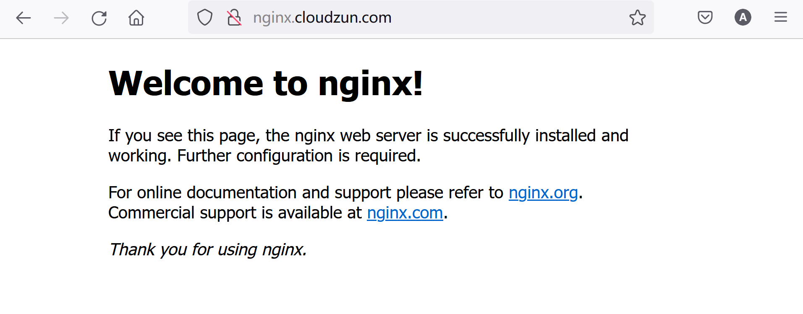

## Katacoda Web


创建包含katacoda deployment svc和ingress的一体成型yaml文件

```bash
nano kata-ingress.yaml
```


```yaml
apiVersion: apps/v1
kind: Deployment
metadata:
  labels:
    app: katacoda
  name: katacoda
spec:
  replicas: 3
  selector:
    matchLabels:
      app: katacoda
  strategy: {}
  template:
    metadata:
      labels:
        app: katacoda
    spec:
      containers:
      - image: katacoda/docker-http-server
        name: docker-http-server
        resources: {}
---
apiVersion: v1
kind: Service
metadata:
  labels:
    app: katacoda
  name: katacoda
spec:
  ports:
  - name: 80-80
    port: 80
    protocol: TCP
    targetPort: 80
  selector:
    app: katacoda
  type: ClusterIP
---
apiVersion: networking.k8s.io/v1
kind: Ingress
metadata:
  name: kata-ingress
spec:
  ingressClassName: nginx
  rules:
  - host: kata.cloudzun.com
    http:
      paths:
      - backend:
          service:
            name: katacoda
            port:
              number: 80
        path: /
        pathType: ImplementationSpecific
```

```bash
kubectl apply -f kata-ingress.yaml
```


查看ingress

```bash
kubectl describe ingress kata-ingress
```

```bash
root@node1:~# kubectl describe ingress kata-ingress
Name:             kata-ingress
Labels:           <none>
Namespace:        default
Address:
Default backend:  default-http-backend:80 (<error: endpoints "default-http-backend" not found>)
Rules:
  Host               Path  Backends
  ----               ----  --------
  kata.cloudzun.com
                     /   katacoda:80 (10.244.104.62:80,10.244.135.24:80,10.244.166.185:80)
Annotations:         <none>
Events:
  Type    Reason  Age    From                      Message
  ----    ------  ----   ----                      -------
  Normal  Sync    3m19s  nginx-ingress-controller  Scheduled for sync
  Normal  Sync    3m19s  nginx-ingress-controller  Scheduled for sync
```


编辑host

```bash
cat >> /etc/hosts << EOF
192.168.1.232 kata.cloudzun.com
192.168.1.233 kata.cloudzun.com
EOF
```


本地访问

```bash
curl kata.cloudzun.com
```

```bash
root@node1:~# curl kata.cloudzun.com
<h1>This request was processed by host: katacoda-56dbd65b59-wr448</h1>
root@node1:~# curl kata.cloudzun.com
<h1>This request was processed by host: katacoda-56dbd65b59-tmgpd</h1>
root@node1:~# curl kata.cloudzun.com
<h1>This request was processed by host: katacoda-56dbd65b59-rm7cz</h1>
```


# 域名重定向


创建yaml文件

```bash
nano redirect.yaml
```

```yaml
apiVersion: networking.k8s.io/v1
kind: Ingress
metadata:
  annotations:
    nginx.ingress.kubernetes.io/permanent-redirect: https://www.cloudzun.com
    nginx.ingress.kubernetes.io/permanent-redirect-code: '308'
  name: nginx-redirect
  namespace: study-ingress
spec:
  ingressClassName: nginx
  rules:
  - host: nginx.redirect.com
    http:
      paths:
      - backend:
          service:
            name: nginx
            port:
              number: 80
        path: /
        pathType: ImplementationSpecific
```

```bash
kubectl apply -f redirect.yaml
```


查看ingress

```bash
kubectl describe ingress nginx-redirect  -n study-ingress
```

```bash
root@node1:~# kubectl describe ingress nginx-redirect  -n study-ingress
Name:             nginx-redirect
Labels:           <none>
Namespace:        study-ingress
Address:
Default backend:  default-http-backend:80 (<error: endpoints "default-http-backend" not found>)
Rules:
  Host                Path  Backends
  ----                ----  --------
  nginx.redirect.com
                      /   nginx:80 (10.244.166.183:80)
Annotations:          nginx.ingress.kubernetes.io/permanent-redirect: https://www.cloudzun.com
                      nginx.ingress.kubernetes.io/permanent-redirect-code: 308
Events:
  Type    Reason  Age   From                      Message
  ----    ------  ----  ----                      -------
  Normal  Sync    82s   nginx-ingress-controller  Scheduled for sync
  Normal  Sync    82s   nginx-ingress-controller  Scheduled for sync
```


更新hosts

```
cat >> /etc/hosts << EOF
192.168.1.232 nginx.redirect.com
192.168.1.233 nginx.redirect.com
EOF
```


尝试从node上进行测试

```bash
curl -I nginx.redirect.com
```

```bash
root@node1:~# curl nginx.redirect.com
<html>
<head><title>308 Permanent Redirect</title></head>
<body>
<center><h1>308 Permanent Redirect</h1></center>
<hr><center>nginx</center>
</body>
</html>
root@node1:~# curl -I nginx.redirect.com
HTTP/1.1 308 Permanent Redirect
Date: Tue, 22 Nov 2022 05:47:31 GMT
Content-Type: text/html
Content-Length: 164
Connection: keep-alive
Location: https://www.cloudzun.com
```


# 前后端分离

Backend-API

创建测试用资源

```bash
kubectl create deploy backend-api --image=registry.cn-beijing.aliyuncs.com/dotbalo/nginx:backend-api -n  study-ingress
kubectl expose deploy backend-api --port 80 -n study-ingress
```


查看服务

```
kubectl get svc -n study-ingress
```

```bash
root@node1:~# kubectl get svc -n study-ingress
NAME          TYPE        CLUSTER-IP       EXTERNAL-IP   PORT(S)   AGE
backend-api   ClusterIP   10.103.40.118    <none>        80/TCP    18m
nginx         ClusterIP   10.102.210.108   <none>        80/TCP    3h44m
```


访问服务

```bash
 curl  10.103.40.118
```

```bash
root@node1:~# curl  10.103.40.118
<h1> backend for ingress rewrite </h1>

<h2> Path: /api-a </h2>


<a href="http://gaoxin.kubeasy.com"> Kubeasy </a>

```


创建rewrite策略

```
nano rewrite.yaml
```

```yaml
apiVersion: networking.k8s.io/v1
kind: Ingress
metadata:
  annotations:
    nginx.ingress.kubernetes.io/rewrite-target: /$2
  name: backend-api
  namespace: study-ingress
spec:
  ingressClassName: nginx
  rules:
  - host: nginx.cloudzun.com
    http:
      paths:
      - backend:
          service:
            name: backend-api
            port:
              number: 80
        path: /api-a(/|$)(.*)
        pathType: ImplementationSpecific
```

```bash
kubectl apply -f rewrite.yaml
```


查看ingress

```bash
kubectl get ingress -n study-ingress
```

```bash
root@node1:~# kubectl get ingress -n study-ingress
NAME             CLASS   HOSTS                ADDRESS   PORTS   AGE
backend-api      nginx   nginx.cloudzun.com             80      5m4s
nginx-ingress    nginx   nginx.cloudzun.com             80      3h38m
nginx-redirect   nginx   nginx.redirect.com             80      46m
```


尝试验证rewrite效果

```bash
 curl http://nginx.cloudzun.com/api-a
```

```bash
root@node1:~# curl http://nginx.cloudzun.com/api-a
<h1> backend for ingress rewrite </h1>

<h2> Path: /api-a </h2>


<a href="http://gaoxin.kubeasy.com"> Kubeasy </a>
```


# 多路径发布


创建命名空间

```bash
kubectl create ns ingress-basic
```


创建工作负载

```bash
nano aks-helloworld-one.yaml
```

```yaml
apiVersion: apps/v1
kind: Deployment
metadata:
  name: aks-helloworld-one  
spec:
  replicas: 1
  selector:
    matchLabels:
      app: aks-helloworld-one
  template:
    metadata:
      labels:
        app: aks-helloworld-one
    spec:
      containers:
      - name: aks-helloworld-one
        image: mcr.microsoft.com/azuredocs/aks-helloworld:v1
        ports:
        - containerPort: 80
        env:
        - name: TITLE
          value: "Welcome to Kubernetes Service"
---
apiVersion: v1
kind: Service
metadata:
  name: aks-helloworld-one  
spec:
  type: ClusterIP
  ports:
  - port: 80
  selector:
    app: aks-helloworld-one
```

```bash
nano aks-helloworld-two.yaml
```

```yaml
apiVersion: apps/v1
kind: Deployment
metadata:
  name: aks-helloworld-two  
spec:
  replicas: 1
  selector:
    matchLabels:
      app: aks-helloworld-two
  template:
    metadata:
      labels:
        app: aks-helloworld-two
    spec:
      containers:
      - name: aks-helloworld-two
        image: mcr.microsoft.com/azuredocs/aks-helloworld:v1
        ports:
        - containerPort: 80
        env:
        - name: TITLE
          value: "K8S Ingress Demo"
---
apiVersion: v1
kind: Service
metadata:
  name: aks-helloworld-two  
spec:
  type: ClusterIP
  ports:
  - port: 80
  selector:
    app: aks-helloworld-two  
```

```bash
kubectl apply -f aks-helloworld-one.yaml --namespace ingress-basic
kubectl apply -f aks-helloworld-two.yaml --namespace ingress-basic
```


查看样例部署结果

```bash
kubectl get pod -n ingress-basic -o wide
```

```bash
kubectl get svc -n ingress-basic -o wide
```

```bash
root@node1:~# kubectl get pod -n ingress-basic -o wide
NAME                                  READY   STATUS    RESTARTS   AGE     IP              NODE    NOMINATED NODE   READINESS GATES
aks-helloworld-one-78c54cdb65-hxnn7   1/1     Running   0          8m13s   10.244.135.13   node3   <none>           <none>
aks-helloworld-two-6658d485f5-rgnws   1/1     Running   0          8m10s   10.244.135.15   node3   <none>           <none>
root@node1:~# kubectl get svc -n ingress-basic -o wide
NAME                 TYPE        CLUSTER-IP       EXTERNAL-IP   PORT(S)   AGE   SELECTOR
aks-helloworld-one   ClusterIP   10.96.127.118    <none>        80/TCP    64m   app=aks-helloworld-one
aks-helloworld-two   ClusterIP   10.107.242.113   <none>        80/TCP    64m   app=aks-helloworld-two
```


创建多路径发布的配置文件

```bash
nano aks-ingress.yaml
```

```yaml
apiVersion: networking.k8s.io/v1
kind: Ingress
metadata:
  name: hello-world-ingress
  namespace: ingress-basic
  annotations:
    nginx.ingress.kubernetes.io/rewrite-target: /$1
spec:
  ingressClassName: nginx
  rules:
  - host: helloworld.cloudzun.com
    http:
      paths:
      - backend:
          service:
            name: aks-helloworld-one
            port:
              number: 80
        path: /k8s(/|$)(.*)
        pathType: ImplementationSpecific
      - backend:
          service:
            name: aks-helloworld-two
            port:
              number: 80
        path: /ingress(/|$)(.*)
        pathType: ImplementationSpecific
      - backend:
          service:
            name: aks-helloworld-one
            port:
              number: 80
        path: /(.*)
        pathType: ImplementationSpecific
```

```
kubectl apply -f aks-ingress.yaml
```


查看ingress配置

```bash
kubectl describe ingress hello-world-ingress  -n ingress-basic
```

```bash
root@node1:~#  kubectl describe ingress hello-world-ingress  -n ingress-basic
Name:             hello-world-ingress
Labels:           <none>
Namespace:        ingress-basic
Address:
Default backend:  default-http-backend:80 (<error: endpoints "default-http-backend" not found>)
Rules:
  Host                     Path  Backends
  ----                     ----  --------
  helloworld.cloudzun.com
                           /k8s(/|$)(.*)       aks-helloworld-one:80 (10.244.135.13:80)
                           /ingress(/|$)(.*)   aks-helloworld-two:80 (10.244.135.15:80)
                           /(.*)               aks-helloworld-one:80 (10.244.135.13:80)
Annotations:               nginx.ingress.kubernetes.io/rewrite-target: /$1
Events:
  Type    Reason  Age                From                      Message
  ----    ------  ----               ----                      -------
  Normal  Sync    14s (x3 over 33m)  nginx-ingress-controller  Scheduled for sync
  Normal  Sync    14s (x3 over 33m)  nginx-ingress-controller  Scheduled for sync
```


更新hosts

```bash
cat >> /etc/hosts << EOF
192.168.1.232 helloworld.cloudzun.com
192.168.1.233 helloworld.cloudzun.com
EOF
```


浏览器测试


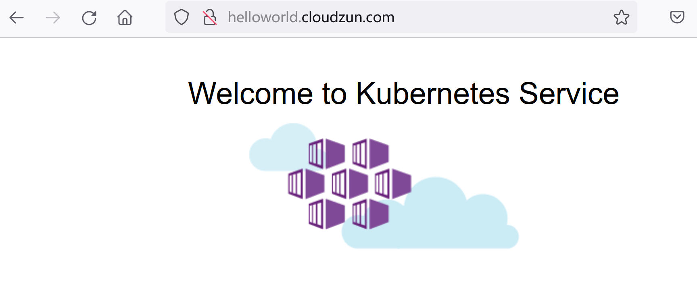


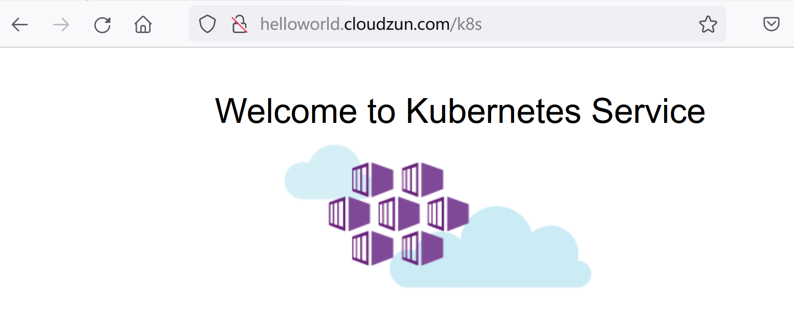


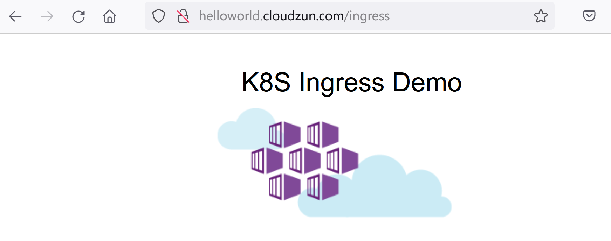


# 定制错误代码页面


修改value文件

```bash
nano values.yaml
```

```yaml
## Default 404 backend
##
defaultBackend:
  ##
  enabled: true #改为true

  name: defaultbackend
  image:
    registry: registry.k8s.io # 自定义页面所对应的映像库
    image: defaultbackend-amd64
```

```yaml
  # -- Will add custom configuration options to Nginx https://kubernetes.github.io/ingress-nginx/user-guide/nginx-configuration/config>
  config: # 增加以下三行内容
    apiVersion: v1
    client_max_body_size: 20m
    custom-http-errors: "404,415,503"
```

​		建议使用 config: {} 进行查找

```bash
helm upgrade ingress-nginx -n ingress-nginx .
```


查看pod

```
kubectl get pod -n ingress-nginx
```

```bash
root@node1:~/ingress-nginx# kubectl get pod -n ingress-nginx
NAME                                            READY   STATUS    RESTARTS   AGE
ingress-nginx-controller-gqxk9                  1/1     Running   0          19m
ingress-nginx-controller-m94q7                  1/1     Running   0          20m
ingress-nginx-defaultbackend-5fb7c69544-p2mm8   1/1     Running   0          20m
```

​		注意: 此处多了一个自定义报错页面对应的pod

查看配置文件

```bash
kubectl get cm -n ingress-nginx
```

```bash
root@node1:~/ingress-nginx# kubectl get cm -n ingress-nginx
NAME                       DATA   AGE
ingress-nginx-controller   4      3h45m
kube-root-ca.crt           1      3h45m
```

```bash
kubectl get cm -n ingress-nginx ingress-nginx-controller -o yaml
```

```bash
root@node1:~/ingress-nginx# kubectl get cm -n ingress-nginx ingress-nginx-controller -o yaml
apiVersion: v1
data:
  allow-snippet-annotations: "true"
  apiVersion: v1
  client_max_body_size: 20m
  custom-http-errors: 404,415,503
kind: ConfigMap
metadata:
  annotations:
    meta.helm.sh/release-name: ingress-nginx
    meta.helm.sh/release-namespace: ingress-nginx
  creationTimestamp: "2022-11-22T03:38:18Z"
  labels:
    app.kubernetes.io/component: controller
    app.kubernetes.io/instance: ingress-nginx
    app.kubernetes.io/managed-by: Helm
    app.kubernetes.io/name: ingress-nginx
    app.kubernetes.io/part-of: ingress-nginx
    app.kubernetes.io/version: 1.5.1
    helm.sh/chart: ingress-nginx-4.4.0
  name: ingress-nginx-controller
  namespace: ingress-nginx
  resourceVersion: "534515"
  uid: 374d38a5-0e9e-4e9c-8bdf-1dcae88f0c1e
```


尝试访问某个不存在的页面

```bash
root@node1:~/ingress-nginx# curl http://nginx.cloudzun.com/api-b
default backend - 404root@node1:~/ingress-nginx#
```


# 启用SSL

## 自签名证书

创建证书和secret

```bash
openssl req -x509 -nodes -days 365 -newkey rsa:2048 -keyout tls.key -out tls.crt -subj "/CN=nginx.cloudzun.com"

kubectl create secret tls ca-secret --key tls.key --cert tls.crt -n study-ingress
```

```bash
root@node1:~# openssl req -x509 -nodes -days 365 -newkey rsa:2048 -keyout tls.key -out tls.crt -subj "/CN=nginx.cloudzun.com"
Generating a RSA private key
..........................................................................................................................................................+++++
......................................................................+++++
writing new private key to 'tls.key'
-----
root@node1:~# kubectl create secret tls ca-secret --key tls.key --cert tls.crt -n study-ingress
secret/ca-secret created

```


查看secret细节

```bash
kubectl describe secret ca-secret  -n study-ingress
```


```bash
root@node1:~# kubectl describe secret ca-secret  -n study-ingress
Name:         ca-secret
Namespace:    study-ingress
Labels:       <none>
Annotations:  <none>

Type:  kubernetes.io/tls

Data
====
tls.crt:  1139 bytes
tls.key:  1704 bytes
```


编辑配置文件并为nginx.cloudzun.com 启用SSL

```bash
nano ingress-ssl.yaml
```

```yaml
apiVersion: networking.k8s.io/v1
kind: Ingress
metadata:
  namespace: study-ingress
  name: nginx-ingress
spec:
  ingressClassName: nginx
  rules:
  - host: nginx.cloudzun.com
    http:
      paths:
      - backend:
          service:
            name: nginx
            port:
              number: 80
        path: /
        pathType: ImplementationSpecific
  tls:
  - hosts:
    - nginx.test.com
    secretName: ca-secret
```

```bash
kubectl apply -f ingress-ssl.yaml
```


尝试在node上进行访问

```bash
curl http://nginx.cloudzun.com -I
```

```bash
root@node1:~# curl http://nginx.cloudzun.com -I
HTTP/1.1 308 Permanent Redirect
Date: Tue, 22 Nov 2022 07:53:13 GMT
Content-Type: text/html
Content-Length: 164
Connection: keep-alive
Location: https://nginx.cloudzun.com
```


浏览器访问效果

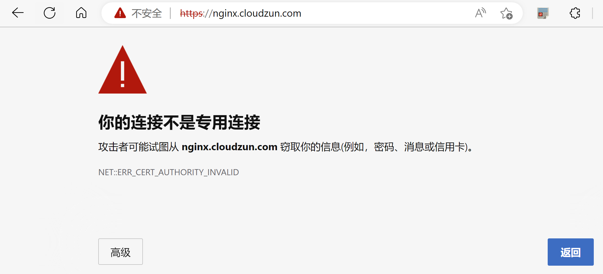


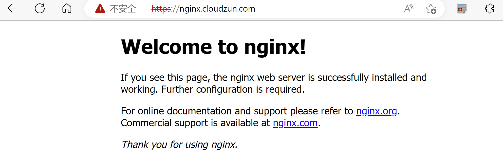


## 集成cert-manager

安装cert-manager

```bash
kubectl apply -f https://github.com/cert-manager/cert-manager/releases/download/v1.10.1/cert-manager.yaml
```


查看安装结果

```bash
kubectl get pod -n cert-manager
```

```bash
root@node1:~# kubectl get pod -n cert-manager
NAME                                       READY   STATUS    RESTARTS   AGE
cert-manager-b4b465456-6fxnt               1/1     Running   0          3h54m
cert-manager-cainjector-64d74f9c8f-z6fks   1/1     Running   0          3h54m
cert-manager-webhook-66fff58cdf-r76z9      1/1     Running   0          3h54m
```


创建clusterissuer

```bash
nano cluster-issuer.yaml
```

```yaml
apiVersion: cert-manager.io/v1
kind: ClusterIssuer
metadata:
  name: selfsigned-cluster-issuer
spec:
  selfSigned: {}
```

```bash
kubectl apply -f cluster-issuer.yaml
```


查看clusterissuer

```bash
kubectl get clusterissuer
```

```bash
root@node1:~# kubectl get clusterissuer
NAME                        READY   AGE
selfsigned-cluster-issuer   True    41m
```


创建httpbin服务

```yaml
nano httpbin-ingress.yaml
```

```yaml
apiVersion: v1
kind: ServiceAccount
metadata:
  name: httpbin
---
apiVersion: v1
kind: Service
metadata:
  name: httpbin
  labels:
    app: httpbin
    service: httpbin
spec:
  ports:
  - name: http
    port: 8000
    targetPort: 80
  selector:
    app: httpbin
---
apiVersion: apps/v1
kind: Deployment
metadata:
  name: httpbin
spec:
  replicas: 1
  selector:
    matchLabels:
      app: httpbin
      version: v1
  template:
    metadata:
      labels:
        app: httpbin
        version: v1
    spec:
      serviceAccountName: httpbin
      containers:
      - image: docker.io/kennethreitz/httpbin
        imagePullPolicy: IfNotPresent
        name: httpbin
        ports:
        - containerPort: 80
---
apiVersion: networking.k8s.io/v1
kind: Ingress
metadata:
  name: httpbin-ingress
  annotations:
    # kubernetes.io/ingress.class: ingress
    cert-manager.io/cluster-issuer: selfsigned-cluster-issuer
spec:
  ingressClassName: nginx
  rules:
  - host: httpbin.cloudzun.com
    http:
      paths:
      - backend:
          service:
            name: httpbin
            port:
              number: 8000
        path: /
        pathType: ImplementationSpecific
  tls:
    - hosts:
      - kata.cloudzun.com 
      secretName: httpbin-tls
```

```
kubectl apply -f httpbin-ingress.yaml
```


查看证书申请

```bash
kubectl get certificaterequest
```

```bash
root@node1:~# kubectl get certificaterequest
NAME                APPROVED   DENIED   READY   ISSUER                      REQUESTOR                                         AGE
httpbin-tls-6qhlx   True                True    selfsigned-cluster-issuer   system:serviceaccount:cert-manager:cert-manager   33m
```


查看证书

```bash
kubectl get certificate
```

```bash
root@node1:~# kubectl get certificate
NAME          READY   SECRET        AGE
httpbin-tls   True    httpbin-tls   28m
```


查看secret

```
 kubectl describe  secret httpbin-tls
```

```bash
root@node1:~# kubectl get secret
NAME                  TYPE                                  DATA   AGE
httpbin-tls           kubernetes.io/tls                     3      36m
root@node1:~# kubectl describe  secret httpbin-tls
Name:         httpbin-tls
Namespace:    default
Labels:       <none>
Annotations:  cert-manager.io/alt-names: kata.cloudzun.com
              cert-manager.io/certificate-name: httpbin-tls
              cert-manager.io/common-name:
              cert-manager.io/ip-sans:
              cert-manager.io/issuer-group: cert-manager.io
              cert-manager.io/issuer-kind: ClusterIssuer
              cert-manager.io/issuer-name: selfsigned-cluster-issuer
              cert-manager.io/uri-sans:

Type:  kubernetes.io/tls

Data
====
tls.crt:  1029 bytes
tls.key:  1675 bytes
ca.crt:   1029 bytes
```


更新hosts

```bash
cat >> /etc/hosts << EOF
192.168.1.232 httpbin.cloudzun.com
192.168.1.233 httpbin.cloudzun.com
EOF
```


尝试在node上进行访问

```bash
root@node1:~# curl httpbin.cloudzun.com
<html>
<head><title>308 Permanent Redirect</title></head>
<body>
<center><h1>308 Permanent Redirect</h1></center>
<hr><center>nginx</center>
</body>
</html>
root@node1:~# curl httpbin.cloudzun.com -I
HTTP/1.1 308 Permanent Redirect
Date: Thu, 24 Nov 2022 10:42:23 GMT
Content-Type: text/html
Content-Length: 164
Connection: keep-alive
Location: https://httpbin.cloudzun.com
```


尝试在浏览器上访问

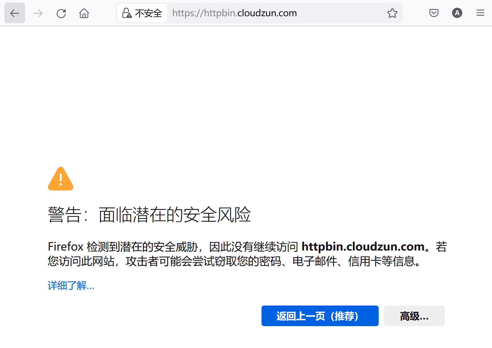


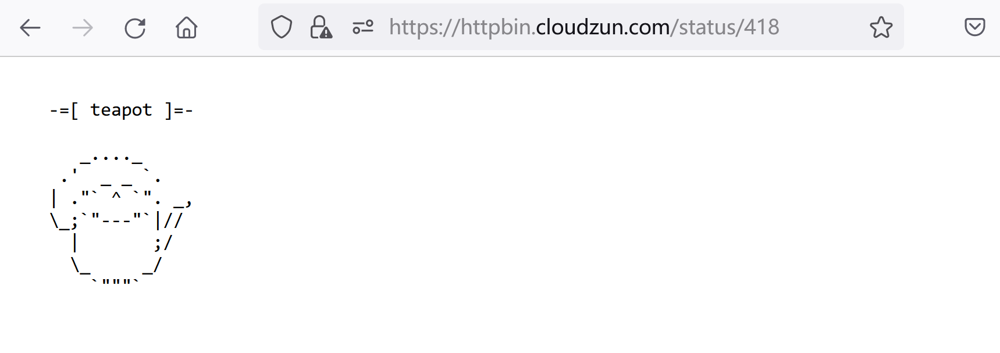


备注: cert-manager的ACME使用场景


使用以下范例，创建certificate-issuer

```
nano certificate-issuer-prod.yaml
```

```yaml
apiVersion: cert-manager.io/v1
kind: Issuer
metadata:
  name: letsencrypt-prod
spec:
  acme:
    server: https://acme-v02.api.letsencrypt.org/directory
    email: info@cloudzun.com
    privateKeySecretRef:
      name: letsencrypt-prod
    solvers:
    - http01:
        ingress:
          class: nginx
```


创建certificate-issuer

```
kubectl apply -f certificate-issuer-prod.yaml
```

使用以下范例创建ingress-with-tls

```
nano ingress-with-tls-prod.yaml
```

```yaml
apiVersion: networking.k8s.io/v1
kind: Ingress
metadata:
  name: simple-frontend-ingress
  annotations:
    kubernetes.io/ingress.class: ingress
    cert-manager.io/issuer: letsencrypt-prod
    cert-manager.io/acme-challenge-type: http01
spec:
  rules:
  - http:
      paths:
      - path: /
        pathType: Prefix
        backend:
          service:
            name: katacoda # 替换服务名
            port:
              number: 80
    host: kata.cloudzun.com #替换AG域名
  tls:
    - hosts:
      - kata.cloudzun.com #替换AG域名
      secretName: frontend-prod-tls
```


启用TLS

```
kubectl apply -f ingress-with-tls-prod.yaml
```


# 匹配请求头

创建phone工作负载

```bash
kubectl create deploy phone --image=registry.cn-beijing.aliyuncs.com/dotbalo/nginx:phone -n  study-ingress
kubectl expose deploy phone --port 80 -n study-ingress
kubectl create ingress phone --rule=m.cloudzun.com/*=phone:80 -n study-ingress
```


查看ingress

```bash
kubectl describe ingress phone  -n study-ingress
```

```bash
root@node1:~# kubectl describe ingress phone  -n study-ingress
Name:             phone
Labels:           <none>
Namespace:        study-ingress
Address:
Default backend:  default-http-backend:80 (<error: endpoints "default-http-backend" not found>)
Rules:
  Host            Path  Backends
  ----            ----  --------
  m.cloudzun.com
                  /   phone:80 (10.244.104.19:80)
Annotations:      <none>
Events:
  Type    Reason  Age   From                      Message
  ----    ------  ----  ----                      -------
  Normal  Sync    50m   nginx-ingress-controller  Scheduled for sync
  Normal  Sync    50m   nginx-ingress-controller  Scheduled for sync
```


查看m站点效果

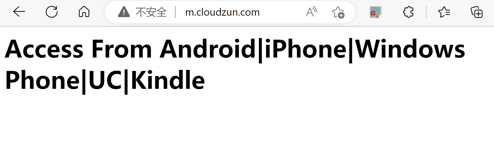

创建laptop站点工作负载

```bash
kubectl create deploy laptop --image=registry.cn-beijing.aliyuncs.com/dotbalo/nginx:laptop -n  study-ingress
kubectl expose deploy laptop --port 80 -n study-ingress
```


创建配置文件

```
nano mall-ingress.com
```

```yaml
apiVersion: networking.k8s.io/v1
kind: Ingress
metadata:
  annotations:
    nginx.ingress.kubernetes.io/server-snippet: |
      set $agentflag 0;
              if ($http_user_agent ~* "(Android|iPhone|Windows Phone|UC|Kindle)" ){
                set $agentflag 1;
              }
              if ( $agentflag = 1 ) {
                return 301 http://m.cloudzun.com;
              }
  name: laptop
  namespace: study-ingress
spec:
  ingressClassName: nginx
  rules:
  - host: mall.cloudzun.com
    http:
      paths:
      - backend:
          service:
            name: laptop
            port:
              number: 80
        path: /
        pathType: ImplementationSpecific
```

```
kubectl apply -f mall-ingress.yaml
```


查看ingress

```bash
kubectl describe ingress laptop  -n study-ingress
```

```bash
root@node1:~# kubectl describe ingress laptop  -n study-ingress
Name:             laptop
Labels:           <none>
Namespace:        study-ingress
Address:
Default backend:  default-http-backend:80 (<error: endpoints "default-http-backend" not found>)
Rules:
  Host               Path  Backends
  ----               ----  --------
  mall.cloudzun.com
                     /   laptop:80 (10.244.104.27:80)
Annotations:         nginx.ingress.kubernetes.io/server-snippet:
                       set $agentflag 0;
                               if ($http_user_agent ~* "(Android|iPhone|Windows Phone|UC|Kindle)" ){
                                 set $agentflag 1;
                               }
                               if ( $agentflag = 1 ) {
                                 return 301 http://m.cloudzun.com;
                               }
Events:
  Type    Reason  Age   From                      Message
  ----    ------  ----  ----                      -------
  Normal  Sync    28m   nginx-ingress-controller  Scheduled for sync
  Normal  Sync    28m   nginx-ingress-controller  Scheduled for sync

```


使用浏览器查看


模拟使用移动设备进行查看,会观测到站点自动跳转

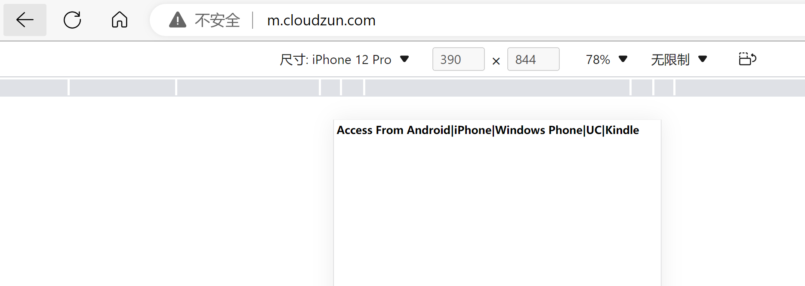


# 验证


安装htpasswd

```bash
 apt install apache2-utils
```


创建凭据

```bash
htpasswd -c auth foo
```

```bash
root@node1:~# htpasswd -c auth foo
New password:
Re-type new password:
Adding password for user foo
root@node1:~# cat auth
foo:$apr1$UG6kz7LQ$bb/ylfyOLJyYi0fHjPFym0
```


创建包含凭据的secret

```bash
kubectl create secret generic basic-auth --from-file=auth -n study-ingress
```


查看secret

```bash
kubectl get secret basic-auth -n study-ingress -o yaml
```

```bash
root@node1:~# kubectl get secret basic-auth -n study-ingress -o yaml
apiVersion: v1
data:
  auth: Zm9vOiRhcHIxJFVHNmt6N0xRJGJiL3lsZnlPTEp5WWkwZkhqUEZ5bTAK
kind: Secret
metadata:
  creationTimestamp: "2022-11-23T02:39:40Z"
  name: basic-auth
  namespace: study-ingress
  resourceVersion: "618763"
  uid: 75df728e-a51b-4f5a-b4da-d3d137c0d533
type: Opaque
root@node1:~# echo  Zm9vOiRhcHIxJFVHNmt6N0xRJGJiL3lsZnlPTEp5WWkwZkhqUEZ5bTAK | base64 -d
foo:$apr1$UG6kz7LQ$bb/ylfyOLJyYi0fHjPFym0
```


创建yaml

```
nano auth-ingress.yaml
```

```yaml
apiVersion: networking.k8s.io/v1
kind: Ingress
metadata:
  annotations:
    nginx.ingress.kubernetes.io/auth-realm: Please Input Your Username and Password
    nginx.ingress.kubernetes.io/auth-secret: basic-auth
    nginx.ingress.kubernetes.io/auth-type: basic
  name: ingress-with-auth
  namespace: study-ingress
spec:
  ingressClassName: nginx
  rules:
  - host: auth.cloudzun.com
    http:
      paths:
      - backend:
          service:
            name: nginx
            port:
              number: 80
        path: /
        pathType: ImplementationSpecific 
```

```bash
kubectl apply -f auth-ingress.yaml
```


更新hosts

```bash
cat >> /etc/hosts << EOF
192.168.1.232 auth.cloudzun.com
192.168.1.233 auth.cloudzun.com
EOF
```


尝试在node上进行访问

```bash
 curl auth.cloudzun.com
```

```bash
 curl auth.cloudzun.com -I
```

```bash
root@node1:~# curl auth.cloudzun.com
<html>
<head><title>401 Authorization Required</title></head>
<body>
<center><h1>401 Authorization Required</h1></center>
<hr><center>nginx</center>
</body>
</html>
root@node1:~# curl auth.cloudzun.com -I
HTTP/1.1 401 Unauthorized
Date: Wed, 23 Nov 2022 02:40:43 GMT
Content-Type: text/html
Content-Length: 172
Connection: keep-alive
WWW-Authenticate: Basic realm="Please Input Your Username and Password"
```


尝试使用浏览器进行访问

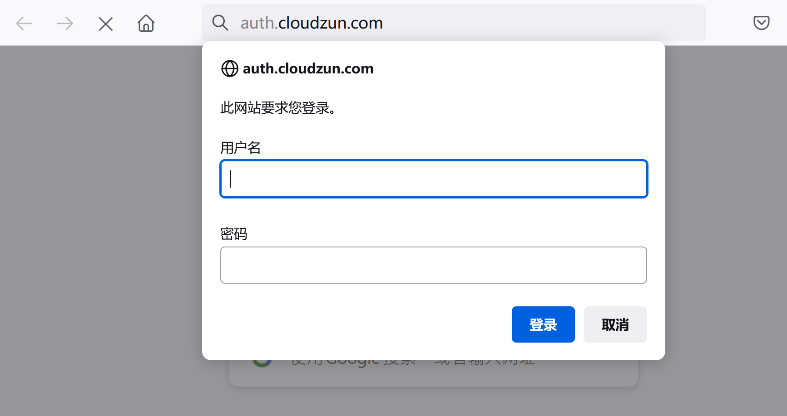


# 访问速率限制


初始测速

```bash
 ab -c 10 -n 100 http://nginx.cloudzun.com/ | grep requests
```

```bash
root@node1:~# ab -c 10 -n 100 http://nginx.cloudzun.com/ | grep requests
Complete requests:      100
Failed requests:        0
Time per request:       1.078 [ms] (mean, across all concurrent requests)
Percentage of the requests served within a certain time (ms)
```


修改yaml文件

```
nano web-ingress.yaml
```

```yaml
apiVersion: networking.k8s.io/v1
kind: Ingress
metadata:
  name: nginx-ingress
  namespace: study-ingress
  annotations: # 增加注释
    nginx.ingress.kubernetes.io/limit-connections: "1" # 并发限制为1
spec:
  ingressClassName: nginx
  rules:
  - host: nginx.cloudzun.com
    http:
      paths:
      - backend:
          service:
            name: nginx
            port:
              number: 80
        path: /
        pathType: ImplementationSpecific
```

```bash
kubectl apply -f web-ingress.yaml
```


再次测速

```bash
 ab -c 10 -n 100 http://nginx.cloudzun.com/ | grep requests
```

```bash
root@node1:~# ab -c 10 -n 100 http://nginx.cloudzun.com/ | grep requests
Complete requests:      100
Failed requests:        70
Time per request:       1.399 [ms] (mean, across all concurrent requests)
Percentage of the requests served within a certain time (ms)
```


# ingress-nginx的监控

更新values文件并更新helm release

```bash
nano values.yaml
```

```yaml
 metrics:
    port: 10254
    portName: metrics
    # if this port is changed, change healthz-port: in extraArgs: accordingly
    enabled: true # 设置为启用

    service:
      annotations:
        prometheus.io/scrape: "true" #取消注释
        prometheus.io/port: "10254" #取消注释
```

```
helm upgrade ingress-nginx -n ingress-nginx .
```


查看metrics信息

```bash
curl -s "http://node2:10254/metrics" | tail -l
```

```bash
root@node1:~# curl -s "http://node2:10254/metrics" | tail -l
# TYPE process_virtual_memory_max_bytes gauge
process_virtual_memory_max_bytes 1.8446744073709552e+19
# HELP promhttp_metric_handler_requests_in_flight Current number of scrapes being served.
# TYPE promhttp_metric_handler_requests_in_flight gauge
promhttp_metric_handler_requests_in_flight 1
# HELP promhttp_metric_handler_requests_total Total number of scrapes by HTTP status code.
# TYPE promhttp_metric_handler_requests_total counter
promhttp_metric_handler_requests_total{code="200"} 151
promhttp_metric_handler_requests_total{code="500"} 0
promhttp_metric_handler_requests_total{code="503"} 0
```


修改Prometheus静态配置文件,增加ingress相关条目, 并更新配置

```bash
nano prometheus-additional.yaml
```

```bash
- job_name: nginx-ingress
  metrics_path: /metrics
  scrape_interval: 5s
  static_configs:
  - targets:
    - 192.168.1.232:10254
    - 192.168.1.233:10254
```

```bash
kubectl create secret generic additional-configs --from-file=prometheus-additional.yaml --dry-run=client -o yaml | kubectl replace -f - -n monitoring
```


从Prometheus status-->configuration 页面上检查ingress配置项


从Prometheus status-->targets 页面上检查ingress配置项


从Prometheus status-->service discovery 页面上检查ingress配置项


从Prometheus 首页尝试使用ingress相关指标进行查看


加载9614 dashboard在grafana中查看ingress相关数据

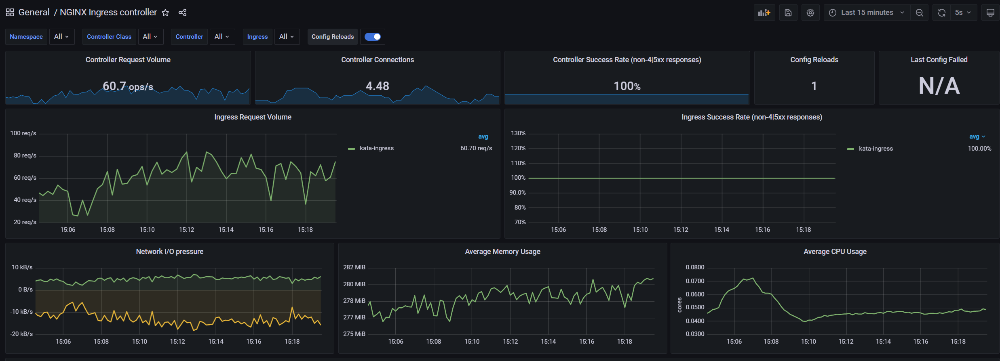


# 黑白名单(可选)

黑名单属于在value里面的全局定义,配置范例如下

```yaml
  # -- Will add custom configuration options to Nginx https://kubernetes.github.io/ingress-nginx/user-guide/nginx-configuration/config>
  config:
    apiVersion: v1
    client_max_body_size: 20m
    custom-http-errors: "404,415,503"
    block-cidrs: 192.168.1.233 #可以是主机或者网段
```


白名单定义在ingress层级,范例如下

```yaml
apiVersion: networking.k8s.io/v1
kind: Ingress
metadata:
  annotations:
    nginx.ingress.kubernetes.io/auth-realm: Please Input Your Username and Password
    nginx.ingress.kubernetes.io/auth-secret: basic-auth
    nginx.ingress.kubernetes.io/auth-type: basic
    nginx.ingress.kubernetes.io/whitelist-source-range: 192.168.1.8 #为测试方便一般指向宿主机
  name: ingress-with-auth
  namespace: study-ingress
spec:
  ingressClassName: nginx
  rules:
  - host: auth.cloudzun.com
    http:
      paths:
      - backend:
          service:
            name: nginx
            port:
              number: 80
        path: /
        pathType: ImplementationSpecific
```


被拒的效果

```bash
root@node1:~/ingress-nginx# curl auth.cloudzun.com -I
HTTP/1.1 403 Forbidden
Date: Wed, 23 Nov 2022 03:34:39 GMT
Content-Type: text/html
Content-Length: 146
Connection: keep-alive
```


# 裸金属部署方法(可选)

用于快速测试环境,和helm部署模式相比,采用deployment双实例方式部署,且未置默认ingressclass,其他配置相同

节点打标签

```bash
kubectl label node node2 ingress=true
kubectl label node node3 ingress=true
```


安装ingress-nginx

```bash
kubectl apply -f https://raw.githubusercontent.com/cloudzun/k8s-ingress/main/baremetal.yaml
```


注意:上述yaml文件基于https://raw.githubusercontent.com/kubernetes/ingress-nginx/controller-v1.5.1/deploy/static/provider/baremetal/deploy.yaml 进行修改
