# 安装Rook

本次实验的环境：

- 服务器数量：三台
- 服务器OS：Ubuntu 20.04
- 服务器硬件配置：4C8G双硬盘
- K8S版本：1.23.0


因为三台机器都要承担工作负载，因此需要去掉master上的污点

```bash
kubectl taint nodes --all node-role.kubernetes.io/master-
```


检查服务器磁盘配置

```bash
lsblk -f
```


```bash
root@node1:~# lsblk -f
NAME   FSTYPE LABEL UUID                                 FSAVAIL FSUSE% MOUNTPOINT
fd0
sda
└─sda1 ext4         bbd3ea56-da3b-4e1a-b14e-159e41299ea3    112G     6% /
sdb
sr0
```

如输出所示,sdb为一块未格式化的裸盘,用户后续ceph群集的搭建


下载Rook Repo

```bash
git clone --single-branch --branch v1.6.3 https://github.com/rook/rook.git
```


```bash
cd rook/cluster/examples/kubernetes/ceph
```


修改 operator.yaml

```bash
nano operator.yaml
```


启用自动发现

```bash
  # This daemon does not need to run if you are only going to create your OSDs based on StorageClassDeviceSets with PVCs.
  ROOK_ENABLE_DISCOVERY_DAEMON: "true" #修改为true
```


使用国内镜像

```bash
  # these images to the desired release of the CSI driver.
  # ROOK_CSI_CEPH_IMAGE: "quay.io/cephcsi/cephcsi:v3.3.1"
  # ROOK_CSI_REGISTRAR_IMAGE: "k8s.gcr.io/sig-storage/csi-node-driver-registrar:v2.0.1"
  # ROOK_CSI_RESIZER_IMAGE: "k8s.gcr.io/sig-storage/csi-resizer:v1.0.1"
  # ROOK_CSI_PROVISIONER_IMAGE: "k8s.gcr.io/sig-storage/csi-provisioner:v2.0.4"
  # ROOK_CSI_SNAPSHOTTER_IMAGE: "k8s.gcr.io/sig-storage/csi-snapshotter:v4.0.0"
  # ROOK_CSI_ATTACHER_IMAGE: "k8s.gcr.io/sig-storage/csi-attacher:v3.0.2"
```

替换为

```bash
ROOK_CSI_REGISTRAR_IMAGE: "registry.cn-beijing.aliyuncs.com/dotbalo/csi-node-driver-registrar:v2.0.1"
ROOK_CSI_RESIZER_IMAGE: "registry.cn-beijing.aliyuncs.com/dotbalo/csi-resizer:v1.0.1"
ROOK_CSI_PROVISIONER_IMAGE: "registry.cn-beijing.aliyuncs.com/dotbalo/csi-provisioner:v2.0.4"
ROOK_CSI_SNAPSHOTTER_IMAGE: "registry.cn-beijing.aliyuncs.com/dotbalo/csi-snapshotter:v4.0.0"
ROOK_CSI_ATTACHER_IMAGE: "registry.cn-beijing.aliyuncs.com/dotbalo/csi-attacher:v3.0.2"
```


部署rook

```bash
kubectl create -f crds.yaml -f common.yaml -f operator.yaml
```


查看创建的crd

```
kubectl get crd | grep rook
```


```bash
root@node1:~/rook/cluster/examples/kubernetes/ceph# kubectl get crd | grep rook
cephblockpools.ceph.rook.io                                 2022-12-06T01:22:46Z
cephclients.ceph.rook.io                                    2022-12-06T01:22:46Z
cephclusters.ceph.rook.io                                   2022-12-06T01:22:46Z
cephfilesystemmirrors.ceph.rook.io                          2022-12-06T01:22:46Z
cephfilesystems.ceph.rook.io                                2022-12-06T01:22:46Z
cephnfses.ceph.rook.io                                      2022-12-06T01:22:46Z
cephobjectrealms.ceph.rook.io                               2022-12-06T01:22:46Z
cephobjectstores.ceph.rook.io                               2022-12-06T01:22:46Z
cephobjectstoreusers.ceph.rook.io                           2022-12-06T01:22:46Z
cephobjectzonegroups.ceph.rook.io                           2022-12-06T01:22:46Z
cephobjectzones.ceph.rook.io                                2022-12-06T01:22:46Z
cephrbdmirrors.ceph.rook.io                                 2022-12-06T01:22:46Z
volumes.rook.io                                             2022-12-06T01:22:46Z
```


查看ceph群集信息

```bash
kubectl get cephcluster -n rook-ceph
```


```bash
root@node1:~/rook/cluster/examples/kubernetes/ceph# kubectl get cephcluster -n rook-ceph
No resources found in rook-ceph namespace.
```


查看pod

```bash
kubectl -n rook-ceph get pod
```


```bash
root@node1:~/rook/cluster/examples/kubernetes/ceph# kubectl -n rook-ceph get pod
NAME                                  READY   STATUS    RESTARTS   AGE
rook-ceph-operator-7958854bd7-wbl6x   1/1     Running   0          7m31s
rook-discover-j94xk                   1/1     Running   0          6m49s
rook-discover-p5czf                   1/1     Running   0          6m49s
rook-discover-qvh52                   1/1     Running   0          6m49s
```


创建ceph群集

```bash
kubectl create -f cluster.yaml
```


查看创建过程

```
kubectl get cephcluster -n rook-ceph
```


```bash
root@node1:~/rook/cluster/examples/kubernetes/ceph# kubectl get cephcluster -n rook-ceph
NAME        DATADIRHOSTPATH   MONCOUNT   AGE   PHASE         MESSAGE                  HEALTH   EXTERNAL
rook-ceph   /var/lib/rook     3          54s   Progressing   Detecting Ceph version
```


查看operator日志

```bash
 kubectl logs rook-ceph-operator-7958854bd7-wbl6x -n rook-ceph
```


```bash
2022-12-06 01:35:54.520275 I | op-mgr: successfully set ceph dashboard creds
2022-12-06 01:35:56.130913 I | op-osd: updating OSD 0 on node "node2"
2022-12-06 01:35:56.166867 I | op-osd: OSD orchestration status for node node2 is "completed"
2022-12-06 01:35:56.171823 I | op-osd: OSD orchestration status for node node3 is "orchestrating"
2022-12-06 01:35:58.069999 I | op-osd: updating OSD 1 on node "node3"
2022-12-06 01:35:58.099479 I | op-osd: OSD orchestration status for node node3 is "completed"
2022-12-06 01:35:58.339327 I | op-mgr: dashboard config has changed. restarting the dashboard module
2022-12-06 01:35:58.339436 I | op-mgr: restarting the mgr module
2022-12-06 01:35:59.347193 I | op-osd: updating OSD 2 on node "node1"
2022-12-06 01:36:00.266395 I | cephclient: successfully disallowed pre-octopus osds and enabled all new octopus-only functionality
2022-12-06 01:36:00.266434 I | op-osd: finished running OSDs in namespace "rook-ceph"
2022-12-06 01:36:00.266442 I | ceph-cluster-controller: done reconciling ceph cluster in namespace "rook-ceph"
2022-12-06 01:36:00.539515 I | op-mgr: successful modules: dashboard
```


确认群集安装状态

```
kubectl get cephcluster -n rook-ceph
```


```bash
root@node1:~/rook/cluster/examples/kubernetes/ceph# kubectl get cephcluster -n rook-ceph
NAME        DATADIRHOSTPATH   MONCOUNT   AGE   PHASE   MESSAGE                        HEALTH        EXTERNAL
rook-ceph   /var/lib/rook     3          13m   Ready   Cluster created successfully   HEALTH_WARN

```


查看pod

```
kubectl get pod -n rook-ceph
```


```bash
root@node1:~/rook/cluster/examples/kubernetes/ceph# kubectl get pod -n rook-ceph
NAME                                              READY   STATUS      RESTARTS   AGE
csi-cephfsplugin-77g4f                            3/3     Running     0          4m55s
csi-cephfsplugin-cn9cc                            3/3     Running     0          4m55s
csi-cephfsplugin-cxd82                            3/3     Running     0          4m55s
csi-cephfsplugin-provisioner-7594b68bcb-2t575     6/6     Running     0          4m55s
csi-cephfsplugin-provisioner-7594b68bcb-wwn2j     6/6     Running     0          4m55s
csi-rbdplugin-2v2fc                               3/3     Running     0          4m56s
csi-rbdplugin-nntm2                               3/3     Running     0          4m56s
csi-rbdplugin-provisioner-757bdc7649-4qrtz        6/6     Running     0          4m56s
csi-rbdplugin-provisioner-757bdc7649-tlwcc        6/6     Running     0          4m56s
csi-rbdplugin-px7rf                               3/3     Running     0          4m56s
rook-ceph-crashcollector-node1-59767675f6-8dv7p   1/1     Running     0          3m9s
rook-ceph-crashcollector-node2-5f9466c4df-xl2g9   1/1     Running     0          3m20s
rook-ceph-crashcollector-node3-6c68cb765d-mjnp2   1/1     Running     0          3m20s
rook-ceph-mgr-a-7bf8f98c4b-4hsbm                  1/1     Running     0          3m23s
rook-ceph-mon-a-74558fc57d-wstvp                  1/1     Running     0          4m7s
rook-ceph-mon-b-84fc75c787-zwhcl                  1/1     Running     0          4m
rook-ceph-mon-c-6d46b45cb8-fbj4k                  1/1     Running     0          3m50s
rook-ceph-operator-7958854bd7-wbl6x               1/1     Running     0          15m
rook-ceph-osd-0-5b4699757c-nfprg                  1/1     Running     0          3m10s
rook-ceph-osd-1-86549d7674-8pw2g                  1/1     Running     0          3m10s
rook-ceph-osd-2-57ccd6fdb8-gbkdg                  1/1     Running     0          3m9s
rook-ceph-osd-prepare-node1-7zn7h                 0/1     Completed   0          2m51s
rook-ceph-osd-prepare-node2-9tpvj                 0/1     Completed   0          2m49s
rook-ceph-osd-prepare-node3-f6hf9                 0/1     Completed   0          2m47s
rook-discover-j94xk                               1/1     Running     0          15m
rook-discover-p5czf                               1/1     Running     0          15m
rook-discover-qvh52                               1/1     Running     0          15m
```


查看服务

```bash
kubectl get svc -n rook-ceph
```


```bash
root@node1:~/rook/cluster/examples/kubernetes/ceph# kubectl get svc -n rook-ceph
NAME                       TYPE        CLUSTER-IP       EXTERNAL-IP   PORT(S)             AGE
csi-cephfsplugin-metrics   ClusterIP   10.106.215.152   <none>        8080/TCP,8081/TCP   9m39s
csi-rbdplugin-metrics      ClusterIP   10.97.66.233     <none>        8080/TCP,8081/TCP   9m39s
rook-ceph-mgr              ClusterIP   10.109.198.134   <none>        9283/TCP            8m4s
rook-ceph-mgr-dashboard    ClusterIP   10.101.144.82    <none>        8443/TCP            8m4s
rook-ceph-mon-a            ClusterIP   10.101.130.249   <none>        6789/TCP,3300/TCP   8m52s
rook-ceph-mon-b            ClusterIP   10.106.237.229   <none>        6789/TCP,3300/TCP   8m45s
rook-ceph-mon-c            ClusterIP   10.102.106.129   <none>        6789/TCP,3300/TCP   8m35s
```


安装ceph客户端工具

```bash
kubectl  create -f toolbox.yaml -n rook-ceph
```


查看ceph tools pod

```bash
 kubectl get pod -n rook-ceph | grep tools
```


```bash
root@node1:~/rook/cluster/examples/kubernetes/ceph# kubectl get pod -n rook-ceph | grep tools
rook-ceph-tools-5f6c9f465-8lr4x                   1/1     Running     0          3m45s
```


使用tools pod执行ceph状态检查命令

```bash
kubectl -n rook-ceph exec -it deploy/rook-ceph-tools -- bash
```


```bash
ceph status
ceph osd status
ceph df
rados df
```


```bash
root@node1:~/rook/cluster/examples/kubernetes/ceph# kubectl -n rook-ceph exec -it deploy/rook-ceph-tools -- bash
[root@rook-ceph-tools-5f6c9f465-8lr4x /]# ceph status
  cluster:
    id:     c4a85273-6a13-4449-b05d-3ffde2fc6042
    health: HEALTH_WARN
            mons are allowing insecure global_id reclaim

  services:
    mon: 3 daemons, quorum a,b,c (age 19m)
    mgr: a(active, since 19m)
    osd: 3 osds: 3 up (since 19m), 3 in (since 19m)

  data:
    pools:   1 pools, 1 pgs
    objects: 0 objects, 0 B
    usage:   3.0 GiB used, 378 GiB / 381 GiB avail
    pgs:     1 active+clean
```


```bash
[root@rook-ceph-tools-5f6c9f465-8lr4x /]# ceph osd status
ID  HOST    USED  AVAIL  WR OPS  WR DATA  RD OPS  RD DATA  STATE
 0  node2  1026M   125G      0        0       0        0   exists,up
 1  node3  1026M   125G      0        0       0        0   exists,up
 2  node1  1026M   125G      0        0       0        0   exists,up
```


```bash
[root@rook-ceph-tools-5f6c9f465-8lr4x /]# ceph df
--- RAW STORAGE ---
CLASS  SIZE     AVAIL    USED     RAW USED  %RAW USED
hdd    381 GiB  378 GiB  6.6 MiB   3.0 GiB       0.79
TOTAL  381 GiB  378 GiB  6.6 MiB   3.0 GiB       0.79

--- POOLS ---
POOL                   ID  PGS  STORED  OBJECTS  USED  %USED  MAX AVAIL
device_health_metrics   1    1     0 B        0   0 B      0    120 GiB
```


```bash
[root@rook-ceph-tools-5f6c9f465-8lr4x /]# rados df
POOL_NAME              USED  OBJECTS  CLONES  COPIES  MISSING_ON_PRIMARY  UNFOUND  DEGRADED  RD_OPS   RD  WR_OPS   WR  USED COMPR  UNDER COMPR
device_health_metrics   0 B        0       0       0                   0        0         0       0  0 B       0  0 B         0 B          0 B

total_objects    0
total_used       3.0 GiB
total_avail      378 GiB
total_space      381 GiB
```


配置ceph dashboard

```bash
kubectl apply -f dashboard-external-https.yaml
```


查看dashboard相关服务

```bash
kubectl get svc -n rook-ceph | grep rook-ceph-mgr-dashboard
```


```bash
root@node1:~/rook/cluster/examples/kubernetes/ceph# kubectl get svc -n rook-ceph | grep rook-ceph-mgr-dashboard
rook-ceph-mgr-dashboard                  ClusterIP   10.101.144.82    <none>        8443/TCP            42m
rook-ceph-mgr-dashboard-external-https   NodePort    10.102.110.0     <none>        8443:31215/TCP      113s
```


查看dashboard密码

```bash
kubectl -n rook-ceph get secret rook-ceph-dashboard-password -o jsonpath="{['data']['password']}"|base64 --decode && echo
```


登录到dashboard页面:`https://node1:31215`

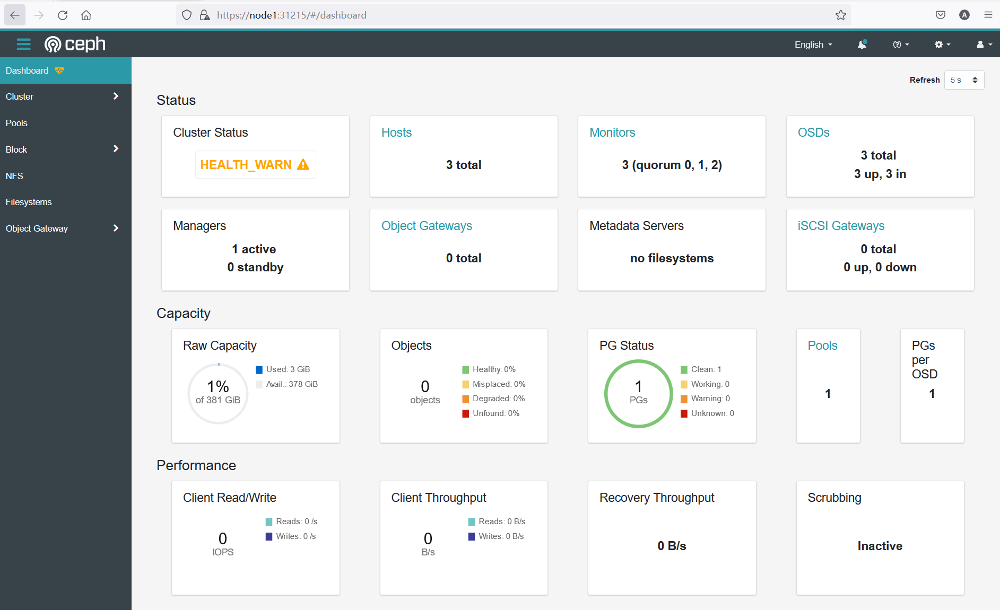


消除dashboard中的health_warn

```bash
 kubectl -n rook-ceph exec -it deploy/rook-ceph-tools -- bash
```


```bash
ceph config set mon auth_allow_insecure_global_id_reclaim false
```


```bash
root@node1:~/rook/cluster/examples/kubernetes/ceph# kubectl -n rook-ceph exec -it deploy/rook-ceph-tools -- bash
[root@rook-ceph-tools-5f6c9f465-8lr4x /]# ceph config set mon auth_allow_insecure_global_id_reclaim false
[root@rook-ceph-tools-5f6c9f465-8lr4x /]# ceph -s
  cluster:
    id:     c4a85273-6a13-4449-b05d-3ffde2fc6042
    health: HEALTH_WARN
            mon is allowing insecure global_id reclaim

  services:
    mon: 3 daemons, quorum a,b,c (age 57m)
    mgr: a(active, since 56m)
    osd: 3 osds: 3 up (since 57m), 3 in (since 57m)

  data:
    pools:   1 pools, 1 pgs
    objects: 0 objects, 0 B
    usage:   3.0 GiB used, 378 GiB / 381 GiB avail
    pgs:     1 active+clean
```


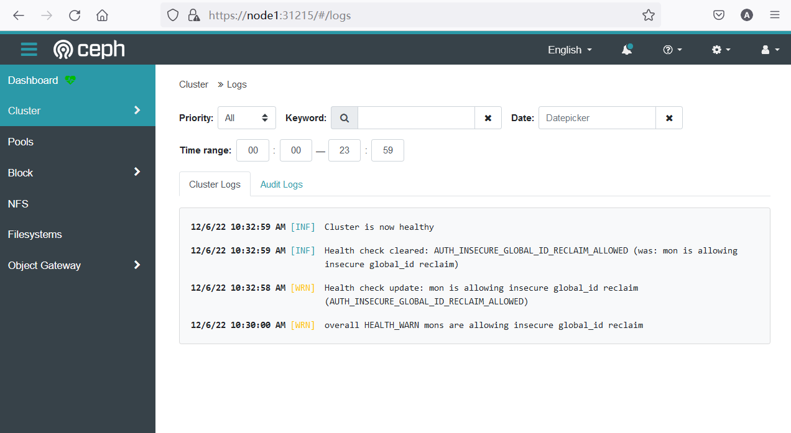


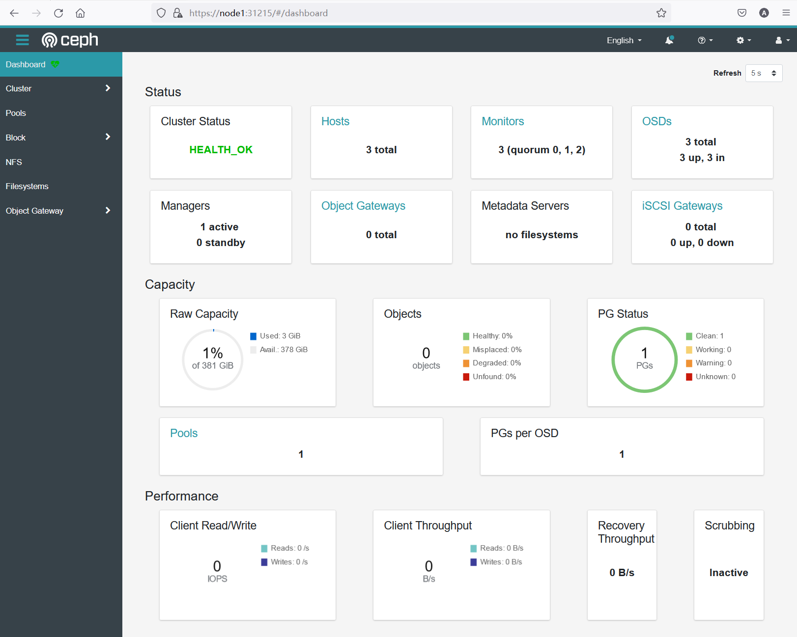


# 实现块存储

## 创建存储池和存储类


查看rbd 存储类定义文件

```yaml
nano /csi/rbd/storageclass.yaml
```


```yaml
apiVersion: ceph.rook.io/v1
kind: CephBlockPool
metadata:
  name: replicapool #存储池名称
  namespace: rook-ceph
spec:
  failureDomain: host # 容错域级别
  replicated:
    size: 3 #副本数
    # Disallow setting pool with replica 1, this could lead to data loss without recovery.
    # Make sure you're *ABSOLUTELY CERTAIN* that is what you want
    requireSafeReplicaSize: true
    # gives a hint (%) to Ceph in terms of expected consumption of the total cluster capacity of a given pool
    # for more info: https://docs.ceph.com/docs/master/rados/operations/placement-groups/#specifying-expected-pool-size
    #targetSizeRatio: .5
---
apiVersion: storage.k8s.io/v1
kind: StorageClass
metadata:
  name: rook-ceph-block #存储类名称
# Change "rook-ceph" provisioner prefix to match the operator namespace if needed
provisioner: rook-ceph.rbd.csi.ceph.com
parameters:
  # clusterID is the namespace where the rook cluster is running
  # If you change this namespace, also change the namespace below where the secret namespaces are defined
  clusterID: rook-ceph # namespace:cluster

  # If you want to use erasure coded pool with RBD, you need to create
  # two pools. one erasure coded and one replicated.
  # You need to specify the replicated pool here in the `pool` parameter, it is
  # used for the metadata of the images.
  # The erasure coded pool must be set as the `dataPool` parameter below.
  #dataPool: ec-data-pool
  pool: replicapool #存储类对应的存储池

  # (optional) mapOptions is a comma-separated list of map options.
  # For krbd options refer
  # https://docs.ceph.com/docs/master/man/8/rbd/#kernel-rbd-krbd-options
  # For nbd options refer
  # https://docs.ceph.com/docs/master/man/8/rbd-nbd/#options
  # mapOptions: lock_on_read,queue_depth=1024

  # (optional) unmapOptions is a comma-separated list of unmap options.
  # For krbd options refer
  # https://docs.ceph.com/docs/master/man/8/rbd/#kernel-rbd-krbd-options
  # For nbd options refer
  # https://docs.ceph.com/docs/master/man/8/rbd-nbd/#options
  # unmapOptions: force

  # RBD image format. Defaults to "2".
  imageFormat: "2"

  # RBD image features. Available for imageFormat: "2". CSI RBD currently supports only `layering` feature.
  imageFeatures: layering

  # The secrets contain Ceph admin credentials. These are generated automatically by the operator
  # in the same namespace as the cluster.
  csi.storage.k8s.io/provisioner-secret-name: rook-csi-rbd-provisioner
  csi.storage.k8s.io/provisioner-secret-namespace: rook-ceph # namespace:cluster
  csi.storage.k8s.io/controller-expand-secret-name: rook-csi-rbd-provisioner
  csi.storage.k8s.io/controller-expand-secret-namespace: rook-ceph # namespace:cluster
  csi.storage.k8s.io/node-stage-secret-name: rook-csi-rbd-node
  csi.storage.k8s.io/node-stage-secret-namespace: rook-ceph # namespace:cluster
  # Specify the filesystem type of the volume. If not specified, csi-provisioner
  # will set default as `ext4`. Note that `xfs` is not recommended due to potential deadlock
  # in hyperconverged settings where the volume is mounted on the same node as the osds.
  csi.storage.k8s.io/fstype: ext4
# uncomment the following to use rbd-nbd as mounter on supported nodes
# **IMPORTANT**: If you are using rbd-nbd as the mounter, during upgrade you will be hit a ceph-csi
# issue that causes the mount to be disconnected. You will need to follow special upgrade steps
# to restart your application pods. Therefore, this option is not recommended.
#mounter: rbd-nbd
allowVolumeExpansion: true
reclaimPolicy: Delete #回收策略
```


创建存储池和存储类

```bash
kubectl apply -f /csi/rbd/storageclass.yaml
```


查看存储池和存储类

```bash
kubectl get CephBlockPool -n rook-ceph
```


```bash
kubectl get storageclass
```


```bash
root@node1:~/rook/cluster/examples/kubernetes/ceph/csi/rbd# kubectl get CephBlockPool -n rook-ceph
NAME          AGE
replicapool   61s
root@node1:~/rook/cluster/examples/kubernetes/ceph/csi/rbd# kubectl get storageclass
NAME              PROVISIONER                  RECLAIMPOLICY   VOLUMEBINDINGMODE   ALLOWVOLUMEEXPANSION   AGE
rook-ceph-block   rook-ceph.rbd.csi.ceph.com   Delete          Immediate           true                   78s
```


在dashboard上进行查看

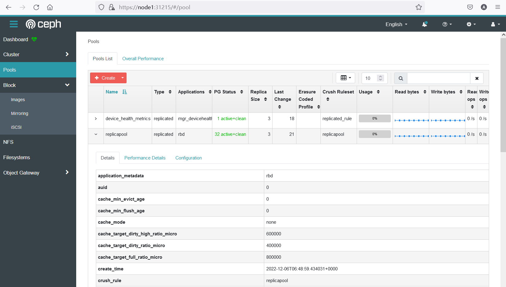


## 挂载测试1: MySQL 数据库存储的挂载

查看mysql示例配置文件

```yaml
apiVersion: v1
kind: Service
metadata:
  name: wordpress-mysql
  labels:
    app: wordpress
spec:
  ports:
    - port: 3306
  selector:
    app: wordpress
    tier: mysql
  clusterIP: None
---
apiVersion: v1
kind: PersistentVolumeClaim
metadata:
  name: mysql-pv-claim #PVC名称
  labels:
    app: wordpress
spec:
  storageClassName: rook-ceph-block #存储类型
  accessModes:
    - ReadWriteOnce #访问模式
  resources:
    requests:
      storage: 20Gi #存储大小,建议修改为2Gi
---
apiVersion: apps/v1
kind: Deployment
metadata:
  name: wordpress-mysql
  labels:
    app: wordpress
    tier: mysql
spec:
  selector:
    matchLabels:
      app: wordpress
      tier: mysql
  strategy:
    type: Recreate
  template:
    metadata:
      labels:
        app: wordpress
        tier: mysql
    spec:
      containers:
        - image: mysql:5.6
          name: mysql
          env:
            - name: MYSQL_ROOT_PASSWORD
              value: changeme
          ports:
            - containerPort: 3306
              name: mysql
          volumeMounts:
            - name: mysql-persistent-storage
              mountPath: /var/lib/mysql #挂接点
      volumes:
        - name: mysql-persistent-storage #数据卷
          persistentVolumeClaim:
            claimName: mysql-pv-claim #pvc名称
```


安装mysql

```bash
kubectl apply -f mysql.yaml
```


查看pv pvc

```
kubectl get pv
```


```
kubectl get pvc
```


```bash
root@node1:~/rook/cluster/examples/kubernetes# kubectl get pv
NAME                                       CAPACITY   ACCESS MODES   RECLAIM POLICY   STATUS   CLAIM                    STORAGECLASS      REASON   AGE
pvc-1b7011a4-e4a4-4018-a61f-1a9fc58e127d   2Gi        RWO            Delete           Bound    default/mysql-pv-claim   rook-ceph-block            2m12s
root@node1:~/rook/cluster/examples/kubernetes# kubectl get pvc
NAME             STATUS   VOLUME                                     CAPACITY   ACCESS MODES   STORAGECLASS      AGE
mysql-pv-claim   Bound    pvc-1b7011a4-e4a4-4018-a61f-1a9fc58e127d   2Gi        RWO            rook-ceph-block   2m21s
```


查看pvc详细配置

```bash
kubectl describe pvc mysql-pv-claim
```


```bash
root@node1:~# kubectl describe pvc mysql-pv-claim
Name:          mysql-pv-claim
Namespace:     default
StorageClass:  rook-ceph-block
Status:        Bound
Volume:        pvc-1b7011a4-e4a4-4018-a61f-1a9fc58e127d
Labels:        app=wordpress
Annotations:   pv.kubernetes.io/bind-completed: yes
               pv.kubernetes.io/bound-by-controller: yes
               volume.beta.kubernetes.io/storage-provisioner: rook-ceph.rbd.csi.ceph.com
               volume.kubernetes.io/storage-provisioner: rook-ceph.rbd.csi.ceph.com
Finalizers:    [kubernetes.io/pvc-protection]
Capacity:      2Gi
Access Modes:  RWO
VolumeMode:    Filesystem
Used By:       wordpress-mysql-79966d6c5b-ps5m9
Events:        <none>
```


查看pv详细配置

```bash
root@node1:~/rook/cluster/examples/kubernetes# kubectl describe pv pvc-1b7011a4-e4a4-4018-a61f-1a9fc58e127d
Name:            pvc-1b7011a4-e4a4-4018-a61f-1a9fc58e127d
Labels:          <none>
Annotations:     pv.kubernetes.io/provisioned-by: rook-ceph.rbd.csi.ceph.com
Finalizers:      [kubernetes.io/pv-protection]
StorageClass:    rook-ceph-block
Status:          Bound
Claim:           default/mysql-pv-claim
Reclaim Policy:  Delete
Access Modes:    RWO
VolumeMode:      Filesystem
Capacity:        2Gi
Node Affinity:   <none>
Message:
Source:
    Type:              CSI (a Container Storage Interface (CSI) volume source)
    Driver:            rook-ceph.rbd.csi.ceph.com
    FSType:            ext4
    VolumeHandle:      0001-0009-rook-ceph-0000000000000002-e537da68-7535-11ed-b76e-d6decc20daf2
    ReadOnly:          false
    VolumeAttributes:      clusterID=rook-ceph
                           csi.storage.k8s.io/pv/name=pvc-1b7011a4-e4a4-4018-a61f-1a9fc58e127d
                           csi.storage.k8s.io/pvc/name=mysql-pv-claim
                           csi.storage.k8s.io/pvc/namespace=default
                           imageFeatures=layering
                           imageFormat=2
                           imageName=csi-vol-e537da68-7535-11ed-b76e-d6decc20daf2
                           journalPool=replicapool
                           pool=replicapool
                           storage.kubernetes.io/csiProvisionerIdentity=1670290455468-8081-rook-ceph.rbd.csi.ceph.com
Events:                <none>
```

​	注意观察上述输出的`VolumeHandle`值


从dashboard上进行检查

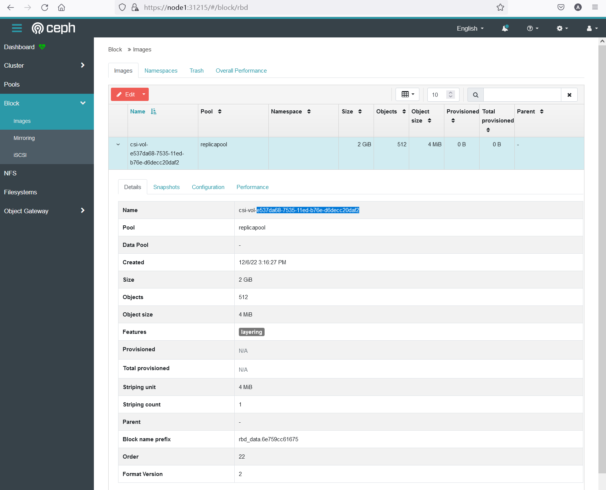


## 挂载测试2: StatefulSet应用的挂载

创建配置文件

```bash
nano nginxsts.yaml
```


```yaml
apiVersion: v1
kind: Service
metadata:
  name: nginx
  labels:
    app: nginx
spec:
  ports:
  - port: 80
    name: web
  clusterIP: None
  selector:
    app: nginx
---
apiVersion: apps/v1
kind: StatefulSet
metadata:
  name: web
spec:
  selector:
    matchLabels:
      app: nginx # has to match .spec.template.metadata.labels
  serviceName: "nginx"
  replicas: 3 # by default is 1
  template:
    metadata:
      labels:
        app: nginx # has to match .spec.selector.matchLabels
    spec:
      terminationGracePeriodSeconds: 10
      containers:
      - name: nginx
        image: nginx 
        ports:
        - containerPort: 80
          name: web
        volumeMounts:
        - name: www
          mountPath: /usr/share/nginx/html
  volumeClaimTemplates:
  - metadata:
      name: www
    spec:
      accessModes: [ "ReadWriteOnce" ]
      storageClassName: "rook-ceph-block"
      resources:
        requests:
          storage: 1Gi
```


安装sts

```bash
kubectl apply -f nginxsts.yaml
```


查看pod

```
kubectl get pod | grep web
```


```bash
root@node1:~# kubectl get pod | grep web
web-0                              1/1     Running   0          2m39s
web-1                              1/1     Running   0          2m9s
web-2                              1/1     Running   0          100s
```


查看pv pvc

```bash
kubectl get pv | grep web
```


```bash
kubectl get pvc | grep web
```


```bash
root@node1:~# kubectl get pv | grep web
pvc-56697229-9847-4140-86cb-abd4a665fdc6   1Gi        RWO            Delete           Bound    default/www-web-0        rook-ceph-block            3m21s
pvc-83f6be05-4088-4847-b21d-4592bb71c497   1Gi        RWO            Delete           Bound    default/www-web-2        rook-ceph-block            2m22s
pvc-c90c79e7-3236-4bac-b042-e0eaef2833d9   1Gi        RWO            Delete           Bound    default/www-web-1        rook-ceph-block            2m52s
root@node1:~# kubectl get pvc | grep web
www-web-0        Bound    pvc-56697229-9847-4140-86cb-abd4a665fdc6   1Gi        RWO            rook-ceph-block   3m33s
www-web-1        Bound    pvc-c90c79e7-3236-4bac-b042-e0eaef2833d9   1Gi        RWO            rook-ceph-block   3m3s
www-web-2        Bound    pvc-83f6be05-4088-4847-b21d-4592bb71c497   1Gi        RWO            rook-ceph-block   2m34s
```


查看pvc配置细节

```bash
kubectl describe pvc www-web-0
```


```bash
root@node1:~# kubectl describe pvc www-web-0
Name:          www-web-0
Namespace:     default
StorageClass:  rook-ceph-block
Status:        Bound
Volume:        pvc-56697229-9847-4140-86cb-abd4a665fdc6
Labels:        app=nginx
Annotations:   pv.kubernetes.io/bind-completed: yes
               pv.kubernetes.io/bound-by-controller: yes
               volume.beta.kubernetes.io/storage-provisioner: rook-ceph.rbd.csi.ceph.com
               volume.kubernetes.io/storage-provisioner: rook-ceph.rbd.csi.ceph.com
Finalizers:    [kubernetes.io/pvc-protection]
Capacity:      1Gi
Access Modes:  RWO
VolumeMode:    Filesystem
Used By:       web-0
Events:        <none>
```


查看pv配置细节

```bash
kubectl describe pv pvc-56697229-9847-4140-86cb-abd4a665fdc6
```


```bash
root@node1:~# kubectl describe pv pvc-56697229-9847-4140-86cb-abd4a665fdc6
Name:            pvc-56697229-9847-4140-86cb-abd4a665fdc6
Labels:          <none>
Annotations:     pv.kubernetes.io/provisioned-by: rook-ceph.rbd.csi.ceph.com
Finalizers:      [kubernetes.io/pv-protection]
StorageClass:    rook-ceph-block
Status:          Bound
Claim:           default/www-web-0
Reclaim Policy:  Delete
Access Modes:    RWO
VolumeMode:      Filesystem
Capacity:        1Gi
Node Affinity:   <none>
Message:
Source:
    Type:              CSI (a Container Storage Interface (CSI) volume source)
    Driver:            rook-ceph.rbd.csi.ceph.com
    FSType:            ext4
    VolumeHandle:      0001-0009-rook-ceph-0000000000000002-0e31385e-7539-11ed-b76e-d6decc20daf2
    ReadOnly:          false
    VolumeAttributes:      clusterID=rook-ceph
                           csi.storage.k8s.io/pv/name=pvc-56697229-9847-4140-86cb-abd4a665fdc6
                           csi.storage.k8s.io/pvc/name=www-web-0
                           csi.storage.k8s.io/pvc/namespace=default
                           imageFeatures=layering
                           imageFormat=2
                           imageName=csi-vol-0e31385e-7539-11ed-b76e-d6decc20daf2
                           journalPool=replicapool
                           pool=replicapool
                           storage.kubernetes.io/csiProvisionerIdentity=1670290455468-8081-rook-ceph.rbd.csi.ceph.com
Events:                <none>
```


dashboard上进行查看

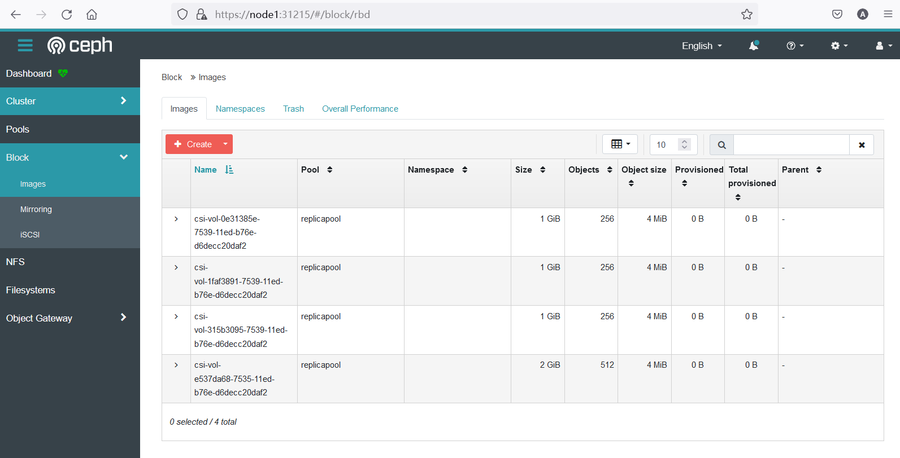


# 实现文件共享存储


## 创建文件共享存储池和存储类

查看文件存储池定义文件

```
```


```yaml
#################################################################################################################
# Create a filesystem with settings with replication enabled for a production environment.
# A minimum of 3 OSDs on different nodes are required in this example.
#  kubectl create -f filesystem.yaml
#################################################################################################################

apiVersion: ceph.rook.io/v1
kind: CephFilesystem
metadata:
  name: myfs
  namespace: rook-ceph # namespace:cluster
spec:
  # The metadata pool spec. Must use replication.
  metadataPool: #元数据池
    replicated:
      size: 3
      requireSafeReplicaSize: true
    parameters:
      # Inline compression mode for the data pool
      # Further reference: https://docs.ceph.com/docs/nautilus/rados/configuration/bluestore-config-ref/#inline-compression
      compression_mode:
        none
        # gives a hint (%) to Ceph in terms of expected consumption of the total cluster capacity of a given pool
      # for more info: https://docs.ceph.com/docs/master/rados/operations/placement-groups/#specifying-expected-pool-size
      #target_size_ratio: ".5"
  # The list of data pool specs. Can use replication or erasure coding.
  dataPools: #数据池
    - failureDomain: host
      replicated:
        size: 3
        # Disallow setting pool with replica 1, this could lead to data loss without recovery.
        # Make sure you're *ABSOLUTELY CERTAIN* that is what you want
        requireSafeReplicaSize: true
      parameters:
        # Inline compression mode for the data pool
        # Further reference: https://docs.ceph.com/docs/nautilus/rados/configuration/bluestore-config-ref/#inline-compression
        compression_mode:
          none
          # gives a hint (%) to Ceph in terms of expected consumption of the total cluster capacity of a given pool
        # for more info: https://docs.ceph.com/docs/master/rados/operations/placement-groups/#specifying-expected-pool-size
        #target_size_ratio: ".5"
  # Whether to preserve filesystem after CephFilesystem CRD deletion
  preserveFilesystemOnDelete: true
  # The metadata service (mds) configuration
  metadataServer:
    # The number of active MDS instances
    activeCount: 1
    # Whether each active MDS instance will have an active standby with a warm metadata cache for faster failover.
    # If false, standbys will be available, but will not have a warm cache.
    activeStandby: true
    # The affinity rules to apply to the mds deployment
    placement:
      #  nodeAffinity:
      #    requiredDuringSchedulingIgnoredDuringExecution:
      #      nodeSelectorTerms:
      #      - matchExpressions:
      #        - key: role
      #          operator: In
      #          values:
      #          - mds-node
      #  topologySpreadConstraints:
      #  tolerations:
      #  - key: mds-node
      #    operator: Exists
      #  podAffinity:
      podAntiAffinity:
        requiredDuringSchedulingIgnoredDuringExecution:
          - labelSelector:
              matchExpressions:
                - key: app
                  operator: In
                  values:
                    - rook-ceph-mds
            # topologyKey: kubernetes.io/hostname will place MDS across different hosts
            topologyKey: kubernetes.io/hostname
        preferredDuringSchedulingIgnoredDuringExecution:
          - weight: 100
            podAffinityTerm:
              labelSelector:
                matchExpressions:
                  - key: app
                    operator: In
                    values:
                      - rook-ceph-mds
              # topologyKey: */zone can be used to spread MDS across different AZ
              # Use <topologyKey: failure-domain.beta.kubernetes.io/zone> in k8s cluster if your cluster is v1.16 or lower
              # Use <topologyKey: topology.kubernetes.io/zone>  in k8s cluster is v1.17 or upper
              topologyKey: topology.kubernetes.io/zone
    # A key/value list of annotations
    annotations:
    #  key: value
    # A key/value list of labels
    labels:
    #  key: value
    resources:
    # The requests and limits set here, allow the filesystem MDS Pod(s) to use half of one CPU core and 1 gigabyte of memory
    #  limits:
    #    cpu: "500m"
    #    memory: "1024Mi"
    #  requests:
    #    cpu: "500m"
    #    memory: "1024Mi"
    # priorityClassName: my-priority-class
  mirroring:
    enabled: false
```


安装共享存储池

```bash
kubectl apply -f filesystem.yaml
```


查看共享池对应的pod

```
kubectl get pod -n rook-ceph | grep rook-ceph-mds
```


```bash
root@node1:~/rook/cluster/examples/kubernetes/ceph# kubectl get pod -n rook-ceph | grep rook-ceph-mds
rook-ceph-mds-myfs-a-867b467bc9-v7h6d             1/1     Running     0          64s
rook-ceph-mds-myfs-b-dff746db5-tqltl              1/1     Running     0          63s
```


从dashboard上进行查看

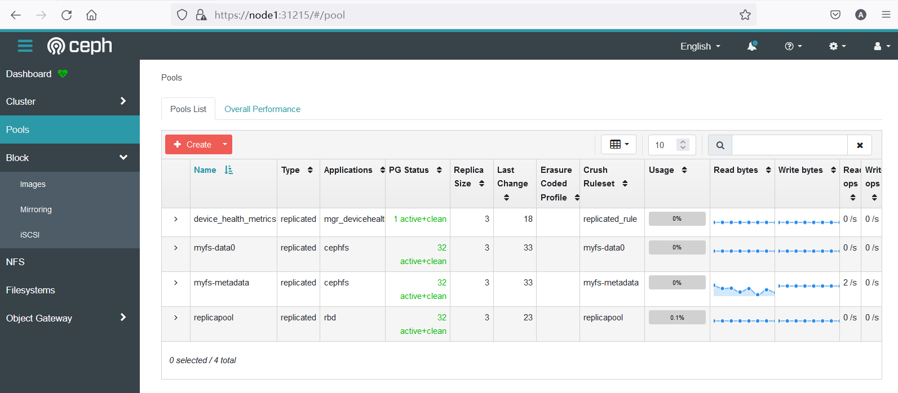


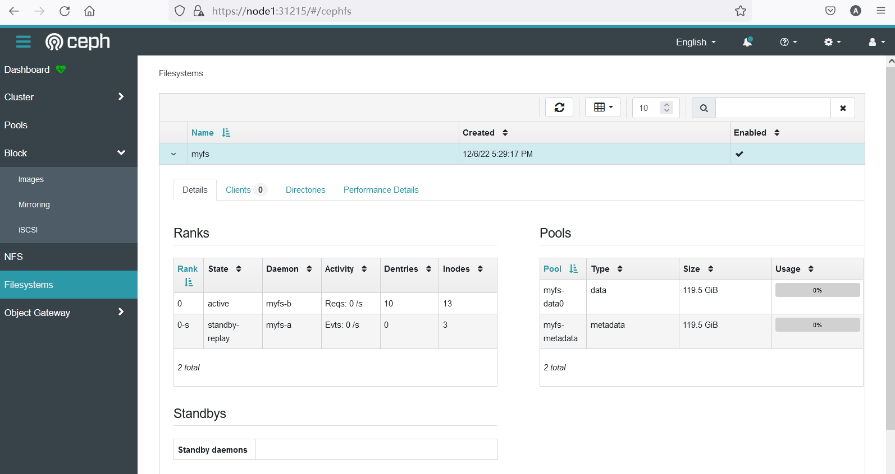

查看存储类定义文件

```bash
/root/rook/cluster/examples/kubernetes/ceph/csi/cephfs
```


```bash
nano storageclass.yaml
```


```yaml
apiVersion: storage.k8s.io/v1
kind: StorageClass
metadata:
  name: rook-cephfs
provisioner: rook-ceph.cephfs.csi.ceph.com # driver:namespace:operator
parameters:
  # clusterID is the namespace where operator is deployed.
  clusterID: rook-ceph # namespace:cluster

  # CephFS filesystem name into which the volume shall be created
  fsName: myfs

  # Ceph pool into which the volume shall be created
  # Required for provisionVolume: "true"
  pool: myfs-data0 #数据池名称

  # The secrets contain Ceph admin credentials. These are generated automatically by the operator
  # in the same namespace as the cluster.
  csi.storage.k8s.io/provisioner-secret-name: rook-csi-cephfs-provisioner
  csi.storage.k8s.io/provisioner-secret-namespace: rook-ceph # namespace:cluster
  csi.storage.k8s.io/controller-expand-secret-name: rook-csi-cephfs-provisioner
  csi.storage.k8s.io/controller-expand-secret-namespace: rook-ceph # namespace:cluster
  csi.storage.k8s.io/node-stage-secret-name: rook-csi-cephfs-node
  csi.storage.k8s.io/node-stage-secret-namespace: rook-ceph # namespace:cluster

  # (optional) The driver can use either ceph-fuse (fuse) or ceph kernel client (kernel)
  # If omitted, default volume mounter will be used - this is determined by probing for ceph-fuse
  # or by setting the default mounter explicitly via --volumemounter command-line argument.
  # mounter: kernel
reclaimPolicy: Delete
allowVolumeExpansion: true
mountOptions:
  # uncomment the following line for debugging
  #- debug
```


安装存储类

```bash
 kubectl apply -f storageclass.yaml
```


查看存储类型

```bash
kubectl get storageclass
```


```bash
root@node1:~/rook/cluster/examples/kubernetes/ceph/csi/cephfs# kubectl get storageclass
NAME              PROVISIONER                     RECLAIMPOLICY   VOLUMEBINDINGMODE   ALLOWVOLUMEEXPANSION   AGE
rook-ceph-block   rook-ceph.rbd.csi.ceph.com      Delete          Immediate           true                   168m
rook-cephfs       rook-ceph.cephfs.csi.ceph.com   Delete          Immediate           true                   119s
```


## 挂载测试: 多web应用共享存储

创建配置文件

```bash
nano nginxcephfs.yaml
```


```yaml
apiVersion: v1
kind: Service
metadata:
  name: nginxcephfs
  labels:
    app: nginx
spec:
  ports:
  - port: 80
    name: web
  selector:
    app: nginx
  type: ClusterIP
---
kind: PersistentVolumeClaim
apiVersion: v1
metadata:
  name: nginx-share-pvc # pvc名称
spec:
  storageClassName: rook-cephfs # 存储类型名称
  accessModes:
    - ReadWriteMany # 访问莫斯
  resources:
    requests:
      storage: 1Gi
---
apiVersion: apps/v1
kind: Deployment
metadata:
  name: web
spec:
  selector:
    matchLabels:
      app: nginx # has to match .spec.template.metadata.labels
  replicas: 3 # by default is 1
  template:
    metadata:
      labels:
        app: nginx # has to match .spec.selector.matchLabels
    spec:
      containers:
      - name: nginx
        image: nginx
        imagePullPolicy: IfNotPresent
        ports:
        - containerPort: 80
          name: web
        volumeMounts:
        - name: www
          mountPath: /usr/share/nginx/html #挂接点
      volumes:
        - name: www
          persistentVolumeClaim:
            claimName: nginx-share-pvc # pvc名称
```


运行测试应用

```bash
kubectl apply -f nginxcephfs.yaml
```


观察应用的pod

```bash
kubectl get pod
```


```bash
root@node1:~# kubectl get pod
NAME                               READY   STATUS    RESTARTS   AGE
web-55fbcf5b7d-4hdz8               1/1     Running   0          7m5s
web-55fbcf5b7d-ftqnf               1/1     Running   0          7m5s
web-55fbcf5b7d-ltxf9               1/1     Running   0          7m5s
```


观察pvc pv

```
kubectl get pvc
```


```
kubectl get pv
```


```bash
root@node1:~# kubectl get pvc
NAME              STATUS   VOLUME                                     CAPACITY   ACCESS MODES   STORAGECLASS      AGE
nginx-share-pvc   Bound    pvc-e16898a4-2571-4e92-971b-5c432a881d67   1Gi        RWX            rook-cephfs       8m16s
root@node1:~# kubectl get pv
NAME                                       CAPACITY   ACCESS MODES   RECLAIM POLICY   STATUS   CLAIM                     STORAGECLASS      REASON   AGE
pvc-e16898a4-2571-4e92-971b-5c432a881d67   1Gi        RWX            Delete           Bound    default/nginx-share-pvc   rook-cephfs                8m27s
```


查看pvc详细配置

```bash
 kubectl describe pvc nginx-share-pvc
```


```bash
root@node1:~# kubectl describe pvc nginx-share-pvc
Name:          nginx-share-pvc
Namespace:     default
StorageClass:  rook-cephfs
Status:        Bound
Volume:        pvc-e16898a4-2571-4e92-971b-5c432a881d67
Labels:        <none>
Annotations:   pv.kubernetes.io/bind-completed: yes
               pv.kubernetes.io/bound-by-controller: yes
               volume.beta.kubernetes.io/storage-provisioner: rook-ceph.cephfs.csi.ceph.com
               volume.kubernetes.io/storage-provisioner: rook-ceph.cephfs.csi.ceph.com
Finalizers:    [kubernetes.io/pvc-protection]
Capacity:      1Gi
Access Modes:  RWX
VolumeMode:    Filesystem
Used By:       web-55fbcf5b7d-4hdz8
               web-55fbcf5b7d-ftqnf
               web-55fbcf5b7d-ltxf9
Events:
  Type    Reason                 Age   From                                                                                                              Message
  ----    ------                 ----  ----                                                                                                              -------
  Normal  Provisioning           11m   rook-ceph.cephfs.csi.ceph.com_csi-cephfsplugin-provisioner-7594b68bcb-wwn2j_adc19648-4b99-4a53-be00-1a414fa79104  External provisioner is provisioning volume for claim "default/nginx-share-pvc"
  Normal  ExternalProvisioning   11m   persistentvolume-controller                                                                                       waiting for a volume to be created, either by external provisioner "rook-ceph.cephfs.csi.ceph.com" or manually created by system administrator
  Normal  ProvisioningSucceeded  11m   rook-ceph.cephfs.csi.ceph.com_csi-cephfsplugin-provisioner-7594b68bcb-wwn2j_adc19648-4b99-4a53-be00-1a414fa79104  Successfully provisioned volume pvc-e16898a4-2571-4e92-971b-5c432a881d67
```

​	重点关注上述输出中的`Used By`字段


查看pv详细配置

```bash
kubectl describe pv pvc-e16898a4-2571-4e92-971b-5c432a881d67
```


```bash
root@node1:~# kubectl describe pv pvc-e16898a4-2571-4e92-971b-5c432a881d67
Name:            pvc-e16898a4-2571-4e92-971b-5c432a881d67
Labels:          <none>
Annotations:     pv.kubernetes.io/provisioned-by: rook-ceph.cephfs.csi.ceph.com
Finalizers:      [kubernetes.io/pv-protection]
StorageClass:    rook-cephfs
Status:          Bound
Claim:           default/nginx-share-pvc
Reclaim Policy:  Delete
Access Modes:    RWX
VolumeMode:      Filesystem
Capacity:        1Gi
Node Affinity:   <none>
Message:
Source:
    Type:              CSI (a Container Storage Interface (CSI) volume source)
    Driver:            rook-ceph.cephfs.csi.ceph.com
    FSType:
    VolumeHandle:      0001-0009-rook-ceph-0000000000000001-e1f4203e-754b-11ed-9ab3-fa886841851a
    ReadOnly:          false
    VolumeAttributes:      clusterID=rook-ceph
                           fsName=myfs
                           pool=myfs-data0
                           storage.kubernetes.io/csiProvisionerIdentity=1670290454522-8081-rook-ceph.cephfs.csi.ceph.com
                           subvolumeName=csi-vol-e1f4203e-754b-11ed-9ab3-fa886841851a
                           subvolumePath=/volumes/csi/csi-vol-e1f4203e-754b-11ed-9ab3-fa886841851a/5c1e32b1-b90c-4022-81f0-de0fe9194a13
Events:                <none>
```

​	重点关注上述输出中 `subvolumePath`   和`subvolumeName`字段


在dashboard中进行观察

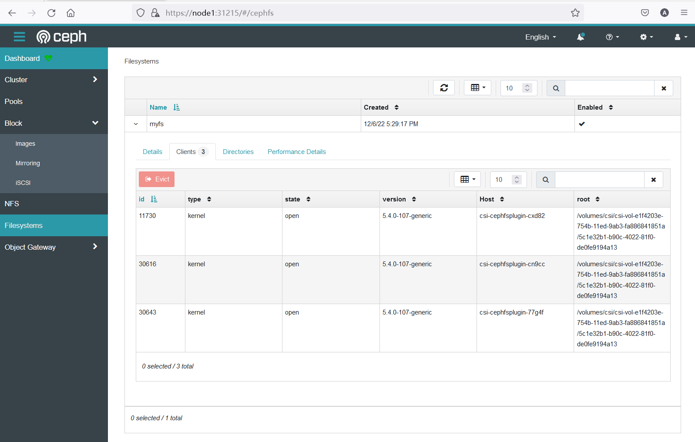


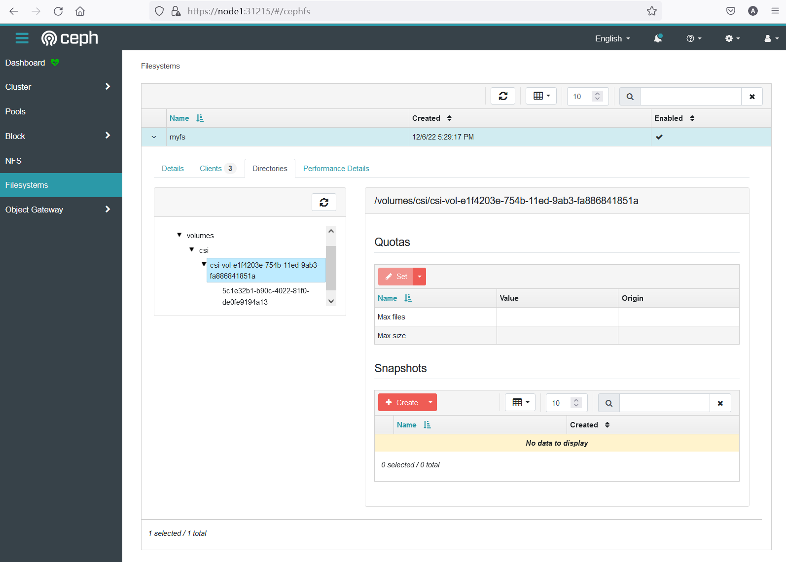

查看服务

```
kubectl get svc
```


```bash
root@node1:~# kubectl get svc
NAME              TYPE        CLUSTER-IP      EXTERNAL-IP   PORT(S)    AGE
kubernetes        ClusterIP   10.96.0.1       <none>        443/TCP    227d
nginxcephfs       ClusterIP   10.108.91.118   <none>        80/TCP     13m
```


访问服务

```bash
 curl 10.108.91.118
```


```bash
root@node1:~# curl 10.108.91.118
<html>
<head><title>403 Forbidden</title></head>
<body>
<center><h1>403 Forbidden</h1></center>
<hr><center>nginx/1.21.5</center>
</body>
</html>
```


在某一个pod中修改index.html文件

```bash
kubectl exec -it web-55fbcf5b7d-4hdz8 -- bash
```


```bash
 cd /usr/share/nginx/html
```


```bash
echo "hello rook,i am cloudzun">index.html
```


```bash
root@node1:~# kubectl exec -it web-55fbcf5b7d-4hdz8 -- bash
root@web-55fbcf5b7d-4hdz8:/# cd /usr/share/nginx/html
root@web-55fbcf5b7d-4hdz8:/usr/share/nginx/html# ls
root@web-55fbcf5b7d-4hdz8:/usr/share/nginx/html# echo "hello rook,i am cloudzun">index.html
root@web-55fbcf5b7d-4hdz8:/usr/share/nginx/html# exit
```


在其他pod中查看修改过后的结果

```bash
 kubectl exec -it web-55fbcf5b7d-ftqnf -- cat /usr/share/nginx/html/index.html
```


```bash
root@node1:~# kubectl exec -it web-55fbcf5b7d-ftqnf -- cat /usr/share/nginx/html/index.html
hello rook,i am cloudzun
root@node1:~# kubectl exec -it web-55fbcf5b7d-ltxf9 -- cat /usr/share/nginx/html/index.html
hello rook,i am cloudzun
```


重新访问服务

```
curl 10.108.91.118
```


```bash
root@node1:~# curl 10.108.91.118
hello rook,i am cloudzun
```


# PVC的扩容


## 扩容文件共享型存储

查看存储类型细节

```bash
kubectl describe sc rook-cephfs
```


```bash
root@node1:~# kubectl describe sc rook-cephfs
Name:            rook-cephfs
IsDefaultClass:  No
Annotations:     kubectl.kubernetes.io/last-applied-configuration={"allowVolumeExpansion":true,"apiVersion":"storage.k8s.io/v1","kind":"StorageClass","metadata":{"annotations":{},"name":"rook-cephfs"},"mountOptions":null,"parameters":{"clusterID":"rook-ceph","csi.storage.k8s.io/controller-expand-secret-name":"rook-csi-cephfs-provisioner","csi.storage.k8s.io/controller-expand-secret-namespace":"rook-ceph","csi.storage.k8s.io/node-stage-secret-name":"rook-csi-cephfs-node","csi.storage.k8s.io/node-stage-secret-namespace":"rook-ceph","csi.storage.k8s.io/provisioner-secret-name":"rook-csi-cephfs-provisioner","csi.storage.k8s.io/provisioner-secret-namespace":"rook-ceph","fsName":"myfs","pool":"myfs-data0"},"provisioner":"rook-ceph.cephfs.csi.ceph.com","reclaimPolicy":"Delete"}

Provisioner:           rook-ceph.cephfs.csi.ceph.com
Parameters:            clusterID=rook-ceph,csi.storage.k8s.io/controller-expand-secret-name=rook-csi-cephfs-provisioner,csi.storage.k8s.io/controller-expand-secret-namespace=rook-ceph,csi.storage.k8s.io/node-stage-secret-name=rook-csi-cephfs-node,csi.storage.k8s.io/node-stage-secret-namespace=rook-ceph,csi.storage.k8s.io/provisioner-secret-name=rook-csi-cephfs-provisioner,csi.storage.k8s.io/provisioner-secret-namespace=rook-ceph,fsName=myfs,pool=myfs-data0
AllowVolumeExpansion:  True
MountOptions:          <none>
ReclaimPolicy:         Delete
VolumeBindingMode:     Immediate
Events:                <none>
```

重点关注上述输出中的 `AllowVolumeExpansion:  True` 字段


修改pvc配置

```bash
KUBE_EDITOR="nano" kubectl edit pvc nginx-share-pvc
```


```yaml
# Please edit the object below. Lines beginning with a '#' will be ignored,
# and an empty file will abort the edit. If an error occurs while saving this file will be
# reopened with the relevant failures.
#
apiVersion: v1
kind: PersistentVolumeClaim
metadata:
  annotations:
    kubectl.kubernetes.io/last-applied-configuration: |
      {"apiVersion":"v1","kind":"PersistentVolumeClaim","metadata":{"annotations":{},"name":"nginx-share-pvc","namespace":"default"},"spec":{"accessModes":["ReadWriteMany"],"resour>
    pv.kubernetes.io/bind-completed: "yes"
    pv.kubernetes.io/bound-by-controller: "yes"
    volume.beta.kubernetes.io/storage-provisioner: rook-ceph.cephfs.csi.ceph.com
    volume.kubernetes.io/storage-provisioner: rook-ceph.cephfs.csi.ceph.com
  creationTimestamp: "2022-12-06T09:53:49Z"
  finalizers:
  - kubernetes.io/pvc-protection
  name: nginx-share-pvc
  namespace: default
  resourceVersion: "98161"
  uid: e16898a4-2571-4e92-971b-5c432a881d67
spec:
  accessModes:
  - ReadWriteMany
  resources:
    requests:
      storage: 2Gi #修改此处的值 1Gi-->2Gi
  storageClassName: rook-cephfs
  volumeMode: Filesystem
  volumeName: pvc-e16898a4-2571-4e92-971b-5c432a881d67
status:
  accessModes:
  - ReadWriteMany
  capacity:
    storage: 1Gi
  phase: Bound
```


等待3~5分钟之后,查看pvc和pv

```bash
kubectl get pvc | grep nginx-share-pvc
```


```bash
kubectl get pv | grep nginx-share-pvc
```


```bash
root@node1:~# kubectl get pvc | grep nginx-share-pvc
nginx-share-pvc   Bound    pvc-e16898a4-2571-4e92-971b-5c432a881d67   2Gi        RWX            rook-cephfs       15h
root@node1:~# kubectl get pv | grep nginx-share-pvc
pvc-e16898a4-2571-4e92-971b-5c432a881d67   2Gi        RWX            Delete           Bound    default/nginx-share-pvc   rook-cephfs                15h
```


到pod层面进行查看

```bash
 kubectl exec -it web-55fbcf5b7d-4hdz8 -- bash
```


```bash
df -Th
```


```bash
root@web-55fbcf5b7d-4hdz8:/# df -Th
Filesystem                                                                                                                                                 Type     Size  Used Avail Use% Mounted on
overlay                                                                                                                                                    overlay  125G  9.3G  110G   8% /
tmpfs                                                                                                                                                      tmpfs     64M     0   64M   0% /dev
tmpfs                                                                                                                                                      tmpfs    3.9G     0  3.9G   0% /sys/fs/cgroup
/dev/sda1                                                                                                                                                  ext4     125G  9.3G  110G   8% /etc/hosts
shm                                                                                                                                                        tmpfs     64M     0   64M   0% /dev/shm
10.101.130.249:6789,10.106.237.229:6789,10.102.106.129:6789:/volumes/csi/csi-vol-e1f4203e-754b-11ed-9ab3-fa886841851a/5c1e32b1-b90c-4022-81f0-de0fe9194a13 ceph     2.0G     0  2.0G   0% /usr/share/nginx/html
tmpfs                                                                                                                                                      tmpfs    7.7G   12K  7.7G   1% /run/secrets/kubernetes.io/serviceaccount
tmpfs                                                                                                                                                      tmpfs    3.9G     0  3.9G   0% /proc/acpi
tmpfs                                                                                                                                                      tmpfs    3.9G     0  3.9G   0% /proc/scsi
tmpfs                                                                                                                                                      tmpfs    3.9G     0  3.9G   0% /sys/firmware
```

观察第8行中


## 扩展块存储

```bash
KUBE_EDITOR="nano" kubectl edit pvc mysql-pv-claim
```


```yaml
# Please edit the object below. Lines beginning with a '#' will be ignored,
# and an empty file will abort the edit. If an error occurs while saving this file will be
# reopened with the relevant failures.
#
apiVersion: v1
kind: PersistentVolumeClaim
metadata:
  annotations:
    kubectl.kubernetes.io/last-applied-configuration: |
      {"apiVersion":"v1","kind":"PersistentVolumeClaim","metadata":{"annotations":{},"labels":{"app":"wordpress"},"name":"mysql-pv-claim","namespace":"default"},"spec":{"accessMode>
    pv.kubernetes.io/bind-completed: "yes"
    pv.kubernetes.io/bound-by-controller: "yes"
    volume.beta.kubernetes.io/storage-provisioner: rook-ceph.rbd.csi.ceph.com
    volume.kubernetes.io/storage-provisioner: rook-ceph.rbd.csi.ceph.com
  creationTimestamp: "2022-12-06T07:16:25Z"
  finalizers:
  - kubernetes.io/pvc-protection
  labels:
    app: wordpress
  name: mysql-pv-claim
  namespace: default
  resourceVersion: "155056"
  uid: 1b7011a4-e4a4-4018-a61f-1a9fc58e127d
spec:
  accessModes:
  - ReadWriteOnce
  resources:
    requests:
      storage: 4Gi #修改此处的值 2Gi-->4Gi
  storageClassName: rook-ceph-block
  volumeMode: Filesystem
  volumeName: pvc-1b7011a4-e4a4-4018-a61f-1a9fc58e127d
status:
  accessModes:
  - ReadWriteOnce
  capacity:
    storage: 2Gi
  conditions:
  - lastProbeTime: null
    lastTransitionTime: "2022-12-07T01:20:41Z"
    status: "True"
  phase: Bound
```


等待3~5分钟之后,查看pvc和pv

```
kubectl get pvc | grep mysql-pv-claim
kubectl get pv | grep mysql-pv-claim
```


```bash
root@node1:~# kubectl get pvc | grep mysql-pv-claim
mysql-pv-claim    Bound    pvc-1b7011a4-e4a4-4018-a61f-1a9fc58e127d   4Gi        RWO            rook-ceph-block   18h
root@node1:~# kubectl get pv | grep mysql-pv-claim
pvc-1b7011a4-e4a4-4018-a61f-1a9fc58e127d   4Gi        RWO            Delete           Bound    default/mysql-pv-claim    rook-ceph-block            18h
```


到pod层面进行查看

```bash
kubectl exec -it wordpress-mysql-79966d6c5b-ps5m9 -- bash
```


```bash
df -Th
```


```bash
root@wordpress-mysql-79966d6c5b-ps5m9:/# df -Th
Filesystem     Type     Size  Used Avail Use% Mounted on
overlay        overlay  125G  9.3G  110G   8% /
tmpfs          tmpfs     64M     0   64M   0% /dev
tmpfs          tmpfs    3.9G     0  3.9G   0% /sys/fs/cgroup
/dev/sda1      ext4     125G  9.3G  110G   8% /etc/hosts
shm            tmpfs     64M     0   64M   0% /dev/shm
/dev/rbd0      ext4     3.9G  124M  3.8G   4% /var/lib/mysql
tmpfs          tmpfs    7.7G   12K  7.7G   1% /run/secrets/kubernetes.io/serviceaccount
tmpfs          tmpfs    3.9G     0  3.9G   0% /proc/acpi
tmpfs          tmpfs    3.9G     0  3.9G   0% /proc/scsi
tmpfs          tmpfs    3.9G     0  3.9G   0% /sys/firmware
```

观察第8行


# 实现存储快照


## 安装snapshot控制器

下载repo执行安装

```bash
git clone https://github.com/dotbalo/k8s-ha-install.git
cd /root/k8s-ha-install/
git checkout manual-installation-v1.20.x
kubectl apply -f snapshotter/ -n kube-system
```


查看安装情况

```bash
kubectl get pod -n kube-system | grep snapshot
```


```bash
root@node1:~/k8s-ha-install# kubectl get pod -n kube-system | grep snapshot
snapshot-controller-0                     1/1     Running   0             53s
```


创建块存储快照类

```bash
 kubectl apply -f snapshotclass.yaml
```


查看存储快照类

```bash
kubectl get VolumeSnapshotClass
```


```bash
root@node1:~/rook/cluster/examples/kubernetes/ceph/csi/rbd# kubectl get VolumeSnapshotClass
NAME                      DRIVER                       DELETIONPOLICY   AGE
csi-rbdplugin-snapclass   rook-ceph.rbd.csi.ceph.com   Delete           73s
```


查看存储快照类详细配置

```bash
kubectl describe VolumeSnapshotClass csi-rbdplugin-snapclass
```


```bash
root@node1:~/rook/cluster/examples/kubernetes/ceph/csi/rbd# kubectl describe VolumeSnapshotClass csi-rbdplugin-snapclass
Name:             csi-rbdplugin-snapclass
Namespace:
Labels:           <none>
Annotations:      <none>
API Version:      snapshot.storage.k8s.io/v1
Deletion Policy:  Delete
Driver:           rook-ceph.rbd.csi.ceph.com
Kind:             VolumeSnapshotClass
Metadata:
  Creation Timestamp:  2022-12-07T02:49:40Z
  Generation:          1
  Managed Fields:
    API Version:  snapshot.storage.k8s.io/v1
    Fields Type:  FieldsV1
    fieldsV1:
      f:deletionPolicy:
      f:driver:
      f:metadata:
        f:annotations:
          .:
          f:kubectl.kubernetes.io/last-applied-configuration:
      f:parameters:
        .:
        f:clusterID:
        f:csi.storage.k8s.io/snapshotter-secret-name:
        f:csi.storage.k8s.io/snapshotter-secret-namespace:
    Manager:         kubectl-client-side-apply
    Operation:       Update
    Time:            2022-12-07T02:49:40Z
  Resource Version:  171214
  UID:               60892e32-3b04-4ca8-9f54-f6e091761dc2
Parameters:
  Cluster ID:                                       rook-ceph
  csi.storage.k8s.io/snapshotter-secret-name:       rook-csi-rbd-provisioner
  csi.storage.k8s.io/snapshotter-secret-namespace:  rook-ceph
Events:                                             <none>
```


## 创建快照

在MySQL Pod中填充实验数据

```bash
kubectl exec -it wordpress-mysql-79966d6c5b-ps5m9 --bash
```


```bash
cd /var/lib/mysql
mkdir test_snapshot
echo "test for snapshot from cloudzun">test_snapshot/haha.txt
cat test_snapshot/haha.txt
exit
```


```bash
root@node1:~/rook/cluster/examples/kubernetes/ceph/csi/rbd# kubectl exec -it wordpress-mysql-79966d6c5b-ps5m9 -- bash
root@wordpress-mysql-79966d6c5b-ps5m9:/# cd /var/lib/mysql
root@wordpress-mysql-79966d6c5b-ps5m9:/var/lib/mysql# mkdir test_snapshot
root@wordpress-mysql-79966d6c5b-ps5m9:/var/lib/mysql# echo "test for snapshot from cloudzun">test_snapshot/haha.txt
root@wordpress-mysql-79966d6c5b-ps5m9:/var/lib/mysql# cat test_snapshot/haha.txt
test for snapshot from cloudzun
root@wordpress-mysql-79966d6c5b-ps5m9:/var/lib/mysql#exit
exit
root@node1:~/rook/cluster/examples/kubernetes/ceph/csi/rbd#
```


打开快照配置文件

```bash
nano snapshot.yaml
```


```bash
---
# 1.17 <= K8s <= v1.19
# apiVersion: snapshot.storage.k8s.io/v1beta1
# K8s >= v1.20
apiVersion: snapshot.storage.k8s.io/v1
kind: VolumeSnapshot
metadata:
  name: rbd-pvc-snapshot
spec:
  volumeSnapshotClassName: csi-rbdplugin-snapclass
  source:
    persistentVolumeClaimName: mysql-pv-claim #修改此处的pvc名称为需要拍摄快照的pvc
```


创建快照

```bash
kubectl apply -f snapshot.yaml
```


查看快照

```bash
root@node1:~/rook/cluster/examples/kubernetes/ceph/csi/rbd# kubectl get volumesnapshot
NAME               READYTOUSE   SOURCEPVC        SOURCESNAPSHOTCONTENT   RESTORESIZE   SNAPSHOTCLASS             SNAPSHOTCONTENT                                    CREATIONTIME   AGE
rbd-pvc-snapshot   true         mysql-pv-claim                           4Gi           csi-rbdplugin-snapclass   snapcontent-df031985-0595-42c3-914c-ced6c8721d48   3s             80s

```


查看`volumesnapshotcontent`详细配置信息

```bash
 kubectl get  volumesnapshotcontent
 
 kubectl describe volumesnapshotcontent snapcontent-df031985-0595-42c3-914c-ced6c8721d48
```


```bash
root@node1:~/rook/cluster/examples/kubernetes/ceph/csi/rbd# kubectl get  volumesnapshotcontent
NAME                                               READYTOUSE   RESTORESIZE   DELETIONPOLICY   DRIVER                       VOLUMESNAPSHOTCLASS       VOLUMESNAPSHOT     AGE
snapcontent-df031985-0595-42c3-914c-ced6c8721d48   true         4294967296    Delete           rook-ceph.rbd.csi.ceph.com   csi-rbdplugin-snapclass   rbd-pvc-snapshot   12m
root@node1:~/rook/cluster/examples/kubernetes/ceph/csi/rbd# kubectl describe volumesnapshotcontent snapcontent-df031985-0595-42c3-914c-ced6c8721d48
Name:         snapcontent-df031985-0595-42c3-914c-ced6c8721d48
Namespace:
Labels:       <none>
Annotations:  snapshot.storage.kubernetes.io/deletion-secret-name: rook-csi-rbd-provisioner
              snapshot.storage.kubernetes.io/deletion-secret-namespace: rook-ceph
API Version:  snapshot.storage.k8s.io/v1
Kind:         VolumeSnapshotContent
Metadata:
  Creation Timestamp:  2022-12-07T03:17:14Z
  Finalizers:
    snapshot.storage.kubernetes.io/volumesnapshotcontent-bound-protection
  Generation:  1
  Managed Fields:
    API Version:  snapshot.storage.k8s.io/v1beta1
    Fields Type:  FieldsV1
    fieldsV1:
      f:metadata:
        f:annotations:
          .:
          f:snapshot.storage.kubernetes.io/deletion-secret-name:
          f:snapshot.storage.kubernetes.io/deletion-secret-namespace:
        f:finalizers:
          .:
          v:"snapshot.storage.kubernetes.io/volumesnapshotcontent-bound-protection":
      f:spec:
        .:
        f:deletionPolicy:
        f:driver:
        f:source:
          .:
          f:volumeHandle:
        f:volumeSnapshotClassName:
        f:volumeSnapshotRef:
          .:
          f:apiVersion:
          f:kind:
          f:name:
          f:namespace:
          f:resourceVersion:
          f:uid:
    Manager:      snapshot-controller
    Operation:    Update
    Time:         2022-12-07T03:17:14Z
    API Version:  snapshot.storage.k8s.io/v1
    Fields Type:  FieldsV1
    fieldsV1:
      f:status:
        .:
        f:creationTime:
        f:readyToUse:
        f:restoreSize:
        f:snapshotHandle:
    Manager:         csi-snapshotter
    Operation:       Update
    Time:            2022-12-07T03:17:16Z
  Resource Version:  176224
  UID:               3c5948cd-7874-45d0-b93c-f2548d1ea612
Spec:
  Deletion Policy:  Delete
  Driver:           rook-ceph.rbd.csi.ceph.com
  Source:
    Volume Handle:             0001-0009-rook-ceph-0000000000000002-e537da68-7535-11ed-b76e-d6decc20daf2
  Volume Snapshot Class Name:  csi-rbdplugin-snapclass
  Volume Snapshot Ref:
    API Version:       snapshot.storage.k8s.io/v1beta1
    Kind:              VolumeSnapshot
    Name:              rbd-pvc-snapshot
    Namespace:         default
    Resource Version:  176210
    UID:               df031985-0595-42c3-914c-ced6c8721d48
Status:
  Creation Time:    1670383035549849738
  Ready To Use:     true
  Restore Size:     4294967296
  Snapshot Handle:  0001-0009-rook-ceph-0000000000000002-a5dce5bf-75dd-11ed-b76e-d6decc20daf2
Events:             <none>
```

特别关注上述输出中的`Volume Handle:`和`Snapshot Handle:`的值


在dashboard中进行查看

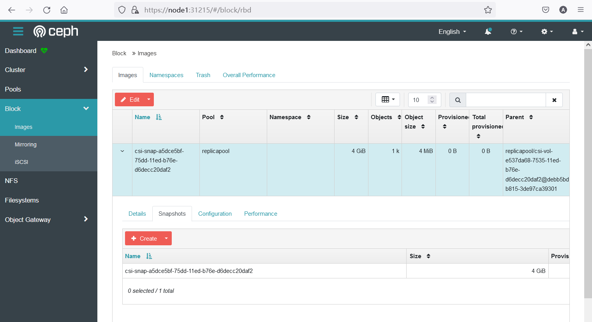


## 快照恢复和校验

设置快照配置

```bash
 nano pvc-restore.yaml
```


```bash
---
apiVersion: v1
kind: PersistentVolumeClaim
metadata:
  name: rbd-pvc-restore
spec:
  storageClassName: rook-ceph-block
  dataSource:
    name: rbd-pvc-snapshot
    kind: VolumeSnapshot
    apiGroup: snapshot.storage.k8s.io
  accessModes:
    - ReadWriteOnce
  resources:
    requests:
      storage: 4Gi #容量不得小于原始pvc
```


恢复快照

```bash
kubectl apply -f pvc-restore.yaml
```


查看恢复的快照的pvc

```
kubectl get pvc
```


```bash
root@node1:~/rook/cluster/examples/kubernetes/ceph/csi/rbd# kubectl get pvc
NAME              STATUS   VOLUME                                     CAPACITY   ACCESS MODES   STORAGECLASS      AGE
mysql-pv-claim    Bound    pvc-1b7011a4-e4a4-4018-a61f-1a9fc58e127d   4Gi        RWO            rook-ceph-block   20h
rbd-pvc-restore   Bound    pvc-5a2a3d4a-f7b1-4013-9354-8f1f163c4f98   4Gi        RWO            rook-ceph-block   40s
```


创建数据验证工作负载

```bash
 nano testpod.yaml
```


```yaml
---
apiVersion: apps/v1
kind: Deployment
metadata:
  name: check-snapshot-restore
spec:
  selector:
    matchLabels:
      app: check 
  strategy:
    type: Recreate
  template:
    metadata:
      labels:
        app: check 
    spec:
      containers:
      - image: alpine:3.8
        name: check
        command:
        - sh
        - -c
        - sleep 36000
        volumeMounts:
        - name: check-mysql-persistent-storage
          mountPath: /mnt
      volumes:
      - name: check-mysql-persistent-storage
        persistentVolumeClaim:
          claimName: rbd-pvc-restore 
```


```bash
kubectl apply -f testpod.yaml
```


验证数据

```bash
 kubectl get pod 
```


```bash
kubectl exec -it check-snapshot-restore-6df758bdd6-2jl95 -- cat /mnt/test_snapshot/haha.txt
```


```bash
root@node1:~/rook/cluster/examples/kubernetes/ceph/csi/rbd# kubectl exec -it check-snapshot-restore-6df758bdd6-2jl95 -- cat /mnt/test_snapshot/haha.txt
test for snapshot from cloudzun
```


# 实现PVC克隆

修改克隆配置文件

```bash
nano pvc-clone.yaml
```


```yaml
---
apiVersion: v1
kind: PersistentVolumeClaim
metadata:
  name: rbd-pvc-clone
spec:
  storageClassName: rook-ceph-block
  dataSource:
    name: mysql-pv-claim #克隆目标卷名称
    kind: PersistentVolumeClaim
  accessModes:
    - ReadWriteOnce
  resources:
    requests:
      storage: 4Gi #容量不得小于目标卷
```


创建克隆

```bash
kubectl apply -f pvc-clone.yaml
```


查看pvc列表

```bash
kubectl get pvc
```


```bash
root@node1:~/rook/cluster/examples/kubernetes/ceph/csi/rbd# kubectl get pvc
NAME              STATUS   VOLUME                                     CAPACITY   ACCESS MODES   STORAGECLASS      AGE
mysql-pv-claim    Bound    pvc-1b7011a4-e4a4-4018-a61f-1a9fc58e127d   4Gi        RWO            rook-ceph-block   22h
rbd-pvc-clone     Bound    pvc-e9258c32-0ddf-4ea7-a413-ea8bf892f584   4Gi        RWO            rook-ceph-block   9s
rbd-pvc-restore   Bound    pvc-5a2a3d4a-f7b1-4013-9354-8f1f163c4f98   4Gi        RWO            rook-ceph-block   100m
```


查看pv信息

```bash
kubectl describe pv  pvc-e9258c32-0ddf-4ea7-a413-ea8bf892f584
```


```bash
root@node1:~/rook/cluster/examples/kubernetes/ceph/csi/rbd# kubectl describe pv  pvc-e9258c32-0ddf-4ea7-a413-ea8bf892f584
Name:            pvc-e9258c32-0ddf-4ea7-a413-ea8bf892f584
Labels:          <none>
Annotations:     pv.kubernetes.io/provisioned-by: rook-ceph.rbd.csi.ceph.com
Finalizers:      [kubernetes.io/pv-protection]
StorageClass:    rook-ceph-block
Status:          Bound
Claim:           default/rbd-pvc-clone
Reclaim Policy:  Delete
Access Modes:    RWO
VolumeMode:      Filesystem
Capacity:        4Gi
Node Affinity:   <none>
Message:
Source:
    Type:              CSI (a Container Storage Interface (CSI) volume source)
    Driver:            rook-ceph.rbd.csi.ceph.com
    FSType:            ext4
    VolumeHandle:      0001-0009-rook-ceph-0000000000000002-7f9a99e9-75ef-11ed-b76e-d6decc20daf2
    ReadOnly:          false
    VolumeAttributes:      clusterID=rook-ceph
                           csi.storage.k8s.io/pv/name=pvc-e9258c32-0ddf-4ea7-a413-ea8bf892f584
                           csi.storage.k8s.io/pvc/name=rbd-pvc-clone
                           csi.storage.k8s.io/pvc/namespace=default
                           imageFeatures=layering
                           imageFormat=2
                           imageName=csi-vol-7f9a99e9-75ef-11ed-b76e-d6decc20daf2
                           journalPool=replicapool
                           pool=replicapool
                           storage.kubernetes.io/csiProvisionerIdentity=1670368239097-8081-rook-ceph.rbd.csi.ceph.com
Events:                <none>
```

特别关注以上输出的`VolumeHandle:` 属性


在dashboard中进行查看

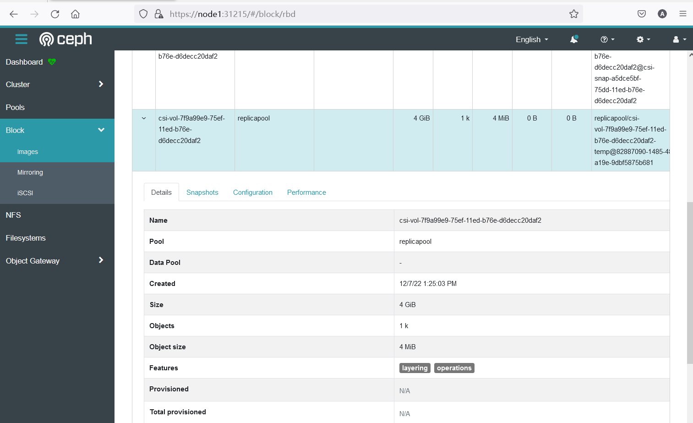


克隆验证及恢复参照快照部分


# 部署Longhorn块存储解决方案


安装longhorn

```bash
kubectl apply -f https://raw.githubusercontent.com/longhorn/longhorn/v1.2.4/deploy/longhorn.yaml
```


将longhorn设置为默认存储类

````bash
kubectl patch storageclass longhorn -p '{"metadata": {"annotations":{"storageclass.kubernetes.io/is-default-class":"true"}}}'
````


确认存储类型

```bash
kubectl get sc
```


```bash
root@node1:~# kubectl get sc
NAME                 PROVISIONER          RECLAIMPOLICY   VOLUMEBINDINGMODE   ALLOWVOLUMEEXPANSION   AGE
longhorn (default)   driver.longhorn.io   Delete          Immediate           true                   4h13m

```


检查longhorn安装情况

```bash
kubectl get pod -n longhorn-system
```


```bash
root@node1:~# kubectl get pod -n longhorn-system
NAME                                        READY   STATUS    RESTARTS       AGE
csi-attacher-6454556647-cw4jc               1/1     Running   0              4h8m
csi-attacher-6454556647-gvjk8               1/1     Running   0              4h8m
csi-attacher-6454556647-vc7ws               1/1     Running   0              4h8m
csi-provisioner-869bdc4b79-r5v8j            1/1     Running   0              4h8m
csi-provisioner-869bdc4b79-rn9zp            1/1     Running   0              4h8m
csi-provisioner-869bdc4b79-v7kc9            1/1     Running   0              4h8m
csi-resizer-6d8cf5f99f-69kdl                1/1     Running   0              4h8m
csi-resizer-6d8cf5f99f-vwn4c                1/1     Running   0              4h8m
csi-resizer-6d8cf5f99f-xlcws                1/1     Running   0              4h8m
csi-snapshotter-588457fcdf-77h4k            1/1     Running   0              4h8m
csi-snapshotter-588457fcdf-fpkjf            1/1     Running   0              4h8m
csi-snapshotter-588457fcdf-jxdrs            1/1     Running   0              4h8m
engine-image-ei-4dbdb778-58sx7              1/1     Running   0              4h9m
engine-image-ei-4dbdb778-9c6mr              1/1     Running   0              4h9m
engine-image-ei-4dbdb778-csgdl              1/1     Running   0              4h9m
instance-manager-e-46afa502                 1/1     Running   0              4h9m
instance-manager-e-d020b8c8                 1/1     Running   0              4h9m
instance-manager-e-f8a6153d                 1/1     Running   0              4h9m
instance-manager-r-263a334e                 1/1     Running   0              4h8m
instance-manager-r-85b971e6                 1/1     Running   0              4h8m
instance-manager-r-a4c3d8b4                 1/1     Running   0              4h9m
longhorn-csi-plugin-hv8qf                   2/2     Running   0              4h8m
longhorn-csi-plugin-jm7kv                   2/2     Running   0              4h8m
longhorn-csi-plugin-t9z4k                   2/2     Running   0              4h8m
longhorn-driver-deployer-7c85dc8c69-wlsf6   1/1     Running   0              4h9m
longhorn-manager-h88kx                      1/1     Running   1 (4h9m ago)   4h9m
longhorn-manager-zf945                      1/1     Running   0              4h9m
longhorn-manager-zwjpw                      1/1     Running   0              4h9m
longhorn-ui-6dcd69998-9rscr                 1/1     Running   0              4h9m
```


```bash
kubectl get svc -n longhorn-system
```


```
root@node1:~# kubectl get svc -n longhorn-system
NAME                       TYPE        CLUSTER-IP       EXTERNAL-IP   PORT(S)        AGE
csi-attacher               ClusterIP   10.105.33.144    <none>        12345/TCP      4h9m
csi-provisioner            ClusterIP   10.106.35.240    <none>        12345/TCP      4h9m
csi-resizer                ClusterIP   10.101.232.11    <none>        12345/TCP      4h9m
csi-snapshotter            ClusterIP   10.107.169.238   <none>        12345/TCP      4h9m
longhorn-backend           ClusterIP   10.100.136.167   <none>        9500/TCP       4h11m
longhorn-engine-manager    ClusterIP   None             <none>        <none>         4h11m
longhorn-frontend          NodePort    10.97.31.129     <none>        80:30210/TCP   4h11m
longhorn-replica-manager   ClusterIP   None             <none>        <none>         4h11m
```


将longhorn UI发布到nodeport 30210

```bash
kubectl patch svc -n longhorn-system longhorn-frontend  -p '{"spec":{"type": "NodePort"}}'
kubectl patch service longhorn-frontend --namespace=longhorn-system --type='json' --patch='[{"op": "replace", "path": "/spec/ports/0/nodePort", "value":30210}]'
```


# 可选:创建NFS存储类(适用于RWX场景)

## 安装NFS

在每台机器上都安装nfs组件

```bash
apt install -y nfs-kernel-server
```


选择node01作为nfs服务器, 创建共享目录

```bash
mkdir /data
```


设置共享权限

```bash
chmod 777 -R /data
```


创建实验用目录

```bash
mkdir /data/mysql
```


编辑配置文件

```bash
nano /etc/exports
```

在配置文件最后一行增加: `/data *(rw,no_root_squash)`


重启服务（如果节点重启之后，共享丢失，请重做此步）

```bash
systemctl restart nfs-server
```


设置开机自启

```bash
systemctl enable nfs-server
```


在其他节点上进行测试

```bash
showmount -e  node1
```


克隆实验脚本

```bash
git clone https://github.com/cloudzun/k8slab/

cd k8slab/

git branch -a

git checkout v1.23
```


## 实现NFS存储类

安装NFS CSI，进入csi文件夹

```bash
cd csi

kubectl apply -f ./
```


查看csi对应pod

```bash
kubectl get pod -n kube-system -o wide | grep csi
```

 

```bash
root@node1:~# kubectl get pod -n kube-system -o wide | grep csi
csi-nfs-controller-59fc979848-56q75       3/3     Running   0             49m    192.168.1.232    node2   <none>           <none>
csi-nfs-controller-59fc979848-fjq2t       3/3     Running   0             49m    192.168.1.233    node3   <none>           <none>
csi-nfs-node-4djbg                        3/3     Running   0             49m    192.168.1.231    node1   <none>           <none>
csi-nfs-node-pgmfb                        3/3     Running   0             49m    192.168.1.232    node2   <none>           <none>
csi-nfs-node-wg7pq                        3/3     Running   0             49m    192.168.1.233    node3   <none>           <none>
```

 等待csi-nfs相关pod就绪之后再进行后续步骤


创建StorageClass定义文件 （需要替换NFS服务器ip地址）

```bash
nano nfs-sc.yaml
```


```yaml
---
apiVersion: storage.k8s.io/v1
kind: StorageClass
metadata:
  name: nfs-csi
provisioner: nfs.csi.k8s.io
parameters:
  server: node1 # 指定nfs服务器地址或者名称
  share: /data
reclaimPolicy: Retain  # only retain is supported
volumeBindingMode: Immediate
mountOptions:
  - hard
  - nfsvers=4.1
```


创建SC 

```bash
kubectl apply -f nfs-sc.yaml
```


查看SC

```bash
kubectl get sc -o wide
```


```bash
root@node1:~# kubectl get sc -o wide
NAME                 PROVISIONER          RECLAIMPOLICY   VOLUMEBINDINGMODE   ALLOWVOLUMEEXPANSION   AGE
longhorn (default)   driver.longhorn.io   Delete          Immediate           true                   6h26m
nfs-csi              nfs.csi.k8s.io       Retain          Immediate           false                  51m
```

