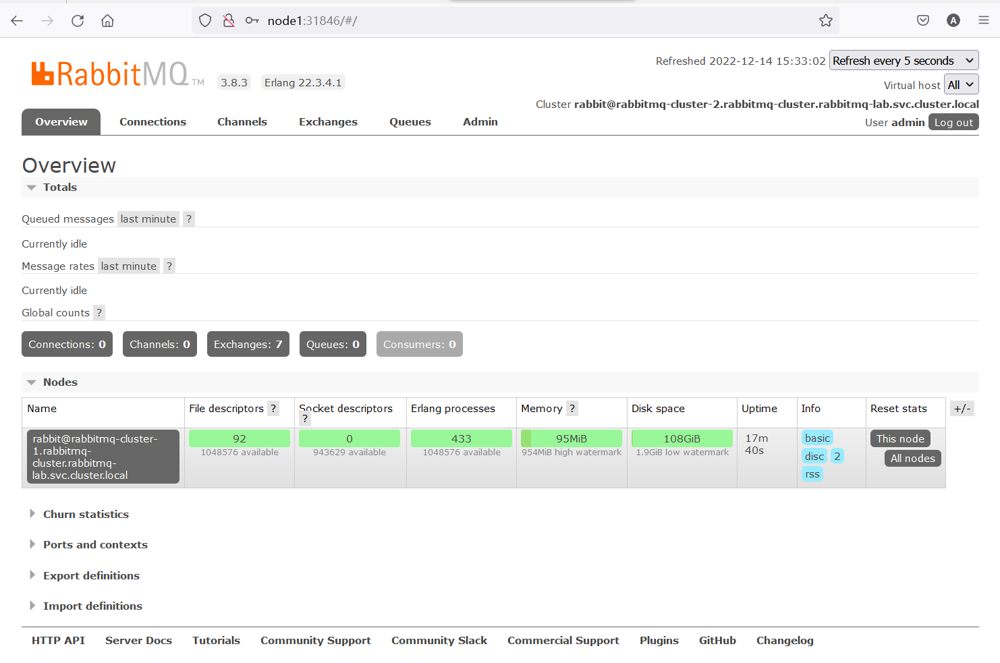
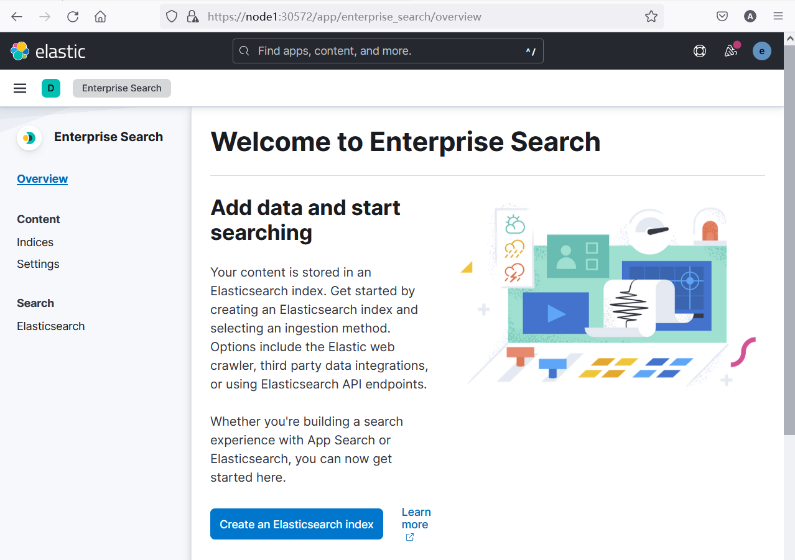
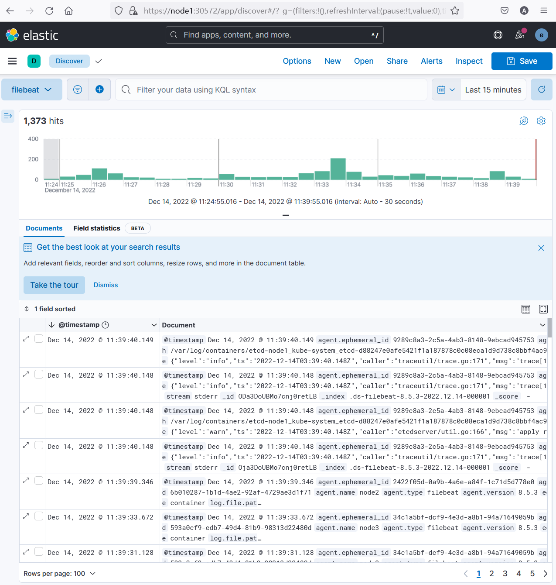

安装longhorn存储解决方案（总耗时可能需要十分钟）

```bash
kubectl apply -f https://raw.githubusercontent.com/longhorn/longhorn/v1.4.2/deploy/longhorn.yaml
```


将longhorn UI发布到nodeport 30210

```bash
kubectl patch svc -n longhorn-system longhorn-frontend  -p '{"spec":{"type": "NodePort"}}'
kubectl patch service longhorn-frontend --namespace=longhorn-system --type='json' --patch='[{"op": "replace", "path": "/spec/ports/0/nodePort", "value":30210}]'
```


确认存储类型

```bash
kubectl get sc
```


# 手动部署rabbitmq集群

## 创建configmap

创建命名空间

```bash
kubectl create ns rabbitmq-lab
```


创建configmgp配置文件

```bash
nano rabbitmq-configmap.yaml
```


```yaml
kind: ConfigMap
apiVersion: v1
metadata:
  name: rabbitmq-cluster-config
  namespace: rabbitmq-lab
  labels:
    addonmanager.kubernetes.io/mode: Reconcile
data:
    enabled_plugins: |
      [rabbitmq_management,rabbitmq_peer_discovery_k8s].
    rabbitmq.conf: |
      default_user = admin
      default_pass = 123!@#
      ## Cluster formation. See https://www.rabbitmq.com/cluster-formation.html to learn more.
      cluster_formation.peer_discovery_backend = rabbit_peer_discovery_k8s
      cluster_formation.k8s.host = kubernetes.default.svc.cluster.local
      ## Should RabbitMQ node name be computed from the pod's hostname or IP address?
      ## IP addresses are not stable, so using [stable] hostnames is recommended when possible.
      ## Set to "hostname" to use pod hostnames.
      ## When this value is changed, so should the variable used to set the RABBITMQ_NODENAME
      ## environment variable.
      cluster_formation.k8s.address_type = hostname
      ## How often should node cleanup checks run?
      cluster_formation.node_cleanup.interval = 30
      ## Set to false if automatic removal of unknown/absent nodes
      ## is desired. This can be dangerous, see
      ##  * https://www.rabbitmq.com/cluster-formation.html#node-health-checks-and-cleanup
      ##  * https://groups.google.com/forum/#!msg/rabbitmq-users/wuOfzEywHXo/k8z_HWIkBgAJ
      cluster_formation.node_cleanup.only_log_warning = true
      cluster_partition_handling = autoheal
      ## See https://www.rabbitmq.com/ha.html#master-migration-data-locality
      queue_master_locator=min-masters
      ## See https://www.rabbitmq.com/access-control.html#loopback-users
      loopback_users.guest = false
      cluster_formation.randomized_startup_delay_range.min = 0
      cluster_formation.randomized_startup_delay_range.max = 2
      # default is rabbitmq-cluster's namespace
      # hostname_suffix
      cluster_formation.k8s.hostname_suffix = .rabbitmq-cluster.default.svc.cluster.local
      # memory
      vm_memory_high_watermark.absolute = 1GB
      # disk
      disk_free_limit.absolute = 2GB
```


这是一个Kubernetes ConfigMap YAML配置文件。ConfigMap主要用于存储和管理非敏感的配置信息，这些信息可以在Pods和其他Kubernetes对象中使用。在本例中，这个ConfigMap主要用于配置RabbitMQ集群。以下是文件中主要部分的详细说明：

1. `kind`指定这是一个ConfigMap资源。

2. `metadata`部分描述了ConfigMap的元数据，如名称、命名空间以及一些标签。

   `name`: ConfigMap的名称为`rabbitmq-cluster-config`。

   `namespace`: ConfigMap所属的命名空间为`rabbitmq-lab`。

   `labels`: 这里有一个标签，`addonmanager.kubernetes.io/mode: Reconcile`。这个标签通常用于控制ConfigMap的更新等行为。

3. `data`字段是ConfigMap的主体，包含一些键值对。在这里有两个键：`enabled_plugins`和`rabbitmq.conf`。

    `enabled_plugins`: 列出了启用的RabbitMQ插件。在这里，启用了`rabbitmq_management`和`rabbitmq_peer_discovery_k8s`插件。
   
    `rabbitmq.conf`: 包含RabbitMQ的配置。这里，而不是整个内容简述，我将描述配置中涉及的关键设置：

   - `default_user`和`default_pass`：设置RabbitMQ的默认用户名和密码。

   - `cluster_formation.peer_discovery_backend`：设置为`rabbit_peer_discovery_k8s`以启用Kubernetes作为RabbitMQ节点发现的后端。

   - `cluster_formation.k8s.host`：设置Kubernetes API服务器地址。

   - `cluster_formation.k8s.address_type`：设置为`hostname`，使RabbitMQ节点名称基于其Pod的主机名。

   - `cluster_formation.node_cleanup.interval`：设置节点清理检查的时间间隔。

   - `cluster_formation.node_cleanup.only_log_warning`：如果为true，仅在日志中记录未知/缺失节点的警告。

   - `cluster_partition_handling`：设置为`autoheal`，自动修复网络分区。

   - `queue_master_locator`：设置为`min-masters`，用于优化队列主节点的分布。

   - `loopback_users.guest`：设置为false，禁止访客用户通过非本地地址连接。

   - `cluster_formation.randomized_startup_delay_range.min/max`：设置节点启动起始延迟范围。

   - `cluster_formation.k8s.hostname_suffix`：设置Kubernetes主机名后缀。

   - `vm_memory_high_watermark.absolute`：设置内存的高水位标记。

   - `disk_free_limit.absolute`：设置磁盘空闲空间限制。

在RabbitMQ群集中使用这个ConfigMap时，这些设置将影响RabbitMQ节点的行为，例如使用Kubernetes发现、节点清理设置以及内存和磁盘空间的限制。


```bash
kubectl apply -f rabbitmq-configmap.yaml
```


查看configmap信息

```
kubectl get configmap -n rabbitmq-lab
```


```bash
root@node1:~# kubectl get configmap -n rabbitmq-lab
NAME                      DATA   AGE
kube-root-ca.crt          1      35s
rabbitmq-cluster-config   2      25s
```


查看configmap详细信息

```bash
kubectl describe configmap rabbitmq-cluster-config -n rabbitmq-lab
```


```bash
root@node1:~# kubectl describe configmap rabbitmq-cluster-config -n rabbitmq-lab
Name:         rabbitmq-cluster-config
Namespace:    rabbitmq-lab
Labels:       addonmanager.kubernetes.io/mode=Reconcile
Annotations:  <none>

Data
====
enabled_plugins:
----
[rabbitmq_management,rabbitmq_peer_discovery_k8s].

rabbitmq.conf:
----
default_user = admin
default_pass = 123!@
## Cluster formation. See https://www.rabbitmq.com/cluster-formation.html to learn more.
cluster_formation.peer_discovery_backend = rabbit_peer_discovery_k8s
cluster_formation.k8s.host = kubernetes.default.svc.cluster.local
## Should RabbitMQ node name be computed from the pod's hostname or IP address?
## IP addresses are not stable, so using [stable] hostnames is recommended when possible.
## Set to "hostname" to use pod hostnames.
## When this value is changed, so should the variable used to set the RABBITMQ_NODENAME
## environment variable.
cluster_formation.k8s.address_type = hostname
## How often should node cleanup checks run?
cluster_formation.node_cleanup.interval = 30
## Set to false if automatic removal of unknown/absent nodes
## is desired. This can be dangerous, see
##  * https://www.rabbitmq.com/cluster-formation.html#node-health-checks-and-cleanup
##  * https://groups.google.com/forum/#!msg/rabbitmq-users/wuOfzEywHXo/k8z_HWIkBgAJ
cluster_formation.node_cleanup.only_log_warning = true
cluster_partition_handling = autoheal
## See https://www.rabbitmq.com/ha.html#master-migration-data-locality
queue_master_locator=min-masters
## See https://www.rabbitmq.com/access-control.html#loopback-users
loopback_users.guest = false
cluster_formation.randomized_startup_delay_range.min = 0
cluster_formation.randomized_startup_delay_range.max = 2
# default is rabbitmq-cluster's namespace
# hostname_suffix
cluster_formation.k8s.hostname_suffix = .rabbitmq-cluster.default.svc.cluster.local
# memory
vm_memory_high_watermark.absolute = 1GB
# disk
disk_free_limit.absolute = 2GB


BinaryData
====

Events:  <none>
```

注意 `default_pass` 的值


## 创建service


创建service定义文件,并创建service

```
nano rabbitmq-service.yaml
```


```yaml
kind: Service
apiVersion: v1
metadata:
  labels:
    app: rabbitmq-cluster
  name: rabbitmq-cluster
  namespace: rabbitmq-lab
spec:
  clusterIP: None
  ports:
  - name: rmqport
    port: 5672
    targetPort: 5672
  selector:
    app: rabbitmq-cluster

---
kind: Service
apiVersion: v1
metadata:
  labels:
    app: rabbitmq-cluster
  name: rabbitmq-cluster-manage
  namespace: rabbitmq-lab
spec:
  ports:
  - name: http
    port: 15672
    protocol: TCP
    targetPort: 15672
  selector:
    app: rabbitmq-cluster
  type: NodePort
```


这个配置文件定义了两个Kubernetes服务，用于支持RabbitMQ集群。服务是Kubernetes中的一种资源，其作用是将网络流量路由到一组匹配指定标签的容器。这两个服务都有相同的标签选择器（`app: rabbitmq-cluster`），将这两个服务指向相同的容器组（Pods）。

第一个服务`rabbitmq-cluster`：

- `kind`：指定资源的类型为 “Service”。
- `apiVersion`：指定Kubernetes API的版本为 "v1"。
- `metadata`：
  - `labels`：将“app：rabbitmq-cluster”标签分配给服务。
  - `name`：将服务命名为 "rabbitmq-cluster"。
  - `namespace`：指定服务位于 "rabbitmq-lab" 命名空间。
- `spec`：
  - `clusterIP`：通过将"None"分配给“clusterIP”，指定这是一个无头服务（headless service）。这意味着此服务不会是负载平衡器的一部分，且Pod的DNS记录将直接提供相应。
  - `ports`：指定一个用于RabbitMQ客户端的端口（名称为“rmqport”，端口号为5672）。
  - `selector`：确定要将流量输送到哪些Pod，匹配标签“app：rabbitmq-cluster”。

第二个服务`rabbitmq-cluster-manage`：

- `kind`：资源类型为 "Service"。
- `apiVersion`：版本为 "v1"。
- `metadata`：
  - `labels`：为服务分配“app：rabbitmq-cluster”标签。
  - `name`：将服务命名为 "rabbitmq-cluster-manage"。
  - `namespace`：指定服务位于 "rabbitmq-lab" 命名空间。
- `spec`：
  - `ports`：指定一个用于RabbitMQ管理界面（HTTP）的端口（名称为“http”，端口号为15672）。
  - `selector`：将流量指向标签“app：rabbitmq-cluster”的Pod。
  - `type`：将服务类型设置为 `NodePort`，使其在集群的每个节点上公开一个端口。这将允许您通过集群节点的IP地址和节点端口访问RabbitMQ管理界面。


```
kubectl apply -f rabbitmq-service.yaml
```


查看服务

```
kubectl get svc -n rabbitmq-lab
```


```bash
root@node1:~# kubectl get svc -n rabbitmq-lab
NAME                      TYPE        CLUSTER-IP      EXTERNAL-IP   PORT(S)           AGE
rabbitmq-cluster          ClusterIP   None            <none>        5672/TCP          17s
rabbitmq-cluster-manage   NodePort    10.96.103.234   <none>        15672:30770/TCP   17s
```

特别留意 `rabbitmq-cluster-manage` 的nodeport端口号


## 创建rbac授权

创建授权配置文件并创建授权

```yaml
nano rabbitmq-rbac.yaml
```


```yaml
apiVersion: v1
kind: ServiceAccount
metadata:
  name: rabbitmq-cluster
  namespace: rabbitmq-lab
---
kind: Role
apiVersion: rbac.authorization.k8s.io/v1
metadata:
  name: rabbitmq-cluster
  namespace: rabbitmq-lab
rules:
- apiGroups: [""]
  resources: ["endpoints"]
  verbs: ["get"]
---
kind: RoleBinding
apiVersion: rbac.authorization.k8s.io/v1
metadata:
  name: rabbitmq-cluster
  namespace: rabbitmq-lab
roleRef:
  apiGroup: rbac.authorization.k8s.io
  kind: Role
  name: rabbitmq-cluster
subjects:
- kind: ServiceAccount
  name: rabbitmq-cluster
  namespace: rabbitmq-lab
```


该配置文件定义了一个Kubernetes ServiceAccount、Role和RoleBinding，用于支持集群成员间的服务发现。

1. ServiceAccount：
```yaml
apiVersion: v1
kind: ServiceAccount
metadata:
  name: rabbitmq-cluster
  namespace: rabbitmq-lab
```
这个部分创建一个名为`rabbitmq-cluster`的ServiceAccount。这个ServiceAccount位于`rabbitmq-lab`命名空间中。

2. Role：
```yaml
kind: Role
apiVersion: rbac.authorization.k8s.io/v1
metadata:
  name: rabbitmq-cluster
  namespace: rabbitmq-lab
rules:
- apiGroups: [""]
  resources: ["endpoints"]
  verbs: ["get"]
```
这个部分创建了一个名为`rabbitmq-cluster`的Role，它允许获取"endpoints"资源。这意味着，此角色允许用户或服务帐户在`rabbitmq-lab`命名空间中查询Endpoints资源。Endpoints资源通常用于表示服务下运行的各个Pod的IP地址，对于服务发现很有用。

3. RoleBinding：
```yaml
kind: RoleBinding
apiVersion: rbac.authorization.k8s.io/v1
metadata:
  name: rabbitmq-cluster
  namespace: rabbitmq-lab
roleRef:
  apiGroup: rbac.authorization.k8s.io
  kind: Role
  name: rabbitmq-cluster
subjects:
- kind: ServiceAccount
  name: rabbitmq-cluster
  namespace: rabbitmq-lab
```
这个部分创建了一个名为`rabbitmq-cluster`的RoleBinding，它把前面创建的Role和ServiceAccount关联起来。这意味着，rabbitmq-cluster ServiceAccount现在有了查询rabbitmq-lab命名空间内Endpoints资源的权限。

总结：这个配置文件为rabbitmq-lab命名空间中的rabbitmq-cluster ServiceAccount创建了一个权限设置，让其可以访问同一命名空间内的Endpoints资源，从而支持集群成员间的服务发现。


```
kubectl apply -f rabbitmq-rbac.yaml
```


## 创建statefulset

创建sts配置文件,并创建sts

```bash
nano rabbitmq-cluster-sts.yaml
```


```yaml
kind: StatefulSet
apiVersion: apps/v1
metadata:
  labels:
    app: rabbitmq-cluster
  name: rabbitmq-cluster
  namespace: rabbitmq-lab
spec:
  replicas: 3
  selector:
    matchLabels:
      app: rabbitmq-cluster
  serviceName: rabbitmq-cluster
  template:
    metadata:
      labels:
        app: rabbitmq-cluster
    spec:
      containers:
      - args:
        - -c
        - cp -v /etc/rabbitmq/rabbitmq.conf ${RABBITMQ_CONFIG_FILE}; exec docker-entrypoint.sh
          rabbitmq-server
        command:
        - sh
        env:
        - name: TZ
          value: 'Asia/Shanghai'
        - name: RABBITMQ_ERLANG_COOKIE
          value: 'SWvCP0Hrqv43NG7GybHC95ntCJKoW8UyNFWnBEWG8TY='
        - name: K8S_SERVICE_NAME
          value: rabbitmq-cluster
        - name: POD_IP
          valueFrom:
            fieldRef:
              fieldPath: status.podIP
        - name: POD_NAME
          valueFrom:
            fieldRef:
              fieldPath: metadata.name
        - name: POD_NAMESPACE
          valueFrom:
            fieldRef:
              fieldPath: metadata.namespace
        - name: RABBITMQ_USE_LONGNAME
          value: "true"
        - name: RABBITMQ_NODENAME
          value: rabbit@$(POD_NAME).$(K8S_SERVICE_NAME).$(POD_NAMESPACE).svc.cluster.local
        - name: RABBITMQ_CONFIG_FILE
          value: /var/lib/rabbitmq/rabbitmq.conf
        image: rabbitmq:3.8.3-management
        imagePullPolicy: IfNotPresent
        livenessProbe:
          exec:
            command:
            - rabbitmq-diagnostics
            - status
          # See https://www.rabbitmq.com/monitoring.html for monitoring frequency recommendations.
          initialDelaySeconds: 60
          periodSeconds: 60
          timeoutSeconds: 15
        name: rabbitmq
        ports:
        - containerPort: 15672
          name: http
          protocol: TCP
        - containerPort: 5672
          name: amqp
          protocol: TCP
        readinessProbe:
          exec:
            command:
            - rabbitmq-diagnostics
            - status
          initialDelaySeconds: 20
          periodSeconds: 60
          timeoutSeconds: 10
        volumeMounts:
        - mountPath: /etc/rabbitmq
          name: config-volume
          readOnly: false
        - mountPath: /var/lib/rabbitmq
          name: rabbitmq-storage
          readOnly: false
        - name: timezone
          mountPath: /etc/localtime
          readOnly: true
      serviceAccountName: rabbitmq-cluster
      terminationGracePeriodSeconds: 30
      volumes:
      - name: config-volume
        configMap:
          items:
          - key: rabbitmq.conf
            path: rabbitmq.conf
          - key: enabled_plugins
            path: enabled_plugins
          name: rabbitmq-cluster-config
      - name: timezone
        hostPath:
          path: /usr/share/zoneinfo/Asia/Shanghai
  volumeClaimTemplates:
  - metadata:
      name: rabbitmq-storage
    spec:
      accessModes:
      - ReadWriteMany
      storageClassName: "longhorn" 
      resources:
        requests:
          storage: 2Gi
```


这是一个 Kubernetes StatefulSet 资源定义，它用于创建一个具有 3 个副本的 RabbitMQ 集群。StatefulSet 保证了 Pod 的顺序性，有状态的应用程序可以利用这一特性实现稳健的集群。让我们逐步分析这个定义：

1. 元数据部分定义了 StatefulSet 属于 `rabbitmq-lab` 命名空间，并设置了名称为 `rabbitmq-cluster`。
2. spec.replicas 定义了 StatefulSet 的副本数量为 3，这意味着将创建 3 个 RabbitMQ 实例。
3. spec.selector 确定了如何选择 StatefulSet 创建的 Pod，这里使用了选择标签 `app=rabbitmq-cluster`。
4. spec.serviceName 指定了 StatefulSet 用于为其 Pod 命名的 Headless 服务（这里使用的是 `rabbitmq-cluster`）。
5. 在 spec.template.spec.containers 的部分提供了容器（RabbitMQ）的详细配置：
    - 设置了容器的启动参数、运行环境和环境变量。
    - 环境变量中设置用于节点间通信的 Erlang Cookie。
    - RabbitMQ 节点名称通过环境变量动态生成，以确保使用正确的命名格式。
    - 定义了两个端口开放：15672（RabbitMQ 管理界面）和 5672（AMQP 协议）。
    - 配置了就绪探针和存活探针以确保 Pod 在正确运行并准备好处理请求时才加入服务。
6. 容器卷挂载了几个存储卷：
    - 一个用于存储 RabbitMQ 配置文件和插件信息的 ConfigMap 卷。
    - 一个用于 RabbitMQ 数据存储的持久卷。
    - 一个用于设置容器时区的卷。
7. 指定了用于这个 StatefulSet 的 ServiceAccount（`rabbitmq-cluster`）。
8. 资源部分 ConfigMap、ServiceAccount 角色绑定等都在此前的对话中创建。
9. volumeClaimTemplates 根据模板创建一个名为 `rabbitmq-storage` 的持久卷声明，该声明请求一个可读写的、2Gi 大小的存储，并使用名为 `longhorn` 的持久卷存储类。

创建此 StatefulSet 将自动为 RabbitMQ 集群实例生成 3 个状态副本。这些副本将根据提供的配置进行设置，并通过 ServiceAccount 进行服务发现。RabbitMQ 集群作为有状态应用的长期存储，将确保数据在集群中正确副本化和同步。使用持久卷存储将保护应用程序免受数据丢失。


```bash
kubectl apply -f rabbitmq-cluster-sts.yaml
```


## 部署检查


查看创建的资源

```
 kubectl get po,sts -l app=rabbitmq-cluster -n rabbitmq-lab
```


```bash
root@node1:~#  kubectl get po,sts -l app=rabbitmq-cluster -n rabbitmq-lab
NAME                     READY   STATUS    RESTARTS   AGE
pod/rabbitmq-cluster-0   1/1     Running   0          4m16s
pod/rabbitmq-cluster-1   1/1     Running   0          2m15s
pod/rabbitmq-cluster-2   1/1     Running   0          72s

NAME                                READY   AGE
statefulset.apps/rabbitmq-cluster   3/3     4m16s
```


查看日志, 从日志的最后部分观察集群建立的状态

```
kubectl logs -f rabbitmq-cluster-0 -n rabbitmq-lab
```


```bash
2022-12-14 07:14:23.689 [info] <0.812.0> Starting worker pool 'management_worker_pool' with 3 processes in it
2022-12-14 07:14:23.896 [info] <0.9.0> Server startup complete; 5 plugins started.
 * rabbitmq_management
 * rabbitmq_management_agent
 * rabbitmq_peer_discovery_k8s
 * rabbitmq_peer_discovery_common
 * rabbitmq_web_dispatch
 completed with 5 plugins.
```


进入到`pod`中通过客户端查看集群状态

```bash
kubectl exec -it rabbitmq-cluster-0 bash -n rabbitmq-lab
```


```bash
rabbitmqctl cluster_status
```


```bash
root@node1:~# kubectl exec -it rabbitmq-cluster-0 bash -n rabbitmq-lab
kubectl exec [POD] [COMMAND] is DEPRECATED and will be removed in a future version. Use kubectl exec [POD] -- [COMMAND] instead.
root@rabbitmq-cluster-0:/# rabbitmqctl cluster_status
Cluster status of node rabbit@rabbitmq-cluster-0.rabbitmq-cluster.rabbitmq-lab.svc.cluster.local ...
Basics

Cluster name: rabbit@rabbitmq-cluster-0.rabbitmq-cluster.rabbitmq-lab.svc.cluster.local

Disk Nodes

rabbit@rabbitmq-cluster-0.rabbitmq-cluster.rabbitmq-lab.svc.cluster.local

Running Nodes

rabbit@rabbitmq-cluster-0.rabbitmq-cluster.rabbitmq-lab.svc.cluster.local

Versions

rabbit@rabbitmq-cluster-0.rabbitmq-cluster.rabbitmq-lab.svc.cluster.local: RabbitMQ 3.8.3 on Erlang 22.3.4.1

Alarms

Free disk space alarm on node rabbit@rabbitmq-cluster-0.rabbitmq-cluster.rabbitmq-lab.svc.cluster.local

Network Partitions

(none)

Listeners

Node: rabbit@rabbitmq-cluster-0.rabbitmq-cluster.rabbitmq-lab.svc.cluster.local, interface: [::], port: 25672, protocol: clustering, purpose: inter-node and CLI tool communication
Node: rabbit@rabbitmq-cluster-0.rabbitmq-cluster.rabbitmq-lab.svc.cluster.local, interface: [::], port: 5672, protocol: amqp, purpose: AMQP 0-9-1 and AMQP 1.0
Node: rabbit@rabbitmq-cluster-0.rabbitmq-cluster.rabbitmq-lab.svc.cluster.local, interface: [::], port: 15672, protocol: http, purpose: HTTP API

Feature flags

Flag: drop_unroutable_metric, state: enabled
Flag: empty_basic_get_metric, state: enabled
Flag: implicit_default_bindings, state: enabled
Flag: quorum_queue, state: enabled
Flag: virtual_host_metadata, state: enabled
```


使用NodePort访问管理界面

```bash
kubectl get svc -l app=rabbitmq-cluster -n rabbitmq-lab
```


```bash
root@node1:~# kubectl get svc -l app=rabbitmq-cluster -n rabbitmq-lab
NAME                      TYPE        CLUSTER-IP       EXTERNAL-IP   PORT(S)           AGE
rabbitmq-cluster          ClusterIP   None             <none>        5672/TCP          9m40s
rabbitmq-cluster-manage   NodePort    10.106.199.214   <none>        15672:31846/TCP   9m40s
```


地址: `http://node1:31846` 用户名 `admin` 密码 `123!@`




查看工作负载

```bash
kubectl get all -n rabbitmq-lab

kubectl get pvc -n rabbitmq-lab
```


```bash
root@node1:~/k8skb/05-k8s-appdeloy# kubectl get all -n rabbitmq-lab
NAME                     READY   STATUS    RESTARTS   AGE
pod/rabbitmq-cluster-0   1/1     Running   0          23m
pod/rabbitmq-cluster-1   1/1     Running   0          22m
pod/rabbitmq-cluster-2   1/1     Running   0          21m

NAME                              TYPE        CLUSTER-IP      EXTERNAL-IP   PORT(S)           AGE
service/rabbitmq-cluster          ClusterIP   None            <none>        5672/TCP          33m
service/rabbitmq-cluster-manage   NodePort    10.100.42.167   <none>        15672:30077/TCP   33m

NAME                                READY   AGE
statefulset.apps/rabbitmq-cluster   3/3     23m
root@node1:~/k8skb/05-k8s-appdeloy# kubectl get pvc -n rabbitmq-lab
NAME                                  STATUS   VOLUME                                     CAPACITY   ACCESS MODES   STORAGECLASS   AGE
rabbitmq-storage-rabbitmq-cluster-0   Bound    pvc-1583817f-9434-44e8-a8ea-0516d5618619   2Gi        RWX            longhorn       24m
rabbitmq-storage-rabbitmq-cluster-1   Bound    pvc-ccde7b5b-7775-4517-a30e-afaa1617ce12   2Gi        RWX            longhorn       23m
rabbitmq-storage-rabbitmq-cluster-2   Bound    pvc-30750905-101b-4d4a-b1b7-19e345166588   2Gi        RWX            longhorn       22m
```


# 使用Operator部署Elastic技术堆栈

## 在群集上部署ECK(Elastic Cloud on Kubernetes)

安装CRD 

```bash
kubectl create -f https://download.elastic.co/downloads/eck/2.5.0/crds.yaml
```


检查CRD

```bash
 kubectl get crd | grep elastic
```


```bash
root@node1:~# kubectl get crd | grep elastic
agents.agent.k8s.elastic.co                           2022-12-14T02:12:33Z
apmservers.apm.k8s.elastic.co                         2022-12-14T02:12:33Z
beats.beat.k8s.elastic.co                             2022-12-14T02:12:33Z
elasticmapsservers.maps.k8s.elastic.co                2022-12-14T02:12:33Z
elasticsearchautoscalers.autoscaling.k8s.elastic.co   2022-12-14T02:12:33Z
elasticsearches.elasticsearch.k8s.elastic.co          2022-12-14T02:12:33Z
enterprisesearches.enterprisesearch.k8s.elastic.co    2022-12-14T02:12:33Z
kibanas.kibana.k8s.elastic.co                         2022-12-14T02:12:33Z
```


安装Operator

```bash
kubectl apply -f https://download.elastic.co/downloads/eck/2.5.0/operator.yaml
```


查看operator对应的pod

```bash
kubectl get pod -n elastic-system
```


```bash
root@node1:~# kubectl get pod -n elastic-system
NAME                 READY   STATUS              RESTARTS   AGE
elastic-operator-0   0/1     ContainerCreating   0          23s
```


查看operator的日志

```bash
kubectl logs elastic-operator-0 -n elastic-system
```


```bash
...
{"log.level":"info","@timestamp":"2022-12-14T02:25:10.198Z","log.logger":"resource-reporter","message":"Creating resource","service.version":"2.5.0+642f9ecd","service.type":"eck","ecs.version":"1.4.0","kind":"ConfigMap","namespace":"elastic-system","name":"elastic-licensing"}
{"log.level":"info","@timestamp":"2022-12-14T02:25:10.917Z","log.logger":"manager","message":"Orphan secrets garbage collection complete","service.version":"2.5.0+642f9ecd","service.type":"eck","ecs.version":"1.4.0"}
...
```


## 部署单节点Elasticsearch Cluster


创建单节点群集的配置文件,并创建群集

```bash
nano es.yaml
```


```yaml
apiVersion: elasticsearch.k8s.elastic.co/v1
kind: Elasticsearch
metadata:
  name: quickstart
  namespace: elastic-system
spec:
  version: 8.5.3
  nodeSets:
  - name: default
    count: 1
    config:
      node.store.allow_mmap: false
```


这是一个 Kubernetes 的 Elasticsearch 资源定义，目标是在 Kubernetes 集群上部署一个简单的、单节点的 Elasticsearch 集群。

1. `apiVersion`: "elasticsearch.k8s.elastic.co/v1" 说明这是一个基于 Elastic Cloud on Kubernetes (ECK) Operator 的自定义资源（CR）定义。ECK Operator 是一个在 Kubernetes 上管理 Elasticsearch 和 Kibana 的官方扩展。

2. `kind`: "Elasticsearch" 表示创建的资源类型是 Elasticsearch 集群。

3. `metadata`: 包含集群的名称和命名空间:
   - `name`: "quickstart" 用于标识该 Elasticsearch 资源的名称。
   - `namespace`: "elastic-system" 指明了这个资源位于 `elastic-system` 命名空间下。

4. `spec`: 包含此 Elasticsearch 集群的配置和规格:
   - `version`: "8.5.3" 设定集群使用的 Elasticsearch 版本为 8.5.3。
   - `nodeSets`: 定义集群里各个 Elasticsearch 节点的配置和拓扑。

5. `nodeSets` 中的子项包含：
   - `name`: "default" 为这个节点设置命名，以便在你扩展集群时进行识别。
   - `count`: 1 表示只会创建一个 Elasticsearch 数据节点。
   - `config`: 包括节点配置项。
      - `node.store.allow_mmap`: false 禁用混合内存映射 (mmap) 功能。这是一个高级配置，通常在生产环境中会启用以提高性能。但在某些资源有限或测试环境中可能会禁用。

总结：这个 Elasticsearch 资源定义配置了一个简单的单节点 Elasticsearch 集群，通过 ECK Operator 在 Kubernetes 集群上部署。集群位于 `elastic-system` 命名空间下，并使用 默认的节点配置。


```bash
kubectl apply -f es.yaml
```


检查群集状态

```bash
kubectl get elasticsearch -n elastic-system
```


```bash
root@node1:~# kubectl get elasticsearch -n elastic-system
NAME         HEALTH   NODES   VERSION   PHASE   AGE
quickstart   green    1       8.5.3     Ready   4m18s
```


检查elasticsearch pod

```bash
kubectl get pod -n elastic-system
```


```bash
root@node1:~# kubectl get pod -n elastic-system
NAME                      READY   STATUS    RESTARTS   AGE
elastic-operator-0        1/1     Running   0          3h16m
quickstart-es-default-0   1/1     Running   0          85s
```


```bash
kubectl logs quickstart-es-default-0 -n elastic-system
```


```bash
...
{"@timestamp":"2022-12-14T02:42:37.033Z", "log.level": "INFO", "message":"successfully loaded geoip database file [GeoLite2-Country.mmdb]", "ecs.version": "1.2.0","service.name":"ES_ECS","event.dataset":"elasticsearch.server","process.thread.name":"elasticsearch[quickstart-es-default-0][generic][T#1]","log.logger":"org.elasticsearch.ingest.geoip.DatabaseNodeService","elasticsearch.cluster.uuid":"tc7KeLqkSSqUdR2dSkHWCg","elasticsearch.node.id":"e5HhtOPXRIGdmd9XuBrVfQ","elasticsearch.node.name":"quickstart-es-default-0","elasticsearch.cluster.name":"quickstart"}
```


检查elasticsearch服务

```bash
kubectl get svc -n elastic-system
```


```bash
root@node1:~# kubectl get svc -n elastic-system
NAME                          TYPE        CLUSTER-IP      EXTERNAL-IP   PORT(S)    AGE
elastic-webhook-server        ClusterIP   10.101.144.82   <none>        443/TCP    3h16m
quickstart-es-default         ClusterIP   None            <none>        9200/TCP   110s
quickstart-es-http            ClusterIP   10.105.229.85   <none>        9200/TCP   113s
quickstart-es-internal-http   ClusterIP   10.98.133.235   <none>        9200/TCP   113s
quickstart-es-transport       ClusterIP   None            <none>        9300/TCP   113s
```

特别关注`quickstart-es-http` 的IP地址


获取elasticsearch的凭据并尝试访问elasticsearch服务

```bash
PASSWORD=$(kubectl get secret -n elastic-system quickstart-es-elastic-user -o go-template='{{.data.elastic | base64decode}}')
```


```bash
curl -u "elastic:$PASSWORD" -k "https://10.105.229.85:9200"
```


```bash
root@node1:~# curl -u "elastic:$PASSWORD" -k "https://10.105.229.85:9200"
{
  "name" : "quickstart-es-default-0",
  "cluster_name" : "quickstart",
  "cluster_uuid" : "tc7KeLqkSSqUdR2dSkHWCg",
  "version" : {
    "number" : "8.5.3",
    "build_flavor" : "default",
    "build_type" : "docker",
    "build_hash" : "4ed5ee9afac63de92ec98f404ccbed7d3ba9584e",
    "build_date" : "2022-12-05T18:22:22.226119656Z",
    "build_snapshot" : false,
    "lucene_version" : "9.4.2",
    "minimum_wire_compatibility_version" : "7.17.0",
    "minimum_index_compatibility_version" : "7.0.0"
  },
  "tagline" : "You Know, for Search"
}
```


## 部署Kibana实例


创建Kibana配置文件,并创建实例

```bash
nano kibana.yaml
```


```yaml
apiVersion: kibana.k8s.elastic.co/v1
kind: Kibana
metadata:
  name: quickstart
  namespace: elastic-system
spec:
  version: 8.5.3
  count: 1
  elasticsearchRef:
    name: quickstart
```


这是一个 Kubernetes Kibana 资源定义，用于部署一个与 Elasticsearch 集群关联的 Kibana 实例。同样使用 Elastic Cloud on Kubernetes (ECK) Operator，它在 "elastic-system" 命名空间中创建一个名为 "quickstart" 的 Kibana 实例。以下是各部分的详细解释：

- `apiVersion: kibana.k8s.elastic.co/v1`: 定义了这个资源使用的 API 版本，显示这是一个 ECK Operator 中的 Kibana 资源。

- `kind: Kibana`: 声明了这个资源的类型是 Kibana。

- `metadata`: 包含了关于这个 Kibana 资源的元数据，如名称和命名空间。

  - `name: quickstart`: 这个 Kibana 资源的名称是 "quickstart"。

  - `namespace: elastic-system`: 这个 Kibana 资源将部署在 "elastic-system" 命名空间。

- `spec`：定义了 Kibana 实例的详细配置：

  - `version: 8.5.3`: Kibana 的版本是 8.5.3。

  - `count: 1`: 将部署 1 个 Kibana 实例（即副本数为 1）。

  - `elasticsearchRef`: 引用了将与 Kibana 关联的 Elasticsearch 集群。

    - `name: quickstart`: 这个关联的 Elasticsearch 集群的名称是 "quickstart"。这里的名称与前面的 Elasticsearch 集群定义中的名称相同，表示将这个 Kibana 实例关联至那个 Elasticsearch 集群。


```bash
kubectl apply -f kibana.yaml
```


检查kibana实例状态

```bash
kubectl get kibana -n elastic-system
```


```bash
root@node1:~# kubectl get kibana -n elastic-system
NAME         HEALTH   NODES   VERSION   AGE
quickstart   green    1       8.5.3     3m56s
```


检查kibana pod

```bash
kubectl get pod -n elastic-system
```


```bash
root@node1:~# kubectl get pod -n elastic-system
NAME                             READY   STATUS    RESTARTS   AGE
elastic-operator-0               1/1     Running   0          3h18m
quickstart-es-default-0          1/1     Running   0          3m25s
quickstart-kb-587bc7bc8b-ftqnf   1/1     Running   0          51s
```


查看服务信息,并尝试访问

```bash
kubectl get svc -n elastic-system
```


```bash
root@node1:~# kubectl get svc -n elastic-system
NAME                          TYPE        CLUSTER-IP       EXTERNAL-IP   PORT(S)    AGE
elastic-webhook-server        ClusterIP   10.101.144.82    <none>        443/TCP    3h18m
quickstart-es-default         ClusterIP   None             <none>        9200/TCP   3m47s
quickstart-es-http            ClusterIP   10.105.229.85    <none>        9200/TCP   3m50s
quickstart-es-internal-http   ClusterIP   10.98.133.235    <none>        9200/TCP   3m50s
quickstart-es-transport       ClusterIP   None             <none>        9300/TCP   3m50s
quickstart-kb-http            ClusterIP   10.109.170.244   <none>        5601/TCP   74s
```


将quickstart-kb-http 服务改为NodePort模式

```bash
kubectl patch svc -n elastic-system quickstart-kb-http  -p '{"spec":{"type": "NodePort"}}'
```


```
kubectl get svc -n elastic-system
```


```bash
root@node1:~# kubectl get svc -n elastic-system
NAME                          TYPE        CLUSTER-IP       EXTERNAL-IP   PORT(S)          AGE
elastic-webhook-server        ClusterIP   10.101.144.82    <none>        443/TCP          3h19m
quickstart-es-default         ClusterIP   None             <none>        9200/TCP         4m16s
quickstart-es-http            ClusterIP   10.105.229.85    <none>        9200/TCP         4m19s
quickstart-es-internal-http   ClusterIP   10.98.133.235    <none>        9200/TCP         4m19s
quickstart-es-transport       ClusterIP   None             <none>        9300/TCP         4m19s
quickstart-kb-http            NodePort    10.109.170.244   <none>        5601:30572/TCP   103s
```


查看kibana凭据

```bash
kubectl get secret -n elastic-system quickstart-es-elastic-user -o=jsonpath='{.data.elastic}' | base64 --decode; echo
```


```bash
root@node1:~# kubectl get secret -n elastic-system quickstart-es-elastic-user -o=jsonpath='{.data.elastic}' | base64 --decode; echo
sP62op8Yhk7orpFK389R32t2
```


使用 `elastic`作为用户名,并使用上述输出中的密码登录到https://node1:30572




## 部署Filebeats


创建filebeats配置文件,并安装filebeats

```
nano filebeats.yaml
```


```yaml
apiVersion: beat.k8s.elastic.co/v1beta1
kind: Beat
metadata:
  name: quickstart
  namespace: elastic-system
spec:
  type: filebeat
  version: 8.5.3
  elasticsearchRef:
    name: quickstart
  config:
    filebeat.inputs:
    - type: container
      paths:
      - /var/log/containers/*.log
  daemonSet:
    podTemplate:
      spec:
        dnsPolicy: ClusterFirstWithHostNet
        hostNetwork: true
        securityContext:
          runAsUser: 0
        containers:
        - name: filebeat
          volumeMounts:
          - name: varlogcontainers
            mountPath: /var/log/containers
          - name: varlogpods
            mountPath: /var/log/pods
          - name: varlibdockercontainers
            mountPath: /var/lib/docker/containers
        volumes:
        - name: varlogcontainers
          hostPath:
            path: /var/log/containers
        - name: varlogpods
          hostPath:
            path: /var/log/pods
        - name: varlibdockercontainers
          hostPath:
            path: /var/lib/docker/containers
```


这是一个 Kubernetes Beat 资源定义，用于部署 Filebeat，它是一个轻量级日志文件收集器。在这个配置中，Filebeat 将收集容器日志并将其发送到指定的 Elasticsearch 集群。同样使用 Elastic Cloud on Kubernetes (ECK) Operator，在 "elastic-system" 命名空间中创建一个名为 "quickstart" 的 Beat 实例。以下是各部分的详细解释：

- `apiVersion: beat.k8s.elastic.co/v1beta1`: 定义了资源使用的 Beat API 版本。

- `kind: Beat`: 声明了资源类型为 Beat。

- `metadata`: 包含了关于这个 Beat 资源的元数据，如名称和命名空间。

  - `name: quickstart`: 这个 Beat 实例的名称是 "quickstart"。
  
  - `namespace: elastic-system`: 这个 Beat 实例将部署在 "elastic-system" 命名空间。

- `spec`: 定义了 Beat 实例的详细配置：

  - `type: filebeat`: 指定了这是一个 Filebeat 类型的 Beat。

  - `version: 8.5.3`: Filebeat 的版本是 8.5.3。

  - `elasticsearchRef`: 引用了将 Filebeat 的日志输出发送到的 Elasticsearch 集群。

    - `name: quickstart`: 这个关联的 Elasticsearch 集群的名称是 "quickstart"。

  - `config`: 包含 Filebeat 的配置信息。

    - `filebeat.inputs`: 定义输入源的配置。

      - `type: container`: 定义输入源类型为容器。

      - `paths`: 列出 Filebeat 应收集的容器日志文件的路径：`/var/log/containers/*.log`。

  - `daemonSet`: 配置使用守护集 (DaemonSet) 部署模式，确保在每个集群节点上都有一个 Filebeat 副本运行。

    - `podTemplate`: 描述了由守护集创建的 Pod 的模板。

      - `spec`: 定义了 Pod 的规格。

        - `dnsPolicy: ClusterFirstWithHostNet`: 设置了 DNS 策略为 "ClusterFirstWithHostNet"。

        - `hostNetwork: true`: 使用主机网络，使容器使用整个主机网络命名空间。

        - `securityContext`: 定义了 Pod 的安全上下文。

          - `runAsUser: 0`: 让容器以 root 用户身份启动（用户 ID 为 0）。

        - `containers`: 描述了 Pod 中的容器。

          - `name: filebeat`: 容器名称为 "filebeat"。

          - `volumeMounts`: 描述挂载到容器中的卷。

            - `varlogcontainers`, `varlogpods`, `varlibdockercontainers` 分别用于存储容器日志、Pods 日志以及 Docker 容器相关信息。

        - `volumes`: 定义了 Pod 使用的卷。

          - `varlogcontainers`, `varlogpods`, `varlibdockercontainers` 分别用于存储容器日志、Pods 日志以及 Docker 容器相关信息。

            - `hostPath`: 通过主机路径挂载卷，将节点文件系统中的目录直接挂载到 Pod 中。


```
kubectl apply -f filebeats.yaml
```


查看filebeats状态

```bash
kubectl get beat -n elastic-system
```


```bash
root@node1:~# kubectl get beat -n elastic-system
NAME         HEALTH   AVAILABLE   EXPECTED   TYPE       VERSION   AGE
quickstart   green    3           3          filebeat   8.5.3     54s
```


查看filebeats pod

```bash
kubectl get pod -n elastic-system
```


```bash
root@node1:~# kubectl get pod -n elastic-system
NAME                             READY   STATUS    RESTARTS   AGE
elastic-operator-0               1/1     Running   0          3h20m
quickstart-beat-filebeat-4hdz8   1/1     Running   0          11s
quickstart-beat-filebeat-d6frn   1/1     Running   0          11s
quickstart-beat-filebeat-jx2xg   1/1     Running   0          11s
quickstart-es-default-0          1/1     Running   0          5m14s
quickstart-kb-587bc7bc8b-ftqnf   1/1     Running   0          2m40s
```


查看某个filebeat中的日志

```bash
kubectl logs -f quickstart-beat-filebeat-jx2xg -n elastic-system
```


```bash
{"log.level":"info","@timestamp":"2022-12-14T03:51:20.932Z","log.logger":"monitoring","log.origin":{"file.name":"log/log.go","file.line":186},"message":"Non-zero metrics in the last 30s","service.name":"filebeat","monitoring":{"metrics":{"beat":{"cgroup":{"cpu":{"stats":{"periods":80,"throttled":{"ns":48720805,"periods":1}}},"cpuacct":{"total":{"ns":87522368}},"memory":{"mem":{"usage":{"bytes":61321216}}}},"cpu":{"system":{"ticks":1310,"time":{"ms":40}},"total":{"ticks":6100,"time":{"ms":90},"value":6100},"user":{"ticks":4790,"time":{"ms":50}}},"handles":{"limit":{"hard":1048576,"soft":1048576},"open":23},"info":{"ephemeral_id":"9289c8a3-2c5a-4ab3-8148-9ebcad945753","uptime":{"ms":1051400},"version":"8.5.3"},"memstats":{"gc_next":36668872,"memory_alloc":23157576,"memory_total":521132976,"rss":128847872},"runtime":{"goroutines":92}},"filebeat":{"events":{"added":8,"done":8},"harvester":{"closed":1,"open_files":13,"running":13}},"libbeat":{"config":{"module":{"running":0}},"output":{"events":{"acked":8,"active":0,"batches":4,"total":7},"read":{"bytes":2449},"write":{"bytes":9605}},"pipeline":{"clients":1,"events":{"active":0,"filtered":1,"published":7,"total":8},"queue":{"acked":8}}},"registrar":{"states":{"current":32,"update":9},"writes":{"success":5,"total":5}},"system":{"load":{"1":5.61,"15":1.5,"5":2.26,"norm":{"1":1.4025,"15":0.375,"5":0.565}}}},"ecs.version":"1.6.0"}}
```


回到kibana页面,查看filebeat汇集过来的数据


创建数据视图


查看日志




## 扩展Elasticsearch Cluster


创建扩展群集配置文件,并扩展群集

```bash
nano esv2.yaml
```


```yaml
apiVersion: elasticsearch.k8s.elastic.co/v1
kind: Elasticsearch
metadata:
  name: quickstart
  namespace: elastic-system
spec:
  version: 8.5.3
  nodeSets:
  - name: default
    count: 3
    config:
      node.store.allow_mmap: false
```


```bash
kubectl apply -f esv2.yaml
```


检查群集状态

```bash
kubectl get elasticsearch -n elastic-system
```


```bash
root@node1:~# kubectl get elasticsearch -n elastic-system
NAME         HEALTH   NODES   VERSION   PHASE             AGE
quickstart   yellow   1       8.5.3     ApplyingChanges   67m
```


检查pod信息

```bash
kubectl get pod -n elastic-system -o wide | grep quickstart-es-default
```


```bash
root@node1:~# kubectl get pod -n elastic-system -o wide | grep quickstart-es-default
quickstart-es-default-0          1/1     Running    0          69m     10.244.135.14   node3   <none>           <none>
quickstart-es-default-1          0/1     Init:0/2   0          2m12s   <none>          node2   <none>           <none>
```


```bash
root@node1:~# kubectl get elasticsearch -n elastic-system
NAME         HEALTH   NODES   VERSION   PHASE   AGE
quickstart   green    3       8.5.3     Ready   74m
```


```bash
root@node1:~# kubectl get pod -n elastic-system -o wide | grep quickstart-es-default
quickstart-es-default-0          1/1     Running   0          7m45s   10.244.135.17    node3   <none>           <none>
quickstart-es-default-1          1/1     Running   0          106s    10.244.104.21    node2   <none>           <none>
quickstart-es-default-2          0/1     Running   0          39s     10.244.166.146   node1   <none>           <none>
```


查看群集的PVC

```bash
kubectl get pvc -n elastic-system
```


```bash
root@node1:~# kubectl get pvc -n elastic-system
NAME                                         STATUS   VOLUME                                     CAPACITY   ACCESS MODES   STORAGECLASS   AGE
elasticsearch-data-quickstart-es-default-0   Bound    pvc-1ac82eaa-f155-4f28-bd13-fce3cdf6b1a3   1Gi        RWO            longhorn       8m35s
elasticsearch-data-quickstart-es-default-1   Bound    pvc-f7f3bc7a-d04c-462d-8f44-87379e48ed3d   1Gi        RWO            longhorn       2m36s
elasticsearch-data-quickstart-es-default-2   Bound    pvc-b869838d-c9fa-47f1-be00-a48b4a00fc2f   1Gi        RWO            longhorn       89s
```


查看其中一个pvc的详细信息

```bash
kubectl describe pvc elasticsearch-data-quickstart-es-default-0 -n elastic-system
```


```bash
root@node1:~# kubectl describe pvc elasticsearch-data-quickstart-es-default-0 -n elastic-system
Name:          elasticsearch-data-quickstart-es-default-0
Namespace:     elastic-system
StorageClass:  longhorn
Status:        Bound
Volume:        pvc-1ac82eaa-f155-4f28-bd13-fce3cdf6b1a3
Labels:        common.k8s.elastic.co/type=elasticsearch
               elasticsearch.k8s.elastic.co/cluster-name=quickstart
               elasticsearch.k8s.elastic.co/statefulset-name=quickstart-es-default
Annotations:   pv.kubernetes.io/bind-completed: yes
               pv.kubernetes.io/bound-by-controller: yes
               volume.beta.kubernetes.io/storage-provisioner: driver.longhorn.io
               volume.kubernetes.io/storage-provisioner: driver.longhorn.io
Finalizers:    [kubernetes.io/pvc-protection]
Capacity:      1Gi
Access Modes:  RWO
VolumeMode:    Filesystem
Used By:       quickstart-es-default-0
Events:
  Type    Reason                 Age                From                                                                                      Message
  ----    ------                 ----               ----                                                                                      -------
  Normal  Provisioning           10m                driver.longhorn.io_csi-provisioner-869bdc4b79-s4gqb_b0fa1fcf-3a45-4b11-bf01-8e2c2367028d  External provisioner is provisioning volume for claim "elastic-system/elasticsearch-data-quickstart-es-default-0"
  Normal  ExternalProvisioning   10m (x2 over 10m)  persistentvolume-controller                                                               waiting for a volume to be created, either by external provisioner "driver.longhorn.io" or manually created by system administrator
  Normal  ProvisioningSucceeded  10m                driver.longhorn.io_csi-provisioner-869bdc4b79-s4gqb_b0fa1fcf-3a45-4b11-bf01-8e2c2367028d  Successfully provisioned volume pvc-1ac82eaa-f155-4f28-bd13-fce3cdf6b1a3
```

特别关注上述输出的 `Used By:` 字段


## 清理堆栈

查看堆栈组件

```
kubectl get elasticsearch,kibana,beat -n elastic-system
```


```bash
root@node1:~# kubectl get elasticsearch,kibana,beat -n elastic-system
NAME                                                    HEALTH   NODES   VERSION   PHASE   AGE
elasticsearch.elasticsearch.k8s.elastic.co/quickstart   green    3       8.5.3     Ready   119m

NAME                                      HEALTH   NODES   VERSION   AGE
kibana.kibana.k8s.elastic.co/quickstart   green    1       8.5.3     94m

NAME                                  HEALTH   AVAILABLE   EXPECTED   TYPE       VERSION   AGE
beat.beat.k8s.elastic.co/quickstart   green    3           3          filebeat   8.5.3     65m
```


查看工作负载及服务

```bash
kubectl get all -n elastic-system
```


```bash
root@node1:~# kubectl get all -n elastic-system
NAME                                 READY   STATUS    RESTARTS   AGE
pod/quickstart-beat-filebeat-6k8sh   1/1     Running   0          60m
pod/quickstart-beat-filebeat-9tpvj   1/1     Running   0          60m
pod/quickstart-beat-filebeat-d7gbt   1/1     Running   0          60m
pod/quickstart-es-default-0          1/1     Running   0          113m
pod/quickstart-es-default-1          1/1     Running   0          46m
pod/quickstart-es-default-2          1/1     Running   0          42m
pod/quickstart-kb-58445784d9-7zn7h   1/1     Running   0          89m

NAME                                  TYPE        CLUSTER-IP       EXTERNAL-IP   PORT(S)          AGE
service/kubernetes                    ClusterIP   10.96.0.1        <none>        443/TCP          235d
service/quickstart-es-default         ClusterIP   None             <none>        9200/TCP         113m
service/quickstart-es-http            ClusterIP   10.109.198.134   <none>        9200/TCP         113m
service/quickstart-es-internal-http   ClusterIP   10.100.223.177   <none>        9200/TCP         113m
service/quickstart-es-transport       ClusterIP   None             <none>        9300/TCP         113m
service/quickstart-kb-http            NodePort    10.97.112.160    <none>        5601:30572/TCP   89m

NAME                                      DESIRED   CURRENT   READY   UP-TO-DATE   AVAILABLE   NODE SELECTOR   AGE
daemonset.apps/quickstart-beat-filebeat   3         3         3       3            3           <none>          60m

NAME                            READY   UP-TO-DATE   AVAILABLE   AGE
deployment.apps/quickstart-kb   1/1     1            1           89m

NAME                                       DESIRED   CURRENT   READY   AGE
replicaset.apps/quickstart-kb-58445784d9   1         1         1       89m

NAME                                     READY   AGE
statefulset.apps/quickstart-es-default   3/3     113m
```


删除堆栈所有组件

```
kubectl delete elasticsearch quickstart -n elastic-system
kubectl delete kibana quickstart -n elastic-system
kubectl delete beat quickstart -n elastic-system
```


```bash
root@node1:~# kubectl delete elasticsearch quickstart -n elastic-system
elasticsearch.elasticsearch.k8s.elastic.co "quickstart" deleted
root@node1:~# kubectl delete kibana quickstart -n elastic-system
kibana.kibana.k8s.elastic.co "quickstart" deleted
root@node1:~# kubectl delete beat quickstart -n elastic-system
beat.beat.k8s.elastic.co "quickstart" deleted
```


再次查看工作负载和pvc

```bash

root@node1:~# kubectl get all -n elastic-system
NAME                     READY   STATUS    RESTARTS   AGE
pod/elastic-operator-0   1/1     Running   0          174m

NAME                             TYPE        CLUSTER-IP      EXTERNAL-IP   PORT(S)   AGE
service/elastic-webhook-server   ClusterIP   10.101.144.82   <none>        443/TCP   174m

NAME                                READY   AGE
statefulset.apps/elastic-operator   1/1     174m
root@node1:~# kubectl get pvc -n elastic-system
No resources found in elastic-system namespace.
```


# 使用Helm部署Kafaka技术堆栈


## helm的安装和repo的添加

安装helm

```bash
curl https://raw.githubusercontent.com/helm/helm/main/scripts/get-helm-3 | bash
```


查看repo list


```bash
 helm repo list
```


```bash
root@node1:~# helm repo list
Error: no repositories to show
```


增加repo

```bash
helm repo add bitnami https://charts.bitnami.com/bitnami
```


```bash
root@node1:~# helm repo add bitnami https://charts.bitnami.com/bitnami
"bitnami" has been added to your repositories
root@node1:~# helm repo list
NAME    URL
bitnami https://charts.bitnami.com/bitnami
```


搜索repo

````bash
helm search repo zookeeper
````


```bash
root@node1:~/helmlab# helm search repo zookeeper
NAME                            CHART VERSION   APP VERSION     DESCRIPTION
bitnami/zookeeper               11.0.2          3.8.0           Apache ZooKeeper provides a reliable, centraliz...
bitnami/dataplatform-bp1        12.0.2          1.0.1           DEPRECATED This Helm chart can be used for the ...
bitnami/dataplatform-bp2        12.0.5          1.0.1           DEPRECATED This Helm chart can be used for the ...
bitnami/kafka                   20.0.1          3.3.1           Apache Kafka is a distributed streaming platfor...
bitnami/schema-registry         8.0.0           7.3.0           Confluent Schema Registry provides a RESTful in...
bitnami/solr                    7.1.0           9.1.0           Apache Solr is an extremely powerful, open sour...
```


```bash
helm search repo kafka
```


```bash
root@node1:~# helm search repo kafka
NAME                            CHART VERSION   APP VERSION     DESCRIPTION
bitnami/kafka                   20.0.1          3.3.1           Apache Kafka is a distributed streaming platfor...
bitnami/dataplatform-bp1        12.0.2          1.0.1           DEPRECATED This Helm chart can be used for the ...
bitnami/dataplatform-bp2        12.0.5          1.0.1           DEPRECATED This Helm chart can be used for the ...
bitnami/schema-registry         8.0.0           7.3.0           Confluent Schema Registry provides a RESTful in...
```


查看特定chart的版本

```
helm search repo bitnami/kafka -l
```


```bash
root@node1:~/helmlab# helm search repo bitnami/kafka -l
NAME            CHART VERSION   APP VERSION     DESCRIPTION
bitnami/kafka   20.0.1          3.3.1           Apache Kafka is a distributed streaming platfor...
bitnami/kafka   20.0.0          3.3.1           Apache Kafka is a distributed streaming platfor...
bitnami/kafka   19.1.5          3.3.1           Apache Kafka is a distributed streaming platfor...
bitnami/kafka   19.1.4          3.3.1           Apache Kafka is a distributed streaming platfor...
bitnami/kafka   19.1.3          3.3.1           Apache Kafka is a distributed streaming platfor...
...
```


创建目录

```bash
mkdir helmlab

cd helmlab
```


创建命名空间

```bash
kubectl create ns kafka-lab
```


## 安装Zookeeper集群


下载zookeeper chart

```bash
helm pull bitnami/zookeeper
```


```bash
root@node1:~/helmlab# dir
zookeeper-11.0.2.tgz
```


解压缩

```bash
tar xf zookeeper-11.0.2.tgz
```


```bash
root@node1:~/helmlab# tar xf zookeeper-11.0.2.tgz
root@node1:~/helmlab# dir
kafka-20.0.1.tgz  zookeeper  zookeeper-11.0.2.tgz
root@node1:~/helmlab# cd zookeeper
root@node1:~/helmlab/zookeeper# dir
Chart.lock  charts  Chart.yaml  README.md  templates  values.yaml
```


编辑values

```bash
nano values.yaml
```


副本数

```bash
## @section Statefulset parameters

## @param replicaCount Number of ZooKeeper nodes
##
replicaCount: 3 #默认数值为1,可以修改为3
```


auth认证

```bash
auth:
  client:
    # @param auth.client.enabled Enable ZooKeeper client-server authentication. It uses SASL/Digest-MD5
    
    enabled: false #默认为false,建议实验环境下保持不变
```


数据持久化

```bash
persistence:
  ## @param persistence.enabled Enable ZooKeeper data persistence using PVC. If false, use emptyDir
  ##
  enabled: true #如果实验环境中没有搭建存储解决方案设置为false
  ## @param persistence.existingClaim Name of an existing PVC to use (only when deploying a single replica)
  ##
  existingClaim: ""
  ## @param persistence.storageClass PVC Storage Class for ZooKeeper data volume
  ## If defined, storageClassName: <storageClass>
  ## If set to "-", storageClassName: "", which disables dynamic provisioning
  ## If undefined (the default) or set to null, no storageClassName spec is
  ##   set, choosing the default provisioner.  (gp2 on AWS, standard on
  ##   GKE, AWS & OpenStack)
  ##
  storageClass: "longhorn" #设置存储类型的值,本例中使用longhorn
  ## @param persistence.accessModes PVC Access modes
  ##
  accessModes:
    - ReadWriteOnce
```


安装群集

```bash
helm install -n kafka-lab zookeeper .
```


```bash
root@node1:~/helmlab/zookeeper# helm install -n kafka-lab zookeeper .
NAME: zookeeper
LAST DEPLOYED: Thu Dec 15 12:09:09 2022
NAMESPACE: kafka-lab
STATUS: deployed
REVISION: 1
TEST SUITE: None
NOTES:
CHART NAME: zookeeper
CHART VERSION: 11.0.2
APP VERSION: 3.8.0

** Please be patient while the chart is being deployed **

ZooKeeper can be accessed via port 2181 on the following DNS name from within your cluster:

    zookeeper.kafka-lab.svc.cluster.local

To connect to your ZooKeeper server run the following commands:

    export POD_NAME=$(kubectl get pods --namespace kafka-lab -l "app.kubernetes.io/name=zookeeper,app.kubernetes.io/instance=zookeeper,app.kubernetes.io/component=zookeeper" -o jsonpath="{.items[0].metadata.name}")
    kubectl exec -it $POD_NAME -- zkCli.sh

To connect to your ZooKeeper server from outside the cluster execute the following commands:

    kubectl port-forward --namespace kafka-lab svc/zookeeper 2181:2181 &
    zkCli.sh 127.0.0.1:2181
```


查看群集对应的工作负载

```bash
kubectl get all -n kafka-lab
```


```bash
root@node1:~/helmlab/zookeeper# kubectl get all -n kafka-lab
NAME              READY   STATUS    RESTARTS   AGE
pod/zookeeper-0   1/1     Running   0          6m24s
pod/zookeeper-1   1/1     Running   0          6m24s
pod/zookeeper-2   1/1     Running   0          6m24s

NAME                         TYPE        CLUSTER-IP     EXTERNAL-IP   PORT(S)                      AGE
service/zookeeper            ClusterIP   10.101.65.54   <none>        2181/TCP,2888/TCP,3888/TCP   6m24s
service/zookeeper-headless   ClusterIP   None           <none>        2181/TCP,2888/TCP,3888/TCP   6m24s

NAME                         READY   AGE
statefulset.apps/zookeeper   3/3     6m24s
```


观察PVC和PV

```bash
kubectl get pvc -n kafka-lab

kubectl get pv
```


```bash
root@node1:~/helmlab/zookeeper# kubectl get pvc -n kafka-lab
NAME               STATUS   VOLUME                                     CAPACITY   ACCESS MODES   STORAGECLASS   AGE
data-zookeeper-0   Bound    pvc-a9d4053d-dc35-4a36-8473-64bfdf79e094   8Gi        RWO            longhorn       14m
data-zookeeper-1   Bound    pvc-afd2c025-2b64-4378-be95-94911386635d   8Gi        RWO            longhorn       14m
data-zookeeper-2   Bound    pvc-177ffa74-c04c-418a-b0a3-b90464a10de1   8Gi        RWO            longhorn       14m
root@node1:~/helmlab/zookeeper# kubectl get pv
NAME                                       CAPACITY   ACCESS MODES   RECLAIM POLICY   STATUS   CLAIM                        STORAGECLASS   REASON   AGE
pvc-177ffa74-c04c-418a-b0a3-b90464a10de1   8Gi        RWO            Delete           Bound    kafka-lab/data-zookeeper-2   longhorn                14m
pvc-a9d4053d-dc35-4a36-8473-64bfdf79e094   8Gi        RWO            Delete           Bound    kafka-lab/data-zookeeper-0   longhorn                14m
pvc-afd2c025-2b64-4378-be95-94911386635d   8Gi        RWO            Delete           Bound    kafka-lab/data-zookeeper-1   longhorn                14m
```


查看zookeeper群集状态

```bash
kubectl exec -it zookeeper-0 -n kafka-lab /opt/bitnami/zookeeper/bin/zkServer.sh status
```


```bash
root@node1:~/helmlab/zookeeper# kubectl exec -it zookeeper-0 -n kafka-lab /opt/bitnami/zookeeper/bin/zkServer.sh status
kubectl exec [POD] [COMMAND] is DEPRECATED and will be removed in a future version. Use kubectl exec [POD] -- [COMMAND] instead.
/opt/bitnami/java/bin/java
ZooKeeper JMX enabled by default
Using config: /opt/bitnami/zookeeper/bin/../conf/zoo.cfg
Client port found: 2181. Client address: localhost. Client SSL: false.
Mode: follower
```


连接到群集进行交互

```bash
 kubectl exec -it zookeeper-0 -n kafka-lab  -- zkCli.sh
```


```bash
root@node1:~/helmlab/zookeeper# kubectl exec -it zookeeper-0 -n kafka-lab  -- zkCli.sh
/opt/bitnami/java/bin/java
Connecting to localhost:2181
Welcome to ZooKeeper!
JLine support is enabled

WATCHER::

WatchedEvent state:SyncConnected type:None path:null
[zk: localhost:2181(CONNECTED) 0]
```


## 安装Kafka群集

使用命令行安装kafka群集

```bash
helm install kafka bitnami/kafka --version 20.0.1  --set zookeeper.enabled=false   --set replicaCount=3   --set externalZookeeper.servers=zookeeper -n kafka-lab
```

`--set zookeeper.enabled=false` 使用此前安装的zookpeeper群集

`--set replicaCount=3` 设定kafka群集的节点数

`--set externalZookeeper.servers=zookeeper` 指定zookeeper群集的名称


```bash
root@node1:~/helmlab/zookeeper# helm install kafka bitnami/kafka   --set zookeeper.enabled=false   --set replicaCount=3   --set externalZookeeper.servers=zookeeper -n kafka-lab
NAME: kafka
LAST DEPLOYED: Thu Dec 15 12:46:51 2022
NAMESPACE: kafka-lab
STATUS: deployed
REVISION: 1
TEST SUITE: None
NOTES:
CHART NAME: kafka
CHART VERSION: 20.0.1
APP VERSION: 3.3.1

** Please be patient while the chart is being deployed **

Kafka can be accessed by consumers via port 9092 on the following DNS name from within your cluster:

    kafka.kafka-lab.svc.cluster.local

Each Kafka broker can be accessed by producers via port 9092 on the following DNS name(s) from within your cluster:

    kafka-0.kafka-headless.kafka-lab.svc.cluster.local:9092
    kafka-1.kafka-headless.kafka-lab.svc.cluster.local:9092
    kafka-2.kafka-headless.kafka-lab.svc.cluster.local:9092

To create a pod that you can use as a Kafka client run the following commands:

    kubectl run kafka-client --restart='Never' --image docker.io/bitnami/kafka:3.3.1-debian-11-r22 --namespace kafka-lab --command -- sleep infinity
    kubectl exec --tty -i kafka-client --namespace kafka-lab -- bash

    PRODUCER:
        kafka-console-producer.sh \

            --broker-list kafka-0.kafka-headless.kafka-lab.svc.cluster.local:9092,kafka-1.kafka-headless.kafka-lab.svc.cluster.local:9092,kafka-2.kafka-headless.kafka-lab.svc.cluster.local:9092 \
            --topic test

    CONSUMER:
        kafka-console-consumer.sh \

            --bootstrap-server kafka.kafka-lab.svc.cluster.local:9092 \
            --topic test \
            --from-beginning
```


查看工作负载

```
kubectl get all -n kafka-lab
```


```bash
root@node1:~/helmlab/zookeeper# kubectl get all -n kafka-lab
NAME              READY   STATUS    RESTARTS   AGE
pod/kafka-0       1/1     Running   0          3m31s
pod/kafka-1       1/1     Running   0          3m31s
pod/kafka-2       1/1     Running   0          3m31s
pod/zookeeper-0   1/1     Running   0          41m
pod/zookeeper-1   1/1     Running   0          41m
pod/zookeeper-2   1/1     Running   0          41m

NAME                         TYPE        CLUSTER-IP      EXTERNAL-IP   PORT(S)                      AGE
service/kafka                ClusterIP   10.96.222.243   <none>        9092/TCP                     3m31s
service/kafka-headless       ClusterIP   None            <none>        9092/TCP,9093/TCP            3m31s
service/zookeeper            ClusterIP   10.101.65.54    <none>        2181/TCP,2888/TCP,3888/TCP   41m
service/zookeeper-headless   ClusterIP   None            <none>        2181/TCP,2888/TCP,3888/TCP   41m

NAME                         READY   AGE
statefulset.apps/kafka       3/3     3m31s
statefulset.apps/zookeeper   3/3     41m
```


查看pvc和pv


```
kubectl get pvc -n kafka-lab

kubectl get pv
```


```bash
root@node1:~/helmlab/zookeeper# kubectl get pvc -n kafka-lab
NAME               STATUS   VOLUME                                     CAPACITY   ACCESS MODES   STORAGECLASS   AGE
data-kafka-0       Bound    pvc-a2247087-7de3-4408-af30-6f6b5128a2c3   8Gi        RWO            longhorn       28m
data-kafka-1       Bound    pvc-fdb3e80e-6a83-43f2-8662-3d7b9109c340   8Gi        RWO            longhorn       28m
data-kafka-2       Bound    pvc-53f40967-036a-479a-a9c4-ed7d5b38dead   8Gi        RWO            longhorn       28m
data-zookeeper-0   Bound    pvc-a9d4053d-dc35-4a36-8473-64bfdf79e094   8Gi        RWO            longhorn       66m
data-zookeeper-1   Bound    pvc-afd2c025-2b64-4378-be95-94911386635d   8Gi        RWO            longhorn       66m
data-zookeeper-2   Bound    pvc-177ffa74-c04c-418a-b0a3-b90464a10de1   8Gi        RWO            longhorn       66m
root@node1:~/helmlab/zookeeper# kubectl get pv
NAME                                       CAPACITY   ACCESS MODES   RECLAIM POLICY   STATUS   CLAIM                            STORAGECLASS   REASON   AGE
pvc-177ffa74-c04c-418a-b0a3-b90464a10de1   8Gi        RWO            Delete           Bound    kafka-lab/data-zookeeper-2       longhorn                66m
pvc-53f40967-036a-479a-a9c4-ed7d5b38dead   8Gi        RWO            Delete           Bound    kafka-lab/data-kafka-2           longhorn                28m
pvc-a2247087-7de3-4408-af30-6f6b5128a2c3   8Gi        RWO            Delete           Bound    kafka-lab/data-kafka-0           longhorn                28m
pvc-a9d4053d-dc35-4a36-8473-64bfdf79e094   8Gi        RWO            Delete           Bound    kafka-lab/data-zookeeper-0       longhorn                66m
pvc-afd2c025-2b64-4378-be95-94911386635d   8Gi        RWO            Delete           Bound    kafka-lab/data-zookeeper-1       longhorn                66m
pvc-fdb3e80e-6a83-43f2-8662-3d7b9109c340   8Gi        RWO            Delete           Bound    kafka-lab/data-kafka-1           longhorn                28m
```


## 测试kafka群集


安装kafka-client

```bash
 kubectl run kafka-client --restart='Always' --image docker.io/bitnami/kafka:2.8.1-debian-10-r57 --namespace kafka-lab --command -- sleep infinity
```


```bash
root@node1:~/helmlab/zookeeper# kubectl get pod -n kafka-lab
NAME           READY   STATUS    RESTARTS   AGE
kafka-0        1/1     Running   0          56m
kafka-1        1/1     Running   0          56m
kafka-2        1/1     Running   0          56m
kafka-client   1/1     Running   0          23s
zookeeper-0    1/1     Running   0          94m
zookeeper-1    1/1     Running   0          94m
zookeeper-2    1/1     Running   0          94m
```


打开两个窗口（一个作为生产者：producer，一个作为消费者：consumer），但是两个窗口都得先登录客户端

```bash
kubectl exec --tty -i kafka-client --namespace kafka-lab -- bash
```


producer端

```bash
 kafka-console-producer.sh \
--broker-list kafka-0.kafka-headless.kafka-lab.svc.cluster.local:9092,kafka-1.kafka-headless.kafka-lab.svc.cluster.local:9092,kafka-2.kafka-headless.kafka-lab.svc.cluster.local:9092 \
--topic test
```


```bash
root@node1:~/helmlab/zookeeper# kubectl exec --tty -i kafka-client --namespace kafka-lab -- bash
I have no name!@kafka-client:/$ clear
bash: clear: command not found
I have no name!@kafka-client:/$  kafka-console-producer.sh \
> --broker-list kafka-0.kafka-headless.kafka-lab.svc.cluster.local:9092,kafka-1.kafka-headless.kafka-lab.svc.cluster.local:9092,kafka-2.kafka-headless.kafka-lab.svc.cluster.local:9092 \
> --topic test
>wahahhaa
>xixixi
>to day is very happy
>are you ok?
>
```


consumer端

```bash
kafka-console-consumer.sh \
--bootstrap-server kafka.kafka-lab.svc.cluster.local:9092 \
--topic test \
--from-beginning
```


```bash
root@node1:~# kubectl exec --tty -i kafka-client --namespace kafka-lab -- bash
I have no name!@kafka-client:/$ kafka-console-consumer.sh \
> --bootstrap-server kafka.kafka-lab.svc.cluster.local:9092 \
> --topic test \
> --from-beginning
[2022-12-15 05:48:55,885] WARN [Consumer clientId=consumer-console-consumer-86771-1, groupId=console-consumer-86771] Error while fetching metadata with correlation id 2 : {test=LEADER_NOT_AVAILABLE} (org.apache.kafka.clients.NetworkClient)
[2022-12-15 05:48:56,090] WARN [Consumer clientId=consumer-console-consumer-86771-1, groupId=console-consumer-86771] Error while fetching metadata with correlation id 4 : {test=LEADER_NOT_AVAILABLE} (org.apache.kafka.clients.NetworkClient)
[2022-12-15 05:48:56,204] WARN [Consumer clientId=consumer-console-consumer-86771-1, groupId=console-consumer-86771] Error while fetching metadata with correlation id 6 : {test=LEADER_NOT_AVAILABLE} (org.apache.kafka.clients.NetworkClient)
[2022-12-15 05:48:56,329] WARN [Consumer clientId=consumer-console-consumer-86771-1, groupId=console-consumer-86771] Error while fetching metadata with correlation id 8 : {test=LEADER_NOT_AVAILABLE} (org.apache.kafka.clients.NetworkClient)
wahahhaa
xixixi
to day is very happy
are you ok?
```


## 堆栈生命周期管理

查看helm release

```bash
helm list -n kafka-lab
```


```bash
root@node1:~/helmlab/zookeeper# helm list -n kafka-lab
NAME            NAMESPACE       REVISION        UPDATED                                 STATUS          CHART                   APP VERSION
kafka           kafka-lab       1               2022-12-15 12:46:51.408320335 +0800 CST deployed        kafka-20.0.1            3.3.1
zookeeper       kafka-lab       1               2022-12-15 12:09:09.623023613 +0800 CST deployed        zookeeper-11.0.2        3.8.0

```


查看release属性

```bash
helm get values kafka -n kafka-lab
```


```bash
root@node1:~/helmlab/zookeeper# helm get values kafka -n kafka-lab
USER-SUPPLIED VALUES:
externalZookeeper:
  servers: zookeeper
replicaCount: 3
zookeeper:
  enabled: false
```


```bash
helm get values zookeeper -n kafka-lab
```


```bash
root@node1:~/helmlab/zookeeper# helm get values zookeeper -n kafka-lab
USER-SUPPLIED VALUES:
null
```

因为zookeeper是通过编辑value文件生成的,因此此处不显示 `USER-SUPPLIED VALUES` 


扩展kafka的群集规模到4个节点

```bash
helm upgrade kafka bitnami/kafka   --set zookeeper.enabled=false   --set replicaCount=4   --set externalZookeeper.servers=zookeeper -n kafka-lab
```


```bash
root@node1:~/helmlab/zookeeper# helm upgrade kafka bitnami/kafka   --set zookeeper.enabled=false   --set replicaCount=4   --set externalZookeeper.servers=zookeeper -n kafka-lab
Release "kafka" has been upgraded. Happy Helming!
NAME: kafka
LAST DEPLOYED: Thu Dec 15 14:01:18 2022
NAMESPACE: kafka-lab
STATUS: deployed
REVISION: 2
TEST SUITE: None
NOTES:
CHART NAME: kafka
CHART VERSION: 20.0.1
APP VERSION: 3.3.1

** Please be patient while the chart is being deployed **

Kafka can be accessed by consumers via port 9092 on the following DNS name from within your cluster:

    kafka.kafka-lab.svc.cluster.local

Each Kafka broker can be accessed by producers via port 9092 on the following DNS name(s) from within your cluster:

    kafka-0.kafka-headless.kafka-lab.svc.cluster.local:9092
    kafka-1.kafka-headless.kafka-lab.svc.cluster.local:9092
    kafka-2.kafka-headless.kafka-lab.svc.cluster.local:9092
    kafka-3.kafka-headless.kafka-lab.svc.cluster.local:9092

To create a pod that you can use as a Kafka client run the following commands:

    kubectl run kafka-client --restart='Never' --image docker.io/bitnami/kafka:3.3.1-debian-11-r22 --namespace kafka-lab --command -- sleep infinity
    kubectl exec --tty -i kafka-client --namespace kafka-lab -- bash

    PRODUCER:
        kafka-console-producer.sh \

            --broker-list kafka-0.kafka-headless.kafka-lab.svc.cluster.local:9092,kafka-1.kafka-headless.kafka-lab.svc.cluster.local:9092,kafka-2.kafka-headless.kafka-lab.svc.cluster.local:9092,kafka-3.kafka-headless.kafka-lab.svc.cluster.local:9092 \
            --topic test

    CONSUMER:
        kafka-console-consumer.sh \

            --bootstrap-server kafka.kafka-lab.svc.cluster.local:9092 \
            --topic test \
            --from-beginning
```


扩展zookeeper群集规模到4个节点

```bash
nano values.yaml
```


```bash
## @param replicaCount Number of ZooKeeper nodes
##
replicaCount: 4
```


```
helm upgrade -n kafka-lab zookeeper .
```


```bash
root@node1:~/helmlab/zookeeper# helm upgrade -n kafka-lab zookeeper .
Release "zookeeper" has been upgraded. Happy Helming!
NAME: zookeeper
LAST DEPLOYED: Thu Dec 15 14:04:03 2022
NAMESPACE: kafka-lab
STATUS: deployed
REVISION: 2
TEST SUITE: None
NOTES:
CHART NAME: zookeeper
CHART VERSION: 11.0.2
APP VERSION: 3.8.0

** Please be patient while the chart is being deployed **

ZooKeeper can be accessed via port 2181 on the following DNS name from within your cluster:

    zookeeper.kafka-lab.svc.cluster.local

To connect to your ZooKeeper server run the following commands:

    export POD_NAME=$(kubectl get pods --namespace kafka-lab -l "app.kubernetes.io/name=zookeeper,app.kubernetes.io/instance=zookeeper,app.kubernetes.io/component=zookeeper" -o jsonpath="{.items[0].metadata.name}")
    kubectl exec -it $POD_NAME -- zkCli.sh

To connect to your ZooKeeper server from outside the cluster execute the following commands:

    kubectl port-forward --namespace kafka-lab svc/zookeeper 2181:2181 &
    zkCli.sh 127.0.0.1:2181
```


查看工作负载

```
kubectl get all -n kafka-lab
```


```bash
root@node1:~/helmlab/zookeeper# kubectl get all -n kafka-lab
NAME               READY   STATUS    RESTARTS   AGE
pod/kafka-0        1/1     Running   0          79m
pod/kafka-1        1/1     Running   0          79m
pod/kafka-2        1/1     Running   0          79m
pod/kafka-3        1/1     Running   0          4m44s
pod/kafka-client   1/1     Running   0          23m
pod/zookeeper-0    1/1     Running   0          46s
pod/zookeeper-1    1/1     Running   0          68s
pod/zookeeper-2    1/1     Running   0          79s
pod/zookeeper-3    1/1     Running   0          2m

NAME                         TYPE        CLUSTER-IP      EXTERNAL-IP   PORT(S)                      AGE
service/kafka                ClusterIP   10.96.222.243   <none>        9092/TCP                     79m
service/kafka-headless       ClusterIP   None            <none>        9092/TCP,9093/TCP            79m
service/zookeeper            ClusterIP   10.101.65.54    <none>        2181/TCP,2888/TCP,3888/TCP   116m
service/zookeeper-headless   ClusterIP   None            <none>        2181/TCP,2888/TCP,3888/TCP   116m

NAME                         READY   AGE
statefulset.apps/kafka       4/4     79m
statefulset.apps/zookeeper   4/4     116m
```


删除release

```bash
helm uninstall kafka -n kafka-lab
helm uninstall zookeeper -n kafka-lab
```


```bash
root@node1:~/helmlab/zookeeper# helm uninstall kafka -n kafka-lab
release "kafka" uninstalled
root@node1:~/helmlab/zookeeper# helm uninstall zookeeper -n kafka-lab
release "zookeeper" uninstalled
```


查看工作负载

```bash
get all -n kafka-lab
```


```bash
root@node1:~/helmlab/zookeeper# kubectl get all -n kafka-lab
NAME               READY   STATUS    RESTARTS   AGE
pod/kafka-client   1/1     Running   0          26m
```

