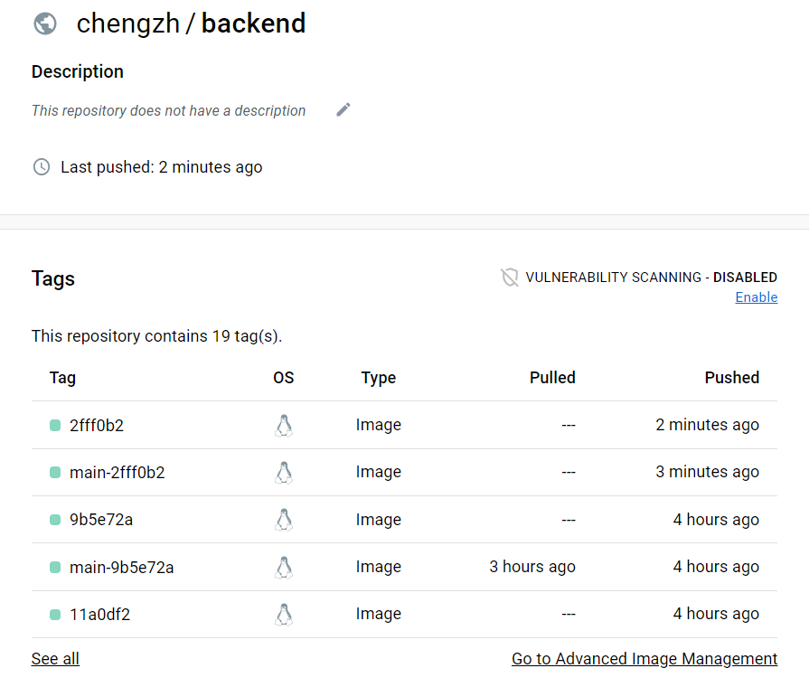
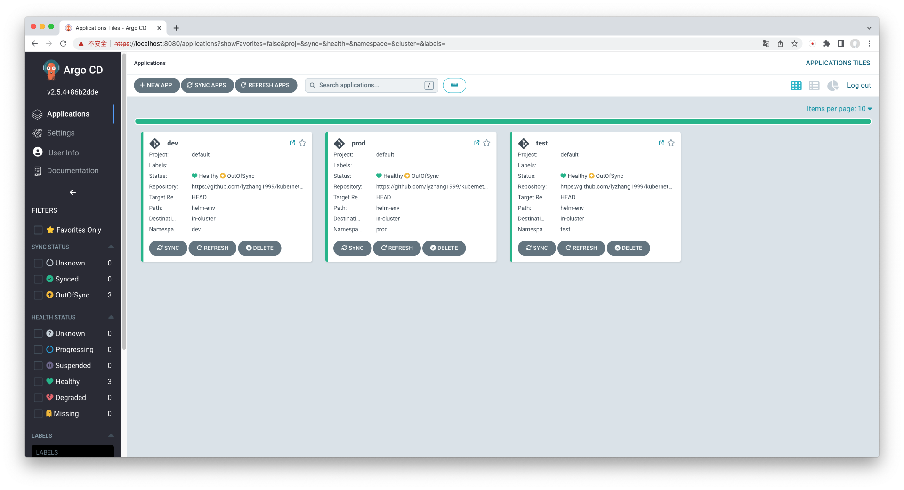
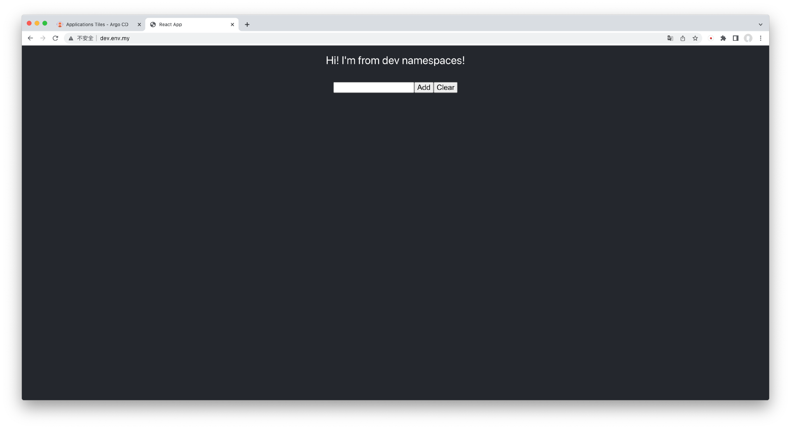
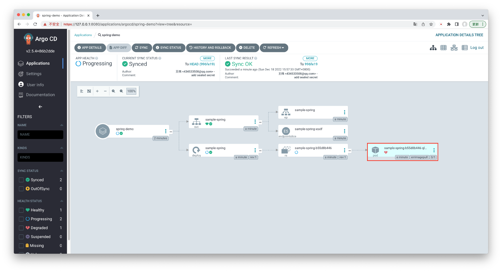
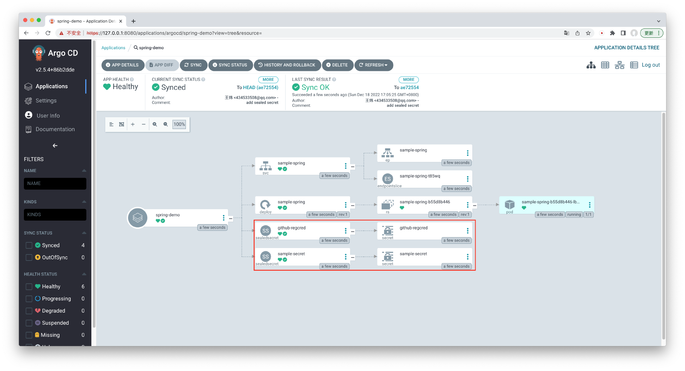

# 安装 Kubernetes 应用平台


## 部署 Kind 群集


**安装 docker**

```bash
apt -y install apt-transport-https ca-certificates curl software-properties-common
```

```bash
curl -fsSL https://mirrors.aliyun.com/docker-ce/linux/ubuntu/gpg | sudo apt-key add -
sudo add-apt-repository "deb [arch=amd64] https://mirrors.aliyun.com/docker-ce/linux/ubuntu $(lsb_release -cs) stable"
```

```bash
apt update -y 
apt install docker-ce -y 
```

可选, 国际互联网直达安装方式

```bash
# curl -sSL https://get.docker.com/ | sh
# usermod -aG docker chengzh
```

```bash
mkdir /etc/docker
```

```bash
cat > /etc/docker/daemon.json << EOF
{
    "exec-opts": ["native.cgroupdriver=systemd"],
    "log-driver": "json-file",
    "log-opts": {
        "max-size": "100m",
        "max-file": "10"
    },
    "registry-mirrors": ["https://pqbap4ya.mirror.aliyuncs.com"]
}
EOF
```

```bash
systemctl restart docker
systemctl enable docker
```


**安装 kubelet**

```
apt-get update && apt-get install -y apt-transport-https
```

```bash
curl https://mirrors.aliyun.com/kubernetes/apt/doc/apt-key.gpg | apt-key add - 
```

```bash
cat > /etc/apt/sources.list.d/kubernetes.list << EOF 
deb https://mirrors.aliyun.com/kubernetes/apt/ kubernetes-xenial main
EOF
```

```bash
apt update -y 
```

安装当前最新版本 

```text
apt install -y kubelet kubeadm kubectl
```

（可选）安装指定版本此次，以 `1.23.00` 为例

```bash
apt install -y kubelet=1.23.0-00 kubeadm=1.23.0-00  kubectl=1.23.0-00
```


**安装 Kind** 

官方方式

```bash
curl -Lo ./kind https://kind.sigs.k8s.io/dl/v0.17.0/kind-linux-amd64
chmod +x ./kind
sudo mv ./kind /usr/local/bin/kind
```


加速方式

```bash
curl -Lo ./kind https://chengzhstor.blob.core.windows.net/k8slab/kind-linux-amd64
chmod +x ./kind
sudo mv ./kind /usr/local/bin/kind
```


**创建实验用群集（单节点）**

创建群集配置文件

```bash
nano  config.yaml
```


```yaml
kind: Cluster
apiVersion: kind.x-k8s.io/v1alpha4
networking:
  apiServerAddress: "192.168.1.231" # 使用虚机的IP，其他场景则设置为 127.0.0.1
  apiServerPort: 6443
nodes:
- role: control-plane
  kubeadmConfigPatches:
  - |
    kind: InitConfiguration
    nodeRegistration:
      kubeletExtraArgs:
        node-labels: "ingress-ready=true"
  extraPortMappings:
  - containerPort: 80
    hostPort: 80
    protocol: TCP
  - containerPort: 443
    hostPort: 443
    protocol: TCP
```


创建群集

```bash
kind create cluster --config config.yaml
```

```bash
root@node1:~# kind create cluster --config config.yaml
Creating cluster "kind" ...
 ✓ Ensuring node image (kindest/node:v1.25.3) 🖼
 ✓ Preparing nodes 📦
 ✓ Writing configuration 📜
 ✓ Starting control-plane 🕹️
 ✓ Installing CNI 🔌
 ✓ Installing StorageClass 💾
Set kubectl context to "kind-kind"
You can now use your cluster with:

kubectl cluster-info --context kind-kind

Have a question, bug, or feature request? Let us know! https://kind.sigs.k8s.io/#community 🙂
root@node1:~# kubectl cluster-info --context kind-kind
Kubernetes control plane is running at https://192.168.1.231:6443
CoreDNS is running at https://192.168.1.231:6443/api/v1/namespaces/kube-system/services/kube-dns:dns/proxy

To further debug and diagnose cluster problems, use 'kubectl cluster-info dump'.
```

查看群集节点

```bash
kubectl get node -o wide
```

```bash
root@node1:~# kubectl get node -o wide
NAME                 STATUS   ROLES           AGE     VERSION   INTERNAL-IP   EXTERNAL-IP   OS-IMAGE             KERNEL-VERSION      CONTAINER-RUNTIME
kind-control-plane   Ready    control-plane   3m32s   v1.25.3   172.18.0.2    <none>        Ubuntu 22.04.1 LTS   5.4.0-107-generic   containerd://1.6.9
```


查看目前的pod

```bash
kubectl get pod -o wide -A
```

```bash
root@node1:~# kubectl get pod -o wide -A
NAMESPACE            NAME                                         READY   STATUS    RESTARTS   AGE   IP           NODE                 NOMINATED NODE   READINESS GATES
kube-system          coredns-565d847f94-7j587                     1/1     Running   0          24s   10.244.0.4   kind-control-plane   <none>           <none>
kube-system          coredns-565d847f94-gqpnw                     1/1     Running   0          24s   10.244.0.3   kind-control-plane   <none>           <none>
kube-system          etcd-kind-control-plane                      1/1     Running   0          38s   172.18.0.2   kind-control-plane   <none>           <none>
kube-system          kindnet-2tpcs                                1/1     Running   0          24s   172.18.0.2   kind-control-plane   <none>           <none>
kube-system          kube-apiserver-kind-control-plane            1/1     Running   0          39s   172.18.0.2   kind-control-plane   <none>           <none>
kube-system          kube-controller-manager-kind-control-plane   1/1     Running   0          37s   172.18.0.2   kind-control-plane   <none>           <none>
kube-system          kube-proxy-76lx7                             1/1     Running   0          24s   172.18.0.2   kind-control-plane   <none>           <none>
kube-system          kube-scheduler-kind-control-plane            1/1     Running   0          37s   172.18.0.2   kind-control-plane   <none>           <none>
local-path-storage   local-path-provisioner-684f458cdd-2jfl4      1/1     Running   0          24s   10.244.0.2   kind-control-plane   <none>           <none>

```


**安装基础群集服务**


安装ingress

```bash
kubectl create -f https://ghproxy.com/https://raw.githubusercontent.com/cloudzun/resource/main/ingress-nginx/ingress-nginx.yaml
```

安装metrics

```bash
kubectl apply -f https://ghproxy.com/https://raw.githubusercontent.com/cloudzun/resource/main/metrics/metrics.yaml
```

安装 helm

```bash
curl https://raw.githubusercontent.com/helm/helm/main/scripts/get-helm-3 | bash
```

(可选)打印kubeconfig文件

```bash
cat $HOME/.kube/config
```

(可选) 安装 Prometheus

```bash
helm repo add prometheus-community https://prometheus-community.github.io/helm-charts
helm upgrade prometheus prometheus-community/kube-prometheus-stack \
--namespace prometheus  --create-namespace --install \
--set prometheus.prometheusSpec.podMonitorSelectorNilUsesHelmValues=false \
--set prometheus.prometheusSpec.serviceMonitorSelectorNilUsesHelmValues=false
```


## (可选)Kubernetes 基本功能测试


**在 Kubernetes 群集上运行pod**

创建Pod定义文件

```bash
nano flask-pod.yaml
```


```yaml
apiVersion: v1
kind: Pod
metadata:
  name: hello-world-flask
spec:
  containers:
    - name: flask
      image: chengzh/hello-world-flask:latest
      ports:
        - containerPort: 5000
```

运行pod
```bash
kubectl apply -f flask-pod.yaml
```


```bash
root@node1:~# kubectl apply -f flask-pod.yaml
pod/hello-world-flask created
root@node1:~# kubectl get pod
NAME                READY   STATUS              RESTARTS   AGE
hello-world-flask   0/1     ContainerCreating   0          6s
root@node1:~# kubectl get pod
NAME                READY   STATUS    RESTARTS   AGE
hello-world-flask   1/1     Running   0          7m10s
```


端口映射

```bash
kubectl port-forward pod/hello-world-flask 8000:5000
```


```bash
root@node1:~# kubectl port-forward pod/hello-world-flask 8000:5000
Forwarding from 127.0.0.1:8000 -> 5000
Forwarding from [::1]:8000 -> 5000
Handling connection for 8000
```


打开另外一个终端会话进行访问

```bash
curl localhost:8000
```

```bash
root@node1:~# curl localhost:8000
Hello, my first docker images! hello-world-flaskroot@node1:~#
```

如果是在常规Kubernetes 环境中进行实验参考以下步骤

```bash
controlplane $ kubectl get pod -o wide
NAME                READY   STATUS    RESTARTS   AGE   IP            NODE     NOMINATED NODE   READINESS GATES
hello-world-flask   1/1     Running   0          14s   192.168.1.3   node01   <none>           <none>
controlplane $ curl 192.168.1.3 
curl: (7) Failed to connect to 192.168.1.3 port 80: Connection refused
controlplane $ curl 192.168.1.3:5000 
Hello, my first docker images! hello-world-flaskcontrolplane $ 
```


删除 pod

```bash
kubectl delete -f flask-pod.yaml
```


```bash
root@node1:~# kubectl delete -f flask-pod.yaml
pod "hello-world-flask" deleted
```


**创建实验工作负载**

创建 deployment

```bash
kubectl create deployment hello-world-flask --image=chengzh/hello-world-flask:latest --replicas=2 
```

创建 service
```bash
kubectl create service clusterip hello-world-flask --tcp=5000:5000
```


创建 ingress
```bash
kubectl create ingress hello-world-flask --rule="/=hello-world-flask:5000"
```


部署 ingress-nginx
```bash
kubectl create -f https://ghproxy.com/https://raw.githubusercontent.com/cloudzun/resource/main/ingress-nginx/ingress-nginx.yaml
```

（可选）如果使用非kind环境，比如sandbox上，则需要为某个节点打标签 `ingress-ready: "true"`
```bash
kubectl label node node01 ingress-ready=true
```


- Pod 会被 Deployment 工作负载管理起来，例如创建和销毁等；
- Service 相当于弹性伸缩组的负载均衡器，它能以加权轮训的方式将流量转发到多个 Pod 副本上；
- Ingress 相当于集群的外网访问入口。


**工作负载自愈**

打开另外一个会话窗口访问服务
```bash
while true; do sleep 1; curl http://127.0.0.1; echo -e '\n'$(date);done
```
有了 Ingress，访问 Pod 就不再需要进行端口转发了，可以直接访问 127.0.0.1。上面的命令会每隔 1 秒钟发送一次请求，并打印出时间和返回内容：

```bash
root@node1:~# while true; do sleep 1; curl http://127.0.0.1; echo -e '\n'$(date);done
Hello, my first docker images! hello-world-flask-6bdf7b45dc-5tdzs
Mon 06 Feb 2023 12:01:40 PM CST
Hello, my first docker images! hello-world-flask-6bdf7b45dc-hnvqm
Mon 06 Feb 2023 12:01:41 PM CST
Hello, my first docker images! hello-world-flask-6bdf7b45dc-5tdzs
Mon 06 Feb 2023 12:01:42 PM CST
Hello, my first docker images! hello-world-flask-6bdf7b45dc-5tdzs
Mon 06 Feb 2023 12:01:43 PM CST
Hello, my first docker images! hello-world-flask-6bdf7b45dc-hnvqm
Mon 06 Feb 2023 12:01:44 PM CST
Hello, my first docker images! hello-world-flask-6bdf7b45dc-hnvqm
Mon 06 Feb 2023 12:01:45 PM CST
Hello, my first docker images! hello-world-flask-6bdf7b45dc-5tdzs
Mon 06 Feb 2023 12:01:46 PM CST
Hello, my first docker images! hello-world-flask-6bdf7b45dc-hnvqm
Mon 06 Feb 2023 12:01:47 PM CST
Hello, my first docker images! hello-world-flask-6bdf7b45dc-5tdzs
Mon 06 Feb 2023 12:01:48 PM CST
Hello, my first docker images! hello-world-flask-6bdf7b45dc-5tdzs
Mon 06 Feb 2023 12:01:49 PM CST
Hello, my first docker images! hello-world-flask-6bdf7b45dc-hnvqm
Mon 06 Feb 2023 12:01:50 PM CST
Hello, my first docker images! hello-world-flask-6bdf7b45dc-5tdzs
Mon 06 Feb 2023 12:01:51 PM CST

```
在这里，“Hello, my first docker images” 后面紧接的内容是 Pod 名称。通过返回内容会发现，请求被平均分配到了两个 Pod 上，Pod 名称是交替出现的。要保留这个命令行窗口，以便继续观察。

如果使用非kind环境，需要使用此前打标签的机器的名称或者地址进行观察

```bash
while true; do sleep 1; curl node01; echo -e '\n'$(date);done
```

模拟某个pod失效

```bash
kubectl get pod
```


```bash
root@node1:~# kubectl get pod
NAME                                 READY   STATUS    RESTARTS   AGE
hello-world-flask-6bdf7b45dc-5tdzs   1/1     Running   0          12m
hello-world-flask-6bdf7b45dc-hnvqm   1/1     Running   0          12m
```

```bash
kubectl delete pod hello-world-flask-6bdf7b45dc-5tdzs
```


所有的流量被压在另一个正常的pod
```bash
Hello, my first docker images! hello-world-flask-6bdf7b45dc-hnvqm
Mon 06 Feb 2023 12:08:31 PM CST
Hello, my first docker images! hello-world-flask-6bdf7b45dc-hnvqm
Mon 06 Feb 2023 12:08:32 PM CST
Hello, my first docker images! hello-world-flask-6bdf7b45dc-hnvqm
Mon 06 Feb 2023 12:08:33 PM CST
Hello, my first docker images! hello-world-flask-6bdf7b45dc-hnvqm
Mon 06 Feb 2023 12:08:34 PM CST
```


新pod上线后，流量在新旧两个pod上负载均衡
```bash
Hello, my first docker images! hello-world-flask-6bdf7b45dc-qbvf2
Mon 06 Feb 2023 12:08:35 PM CST
Hello, my first docker images! hello-world-flask-6bdf7b45dc-hnvqm
Mon 06 Feb 2023 12:08:36 PM CST
Hello, my first docker images! hello-world-flask-6bdf7b45dc-qbvf2
Mon 06 Feb 2023 12:08:37 PM CST
Hello, my first docker images! hello-world-flask-6bdf7b45dc-qbvf2
Mon 06 Feb 2023 12:08:38 PM CST
Hello, my first docker images! hello-world-flask-6bdf7b45dc-hnvqm
Mon 06 Feb 2023 12:08:39 PM CST
Hello, my first docker images! hello-world-flask-6bdf7b45dc-qbvf2
Mon 06 Feb 2023 12:08:40 PM CST
Hello, my first docker images! hello-world-flask-6bdf7b45dc-hnvqm
Mon 06 Feb 2023 12:08:41 PM CST
Hello, my first docker images! hello-world-flask-6bdf7b45dc-qbvf2
Mon 06 Feb 2023 12:08:42 PM CST
Hello, my first docker images! hello-world-flask-6bdf7b45dc-hnvqm
Mon 06 Feb 2023 12:08:43 PM CST
Hello, my first docker images! hello-world-flask-6bdf7b45dc-qbvf2
```

再次查看pod列表

```bash
kubectl get pod
```

```bash
root@node1:~# kubectl get pod
NAME                                 READY   STATUS    RESTARTS   AGE
hello-world-flask-6bdf7b45dc-hnvqm   1/1     Running   0          17m
hello-world-flask-6bdf7b45dc-qbvf2   1/1     Running   0          2m1s
```

首先， K8s 感知到了业务 Pod 故障，立刻进行了故障转移并隔离了有故障的 Pod，并将请求转发到了其他健康的 Pod 中。随后重启了有故障的 Pod，最后将重启后的 Pod 加入到了负载均衡并开始接收外部请求。这些过程都是自动化完成的。


**自动扩容**

（可选）安装 metrics 

```bash
kubectl apply -f https://ghproxy.com/https://raw.githubusercontent.com/cloudzun/resource/main/metrics/metrics.yaml
```

```bash
kubectl wait deployment -n kube-system metrics-server --for condition=Available=True --timeout=90s
```


创建自动扩缩容策略
```bash
kubectl autoscale deployment hello-world-flask --cpu-percent=50 --min=2 --max=10
```


```bash
root@node1:~# kubectl autoscale deployment hello-world-flask --cpu-percent=50 --min=2 --max=10
horizontalpodautoscaler.autoscaling/hello-world-flask autoscaled
```

为deployment注入资源配额
```bash
kubectl patch deployment hello-world-flask --type='json' -p='[{"op": "add", "path": "/spec/template/spec/containers/0/resources", "value": {"requests": {"memory": "100Mi", "cpu": "100m"}}}]'
```


```bash
root@node1:~# kubectl patch deployment hello-world-flask --type='json' -p='[{"op": "add", "path": "/spec/template/spec/containers/0/resources", "value": {"requests": {"memory": "100Mi", "cpu": "100m"}}}]'
deployment.apps/hello-world-flask patched
root@node1:~# kubectl get pod
NAME                                 READY   STATUS        RESTARTS   AGE
hello-world-flask-5d4494cc9b-5p7vx   1/1     Running       0          12s
hello-world-flask-5d4494cc9b-jmwxd   1/1     Running       0          8s
hello-world-flask-6bdf7b45dc-hnvqm   1/1     Terminating   0          31m
hello-world-flask-6bdf7b45dc-qbvf2   1/1     Terminating   0          15m
root@node1:~# kubectl get pod
NAME                                 READY   STATUS    RESTARTS   AGE
hello-world-flask-5d4494cc9b-5p7vx   1/1     Running   0          49s
hello-world-flask-5d4494cc9b-jmwxd   1/1     Running   0          45s
```

进入到某一个pod的上下文
```bash
kubectl exec -it kubectl exec -it hello-world-flask-5d4494cc9b-jmwxd  -- bash
```

模拟业务高峰场景
```bash
ab -c 50 -n 10000 http://127.0.0.1:5000/
```
在这条压力测试的命令中，-c 代表 50 个并发数，-n 代表一共请求 10000 次，整个过程大概会持续十几秒。


```bash
root@node1:~# kubectl exec -it hello-world-flask-5d4494cc9b-jmwxd -- bash
root@hello-world-flask-5d4494cc9b-jmwxd:/app# ab -c 50 -n 10000 http://127.0.0.1:5000/
This is ApacheBench, Version 2.3 <$Revision: 1843412 $>
Copyright 1996 Adam Twiss, Zeus Technology Ltd, http://www.zeustech.net/
Licensed to The Apache Software Foundation, http://www.apache.org/

Benchmarking 127.0.0.1 (be patient)
Completed 1000 requests
Completed 2000 requests
Completed 3000 requests
Completed 4000 requests
Completed 5000 requests
Completed 6000 requests
Completed 7000 requests
Completed 8000 requests
Completed 9000 requests
Completed 10000 requests
Finished 10000 requests


Server Software:        Werkzeug/2.2.2
Server Hostname:        127.0.0.1
Server Port:            5000

Document Path:          /
Document Length:        65 bytes

Concurrency Level:      50
Time taken for tests:   9.177 seconds
Complete requests:      10000
Failed requests:        0
Total transferred:      2380000 bytes
HTML transferred:       650000 bytes
Requests per second:    1089.67 [#/sec] (mean)
Time per request:       45.886 [ms] (mean)
Time per request:       0.918 [ms] (mean, across all concurrent requests)
Transfer rate:          253.26 [Kbytes/sec] received

Connection Times (ms)
              min  mean[+/-sd] median   max
Connect:        0    0   0.1      0       2
Processing:     2   46   5.6     44      80
Waiting:        1   45   5.5     44      80
Total:          2   46   5.6     44      80

Percentage of the requests served within a certain time (ms)
  50%     44
  66%     46
  75%     48
  80%     49
  90%     53
  95%     56
  98%     60
  99%     63
 100%     80 (longest request)

```


再开一个会话窗口（对，第三个）

```bash
kubectl get pods --watch
```


```bash
root@node1:~# kubectl get pods --watch
NAME                                 READY   STATUS    RESTARTS   AGE
hello-world-flask-5d4494cc9b-5p7vx   1/1     Running   0          8m
hello-world-flask-5d4494cc9b-87vx2   1/1     Running   0          51s
hello-world-flask-5d4494cc9b-bwh5s   1/1     Running   0          66s
hello-world-flask-5d4494cc9b-jmwxd   1/1     Running   0          7m56s
hello-world-flask-5d4494cc9b-mn4w9   1/1     Running   0          66s
hello-world-flask-5d4494cc9b-r5fh5   1/1     Running   0          51s
hello-world-flask-5d4494cc9b-trsm4   0/1     Pending   0          36s
hello-world-flask-5d4494cc9b-vvn9v   0/1     Pending   0          36s
hello-world-flask-5d4494cc9b-vx2kb   1/1     Running   0          51s
hello-world-flask-5d4494cc9b-xkqxv   1/1     Running   0          51s
```
参数 `--watch` 表示持续监听 Pod 状态变化。在 ab 压力测试的过程中，会不断创建新的 Pod 副本，这说明 K8s 已经感知到了 Pod 的业务压力，并且正在自动进行横向扩容


延长时间会观测到自动缩容

```bash
root@node1:~# kubectl get pods --watch
NAME                                 READY   STATUS    RESTARTS   AGE
hello-world-flask-5d4494cc9b-5p7vx   1/1     Running   0          8m
hello-world-flask-5d4494cc9b-87vx2   1/1     Running   0          51s
hello-world-flask-5d4494cc9b-bwh5s   1/1     Running   0          66s
hello-world-flask-5d4494cc9b-jmwxd   1/1     Running   0          7m56s
hello-world-flask-5d4494cc9b-mn4w9   1/1     Running   0          66s
hello-world-flask-5d4494cc9b-r5fh5   1/1     Running   0          51s
hello-world-flask-5d4494cc9b-trsm4   0/1     Pending   0          36s
hello-world-flask-5d4494cc9b-vvn9v   0/1     Pending   0          36s
hello-world-flask-5d4494cc9b-vx2kb   1/1     Running   0          51s
hello-world-flask-5d4494cc9b-xkqxv   1/1     Running   0          51s
hello-world-flask-5d4494cc9b-trsm4   0/1     Terminating   0          4m30s
hello-world-flask-5d4494cc9b-vvn9v   0/1     Terminating   0          4m30s
hello-world-flask-5d4494cc9b-trsm4   0/1     Terminating   0          4m30s
hello-world-flask-5d4494cc9b-vvn9v   0/1     Terminating   0          4m30s
hello-world-flask-5d4494cc9b-bwh5s   1/1     Terminating   0          5m30s
hello-world-flask-5d4494cc9b-vx2kb   1/1     Terminating   0          5m15s
hello-world-flask-5d4494cc9b-r5fh5   1/1     Terminating   0          5m15s
hello-world-flask-5d4494cc9b-xkqxv   1/1     Terminating   0          5m15s
hello-world-flask-5d4494cc9b-mn4w9   1/1     Terminating   0          5m30s
hello-world-flask-5d4494cc9b-87vx2   1/1     Terminating   0          5m15s
hello-world-flask-5d4494cc9b-xkqxv   0/1     Terminating   0          5m46s
hello-world-flask-5d4494cc9b-xkqxv   0/1     Terminating   0          5m46s
hello-world-flask-5d4494cc9b-xkqxv   0/1     Terminating   0          5m46s
hello-world-flask-5d4494cc9b-mn4w9   0/1     Terminating   0          6m1s
hello-world-flask-5d4494cc9b-mn4w9   0/1     Terminating   0          6m1s
hello-world-flask-5d4494cc9b-mn4w9   0/1     Terminating   0          6m1s
hello-world-flask-5d4494cc9b-vx2kb   0/1     Terminating   0          5m46s
hello-world-flask-5d4494cc9b-vx2kb   0/1     Terminating   0          5m46s
hello-world-flask-5d4494cc9b-vx2kb   0/1     Terminating   0          5m46s
hello-world-flask-5d4494cc9b-87vx2   0/1     Terminating   0          5m47s
hello-world-flask-5d4494cc9b-87vx2   0/1     Terminating   0          5m47s
hello-world-flask-5d4494cc9b-87vx2   0/1     Terminating   0          5m47s
hello-world-flask-5d4494cc9b-bwh5s   0/1     Terminating   0          6m2s
hello-world-flask-5d4494cc9b-bwh5s   0/1     Terminating   0          6m3s
hello-world-flask-5d4494cc9b-bwh5s   0/1     Terminating   0          6m3s
hello-world-flask-5d4494cc9b-r5fh5   0/1     Terminating   0          5m48s
hello-world-flask-5d4494cc9b-r5fh5   0/1     Terminating   0          5m48s
hello-world-flask-5d4494cc9b-r5fh5   0/1     Terminating   0          5m48s

```

```bash
root@node1:~# kubectl get pod
NAME                                 READY   STATUS    RESTARTS   AGE
hello-world-flask-5d4494cc9b-5p7vx   1/1     Running   0          15m
hello-world-flask-5d4494cc9b-jmwxd   1/1     Running   0          15m
```


# 示例应用的部署和解析


## 组件分析和部署

数据库配置分析

```yaml
apiVersion: v1
data:
  CreateDB.sql: |-
    CREATE TABLE text (
        id serial PRIMARY KEY,
        text VARCHAR ( 100 ) UNIQUE NOT NULL
    );
kind: ConfigMap
metadata:
  name: pg-init-script
---
apiVersion: apps/v1
kind: Deployment
metadata:
  name: postgres
  labels:
    app: database
spec:
  replicas: 1
  selector:
    matchLabels:
      app: database
  template:
    metadata:
      labels:
        app: database
    spec:
      containers:
      - name: postgres
        image: postgres
        imagePullPolicy: IfNotPresent
        ports:
        - containerPort: 5432
        volumeMounts:
        - name: sqlscript
          mountPath: /docker-entrypoint-initdb.d
        env:
          - name: POSTGRES_USER
            value: "postgres"
          - name: POSTGRES_PASSWORD
            value: "postgres"
      volumes:
        - name: sqlscript
          configMap:
            name: pg-init-script
---
apiVersion: v1
kind: Service
metadata:
  name: pg-service
  labels:
    app: database
spec:
  type: ClusterIP
  selector:
    app: database
  ports:
  - port: 5432
```

这个 Kubernetes 清单文件定义了一个使用 Postgres 镜像的 Deployment，其中包含一个初始化脚本（在 ConfigMap 中定义）来创建一个 "text" 表。同时，它还创建了一个 ClusterIP 类型的 Service，用于在集群内部访问 Postgres 数据库。

通过这个配置，当 Postgres 容器启动时，会自动执行 ConfigMap 中的 "CreateDB.sql" 脚本来创建 "text" 表。服务 "pg-service" 则提供了一个在集群内访问该 Postgres 数据库的统一入口，其他应用可以通过该服务与数据库进行通信。这种方式使得部署和管理 Postgres 数据库变得更加简单和灵活。

1.  ConfigMap:
    
    -   `apiVersion: v1`: 使用 Kubernetes API 的 v1 版本。
    -   `kind: ConfigMap`: 表示创建一个 ConfigMap 资源。
    -   `metadata`: ConfigMap 的元数据，包括名称 "pg-init-script"。
    -   `data`: 包含一个 SQL 脚本 "CreateDB.sql"，用于创建一个名为 "text" 的表。这个表有两个字段：一个名为 "id" 的自增主键和一个名为 "text" 的唯一非空 VARCHAR 字段。
2.  Deployment:
    
    -   `apiVersion: apps/v1`: 使用 Kubernetes API 的 apps/v1 版本。
    -   `kind: Deployment`: 表示创建一个 Deployment 资源。
    -   `metadata`: Deployment 的元数据，包括名称 "postgres" 和一个标签 "app: database"。
    -   `spec`: Deployment 的详细规格。
        -   `replicas: 1`: 只创建一个副本。
        -   `selector`: 用于选择具有 "app: database" 标签的 Pods。
        -   `template`: 定义了 Pod 的模板。
            -   `metadata`: 指定 Pod 的标签 "app: database"。
            -   `spec`: Pod 的详细规格。
                -   `containers`: 容器的列表，只有一个容器 "postgres"。
                    -   `name: postgres`: 容器的名称。
                    -   `image: postgres`: 容器的镜像。
                    -   `imagePullPolicy: IfNotPresent`: 如果镜像已经存在，就不需要拉取。
                    -   `ports`: 容器暴露的端口列表，这里只有一个端口 5432。
                    -   `volumeMounts`: 挂载的卷列表，挂载名为 "sqlscript" 的卷到容器内的 "/docker-entrypoint-initdb.d" 目录。
                    -   `env`: 定义了环境变量 "POSTGRES_USER" 和 "POSTGRES_PASSWORD"，分别设置为 "postgres" 和 "postgres"。
                -   `volumes`: 卷的列表，这里只有一个卷 "sqlscript"。
                    -   `name: sqlscript`: 卷的名称。
                    -   `configMap`: 从 ConfigMap "pg-init-script" 创建卷。
3.  Service:
    
    -   `apiVersion: v1`: 使用 Kubernetes API 的 v1 版本。
    -   `kind: Service`: 表示创建一个 Service 资源。
    -   `metadata`: Service 的元数据，包括名称 "pg-service" 和一个标签 "app: database"。
    -   `spec`: Service 的详细规格。
        -   `type: ClusterIP`: 使用 ClusterIP 类型的 Service。
        -   `selector`: 选择具有 "app: database" 标签的 Pods。
        -   `ports`: 服务暴露的端口列表，这里只有一个端口 5432。

后端服务分析

```yaml
apiVersion: apps/v1
kind: Deployment
metadata:
  name: backend
  labels:
    app: backend
spec:
  replicas: 1
  selector:
    matchLabels:
      app: backend
  template:
    metadata:
      labels:
        app: backend
    spec:
      containers:
      - name: flask-backend
        image: chengzh/backend:latest
        imagePullPolicy: IfNotPresent
        ports:
        - containerPort: 5000
        env:
        - name: DATABASE_URI
          value: pg-service
        - name: DATABASE_USERNAME
          value: postgres
        - name: DATABASE_PASSWORD
          value: postgres
        resources:
          requests:
            memory: "128Mi"
            cpu: "128m"
          limits:
            memory: "256Mi"
            cpu: "256m"
        readinessProbe: 
          httpGet:
            path: /healthy
            port: 5000
            scheme: HTTP
          initialDelaySeconds: 10
          failureThreshold: 5
          periodSeconds: 10
          successThreshold: 1
          timeoutSeconds: 1
        livenessProbe: 
          httpGet:
            path: /healthy
            port: 5000
            scheme: HTTP
          failureThreshold: 5
          periodSeconds: 10
          successThreshold: 1
          timeoutSeconds: 1
        startupProbe: 
          httpGet:
            path: /healthy
            port: 5000
            scheme: HTTP
          initialDelaySeconds: 10
          failureThreshold: 5
          periodSeconds: 10
          successThreshold: 1
          timeoutSeconds: 1
---
apiVersion: v1
kind: Service
metadata:
  name: backend-service
  labels:
    app: backend
spec:
  type: ClusterIP
  selector:
    app: backend
  ports:
  - port: 5000
    targetPort: 5000
```

这个 Kubernetes 清单文件定义了一个基于 Flask 的后端应用的 Deployment 和一个 ClusterIP 类型的 Service。部署中的容器使用了一个自定义镜像 "chengzh/backend:latest"，并暴露了 5000 端口。同时设置了环境变量以连接到前面创建的 Postgres 数据库。Service "backend-service" 则提供了一个统一的访问点，使得集群内其他服务可以与此后端应用通信。此外，还配置了探针以确保应用的正常运行和故障恢复。

1.  Deployment:
    
    -   `apiVersion: apps/v1`: 使用 Kubernetes API 的 apps/v1 版本。
    -   `kind: Deployment`: 表示创建一个 Deployment 资源。
    -   `metadata`: Deployment 的元数据，包括名称 "backend" 和一个标签 "app: backend"。
    -   `spec`: Deployment 的详细规格。
        -   `replicas: 1`: 只创建一个副本。
        -   `selector`: 用于选择具有 "app: backend" 标签的 Pods。
        -   `template`: 定义了 Pod 的模板。
            -   `metadata`: 指定 Pod 的标签 "app: backend"。
            -   `spec`: Pod 的详细规格。
                -   `containers`: 容器的列表，只有一个容器 "flask-backend"。
                    -   `name: flask-backend`: 容器的名称。
                    -   `image: chengzh/backend:latest`: 容器的镜像。
                    -   `imagePullPolicy: IfNotPresent`: 如果镜像已经存在，就不需要拉取。
                    -   `ports`: 容器暴露的端口列表，这里只有一个端口 5000。
                    -   `env`: 定义了环境变量 "DATABASE_URI"、"DATABASE_USERNAME" 和 "DATABASE_PASSWORD"，用于连接到前面创建的 Postgres 数据库。
                    -   `resources`: 定义容器的资源限制和请求。
                    -   `readinessProbe`: 定义容器的就绪探针，用于检查应用是否准备好接受流量。
                    -   `livenessProbe`: 定义容器的存活探针，用于检查应用是否仍在运行。
                    -   `startupProbe`: 定义容器的启动探针，用于检查应用是否成功启动。
2.  Service:
    
    -   `apiVersion: v1`: 使用 Kubernetes API 的 v1 版本。
    -   `kind: Service`: 表示创建一个 Service 资源。
    -   `metadata`: Service 的元数据，包括名称 "backend-service" 和一个标签 "app: backend"。
    -   `spec`: Service 的详细规格。
        -   `type: ClusterIP`: 使用 ClusterIP 类型的 Service。
        -   `selector`: 选择具有 "app: backend" 标签的 Pods。
        -   `ports`: 服务暴露的端口列表，这里只有一个端口 5000，对应容器的 5000 端口。

探针配置说明：

-   `readinessProbe`: 就绪探针
    
    -   `httpGet`: 使用 HTTP GET 请求检查应用是否准备好接受流量。
    -   `path`: 探针访问的路径，这里设置为 "/healthy"。
    -   `port`: 探针访问的端口，这里设置为 5000。
    -   `initialDelaySeconds`: 容器启动后多少秒开始进行探测，默认值为 0。
    -   `failureThreshold`: 探测失败多少次后认为容器不健康，默认值为 3。
    -   `periodSeconds`: 探测的周期，默认值为 10。
    -   `successThreshold`: 探测成功多少次后认为容器健康，默认值为 1。
    -   `timeoutSeconds`: 探测超时时间，默认值为 1。
-   `livenessProbe`: 存活探针
    
    -   使用与就绪探针相同的设置进行存活探测。
-   `startupProbe`: 启动探针
    
    -   使用与就绪探针相同的设置进行启动探测。

通过这个配置，应用在启动、运行过程中和准备好接收请求时，Kubernetes 都会根据探针的配置检查应用的状态。这有助于确保应用在出现问题时能够自动恢复，提高了应用的可用性和稳定性。

前端服务分析

```yaml
apiVersion: apps/v1
kind: Deployment
metadata:
  name: frontend
  labels:
    app: frontend
spec:
  replicas: 1
  selector:
    matchLabels:
      app: frontend
  template:
    metadata:
      labels:
        app: frontend
    spec:
      containers:
      - name: react-frontend
        image: chengzh/frontend:latest
        imagePullPolicy: IfNotPresent
        ports:
        - containerPort: 3000
        resources:
          requests:
            memory: "128Mi"
            cpu: "128m"
          limits:
            memory: "256Mi"
            cpu: "256m"
---
apiVersion: v1
kind: Service
metadata:
  name: frontend-service
spec:
  type: ClusterIP
  selector:
    app: frontend
  ports:
  - port: 3000
    targetPort: 3000
```

这个 Kubernetes 清单文件定义了一个基于 React 的前端应用的 Deployment 和一个 ClusterIP 类型的 Service。部署中的容器使用了一个自定义镜像 "chengzh/frontend:latest"，并暴露了 3000 端口。Service "frontend-service" 则提供了一个统一的访问点，使得集群内其他服务可以与此前端应用通信。

1.  Deployment:
    
    -   `apiVersion: apps/v1`: 使用 Kubernetes API 的 apps/v1 版本。
    -   `kind: Deployment`: 表示创建一个 Deployment 资源。
    -   `metadata`: Deployment 的元数据，包括名称 "frontend" 和一个标签 "app: frontend"。
    -   `spec`: Deployment 的详细规格。
        -   `replicas: 1`: 只创建一个副本。
        -   `selector`: 用于选择具有 "app: frontend" 标签的 Pods。
        -   `template`: 定义了 Pod 的模板。
            -   `metadata`: 指定 Pod 的标签 "app: frontend"。
            -   `spec`: Pod 的详细规格。
                -   `containers`: 容器的列表，只有一个容器 "react-frontend"。
                    -   `name: react-frontend`: 容器的名称。
                    -   `image: chengzh/frontend:latest`: 容器的镜像。
                    -   `imagePullPolicy: IfNotPresent`: 如果镜像已经存在，就不需要拉取。
                    -   `ports`: 容器暴露的端口列表，这里只有一个端口 3000。
                    -   `resources`: 定义容器的资源限制和请求。
2.  Service:
    
    -   `apiVersion: v1`: 使用 Kubernetes API 的 v1 版本。
    -   `kind: Service`: 表示创建一个 Service 资源。
    -   `metadata`: Service 的元数据，包括名称 "frontend-service"。
    -   `spec`: Service 的详细规格。
        -   `type: ClusterIP`: 使用 ClusterIP 类型的 Service。
        -   `selector`: 选择具有 "app: frontend" 标签的 Pods。
        -   `ports`: 服务暴露的端口列表，这里只有一个端口 3000，对应容器的 3000 端口。

 ingress 分析

```yaml
apiVersion: networking.k8s.io/v1
kind: Ingress
metadata:
  name: frontend-ingress
  annotations:
    nginx.ingress.kubernetes.io/rewrite-target: /$1
spec:
  rules:
    - http:
        paths:
          - path: /?(.*)
            pathType: Prefix
            backend:
              service:
                name: frontend-service
                port:
                  number: 3000
          - path: /api/?(.*)
            pathType: Prefix
            backend:
              service:
                name: backend-service
                port:
                  number: 5000
  ingressClassName: nginx
```

这个 Kubernetes 清单文件定义了一个 Ingress 资源，用于配置基于 Nginx Ingress 控制器的应用路由规则。它将根路径（及其子路径）的请求路由到 "frontend-service" 服务（端口 3000），将以 "/api" 开头的请求路由到 "backend-service" 服务（端口 5000）。这为前端和后端服务提供了一个统一的访问点。

1.  Ingress:
    
    -   `apiVersion: networking.k8s.io/v1`: 使用 Kubernetes API 的 `networking.k8s.io/v1` 版本。
    -   `kind: Ingress`: 表示创建一个 Ingress 资源。
    -   `metadata`: Ingress 的元数据，包括名称 "frontend-ingress"。
    -   `annotations`: Ingress 的注解，用于配置 Ingress 控制器的行为。
        -   `nginx.ingress.kubernetes.io/rewrite-target: /$1`: 为 Nginx Ingress 控制器设置 URL 重写规则。
2.  `spec`: Ingress 的详细规格。
    
    -   `rules`: 定义 Ingress 的路由规则。
        -   第一条规则：
            -   `path: /?(.*)`: 匹配根路径及其子路径。问号表示该子组是可选的，星号表示匹配任意字符。
            -   `pathType: Prefix`: 表示路径匹配类型为前缀匹配。
            -   `backend`: 定义后端服务的信息。
                -   `service`: 指定后端服务的名称和端口。
                    -   `name: frontend-service`: 指定后端服务名称为 "frontend-service"。
                    -   `port`: 指定后端服务端口号为 3000。
        -   第二条规则：
            -   `path: /api/?(.*)`: 匹配以 "/api" 开头的路径及其子路径。
            -   `pathType: Prefix`: 表示路径匹配类型为前缀匹配。
            -   `backend`: 定义后端服务的信息。
                -   `service`: 指定后端服务的名称和端口。
                    -   `name: backend-service`: 指定后端服务名称为 "backend-service"。
                    -   `port`: 指定后端服务端口号为 5000。
    -   `ingressClassName: nginx`: 指定使用名为 "nginx" 的 Ingress 类。

HPA策略分析

```yaml
apiVersion: autoscaling/v2
kind: HorizontalPodAutoscaler
metadata:
  name: frontend
spec:
  scaleTargetRef:
    kind: Deployment
    name: frontend
    apiVersion: apps/v1
  minReplicas: 2
  maxReplicas: 2
  metrics:
    - type: Resource
      resource:
        name: cpu
        target:
          type: Utilization
          averageUtilization: 80

---
apiVersion: autoscaling/v2
kind: HorizontalPodAutoscaler
metadata:
  name: backend
spec:
  scaleTargetRef:
    kind: Deployment
    name: backend
    apiVersion: apps/v1
  minReplicas: 2
  maxReplicas: 10
  metrics:
    - type: Resource
      resource:
        name: cpu
        target:
          type: Utilization
          averageUtilization: 50
    - type: Resource
      resource:
        name: memory
        target:
          type: Utilization
          averageUtilization: 50
```

这个 Kubernetes 清单文件定义了两个 HorizontalPodAutoscaler（HPA）资源，用于自动伸缩前端和后端应用的 Deployment。前端应用的 HPA 配置会根据 CPU 利用率进行伸缩，最小和最大副本数均为 2。后端应用的 HPA 配置会根据 CPU 和内存利用率进行伸缩，最小副本数为 2，最大副本数为 10。这些配置将确保在负载变化时，应用能够根据需要自动调整副本数量，以提供稳定的性能和资源利用率。

1.  前端应用的 HPA 配置：
    
    -   `apiVersion: autoscaling/v2`: 使用 Kubernetes API 的 autoscaling/v2 版本。
    -   `kind: HorizontalPodAutoscaler`: 表示创建一个 HorizontalPodAutoscaler 资源。
    -   `metadata`: HPA 的元数据，包括名称 "frontend"。
    -   `spec`: HPA 的详细规格。
        -   `scaleTargetRef`: 需要伸缩的目标资源的引用。
            -   `kind: Deployment`: 目标资源类型是 Deployment。
            -   `name: frontend`: 目标资源的名称为 "frontend"。
            -   `apiVersion: apps/v1`: 目标资源的 API 版本为 apps/v1。
        -   `minReplicas: 2`: 最小副本数为 2。
        -   `maxReplicas: 2`: 最大副本数为 2。
        -   `metrics`: 用于驱动伸缩行为的指标。
            -   `type: Resource`: 指标类型为资源。
            -   `resource`: 目标资源的详细信息。
                -   `name: cpu`: 目标资源名称为 CPU。
                -   `target`: 目标资源的使用目标。
                    -   `type: Utilization`: 目标类型为利用率。
                    -   `averageUtilization: 80`: 平均利用率目标为 80%。
2.  后端应用的 HPA 配置：
    
    -   `apiVersion: autoscaling/v2`: 使用 Kubernetes API 的 autoscaling/v2 版本。
    -   `kind: HorizontalPodAutoscaler`: 表示创建一个 HorizontalPodAutoscaler 资源。
    -   `metadata`: HPA 的元数据，包括名称 "backend"。
    -   `spec`: HPA 的详细规格。
        -   `scaleTargetRef`: 需要伸缩的目标资源的引用。
            -   `kind: Deployment`: 目标资源类型是 Deployment。
            -   `name: backend`: 目标资源的名称为 "backend"。
            -   `apiVersion: apps/v1`: 目标资源的 API 版本为 apps/v1。
        -   `minReplicas: 2`: 最小副本数为 2。
        -   `maxReplicas: 10`: 最大副本数为 10。
        -   `metrics`: 用于驱动伸缩行为的指标。
            -   第一个指标：
                -   `type: Resource`: 指标类型为资源。
                -   `resource`: 目标资源的详细信息。
                    -   `name: cpu`: 目标资源名称为 CPU。
                    -   `target`: 目标资源的使用目标。
                        -   `type: Utilization`: 目标类型为利用率。
                        -   `averageUtilization: 50`: 平均利用率目标为 50%。
            -   第二个指标：
                -   `type: Resource`: 指标类型为资源。
                -   `resource`: 目标资源的详细信息。
                    -   `name: memory`: 目标资源名称为内存。 
                    -  `target`: 目标资源的使用目标。 
                        -   `type: Utilization`: 目标类型为利用率。 
                        -   `averageUtilization: 50`: 平均利用率目标为 50%。

部署示例应用

```bash
kubectl create namespace example

git clone https://ghproxy.com/https://github.com/cloudzun/kubernetes-example && cd kubernetes-example

kubectl apply -f deploy -n example
```

检查pod是否部署到位

```bash
kubectl wait --for=condition=Ready pods --all -n example
```

```bash
root@node1:~# kubectl wait --for=condition=Ready pods --all -n example
pod/backend-6b55f869fd-5mnxq condition met
pod/frontend-6b5b58d5f8-97cmm condition met
pod/postgres-fbd8f9f49-n89tl condition met
```

检查 example 命名空间所有的资源对象是否正常

```bash
kubectl get all -n example
```

```bash
root@node1:~# kubectl get all -n example
NAME                            READY   STATUS    RESTARTS        AGE
pod/backend-6b55f869fd-5mnxq    1/1     Running   0               12m
pod/backend-6b55f869fd-xfsdr    1/1     Running   0               44s
pod/frontend-6b5b58d5f8-97cmm   1/1     Running   3 (9m53s ago)   12m
pod/frontend-6b5b58d5f8-zszmq   1/1     Running   0               44s
pod/postgres-fbd8f9f49-n89tl    1/1     Running   0               13m

NAME                       TYPE        CLUSTER-IP      EXTERNAL-IP   PORT(S)    AGE
service/backend-service    ClusterIP   10.96.194.109   <none>        5000/TCP   12m
service/frontend-service   ClusterIP   10.96.95.46     <none>        3000/TCP   12m
service/pg-service         ClusterIP   10.96.66.228    <none>        5432/TCP   13m

NAME                       READY   UP-TO-DATE   AVAILABLE   AGE
deployment.apps/backend    2/2     2            2           12m
deployment.apps/frontend   2/2     2            2           12m
deployment.apps/postgres   1/1     1            1           13m

NAME                                  DESIRED   CURRENT   READY   AGE
replicaset.apps/backend-6b55f869fd    2         2         2       12m
replicaset.apps/frontend-6b5b58d5f8   2         2         2       12m
replicaset.apps/postgres-fbd8f9f49    1         1         1       13m

NAME                                           REFERENCE             TARGETS           MINPODS   MAXPODS   REPLICAS   AGE
horizontalpodautoscaler.autoscaling/backend    Deployment/backend    26%/50%, 0%/50%   2         10        2          60s
horizontalpodautoscaler.autoscaling/frontend   Deployment/frontend   0%/80%            2         2         2          60s
```


## 示例应用功能解析


**服务调用和发布**

查看 backend 的pod

```bash
kubectl get pods --selector=app=backend -n example -o wide
```

```bash
root@node1:~# kubectl get pods --selector=app=backend -n example -o wide
NAME                       READY   STATUS    RESTARTS   AGE     IP            NODE                 NOMINATED NODE   READINESS GATES
backend-6b55f869fd-5mnxq   1/1     Running   0          5h31m   10.244.0.11   kind-control-plane   <none>           <none>
backend-6b55f869fd-xfsdr   1/1     Running   0          5h20m   10.244.0.13   kind-control-plane   <none>           <none>
```

特别关注某个pod的ip地址，并记录，比如 `10.244.0.11`

查看服务

```bash
kubectl get service -n example
```

```bash
root@node1:~# kubectl get svc -n example
NAME               TYPE        CLUSTER-IP      EXTERNAL-IP   PORT(S)    AGE
backend-service    ClusterIP   10.96.194.109   <none>        5000/TCP   5h32m
frontend-service   ClusterIP   10.96.95.46     <none>        3000/TCP   5h32m
pg-service         ClusterIP   10.96.66.228    <none>        5432/TCP   5h33m
```

特比关注`backend-service`  的 ip 地址，比如 `10.96.194.109`

进入到某个前端的pod，进行测试

```bash
kubectl exec -it $(kubectl get pods --selector=app=frontend -n example -o jsonpath="{.items[0].metadata.name}") -n example -- sh
```

访问此前记录的后端pod ip

```bash
wget -O - http://10.244.0.11:5000/healthy
```

```bash
root@node1:~# kubectl exec -it $(kubectl get pods --selector=app=frontend -n example -o jsonpath="{.items[0].metadata.name}") -n example -- sh
/frontend # wget -O - http://10.244.0.11:5000/healthy
Connecting to 10.244.0.11:5000 (10.244.0.11:5000)
writing to stdout
{"healthy":true}
-                    100% |***************************************************************************************************************|    17  0:00:00 ETA
written to stdout
```


访问 `backend-service` 的service ip

```bash
while true; do wget -q -O- http://10.96.194.109:5000/host_name && sleep 1; done
```

```bash
/frontend # while true; do wget -q -O- http://10.96.194.109:5000/host_name && sleep 1; done
{"host_name":"backend-6b55f869fd-5mnxq"}
{"host_name":"backend-6b55f869fd-5mnxq"}
{"host_name":"backend-6b55f869fd-5mnxq"}
{"host_name":"backend-6b55f869fd-5mnxq"}
{"host_name":"backend-6b55f869fd-xfsdr"}
{"host_name":"backend-6b55f869fd-5mnxq"}
{"host_name":"backend-6b55f869fd-5mnxq"}
{"host_name":"backend-6b55f869fd-xfsdr"}
{"host_name":"backend-6b55f869fd-xfsdr"}
{"host_name":"backend-6b55f869fd-5mnxq"}
{"host_name":"backend-6b55f869fd-5mnxq"}
{"host_name":"backend-6b55f869fd-5mnxq"}
{"host_name":"backend-6b55f869fd-xfsdr"}
{"host_name":"backend-6b55f869fd-xfsdr"}
{"host_name":"backend-6b55f869fd-5mnxq"}
{"host_name":"backend-6b55f869fd-5mnxq"}
^C
```

使用backend-service的完全限定域名 `backend-service.example.svc.cluster.local` 进行访问

```bash
while true; do wget -q -O- http://backend-service.example.svc.cluster.local:5000/host_name && sleep 1; done
```

```bash
/frontend # while true; do wget -q -O- http://backend-service.example.svc.cluster.local:5000/host_name && sleep 1; done
{"host_name":"backend-6b55f869fd-xfsdr"}
{"host_name":"backend-6b55f869fd-5mnxq"}
{"host_name":"backend-6b55f869fd-xfsdr"}
{"host_name":"backend-6b55f869fd-xfsdr"}
{"host_name":"backend-6b55f869fd-xfsdr"}
{"host_name":"backend-6b55f869fd-5mnxq"}
{"host_name":"backend-6b55f869fd-5mnxq"}
{"host_name":"backend-6b55f869fd-5mnxq"}
{"host_name":"backend-6b55f869fd-5mnxq"}
^C
```


使用backend-service的相对域名 `backend-service`  进行访问

```bash
while true; do wget -q -O- http://backend-service:5000/host_name && sleep 1; done
```

```bash
/frontend # while true; do wget -q -O- http://backend-service:5000/host_name && sleep 1; done
{"host_name":"backend-6b55f869fd-xfsdr"}
{"host_name":"backend-6b55f869fd-5mnxq"}
{"host_name":"backend-6b55f869fd-5mnxq"}
{"host_name":"backend-6b55f869fd-5mnxq"}
{"host_name":"backend-6b55f869fd-5mnxq"}
{"host_name":"backend-6b55f869fd-5mnxq"}
{"host_name":"backend-6b55f869fd-xfsdr"}
{"host_name":"backend-6b55f869fd-xfsdr"}
{"host_name":"backend-6b55f869fd-xfsdr"}
{"host_name":"backend-6b55f869fd-5mnxq"}
{"host_name":"backend-6b55f869fd-5mnxq"}
^C
```

退出pod

```bash
/frontend # exit
command terminated with exit code 130
root@node1:~#
```


**应用配置**

连接到后端应用pod查看 env

```bash
kubectl exec -it $(kubectl get pods --selector=app=backend -n example -o jsonpath="{.items[0].metadata.name}") -n example -- sh
```


```bash
env | grep DATABASE
```


```bash
root@node1:~# kubectl exec -it $(kubectl get pods --selector=app=backend -n example -o jsonpath="{.items[0].metadata.name}") -n example -- sh
# env | grep DATABASE
DATABASE_USERNAME=postgres
DATABASE_PASSWORD=postgres
DATABASE_URI=pg-service
```

```bash
exit
```


连接到数据库 pod 查看 configmap

```bash
kubectl exec -it $(kubectl get pods --selector=app=database -n example -o jsonpath="{.items[0].metadata.name}") -n example -- sh
```

```bash
ls  /docker-entrypoint-initdb.d
```

```bash
cat /docker-entrypoint-initdb.d/CreateDB.sql
```


```bash
root@node1:~# kubectl exec -it $(kubectl get pods --selector=app=database -n example -o jsonpath="{.items[0].metadata.name}") -n example -- sh
# ls  /docker-entrypoint-initdb.d
CreateDB.sql
# cat /docker-entrypoint-initdb.d/CreateDB.sql
CREATE TABLE text (
    id serial PRIMARY KEY,
    text VARCHAR ( 100 ) UNIQUE NOT NULL
);#
```

```bash
exit
```


**应用扩缩容**

查看HPA设置

```bash
kubectl get hpa -n example
```

```bash
root@node1:~# kubectl get hpa -n example
NAME       REFERENCE             TARGETS           MINPODS   MAXPODS   REPLICAS   AGE
backend    Deployment/backend    28%/50%, 0%/50%   2         10        2          17h
frontend   Deployment/frontend   0%/80%            2         2         2          17h
```

查看pod数量

```bash
kubectl get pod -n example
```

```bash
root@node1:~# kubectl get pod -n example
NAME                        READY   STATUS    RESTARTS      AGE
backend-6b55f869fd-59vcn    1/1     Running   0             17h
backend-6b55f869fd-mbppw    1/1     Running   0             17h
frontend-6b5b58d5f8-4h5tz   1/1     Running   3 (16h ago)   17h
frontend-6b5b58d5f8-s2pm6   1/1     Running   1 (16h ago)   17h
postgres-fbd8f9f49-dsdr7    1/1     Running   0             17h
```

访问 http://192.168.1.231/api/ab

查看pod的性能负载，可以观察到已经开始横向扩容了

```bash
kubectl top pod -n example
```

```bash
root@node1:~# kubectl top pod -n example
NAME                        CPU(cores)   MEMORY(bytes)
backend-6b55f869fd-59vcn    255m         38Mi
backend-6b55f869fd-l5tlz    39m          33Mi
backend-6b55f869fd-mbppw    1m           35Mi
frontend-6b5b58d5f8-4h5tz   1m           183Mi
frontend-6b5b58d5f8-s2pm6   1m           172Mi
postgres-fbd8f9f49-dsdr7    1m           31Mi
```

查看 HPA

```bash
kubectl get hpa -n example
```

```bash
root@node1:~# kubectl get hpa -n example
NAME       REFERENCE             TARGETS             MINPODS   MAXPODS   REPLICAS   AGE
backend    Deployment/backend    27%/50%, 100%/50%   2         10        4          17h
frontend   Deployment/frontend   0%/80%              2         2         2          17h
```


多刷新几次页面，让性能负荷暴涨，再次观察HPA和pod

```bash
root@node1:~# kubectl get hpa -n example
NAME       REFERENCE             TARGETS             MINPODS   MAXPODS   REPLICAS   AGE
backend    Deployment/backend    30%/50%, 198%/50%   2         10        8          17h
frontend   Deployment/frontend   0%/80%              2         2         2          17h
root@node1:~# kubectl get pod -n example
NAME                        READY   STATUS    RESTARTS      AGE
backend-6b55f869fd-59vcn    1/1     Running   0             17h
backend-6b55f869fd-5vv9h    0/1     Pending   0             13s
backend-6b55f869fd-dc7mk    0/1     Pending   0             28s
backend-6b55f869fd-l5tlz    1/1     Running   0             4m43s
backend-6b55f869fd-lcgb4    0/1     Pending   0             28s
backend-6b55f869fd-mbppw    1/1     Running   0             17h
backend-6b55f869fd-pg5wp    0/1     Pending   0             28s
backend-6b55f869fd-rdwpb    1/1     Running   0             4m43s
backend-6b55f869fd-rr8s2    0/1     Pending   0             28s
backend-6b55f869fd-xx4gq    0/1     Pending   0             13s
frontend-6b5b58d5f8-4h5tz   1/1     Running   3 (17h ago)   17h
frontend-6b5b58d5f8-s2pm6   1/1     Running   1 (17h ago)   17h
postgres-fbd8f9f49-dsdr7    1/1     Running   0             17h
```


# 使用 Helm 定义应用


## 改造示例应用


**创建 Helm Chart 目录结构**

```bash
cd kubernetes-example && mkdir helm
```

```bash
mkdir helm/templates && touch helm/Chart.yaml && touch helm/values.yaml
```

```bash
$ ls helm                 
Chart.yaml  templates   values.yaml
```


**配置 Chart.yaml 内容**

将下面的内容复制到 Chart.yaml 文件内。

```yaml
apiVersion: v2
name: kubernetes-example
description: A Helm chart for Kubernetes
type: application
version: 0.1.0
appVersion: "0.1.0"
```

- `<apiVersion>` 字段设置为 `v2`，表示使用 Helm 3 来安装应用。
- `<name>` 表示 Helm Chart 的名称，当使用 `helm install` 命令安装 Helm Chart 时，指定的名称也是此处配置的名称。
- `<description>` 表示 Helm Chart 的描述信息，可根据需要填写。
- `<type>` 表示类型，此处固定为 `application`，代表 Kubernetes 应用。
- `<version>` 表示打包的 Helm Chart 的版本，当使用 `helm install` 时，可以指定此处定义的版本号。Helm Chart 的版本通过这个字段来管理，发布新的 Chart 时，需要更新此版本号。
- `<appVersion>` 与 Helm Chart 无关，用于定义应用的版本号，建立当前 Helm Chart 和应用版本的关系。


**填充 helm/templates**

`helm/templates` 目录用于存放模板文件，这些模板文件可以是 Kubernetes Manifest。因此，现在可以尝试不使用 Helm Chart 的模板功能，而是直接将 `deploy` 目录下的 Kubernetes Manifest 复制到 `helm/templates` 目录下。

```bash
cp -r deploy/ helm/templates/
```

```bash
helm
├── Chart.yaml
├── templates
│   └── deploy
│       ├── backend.yaml
│       ├── database.yaml
│       ├── frontend.yaml
│       ├── hpa.yaml
│       └── ingress.yaml
└── values.yaml
```

其中，values.yaml 的文件内容为空。

到这里，一个最简单的 Helm Chart 就编写完成了。在这个 Helm Chart 中，templates 目录下的 Manifest 的内容是确定的，安装这个 Helm Chart 等同于使用 kubectl apply 命令，接下来尝试使用 helm install 命令来安装这个 Helm Chart。

```bash
helm install my-kubernetes-example ./helm --namespace example --create-namespace
```

在此命令中，指定应用的名称为 `my-kubernetes-example`，Helm Chart 目录为 `./helm` 目录，并为应用指定命名空间为 `example`。需要注意的是，`example` 命名空间并不存在，因此同时使用 `--create-namespace` 选项来让 Helm 自动创建这个命名空间。

此外，这里还涉及一个非常重要的概念：Release Name。在安装时，需要指定 Release Name，即 `my-kubernetes-example`，它与 Helm Chart Name 存在本质区别。Release Name 是在安装时指定的，而 Helm Chart Name 在定义阶段就已经固定。


**使用模板变量**

然而，刚才改造的最简单的 Helm Chart 无法满足多环境配置差异化的需求。到目前为止，它只是一个纯静态应用。

为了将这个静态的 Helm Chart 改造成参数动态可控制的，需要使用模板变量和 `values.yaml`。

还记得之前提到的 `values.yaml` 的概念吗？模板变量的值都会引自这个文件。在这个例子中，根据对不同环境配置差异化的要求，抽象了以下可配置项：

- 镜像版本
- HPA CPU 平均使用率
- 是否启用集群内
- 数据库连接地址、账号和密码

这些可配置项都需要从 `values.yaml` 文件中读取，因此，需要将以下内容复制到 `helm/values.yaml` 文件内。

```yaml

frontend:
  image: chengzh/frontend
  tag: latest
  autoscaling:
    averageUtilization: 90

backend:
  image: chengzh/backend
  tag: latest
  autoscaling:
    averageUtilization: 90

database:
  enabled: true
  uri: pg-service
  username: postgres
  password: postgres
  
host: "default.example.com"
```

这是一个Helm项目的YAML配置文件`values.yaml`，包含了该项目所需的变量和默认值设置。这里为项目设置了3个主要组件：frontend、backend和database。分别描述了前端、后端和数据库相关的配置信息。

1. `frontend`:
   - `image: chengzh/frontend`：前端容器使用的镜像名称是`chengzh/frontend`。
   - `tag: latest`：前端容器镜像使用的版本标签是`latest`。
   - `autoscaling`: 与前端自动缩放（Horizontal Pod Autoscaler)相关的配置。
     - `averageUtilization: 90`：CPU平均利用率的目标百分比为90%，即HPA将尝试根据实际CPU使用情况调整Pod副本数量以达到该目标。
   
2. `backend`:
   - `image: chengzh/backend`：后端容器使用的镜像名称是`chengzh/backend`。
   - `tag: latest`：后端容器镜像使用的版本标签是`latest`。
   - `autoscaling`: 与后端自动缩放（Horizontal Pod Autoscaler)相关的配置。
     - `averageUtilization: 90`：CPU平均利用率的目标百分比为90%，即HPA将尝试根据实际CPU使用情况调整Pod副本数量以达到该目标。

3. `database`:
   - `enabled: true`：设置启用数据库组件。
   - `uri: pg-service`：数据库的服务名（或URI）是`pg-service`。
   - `username: postgres`：数据库连接的用户名是`postgres`。
   - `password: postgres`：数据库连接的密码是`postgres`。

这个`values.yaml`文件为主要的Helm项目组件提供了默认值。 通过使用Helm模板语法，这些值可以在应用的其它资源配置模板中被引用，以简化部署和更新。开发者可以在本地或通过Helm命令行工具（如helm install或helm upgrade命令）自定义这些值，以满足不同部署环境的需求。

除了 `values.yaml`，还需要让 `helm/templates` 目录下的文件能够读取 `values.yaml` 的内容，这就需要使用模板变量。

以一个简单的例子来说明，要读取 `values.yaml` 中的 `frontend.image` 字段，可以通过 `{{ .Values.frontend.image }}` 模板变量来获取值。

因此，为了将这个“静态”的 Helm Chart 改造成“动态”的，只需用模板变量替换 `templates` 目录下需要实现“动态”的字段。

了解原理后，接下来修改 `helm/templates/backend.yaml` 文件，用模板替换需要从 `values.yaml` 读取的字段

```yaml
apiVersion: apps/v1
kind: Deployment
metadata:
  name: backend
  ......
spec:
  ......
    spec:
      containers:
      - name: flask-backend
        image: "{{ .Values.backend.image }}:{{ .Values.backend.tag }}"
        env:
        - name: DATABASE_URI
          value: "{{ .Values.database.uri }}"
        - name: DATABASE_USERNAME
          value: "{{ .Values.database.username }}"
        - name: DATABASE_PASSWORD
          value: "{{ .Values.database.password }}"
```

这是 Helm 项目中的 `helm/templates/backend.yaml` 文件的部分内容，根据之前提供的项目背景信息，可以解读如下：

这段配置描述了一个 Kubernetes 部署（Deployment）的 spec（规格）部分。spec 部分定义了部署所需的容器。

1. containers：这个字段包含一个容器列表，描述了部署中会运行的容器。
    - `name: "flask-backend"`：这是容器的名字，这个容器负责运行 Flask 后端应用。
    - `image: "{{ .Values.backend.image }}:{{ .Values.backend.tag }}"`：这是容器运行的镜像。Helm 的模板引擎会从 `values.yaml` 文件中读取 backend.image（镜像名称）和 backend.tag（镜像标签）的值，并在部署时将这两个占位符替换为实际值。
2. env：这个字段包含一个环境变量列表，定义了容器运行时所需的环境变量。
    - `name: DATABASE_URI`：这个环境变量定义了数据库的 URI，用于后端连接数据库。值 "{{ .Values.database.uri }}" 是一个占位符，会在部署时从 `values.yaml` 文件中的 database.uri 替换为实际值。
    - `name: DATABASE_USERNAME`：这个环境变量定义了数据库的用户名，用于后端连接数据库。值 "{{ .Values.database.username }}" 是一个占位符，会在部署时从 `values.yaml` 文件中的 database.username 替换为实际值。
    - `name: DATABASE_PASSWORD`：这个环境变量定义了数据库的密码，用于后端连接数据库。值 "{{ .Values.database.password }}" 是一个占位符，会在部署时从 `values.yaml` 文件中的 database.password 替换为实际值。

总之，在这个 Helm 项目的这部分配置中，你可以看到一个名为 "flask-backend" 的容器在运行一个由 `values.yaml` 中 backend.image 和 backend.tag 定义的 Docker 镜像。同时，这个容器的环境变量从 `values.yaml` 文件中的 database 配置中获取数据库连接相关的信息。


同理，修改 `helm/templates/frontend.yaml` 文件的 image 字段。

```yaml
apiVersion: apps/v1
kind: Deployment
metadata:
  name: frontend
  ......
spec:
  ......
    spec:
      containers:
      - name: react-frontend
        image: "{{ .Values.frontend.image }}:{{ .Values.frontend.tag }}" 
```

这是 `helm/templates/frontend.yaml` 文件的一部分配置内容，它描述了一个名为 "react-frontend" 的容器。这个文件主要用于生成 Kubernetes 部署的资源配置，用于部署一个基于 React 的前端应用。

- `name: react-frontend`：定义了容器的名称，值为 "react-frontend"。

- `image: "{{ .Values.frontend.image }}:{{ .Values.frontend.tag }}"`：设置了该容器使用的镜像。镜像名称和镜像标签（版本）分别使用占位符 `{{ .Values.frontend.image }}` 和 `{{ .Values.frontend.tag }}` 表示。这些占位符将在部署过程中被替换成 `values.yaml` 文件中的实际值。

这段配置表明，`frontend.yaml` 文件定义了一个名为 "react-frontend" 的容器，它将使用一个来自 `values.yaml` 文件的镜像进行部署。在 Helm 部署过程中，占位符会被替换成 `values.yaml` 文件中的实际值，以便创建正确的 Kubernetes 资源。

此外，还需要修改 `helm/templates/hpa.yaml` 文件的 averageUtilization 字段。

```yaml

......
metadata:
  name: frontend
spec:
  ......
  metrics:
  - type: Resource
    resource:
      name: cpu
      target:
        type: Utilization
        averageUtilization: {{ .Values.frontend.autoscaling.averageUtilization }}
---
......
metadata:
  name: backend
spec:
  ......
  metrics:
  - type: Resource
    resource:
      name: cpu
      target:
        type: Utilization
        averageUtilization: {{ .Values.backend.autoscaling.averageUtilization }}
```

这是 `helm/templates/hpa.yaml` 文件中的部分配置内容。它描述了两个Horizontal Pod Autoscaler（HPA）资源的配置，一个用于前端（"frontend"），另一个用于后端（"backend"）。

**frontend 部分配置解读：**

- `metadata:`：元数据部分，包括资源名称等信息。
  - `name: frontend`：定义了这个 HPA 资源的名称，值为 "frontend"。

- `spec:`：定义了 HPA 的规格配置。
  - `metrics:`：指定度量指标。列表中定义了一个度量，用于监控。
    - `type: Resource`：指标类型为 "Resource"，表示我们关注的是资源指标。
    - `resource:`：关注的特定资源。
      - `name: cpu`：资源名称，我们关注的是 CPU 的利用率。
      - `target:`：目标配置。
        - `type: Utilization`：类型为 "Utilization"，表示关注资源的利用率。
        - `averageUtilization: {{ .Values.frontend.autoscaling.averageUtilization }}`：目标平均 CPU 利用率。占位符 `{{ .Values.frontend.autoscaling.averageUtilization }}` 会在部署过程中被替换成 `values.yaml` 文件中的实际值。

**backend 部分配置解读：**

后端部分的结构和前端类似，只是名称和实际值的占位符不同。

- `metadata:`：
  - `name: backend`：定义了这个 HPA 资源的名称，值为 "backend"。

- `spec:`：
  - `metrics:`：
    - `type: Resource`：
    - `resource:`：
      - `name: cpu`：
      - `target:`：
        - `type: Utilization`：
        - `averageUtilization: {{ .Values.backend.autoscaling.averageUtilization }}`：目标平均 CPU 利用率。占位符 `{{ .Values.backend.autoscaling.averageUtilization }}` 会在部署过程中被替换成 `values.yaml` 文件中的实际值。

这两个 HPA 配置旨在根据前端和后端工作负载（CPU 利用率）自动调整 pod 的数量。在部署过程中，占位符将被替换为 `values.yaml` 文件中的实际值。


需要注意的是，与其他模板变量不同，在这里没有在模板变量的外部使用双引号。这是因为 `averageUtilization` 字段是一个整数（integer）类型，而双引号加上模板变量表示字符串（string）类型。

最后，希望使用 `values.yaml` 中的 `database.enable` 字段来控制是否向集群提交 `helm/templates/database.yaml` 文件。因此，在文件的首行和最后一行可以添加以下内容：

```yaml

{{- if .Values.database.enabled -}}
......
{{- end }}
```


```yaml
apiVersion: networking.k8s.io/v1
kind: Ingress
metadata:
  name: frontend-ingress
  annotations:
    nginx.ingress.kubernetes.io/rewrite-target: /$1
spec:
  rules:
  - host: "{{ .Values.host }}"
    http:
      paths:
      - path: /?(.*)
        pathType: Prefix
        backend:
          service:
            name: frontend-service
            port:
              number: 3000
      - path: /api/?(.*)
        pathType: Prefix
        backend:
          service:
            name: backend-service
            port:
              number: 5000
  ingressClassName: nginx
```

`helm/templates/ingress.yaml` 文件定义了一个用于前端和后端服务的 Ingress 资源，将 HTTP 请求路由到对应的 Kubernetes 服务。Ingress 的规则包括：

1. 前端规则：
   - 路径：/?(.*)
   - 路径类型：前缀
   - 后端服务名：front-end-service
   - 服务端口号：3000
2. 后端规则：
   - 路径：/api/?(.*)
   - 路径类型：前缀
   - 后端服务名：backend-service
   - 服务端口号：5000

此外，Ingress 资源中的主机名已被设置为 `{{ .Values.host }}`，这样在部署时，您可以根据不同的环境使用参数来自 `values.yaml` 文件的主机名，或者通过指定 `--set` 标志来覆盖默认主机名。


到这里，就成功地将“静态”的 Helm Chart 改造为了“动态”的 Helm Chart。


## 部署 Helm Chart

在将示例应用改造成 Helm Chart 之后，就可以使用 helm install 进行安装了。这里我会将 Helm Chart 分别安装到 helm-staging 和 helm-prod 命名空间，它们对应预发布环境和生产环境，接着我会介绍如何为不同的环境传递不同的参数。


**部署预发布环境**

为 Helm Chart 创建的 values.yaml 实际上是默认值，在预发布环境，希望将前后端的 HPA CPU averageUtilization 从默认的 90 调整为 60，可以在安装时使用 --set 来调整特定的字段，不需要修改 values.yaml 文件。

```bash
kubernetes-example ./helm --namespace helm-staging --create-namespace --set host=staging.example.com --set frontend.autoscaling.averageUtilization=60 --set backend.autoscaling.averageUtilization=60
```

```bash
controlplane $ helm install my-kubernetes-example ./helm --namespace helm-staging --create-namespace --set frontend.autoscaling.averageUtilization=60 --set backend.autoscaling.averageUtilization=60
NAME: my-kubernetes-example
LAST DEPLOYED: Thu Feb 23 03:00:51 2023
NAMESPACE: helm-staging
STATUS: deployed
REVISION: 1
TEST SUITE: None
```

小插曲，可能会遇到如下错误
```bash
Error: unable to build kubernetes objects from release manifest: unable to recognize "": no matches for kind "HorizontalPodAutoscaler" in version "autoscaling/v2beta2"
```

解决方案，查询一下当前版本的 k8s 支持的 api 版本，对 hap.yaml 进行必要的调整
```bash
kubectl api-versions | grep autoscaling
autoscaling/v1
autoscaling/v2
```

在这个安装例子中，使用 --set 参数来调整 frontend.autoscaling.averageUtilization  字段值，其它的字段值仍然采用 values.yaml 提供的默认值。

部署完成后，可以查看为预发布环境配置的后端服务 HPA averageUtilization 字段值。

```bash
kubectl get hpa backend -n helm-staging --output jsonpath='{.spec.metrics[0].resource.target.averageUtilization}'
```

```bash
controlplane $ kubectl get hpa backend -n helm-staging --output jsonpath='{.spec.metrics[0].resource.target.averageUtilization}'
60controlplane $ 
```
返回值为 60，和配置的安装参数一致。

同时，也可以查看是否部署了数据库，也就是 postgres 工作负载。

```bash
kubectl get deployment postgres -n helm-staging
```

```bash
controlplane $ kubectl get deployment postgres -n helm-staging
NAME       READY   UP-TO-DATE   AVAILABLE   AGE
postgres   1/1     1            1           4m32s
```

postgres 工作负载存在，符合预期。

最后，可以查看 backend Deployment 的 Env 环境变量，以便检查是否使用集群内的数据库实例

```bash
kubectl get deployment backend -n helm-staging --output jsonpath='{.spec.template.spec.containers[0].env[*]}'

```

```bash
controlplane $ kubectl get deployment backend -n helm-staging --output jsonpath='{.spec.template.spec.containers[0].env[*]}'
{"name":"DATABASE_URI","value":"pg-service"} {"name":"DATABASE_USERNAME","value":"postgres"} {"name":"DATABASE_PASSWORD","value":"postgres"}controlplane $ 
```


**部署生产环境**

部署到生产环境的例子相对来说配置项会更多，除了需要修改 database.enable 字段，禁用集群内数据库实例以外，还需要修改数据库连接的三个环境变量。所以，使用另一种安装参数传递方式：使用文件传递。要使用文件来传递安装参数，

首先需要准备这个文件。需要将下面的内容保存为 helm/values-prod.yaml 文件。

```yaml
frontend:
  autoscaling:
    averageUtilization: 50

backend:
  autoscaling:
    averageUtilization: 50

database:
  enabled: false
  uri: 10.10.10.10
  username: external_postgres
  password: external_postgres
```

接下来，使用 helm install 命令来安装它，同时指定新的 values-prod.yaml 文件作为安装参数。

```bash
helm install my-kubernetes-example ./helm -f ./helm/values-prod.yaml --namespace helm-prod --create-namespace --set host=production.example.com
```

部署完成后，可以查看为生产环境配置的后端服务 HPA averageUtilization 字段值。

```bash
kubectl get hpa backend -n helm-prod --output jsonpath='{.spec.metrics[0].resource.target.averageUtilization}'
```

```bash
controlplane $ kubectl get hpa backend -n helm-prod --output jsonpath='{.spec.metrics[0].resource.target.averageUtilization}'
50controlplane $ 
```
返回值为 50，和在 values-prod.yaml 文件中定义的安装参数一致。

同时，也可以查看是否部署了数据库，也就是 postgres 工作负载。

```bash
kubectl get deployment postgres -n helm-prod   
```

```bash
controlplane $ kubectl get deployment postgres -n helm-prod   
Error from server (NotFound): deployments.apps "postgres" not found
```
可以发现，postgres 工作负载并不存在，符合预期。最后，可以查看 backend Deployment 的 Env 环境变量，检查是否使用了外部数据库。

```bash
kubectl get deployment backend -n helm-prod --output jsonpath='{.spec.template.spec.containers[0].env[*]}'
```

```bash
controlplane $ kubectl get deployment backend -n helm-prod --output jsonpath='{.spec.template.spec.containers[0].env[*]}'
{"name":"DATABASE_URI","value":"10.10.10.10"} {"name":"DATABASE_USERNAME","value":"external_postgres"} {"name":"DATABASE_PASSWORD","value":"external_postgres"}
```
返回结果同样符合预期。到这里，将实例应用改造成 Helm Chart 的工作已经全部完成了。


## 发布 Helm Chart

在 Helm Chart 编写完成之后，便能够在本地安装它了。不过，通常还会有和其他人分享 Helm Chart 的需求。

为实现这个需求，需要将在上面创建的 Helm Chart 打包并且上传到 Helm 仓库中即可。这里以 GitHub Package 为例，介绍如何将 Helm Chart 上传到镜像仓库。


**创建 GitHub Token**

为了创建一个GitHub Token，用于发布Helm Chart，您需要执行以下步骤：

1. 登录到您的GitHub帐户。

2. 点击右上角的头像，然后从下拉菜单中选择`Settings`（设置）。

3. 在左侧的导航菜单中，点击`Developer settings`（开发者设置）。

4. 点击`Personal access tokens`（个人访问令牌）选项卡。

5. 点击页面右上角的`Generate new token`（生成新令牌）按钮。

6. 输入一个描述性的令牌名称，例如“Helm Chart Publishing”。

7. 选择要授予此访问令牌的权限范围。对于Helm Chart发布，通常需要以下权限：

   - `repo`（仓库）：允许对私有仓库和公共仓库的完全访问。
   - `write:packages`：允许将容器镜像发布到GitHub Packages。
   - `delete:packages`：允许删除GitHub Packages中的容器镜像（可选，取决于您是否需要删除功能）。

   根据您的需求选择其他权限。

8. 点击页面底部的`Generate token`（生成令牌）按钮。

9. 成功创建令牌后，页面顶部会显示一个绿色的通知，其中包含新生成的访问令牌。请务必立即复制此令牌，因为您以后将无法再次查看它。如果您不小心关闭了页面，您需要生成一个新的访问令牌。

现在您已经创建了一个GitHub个人访问令牌，可以在API调用、命令行工具或GitHub Actions工作流程中使用它进行身份验证。为了安全起见，请不要在公共场所共享您的个人访问令牌。

（可选）接下来，您可以在GitHub仓库中创建一个Secret，用于存储您刚刚创建的访问令牌。这样，在GitHub Actions工作流程中，您可以通过`${{ secrets.YOUR_SECRET_NAME }}`引用这个Secret。


**推送 Helm Chart**

在推送之前，还需要使用 GitHub ID 和刚才创建的 Token 登录到 GitHub Package。

```
helm registry login -u cloudzun https://ghcr.io
```

```bash
~/kubernetes-example$ helm registry login -u cloudzun https://ghcr.io
Password:
Login Succeeded
```

请注意，由于 GitHub Package 使用的是 OCI 标准的存储格式，如果使用的 helm 版本小于 3.8.0，则需要在运行这条命令之前增加 HELM_EXPERIMENTAL_OCI=1 的环境变量启用实验性功能。然后，返回到示例应用的根目录下，执行 helm package 命令来打包 Helm Chart。

然后，返回到示例应用的根目录下，执行 helm package 命令来打包 Helm Chart。

```bash
helm package ./helm
```

这条命令会将 helm 目录打包，并生成 kubernetes-example-0.1.0.tgz 文件。接下来，就可以使用 helm push 命令推送到 GitHub Package 了。

```bash
helm push kubernetes-example-0.1.0.tgz oci://ghcr.io/cloudzun/helm
```

命令运行结束后将展示 Digest 字段，就说明 Helm Chart 推送成功了。
```bash
helm package ./helm
Successfully packaged chart and saved it to: /home/chengzh/kubernetes-example/kubernetes-example-0.1.0.tgz
helm push kubernetes-example-0.1.0.tgz oci://ghcr.io/cloudzun/helm
Pushed: ghcr.io/cloudzun/helm/kubernetes-example:0.1.0
Digest: sha256:2f3d04c9f2fda3e948dd31a96ba60b9bd2a939f16708ef5fb964f5d81314281f
```


**安装远端仓库的 Helm Chart**

当成功把 Helm Chart 推送到 GitHub Package 之后，就可以直接使用远端仓库来安装 Helm Chart 了。和一般的安装步骤不同的是，由于 GitHub Package 仓库使用的是 OCI 标准的存储方式，所以无需执行 helm repo add 命令添加仓库，可以直接使用 helm install 命令来安装。

```bash
helm install my-kubernetes-example oci://ghcr.io/cloudzun/helm/kubernetes-example --version 0.1.0 --namespace remote-helm-staging --create-namespace --set frontend.autoscaling.averageUtilization=60 --set backend.autoscaling.averageUtilization=60
```

在上面的安装命令中，oci://ghcr.io/cloudzun/helm/kubernetes-example 是 Helm Chart 的完整的地址，并标识了 OCI 关键字。另外，version 字段指定的是 Helm Chart 的版本号。在安装时，同样可以使用 --set 或者指定 -f 参数来覆写 values.yaml 的字段。

```bash
 helm install my-kubernetes-example oci://ghcr.io/cloudzun/helm/kubernetes-example --version 0.1.0 --namespace remote-helm-staging --create-namespace --set frontend.autoscaling.averageUtilization=60 --set backend.autoscaling.averageUtilization=60
Pulled: ghcr.io/cloudzun/helm/kubernetes-example:0.1.0
Digest: sha256:2f3d04c9f2fda3e948dd31a96ba60b9bd2a939f16708ef5fb964f5d81314281f
NAME: my-kubernetes-example
LAST DEPLOYED: Thu Feb 23 11:39:04 2023
NAMESPACE: remote-helm-staging
STATUS: deployed
REVISION: 1
TEST SUITE: None
```


## Helm 应用管理

总结来说，Helm Chart 和 Manifest 之间一个最大的区别是，Helm 从应用的角度出发，提供了应用的管理功能，通常在实际使用 Helm 过程中会经常遇到下面几种场景。


调试 Helm Chart

在编写 Helm Chart 的过程中，为了方便验证，会经常渲染完整的 Helm 模板而又不安装它，这时候就可以使用 helm template 命令来调试 Helm Chart。

```bash
helm template ./helm -f ./helm/values-prod.yaml
```

此外，还可以在运行 helm install 命令时增加 --dry-run 参数来实现同样的效果。

```bash
helm install my-kubernetes-example oci://ghcr.io/cloudzun/helm/kubernetes-example --version 0.1.0 --dry-run
```


要查看已安装的 Helm Release，可以使用 helm list 命令。

```bash
helm list -A
```


要更新 Helm Release，可以使用 helm upgrade 命令，Helm 会自动对比新老版本之间的 Manifest 差异，并执行升级。

```bash
helm upgrade my-kubernetes-example ./helm -n example
```


要查看 Helm Release 的历史版本，可以使用 helm history 命令。

```bash
helm history my-kuebrnetes-example -n example
```


当 Helm Release 有多个版本时，可以通过 helm rollback 命令回滚到指定的版本。

```bash
helm rollback my-kubernetes-example 1 -n example
```


### 

要卸载 Helm Release，可以使用 helm uninstall

```bash
helm uninstall my-kubernetes-example -n example
```


# 构建 GitOps 工作流


## 部署 ArgoCD


创建命名空间
```bash
kubectl create namespace argocd
```

安装
```bash
kubectl apply -n argocd -f https://ghproxy.com/https://raw.githubusercontent.com/argoproj/argo-cd/stable/manifests/install.yaml
```

检查安装情况
```bash
kubectl wait --for=condition=Ready pods --all -n argocd --timeout 300s
```

```bash
root@node1:~/kubernetes-example# kubectl wait --for=condition=Ready pods --all -n argocd --timeout 300s
pod/argocd-application-controller-0 condition met
pod/argocd-applicationset-controller-69c4b965dc-mcgd9 condition met
pod/argocd-dex-server-64d856b94c-8jntz condition met
pod/argocd-notifications-controller-f7c967bc9-7nb8p condition met
pod/argocd-redis-598f75bc69-7pg4j condition met
pod/argocd-repo-server-df7f747b4-48cj7 condition met
pod/argocd-server-59d9b8cb46-wns97 condition met
```

安装 argocd cli
```bash
curl -sSL -o argocd-linux-amd64 https://github.com/argoproj/argo-cd/releases/latest/download/argocd-linux-amd64 
```

```bash
sudo install -m 555 argocd-linux-amd64 /usr/local/bin/argocd 
rm argocd-linux-amd64
```

forward到8080端口 （建议再开一个session）
```bash
kubectl port-forward service/argocd-server 8080:80 -n argocd
```

创建 ingress manifest
```bash
nano argocd-ingress.yaml
```

```yaml
apiVersion: networking.k8s.io/v1
kind: Ingress
metadata:
  name: argocd-server-ingress
  namespace: argocd
  annotations:
    cert-manager.io/cluster-issuer: letsencrypt-prod
    kubernetes.io/tls-acme: "true"
    nginx.ingress.kubernetes.io/ssl-passthrough: "true"
    nginx.ingress.kubernetes.io/backend-protocol: "HTTPS"
spec:
  ingressClassName: nginx
  rules:
  - host: argocd.example.com
    http:
      paths:
      - path: /
        pathType: Prefix
        backend:
          service:
            name: argocd-server
            port:
              name: https
  tls:
  - hosts:
    - argocd.example.com
    secretName: argocd-secret # do not change, this is provided by Argo CD
```

```bash
kubectl apply -f argocd-ingress.yaml
```

获取 ArgoCD Admin 初始密码

```bash
kubectl -n argocd get secret argocd-initial-admin-secret -o jsonpath="{.data.password}" | base64 -d
```


```
amsgK3UobDG6VsVd
```

修改本地的host文件

```txt
192.168.1.231 argocd.example.com
```

访问 https://argocd.example.com/  默认用户名admin，建议修改密码

（可选）安装 cert-manager


```bash
curl https://raw.githubusercontent.com/helm/helm/main/scripts/get-helm-3 | bash
```

```bash
helm repo add jetstack https://charts.jetstack.io
```

```bash
helm repo update
```

```bash
helm install cert-manager jetstack/cert-manager \
--namespace cert-manager \
--create-namespace \
--version v1.10.0 \
--set ingressShim.defaultIssuerName=letsencrypt-prod \
--set ingressShim.defaultIssuerKind=ClusterIssuer \
--set ingressShim.defaultIssuerGroup=cert-manager.io \
--set installCRDs=true
```

```bash
nano cluster-issuer.yaml
```


```bash
apiVersion: cert-manager.io/v1
kind: ClusterIssuer
metadata:
  name: letsencrypt-prod
spec:
  acme:
    server: https://acme-v02.api.letsencrypt.org/directory
    email: "abraham.cheng@gmail.com"
    privateKeySecretRef:
      name: letsencrypt-prod
    solvers:    
    - http01:
        ingress:
          class: nginx
```

```bash
kubectl apply -f cluster-issuer.yaml
```


## 创建 ArgoCD 应用

请确保删除之前的 example 项目

```bash
kubectl delete ns example
```

登录到Argo CD

```bash
argocd login localhost:8080 --insecure
```

```bash
root@node1:~# argocd login localhost:8080 --insecure
Username: admin
Password:
'admin:login' logged in successfully
Context 'localhost:8080' updated
```

可选此处的$PASSWORD 为此前定义的 github tocken

```
argocd repo add https://github.com/chengzh/kubernetes-example.git --username cloudzun --password $PASSWORD

```

```bash
argocd app create example --sync-policy automated --repo https://github.com/cloudzun/kubernetes-example.git --revision main --path helm --dest-namespace gitops-example --dest-server https://kubernetes.default.svc --sync-option CreateNamespace=true
```

这条命令使用Argo CD在Kubernetes集群中创建和管理一个名为`example`的应用。以下是对命令各部分的详细解释：

1. `argocd app create`: 这是Argo CD的命令，用于创建一个新的应用。
2. `example`: 为创建的Argo CD应用分配一个名字。在这种情况下，应用的名称是`example`。
3. `--sync-policy automated`: 设置同步策略为自动化，这意味着当Git仓库中的配置发生变化时，Argo CD会自动将这些更改应用到Kubernetes集群。
4. `--repo https://github.com/cloudzun/kubernetes-example.git`: 指定应用的Git仓库URL。在这个例子中，Git仓库位于`https://github.com/cloudzun/kubernetes-example.git`。
5. `--revision main`: 指定Git仓库的分支或修订版本。在这里，使用`main`分支。
6. `--path helm`: 指定Git仓库中包含Kubernetes资源的路径。在这种情况下，路径是`helm`。
7. `--dest-namespace gitops-example`: 指定Kubernetes命名空间，用于部署应用。在这种情况下，命名空间是`gitops-example`。
8. `--dest-server https://kubernetes.default.svc`: 指定Kubernetes API服务器的URL，Argo CD将在该服务器上部署应用。在这里，使用Kubernetes集群的默认API服务器地址`https://kubernetes.default.svc`。
9. `--sync-option CreateNamespace=true`: 设置同步选项，以在应用同步时自动创建目标命名空间（如果它不存在的话）。

总之，这条命令使用Argo CD在指定的Kubernetes命名空间中创建一个名为`example`的应用，该应用从指定的Git仓库和分支中获取Kubernetes资源。同步策略设置为自动化，以便在Git仓库中的配置发生变化时自动应用这些更改。


## 实现镜像版本变化触发的 GitOps 工作流


1.  **安装和配置 ArgoCD Image Updater**  

安装  Argo CD Image Updater
```bash
kubectl apply -n argocd -f https://ghproxy.com/https://raw.githubusercontent.com/argoproj-labs/argocd-image-updater/stable/manifests/install.yaml

```


检查Argo CD Image Updater 安装效果

```bash
 kubectl get pod -n argocd | grep argocd-image-updater
```


```bash
root@node1:~/gitops# kubectl get pod -n argocd | grep argocd-image-updater
argocd-image-updater-56d94c674d-9qmt2              1/1     Running   0          12m
```


设置docker 仓库 secret （注意 docker-password 的时效）


```bash
kubectl create -n argocd secret docker-registry dockerhub-secret \
  --docker-username chengzh \
  --docker-password dckr_pat_UxCRddCJXMg9_HNyHA0gsE3BSZA \
  --docker-server "https://registry-1.docker.io"
```

此命令用于在 Kubernetes 集群中通过 `kubectl` 工具创建一个类型为 `docker-registry` 的 secret。这个 secret 用于存储 Docker Hub 的访问凭据，以便 K8s 集群能够从私有仓库拉取镜像。下面是这个命令的分解说明：

- `kubectl create`: kubectl 的子命令，用于在 Kubernetes 集群中创建资源。
- `-n argocd`: 指定命名空间（namespace），在这里，要在名为 `argocd` 的命名空间中创建 secret。
- `secret docker-registry dockerhub-secret`: 声明要创建的 secret 类型为 `docker-registry`，并设置其名称为 `dockerhub-secret`。
- `--docker-username chengzh`: 指定 Docker Hub 的用户名为 `chengzh`。
- `--docker-password dckr_pat_UxCRddCJXMg9_HNyHA0gsE3BsZA`: 指定 Docker Hub 的密码/访问令牌。请注意，您应该保管好您的密码/访问令牌，不要将其泄露给其他人。
- `--docker-server "https://registry-1.docker.io/"`: 指定 Docker 仓库服务器的地址。这里使用的是 Docker Hub 的默认地址。

综上所述，这个命令在名为 `argocd` 的命名空间里创建了一个名为 `dockerhub-secret` 的 secret，用来存储 Docker Hub 的访问凭据。在之后的 Kubernetes 部署中，可以使用这个 secret 来访问私有 Docker 仓库中的镜像。

**2. 创建 Helm Chart 仓库**

创建一个新的 Git 仓库，将现有仓库的helm目录复制到新仓库，并推送到自己的github中，（后续演示将使用 https://github.com/cloudzun/kubernetes-example-helm 作为helm chat repo）

```bash
 $ cp -r ./kubernetes-example/helm ./kubernetes-example-helm
```


为 ArgoCD Image Updater 提供回写 kubernetes-example-helm 仓库的权限。要配置仓库访问权限，可以使用 argocd repo add 命令

```bash
argocd repo add https://github.com/cloudzun/kubernetes-example-helm.git --username $USERNAME --password $PASSWORD
```

注意要将仓库地址修改为新创建的用于存放 Helm Chart 的 GitHub 仓库地址，并将 `$USERNAME` 替换为 `GitHub 账户 ID`，将 `$PASSWORD` 替换为 `GitHub Personal Token`。可以在这个页面：https://github.com/settings/tokens 创建 `GitHub Personal Token`，并赋予仓库相关权限。


```bash
argocd repo add https://github.com/cloudzun/kubernetes-example-helm.git --username cloudzun --password $PASSWORD
```


检查repo

```bash
argocd repo list
```


```bash
root@node1:~/gitops# argocd repo list
TYPE  NAME  REPO                                                     INSECURE  OCI    LFS    CREDS  STATUS      MESSAGE  PROJECT
git         https://github.com/cloudzun/kubernetes-example-helm.git  false     false  false  true   Successful
```


检查相关secret

```bash
kubectl get secret -n argocd
```


```bash
root@node1:~/gitops# kubectl get secret -n argocd
NAME                          TYPE                             DATA   AGE
argocd-image-updater-secret   Opaque                           0      14m
argocd-initial-admin-secret   Opaque                           1      110m
argocd-notifications-secret   Opaque                           0      111m
argocd-secret                 Opaque                           5      111m
argocd-secret-s2v2j           Opaque                           1      105m
dockerhub-secret              kubernetes.io/dockerconfigjson   1      80m
repo-1585050378               Opaque                           4      75m
```


**3. 创建 ArgoCD 应用**

(可选)删除旧应用

```bash
argocd app delete example --cascade
```

接下来正式创建 ArgoCD 应用。在上一节课中，是使用 `argocd app create` 命令创建的 ArgoCD 应用 。实际上，它会创建一个特殊类型的资源，也就是 ArgoCD Application，它和 K8s 其他标准的资源对象一样，也是使用 YAML 来定义的。
在这里，直接使用 YAML 来创建新的 Application，将下面的文件内容保存为 application.yaml。

```bash
nano application.yaml
```


```yaml
apiVersion: argoproj.io/v1alpha1
kind: Application
metadata:
  name: example
  annotations:
    argocd-image-updater.argoproj.io/backend.allow-tags: regexp:^main
    argocd-image-updater.argoproj.io/backend.helm.image-name: backend.image
    argocd-image-updater.argoproj.io/backend.helm.image-tag: backend.tag
    argocd-image-updater.argoproj.io/backend.pull-secret: pullsecret:argocd/dockerhub-secret
    argocd-image-updater.argoproj.io/frontend.allow-tags: regexp:^main
    argocd-image-updater.argoproj.io/frontend.helm.image-name: frontend.image
    argocd-image-updater.argoproj.io/frontend.helm.image-tag: frontend.tag
    argocd-image-updater.argoproj.io/frontend.pull-secret: pullsecret:argocd/dockerhub-secret
    argocd-image-updater.argoproj.io/image-list: frontend=chengzh/frontend, backend=chengzh/backend
    argocd-image-updater.argoproj.io/update-strategy: latest
    argocd-image-updater.argoproj.io/write-back-method: git
spec:
  destination:
    namespace: gitops-example-updater
    server: https://kubernetes.default.svc
  project: default
  source:
    path: .
    repoURL: https://github.com/cloudzun/kubernetes-example-helm.git
    targetRevision: main
  syncPolicy:
    automated: {}
    syncOptions:
      - CreateNamespace=true
```

这个manifest文件定义了一个名为`example`的Argo CD Application，用于在Kubernetes集群中部署和管理一个基于Helm的应用。同时，这个manifest还包含了Argo CD Image Updater的一些配置，用于自动更新容器镜像。以下是对文件各部分的详细解释：

1. `apiVersion` 和 `kind`: 这两个字段定义了Kubernetes资源的类型。在这个例子中，资源类型是`argoproj.io/v1alpha1`和`Application`，表示这是一个Argo CD的Application资源。
2. `metadata`: 定义了关于Application的元数据，例如名称和注释。
   - `name`: 定义了应用的名称，为`example`。
   - `annotations`: 定义了Argo CD Image Updater的配置。这些配置允许自动更新容器镜像，同时指定了镜像名称、标签策略等信息。
3. `spec`: 定义了应用的具体配置。
   - `destination`: 定义了应用部署的目标Kubernetes集群和命名空间。
     - `namespace`: 定义了部署应用的Kubernetes命名空间，为`gitops-example-updater`。
     - `server`: 定义了Kubernetes API服务器的URL，为`https://kubernetes.default.svc`。
   - `project`: 定义了Argo CD项目，为`default`。
   - `source`: 定义了应用的源代码信息。
     - `path`: 定义了包含Kubernetes资源的路径，在这个例子中为`.`，表示当前目录。
     - `repoURL`: 定义了Git仓库的URL，为`https://github.com/cloudzun/kubernetes-example-helm.git`。
     - `targetRevision`: 定义了Git仓库的分支或修订版本，为`main`。
   - `syncPolicy`: 定义了应用的同步策略。
     - `automated`: 指定了自动同步策略，表示当Git仓库中的配置发生变化时，Argo CD会自动将这些更改应用到Kubernetes集群。
     - `syncOptions`: 定义了同步选项，例如在同步过程中自动创建命名空间。

总之，这个manifest文件定义了一个名为`example`的Argo CD应用，用于在指定的Kubernetes命名空间中部署和管理一个基于Helm的应用。同时，它还包含了Argo CD Image Updater的配置，用于自动更新容器镜像。

- `annotations` 部分包含了Argo CD Image Updater的配置。这些配置用于指定自动更新容器镜像的策略、参数和相关信息。以下是对这些注释的详细解释：

  1. `argocd-image-updater.argoproj.io/backend.allow-tags` 和 `argocd-image-updater.argoproj.io/frontend.allow-tags`: 这两个注释分别针对后端（backend）和前端（frontend）镜像，指定了允许更新的镜像标签。这里使用正则表达式 `regexp:^main`，表示允许使用以 "main" 开头的标签。
  2. `argocd-image-updater.argoproj.io/backend.helm.image-name` 和 `argocd-image-updater.argoproj.io/frontend.helm.image-name`: 这两个注释分别针对后端（backend）和前端（frontend）镜像，指定了在Helm chart中的镜像名称字段。这里的值是`backend.image`和`frontend.image`。
  3. `argocd-image-updater.argoproj.io/backend.helm.image-tag` 和 `argocd-image-updater.argoproj.io/frontend.helm.image-tag`: 这两个注释分别针对后端（backend）和前端（frontend）镜像，指定了在Helm chart中的镜像标签字段。这里的值是`backend.tag`和`frontend.tag`。
  4. `argocd-image-updater.argoproj.io/backend.pull-secret` 和 `argocd-image-updater.argoproj.io/frontend.pull-secret`: 这两个注释分别针对后端（backend）和前端（frontend）镜像，指定了用于拉取镜像的Secret。在这里，Secret名称是`dockerhub-secret`，位于`argocd`命名空间下。
  5. `argocd-image-updater.argoproj.io/image-list`: 这个注释定义了应用中使用的镜像列表。这里列出了前端（frontend）和后端（backend）的镜像，分别对应`chengzh/frontend`和`chengzh/backend`。
  6. `argocd-image-updater.argoproj.io/update-strategy`: 这个注释定义了镜像更新策略。这里的值是`latest`，表示使用最新的镜像标签进行更新。
  7. `argocd-image-updater.argoproj.io/write-back-method`: 这个注释定义了更新后的配置写回方法。这里的值是`git`，表示将更新后的配置写回到Git仓库。

  这些注释与Argo CD Image Updater相关，用于配置自动更新容器镜像的策略、参数和相关信息。这样，当有新版本的镜像可用时，Argo CD Image Updater可以自动更新部署在Kubernetes集群中的应用。

然后，使用 kubectl apply 命令创建 ArgoCD Application，效果等同于使用 argocd app create 命令创建应用。
```bash
kubectl apply -n argocd -f application.yaml
```


查看application列表

```bash
argocd app list
```


```bash
root@node1:~/gitops# argocd app list
NAME            CLUSTER                         NAMESPACE               PROJECT  STATUS     HEALTH   SYNCPOLICY  CONDITIONS  REPO                                                     PATH  TARGET
argocd/example  https://kubernetes.default.svc  gitops-example-updater  default  OutOfSync  Healthy  Auto        <none>      https://github.com/cloudzun/kubernetes-example-helm.git  .     main
```


**4. 触发 GitOps 工作流**

接下来，可以尝试修改 frontend/src/App.js 文件，例如修改文件第 49 行的“Hi! I am abraham”内容。修改完成后，将代码推送到 GitHub 的 main 分支。此时会触发两个 GitHub Action 工作流。其中，当 build-every-branch 工作流被触发时，它将构建 Tag 为 main 开头的镜像版本，并将其推送到镜像仓库中，

```bash
#22 pushing manifest for docker.io/chengzh/backend:main-2fff0b2@sha256:20ae4681cebb5c3096a43f067f53e5255777b4de52d1b636a2143e8ed130845e

[1034](https://github.com/cloudzun/kubernetes-example/actions/runs/4252208283/jobs/7395500319#step:8:1034)#22 pushing manifest for docker.io/chengzh/backend:main-2fff0b2@sha256:20ae4681cebb5c3096a43f067f53e5255777b4de52d1b636a2143e8ed130845e 0.9s done
```

注意以上日志的中的 `backend:main-2fff0b2`

到docker hub上查看新上线的镜像 tag：



可以观察到 `main-2fff0b2`

与此同时，ArgoCD Image Updater 将会每 2 分钟从镜像仓库检索 `frontend` 和 `backend` 的镜像版本，一旦发现有新的并且以 `main` 开头的镜像版本，它将自动使用新版本来更新集群内工作负载的镜像，并将镜像版本回写到 `kubernetes-example-helm` 仓库。在回写时，ArgoCD Image Updater 并不会直接修改仓库的 values.yaml 文件，而是会创建一个专门用于覆盖 Helm Chart values.yaml 的 `.argocd-source-example.yaml` 文件

```yaml
helm:
  parameters:
  - name: frontend.image
    value: chengzh/frontend
    forcestring: true
  - name: frontend.tag
    value: main-2fff0b2
    forcestring: true
  - name: backend.image
    value: chengzh/backend
    forcestring: true
  - name: backend.tag
    value: main-2fff0b2
    forcestring: true
```


使用以下命令查看 deployment
```bash
kubectl get deployment -n gitops-example-updater  -o wide
```

```bash
root@node1:~# kubectl get deployment -n gitops-example-updater  -o wide
NAME       READY   UP-TO-DATE   AVAILABLE   AGE   CONTAINERS       IMAGES                          SELECTOR
backend    1/2     2            1           13m   flask-backend    chengzh/backend:main-2fff0b2    app=backend
frontend   2/7     7            2           13m   react-frontend   chengzh/frontend:main-2fff0b2   app=frontend
postgres   1/1     1            1           13m   postgres         postgres                        app=database

```
此处关注镜像：`chengzh/backend:main-2fff0b2`


**Demo提示**

使用简化版的application manifest，只响应frontend的更新

```yaml
apiVersion: argoproj.io/v1alpha1
kind: Application
metadata:
  name: example
  annotations:
    argocd-image-updater.argoproj.io/frontend.allow-tags: regexp:^main
    argocd-image-updater.argoproj.io/frontend.helm.image-name: frontend.image
    argocd-image-updater.argoproj.io/frontend.helm.image-tag: frontend.tag
    argocd-image-updater.argoproj.io/frontend.pull-secret: pullsecret:argocd/dockerhub-secret
    argocd-image-updater.argoproj.io/image-list: frontend=chengzh/frontend
    argocd-image-updater.argoproj.io/update-strategy: latest
    argocd-image-updater.argoproj.io/write-back-method: git
spec:
  destination:
    namespace: gitops-example-updater
    server: https://kubernetes.default.svc
  project: default
  source:
    path: .
    repoURL: https://github.com/cloudzun/kubernetes-example-helm.git
    targetRevision: main
  syncPolicy:
    automated: {}
    syncOptions:
      - CreateNamespace=true
```

- 
  做演示之前记得删除`https://github.com/cloudzun/kubernetes-example-helm/` 中的 `.argocd-source-example.yaml`

- 从触发action运行到新版本部署大概需要20多分钟，耐心是美德


# 蓝绿发布


## 手动蓝绿发布

1. 创建蓝色环境的 Deployment 和 Service

```bash
nano blue_deployment.yaml
```


```yaml
apiVersion: apps/v1
kind: Deployment
metadata:
  name: blue
  labels:
    app: blue
spec:
  replicas: 3
  selector:
    matchLabels:
      app: blue
  template:
    metadata:
      labels:
        app: blue
    spec:
      containers:
      - name: demo
        image: argoproj/rollouts-demo:blue
        imagePullPolicy: IfNotPresent
        ports:
        - containerPort: 8080
---
apiVersion: v1
kind: Service
metadata:
  name: blue-service
  labels:
    app: blue
spec:
  ports:
  - protocol: TCP
    port: 80
    targetPort: 8080
  selector:
    app: blue
  type: ClusterIP
```

在上面这段 Manifest 中，使用了 `argoproj/rollouts-demo:blue` 镜像创建了蓝色环境的 Deployment 工作负载，并且创建了名为 `blue-service` 的 Service 对象，同时通过 Service 选择器将 Service 和 Pod 进行了关联。

```bash
kubectl apply -f blue_deployment.yaml 
```

检查部署效果

```bash
kubectl wait pods -l app=blue --for condition=Ready --timeout=90s
```

```bash
root@node1:~# kubectl wait pods -l app=blue --for condition=Ready --timeout=90s
pod/blue-659f669c78-fsfmd condition met
pod/blue-659f669c78-qjsrf condition met
pod/blue-659f669c78-scmm5 condition met
```

2. 创建 Ingress 策略，并指向蓝色环境的 Service

```bash
nano blue_ingress.yaml
```

```yaml
apiVersion: networking.k8s.io/v1
kind: Ingress
metadata:
  name: demo-ingress
spec:
  ingressClassName: nginx
  rules:
  - host: "bluegreen.demo"
    http:
      paths:
      - pathType: Prefix
        path: "/"
        backend:
          service:
            name: blue-service
            port:
              number: 80
```

```bash
kubectl apply -f blue_ingress.yaml   
```


修改host文件，增加类似条目
`127.0.0.1 bluegreen.demo`

实际demo场景中为
`192.168.1.231 bluegreen.demo`

3. 访问蓝色环境
http://bluegreen.demo


在这个页面里，浏览器每秒钟会向后端发出 50 个请求，蓝色的方块代表后端返回接口的内容为 blue，对应 blue 版本的镜像，代表蓝色环境。

4. 创建绿色环境的 Deployment 和 Service
```bash
nano green_deployment.yaml 
```

```yaml
apiVersion: apps/v1
kind: Deployment
metadata:
  name: green
  labels:
    app: green
spec:
  replicas: 3
  selector:
    matchLabels:
      app: green
  template:
    metadata:
      labels:
        app: green
    spec:
      containers:
      - name: demo
        image: argoproj/rollouts-demo:green
        imagePullPolicy: IfNotPresent
        ports:
        - containerPort: 8080
---
apiVersion: v1
kind: Service
metadata:
  name: green-service
  labels:
    app: green
spec:
  ports:
  - protocol: TCP
    port: 80
    targetPort: 8080
  selector:
    app: green
  type: ClusterIP
```

```bash
kubectl apply -f green_deployment.yaml 
```

```bash
kubectl wait pods -l app=green --for condition=Ready --timeout=90s
```

```bash
root@node1:~# kubectl wait pods -l app=green --for condition=Ready --timeout=90s
pod/green-79c9fb755d-8lrds condition met
pod/green-79c9fb755d-bdm9m condition met
pod/green-79c9fb755d-f8d6k condition met
```

5. 更新 Ingress 策略，并指向绿色环境

```bash
nano green_ingress.yaml
```

```yaml
apiVersion: networking.k8s.io/v1
kind: Ingress
metadata:
  name: demo-ingress
spec:
  ingressClassName: nginx
  rules:
  - host: "bluegreen.demo"
    http:
      paths:
      - pathType: Prefix
        path: "/"
        backend:
          service:
            name: green-service
            port:
              number: 80
```


```bash
kubectl apply -f green_ingress.yaml
```

6. 访问绿色环境

  http://bluegreen.demo

将会看到请求将逐渐从蓝色切换到绿色


## 蓝绿发布自动化

到这里，都是通过创建 Kubernetes 原生对象并修改 Ingress 策略的方式来完成蓝绿发布的。这存在一些缺点，首先，在更新过程中，一般只关注镜像版本的变化，而不会去操作 Ingress 策略；其次，这种方式不利于将蓝绿发布和 GitOps 流水线进行整合

1. 安装 Argo Rollout

Argo Rollout 是一款专门提供 Kubernetes 高级部署能力的自动化工具，它可以独立运行，同时也可以和 ArgoCD 协同在 GitOps 流水线中来使用。

在使用之前，需要先安装它，可以通过下面的命令进行安装。

```bash
kubectl create namespace argo-rollouts  
kubectl apply -n argo-rollouts -f https://ghproxy.com/https://github.com/argoproj/argo-rollouts/releases/latest/download/install.yaml
```

安装完成后，等待 Argo Rollout 工作负载就绪。

```bash
kubectl wait --for=condition=Ready pods --all -n argo-rollouts --timeout=300s
```

```bash
root@node1:~# kubectl create namespace argo-rollouts
namespace/argo-rollouts created
root@node1:~# kubectl apply -n argo-rollouts -f https://ghproxy.com/https://github.com/argoproj/argo-rollouts/releases/latest/download/install.yaml
customresourcedefinition.apiextensions.k8s.io/analysisruns.argoproj.io created
customresourcedefinition.apiextensions.k8s.io/analysistemplates.argoproj.io created
customresourcedefinition.apiextensions.k8s.io/clusteranalysistemplates.argoproj.io created
customresourcedefinition.apiextensions.k8s.io/experiments.argoproj.io created
customresourcedefinition.apiextensions.k8s.io/rollouts.argoproj.io created
serviceaccount/argo-rollouts created
clusterrole.rbac.authorization.k8s.io/argo-rollouts created
clusterrole.rbac.authorization.k8s.io/argo-rollouts-aggregate-to-admin created
clusterrole.rbac.authorization.k8s.io/argo-rollouts-aggregate-to-edit created
clusterrole.rbac.authorization.k8s.io/argo-rollouts-aggregate-to-view created
clusterrolebinding.rbac.authorization.k8s.io/argo-rollouts created
secret/argo-rollouts-notification-secret created
service/argo-rollouts-metrics created
deployment.apps/argo-rollouts created
root@node1:~# kubectl wait --for=condition=Ready pods --all -n argo-rollouts --timeout=300s
pod/argo-rollouts-58d887958b-rb6qb condition met

```

2. 创建 Rollout 对象

和手动实施蓝绿发布的过程不同的是，为了实现自动化，Argo Rollout 采用了自定义资源（CRD）的方式来管理工作负载。

```bash
nano blue-green-rollout.yaml
```

```yaml
apiVersion: argoproj.io/v1alpha1
kind: Rollout
metadata:
  name: bluegreen-demo
  labels:
    app: bluegreen-demo
spec:
  replicas: 3
  revisionHistoryLimit: 1
  selector:
    matchLabels:
      app: bluegreen-demo
  template:
    metadata:
      labels:
        app: bluegreen-demo
    spec:
      containers:
      - name: bluegreen-demo
        image: argoproj/rollouts-demo:blue
        imagePullPolicy: IfNotPresent
        ports:
        - name: http
          containerPort: 8080
          protocol: TCP
        resources:
          requests:
            memory: 32Mi
            cpu: 5m
  strategy:
    blueGreen:
      autoPromotionEnabled: true
      activeService: bluegreen-demo
```

这是一个 Argo Rollout 资源的配置文件，用于在 Kubernetes 集群中执行蓝绿部署。这个 Argo Rollout 配置文件定义了一个蓝绿部署，使用 argoproj/rollouts-demo:blue 镜像，并且将新版本自动提升为活跃版本，下面是对整个配置文件的解释：

-   `apiVersion`: 指定使用的 API 版本，这里为 argoproj.io/v1alpha1。
-   `kind`: 指定资源类型，这里为 Rollout，表示这是一个 Argo Rollout 资源。
-   `metadata`:
    -   `name`: 资源的名称，这里为 bluegreen-demo。
    -   `labels`: 资源的标签，这里为 app: bluegreen-demo。
-   `spec`: 定义 Rollout 的规格。
    -   `replicas`: 指定应用副本数，这里为 3。
    -   `revisionHistoryLimit`: 保留的旧版本副本数量，这里设置为 1，表示只保留一个旧版本副本。
    -   `selector`: 选择器，用于选取与此 Rollout 匹配的 Pod。
        -   `matchLabels`: 需要匹配的标签，这里为 app: bluegreen-demo。
    -   `template`: 定义 Pod 模板。
        -   `metadata`: 指定 Pod 的元数据。
            -   `labels`: 给 Pod 添加标签，这里为 app: bluegreen-demo。
        -   `spec`: 定义 Pod 规格。
            -   `containers`: 定义容器列表。
                -   `name`: 容器名称，这里为 bluegreen-demo。
                -   `image`: 容器使用的镜像，这里为 `argoproj/rollouts-demo:blue`。
                -   `imagePullPolicy`: 镜像拉取策略，这里为 IfNotPresent。
                -   `ports`: 定义容器端口列表。
                    -   `name`: 端口名称，这里为 http。
                    -   `containerPort`: 容器端口号，这里为 8080。
                    -   `protocol`: 传输协议，这里为 TCP。
                -   `resources`: 定义容器资源请求。
                    -   `requests`: 定义容器资源请求限制。
                        -   `memory`: 请求内存资源，这里为 32Mi。
                        -   `cpu`: 请求 CPU 资源，这里为 5m。
    -   `strategy`: 定义部署策略。
        -   `blueGreen`: 指定蓝绿部署策略。
            -   `autoPromotionEnabled`: 是否自动将新版本应用提升为活跃版本。这里设置为 true，表示自动提升。
            -   `activeService`: 用于指向活跃版本的 Kubernetes 服务名称，这里为 bluegreen-demo。

如果仔细观察，会发现在这个 Rollout 对象中，它大部分的字段定义和 Kubernetes 原生的 Deployment 工作负载并没有太大的区别，只是将 apiVersion 从 apps/v1 修改为了 argoproj.io/v1alpha1，同时将 kind 字段从 Deployment 修改为了 Rollout，并且增加了 strategy 字段。在容器配置方面，Rollout 对象同样也使用了 argoproj/rollouts-demo:blue 来创建蓝色环境。

需要留意的是，strategy 字段是用来定义部署策略的。其中，autoPromotionEnabled 字段表示自动实施蓝绿发布，activeService 用来关联蓝绿发布的 Service，也就是在后续要创建的 Service 名称。

总结来说，当将这段 Rollout 对象应用到集群内之后，Argo Rollout 首先会创建 Kubernetes 原生对象 ReplicaSet，然后，ReplicaSet 会创建对应的 Pod。


在理解了它们的关系之后，接下来创建 Rollout 对象。和普通资源一样，可以通过 kubectl apply 来创建。
```bash
kubectl apply -f blue-green-rollout.yaml
```


检查rollout

```bash
kubectl describe rollout bluegreen-demo
```


```bash
root@node1:~/gitops# kubectl describe rollout bluegreen-demo
Name:         bluegreen-demo
Namespace:    default
Labels:       app=bluegreen-demo
Annotations:  <none>
API Version:  argoproj.io/v1alpha1
Kind:         Rollout
Metadata:
  Creation Timestamp:  2023-06-20T06:06:32Z
  Generation:          1
  Resource Version:    664472
  UID:                 59dabacc-01b7-473e-834f-323a2b861807
Spec:
  Replicas:                3
  Revision History Limit:  1
  Selector:
    Match Labels:
      App:  bluegreen-demo
  Strategy:
    Blue Green:
      Active Service:          bluegreen-demo
      Auto Promotion Enabled:  true
  Template:
    Metadata:
      Labels:
        App:  bluegreen-demo
    Spec:
      Containers:
        Image:              argoproj/rollouts-demo:blue
        Image Pull Policy:  IfNotPresent
        Name:               bluegreen-demo
        Ports:
          Container Port:  8080
          Name:            http
          Protocol:        TCP
        Resources:
          Requests:
            Cpu:     5m
            Memory:  32Mi
Status:
  Conditions:
    Last Transition Time:  2023-06-20T06:06:32Z
    Last Update Time:      2023-06-20T06:06:32Z
    Message:               The Rollout "bluegreen-demo" is invalid: spec.strategy.blueGreen.activeService: Invalid value: "bluegreen-demo": service "bluegreen-demo" not found
    Reason:                InvalidSpec
    Status:                True
    Type:                  InvalidSpec
  Message:                 InvalidSpec: The Rollout "bluegreen-demo" is invalid: spec.strategy.blueGreen.activeService: Invalid value: "bluegreen-demo": service "bluegreen-demo" not found
  Observed Generation:     1
  Phase:                   Degraded
Events:                    <none>

```

该输出是从 Kubernetes 获取的信息，描述名为 "bluegreen-demo" 的 Argo Rollout 对象。这是一个用于管理 Kubernetes 部署滚动更新的对象。从这个输出可以观察到对象的配置和状态情况。

以下是输出的主要部分及其解释：

1. 元数据（Metadata）：包含创建时间戳、资源版本和对象的 UID 等信息。

2. Spec：这部分展示了 Rollout 对象的配置信息，包括：
   - Replicas：副本数，这里设置为 3，表示要保持 3 个 Pod 实例运行。
   - Revision History Limit：修订历史限制，设置为 1，表示保留 1 个旧版本的 ReplicaSet。
   - Selector：用于匹配目标 Pod 的标签选择器。
   - Strategy：定义滚动更新策略。这里使用了蓝绿部署策略（Blue Green Deployment），要求提供 Active Service 和自动升级设置。
   - Template：Pod 模板，包括容器镜像、端口和资源请求等信息。

3. Status：描述了 Rollout 对象的当前状态。以下是相关字段说明：
   - Conditions：滚动更新的各种条件状态，当前显示有 InvalidSpec（无效的规范）问题。
   - Message：详细描述问题原因。这里指出 "spec.strategy.blueGreen.activeService" 无效，因为找不到名为 "bluegreen-demo" 的服务。
   - Observed Generation：观察到的 Rollout 对象的版本。
   - Phase：回显 Rollout 的整体状态，当前为 "Degraded"（降级）。

综上所述，输出中的问题提示表明在实际 Kubernetes 集群中找不到名为 "bluegreen-demo" 的服务。要解决此问题，请检查服务是否正确创建并与 Rollout 配置的 "spec.strategy.blueGreen.activeService" 值匹配。


3. 创建 Service 和 Ingress

创建好 Rollout 对象之后，还需要创建 Service 和 Ingress 策略，这和之前手动实施蓝绿发布的过程是一致的。

创建服务

```bash
nano blue-green-service.yaml
```


```yaml
apiVersion: v1
kind: Service
metadata:
  name: bluegreen-demo
  labels:
    app: bluegreen-demo
spec:
  ports:
  - port: 80
    targetPort: http
    protocol: TCP
    name: http
  selector:
    app: bluegreen-demo
```

```bash
kubectl apply -f blue-green-service.yaml 
```

创建ingress
```bash
nano  blue-green-ingress.yaml 
```

```yaml
apiVersion: networking.k8s.io/v1
kind: Ingress
metadata:
  name: bluegreen-demo
spec:
  ingressClassName: nginx
  rules:
  - host: "bluegreen.auto"
    http:
      paths:
      - pathType: Prefix
        path: "/"
        backend:
          service:
            name: bluegreen-demo
            port:
              number: 80
```

```bash
kubectl apply -f blue-green-ingress.yaml 
```


再次检查rollout

```bash
kubectl describe rollout bluegreen-demo
```


```bash
root@node1:~/gitops# kubectl describe rollout bluegreen-demo
Name:         bluegreen-demo
Namespace:    default
Labels:       app=bluegreen-demo
Annotations:  rollout.argoproj.io/revision: 1
API Version:  argoproj.io/v1alpha1
Kind:         Rollout
Metadata:
  Creation Timestamp:  2023-06-20T06:06:32Z
  Generation:          1
  Resource Version:    665109
  UID:                 59dabacc-01b7-473e-834f-323a2b861807
Spec:
  Replicas:                3
  Revision History Limit:  1
  Selector:
    Match Labels:
      App:  bluegreen-demo
  Strategy:
    Blue Green:
      Active Service:          bluegreen-demo
      Auto Promotion Enabled:  true
  Template:
    Metadata:
      Labels:
        App:  bluegreen-demo
    Spec:
      Containers:
        Image:              argoproj/rollouts-demo:blue
        Image Pull Policy:  IfNotPresent
        Name:               bluegreen-demo
        Ports:
          Container Port:  8080
          Name:            http
          Protocol:        TCP
        Resources:
          Requests:
            Cpu:     5m
            Memory:  32Mi
Status:
  HPA Replicas:        3
  Available Replicas:  3
  Blue Green:
    Active Selector:  6fdbc78886
  Canary:
  Conditions:
    Last Transition Time:  2023-06-20T06:08:32Z
    Last Update Time:      2023-06-20T06:08:32Z
    Message:               RolloutCompleted
    Reason:                RolloutCompleted
    Status:                True
    Type:                  Completed
    Last Transition Time:  2023-06-20T06:08:34Z
    Last Update Time:      2023-06-20T06:08:34Z
    Message:               Rollout is healthy
    Reason:                RolloutHealthy
    Status:                True
    Type:                  Healthy
    Last Transition Time:  2023-06-20T06:08:32Z
    Last Update Time:      2023-06-20T06:08:34Z
    Message:               ReplicaSet "bluegreen-demo-6fdbc78886" has successfully progressed.
    Reason:                NewReplicaSetAvailable
    Status:                True
    Type:                  Progressing
    Last Transition Time:  2023-06-20T06:08:34Z
    Last Update Time:      2023-06-20T06:08:34Z
    Message:               Rollout has minimum availability
    Reason:                AvailableReason
    Status:                True
    Type:                  Available
  Current Pod Hash:        6fdbc78886
  Observed Generation:     1
  Phase:                   Healthy
  Ready Replicas:          3
  Replicas:                3
  Selector:                app=bluegreen-demo,rollouts-pod-template-hash=6fdbc78886
  Stable RS:               6fdbc78886
  Updated Replicas:        3
Events:
  Type    Reason                Age   From                 Message
  ----    ------                ----  ----                 -------
  Normal  RolloutUpdated        20s   rollouts-controller  Rollout updated to revision 1
  Normal  NewReplicaSetCreated  20s   rollouts-controller  Created ReplicaSet bluegreen-demo-6fdbc78886 (revision 1)
  Normal  ScalingReplicaSet     20s   rollouts-controller  Scaled up ReplicaSet bluegreen-demo-6fdbc78886 (revision 1) from 0 to 3
  Normal  RolloutCompleted      20s   rollouts-controller  Rollout completed update to revision 1 (6fdbc78886): Initial deploy
  Normal  SwitchService         18s   rollouts-controller  Switched selector for service 'bluegreen-demo' from '' to '6fdbc78886'
```

相较于之前的输出，现在的 Rollout 对象 "bluegreen-demo" 显示正常且完成部署。以下是主要差异及解释：

1. Blue Green 策略：
   
   现在的输出显示：

   ```bash
   Blue Green:
     Active Selector:  6fdbc78886
   ```

   这表示已成功找到名为 "bluegreen-demo" 的服务，并成功将选择器切换为新创建的 ReplicaSet（6fdbc78886）。这说明已经成功创建了相应的服务并与 "spec.strategy.blueGreen.activeService" 的值匹配。

2. 状态 Conditions：

   现在的输出显示全部条件为 True，表示这次部署完成且正常。

   ```bash
   Conditions:
     Last Transition Time:  2023-06-20T06:08:32Z
     Last Update Time:      2023-06-20T06:08:32Z
     Message:               RolloutCompleted
     Reason:                RolloutCompleted
     Status:                True
     Type:                  Completed

     ...                                 

     Last Transition Time:  2023-06-20T06:08:34Z
     Last Update Time:      2023-06-20T06:08:34Z
     Message:               Rollout has minimum availability
     Reason:                AvailableReason
     Status:                True
     Type:                  Available
   ```

   上述条件表明，Rollout 已经完成部署更新，所有副本都健康且满足最小可用性。新的 ReplicaSet（6fdbc78886）已经成功地使应用部署并处于稳定状态。

3. 事件 Events：

   现在的输出显示了几个正常的事件，包括：

   ```bash
   Normal  RolloutUpdated        20s   rollouts-controller  Rollout updated to revision 1
   Normal  NewReplicaSetCreated  20s   rollouts-controller  Created ReplicaSet bluegreen-demo-6fdbc78886 (revision 1)
   Normal  ScalingReplicaSet     20s   rollouts-controller  Scaled up ReplicaSet bluegreen-demo-6fdbc78886 (revision 1) from 0 to 3
   Normal  RolloutCompleted      20s   rollouts-controller  Rollout completed update to revision 1 (6fdbc78886): Initial deploy
   Normal  SwitchService         18s   rollouts-controller  Switched selector for service 'bluegreen-demo' from '' to '6fdbc78886'
   ```

   这些事件表明 Rollout 对象已成功更新到修订版本 1，创建了新的 ReplicaSet，并将该 ReplicaSet 扩展到包含 3 个副本。同时，成功切换了服务 "bluegreen-demo" 的选择器。

比较之前的输出，现在 Rollout 状态正常，并已完成部署。问题找到并修复，即找不到相应的服务（名为 "bluegreen-demo"）。创建后，Rollout 已经正确实施蓝绿部署策略。


更新host记录

`127.0.0.1 bluegreen.auto`

演示环境中为

`192.168.1.231 bluegreen.auto`

4. 访问蓝色环境

配置完 Hosts 之后，接下来就可以访问由 Argo Rollout 创建的蓝色环境了。使用浏览器访问 http://bluegreen.auto 应该能看到和手动实施蓝绿发布一样的页面。


5. 蓝绿发布自动化

现在，假设需要更新到绿色环境，在 Argo Rollout 的帮助下，只需要修改 Rollout 对象中的镜像版本就可以了，流量切换过程将由 Argo Rollout 自动控制。要更新到绿色环境，需要编辑 blue-green-rollout.yaml 文件的 image 字段，将 blue 修改为 green 版本。

```bash
nano blue-green-rollout.yaml
```

```bash
containers:
- name: bluegreen-demo
  image: argoproj/rollouts-demo:green #改为green
```

然后，使用 kubectl apply 将这段 Rollout 对象重新应用到集群内。

```bash
kubectl apply -f blue-green-rollout.yaml
```

现在，返回到浏览器，等待十几秒后，应该就能看到请求里开始出现绿色环境了。

几秒钟后，所有请求都变成了绿色方格，这表示蓝绿发布的自动化过程已经完成。相比较手动的方式，在使用 Argo Rollout 进行蓝绿发布的过程中，不再需要手动去切换流量，除了更新镜像版本以外，也无需关注其他的 Kubernetes 对象

6. 访问 Argo Rollout Dashboard

安装 
```bash
curl -LO https://github.com/argoproj/argo-rollouts/releases/latest/download/kubectl-argo-rollouts-linux-amd64
chmod +x ./kubectl-argo-rollouts-linux-amd64
sudo mv ./kubectl-argo-rollouts-linux-amd64 /usr/local/bin/kubectl-argo-rollouts
```

查看版本

```bash
kubectl argo rollouts version
```

```bash
root@node1:~# kubectl argo rollouts version
kubectl-argo-rollouts: v1.4.0+e40c9fe
  BuildDate: 2023-01-09T20:20:38Z
  GitCommit: e40c9fe8a2f7fee9d8ee1c56b4c6c7b983fce135
  GitTreeState: clean
  GoVersion: go1.19.4
  Compiler: gc
  Platform: linux/amd64
```

再开一个session，运行下列命令

```bash
kubectl argo rollouts dashboard
```

然后，使用浏览器访问 `http://localhost:3100/rollouts` 打开 Dashboard，实验场景中是：http://192.168.1.231:3100/rollouts

点击进入 Rollout 的详情界面，在这里，能够以图形化的方式来查看 Rollout 的信息或进行回滚操作。


# 金丝雀发布


## 手动金丝雀发布

1. 创建生产环境的 Deployment 和 Service

```bash
nano prod_deployment.yaml
```

```yaml
apiVersion: apps/v1
kind: Deployment
metadata:
  name: prod
  labels:
    app: prod
spec:
  replicas: 1
  selector:
    matchLabels:
      app: prod
  template:
    metadata:
      labels:
        app: prod
    spec:
      containers:
      - name: demo
        image: argoproj/rollouts-demo:blue
        imagePullPolicy: IfNotPresent
        ports:
        - containerPort: 8080
---
apiVersion: v1
kind: Service
metadata:
  name: prod-service
  labels:
    app: prod
spec:
  ports:
  - protocol: TCP
    port: 80
    targetPort: 8080
  selector:
    app: prod
  type: ClusterIP
```

```bash
kubectl apply -f prod_deployment.yaml
```


2. 创建生产环境 Ingress 策略，并指向生产环境的 Service

```bash
nano blue_ingress_canary.yaml
```

```yaml
apiVersion: networking.k8s.io/v1
kind: Ingress
metadata:
  name: prod-ingress
spec:
  ingressClassName: nginx
  rules:
  - host: "canary.demo"
    http:
      paths:
      - pathType: Prefix
        path: "/"
        backend:
          service:
            name: prod-service
            port:
              number: 80
```

```bash
kubectl apply -f blue_ingress_canary.yaml
```

更新host记录
`127.0.0.1 canary.demo`

demo环境为

`192.168.1.231 canary.demo`

3. 访问生产环境

配置完 Hosts 之后，接下来就可以访问生产环境了。使用浏览器访问 http://canary.demo 应该能看到像下面截图的页面。


在这个页面里，浏览器每秒钟会向后端发出 50 个请求，蓝色的方块代表后端返回接口的内容为 blue，对应的是 argoproj/rollouts-demo:blue 版本的镜像，用来模拟生产环境。

4. 创建金丝雀环境的 Deployment 和 Service

```bash
nano canary_deployment.yaml
```

```yaml
apiVersion: apps/v1
kind: Deployment
metadata:
  name: canary
  labels:
    app: canary
spec:
  replicas: 1
  selector:
    matchLabels:
      app: canary
  template:
    metadata:
      labels:
        app: canary
    spec:
      containers:
      - name: demo
        image: argoproj/rollouts-demo:green
        imagePullPolicy: IfNotPresent
        ports:
        - containerPort: 8080
---
apiVersion: v1
kind: Service
metadata:
  name: canary-service
  labels:
    app: canary
spec:
  ports:
  - protocol: TCP
    port: 80
    targetPort: 8080
  selector:
    app: canary
  type: ClusterIP
```

```bash
kubectl apply -f canary_deployment.yaml
```


5. 创建金丝雀环境 Ingress 策略，并实现按比例分发和识别特殊流量分发


```bash
nano canary_ingress.yaml
```

```yaml
apiVersion: networking.k8s.io/v1
kind: Ingress
metadata:
  name: canary-ingress-canary
  annotations:
    kubernetes.io/ingress.class: nginx
    nginx.ingress.kubernetes.io/canary: "true"
    nginx.ingress.kubernetes.io/canary-weight: "20"
    nginx.ingress.kubernetes.io/canary-by-header: "X-Canary"
spec:
  ingressClassName: nginx
  rules:
  - host: "canary.demo"
    http:
      paths:
      - pathType: Prefix
        path: "/"
        backend:
          service:
            name: canary-service
            port:
              number: 80
```

   `apiVersion` 和 `kind`: 这两个字段定义了Kubernetes资源的类型。在这个例子中，资源类型是`networking.k8s.io/v1`和`Ingress`，表示这是一个Kubernetes Ingress资源。
-   `metadata`: 包含了有关Ingress的元数据，如名称和注解。
    -   `name`: 定义了Ingress的名称，为`canary-ingress-canary`。
    -   `annotations`: 包含了与Ingress相关的注解信息。
        -   `kubernetes.io/ingress.class`: 指定了Ingress控制器的类型，为`nginx`。
        -   `nginx.ingress.kubernetes.io/canary`: 标识这是一个金丝雀Ingress，值为`"true"`。
        -   `nginx.ingress.kubernetes.io/canary-weight`: 指定金丝雀部署流量的权重，为`"20"`，表示20%的流量将被路由到金丝雀服务。
        -   `nginx.ingress.kubernetes.io/canary-by-header`: 指定通过HTTP头字段`X-Canary`来识别和路由金丝雀流量。
-   `spec`: 包含了Ingress的详细配置。
    -   `rules`: 定义了Ingress的转发规则。
        -   `host`: 指定了访问该Ingress的域名，为`canary.demo`。
        -   `http`: 定义了与HTTP相关的转发规则。
            -   `paths`: 定义了基于URL路径的转发规则。
                -   `pathType`: 定义了路径匹配的类型，为`Prefix`，表示使用前缀匹配。
                -   `path`: 定义了路径前缀，为`/`。
                -   `backend`: 定义了请求转发的目标服务。
                    -   `service`: 定义了目标服务的相关配置。
                        -   `name`: 目标服务的名称，为`canary-service`。
                        -   `port`: 目标服务的端口配置。
                            -   `number`: 目标服务的端口号，为80。

这个Ingress配置文件实现了将外部流量路由到`canary-service`服务的金丝雀部署。其中，20%的流量将被发送到金丝雀服务，而带有`X-Canary`头的请求也将被路由到金丝雀服务。


所以，上面的 Ingress 策略实际上同时配置了基于请求流量比例以及请求头的金丝雀策略。

```bash
kubectl apply -f canary_ingress.yaml
```

6. 访问生产环境

重新返回浏览器，将会看到生产环境（蓝色方块）和金丝雀环境（绿色方块）的流量比例将按照配置的 4:1 来分布，如下图右下角所示。


现在，只需要调整金丝雀环境的 Ingress 策略，分次提升 canary-weight 的值直到 100%，也就实现了一次完整的金丝雀发布过程。

## 自动金丝雀发布

上面提到手动金丝雀发布过程比较麻烦，除了需要手动创建生产和金丝雀两个环境以外，还需要手动配置 Ingress 策略，如果想要调整金丝雀环境的流量比例，那么就需要多次修改 Ingress 策略。这种发布方式效率很低，并且最后将金丝雀环境提升为生产环境时也需要手动处理。

但是借助 Argo Rollout 的自动金丝雀发布功能，就能很好地解决这些问题。

在使用 Argo Rollout 之前，需要先在集群里安装它，并在本地安装好 Argo Rollout kubectl 插件。

1.  创建 Rollout 对象


```bash
nano canary-rollout.yaml  
```

```yaml
apiVersion: argoproj.io/v1alpha1
kind: Rollout
metadata:
  name: canary-demo
  labels:
    app: canary-demo
spec:
  replicas: 1
  selector:
    matchLabels:
      app: canary-demo
  template:
    metadata:
      labels:
        app: canary-demo
    spec:
      containers:
      - name: canary-demo
        image: argoproj/rollouts-demo:blue
        imagePullPolicy: IfNotPresent
        ports:
        - name: http
          containerPort: 8080
          protocol: TCP
        resources:
          requests:
            memory: 32Mi
            cpu: 5m
  strategy:
    canary:
      canaryService: canary-demo-canary
      stableService: canary-demo
      canaryMetadata:
        labels:
          deployment: canary
      stableMetadata:
        labels:
          deployment: stable
      trafficRouting:
        nginx:
          stableIngress: canary-demo
          additionalIngressAnnotations:
            canary-by-header: X-Canary
      steps:
        - setWeight: 20
        - pause: {}
        - setWeight: 50
        - pause:
            duration: 30s
        - setWeight: 70
        - pause:
            duration: 30s
```

```bash
kubectl apply -f canary-rollout.yaml                        
```

`strategy` 部分定义了 Rollout 资源的升级策略。在这个例子中，使用了金丝雀（canary）策略。以下是 `strategy` 部分的详细解释：

1. `canary`: 表示使用金丝雀策略进行部署。
2. `canaryService`: 用于定义金丝雀服务的名称。金丝雀服务将处理金丝雀版本的流量。在这个例子中，金丝雀服务的名称是 `canary-demo-canary`。
3. `stableService`: 用于定义稳定版本的服务名称。稳定服务将处理稳定版本的流量。在这个例子中，稳定服务的名称是 `canary-demo`。
4. `canaryMetadata`: 包含要应用于金丝雀副本的元数据。在这个例子中，添加了一个名为 `deployment` 的标签，值为 `canary`。
5. `stableMetadata`: 包含要应用于稳定副本的元数据。在这个例子中，添加了一个名为 `deployment` 的标签，值为 `stable`。
6. `trafficRouting`: 定义了如何将流量路由到金丝雀和稳定版本之间的配置。
   - `nginx`: 使用 Nginx Ingress 控制器作为流量路由器。
     - `stableIngress`: 定义了指向稳定版本的 Nginx Ingress 资源的名称。在这个例子中，稳定 Ingress 的名称是 `canary-demo`。
     - `additionalIngressAnnotations`: 定义了额外的 Ingress 注解。在这个例子中，指定了金丝雀流量应通过带有 `X-Canary` HTTP 头的请求触发。
7. `steps`: 定义了金丝雀部署的步骤。在这个例子中，有以下步骤：
   - `setWeight: 20`: 将金丝雀版本的流量权重设置为 20%。
   - `pause: {}`: 暂停金丝雀部署进程，直到用户手动恢复或满足某些条件。
   - `setWeight: 50`: 将金丝雀版本的流量权重设置为 50%。
   - `pause: { duration: 30s }`: 暂停金丝雀部署进程 30 秒。
   - `setWeight: 70`: 将金丝雀版本的流量权重设置为 70%。
   - `pause: { duration: 30s }`: 再次暂停金丝雀部署进程 30 秒。


2.  创建 Service 和 Ingress 对象

创建 service 

```bash
nano canary-demo-service.yaml
```

```yaml
apiVersion: v1
kind: Service
metadata:
  name: canary-demo
  labels: 
    app: canary-demo
spec:
  ports:
  - port: 80
    targetPort: http
    protocol: TCP
    name: http
  selector:
    app: canary-demo
---
apiVersion: v1
kind: Service
metadata:
  name: canary-demo-canary
  labels: 
    app: canary-demo
spec:
  ports:
  - port: 80
    targetPort: http
    protocol: TCP
    name: http
  selector:
    app: canary-demo
```

```bash
kubectl apply -f canary-demo-service.yaml
```

创建ingress

```bash
nano canary-demo-ingress.yaml
```

```yaml
apiVersion: networking.k8s.io/v1
kind: Ingress
metadata:
  name: canary-demo
  labels:
    app: canary-demo
  annotations:
    kubernetes.io/ingress.class: nginx
spec:
  ingressClassName: nginx
  rules:
    - host: canary.auto
      http:
        paths:
          - path: /
            pathType: Prefix
            backend:
              service:
                name: canary-demo
                port:
                  name: http
```

```bash
kubectl apply -f canary-demo-ingress.yaml
```

设置host 

`127.0.0.1 canary.auto`

demo 环境为

`192.168.1.231 canary.auto`

3.  访问生产环境

配置好 Hosts 之后，就可以访问生产环境了。使用浏览器访问 http://canary.auto 应该能看到和手动部署生产环境一样的界面，全部是蓝色方块

4.  金丝雀发布自动化


```bash
nano canary-rollout.yaml
```

```yaml
containers:
- name: canary-demo
  image: argoproj/rollouts-demo:green # 修改为green
```

```bash
kubectl apply -f canary-rollout.yaml
```

现在，返回浏览器，等待十几秒后，应该能看到代表金丝雀环境的绿色方块开始出现，并大致占到总请求数的 20%，如下图右下角所示。


同时，在 Rollout 对象中还配置了 canary-by-header 参数，所以当使用特定的 Header 请求时，流量将被转发到金丝雀环境中，可以使用 curl 来验证。

```bash
for i in `seq 1 10`; do curl -H "X-Canary: always" http://canary.auto/color; done
```

```bash
$ for i in `seq 1 10`; do curl -H "X-Canary: always" http://canary.auto/color; done
"green""green""green""green""green""green""green""green""green""green"
```

5. 访问 Argo Rollout Dashboard

要访问 Argo Rollout Dashboard，需要先安装 Argo Rollout kubectl 插件，接下来启用 Dashboard

```bash
kubectl argo rollouts dashboard
```

然后，使用浏览器访问 http://localhost:3100/rollouts 打开 Dashboard。

接下来，点击卡片进入 canary-demo 详情，在这里将看到金丝雀发布的完整步骤以及当前所处的阶段。


从上面的截图可以看出，金丝雀发布一共有 6 个阶段，当前处于第二个暂停阶段，这和在 Rollout 里的定义是一致的。

接下来，通过手动批准的方式让金丝雀发布进入下一个步骤。可以使用 kubectl argo rollouts promote 命令来让金丝雀发布继续运行。

```bash
kubectl argo rollouts promote canary-demo
```

```bash
root@node1:~# kubectl argo rollouts promote canary-demo
rollout 'canary-demo' promoted
```

之后，金丝雀发布将会按照预定的步骤运行。首先将金丝雀环境的流量比例设置为 50%，停留 30 秒，然后将金丝雀环境的流量比例设置为 70%，再停留 30 秒，最后将金丝雀环境提升为生产环境。当金丝雀发布完成之后，Argo Rollout 将同时自动对老的环境进行缩容操作，如下图所示。到这里，一次完整的自动化金丝雀发布就已经完成了。


清理rollout

```bash
kubectl delete -f canary-rollout.yaml
```


# 自动渐进交付


## 创建生产环境

创建Rollout对象

```bash
nano rollout-with-analysis.yaml
```

```yaml
apiVersion: argoproj.io/v1alpha1
kind: Rollout
metadata:
  name: canary-demo
spec:
  replicas: 1
  selector:
    matchLabels:
      app: canary-demo
  strategy:
    canary:
      analysis:
        templates:
        - templateName: success-rate
        startingStep: 2
        args:
        - name: ingress
          value: canary-demo
      canaryService: canary-demo-canary
      stableService: canary-demo
      trafficRouting:
        nginx:
          stableIngress: canary-demo
      steps:
      - setWeight: 20
      - pause:
          duration: 1m
      - setWeight: 40
      - pause:
          duration: 1m
      - setWeight: 60
      - pause:
          duration: 1m
      - setWeight: 80
      - pause:
          duration: 1m
  template:
    metadata:
      labels:
        app: canary-demo
    spec:
      containers:
      - image: argoproj/rollouts-demo:blue
        imagePullPolicy: IfNotPresent
        name: canary-demo
        ports:
        - containerPort: 8080
          name: http
          protocol: TCP
        resources:
          requests:
            cpu: 5m
            memory: 32Mi
```

这个配置文件定义了一个使用金丝雀部署策略的`Rollout`资源。在`strategy`部分，可以看到以下设置：

1. `canary`：表示要使用金丝雀部署策略。
2. `analysis`：此部分定义了在金丝雀部署过程中要执行的分析模板和参数。这个例子中使用了名为`success-rate`的模板，并在第2步开始应用分析。`args`部分传递了参数`ingress`，其值为`canary-demo`。
3. `canaryService`：用于金丝雀版本的Kubernetes服务。
4. `stableService`：用于稳定版本的Kubernetes服务。
5. `trafficRouting`：配置流量路由。在这个例子中，使用了NGINX ingress来路由流量。
6. `steps`：定义了金丝雀部署过程中的逐步权重调整和暂停。根据这些步骤，金丝雀版本将逐渐接收更多的流量，从20%开始，每次增加20%，直到达到80%。在每次权重调整后，暂停1分钟以观察金丝雀版本的性能。

这个`Rollout`资源将按照指定的金丝雀部署策略和权重调整步骤逐渐将流量切换到新版本。在流量切换的过程中，根据分析模板`success-rate`对应用程序进行评估，以确保新版本在实际环境中的表现达到预期。

```bash
kubectl apply -f rollout-with-analysis.yaml
```


创建 service (复用上个模块的服务)

```bash
nano canary-demo-service.yaml
```

```yaml
apiVersion: v1
kind: Service
metadata:
  name: canary-demo
  labels: 
    app: canary-demo
spec:
  ports:
  - port: 80
    targetPort: http
    protocol: TCP
    name: http
  selector:
    app: canary-demo
---
apiVersion: v1
kind: Service
metadata:
  name: canary-demo-canary
  labels: 
    app: canary-demo
spec:
  ports:
  - port: 80
    targetPort: http
    protocol: TCP
    name: http
  selector:
    app: canary-demo
```

```bash
kubectl apply -f canary-demo-service.yaml
```


创建 ingress

```bash
nano canary-progressive-ingress.yaml
```

```yaml
apiVersion: networking.k8s.io/v1
kind: Ingress
metadata:
  name: canary-demo
  labels:
    app: canary-demo
  annotations:
    kubernetes.io/ingress.class: nginx
spec:
  ingressClassName: nginx
  rules:
    - host: progressive.auto
      http:
        paths:
          - path: /
            pathType: Prefix
            backend:
              service:
                name: canary-demo
                port:
                  name: http
```

```bash
kubectl apply -f canary-progressive-ingress.yaml
```


## 创建用于自动金丝雀分析的 AnalysisTemplate 模板


```bash
nano analysis-success.yaml
```

```yaml
apiVersion: argoproj.io/v1alpha1
kind: AnalysisTemplate
metadata:
  name: success-rate
spec:
  args:
  - name: ingress
  metrics:
  - name: success-rate
    interval: 10s
    failureLimit: 3
    successCondition: result[0] > 0.90
    provider:
      prometheus:
        address: http://prometheus-kube-prometheus-prometheus.prometheus:9090
        query: >+
          sum(
            rate(nginx_ingress_controller_requests{ingress="{{args.ingress}}",status!~"[4-5].*"}[60s]))
            /
            sum(rate(nginx_ingress_controller_requests{ingress="{{args.ingress}}"}[60s])
          )
```

这个配置文件定义了一个名为`success-rate`的`AnalysisTemplate`资源。`AnalysisTemplate`用于定义度量指标、查询和条件，以在Argo Rollouts的金丝雀部署过程中评估应用程序的表现。以下是关于这个配置文件的详细解释：

1.  `metadata`部分中的`name`设置了`AnalysisTemplate`的名称为`success-rate`。
2.  `spec`部分定义了模板的具体参数和度量指标。
3.  `args`：定义了模板需要的输入参数。在这个例子中，只有一个参数`ingress`。
4.  `metrics`：定义了度量指标的集合。在这个例子中，只有一个度量指标`success-rate`。
    -   `interval`：度量指标的采集间隔，此例中设置为10秒。
    -   `failureLimit`：在分析过程中允许的失败次数，此例中设置为3次。
    -   `successCondition`：成功条件，此例中设置为`result[0] > 0.90`，表示只有当成功率大于90%时，应用程序才被认为是成功的。
    -   `provider`：定义了度量指标数据来源。此例中使用Prometheus作为度量指标的提供者。
        -   `address`：Prometheus实例的地址。
        -   `query`：Prometheus查询表达式，用于计算应用程序的成功率。这个查询计算了过去60秒内非4xx和5xx状态码的请求占总请求的比例。

这个`AnalysisTemplate`资源定义了一个成功率度量指标，用于在Argo Rollouts的金丝雀部署过程中评估应用程序的性能。根据这个模板的配置，只有当应用程序的成功率高于90%时，部署才会继续进行。如果在分析过程中出现3次失败，金丝雀部署将被视为失败，回滚到之前的稳定版本。

```bash
kubectl apply -f analysis-success.yaml
```

配置 hosts

`127.0.0.1 progressive.auto`

Demo 环境的配置

`192.168.1.231 progressive.auto`

接下来，使用浏览器访问 http://progressive.auto 应该能看全蓝色块界面。


## 安装 Prometheus 并配置 Ingress-Nginx

安装 Prometheus

```bash
helm repo add prometheus-community https://prometheus-community.github.io/helm-charts
helm upgrade prometheus prometheus-community/kube-prometheus-stack \
--namespace prometheus  --create-namespace --install \
--set prometheus.prometheusSpec.podMonitorSelectorNilUsesHelmValues=false \
--set prometheus.prometheusSpec.serviceMonitorSelectorNilUsesHelmValues=false
```

这个命令用于安装或升级 Prometheus 和相关组件（如 Grafana 和 Alertmanager）的 Helm Chart，该 Helm Chart 名为 `kube-prometheus-stack`，由 Prometheus 社区维护。接下来，我会逐行解释这个命令：

1. `helm repo add prometheus-community https://prometheus-community.github.io/helm-charts`：添加 Prometheus 社区 Helm 仓库至本地 Helm 客户端，以便可以搜索、安装和更新该仓库提供的 Helm Charts。

2. `helm upgrade prometheus prometheus-community/kube-prometheus-stack \`：使用 `helm upgrade` 命令尝试升级（如果已安装）或安装（如果尚未安装）名为 `prometheus` 的 Prometheus 实例。其中，`prometheus-community/kube-prometheus-stack` 为 Helm Chart 的名称。

3. `--namespace prometheus`：指定要在 `prometheus` 命名空间中安装或升级该 Helm Chart。 

4. `--create-namespace`：如果目标命名空间尚未存在，则创建该命名空间。

5. `--install`：如果找不到现有的 Prometheus 实例，则执行新安装。

6. `--set prometheus.prometheusSpec.podMonitorSelectorNilUsesHelmValues=false`：使用 `--set` 参数覆盖配置文件中的值。此行表示对 `prometheus.prometheusSpec.podMonitorSelectorNilUsesHelmValues` 设置为 `false`。该选项将禁用 Prometheus 自动发现 PodMonitors 的默认行为，并允许自定义选择规则。

7. `--set prometheus.prometheusSpec.serviceMonitorSelectorNilUsesHelmValues=false`：类似于上面一行，这行将 `prometheus.prometheusSpec.serviceMonitorSelectorNilUsesHelmValues` 设置为 `false`。这将禁用 Prometheus 自动发现 ServiceMonitors 的默认行为，并允许自定义选择规则。

通过运行此命令，您将部署或升级一个名为 `prometheus` 的 Prometheus 实例，并自定义 PodMonitor 和 ServiceMonitor 选择器以根据需求进行设置。


在上面的安装命令中，我使用 --set 对安装参数进行了配置，这是为了让它后续能够顺利获取到 Ingress-Nginx 的监控指标。

```bash
kubectl wait --for=condition=Ready pods --all -n prometheus
```

配置 ingress-nginx

为了让 Prometheus 能够顺利地获取到 HTTP 请求指标，需要打开 Ingress-Nginx Metric 指标端口。

首先需要为 Ingress-Nginx Deployment 添加容器的指标端口，可以执行下面的命令来完成。

```bash
kubectl patch deployment ingress-nginx-controller -n ingress-nginx --type='json' -p='[{"op": "add", "path": "/spec/template/spec/containers/0/ports/-", "value": {"name": "prometheus","containerPort":10254}}]'
```

```bash
kubectl patch service ingress-nginx-controller -n ingress-nginx --type='json' -p='[{"op": "add", "path": "/spec/ports/-", "value": {"name": "prometheus","port":10254,"targetPort":"prometheus"}}]'
```

```bash
root@node1:~# kubectl patch deployment ingress-nginx-controller -n ingress-nginx --type='json' -p='[{"op": "add", "path": "/spec/template/spec/containers/0/ports/-", "value": {"name": "prometheus","containerPort":10254}}]'
deployment.apps/ingress-nginx-controller patched
root@node1:~# kubectl patch service ingress-nginx-controller -n ingress-nginx --type='json' -p='[{"op": "add", "path": "/spec/ports/-", "value": {"name": "prometheus","port":10254,"targetPort":"prometheus"}}]'
service/ingress-nginx-controller patched
```

配置 ServiceMonitor 对象

为了让 Prometheus 能够抓取到 Ingress-Nginx 指标，还需要创建 ServiceMonitor 对象，它可以为 Prometheus 配置指标获取的策略。将下面的内容保存为 servicemonitor.yaml 文件。

```bash
nano servicemonitor.yaml
```

```yaml
apiVersion: monitoring.coreos.com/v1
kind: ServiceMonitor
metadata:
  name: nginx-ingress-controller-metrics
  namespace: prometheus
  labels:
    app: nginx-ingress
    release: prometheus-operator
spec:
  endpoints:
  - interval: 10s
    port: prometheus
  selector:
    matchLabels:
      app.kubernetes.io/instance: ingress-nginx
      app.kubernetes.io/name: ingress-nginx
  namespaceSelector:
    matchNames:
    - ingress-nginx
```

这是一个 Prometheus 的 ServiceMonitor 资源配置文件，用于在 Kubernetes 集群中监控 Nginx Ingress Controller 的指标。下面是对整个配置文件的解释：

-   `apiVersion`: 指定使用的 API 版本，这里为 monitoring.coreos.com/v1。
-   `kind`: 指定资源类型，这里为 ServiceMonitor，表示这是一个 Prometheus ServiceMonitor 资源。
-   `metadata`:
    -   `name`: 资源的名称，这里为 nginx-ingress-controller-metrics。
    -   `namespace`: 资源所在的命名空间，这里为 prometheus。
    -   `labels`: 资源的标签，这里有两个标签，app: nginx-ingress 和 release: prometheus-operator。
-   `spec`: 定义 ServiceMonitor 的规格。
    -   `endpoints`: 定义要监控的端点列表。
        -   `interval`: 抓取指标的时间间隔，这里为 10s。
        -   `port`: 端口名称，这里为 prometheus。
    -   `selector`: 选择器，用于选取与此 ServiceMonitor 匹配的 Kubernetes 服务。
        -   `matchLabels`: 需要匹配的标签，这里有两个标签，app.kubernetes.io/instance: ingress-nginx 和 app.kubernetes.io/name: ingress-nginx。
    -   `namespaceSelector`: 用于选择要监控的命名空间。
        -   `matchNames`: 匹配的命名空间列表，这里只有一个 ingress-nginx。

这个 ServiceMonitor 配置文件定义了如何监控 Nginx Ingress Controller 的指标。它将从 prometheus 命名空间下的 ingress-nginx 命名空间中具有特定标签的服务抓取指标。指标抓取间隔为 10 秒。

```bash
kubectl apply -f servicemonitor.yaml
```

验证 ingress-nginx 指标

接下来，验证 Prometheus 是否已经成功获取到了 Ingress-Nginx 指标，这将决定自动金丝雀分析是否能成功获取到数据。

可以进入 Prometheus 控制台验证是否成功获取了 Ingress-Nginx 指标。

```bash
nano prometheus-ui.yaml
```

```yaml
apiVersion: networking.k8s.io/v1
kind: Ingress
metadata:
  name: prometheus-ui
  namespace: prometheus
  annotations:
    kubernetes.io/ingress.class: nginx
spec:
  ingressClassName: nginx
  rules:
  # Use the host you used in your kubernetes Ingress Configurations
  - host: prometheus.demo
    http:
      paths:
      - backend:
          service:
            name: prometheus-kube-prometheus-prometheus
            port:
              number: 9090
        path: /
        pathType: Prefix
```

```bash
kubectl apply -f prometheus-ui.yaml
```


接下来，使用浏览器打开 http://prometheus.demo 进入控制台，在搜索框中输入 nginx_ingress，如果出现一系列指标，则说明 Prometheus 和 Ingress-Nginx 已经配置完成，如下图所示。


## 自动渐进式交付成功

使用另一种更新镜像的方法，通过 Argo Rollout kubectl 插件来更新镜像

```bash
kubectl argo rollouts set image canary-demo canary-demo=argoproj/rollouts-demo:green
```

注意：由于受上一个实验的影响，此处也可以手动在rollouts控制界面里手动选择使用blue镜像

使用浏览器访问 http://localhost:3100/rollouts 进入控制台，观察自动渐进式交付过程。可以看到目前处在 20% 金丝雀流量的下一阶段，也就是暂停1 分钟的阶段。


1分钟后，将进入到 40% 金丝雀流量阶段，从这个阶段开始，自动金丝雀分析开始工作，直到最后金丝雀发布完成，金丝雀环境提升为了生产环境，这时自动分析也完成了，如下图所示。


到这里，一次完整的自动渐进式交付就完成了。


## 自动渐进式交付失败

在上面的实验中，由于应用返回的 HTTP 状态码都是 200 ，所以金丝雀分析自然是会成功的。

接下来，来尝试进行自动渐进式交付失败的实验。

经过了自动渐进式交付成功的实验之后，当前生产环境中的镜像为 argoproj/rollouts-demo:green，继续使用 Argo Rollout kubectl 插件来更新镜像，并将镜像版本修改为 yellow 版本。

```bash
kubectl argo rollouts set image canary-demo canary-demo=argoproj/rollouts-demo:yellow
```


接下来，重新返回 http://progressive.auto 打开应用，等待一段时间后，会看到请求开始出现黄色方块，如下图所示。


接下来，让应用返回错误的 HTTP 状态码。可以滑动界面上的 ERROR 滑动块，将错误率设置为 50%，如下图所示。


现在，会在黄色方块中看到带有红色描边的方块，这代表本次请求返回的 HTTP 状态码不等于 200，说明成功控制了一部分请求返回错误。

2 分钟后，金丝雀发布会进入到 40% 流量的阶段，此时自动分析将开始进行。现在，进入 Argo Rollout 控制台。

使用浏览器打开 http://localhost:3100/rollouts 进入发布详情，等待一段时间后，金丝雀分析将失败，如下图所示。


此时，Argo Rollout 将执行自动回滚操作，这时候重新返回 http://progressive.auto 打开应用，会看到黄色方块的流量消失，所有请求被绿色方块取代，说明已经完成回滚了，如下图所示。


到这里，一次完整的渐进式交付失败实验就成功了。


# 多环境部署

项目文件路径：https://github.com/cloudzun/kubernetes-example/tree/main/helm-env

**示例应用简介**

该项目的目录结构包括 `Chart.yaml`、`applicationset.yaml`、`env` 目录和 `templates` 目录。熟悉 Helm 的用户很容易就能看出，实际上它是一个 Helm Chart。不同之处在于，Helm 的配置文件 `values.yaml` 并未放置在 Chart 的根目录，而是存放在 `env` 目录下。

`templates` 目录存储了示例应用程序的 Kubernetes 对象。为了简化演示过程，只部署前端相关的对象，即 `frontend.yaml`。

```bash
├── Chart.yaml
├── applicationset.yaml
├── env
│   ├── dev
│   │   └── values.yaml
│   ├── prod
│   │   └── values.yaml
│   └── test
│       └── values.yaml
└── templates
    ├── frontend.yaml
    └── ingress.yaml
```

查看 ingress 配置


```yaml
apiVersion: networking.k8s.io/v1
kind: Ingress
metadata:
  name: frontend
  annotations:
    kubernetes.io/ingress.class: nginx
spec:
  rules:
    - host: {{ .Release.Namespace }}.env.my
      http:
        paths:
          - path: /
            pathType: Prefix
            backend:
              service:
                name: frontend-service
                port:
                  number: 3000
```


1.  `apiVersion` 和 `kind`：定义了这是一个 Kubernetes Ingress 资源对象。
2.  `metadata`：设置 Ingress 的名称和相关注解。
    -   `name`：Ingress 资源的名称。
    -   `annotations`：Ingress 资源的注解，这里设置了 Nginx Ingress 控制器作为处理此 Ingress 的控制器。
3.  `spec`：定义 Ingress 的配置。
    -   `rules`：定义 Ingress 的路由规则。
        -   `host`：定义请求的主机名，这里使用 `{{ .Release.Namespace }}.env.my`，其中 `{{ .Release.Namespace }}` 是一个 Helm 模板变量，表示当前资源所属的命名空间。请注意，这里需要将双大括号（`{{` 和 `}}`）包裹在引号中，以便正确解析。
        -   `http`：定义 HTTP 规则。
            -   `paths`：定义基于路径的路由规则。
                -   `path`：定义请求路径，这里是根路径 `/`。
                -   `pathType`：定义路径类型，这里是 `Prefix`，表示匹配以 `/` 开头的所有路径。
                -   `backend`：定义后端服务。
                    -   `service`：指定后端服务的名称和端口。
                        -   `name`：后端服务的名称，这里是 `frontend-service`。
                        -   `port`：后端服务的端口，这里是 `3000`。

这个 Ingress 配置文件定义了一个 HTTP 路由规则，将所有以 `/` 开头的请求路由到名为 `frontend-service` 的后端服务的 3000 端口。主机名根据当前资源所属的命名空间动态设置。

需要注意的是，在 `Ingress` 对象中使用了 Helm 的内置变量 `Release.Namespace`，它实际上指的是 Helm Chart 部署的命名空间。在示例中，将 `Release.Namespace` 与域名拼接以生成访问地址。不同环境将被部署到独立的命名空间下，从而具有独立的访问域名。


创建 ApplicationSet

`ApplicationSet` 是本节课的重点，可以自动生成多个 `Application` 对象，每个对象对应着不同的环境。

示例应用目录中有一个名为 `applicationset.yaml` 的文件，其中定义了 `ApplicationSet` 的内容。

```bash
nano applicationset.yaml
```

```yaml

apiVersion: argoproj.io/v1alpha1
kind: ApplicationSet
metadata:
  name: frontend
  namespace: argocd
spec:
  generators:
  - git:
      repoURL: "https://github.com/cloudzun/kubernetes-example.git"
      revision: HEAD
      files:
      - path: "helm-env/env/*/values.yaml"
  template:
    metadata:
      name: "{{path.basename}}"
    spec:
      project: default
      source:
        repoURL: "https://github.com/cloudzun/kubernetes-example.git"
        targetRevision: HEAD
        path: "helm-env"
        helm:
          valueFiles:
          - "env/{{path.basename}}/values.yaml"
      destination:
        server: 'https://kubernetes.default.svc'
        namespace: '{{path.basename}}'
      syncPolicy:
        automated: {}
        syncOptions:
          - CreateNamespace=true
```

这是一个 ArgoCD ApplicationSet 的配置文件，用于在 ArgoCD 中创建多个应用（Application）实例，这些实例基于相同的源代码仓库和模板配置，但具有不同的参数和目标集群/命名空间。

1.  `apiVersion` 和 `kind`：定义了这是一个 ArgoCD 的 ApplicationSet 资源对象。
2.  `metadata`：设置 ApplicationSet 的名称和命名空间。
3.  `spec`：定义 ApplicationSet 的配置：
    -   `generators`：生成器用于为 ApplicationSet 创建应用实例。在这里，使用 Git 生成器从 Git 仓库中获取配置文件。
        -   `repoURL`：源代码仓库的地址。
        -   `revision`：要使用的 Git 仓库的分支或标签。
        -   `files`：一个文件列表，用于查找 Helm values 文件，这里会匹配 `helm-env/env/*/values.yaml` 路径下的所有 values 文件。
    -   `template`：定义应用实例的基本模板。
        -   `metadata`：设置应用实例的名称，这里使用 `{{path.basename}}` 模板变量从 values 文件路径中提取名称。
        -   `spec`：定义应用实例的配置。
            -   `project`：设置 ArgoCD 项目。
            -   `source`：指定源代码仓库、路径和参数。
                -   `repoURL`：源代码仓库的地址。
                -   `targetRevision`：要使用的 Git 仓库的分支或标签。
                -   `path`：仓库中 Helm chart 的路径。
                -   `helm`：指定 Helm 相关配置。
                    -   `valueFiles`：指定 Helm values 文件的路径，使用 `{{path.basename}}` 模板变量匹配生成器中的 values 文件。
            -   `destination`：设置目标集群和命名空间，这里使用 `{{path.basename}}` 从 values 文件路径中提取命名空间名称。
            -   `syncPolicy`：设置同步策略。
                -   `automated`：启用自动同步。
                -   `syncOptions`：设置同步选项，这里将在同步时自动创建目标命名空间。

这个配置文件的目的是根据 Git 仓库中的 Helm values 文件创建多个 ArgoCD 应用实例，每个实例使用相同的源代码仓库和 Helm chart，但具有不同的参数和目标集群/命名空间。

```bash
kubectl apply -f applicationset.yaml
```


**验证多环境部署**

从ArgoCD 界面中进行查看



在hosts文件中增加以下条目

```
192.168.1.231 dev.env.my
192.168.1.231 test.env.my
192.168.1.231 prod.env.my
192.168.1.231 staging.env.my
```

分别查看各个环境的页面，以dev为例




# 密钥管理

> Sealed Secrets是一种非常有用的工具，可以帮助管理Kubernetes集群中的Secrets，并提供了一种安全的方式来存储Secrets。它使用非对称加密来保护Secrets，同时也可以方便地与Git集成。

**安装 sealed-secrets**

安装CLI

```bash
wget https://github.com/bitnami-labs/sealed-secrets/releases/download/v0.20.2/kubeseal-0.20.2-linux-amd64.tar.gz
tar -xvzf kubeseal-0.20.2-linux-amd64.tar.gz kubeseal
sudo install -m 755 kubeseal /usr/local/bin/kubeseal
```

安装 Controller 控制器

```bash
helm repo add sealed-secrets https://bitnami-labs.github.io/sealed-secrets
```

```bash
helm install sealed-secrets -n kube-system --set-string fullnameOverride=sealed-secrets-controller sealed-secrets/sealed-secrets
```

```bash
kubectl wait deployment -n kube-system sealed-secrets-controller --for condition=Available=True --timeout=300s
```


**查看secret对象**

在本地使用 kubeseal 加密 Secret 对象时，kubeseal 会从集群内下载 RSA 公钥并使用它对 Secret 对象进行加密。接着，生成加密后的 SealedSecret CRD 资源，即 SealedSecret 对象。当集群内控制器检测到新的 SealedSecret 对象被部署时，控制器将使用集群内的 RSA 私钥解密信息，并在集群内重新生成 Secret 对象，以供工作负载使用。

```bash
kubectl get secret -n kube-system
```

```bash
root@node1:~# kubectl get secret -n kube-system
NAME                                   TYPE                 DATA   AGE
sealed-secrets-keywgh7h                kubernetes.io/tls    2      28h
sh.helm.release.v1.sealed-secrets.v1   helm.sh/release.v1   1      28h
```

```bash
kubectl get secret sealed-secrets-keywgh7h -n kube-system -o yaml
```

```bash
root@node1:~# kubectl get secret sealed-secrets-keywgh7h -n kube-system -o yaml
apiVersion: v1
data:
  tls.crt: LS0tLS...tLS0tLQo=
  tls.key: LS0tLS...tLS0K
kind: Secret
metadata:
  creationTimestamp: "2023-03-21T02:40:04Z"
  generateName: sealed-secrets-key
  labels:
    sealedsecrets.bitnami.com/sealed-secrets-key: active
  name: sealed-secrets-keywgh7h
  namespace: kube-system
  resourceVersion: "102417"
  uid: b5566b9f-ad31-4e1e-b44f-14d9e23839ae
type: kubernetes.io/tls
```

````bash
kubectl apply -f https://raw.githubusercontent.com/cloudzun/kubernetes-example/main/sealed-secret/manifest/deployment.yaml
````


**分析示例应用**

https://github.com/cloudzun/kubernetes-example/blob/main/sealed-secret/manifest/deployment.yaml

```yaml
apiVersion: apps/v1
kind: Deployment
metadata:
  name: sample-spring
spec:
    ......
    spec:
      imagePullSecrets:
      - name: github-regcred
      containers:
      - name: sample-spring
        image: ghcr.io/cloudzun/sample-kotlin-spring:latest
        ports:
        - containerPort: 8080
          name: http
        env:
          - name: PASSWORD
            valueFrom:
              secretKeyRef:
                key: password
                name: sample-secret
```

这是一个Kubernetes的部署（Deployment）配置文件，用于部署一个名为`sample-spring`的应用。以下是对这个配置文件各部分的解释：

1.  `apiVersion: apps/v1`：指定Kubernetes API版本，这里是apps/v1，用于部署资源。    
2.  `kind: Deployment`：指定资源类型为Deployment，用于管理应用的生命周期，例如滚动更新、回滚等。    
3.  `metadata`：资源元数据。    
    -   `name: sample-spring`：指定部署的名称为`sample-spring`。
4.  `spec`：部署的规格，描述了部署的属性。    
    -   `...`：省略了其他部署配置，例如副本数（replicas）、更新策略（updateStrategy）等。
5.  `spec`：容器规格，描述了Pod中的容器属性。    
    -   `imagePullSecrets`：用于从私有仓库拉取镜像的凭据。
        -   `name: github-regcred`：使用名为`github-regcred`的Secret作为镜像拉取凭据。
    -   `containers`：定义容器列表。
        -   `name: sample-spring`：指定容器名称为`sample-spring`。
        -   `image: ghcr.io/cloudzun/sample-kotlin-spring:latest`：指定容器使用的镜像为`ghcr.io/cloudzun/sample-kotlin-spring`的latest标签。
        -   `ports`：容器的端口配置。
            -   `containerPort: 8080`：指定容器监听的端口为8080。
            -   `name: http`：给这个端口命名为`http`。
        -   `env`：容器的环境变量配置。
            -   `name: PASSWORD`：设置环境变量名为`PASSWORD`。
            -   `valueFrom`：从其他资源中获取环境变量的值。
                -   `secretKeyRef`：从Secret资源中获取环境变量的值。
                    -   `key: password`：指定从Secret中获取名为`password`的键值。
                    -   `name: sample-secret`：指定Secret资源的名称为`sample-secret`。

这个配置文件定义了一个名为`sample-spring`的部署，使用`ghcr.io/cloudzun/sample-kotlin-spring:latest`镜像。容器监听8080端口，并从名为`sample-secret`的Secret中获取名为`PASSWORD`的环境变量。同时，它还使用名为`github-regcred`的Secret来从私有仓库拉取镜像。

在本示例中，应用镜像被存储在GitHub Package仓库中，即域名为ghcr.io的镜像仓库，并设置为私有仓库类型。如果没有向Kubernetes集群提供拉取凭据，将无法拉取镜像。这意味着直接将此工作负载部署到集群会导致ImagePullBackOff事件。`imagePullSecret`用于提供镜像拉取凭据，稍后将通过kubeseal创建此凭据。另外，还为工作负载配置了`Env`环境变量，其值来自名为`sample-secret`的Secret对象。稍后也将通过kubeseal创建这个Secret对象。


**创建 ArgoCD 应用**

https://github.com/cloudzun/kubernetes-example/blob/main/sealed-secret/application.yaml

```yaml
apiVersion: argoproj.io/v1alpha1
kind: Application
metadata:
  name: spring-demo
  namespace: argocd
spec:
   project: default
   source:
     repoURL: https://github.com/cloudzun/kubernetes-example.git
     targetRevision: HEAD
     path: sealed-secret/manifest
   destination:
     server: https://kubernetes.default.svc
     namespace: secret-demo
   syncPolicy:
     automated:
       prune: false
       selfHeal: false
     syncOptions:
      - CreateNamespace=true
```

这是一个用于 Argo CD 的 Kubernetes Application 自定义资源（CR）配置文件。Argo CD 是一个持续部署（Continuous Deployment，CD）工具，用于管理 Kubernetes 应用程序。它可以自动将 Git 仓库中的配置文件同步到 Kubernetes 集群中。这个配置文件定义了一个名为 "spring-demo" 的 Argo CD 应用，并说明了如何将 Git 仓库中的 Kubernetes 配置部署到目标集群。

让详细解释一下各个部分：

1. apiVersion 和 kind：这两个字段用于定义这是一个 Argo CD Application 资源，使用 "argoproj.io/v1alpha1" 版本。
2. metadata：该部分包含关于 Application 的元数据，如名称（name）和命名空间（namespace）。在这个例子中，名为 "spring-demo" 的应用将在 "argocd" 命名空间中创建。
3. spec：这是 Application 的配置规范，其中包含以下字段：
   - project：指定应用所属的 Argo CD 项目。在这里，应用属于默认（default）项目。
   - source：定义了 Git 仓库的相关信息和要同步的文件路径。其中包括：
     - repoURL：Git 仓库的 URL，本例中是 "https://github.com/cloudzun/kubernetes-example.git"。
     - targetRevision：要检出的 Git 仓库分支或提交。这里使用 HEAD，表示最新的提交。
     - path：在 Git 仓库中要部署的 Kubernetes 配置文件所在的目录。本例中，位于 "sealed-secret/manifest" 目录。
   - destination：描述了应用的目标集群和命名空间。其中：
     - server：目标 Kubernetes 集群的 API 服务器地址。这里使用 "[https://kubernetes.default.svc"，表示使用当前](https://kubernetes.default.xn--svc"%2C-vc6ko2stq0bsg4chhkm71c/) Argo CD 所在的集群。
     - namespace：要部署应用的目标命名空间。在本例中，为 "secret-demo"。
   - syncPolicy：定义了同步策略，包括以下设置：
     - automated：此字段启用自动同步。在本例中，prune 和 selfHeal 都设置为 false，表示 Argo CD 不会自动删除多余的资源，也不会自动修复资源。
     - syncOptions：同步选项。本例中，仅包含一个选项 "CreateNamespace=true"，表示在同步时创建目标命名空间（如果不存在）。

这个配置文件的目的是在 "secret-demo" 命名空间中部署位于 "sealed-secret/manifest" 目录的 Kubernetes 配置，同时启用自动同步。

安装应用


```bash
apply -f https://raw.githubusercontent.com/cloudzun/kubernetes-example/main/sealed-secret/application.yaml
```


从Argo CD界面上观察有一颗破碎的红心



到终端查看线索

```bash
root@node1:~/kubernetes-example/sealed-secret# kubectl get pod -n secret-demo
NAME                            READY   STATUS             RESTARTS   AGE
sample-spring-b55d8b446-jldpd   0/1     ImagePullBackOff   0          96s
root@node1:~/kubernetes-example/sealed-secret# kubectl logs sample-spring-b55d8b446-jldpd -n secret-demo
Error from server (BadRequest): container "sample-spring" in pod "sample-spring-b55d8b446-jldpd" is waiting to start: trying and failing to pull image
```

详细解析这个错误：

1. Error from server (BadRequest)：这表示 API 服务器返回了一个错误，类型为 BadRequest。
2. container "sample-spring" in pod "sample-spring-b55d8b446-jldpd"：指出问题发生在名为 "sample-spring" 的容器中，它属于名为 "sample-spring-b55d8b446-jldpd" 的 Pod。
3. is waiting to start：表示此容器尚未启动，正在等待启动。
4. trying and failing to pull image：表明在尝试从镜像仓库拉取镜像时失败了。这可能是由于多种原因导致的，例如错误的镜像名称、错误的镜像版本、镜像仓库无法访问、网络问题、认证问题等。

要解决这个问题，首先需要检查容器配置中的镜像名称和版本是否正确。然后，确保的集群可以访问镜像仓库。如果镜像仓库需要认证，请确保提供了正确的凭据。最后，检查集群的网络连接，确保节点可以正常访问外部资源。根据具体的错误原因，可能需要调整配置或解决基础设施问题。


**创建加密后的对象**

**对于docker容器运行时**

尝试使用 Github PAT 登陆

```bash
export PAT="Your PAT"
echo $PAT | docker login ghcr.io --username cloudzun --password-stdin
```

查看.dockerconfigjson

```bash
nano /root/.docker/config.json
```

```json
{
        "auths": {
                "ghcr.io": {
                        "auth": "Y2xvdWR6dW46Z2hwX3JEdGJtcHFmTlhvMTRheW1QbHg3cTRlanZlVWw0ZDJjSk5SSg=="
                },
                "https://index.docker.io/v1/": {
                        "auth": "Y2hlbmd6aDoyd3N4I0VEQyRSRlY="
                }
        }
}
```


**对于containerd运行时**

```json
{
    "auths": {
        "ghcr.io": {
            "username": "cloudzun",
            "password": "Your PAT"
        }
    }
}

```


对上述文件进行base64编码，https://base64.us/

```bash
ewogICAgICAgICJhdXRocyI6IHsKICAgICAgICAgICAgICAgICJnaGNyLmlvIjogewogICAgICAgICAgICAgICAgICAgICAgICAiYXV0aCI6ICJZMnh2ZFdSNmRXNDZaMmh3WDNKRWRHSnRjSEZtVGxodk1UUmhlVzFRYkhnM2NUUmxhblpsVld3MFpESmpTazVTU2c9PSIKICAgICAgICAgICAgICAgIH0sCiAgICAgICAgICAgICAgICAiaHR0cHM6Ly9pbmRleC5kb2NrZXIuaW8vdjEvIjogewogICAgICAgICAgICAgICAgICAgICAgICAiYXV0aCI6ICJZMmhsYm1kNmFEb3lkM040STBWRVF5UlNSbFk9IgogICAgICAgICAgICAgICAgfQogICAgICAgIH0KfQo=
```

将上述数值替换到sealed-secret/image-pull-secret.yaml 文件中
```yaml
kind: Secret
type: kubernetes.io/dockerconfigjson
apiVersion: v1
metadata:
  name: github-regcred
data:      .dockerconfigjson:ewogICAgICAgICJhdXRocyI6IHsKICAgICAgICAgICAgICAgICJnaGNyLmlvIjogewogICAgICAgICAgICAgICAgICAgICAgICAiYXV0aCI6ICJZMnh2ZFdSNmRXNDZaMmh3WDNKRWRHSnRjSEZtVGxodk1UUmhlVzFRYkhnM2NUUmxhblpsVld3MFpESmpTazVTU2c9PSIKICAgICAgICAgICAgICAgIH0sCiAgICAgICAgICAgICAgICAiaHR0cHM6Ly9pbmRleC5kb2NrZXIuaW8vdjEvIjogewogICAgICAgICAgICAgICAgICAgICAgICAiYXV0aCI6ICJZMmhsYm1kNmFEb3lkM040STBWRVF5UlNSbFk9IgogICAgICAgICAgICAgICAgfQogICAgICAgIH0KfQo=
  
```

**创建 Image Pull Secret 对象**

```bash
kubeseal -f image-pull-secret.yaml -w manifest/image-pull-sealed-secret.yaml --scope cluster-wide
```

简单解释一下这个命令。首先，-f 参数指定了原始 Sceret 对象文件，也就是 image-pull-secret.yaml。-w 参数表示将加密后的 Secret 对象写入 manifest 目录的 image-pull-sealed-secret.yaml 文件内，这样 ArgoCD 就可以将它一并部署到集群内。–scope 参数表示加密后的 Secret 对象可以在集群的任何命名空间下使用。然后，可以查看 manifest/image-pull-sealed-secret.yaml 文件，加密后的 Secret 对象如下。

```bash
cat manifest/image-pull-sealed-secret.yaml
```

```yaml
piVersion: bitnami.com/v1alpha1
kind: SealedSecret
metadata:
  annotations:
    sealedsecrets.bitnami.com/cluster-wide: "true"
  creationTimestamp: null
  name: github-regcred
spec:
  encryptedData:
    .dockerconfigjson: AgC0eBsAZrQAbVzVj2NiBlaYhIxlDMWoTsJId+Wsi50nWwS+B6FHnhsWpimgCpNv0KsavFkF6vAuWiClBGsb>
  template:
    metadata:
      annotations:
        sealedsecrets.bitnami.com/cluster-wide: "true"
      creationTimestamp: null
      name: github-regcred
    type: kubernetes.io/dockerconfigjson
```


**创建 Secret 对象**

```bash
kubeseal -f sample-secret.yaml -w manifest/sample-sealed-secret.yaml --scope cluster-wide
```

运行命令后，在 manifest 目录下生成 sample-sealed-secret.yaml 文件，它包含加密后的 Secret 内容。

```bash
cat manifest/sample-sealed-secret.yaml
```

```yaml
apiVersion: bitnami.com/v1alpha1
kind: SealedSecret
metadata:
  annotations:
    sealedsecrets.bitnami.com/cluster-wide: "true"
  creationTimestamp: null
  name: sample-secret
spec:
  encryptedData:
    password: AgBc+wWk84ddVXhwZKo9KbLHnPIlXZqWXsvIOQDrFmRA5rNzmb1+Q3Pk0yXJZ94KLr/DQjsgxJqrciYK9NTRGFYEHoDS9>
  template:
    metadata:
      annotations:
        sealedsecrets.bitnami.com/cluster-wide: "true"
      creationTimestamp: null
      name: sample-secret
```

上述两个文件更新到github，建议采用`git push`，如果手动复制，则需要使用`cat`显示文本全文

```bash
git add .
git commit -a -m 'add secret'
git push origin main
```


**验证 image pull secret**

进入 ArgoCD 控制台的应用详情，手动点击“SYCN”按钮同步新增的 `Secret` 对象。此时，应用状态应变为 Healthy 健康状态。同时，`Sealed-Secret` 控制器会对刚才创建的 `SealedSecret` 对象进行解密，并重新创建原始的 Kubernetes `Secret` 对象以供 Deployment 工作负载使用。



**验证Secret**

除了镜像凭据，此前还创建了一个提供工作负载密码的 `Secret` 对象。该密码通过环境变量注入到 `Pod` 中。接下来，将验证应用是否能够获取来自 `Secret` 对象提供的密码

```bash
kubectl port-forward svc/sample-spring 8081:8080 -n secret-demo
```

```bash
curl http://localhost:8081/actuator/env/PASSWORD
```

```bash
root@node1:~/kubernetes-example/sealed-secret/manifest# curl http://localhost:8081/actuator/env/PASSWORD
{"property":{"source":"systemEnvironment","value":"******"},"activeProfiles":[],"propertySources":[{"name":"server.ports"},{"name":"servletConfigInitParams"},{"name":"servletContextInitParams"},{"name":"systemProperties"},{"name":"systemEnvironment","property":{"value":"******","origin":"System Environment Property \"PASSWORD\""}},{"name":"random"},{"name":"Config resource 'class path resource [application.yml]' via location 'optional:classpath:/'"},{"name":"Management Server"}]}
```

从返回结果可以发现，应用已经成功获取到了 PASSWORD 环境变量，这说明 Sealed-Secret  控制器也已经生成了原始的 Secret 对象。


