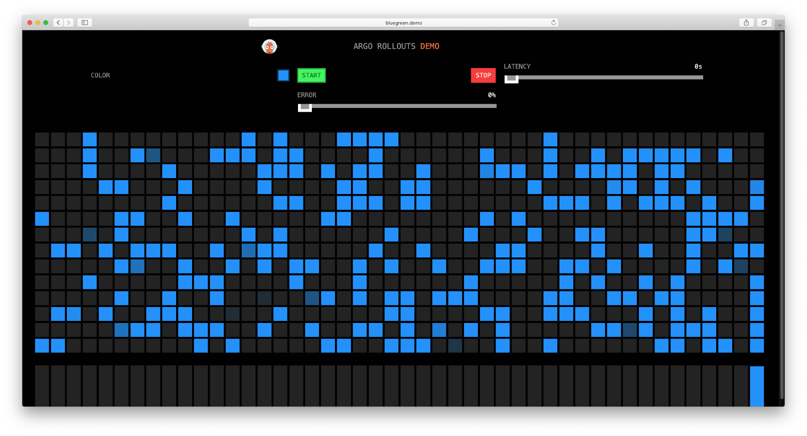
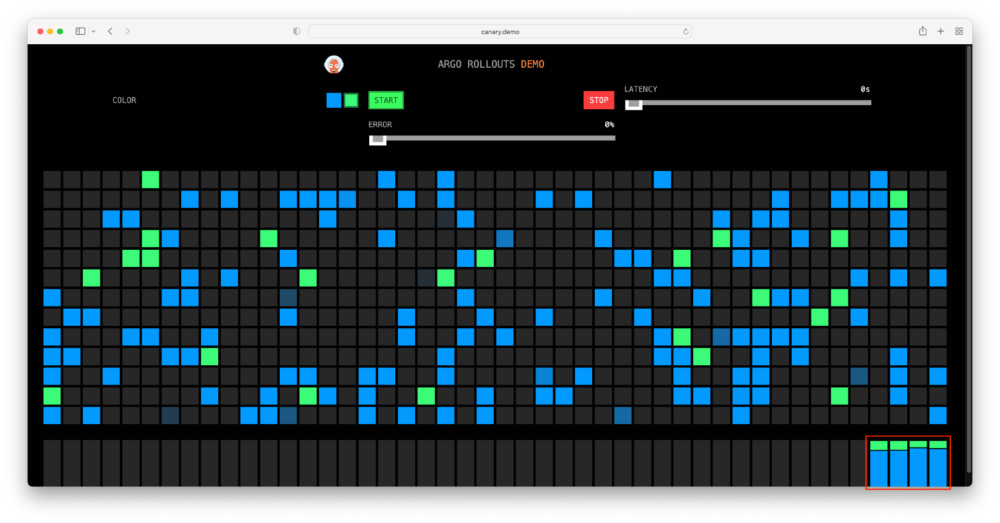
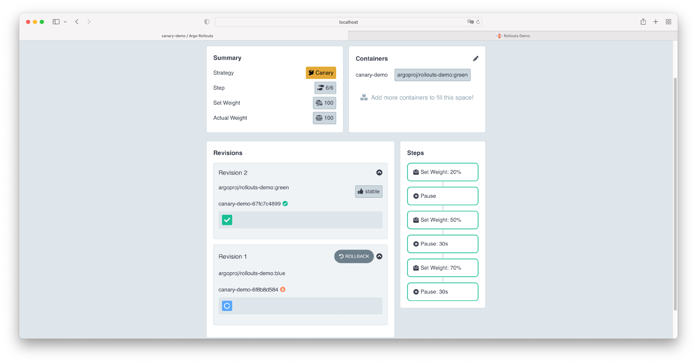
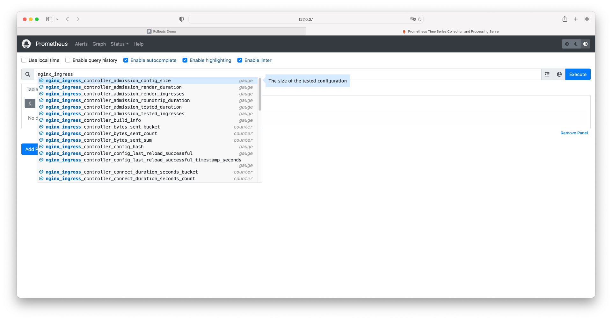
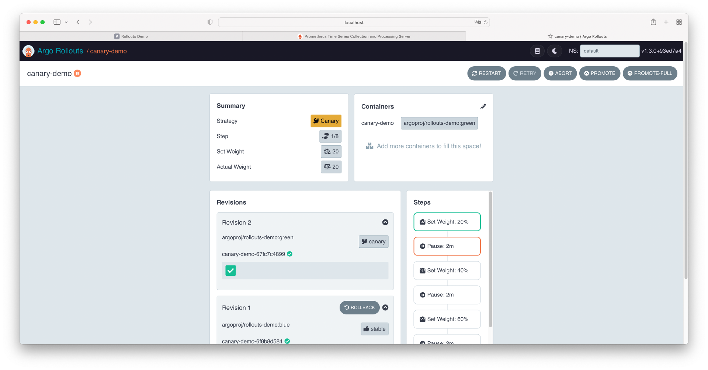
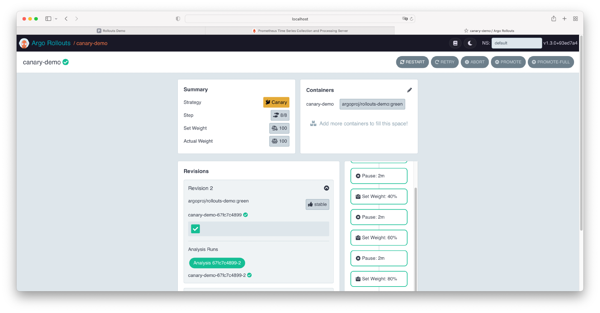
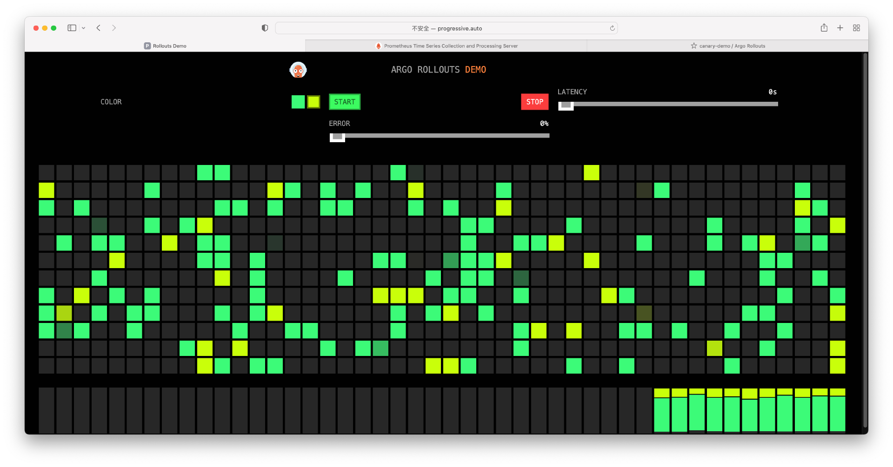
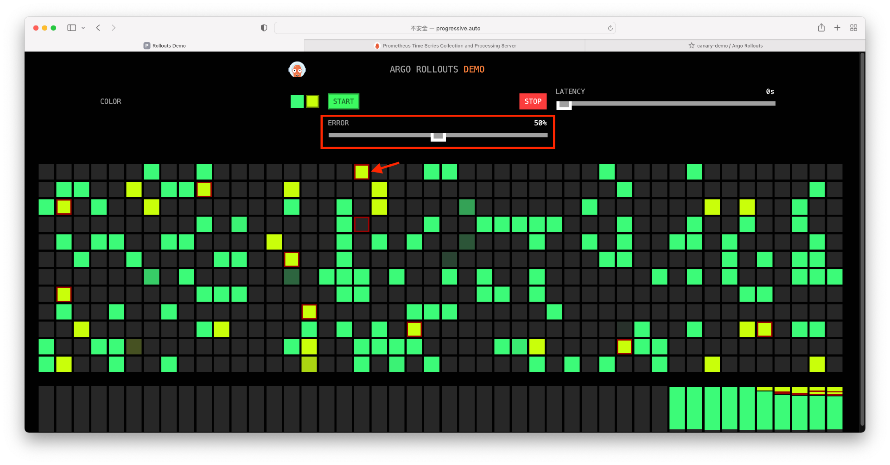
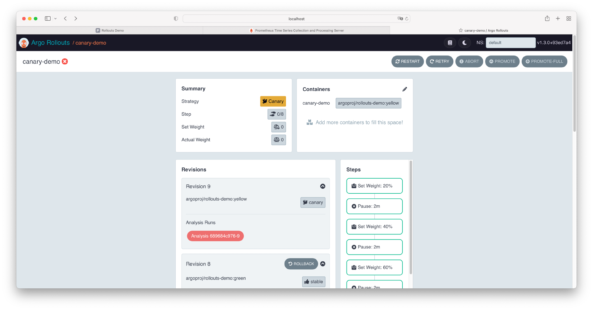
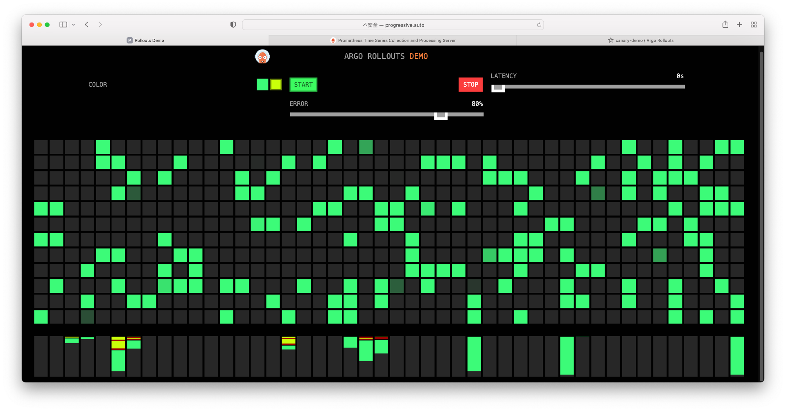

# 应用程序容器化


## 构建容器镜像


### 创建映像

创建实验目录

```bash
mkdir lab
cd lab
```


创建业务代码文件
```bash
nano app.py
```


```python
from flask import Flask
import os
app = Flask(__name__)
app.run(debug=True)

@app.route('/')
def hello_world():
    return 'Hello, my first docker images! ' + os.getenv("HOSTNAME") + ''
```

这是一个简单的 Python 程序，使用 Flask Web 框架创建一个基本的 Web 服务器。下面是对代码的解释：

1. `from flask import Flask`: 这一行导入了 Flask 类，这是使用 Flask 框架创建 Web 应用的基本类。
2. `import os`: 这一行导入了 Python 的内置 os 模块，它提供了一个与操作系统交互的接口。
3. `app = Flask(__name__)`: 这一行创建了一个 Flask 应用实例。`__name__` 参数通常用于确定应用的根路径。
4. `app.run(debug=True)`: 这一行运行了 Flask 应用，`debug=True` 表示应用将以调试模式运行。在调试模式下，应用会自动重新加载，如果发生错误，会显示详细的错误信息。
5. `@app.route('/')`: 这是一个装饰器，它告诉 Flask 应用，当用户访问根路径（即'/'）时，应该调用下面的函数。
6. `def hello_world():`: 定义了一个名为 `hello_world` 的函数。这个函数将在用户访问根路径时被调用。
7. `return 'Hello, my first docker images! ' + os.getenv("HOSTNAME") + ''`: 这一行返回了一个字符串，其中包含 "Hello, my first docker images!" 以及从环境变量中获取的 "HOSTNAME" 的值。当用户访问根路径时，他们将看到这个字符串。

总之，这是一个简单的 Flask Web 应用，它在根路径上提供了一个简单的响应，包括一条欢迎消息和从环境变量中获取的 "HOSTNAME" 的值。当这个应用被放入 Docker 容器中运行时，"HOSTNAME" 将是容器的 ID。

创建 Python 的依赖文件
```bash
echo "Flask==2.2.2" >> requirements.txt
```


创建 Dockerfile
```bash
nano Dockerfile
```


```Dockerfile
# syntax=docker/dockerfile:1

FROM python:3.8-slim-buster
RUN apt-get update && apt-get install -y procps vim apache2-utils && rm -rf /var/lib/apt/lists/*
WORKDIR /app
COPY requirements.txt requirements.txt
RUN pip3 install -r requirements.txt
COPY . .
CMD [ "python3", "-m" , "flask", "run", "--host=0.0.0.0"]
```

以下是对每一行的解释：

1. `# syntax=docker/dockerfile:1`: 这是一个注释，指定 Dockerfile 使用的语法版本。这里的版本是 1。
2. `FROM python:3.8-slim-buster`: 从名为 `python:3.8-slim-buster` 的基础镜像开始构建新的 Docker 镜像。这个镜像基于 Debian Buster，并包含了预安装的 Python 3.8 和一些最小化工具。
3. `RUN apt-get update && apt-get install -y procps vim apache2-utils && rm -rf /var/lib/apt/lists/*`: 这个 RUN 指令执行了一系列命令，用于更新包列表、安装一些额外的软件包（如 procps、vim 和 apache2-utils）以及清理缓存文件。这些软件包在新的镜像中将可用。
4. `WORKDIR /app`: 设置工作目录为 `/app`。接下来的指令（如 COPY 和 RUN）将在这个目录下执行。
5. `COPY requirements.txt requirements.txt`: 将当前构建上下文中的 `requirements.txt` 文件复制到镜像的工作目录中。这个文件包含了应用所需的 Python 包列表。
6. `RUN pip3 install -r requirements.txt`: 安装 `requirements.txt` 文件中列出的 Python 包。这些包将包含在新的镜像中，供应用程序使用。
7. `COPY . .`: 将当前构建上下文中的所有文件和目录复制到镜像的工作目录中。这通常包括应用程序的源代码。
8. `CMD [ "python3", "-m" , "flask", "run", "--host=0.0.0.0"]`: 设置容器的默认命令。当容器启动时，这个命令将被执行。这里的命令启动了 Flask 应用，并使用 `--host=0.0.0.0` 参数允许外部访问。


构建映像
```bash
root@node1:~/lab# dir
app.py  Dockerfile  requirements.txt
```


```bash
docker build -t hello-world-flask .
```


```bash
ubuntu $ docker build -t hello-world-flask .
Sending build context to Docker daemon  4.096kB
Step 1/7 : FROM python:3.8-slim-buster
3.8-slim-buster: Pulling from library/python
0cf508b37688: Pull complete 
73f2d4ecfb17: Pull complete 
4ccbacf6c31d: Pull complete 
80e5be4781de: Pull complete 
6c0c9359aa08: Pull complete 
Digest: sha256:ae7186c947f47090f450f1a438ddcffbd7463cbf14484c2e7869a9c05d900287
Status: Downloaded newer image for python:3.8-slim-buster
 ---> a87430669f7e
Step 2/7 : RUN apt-get update && apt-get install -y procps vim apache2-utils && rm -rf /var/lib/apt/lists/*
 ---> Running in c05d056667b1
Get:1 http://deb.debian.org/debian buster InRelease [122 kB]
Get:2 http://deb.debian.org/debian-security buster/updates InRelease [34.8 kB]
Get:3 http://deb.debian.org/debian buster-updates InRelease [56.6 kB]
Get:4 http://deb.debian.org/debian buster/main amd64 Packages [7909 kB]
Get:5 http://deb.debian.org/debian-security buster/updates/main amd64 Packages [430 kB]
Get:6 http://deb.debian.org/debian buster-updates/main amd64 Packages [8788 B]
Fetched 8561 kB in 2s (4455 kB/s)
Reading package lists...
Reading package lists...
Building dependency tree...
Reading state information...
The following additional packages will be installed:
  libapr1 libaprutil1 libgpm2 libncurses6 libprocps7 lsb-base psmisc
  vim-common vim-runtime xxd
Suggested packages:
  gpm ctags vim-doc vim-scripts
The following NEW packages will be installed:
  apache2-utils libapr1 libaprutil1 libgpm2 libncurses6 libprocps7 lsb-base
  procps psmisc vim vim-common vim-runtime xxd
0 upgraded, 13 newly installed, 0 to remove and 0 not upgraded.
Need to get 8440 kB of archives.
After this operation, 36.8 MB of additional disk space will be used.
Get:1 http://deb.debian.org/debian-security buster/updates/main amd64 libncurses6 amd64 6.1+20181013-2+deb10u3 [102 kB]
Get:2 http://deb.debian.org/debian buster/main amd64 libprocps7 amd64 2:3.3.15-2 [61.7 kB]
Get:3 http://deb.debian.org/debian buster/main amd64 lsb-base all 10.2019051400 [28.4 kB]
Get:4 http://deb.debian.org/debian buster/main amd64 procps amd64 2:3.3.15-2 [259 kB]
Get:5 http://deb.debian.org/debian-security buster/updates/main amd64 xxd amd64 2:8.1.0875-5+deb10u4 [141 kB]
Get:6 http://deb.debian.org/debian-security buster/updates/main amd64 vim-common all 2:8.1.0875-5+deb10u4 [196 kB]
Get:7 http://deb.debian.org/debian buster/main amd64 libapr1 amd64 1.6.5-1+b1 [102 kB]
Get:8 http://deb.debian.org/debian buster/main amd64 libaprutil1 amd64 1.6.1-4 [91.8 kB]
Get:9 http://deb.debian.org/debian buster/main amd64 apache2-utils amd64 2.4.38-3+deb10u8 [238 kB]
Get:10 http://deb.debian.org/debian buster/main amd64 libgpm2 amd64 1.20.7-5 [35.1 kB]
Get:11 http://deb.debian.org/debian buster/main amd64 psmisc amd64 23.2-1+deb10u1 [126 kB]
Get:12 http://deb.debian.org/debian-security buster/updates/main amd64 vim-runtime all 2:8.1.0875-5+deb10u4 [5777 kB]
Get:13 http://deb.debian.org/debian-security buster/updates/main amd64 vim amd64 2:8.1.0875-5+deb10u4 [1283 kB]
debconf: delaying package configuration, since apt-utils is not installed
Fetched 8440 kB in 0s (43.4 MB/s)
Selecting previously unselected package libncurses6:amd64.
(Reading database ... 6840 files and directories currently installed.)
Preparing to unpack .../00-libncurses6_6.1+20181013-2+deb10u3_amd64.deb ...
Unpacking libncurses6:amd64 (6.1+20181013-2+deb10u3) ...
Selecting previously unselected package libprocps7:amd64.
Preparing to unpack .../01-libprocps7_2%3a3.3.15-2_amd64.deb ...
Unpacking libprocps7:amd64 (2:3.3.15-2) ...
Selecting previously unselected package lsb-base.
Preparing to unpack .../02-lsb-base_10.2019051400_all.deb ...
Unpacking lsb-base (10.2019051400) ...
Selecting previously unselected package procps.
Preparing to unpack .../03-procps_2%3a3.3.15-2_amd64.deb ...
Unpacking procps (2:3.3.15-2) ...
Selecting previously unselected package xxd.
Preparing to unpack .../04-xxd_2%3a8.1.0875-5+deb10u4_amd64.deb ...
Unpacking xxd (2:8.1.0875-5+deb10u4) ...
Selecting previously unselected package vim-common.
Preparing to unpack .../05-vim-common_2%3a8.1.0875-5+deb10u4_all.deb ...
Unpacking vim-common (2:8.1.0875-5+deb10u4) ...
Selecting previously unselected package libapr1:amd64.
Preparing to unpack .../06-libapr1_1.6.5-1+b1_amd64.deb ...
Unpacking libapr1:amd64 (1.6.5-1+b1) ...
Selecting previously unselected package libaprutil1:amd64.
Preparing to unpack .../07-libaprutil1_1.6.1-4_amd64.deb ...
Unpacking libaprutil1:amd64 (1.6.1-4) ...
Selecting previously unselected package apache2-utils.
Preparing to unpack .../08-apache2-utils_2.4.38-3+deb10u8_amd64.deb ...
Unpacking apache2-utils (2.4.38-3+deb10u8) ...
Selecting previously unselected package libgpm2:amd64.
Preparing to unpack .../09-libgpm2_1.20.7-5_amd64.deb ...
Unpacking libgpm2:amd64 (1.20.7-5) ...
Selecting previously unselected package psmisc.
Preparing to unpack .../10-psmisc_23.2-1+deb10u1_amd64.deb ...
Unpacking psmisc (23.2-1+deb10u1) ...
Selecting previously unselected package vim-runtime.
Preparing to unpack .../11-vim-runtime_2%3a8.1.0875-5+deb10u4_all.deb ...
Adding 'diversion of /usr/share/vim/vim81/doc/help.txt to /usr/share/vim/vim81/doc/help.txt.vim-tiny by vim-runtime'
Adding 'diversion of /usr/share/vim/vim81/doc/tags to /usr/share/vim/vim81/doc/tags.vim-tiny by vim-runtime'
Unpacking vim-runtime (2:8.1.0875-5+deb10u4) ...
Selecting previously unselected package vim.
Preparing to unpack .../12-vim_2%3a8.1.0875-5+deb10u4_amd64.deb ...
Unpacking vim (2:8.1.0875-5+deb10u4) ...
Setting up lsb-base (10.2019051400) ...
Setting up libgpm2:amd64 (1.20.7-5) ...
Setting up psmisc (23.2-1+deb10u1) ...
Setting up libprocps7:amd64 (2:3.3.15-2) ...
Setting up libapr1:amd64 (1.6.5-1+b1) ...
Setting up xxd (2:8.1.0875-5+deb10u4) ...
Setting up vim-common (2:8.1.0875-5+deb10u4) ...
Setting up libncurses6:amd64 (6.1+20181013-2+deb10u3) ...
Setting up procps (2:3.3.15-2) ...
update-alternatives: using /usr/bin/w.procps to provide /usr/bin/w (w) in auto mode
update-alternatives: warning: skip creation of /usr/share/man/man1/w.1.gz because associated file /usr/share/man/man1/w.procps.1.gz (of link group w) doesn't exist
Setting up vim-runtime (2:8.1.0875-5+deb10u4) ...
Setting up libaprutil1:amd64 (1.6.1-4) ...
Setting up vim (2:8.1.0875-5+deb10u4) ...
update-alternatives: using /usr/bin/vim.basic to provide /usr/bin/vim (vim) in auto mode
update-alternatives: using /usr/bin/vim.basic to provide /usr/bin/vimdiff (vimdiff) in auto mode
update-alternatives: using /usr/bin/vim.basic to provide /usr/bin/rvim (rvim) in auto mode
update-alternatives: using /usr/bin/vim.basic to provide /usr/bin/rview (rview) in auto mode
update-alternatives: using /usr/bin/vim.basic to provide /usr/bin/vi (vi) in auto mode
update-alternatives: warning: skip creation of /usr/share/man/da/man1/vi.1.gz because associated file /usr/share/man/da/man1/vim.1.gz (of link group vi) doesn't exist
update-alternatives: warning: skip creation of /usr/share/man/de/man1/vi.1.gz because associated file /usr/share/man/de/man1/vim.1.gz (of link group vi) doesn't exist
update-alternatives: warning: skip creation of /usr/share/man/fr/man1/vi.1.gz because associated file /usr/share/man/fr/man1/vim.1.gz (of link group vi) doesn't exist
update-alternatives: warning: skip creation of /usr/share/man/it/man1/vi.1.gz because associated file /usr/share/man/it/man1/vim.1.gz (of link group vi) doesn't exist
update-alternatives: warning: skip creation of /usr/share/man/ja/man1/vi.1.gz because associated file /usr/share/man/ja/man1/vim.1.gz (of link group vi) doesn't exist
update-alternatives: warning: skip creation of /usr/share/man/pl/man1/vi.1.gz because associated file /usr/share/man/pl/man1/vim.1.gz (of link group vi) doesn't exist
update-alternatives: warning: skip creation of /usr/share/man/ru/man1/vi.1.gz because associated file /usr/share/man/ru/man1/vim.1.gz (of link group vi) doesn't exist
update-alternatives: warning: skip creation of /usr/share/man/man1/vi.1.gz because associated file /usr/share/man/man1/vim.1.gz (of link group vi) doesn't exist
update-alternatives: using /usr/bin/vim.basic to provide /usr/bin/view (view) in auto mode
update-alternatives: warning: skip creation of /usr/share/man/da/man1/view.1.gz because associated file /usr/share/man/da/man1/vim.1.gz (of link group view) doesn't exist
update-alternatives: warning: skip creation of /usr/share/man/de/man1/view.1.gz because associated file /usr/share/man/de/man1/vim.1.gz (of link group view) doesn't exist
update-alternatives: warning: skip creation of /usr/share/man/fr/man1/view.1.gz because associated file /usr/share/man/fr/man1/vim.1.gz (of link group view) doesn't exist
update-alternatives: warning: skip creation of /usr/share/man/it/man1/view.1.gz because associated file /usr/share/man/it/man1/vim.1.gz (of link group view) doesn't exist
update-alternatives: warning: skip creation of /usr/share/man/ja/man1/view.1.gz because associated file /usr/share/man/ja/man1/vim.1.gz (of link group view) doesn't exist
update-alternatives: warning: skip creation of /usr/share/man/pl/man1/view.1.gz because associated file /usr/share/man/pl/man1/vim.1.gz (of link group view) doesn't exist
update-alternatives: warning: skip creation of /usr/share/man/ru/man1/view.1.gz because associated file /usr/share/man/ru/man1/vim.1.gz (of link group view) doesn't exist
update-alternatives: warning: skip creation of /usr/share/man/man1/view.1.gz because associated file /usr/share/man/man1/vim.1.gz (of link group view) doesn't exist
update-alternatives: using /usr/bin/vim.basic to provide /usr/bin/ex (ex) in auto mode
update-alternatives: warning: skip creation of /usr/share/man/da/man1/ex.1.gz because associated file /usr/share/man/da/man1/vim.1.gz (of link group ex) doesn't exist
update-alternatives: warning: skip creation of /usr/share/man/de/man1/ex.1.gz because associated file /usr/share/man/de/man1/vim.1.gz (of link group ex) doesn't exist
update-alternatives: warning: skip creation of /usr/share/man/fr/man1/ex.1.gz because associated file /usr/share/man/fr/man1/vim.1.gz (of link group ex) doesn't exist
update-alternatives: warning: skip creation of /usr/share/man/it/man1/ex.1.gz because associated file /usr/share/man/it/man1/vim.1.gz (of link group ex) doesn't exist
update-alternatives: warning: skip creation of /usr/share/man/ja/man1/ex.1.gz because associated file /usr/share/man/ja/man1/vim.1.gz (of link group ex) doesn't exist
update-alternatives: warning: skip creation of /usr/share/man/pl/man1/ex.1.gz because associated file /usr/share/man/pl/man1/vim.1.gz (of link group ex) doesn't exist
update-alternatives: warning: skip creation of /usr/share/man/ru/man1/ex.1.gz because associated file /usr/share/man/ru/man1/vim.1.gz (of link group ex) doesn't exist
update-alternatives: warning: skip creation of /usr/share/man/man1/ex.1.gz because associated file /usr/share/man/man1/vim.1.gz (of link group ex) doesn't exist
update-alternatives: using /usr/bin/vim.basic to provide /usr/bin/editor (editor) in auto mode
update-alternatives: warning: skip creation of /usr/share/man/da/man1/editor.1.gz because associated file /usr/share/man/da/man1/vim.1.gz (of link group editor) doesn't exist
update-alternatives: warning: skip creation of /usr/share/man/de/man1/editor.1.gz because associated file /usr/share/man/de/man1/vim.1.gz (of link group editor) doesn't exist
update-alternatives: warning: skip creation of /usr/share/man/fr/man1/editor.1.gz because associated file /usr/share/man/fr/man1/vim.1.gz (of link group editor) doesn't exist
update-alternatives: warning: skip creation of /usr/share/man/it/man1/editor.1.gz because associated file /usr/share/man/it/man1/vim.1.gz (of link group editor) doesn't exist
update-alternatives: warning: skip creation of /usr/share/man/ja/man1/editor.1.gz because associated file /usr/share/man/ja/man1/vim.1.gz (of link group editor) doesn't exist
update-alternatives: warning: skip creation of /usr/share/man/pl/man1/editor.1.gz because associated file /usr/share/man/pl/man1/vim.1.gz (of link group editor) doesn't exist
update-alternatives: warning: skip creation of /usr/share/man/ru/man1/editor.1.gz because associated file /usr/share/man/ru/man1/vim.1.gz (of link group editor) doesn't exist
update-alternatives: warning: skip creation of /usr/share/man/man1/editor.1.gz because associated file /usr/share/man/man1/vim.1.gz (of link group editor) doesn't exist
Setting up apache2-utils (2.4.38-3+deb10u8) ...
Processing triggers for libc-bin (2.28-10+deb10u2) ...
Removing intermediate container c05d056667b1
 ---> b2a6689fa116
Step 3/7 : WORKDIR /app
 ---> Running in 499135e21439
Removing intermediate container 499135e21439
 ---> 7987d82bbc69
Step 4/7 : COPY requirements.txt requirements.txt
 ---> 721a296631ce
Step 5/7 : RUN pip3 install -r requirements.txt
 ---> Running in a123f4161d0b
Collecting Flask==2.2.2
  Downloading Flask-2.2.2-py3-none-any.whl (101 kB)
     ━━━━━━━━━━━━━━━━━━━━━━━━━━━━━━━━━━━━━━ 101.5/101.5 KB 19.4 MB/s eta 0:00:00
Collecting itsdangerous>=2.0
  Downloading itsdangerous-2.1.2-py3-none-any.whl (15 kB)
Collecting Jinja2>=3.0
  Downloading Jinja2-3.1.2-py3-none-any.whl (133 kB)
     ━━━━━━━━━━━━━━━━━━━━━━━━━━━━━━━━━━━━━━ 133.1/133.1 KB 28.6 MB/s eta 0:00:00
Collecting click>=8.0
  Downloading click-8.1.3-py3-none-any.whl (96 kB)
     ━━━━━━━━━━━━━━━━━━━━━━━━━━━━━━━━━━━━━━━━ 96.6/96.6 KB 24.0 MB/s eta 0:00:00
Collecting Werkzeug>=2.2.2
  Downloading Werkzeug-2.2.2-py3-none-any.whl (232 kB)
     ━━━━━━━━━━━━━━━━━━━━━━━━━━━━━━━━━━━━━━ 232.7/232.7 KB 47.7 MB/s eta 0:00:00
Collecting importlib-metadata>=3.6.0
  Downloading importlib_metadata-6.0.0-py3-none-any.whl (21 kB)
Collecting zipp>=0.5
  Downloading zipp-3.12.1-py3-none-any.whl (6.7 kB)
Collecting MarkupSafe>=2.0
  Downloading MarkupSafe-2.1.2-cp38-cp38-manylinux_2_17_x86_64.manylinux2014_x86_64.whl (25 kB)
Installing collected packages: zipp, MarkupSafe, itsdangerous, click, Werkzeug, Jinja2, importlib-metadata, Flask
Successfully installed Flask-2.2.2 Jinja2-3.1.2 MarkupSafe-2.1.2 Werkzeug-2.2.2 click-8.1.3 importlib-metadata-6.0.0 itsdangerous-2.1.2 zipp-3.12.1
WARNING: Running pip as the 'root' user can result in broken permissions and conflicting behaviour with the system package manager. It is recommended to use a virtual environment instead: https://pip.pypa.io/warnings/venv
WARNING: You are using pip version 22.0.4; however, version 23.0 is available.
You should consider upgrading via the '/usr/local/bin/python -m pip install --upgrade pip' command.
Removing intermediate container a123f4161d0b
 ---> 3ed09b84becf
Step 6/7 : COPY . .
 ---> 32878c7a40db
Step 7/7 : CMD [ "python3", "-m" , "flask", "run", "--host=0.0.0.0"]
 ---> Running in 9d963abc96ec
Removing intermediate container 9d963abc96ec
 ---> 56f87d5a4218
Successfully built 56f87d5a4218
Successfully tagged hello-world-flask:latest```


```bash
root@node1:~/lab# docker images
REPOSITORY                                                                    TAG               IMAGE ID       CREATED         SIZE
hello-world-flask                                                             latest            58ae2a9411fc   4 minutes ago   161MB

```

查看映像
```bash
docker iamges
```

```bash
ubuntu $ docker images
REPOSITORY          TAG               IMAGE ID       CREATED              SIZE
hello-world-flask   latest            56f87d5a4218   About a minute ago   163MB
python              3.8-slim-buster   a87430669f7e   38 hours ago         116MB
```


运行容器，并查看容器页面
```bash
docker run -d -p 8000:5000 hello-world-flask:latest

docker ps 

curl localhost:8000
```


```bash
$ docker run -d -p 8000:5000 hello-world-flask:latest
50f36bc7e03e925030d81677a0848be2b02d97eb9a71129de3813e03fa4879a7
ubuntu $ docker ps    
CONTAINER ID   IMAGE                      COMMAND                  CREATED         STATUS         PORTS                                       NAMES
50f36bc7e03e   hello-world-flask:latest   "python3 -m flask ru…"   8 seconds ago   Up 7 seconds   0.0.0.0:8000->5000/tcp, :::8000->5000/tcp   friendly_carver
ubuntu $ curl localhost:8000
Hello, my first docker images! 50f36bc7e03eubuntu $ 
```

这里总结了将业务代码构建为容器镜像的基本步骤：

1. 使用 `FROM` 命令指定一个已经安装了特定编程语言编译工具的基础镜像。在官方镜像仓库中可以找到所需的任何基础镜像。例如，对于 Java，可以使用 `eclipse-temurin:17-jdk-jammy`；对于 Golang，可以使用 `golang:1.16-alpine`。
2. 使用 `WORKDIR` 命令配置镜像的工作目录，如 `WORKDIR /app`。
3. 使用 `COPY` 命令将本地目录的源码复制到镜像的工作目录下，例如 `COPY .`。
4. 使用 `RUN` 命令下载业务依赖，例如 `pip3 install`。如果是静态语言，则需要进一步编译源码生成可执行文件。
5. 最后，使用 `CMD` 命令配置镜像的启动命令，即启动业务代码。


---


### 上传映像到 hub.docker.com


登录到容器映像库
```bash
docker login
```

给本地映像打标签

```bash
docker tag hello-world-flask chengzh/hello-world-flask
```

推送映像

```bash
docker push chengzh/hello-world-flask
```


```bash
ubuntu $ docker login
Login with your Docker ID to push and pull images from Docker Hub. If you don't have a Docker ID, head over to https://hub.docker.com to create one.
Username: chengzh
Password: 
WARNING! Your password will be stored unencrypted in /root/.docker/config.json.
Configure a credential helper to remove this warning. See
https://docs.docker.com/engine/reference/commandline/login/#credentials-store

Login Succeeded
ubuntu $ docker tag hello-world-flask chengzh/hello-world-flask
ubuntu $ docker images
REPOSITORY                  TAG               IMAGE ID       CREATED         SIZE
chengzh/hello-world-flask   latest            56f87d5a4218   7 minutes ago   163MB
hello-world-flask           latest            56f87d5a4218   7 minutes ago   163MB
python                      3.8-slim-buster   a87430669f7e   38 hours ago    116MB
ubuntu $ docker push chengzh/hello-world-flask
Using default tag: latest
The push refers to repository [docker.io/chengzh/hello-world-flask]
101fce4be7c9: Pushed 
e3cd84948409: Pushed 
728fc464d546: Pushed 
042c8a4e5706: Pushed 
1176f885248c: Pushed 
3dc8c69b841e: Mounted from library/python 
e85196541518: Mounted from library/python 
326bef06dac1: Mounted from library/python 
748ccc4fc823: Mounted from library/python 
60333954a7a8: Mounted from library/python 
latest: digest: sha256:6cd2283913db39d4d45620d073443c4c3a2cc91b25118f4236f205556bc84044 size: 2414

```


---


### 在另外一台 docker 宿主机上测试


下载映像
```bash
docker pull chengzh/hello-world-flask:latest
```

查看映像
```bash
docker images
```

```bash
ubuntu $ docker images
REPOSITORY                  TAG       IMAGE ID       CREATED          SIZE
chengzh/hello-world-flask   latest    56f87d5a4218   13 minutes ago   163MB
```

启动容器
```bash
docker run -d -p 8000:5000 chengzh/hello-world-flask:latest
```

查看容器
```bash
docker ps
```


```bash
ubuntu $ docker ps
CONTAINER ID   IMAGE                              COMMAND                  CREATED         STATUS         PORTS                                       NAMES
12dbcd7f0621   chengzh/hello-world-flask:latest   "python3 -m flask ru…"   2 minutes ago   Up 2 minutes   0.0.0.0:8000->5000/tcp, :::8000->5000/tcp   bold_lumiere
```

访问宿主机8000端口

```bash
curl localhost:8000
```

```text
Hello, my first docker images! 12dbcd7f0621
```


和容器进行交互
```bash
 docker exec -it 12dbcd7f0621 bash
```


```bash
ubuntu $  docker exec -it 12dbcd7f0621 bash
root@12dbcd7f0621:/app# ls
Dockerfile  __pycache__  app.py  requirements.txt
root@12dbcd7f0621:/app# 
```


## 为不同语言构建镜像


### Java 应用容器化 启动 Jar 包的构建方式

```bash
git clone https://github.com/cloudzun/gitops
```


```bash
cd gitops/docker/13/spring-boot
ls -al
```


```bash
root@node1:~# cd gitops/docker/13/spring-boot
root@node1:~/gitops/docker/13/spring-boot# ls -al
total 56
drwxr-xr-x 4 root root  4096 Feb 11 12:42 .
drwxr-xr-x 7 root root  4096 Feb 11 12:42 ..
-rw-r--r-- 1 root root   367 Feb 11 12:42 Dockerfile
-rw-r--r-- 1 root root   196 Feb 11 12:42 Dockerfile-Boot
-rw-r--r-- 1 root root     6 Feb 11 12:42 .dockerignore
-rw-r--r-- 1 root root   395 Feb 11 12:42 .gitignore
drwxr-xr-x 3 root root  4096 Feb 11 12:42 .mvn
-rwxr-xr-x 1 root root 10284 Feb 11 12:42 mvnw
-rw-r--r-- 1 root root  6734 Feb 11 12:42 mvnw.cmd
-rw-r--r-- 1 root root  1226 Feb 11 12:42 pom.xml
drwxr-xr-x 4 root root  4096 Feb 11 12:42 src
```


```bash
 nano src/main/java/com/example/demo/DemoApplication.java
```


```java
package com.example.demo;
import org.springframework.boot.SpringApplication;
import org.springframework.boot.autoconfigure.SpringBootApplication;
import org.springframework.web.bind.annotation.GetMapping;
import org.springframework.web.bind.annotation.RequestParam;
import org.springframework.web.bind.annotation.RestController;

@SpringBootApplication
@RestController
public class DemoApplication {
        public static void main(String[] args) {
                SpringApplication.run(DemoApplication.class, args);
        }

        @GetMapping("/hello")
        public String hello(@RequestParam(value = "name", defaultValue = "World") String name) {
                return String.format("Hello %s!", name);
        }
}

```
内容是 Demo 应用的主体文件，它包含一个 /hello 接口，使用 Get 请求访问后会返回 “Hello World”。


```bash
nano Dockerfile
```

```Dockerfile
# syntax=docker/dockerfile:1

FROM eclipse-temurin:17-jdk-jammy as builder
WORKDIR /opt/app
COPY .mvn/ .mvn
COPY mvnw pom.xml ./
RUN ./mvnw dependency:go-offline
COPY ./src ./src
RUN ./mvnw clean install


FROM eclipse-temurin:17-jre-jammy
WORKDIR /opt/app
EXPOSE 8080
COPY --from=builder /opt/app/target/*.jar /opt/app/*.jar
CMD ["java", "-jar", "/opt/app/*.jar" ]
```

这是一个 Dockerfile，用于构建一个基于 Maven 构建的 Java Web 应用的容器镜像。以下是对每条指令的解释：

1. `FROM eclipse-temurin:17-jdk-jammy as builder`：从官方的 Eclipse Temurin 镜像中拉取一个标记为 17-jdk-jammy 的版本，并将其命名为 builder。

2. `WORKDIR /opt/app`：在容器内设置工作目录为 /opt/app。

3. `COPY .mvn/ .mvn`：将本地目录下的 .mvn 文件夹复制到容器内的 .mvn 文件夹。

4. `COPY mvnw pom.xml ./`：将本地目录下的 mvnw 和 pom.xml 文件复制到容器内的当前工作目录。

5. `RUN ./mvnw dependency:go-offline`：在容器内运行 `./mvnw dependency:go-offline` 命令，下载应用所需的依赖包并缓存到本地。

6. `COPY ./src ./src`：将本地目录下的 ./src 文件夹复制到容器内的 ./src 文件夹。

7. `RUN ./mvnw clean install`：在容器内运行 `./mvnw clean install` 命令，使用 Maven 构建应用并打包成 jar。

8. `FROM eclipse-temurin:17-jre-jammy`：从官方的 Eclipse Temurin 镜像中拉取一个标记为 17-jre-jammy 的版本。

9. `WORKDIR /opt/app`：在容器内设置工作目录为 /opt/app。

10. `EXPOSE 8080`：声明镜像运行时监听的端口号为 8080。

11. `COPY --from=builder /opt/app/target/*.jar /opt/app/*.jar`：从之前命名为 builder 的容器中，将构建好的 jar 文件复制到当前容器的 /opt/app 目录下。

12. `CMD ["java", "-jar", "/opt/app/*.jar" ]`：设置容器启动时执行的默认命令，即运行 /opt/app 目录下的所有 jar 文件。

```bash
docker build -t spring-boot .
```


```bash
docker run --publish 8080:8080 spring-boot
```


```bash
curl localhost:8080/hello
```


```bash
root@node1:~# curl localhost:8080/hello
Hello World!root@node1:~#
```


### Spring Boot 插件的构建方式

```bash
nano Dockerfile-Boot
```


```Dockerfile
# syntax=docker/dockerfile:1

FROM eclipse-temurin:17-jdk-jammy

WORKDIR /app

COPY .mvn/ .mvn
COPY mvnw pom.xml ./
RUN ./mvnw dependency:resolve

COPY src ./src

CMD ["./mvnw", "spring-boot:run"]
```


这是一个 Dockerfile，用于构建一个基于 Maven 构建的 Java Web 应用的容器镜像。以下是对每条指令的解释：

1. `FROM eclipse-temurin:17-jdk-jammy`：从官方的 Eclipse Temurin 镜像中拉取一个标记为 17-jdk-jammy 的版本。

2. `WORKDIR /app`：在容器内设置工作目录为 /app。

3. `COPY .mvn/ .mvn`：将本地目录下的 .mvn 文件夹复制到容器内的 .mvn 文件夹。

4. `COPY mvnw pom.xml ./`：将本地目录下的 mvnw 和 pom.xml 文件复制到容器内的当前工作目录。

5. `RUN ./mvnw dependency:resolve`：在容器内运行 `./mvnw dependency:resolve` 命令，下载应用所需的依赖包并缓存到本地。

6. `COPY src ./src`：将本地目录下的 ./src 文件夹复制到容器内的 ./src 文件夹。

7. `CMD ["./mvnw", "spring-boot:run"]`：设置容器启动时执行的默认命令，即使用 Maven 启动 Spring Boot 应用。


```bash
docker build -t spring-boot . -f Dockerfile-Boot
```


```bash
docker run --publish 8080:8080 spring-boot
```


```bash
root@node1:~# curl localhost:8080/hello
Hello World!root@node1:~#
```


```bash
docker images
```


```bash
root@node1:~/gitops/docker/13/spring-boot# docker images
REPOSITORY                       TAG            IMAGE ID       CREATED          SIZE
spring-boot                      latest         a61a851ebb1e   17 seconds ago   525MB
<none>                           <none>         bf0a8dd08bed   24 minutes ago   284MB
```


### Golang 应用容器化

```bash
root@node1:~/gitops/docker/13/golang# dir
Dockerfile    Dockerfile-2  Dockerfile-4  Dockerfile-6  example  go.sum
Dockerfile-1  Dockerfile-3  Dockerfile-5  Dockerfile-7  go.mod   main.go
```


```bash
nano main.go
```

```go
package main

import (
        "net/http"
        "github.com/labstack/echo/v4"
)

func main() {
        e := echo.New()
        e.GET("/hello", func(c echo.Context) error {
                return c.String(http.StatusOK, "Hello World Golang")
        })
        e.Logger.Fatal(e.Start(":8080"))
}
```

```bash
nano Dockerfile
```


```Dockerfile
# syntax=docker/dockerfile:1
FROM golang:1.17 as builder

WORKDIR /opt/app
COPY go.* ./
RUN go mod download

COPY . .

ARG LD_FLAGS='-linkmode external -w -extldflags "-static"'
RUN go build -ldflags "$LD_FLAGS" -o example

FROM alpine as runner
WORKDIR /opt/app
COPY --from=builder /opt/app/example /opt/app/example

EXPOSE 8080
CMD ["/opt/app/example"]
```


这是一个 Dockerfile，用于构建一个 Go Web 应用的容器镜像。以下是对每条指令的解释：

1. `FROM golang:1.17 as builder`：从官方的 Golang 镜像中拉取一个标记为 1.17 的版本，并将其命名为 builder。

2. `WORKDIR /opt/app`：在容器内设置工作目录为 /opt/app。

3. `COPY go.* ./`：将本地目录下的 go.mod 和 go.sum 文件复制到容器内的当前工作目录。

4. `RUN go mod download`：在容器内运行 `go mod download` 命令，安装应用所需的依赖包。

5. `COPY . .`：将当前目录下的所有文件和文件夹复制到容器内的当前工作目录。

6. `ARG LD_FLAGS='-linkmode external -w -extldflags "-static"'`：定义一个 LD_FLAGS 的构建参数。

7. `RUN go build -ldflags "$LD_FLAGS" -o example`：在容器内运行 `go build` 命令，构建可执行二进制文件 example，并使用定义好的 LD_FLAGS。

8. `FROM alpine as runner`：从官方的 Alpine 镜像中拉取一个最新版本，并将其命名为 runner。

9. `WORKDIR /opt/app`：在容器内设置工作目录为 /opt/app。

10. `COPY --from=builder /opt/app/example /opt/app/example`：从之前命名为 builder 的容器中，将构建好的可执行二进制文件 example 复制到当前容器。

11. `EXPOSE 8080`：声明镜像运行时监听的端口号为 8080。

12. `CMD ["/opt/app/example"]`：设置容器启动时执行的默认命令，即运行 /opt/app/example 可执行文件。


```bash
docker build -t golang .
```


```bash
docker run --publish 8080:8080 golang
```

```bash
root@node1:~# curl localhost:8080/hello
Hello World Golangroot@node1:~#
```


### Node.js 应用容器化

```bash
root@node1:~/gitops/docker/13/node# ls -al
total 68
drwxr-xr-x  3 root root  4096 Feb 11 12:42 .
drwxr-xr-x  7 root root  4096 Feb 11 12:42 ..
-rw-r--r--  1 root root   230 Feb 11 12:42 app.js
-rw-r--r--  1 root root   589 Feb 11 12:42 Dockerfile
-rw-r--r--  1 root root    12 Feb 11 12:42 .dockerignore
drwxr-xr-x 59 root root  4096 Feb 11 12:42 node_modules
-rw-r--r--  1 root root   251 Feb 11 12:42 package.json
-rw-r--r--  1 root root 39326 Feb 11 12:42 package-lock.json

```

```bash
nano app.js
```

```node.js
const express = require('express')
const app = express()
const port = 3000

app.get('/hello', (req, res) => {
  res.send('Hello World Node.js')
})

app.listen(port, () => {
  console.log(`Example app listening on port ${port}`)
})
```


```bash
nano Dockerfile
```

```Dockerfile
# syntax=docker/dockerfile:1
FROM node:latest AS build
RUN sed -i "s@http://\(deb\|security\).debian.org@https://mirrors.aliyun.com@g" /etc/apt/sources.list
RUN apt-get update && apt-get install -y dumb-init
WORKDIR /usr/src/app
COPY package*.json ./
RUN npm ci --only=production


FROM node:16.17.0-bullseye-slim

ENV NODE_ENV production
COPY --from=build /usr/bin/dumb-init /usr/bin/dumb-init
USER node
WORKDIR /usr/src/app
COPY --chown=node:node --from=build /usr/src/app/node_modules /usr/src/app/node_modules
COPY --chown=node:node . /usr/src/app
CMD ["dumb-init", "node", "app.js"]
```


这是一个 Dockerfile，用于构建一个 Node.js Web 应用的容器镜像。以下是对每条指令的解释：

1. `FROM node:latest AS build`：从官方的 Node.js 镜像中拉取最新版本，并将其命名为 build。

2. `RUN sed -i "s@http://\(deb\|security\).debian.org@https://mirrors.aliyun.com@g" /etc/apt/sources.list`：更换系统源为阿里云源。

3. `RUN apt-get update && apt-get install -y dumb-init`：在容器内更新源并安装 dumb-init。

4. `WORKDIR /usr/src/app`：在容器内设置工作目录为 /usr/src/app。

5. `COPY package*.json ./`：将本地目录下以 `package` 开头并且后缀为 `.json` 的文件复制到容器内的当前工作目录。

6. `RUN npm ci --only=production`：在容器内运行 `npm ci` 命令，只安装生产环境所需的依赖包。

7. `FROM node:16.17.0-bullseye-slim`：从官方的 Node.js 镜像中拉取一个标记为 16.17.0-bullseye-slim 的版本。

8. `ENV NODE_ENV production`：设置 NODE_ENV 环境变量为 production。

9. `COPY --from=build /usr/bin/dumb-init /usr/bin/dumb-init`：从之前命名为 build 的容器复制 dumb-init 到当前容器。

10. `USER node`：切换成 node 用户。

11. `WORKDIR /usr/src/app`：在容器内设置工作目录为 /usr/src/app。

12. `COPY --chown=node:node --from=build /usr/src/app/node_modules /usr/src/app/node_modules`：从之前命名为 build 的容器复制已经安装好的依赖包到当前容器。

13. `COPY --chown=node:node . /usr/src/app`：将本地目录下的所有文件和文件夹复制到容器内的当前工作目录。

14. `CMD ["dumb-init", "node", "app.js"]`：设置容器启动时执行的默认命令，即使用 dumb-init 启动 node 进程执行 app.js 文件。


```bash
docker build -t nodejs .
```


```bash
docker run --publish 3000:3000 nodejs
```


```bash
root@node1:~# curl localhost:3000/hello
Hello World Node.js
```


### VUE 应用容器化： http-server 构建方式

```bash
root@node1:~/gitops/docker/13/vue/example# dir -al
total 96
drwxr-xr-x 5 root root  4096 Feb 11 12:42 .
drwxr-xr-x 3 root root  4096 Feb 11 12:42 ..
-rw-r--r-- 1 root root   202 Feb 11 12:42 Dockerfile
-rw-r--r-- 1 root root   290 Feb 11 12:42 Dockerfile-Nginx
-rw-r--r-- 1 root root    12 Feb 11 12:42 .dockerignore
-rw-r--r-- 1 root root   302 Feb 11 12:42 .gitignore
-rw-r--r-- 1 root root   337 Feb 11 12:42 index.html
-rw-r--r-- 1 root root   285 Feb 11 12:42 package.json
-rw-r--r-- 1 root root 44004 Feb 11 12:42 package-lock.json
drwxr-xr-x 2 root root  4096 Feb 11 12:42 public
-rw-r--r-- 1 root root   631 Feb 11 12:42 README.md
drwxr-xr-x 4 root root  4096 Feb 11 12:42 src
-rw-r--r-- 1 root root   300 Feb 11 12:42 vite.config.js
drwxr-xr-x 2 root root  4096 Feb 11 12:42 .vscode
```

```bash
nano Dockerfile
```

```bash
# syntax=docker/dockerfile:1

FROM node:lts-alpine
RUN npm install -g http-server
WORKDIR /app
COPY package*.json ./
RUN npm install
COPY . .
RUN npm run build

EXPOSE 8080
CMD [ "http-server", "dist" ]

```
这是一个 Dockerfile，用于构建一个 web 应用的容器镜像。以下是对每条指令的解释：

1. `FROM node:lts-alpine`：从官方的 Node.js 镜像中拉取一个标记为 lts-alpine 的版本。

2. `RUN npm install -g http-server`：在容器内全局安装 http-server 包。

3. `WORKDIR /app`：在容器内设置工作目录为 /app。

4. `COPY package*.json ./`：将本地目录下以 `package` 开头并且后缀为 `.json` 的文件复制到容器内的当前工作目录。

5. `RUN npm install`：在容器内运行 `npm install` 命令，安装应用所需的依赖包。

6. `COPY . .`：将当前目录下的所有文件和文件夹（除了前面已经复制的 package.json 文件）复制到容器内的当前工作目录。

7. `RUN npm run build`：在容器内运行 `npm run build` 命令，构建生产环境的应用代码。

8. `EXPOSE 8080`：声明镜像运行时监听的端口号为 8080。

9. `CMD [ "http-server", "dist" ]`：设置容器启动时执行的默认命令，即以当前工作目录下的 dist 目录为根目录启动 http-server。

```bash
docker build -t vue .
```

```bash
docker run --publish 8080:8080 vue
```

打开浏览器访问 http://localhost:8080 ，如果出现 Vue 示例应用的项目，说明镜像构建完成


### VUE 应用容器化：Nginx 构建方式

```bash
nano Dockerfile-Nginx
```

```Dockerfile
# syntax=docker/dockerfile:1

FROM node:lts-alpine as build-stage
WORKDIR /app
COPY package*.json ./
RUN npm install
COPY . .
RUN npm run build

FROM nginx:stable-alpine as production-stage
COPY --from=build-stage /app/dist /usr/share/nginx/html
EXPOSE 80
CMD ["nginx", "-g", "daemon off;"]

```


这是一个 Dockerfile，用于构建一个 web 应用的容器镜像。以下是对每条指令的解释：

1. `FROM node:lts-alpine as build-stage`：从官方的 Node.js 镜像中拉取一个标记为 lts-alpine 的版本，并将其命名为 build-stage。

2. `WORKDIR /app`：在容器内设置工作目录为 /app。

3. `COPY package*.json ./`：将本地目录下以 `package` 开头并且后缀为 `.json` 的文件复制到容器内的当前工作目录。

4. `RUN npm install`：在容器内运行 `npm install` 命令，安装应用所需的依赖包。

5. `COPY . .`：将当前目录下的所有文件和文件夹（除了前面已经复制的 package.json 文件）复制到容器内的当前工作目录。

6. `RUN npm run build`：在容器内运行 `npm run build` 命令，构建生产环境的应用代码。

7. `FROM nginx:stable-alpine as production-stage`：从官方的 Nginx 镜像中拉取一个标记为 stable-alpine 的版本，并将其命名为 production-stage。

8. `COPY --from=build-stage /app/dist /usr/share/nginx/html`：从之前命名为 build-stage 的容器复制构建好的代码到 Nginx 安装目录下的 html 文件夹中。

9. `EXPOSE 80`：声明镜像运行时监听的端口号为 80。

10. `CMD ["nginx", "-g", "daemon off;"]`：设置容器启动时执行的默认命令，即运行 Nginx 并以 daemon 形式运行。


```bash
docker build -t vue-nginx -f Dockerfile-Nginx .
```


```bash
docker run --publish 8080:80 vue-nginx
```

打开浏览器访问 http://localhost:8080 验证一下，如果出现和前面提到的 http-server 构建方式一样的 Vue 示例应用界面，就说明镜像构建成功了。


### 构建多平台镜像 (使用docker desktop演示)

确认experiment功能开启之后，创建构建器
```bash
docker buildx create --name builder
```

设置为默认构建器
```bash
docker buildx use builder
```

初始化构建器，这一步主要是启动 buildkit 容器
```bash
docker buildx inspect --bootstrap
```

```bash
chengzh@TB15P:~$ docker buildx inspect --bootstrap
[+] Building 28.0s (1/1) FINISHED
 => [internal] booting buildkit                                                                                                                                               28.0s
 => => pulling image moby/buildkit:buildx-stable-1                                                                                                                            23.8s
 => => creating container buildx_buildkit_builder0                                                                                                                             4.2s
Name:   builder
Driver: docker-container

Nodes:
Name:      builder0
Endpoint:  unix:///var/run/docker.sock
Status:    running
Platforms: linux/amd64, linux/amd64/v2, linux/amd64/v3, linux/arm64, linux/riscv64, linux/ppc64le, linux/s390x, linux/386, linux/mips64le, linux/mips64, linux/arm/v7, linux/arm/v6
```


```bash
git clone https://github.com/cloudzun/gitops
```

```bash
cd gitops/docker/13/multi-arch
```


```bash
root@node1:~/gitops/docker/13/multi-arch# ls -al
total 28
drwxr-xr-x 2 root root 4096 Feb 11 12:42 .
drwxr-xr-x 7 root root 4096 Feb 11 12:42 ..
-rw-r--r-- 1 root root  389 Feb 11 12:42 Dockerfile
-rw-r--r-- 1 root root 1075 Feb 11 12:42 go.mod
-rw-r--r-- 1 root root 6962 Feb 11 12:42 go.sum
-rw-r--r-- 1 root root  397 Feb 11 12:42 main.go

```

```bash
nano main.go
```

```go
package main
import (
    "net/http"
    "runtime"
    "github.com/gin-gonic/gin"
)
var (
    r = gin.Default()
)
func main() {
    r.GET("/", indexHandler)
    r.Run(":8080")
}
func indexHandler(c *gin.Context) {
    var osinfo = map[string]string{
        "arch":    runtime.GOARCH,
        "os":      runtime.GOOS,
        "version": runtime.Version(),
    }
    c.JSON(http.StatusOK, osinfo)
}
```

```bash
nano Dockerfile
```

```bash
# syntax=docker/dockerfile:1
FROM --platform=$BUILDPLATFORM golang:1.18 as build
ARG TARGETOS TARGETARCH
WORKDIR /opt/app
COPY go.* ./
RUN go mod download
COPY . .
RUN --mount=type=cache,target=/root/.cache/go-build \
GOOS=$TARGETOS GOARCH=$TARGETARCH go build -o /opt/app/example .

FROM ubuntu:latest
WORKDIR /opt/app
COPY --from=build /opt/app/example ./example
CMD ["/opt/app/example
```


这是一个 Dockerfile，用于构建一个 GO 应用的容器镜像。以下是对每条指令的解释：

1. `FROM --platform=$BUILDPLATFORM golang:1.18 as build`：从官方的 Golang 镜像中拉取一个标记为 1.18 的版本，并将其命名为 build。

2. `ARG TARGETOS TARGETARCH`：定义两个构建参数，分别为目标系统和架构。

3. `WORKDIR /opt/app`：在容器内设置工作目录为 /opt/app。

4. `COPY go.* ./`：将本地目录下的 go.mod 和 go.sum 文件复制到容器内的当前工作目录。

5. `RUN go mod download`：在容器内运行 `go mod download` 命令，安装应用所需的依赖包。

6. `COPY . .`：将当前目录下的所有文件和文件夹复制到容器内的当前工作目录。

7. `RUN --mount=type=cache,target=/root/.cache/go-build \ GOOS=$TARGETOS GOARCH=$TARGETARCH go build -o /opt/app/example .`：使用 `--mount` 标志来将 `go-build` 缓存挂载到容器中，然后在容器中使用环境变量 `$TARGETOS` 和 `$TARGETARCH` 构建应用程序，并将其输出到容器内的 `/opt/app/example` 文件中。

8. `FROM ubuntu:latest`：从官方的 Ubuntu 镜像中拉取最新版本。

9. `WORKDIR /opt/app`：在容器内设置工作目录为 /opt/app。

10. `COPY --from=build /opt/app/example ./example`：从之前命名为 build 的容器中，将构建好的可执行二进制文件 example 复制到当前容器内的 ./example 目录中。

11. `CMD ["/opt/app/example"]`：设置容器启动时执行的默认命令，即运行 /opt/app/example 可执行文件。


登录到容器镜像库，默认是docker hub
```bash
docker login
```

构建多平台镜像
```bash
docker buildx build --platform linux/amd64,linux/arm64 -t chengzh/multi-arch:latest --push  .
```


```bash
chengzh@TB15P:~/gitops/docker/13/multi-arch$ docker buildx build --platform linux/amd64,linux/arm64 -t chengzh/multi-arch:latest --push  .
[+] Building 139.3s (28/28) FINISHED
 => [internal] load .dockerignore                                                                                                                                              0.1s
 => => transferring context: 2B                                                                                                                                                0.0s
 => [internal] load build definition from Dockerfile                                                                                                                           0.1s
 => => transferring dockerfile: 428B                                                                                                                                           0.0s
 => resolve image config for docker.io/docker/dockerfile:1                                                                                                                     6.9s
 => [auth] docker/dockerfile:pull token for registry-1.docker.io                                                                                                               0.0s
 => docker-image://docker.io/docker/dockerfile:1@sha256:d2d74ff22a0e47b21f4bbde337e2ac4cd0a02a2226ef79264878db3dc7e87df8                                                      12.4s
 => => resolve docker.io/docker/dockerfile:1@sha256:d2d74ff22a0e47b21f4bbde337e2ac4cd0a02a2226ef79264878db3dc7e87df8                                                           0.0s
 => => sha256:dd092abd7f3683f4e8e7a66e770a1cc279b2132ac7f66d3c11b7d4a0cb529b7d 11.55MB / 11.55MB                                                                              12.0s
 => => extracting sha256:dd092abd7f3683f4e8e7a66e770a1cc279b2132ac7f66d3c11b7d4a0cb529b7d                                                                                      0.3s
 => [linux/arm64 internal] load metadata for docker.io/library/ubuntu:latest                                                                                                   9.6s
 => [linux/amd64 internal] load metadata for docker.io/library/ubuntu:latest                                                                                                   9.0s
 => [linux/amd64 internal] load metadata for docker.io/library/golang:1.18                                                                                                     9.6s
 => [auth] library/ubuntu:pull token for registry-1.docker.io                                                                                                                  0.0s
 => [auth] library/golang:pull token for registry-1.docker.io                                                                                                                  0.0s
 => [internal] load build context                                                                                                                                              0.2s
 => => transferring context: 8.97kB                                                                                                                                            0.0s
 => [linux/amd64 stage-1 1/3] FROM docker.io/library/ubuntu:latest@sha256:9a0bdde4188b896a372804be2384015e90e3f84906b750c1a53539b585fbbe7f                                    25.9s
 => => resolve docker.io/library/ubuntu:latest@sha256:9a0bdde4188b896a372804be2384015e90e3f84906b750c1a53539b585fbbe7f                                                         0.1s
 => => sha256:677076032cca0a2362d25cf3660072e738d1b96fe860409a33ce901d695d7ee8 29.53MB / 29.53MB                                                                              21.0s
 => => extracting sha256:677076032cca0a2362d25cf3660072e738d1b96fe860409a33ce901d695d7ee8                                                                                      4.7s
 => [linux/amd64 build 1/6] FROM docker.io/library/golang:1.18@sha256:50c889275d26f816b5314fc99f55425fa76b18fcaf16af255f5d57f09e1f48da                                        50.2s
 => => resolve docker.io/library/golang:1.18@sha256:50c889275d26f816b5314fc99f55425fa76b18fcaf16af255f5d57f09e1f48da                                                           0.1s
 => => sha256:cc7973a07a5b4a44399c5d36fa142f37bb343bb123a3736357365fd9040ca38a 156B / 156B                                                                                     0.4s
 => => sha256:06d0c5d18ef41fa1c2382bd2afd189a01ebfff4910b868879b6dcfeef46bc003 141.98MB / 141.98MB                                                                            37.0s
 => => sha256:bfcb68b5bd105d3f88a2c15354cff6c253bedc41d83c1da28b3d686c37cd9103 85.98MB / 85.98MB                                                                              26.9s
 => => sha256:9bd150679dbdb02d9d4df4457d54211d6ee719ca7bc77747a7be4cd99ae03988 54.58MB / 54.58MB                                                                               6.6s
 => => sha256:56261d0e6b05ece42650b14830960db5b42a9f23479d868256f91d96869ac0c2 10.88MB / 10.88MB                                                                               2.6s
 => => sha256:f049f75f014ee8fec2d4728b203c9cbee0502ce142aec030f874aa28359e25f1 5.16MB / 5.16MB                                                                                 1.1s
 => => sha256:bbeef03cda1f5d6c9e20c310c1c91382a6b0a1a2501c3436b28152f13896f082 55.03MB / 55.03MB                                                                               9.9s
 => => extracting sha256:bbeef03cda1f5d6c9e20c310c1c91382a6b0a1a2501c3436b28152f13896f082                                                                                      5.9s
 => => extracting sha256:f049f75f014ee8fec2d4728b203c9cbee0502ce142aec030f874aa28359e25f1                                                                                      0.6s
 => => extracting sha256:56261d0e6b05ece42650b14830960db5b42a9f23479d868256f91d96869ac0c2                                                                                      0.5s
 => => extracting sha256:9bd150679dbdb02d9d4df4457d54211d6ee719ca7bc77747a7be4cd99ae03988                                                                                      5.6s
 => => extracting sha256:bfcb68b5bd105d3f88a2c15354cff6c253bedc41d83c1da28b3d686c37cd9103                                                                                      3.6s
 => => extracting sha256:06d0c5d18ef41fa1c2382bd2afd189a01ebfff4910b868879b6dcfeef46bc003                                                                                      8.8s
 => => extracting sha256:cc7973a07a5b4a44399c5d36fa142f37bb343bb123a3736357365fd9040ca38a                                                                                      0.0s
 => [linux/arm64 stage-1 1/3] FROM docker.io/library/ubuntu:latest@sha256:9a0bdde4188b896a372804be2384015e90e3f84906b750c1a53539b585fbbe7f                                     7.6s
 => => resolve docker.io/library/ubuntu:latest@sha256:9a0bdde4188b896a372804be2384015e90e3f84906b750c1a53539b585fbbe7f                                                         0.1s
 => => sha256:8b150fd943bcd54ef788cece17523d19031f745b099a798de65247900d102e18 27.34MB / 27.34MB                                                                               4.6s
 => => extracting sha256:8b150fd943bcd54ef788cece17523d19031f745b099a798de65247900d102e18                                                                                      2.8s
 => [linux/arm64 stage-1 2/3] WORKDIR /opt/app                                                                                                                                 0.5s
 => [linux/amd64 stage-1 2/3] WORKDIR /opt/app                                                                                                                                 0.6s
 => [linux/amd64 build 2/6] WORKDIR /opt/app                                                                                                                                   2.1s
 => [linux/amd64 build 3/6] COPY go.* ./                                                                                                                                       0.1s
 => [linux/amd64->arm64 build 4/6] RUN go mod download                                                                                                                        11.1s
 => [linux/amd64 build 4/6] RUN go mod download                                                                                                                               11.1s
 => [linux/amd64 build 5/6] COPY . .                                                                                                                                           0.2s
 => [linux/amd64->arm64 build 5/6] COPY . .                                                                                                                                    0.2s
 => [linux/amd64 build 6/6] RUN --mount=type=cache,target=/root/.cache/go-build GOOS=linux GOARCH=amd64 go build -o /opt/app/example .                                         9.6s
 => [linux/amd64->arm64 build 6/6] RUN --mount=type=cache,target=/root/.cache/go-build GOOS=linux GOARCH=arm64 go build -o /opt/app/example .                                 21.0s
 => [linux/amd64 stage-1 3/3] COPY --from=build /opt/app/example ./example                                                                                                     0.2s
 => [linux/arm64 stage-1 3/3] COPY --from=build /opt/app/example ./example                                                                                                     0.1s
 => exporting to image                                                                                                                                                        25.0s
 => => exporting layers                                                                                                                                                        0.7s
 => => exporting manifest sha256:b90296633a64276c5387fe40be97c007daff45af552e0948d9fce2ea98b0cd71                                                                              0.0s
 => => exporting config sha256:468ff1c170c3aab2c74687571337651cc2aeb379136cb6fcf4e59d11b2a50140                                                                                0.0s
 => => exporting manifest sha256:b262a3e6c23afd2d819b33658327b61ccb8f1c618177074ce79e79e0373a4bca                                                                              0.0s
 => => exporting config sha256:ee491744bf4f1ed45db984405b1a01d0b2924394c3bc7ac3b29ab83522091661                                                                                0.0s
 => => exporting manifest list sha256:06d6b2cabc7bbf8ad57faebc6dee8e50e23abac65d21afa02277a5cfc3b489c4                                                                         0.0s
 => => pushing layers                                                                                                                                                         21.5s
 => => pushing manifest for docker.io/chengzh/multi-arch:latest@sha256:06d6b2cabc7bbf8ad57faebc6dee8e50e23abac65d21afa02277a5cfc3b489c4                                        2.7s
 => [auth] chengzh/multi-arch:pull,push token for registry-1.docker.io
```


## 缩减镜像体积


### 基本构建


```bash
git clone https://github.com/cloudzun/gitops
```

```bash
cd gitops/docker/13/golang
```

```bash
dir -al
```

```bash
root@node1:~/gitops/docker/13/golang# dir -al
total 6612
drwxr-xr-x 2 root root    4096 Feb 11 13:39 .
drwxr-xr-x 7 root root    4096 Feb 11 12:42 ..
-rw-r--r-- 1 root root     354 Feb 11 12:42 Dockerfile
-rw-r--r-- 1 root root     120 Feb 11 12:42 Dockerfile-1
-rw-r--r-- 1 root root     127 Feb 11 12:42 Dockerfile-2
-rw-r--r-- 1 root root     105 Feb 11 12:42 Dockerfile-3
-rw-r--r-- 1 root root     279 Feb 11 12:42 Dockerfile-4
-rw-r--r-- 1 root root     286 Feb 11 12:42 Dockerfile-5
-rw-r--r-- 1 root root     287 Feb 11 12:42 Dockerfile-6
-rw-r--r-- 1 root root     279 Feb 11 12:42 Dockerfile-7
-rwxr-xr-x 1 root root 6716498 Feb 11 12:42 example
-rw-r--r-- 1 root root     599 Feb 11 12:42 go.mod
-rw-r--r-- 1 root root    2825 Feb 11 12:42 go.sum
-rw-r--r-- 1 root root     240 Feb 11 12:42 main.go
```

Dockerfile-1
```Dockerfile
# syntax=docker/dockerfile:1
FROM golang:1.17
WORKDIR /opt/app
COPY . .
RUN go build -o example
CMD ["/opt/app/example"]

```
这个 Dockerfile 描述的构建过程非常简单，我们首选 Golang:1.17 版本的镜像作为编译环境，将源码拷贝到镜像中，然后运行 go build 编译源码生成二进制可执行文件，最后配置启动命令。

```bash
docker build -t golang:1 -f Dockerfile-1 .
```

```bash
root@node1:~/gitops/docker/13/golang# docker build -t golang:1 -f Dockerfile-1 .
DEPRECATED: The legacy builder is deprecated and will be removed in a future release.
            Install the buildx component to build images with BuildKit:
            https://docs.docker.com/go/buildx/

Sending build context to Docker daemon  6.733MB
Step 1/5 : FROM golang:1.17
 ---> 276895edf967
Step 2/5 : WORKDIR /opt/app
 ---> Using cache
 ---> 50abe4ea5fa7
Step 3/5 : COPY . .
 ---> c0256f566166
Step 4/5 : RUN go build -o example
 ---> Running in 44ed5545552b
go: downloading github.com/labstack/echo/v4 v4.9.0
go: downloading github.com/labstack/gommon v0.3.1
go: downloading golang.org/x/crypto v0.0.0-20210817164053-32db794688a5
go: downloading golang.org/x/net v0.0.0-20211015210444-4f30a5c0130f
go: downloading github.com/mattn/go-colorable v0.1.11
go: downloading github.com/mattn/go-isatty v0.0.14
go: downloading github.com/valyala/fasttemplate v1.2.1
go: downloading golang.org/x/sys v0.0.0-20211103235746-7861aae1554b
go: downloading golang.org/x/text v0.3.7
go: downloading github.com/valyala/bytebufferpool v1.0.0
Removing intermediate container 44ed5545552b
 ---> 8942dac702f4
Step 5/5 : CMD ["/opt/app/example"]
 ---> Running in ddf4e9610d7d
Removing intermediate container ddf4e9610d7d
 ---> 40897efc32d5
Successfully built 40897efc32d5
Successfully tagged golang:1
```


查看映像

```bash
docker images
```

查看映像历史

```bash
docker history golang:1
```


```bash
root@node1:~/gitops/docker/13/golang# docker images
REPOSITORY   TAG       IMAGE ID       CREATED              SIZE
golang       1         ddb59fef2a33   12 seconds ago   1.04GB
golang       1.17      742df529b073   7 months ago     942MB
```

```bash
root@node1:~/gitops/docker/13/golang# docker history golang:1
IMAGE          CREATED          CREATED BY                                      SIZE      COMMENT
74dbc784726c   12 minutes ago   /bin/sh -c #(nop)  CMD ["/opt/app/example"]     0B
f32a98328157   12 minutes ago   /bin/sh -c go build -o example                  90.3MB
09aefcaec12f   12 minutes ago   /bin/sh -c #(nop) COPY dir:f9adead7af783e6c7…   6.72MB
df00d7d44056   12 minutes ago   /bin/sh -c #(nop) WORKDIR /opt/app              0B
276895edf967   13 months ago    /bin/sh -c #(nop) WORKDIR /go                   0B
<missing>      13 months ago    /bin/sh -c mkdir -p "$GOPATH/src" "$GOPATH/b…   0B
<missing>      13 months ago    /bin/sh -c #(nop)  ENV PATH=/go/bin:/usr/loc…   0B
<missing>      13 months ago    /bin/sh -c #(nop)  ENV GOPATH=/go               0B
<missing>      13 months ago    /bin/sh -c set -eux;  arch="$(dpkg --print-a…   408MB
<missing>      13 months ago    /bin/sh -c #(nop)  ENV GOLANG_VERSION=1.17.5    0B
<missing>      13 months ago    /bin/sh -c #(nop)  ENV PATH=/usr/local/go/bi…   0B
<missing>      13 months ago    /bin/sh -c set -eux;  apt-get update;  apt-g…   227MB
<missing>      13 months ago    /bin/sh -c apt-get update && apt-get install…   152MB
<missing>      13 months ago    /bin/sh -c set -ex;  if ! command -v gpg > /…   18.9MB
<missing>      13 months ago    /bin/sh -c set -eux;  apt-get update;  apt-g…   10.7MB
<missing>      13 months ago    /bin/sh -c #(nop)  CMD ["bash"]                 0B
<missing>      13 months ago    /bin/sh -c #(nop) ADD file:c03517c5ddbed4053…   124MB

```

从返回的结果来看，这个 Dockerfile 构建的镜像大小非常惊人，Golang 示例程序使用 go build 命令编译后，二进制可执行文件大约 6M 左右，但容器化之后，镜像达到 900M，显然我们需要进一步优化镜像大小。


### 替换镜像

Dockerfile-2
```Dockerfile
# syntax=docker/dockerfile:1
FROM golang:1.17-alpine
WORKDIR /opt/app
COPY . .
RUN go build -o example
CMD ["/opt/app/example"]
```
将 Golang:1.17 基础镜像替换为 golang:1.17-alpine 版本，一般来说，Alpine 版本的镜像相比较普通镜像来说删除了一些非必需的系统应用，所以镜像体积更小

```bash
docker build -t golang:2 -f Dockerfile-2 .
```

```bash
root@node1:~/gitops/docker/13/golang# docker build -t golang:2 -f Dockerfile-2 .
DEPRECATED: The legacy builder is deprecated and will be removed in a future release.
            Install the buildx component to build images with BuildKit:
            https://docs.docker.com/go/buildx/

Sending build context to Docker daemon  6.733MB
Step 1/5 : FROM golang:1.17-alpine
1.17-alpine: Pulling from library/golang
59bf1c3509f3: Already exists
666ba61612fd: Pull complete
8ed8ca486205: Pull complete
1ff5b6d8b8c6: Pull complete
40fcfd711f8d: Pull complete
Digest: sha256:4918412049183afe42f1ecaf8f5c2a88917c2eab153ce5ecf4bf2d55c1507b74
Status: Downloaded newer image for golang:1.17-alpine
 ---> d8bf44a3f6b4
Step 2/5 : WORKDIR /opt/app
 ---> Running in d52bb40ba30b
Removing intermediate container d52bb40ba30b
 ---> 79ab27824978
Step 3/5 : COPY . .
 ---> 76206dcc81e5
Step 4/5 : RUN go build -o example
 ---> Running in 698a63c24501
go: downloading github.com/labstack/echo/v4 v4.9.0
go: downloading github.com/labstack/gommon v0.3.1
go: downloading golang.org/x/crypto v0.0.0-20210817164053-32db794688a5
go: downloading golang.org/x/net v0.0.0-20211015210444-4f30a5c0130f
go: downloading github.com/mattn/go-colorable v0.1.11
go: downloading github.com/mattn/go-isatty v0.0.14
go: downloading github.com/valyala/fasttemplate v1.2.1
go: downloading golang.org/x/sys v0.0.0-20211103235746-7861aae1554b
go: downloading golang.org/x/text v0.3.7
go: downloading github.com/valyala/bytebufferpool v1.0.0
Removing intermediate container 698a63c24501
 ---> 43480b9dfb9c
Step 5/5 : CMD ["/opt/app/example"]
 ---> Running in 97d398d6f2da
Removing intermediate container 97d398d6f2da
 ---> 056ccad9a6ab
Successfully built 056ccad9a6ab
Successfully tagged golang:2
```

查看映像

```bash
docker images
```

查看映像历史

```bash
docker history golang:2
```


```bash
root@node1:~/gitops/docker/13/golang# docker images
REPOSITORY   TAG           IMAGE ID       CREATED          SIZE
golang       2             bfe63d3346bb   31 seconds ago   411MB
golang       1             ddb59fef2a33   6 minutes ago    1.04GB
golang       1.17-alpine   270c4f58750f   7 months ago     314MB
golang       1.17          742df529b073   7 months ago     942MB
```

```bash
root@node1:~/gitops/docker/13/golang# docker history golang:2
IMAGE          CREATED          CREATED BY                                      SIZE      COMMENT
96de41a9c9f3   28 minutes ago   /bin/sh -c #(nop)  CMD ["/opt/app/example"]     0B
40318a9af90b   28 minutes ago   /bin/sh -c go build -o example                  90.3MB
0bf118996932   29 minutes ago   /bin/sh -c #(nop) COPY dir:f9adead7af783e6c7…   6.72MB
d093f960daa8   29 minutes ago   /bin/sh -c #(nop) WORKDIR /opt/app              0B
d8bf44a3f6b4   14 months ago    /bin/sh -c #(nop) WORKDIR /go                   0B
<missing>      14 months ago    /bin/sh -c mkdir -p "$GOPATH/src" "$GOPATH/b…   0B
<missing>      14 months ago    /bin/sh -c #(nop)  ENV PATH=/go/bin:/usr/loc…   0B
<missing>      14 months ago    /bin/sh -c #(nop)  ENV GOPATH=/go               0B
<missing>      14 months ago    /bin/sh -c set -eux;  apk add --no-cache --v…   309MB
<missing>      14 months ago    /bin/sh -c #(nop)  ENV GOLANG_VERSION=1.17.5    0B
<missing>      14 months ago    /bin/sh -c #(nop)  ENV PATH=/usr/local/go/bi…   0B
<missing>      14 months ago    /bin/sh -c [ ! -e /etc/nsswitch.conf ] && ec…   17B
<missing>      14 months ago    /bin/sh -c apk add --no-cache ca-certificates   519kB
<missing>      14 months ago    /bin/sh -c #(nop)  CMD ["/bin/sh"]              0B
<missing>      14 months ago    /bin/sh -c #(nop) ADD file:9233f6f2237d79659…   5.59MB

```


### 本地编译

Dockerfile-3

在本地先编译出可执行文件，再将它复制到一个更小体积的 ubuntu 镜像内，直接引入了不包含 Golang 编译工具的 ubuntu 镜像作为基础运行环境，接下来使用 docker build 命令构建镜像

```bash
CGO_ENABLED=0 GOOS=linux GOARCH=amd64 go build -o example .
```

```bash
root@node1:~/gitops/docker/13/golang# CGO_ENABLED=0 GOOS=linux GOARCH=amd64 go build -o example .
go: downloading github.com/labstack/echo/v4 v4.9.0
go: downloading github.com/labstack/gommon v0.3.1
go: downloading golang.org/x/crypto v0.0.0-20210817164053-32db794688a5
go: downloading golang.org/x/net v0.0.0-20211015210444-4f30a5c0130f
go: downloading github.com/mattn/go-colorable v0.1.11
go: downloading github.com/mattn/go-isatty v0.0.14
go: downloading github.com/valyala/fasttemplate v1.2.1
go: downloading golang.org/x/sys v0.0.0-20211103235746-7861aae1554b
go: downloading github.com/valyala/bytebufferpool v1.0.0
go: downloading golang.org/x/text v0.3.7
```


```Dockerfile
# syntax=docker/dockerfile:1
FROM ubuntu:latest
WORKDIR /opt/app
COPY example ./
CMD ["/opt/app/example"]
```


```bash
docker build -t golang:3 -f Dockerfile-3 .
```

```bash
root@node1:~/gitops/docker/13/golang# docker build -t golang:3 -f Dockerfile-3 .
Sending build context to Docker daemon      7MB
Step 1/4 : FROM ubuntu:latest
latest: Pulling from library/ubuntu
76769433fd8a: Pull complete 
Digest: sha256:2adf22367284330af9f832ffefb717c78239f6251d9d0f58de50b86229ed1427
Status: Downloaded newer image for ubuntu:latest
 ---> 74f2314a03de
Step 2/4 : WORKDIR /opt/app
 ---> Running in 819e907b075b
Removing intermediate container 819e907b075b
 ---> 0398b920df19
Step 3/4 : COPY example ./
 ---> e4e0c73fee4e
Step 4/4 : CMD ["/opt/app/example"]
 ---> Running in c53349c11c4f
Removing intermediate container c53349c11c4f
 ---> 27414418a1cb
Successfully built 27414418a1cb
Successfully tagged golang:3
```

查看映像

```bash
docker images
```

查看映像历史

```bash
docker history golang:3
```


```bash
root@node1:~/gitops/docker/13/golang# docker images
REPOSITORY   TAG           IMAGE ID       CREATED          SIZE
golang       3             27414418a1cb   30 seconds ago   84.8MB
golang       2             bfe63d3346bb   2 minutes ago    411MB
golang       1             ddb59fef2a33   9 minutes ago    1.04GB
ubuntu       latest        74f2314a03de   13 days ago      77.8MB
golang       1.17-alpine   270c4f58750f   7 months ago     314MB
golang       1.17          742df529b073   7 months ago     942MB
```

```bash
root@node1:~/gitops/docker/13/golang# docker history golang:3
IMAGE          CREATED              CREATED BY                                      SIZE      COMMENT
27414418a1cb   About a minute ago   /bin/sh -c #(nop)  CMD ["/opt/app/example"]     0B        
e4e0c73fee4e   About a minute ago   /bin/sh -c #(nop) COPY file:20d600ca265b298d…   6.98MB    
0398b920df19   About a minute ago   /bin/sh -c #(nop) WORKDIR /opt/app              0B        
74f2314a03de   13 days ago          /bin/sh -c #(nop)  CMD ["/bin/bash"]            0B        
<missing>      13 days ago          /bin/sh -c #(nop) ADD file:fb4c8244f4468cdd3…   77.8MB    
<missing>      13 days ago          /bin/sh -c #(nop)  LABEL org.opencontainers.…   0B        
<missing>      13 days ago          /bin/sh -c #(nop)  LABEL org.opencontainers.…   0B        
<missing>      13 days ago          /bin/sh -c #(nop)  ARG LAUNCHPAD_BUILD_ARCH     0B        
<missing>      13 days ago          /bin/sh -c #(nop)  ARG RELEASE                  0B   

```

从返回内容可以看出，这种构建方式生成的镜像只有 84.8M，在体积上比最初的 1.04G 缩小了 90% 。镜像的最终大小就相当于 ubuntu:latest 的大小加上 Golang 二进制可执行文件的大小。

不过，这种方式将应用的编译过程拆分到了宿主机上，这会让 Dockerfile 失去描述应用编译和打包的作用，不是一个好的实践


### 多阶段构建

多阶段构建的本质其实就是将镜像构建过程拆分成编译过程和运行过程。
- 第一个阶段对应编译的过程，负责生成可执行文件；
- 第二个阶段对应运行过程，也就是拷贝第一阶段的二进制可执行文件，并为程序提供运行环境，最终镜像也就是第二阶段生成的镜像。

Dockerfile-4
```Dockerfile
# syntax=docker/dockerfile:1

# Step 1: build golang binary
FROM golang:1.17 as builder
WORKDIR /opt/app
COPY . .
RUN go build -o example

# Step 2: copy binary from step1
FROM ubuntu:latest
WORKDIR /opt/app
COPY --from=builder /opt/app/example ./example
CMD ["/opt/app/example"]
```
多阶段构建其实就是将 Dockerfile-1 和 Dockerfile-3 的内容进行合并重组

这段内容里有两个 FROM 语句，所以这是一个包含两个阶段的构建过程。

第一个阶段是从第 4 行至第 7 行，它的作用是编译生成二进制可执行文件，就像我们之前在本地执行的编译操作一样。

第二阶段在第 10 行到 13 行，它的作用是将第一阶段生成的二进制可执行文件复制到当前阶段，把 ubuntu:latest 作为运行环境，并设置 CMD 启动命令。

```bash
docker build -t golang:4 -f Dockerfile-4 .
```

```bash
root@node1:~/gitops/docker/13/golang# docker build -t golang:4 -f Dockerfile-4 .
DEPRECATED: The legacy builder is deprecated and will be removed in a future release.
            Install the buildx component to build images with BuildKit:
            https://docs.docker.com/go/buildx/

Sending build context to Docker daemon  6.733MB
Step 1/8 : FROM golang:1.17 as builder
 ---> 276895edf967
Step 2/8 : WORKDIR /opt/app
 ---> Using cache
 ---> 50abe4ea5fa7
Step 3/8 : COPY . .
 ---> Using cache
 ---> c0256f566166
Step 4/8 : RUN go build -o example
 ---> Using cache
 ---> 8942dac702f4
Step 5/8 : FROM ubuntu:latest
 ---> ba6acccedd29
Step 6/8 : WORKDIR /opt/app
 ---> Using cache
 ---> d61000368cb4
Step 7/8 : COPY --from=builder /opt/app/example ./example
 ---> 69bd446cbbf6
Step 8/8 : CMD ["/opt/app/example"]
 ---> Running in ccff4bd8c0f8
Removing intermediate container ccff4bd8c0f8
 ---> b2ef776eca71
Successfully built b2ef776eca71
Successfully tagged golang:4
```

查看映像

```bash
docker images
```

查看映像历史

```bash
docker history golang:4
```


```bash
root@node1:~/gitops/docker/13/golang# docker images
REPOSITORY   TAG           IMAGE ID       CREATED          SIZE
golang       4             54c92336ac1c   30 seconds ago   84.7MB
<none>       <none>        c564c307d3c2   31 seconds ago   1.04GB
golang       3             27414418a1cb   3 minutes ago    84.8MB
golang       2             bfe63d3346bb   5 minutes ago    411MB
golang       1             ddb59fef2a33   11 minutes ago   1.04GB
ubuntu       latest        74f2314a03de   13 days ago      77.8MB
golang       1.17-alpine   270c4f58750f   7 months ago     314MB
golang       1.17          742df529b073   7 months ago     942MB
```

```bash
root@node1:~/gitops/docker/13/golang# docker history golang:4
IMAGE          CREATED          CREATED BY                                      SIZE      COMMENT
54c92336ac1c   59 seconds ago   /bin/sh -c #(nop)  CMD ["/opt/app/example"]     0B        
138f936e2b64   59 seconds ago   /bin/sh -c #(nop) COPY file:2bd00ab8d3308a9a…   6.88MB    
0398b920df19   3 minutes ago    /bin/sh -c #(nop) WORKDIR /opt/app              0B        
74f2314a03de   13 days ago      /bin/sh -c #(nop)  CMD ["/bin/bash"]            0B        
<missing>      13 days ago      /bin/sh -c #(nop) ADD file:fb4c8244f4468cdd3…   77.8MB    
<missing>      13 days ago      /bin/sh -c #(nop)  LABEL org.opencontainers.…   0B        
<missing>      13 days ago      /bin/sh -c #(nop)  LABEL org.opencontainers.…   0B        
<missing>      13 days ago      /bin/sh -c #(nop)  ARG LAUNCHPAD_BUILD_ARCH     0B        
<missing>      13 days ago      /bin/sh -c #(nop)  ARG RELEASE                  0B 
```


### 进一步压缩

Dockerfile-5
```Dockerfile
# syntax=docker/dockerfile:1

# Step 1: build golang binary
FROM golang:1.17 as builder
WORKDIR /opt/app
COPY . .
RUN CGO_ENABLED=0 go build -o example

# Step 2: copy binary from step1
FROM alpine
WORKDIR /opt/app
COPY --from=builder /opt/app/example ./example
CMD ["/opt/app/example"]

```
要进一步缩小体积，我们可以继续使用其他更小的镜像作为第二阶段的运行镜像，这就要说到 Alpine 了。

Alpine 镜像是专门为容器化定制的 Linux 发行版，它的最大特点是体积非常小。现在，我们尝试使用它，将第二阶段构建的镜像替换为 Alpine 镜像

```bash
docker build -t golang:5 -f Dockerfile-5 .
```


```bash
root@node1:~/gitops/docker/13/golang# docker build -t golang:5 -f Dockerfile-5 .
Sending build context to Docker daemon      7MB
Step 1/8 : FROM golang:1.17 as builder
 ---> 742df529b073
Step 2/8 : WORKDIR /opt/app
 ---> Using cache
 ---> 40d9e3b11f11
Step 3/8 : COPY . .
 ---> Using cache
 ---> 88f9fa240559
Step 4/8 : RUN CGO_ENABLED=0 go build -o example
 ---> Running in 9a9597b50e70
go: downloading github.com/labstack/echo/v4 v4.9.0
go: downloading github.com/labstack/gommon v0.3.1
go: downloading golang.org/x/crypto v0.0.0-20210817164053-32db794688a5
go: downloading golang.org/x/net v0.0.0-20211015210444-4f30a5c0130f
go: downloading github.com/mattn/go-colorable v0.1.11
go: downloading github.com/mattn/go-isatty v0.0.14
go: downloading github.com/valyala/fasttemplate v1.2.1
go: downloading golang.org/x/sys v0.0.0-20211103235746-7861aae1554b
go: downloading github.com/valyala/bytebufferpool v1.0.0
go: downloading golang.org/x/text v0.3.7
Removing intermediate container 9a9597b50e70
 ---> a4de3e3e3d49
Step 5/8 : FROM alpine
latest: Pulling from library/alpine
63b65145d645: Pull complete 
Digest: sha256:ff6bdca1701f3a8a67e328815ff2346b0e4067d32ec36b7992c1fdc001dc8517
Status: Downloaded newer image for alpine:latest
 ---> b2aa39c304c2
Step 6/8 : WORKDIR /opt/app
 ---> Running in 0fee197555a5
Removing intermediate container 0fee197555a5
 ---> 4a7f1f27187d
Step 7/8 : COPY --from=builder /opt/app/example ./example
 ---> f98d161a91f7
Step 8/8 : CMD ["/opt/app/example"]
 ---> Running in 4ea83833228b
Removing intermediate container 4ea83833228b
 ---> 419b26609935
Successfully built 419b26609935
Successfully tagged golang:5
```

查看映像

```bash
docker images
```

查看映像历史

```bash
docker history golang:5
```


```bash
root@node1:~/gitops/docker/13/golang# docker images
REPOSITORY   TAG           IMAGE ID       CREATED          SIZE
golang       5             419b26609935   31 seconds ago   13.9MB
<none>       <none>        a4de3e3e3d49   34 seconds ago   1.05GB
golang       4             54c92336ac1c   2 minutes ago    84.7MB
<none>       <none>        c564c307d3c2   2 minutes ago    1.04GB
golang       3             27414418a1cb   5 minutes ago    84.8MB
golang       2             bfe63d3346bb   7 minutes ago    411MB
golang       1             ddb59fef2a33   13 minutes ago   1.04GB
ubuntu       latest        74f2314a03de   13 days ago      77.8MB
alpine       latest        b2aa39c304c2   4 weeks ago      7.05MB
golang       1.17-alpine   270c4f58750f   7 months ago     314MB
golang       1.17          742df529b073   7 months ago     942MB
```

```bash
root@node1:~/gitops/docker/13/golang# docker history golang:5
IMAGE          CREATED              CREATED BY                                      SIZE      COMMENT
419b26609935   About a minute ago   /bin/sh -c #(nop)  CMD ["/opt/app/example"]     0B        
f98d161a91f7   About a minute ago   /bin/sh -c #(nop) COPY file:767cca1c08627393…   6.82MB    
4a7f1f27187d   About a minute ago   /bin/sh -c #(nop) WORKDIR /opt/app              0B        
b2aa39c304c2   4 weeks ago          /bin/sh -c #(nop)  CMD ["/bin/sh"]              0B        
<missing>      4 weeks ago          /bin/sh -c #(nop) ADD file:40887ab7c06977737…   7.05MB
```

由于 Alpine 镜像和常规 Linux 发行版存在一些差异，通常并不推荐在生产环境下使用 Alpine 镜像作为业务的运行镜像


### 极限压缩

把第二个阶段的镜像替换为一个“空镜像”，这个空镜像称为 scratch 镜像，我们将 Dockerfile-4 第二阶段的构建替换为 scratch 镜像

Dockerfile-6
```Dockerfile
# syntax=docker/dockerfile:1

# Step 1: build golang binary
FROM golang:1.17 as builder
WORKDIR /opt/app
COPY . .
RUN CGO_ENABLED=0 go build -o example

# Step 2: copy binary from step1
FROM scratch
WORKDIR /opt/app
COPY --from=builder /opt/app/example ./example
CMD ["/opt/app/example"]
```
由于 scratch 镜像不包含任何内容，所以我们在编译 Golang 可执行文件的时候禁用了 CGO，这样才能让编译出来的程序在 scratch 镜像中运行

```bash
docker build -t golang:6 -f Dockerfile-6 .
```

```bash
root@node1:~/gitops/docker/13/golang# docker build -t golang:6 -f Dockerfile-6 .
Sending build context to Docker daemon      7MB
Step 1/8 : FROM golang:1.17 as builder
 ---> 742df529b073
Step 2/8 : WORKDIR /opt/app
 ---> Using cache
 ---> 40d9e3b11f11
Step 3/8 : COPY . .
 ---> Using cache
 ---> 88f9fa240559
Step 4/8 : RUN CGO_ENABLED=0 go build -o example
 ---> Using cache
 ---> a4de3e3e3d49
Step 5/8 : FROM scratch
 ---> 
Step 6/8 : WORKDIR /opt/app
 ---> Running in 4bc677ec0f7f
Removing intermediate container 4bc677ec0f7f
 ---> b3cfc770d142
Step 7/8 : COPY --from=builder /opt/app/example ./example
 ---> 26a048c3fc5b
Step 8/8 : CMD ["/opt/app/example"]
 ---> Running in 6afd5b0574b9
Removing intermediate container 6afd5b0574b9
 ---> d05c2b689d37
Successfully built d05c2b689d37
Successfully tagged golang:6
```

查看映像

```bash
docker images
```

查看映像历史

```bash
docker history golang:6
```


```bash
root@node1:~/gitops/docker/13/golang# docker images
REPOSITORY   TAG           IMAGE ID       CREATED          SIZE
golang       6             d05c2b689d37   33 seconds ago   6.82MB
golang       5             419b26609935   2 minutes ago    13.9MB
<none>       <none>        a4de3e3e3d49   2 minutes ago    1.05GB
golang       4             54c92336ac1c   3 minutes ago    84.7MB
<none>       <none>        c564c307d3c2   3 minutes ago    1.04GB
golang       3             27414418a1cb   6 minutes ago    84.8MB
golang       2             bfe63d3346bb   9 minutes ago    411MB
golang       1             ddb59fef2a33   15 minutes ago   1.04GB
ubuntu       latest        74f2314a03de   13 days ago      77.8MB
alpine       latest        b2aa39c304c2   4 weeks ago      7.05MB
golang       1.17-alpine   270c4f58750f   7 months ago     314MB
golang       1.17          742df529b073   7 months ago     942MB
```

```bash
root@node1:~/gitops/docker/13/golang# docker history golang:6
IMAGE          CREATED          CREATED BY                                      SIZE      COMMENT
d05c2b689d37   57 seconds ago   /bin/sh -c #(nop)  CMD ["/opt/app/example"]     0B        
26a048c3fc5b   58 seconds ago   /bin/sh -c #(nop) COPY file:767cca1c08627393…   6.82MB    
b3cfc770d142   58 seconds ago   /bin/sh -c #(nop) WORKDIR /opt/app              0B  
```

scratch 镜像是一个空白镜像，甚至连 shell 都没有，所以也无法进入容器查看文件或进行调试。在生产环境中，如果对安全有极高的要求，可以考虑把 scratch 作为程序的运行镜像。


### 复用构建缓存，加快构建过程

要使用 Golang 依赖的缓存，最简单的办法是：先复制依赖文件，再下载依赖，最后再复制源码进行编译。

Dockerfile-7
```Dockerfile
# syntax=docker/dockerfile:1

# Step 1: build golang binary
FROM golang:1.17 as builder
WORKDIR /opt/app
COPY go.* ./
RUN go mod download
COPY . .
RUN CGO_ENABLED=0 go build -o example

# Step 2: copy binary from step1
FROM scratch
WORKDIR /opt/app
COPY --from=builder /opt/app/example ./example
CMD ["/opt/app/example"]
```
这样，在每次代码变更而依赖不变的情况下，Docker 都会复用第 4 行和第 5 行产生的构建缓存，这可以加速镜像构建过程

```bash
docker build -t golang:7 -f Dockerfile-7 .
```

```bash
root@node1:~/gitops/docker/13/golang# docker build -t golang:7 -f Dockerfile-7 .
DEPRECATED: The legacy builder is deprecated and will be removed in a future release.
            Install the buildx component to build images with BuildKit:
            https://docs.docker.com/go/buildx/

Sending build context to Docker daemon  6.734MB
Step 1/10 : FROM golang:1.17 as builder
 ---> 276895edf967
Step 2/10 : WORKDIR /opt/app
 ---> Using cache
 ---> 50abe4ea5fa7
Step 3/10 : COPY go.* ./
 ---> Using cache
 ---> a92d3e22d2f1
Step 4/10 : RUN go mod download
 ---> Using cache
 ---> a32e9966c989
Step 5/10 : COPY . .
 ---> 62de3afbbcb1
Step 6/10 : RUN go build -o example
 ---> Running in 467d2d11cba9
Removing intermediate container 467d2d11cba9
 ---> 09dead76b62d
Step 7/10 : FROM alpine:latest
 ---> c059bfaa849c
Step 8/10 : WORKDIR /opt/app
 ---> Using cache
 ---> 89442c35f1c4
Step 9/10 : COPY --from=builder /opt/app/example ./example
 ---> 05461692b3d1
Step 10/10 : CMD ["/opt/app/example"]
 ---> Running in f54f0afa5838
Removing intermediate container f54f0afa5838
 ---> 32d7ee5d6a76
Successfully built 32d7ee5d6a76
Successfully tagged golang:7
```

查看映像

```bash
docker images
```

查看映像历史

```bash
docker history golang:7
```


```bash
root@node1:~/gitops/docker/13/golang# docker images
REPOSITORY   TAG           IMAGE ID       CREATED              SIZE
golang       7             990cb70181c3   24 seconds ago   13.9MB
<none>       <none>        4d777e500587   25 seconds ago   1.05GB
golang       6             d05c2b689d37   5 minutes ago    6.82MB
golang       5             419b26609935   7 minutes ago    13.9MB
<none>       <none>        a4de3e3e3d49   7 minutes ago    1.05GB
golang       4             54c92336ac1c   9 minutes ago    84.7MB
<none>       <none>        c564c307d3c2   9 minutes ago    1.04GB
golang       3             27414418a1cb   12 minutes ago   84.8MB
golang       2             bfe63d3346bb   14 minutes ago   411MB
golang       1             ddb59fef2a33   20 minutes ago   1.04GB
ubuntu       latest        74f2314a03de   13 days ago      77.8MB
alpine       latest        b2aa39c304c2   4 weeks ago      7.05MB
golang       1.17-alpine   270c4f58750f   7 months ago     314MB
golang       1.17          742df529b073   7 months ago     942MB
```


```bash
root@node1:~/gitops/docker/13/golang# docker history golang:7
IMAGE          CREATED          CREATED BY                                      SIZE      COMMENT
990cb70181c3   14 seconds ago   /bin/sh -c #(nop)  CMD ["/opt/app/example"]     0B        
abf475bd2ed2   15 seconds ago   /bin/sh -c #(nop) COPY file:2bd00ab8d3308a9a…   6.88MB    
4a7f1f27187d   7 minutes ago    /bin/sh -c #(nop) WORKDIR /opt/app              0B        
b2aa39c304c2   4 weeks ago      /bin/sh -c #(nop)  CMD ["/bin/sh"]              0B        
<missing>      4 weeks ago      /bin/sh -c #(nop) ADD file:40887ab7c06977737…   7.05MB  
```


## 使用Github Action 自动构建映像


### 定义 build.yaml

示例repo：https://github.com/cloudzun/kubernetes-example/tree/main/.github/workflows

```yaml

name: build

on:
  push:
    branches:
      - 'main'

env:
  DOCKERHUB_USERNAME: cloudzun  # 替换为自己的docker hub 账号

jobs:
  docker:
    runs-on: ubuntu-latest
    steps:
      - name: Checkout
        uses: actions/checkout@v3
      - name: Set outputs
        id: vars
        run: echo "::set-output name=sha_short::$(git rev-parse --short HEAD)"
      - name: Set up QEMU
        uses: docker/setup-qemu-action@v2
      - name: Set up Docker Buildx
        uses: docker/setup-buildx-action@v2
      - name: Login to Docker Hub
        uses: docker/login-action@v2
        with:
          username: ${{ env.DOCKERHUB_USERNAME }}
          password: ${{ secrets.DOCKERHUB_TOKEN }}
      - name: Build backend and push
        uses: docker/build-push-action@v3
        with:
          context: backend
          push: true
          tags: ${{ env.DOCKERHUB_USERNAME }}/backend:${{ steps.vars.outputs.sha_short }}
      - name: Build frontend and push
        uses: docker/build-push-action@v3
        with:
          context: frontend
          push: true
          tags: ${{ env.DOCKERHUB_USERNAME }}/frontend:${{ steps.vars.outputs.sha_short }}
```

解析：

这是一个GitHub Actions的工作流程配置文件，用于在推送到`main`分支时自动构建并推送Docker镜像到Docker Hub。以下是详细解释：

1. `name: build`：为此GitHub Actions工作流程命名为"build"。
2. `on`：指定触发此工作流程的条件。
   - `push`：当有新的推送事件时触发。
   - `branches`：指定仅在推送到`main`分支时触发此工作流程。
3. `env`：设置环境变量。
   - `DOCKERHUB_USERNAME: cloudzun`：设置Docker Hub用户名为"cloudzun"。请将此值替换为你自己的Docker Hub用户名。
4. `jobs`：定义工作流程中的任务。
   - `docker`：定义一个名为"docker"的任务。
   - `runs-on: ubuntu-latest`：指定任务运行在最新版的Ubuntu虚拟环境上。
5. `steps`：定义任务中的步骤。
   - `Checkout`：使用`actions/checkout@v3` action，将代码库检出到虚拟环境中。
   - `Set outputs`：设置输出变量。使用`git rev-parse --short HEAD`命令获取当前提交的sha_short值，并将其存储为输出变量`sha_short`。
   - `Set up QEMU`：使用`docker/setup-qemu-action@v2` action，设置QEMU模拟器，以支持跨平台的Docker镜像构建。
   - `Set up Docker Buildx`：使用`docker/setup-buildx-action@v2` action，设置Docker Buildx，它是一个Docker CLI插件，用于扩展原生的Docker构建功能。
   - `Login to Docker Hub`：使用`docker/login-action@v2` action，登录到Docker Hub。使用环境变量`DOCKERHUB_USERNAME`和GitHub仓库的密钥`DOCKERHUB_TOKEN`进行身份验证。
   - `Build backend and push`：使用`docker/build-push-action@v3` action，构建名为"backend"的Docker镜像并推送到Docker Hub。将镜像的标签设置为`用户名/backend:sha_short`。
   - `Build frontend and push`：使用`docker/build-push-action@v3` action，构建名为"frontend"的Docker镜像并推送到Docker Hub。将镜像的标签设置为`用户名/frontend:sha_short`。


在这个工作流中，这 7 个阶段会具体执行下面几件事。
当有新的提交推送到`main`分支时，这个GitHub Actions工作流会自动执行以下操作：

1.  检出仓库：将Git仓库的源代码检出到GitHub Actions运行的虚拟环境中。    
2.  获取当前提交的短SHA值：获取当前推送事件对应的提交的短SHA值（`sha_short`），并将其存储为输出变量，用于后续步骤中构建Docker镜像的标签。    
3.  设置QEMU模拟器：安装并配置QEMU模拟器，使得Docker镜像可以跨平台构建。    
4.  设置Docker Buildx：安装并配置Docker Buildx插件，用于扩展Docker原生的构建功能。    
5.  登录到Docker Hub：使用环境变量中的Docker Hub用户名和GitHub仓库中的Docker Hub令牌（密钥）登录到Docker Hub。    
6.  构建并推送后端Docker镜像：    
    -   使用`backend`目录下的Dockerfile构建名为"backend"的Docker镜像。
    -   为构建的镜像设置标签，格式为`用户名/backend:sha_short`。
    -   将构建好的Docker镜像推送到Docker Hub。
7.  构建并推送前端Docker镜像：    
    -   使用`frontend`目录下的Dockerfile构建名为"frontend"的Docker镜像。
    -   为构建的镜像设置标签，格式为`用户名/frontend:sha_short`。
    -   将构建好的Docker镜像推送到Docker Hub。

总之，当有新的提交推送到`main`分支时，这个GitHub Actions工作流会自动构建并推送名为"backend"和"frontend"的Docker镜像到Docker Hub，并使用当前提交的短SHA值（`sha_short`）作为镜像标签。


### 创建 Docker Hub Access Token

要在Docker Hub上创建一个访问令牌（Access Token），请按照以下步骤操作：

1.  登录到你的Docker Hub账户。    
2.  点击右上角的头像，然后从下拉菜单中选择`Account Settings`（帐户设置）。    
3.  在左侧的导航菜单中，点击`Security`（安全）。    
4.  点击`New Access Token`（新访问令牌）按钮。    
5.  输入一个描述性的令牌名称，例如“GitHub Actions”，然后点击`Create`（创建）按钮。
6.  成功创建令牌后，一个弹出窗口会显示新生成的访问令牌。请务必立即复制此令牌，因为你以后将无法再次查看它。如果你不小心关闭了窗口，你需要生成一个新的访问令牌。    

现在你已经创建了一个Docker Hub访问令牌，可以在API调用、命令行工具或GitHub Actions工作流程中使用它进行身份验证。为了安全起见，请不要在公共场所共享你的访问令牌。

接下来，你可以在GitHub仓库中创建一个Docker Hub Secret，用于存储你刚刚创建的访问令牌。这样，在GitHub Actions工作流程中，你可以通过`${{ secrets.DOCKERHUB_TOKEN }}`引用这个Secret。


### 创建 Github Docker Hub Secret

进入 kubernetes-example 仓库的 Settings 页面，点击左侧的“Secrets”，进入“Actions”菜单，然后点击右侧“New repository secret”创建新的 Secret。

在 Name 输入框中输入 DOCKERHUB_TOKEN，这样在 GitHub Action 的 Step 中，就可以通过 ${{ secrets.DOCKERHUB_TOKEN }} 表达式来获取它的值。在 Secret 输入框中输入刚才我们复制的 Docker Hub Token，点击“Add secret”创建。

要在GitHub仓库中创建一个Docker Hub Secret，你需要执行以下步骤：

1.  登录到你的GitHub账户，然后转到要为其创建Secret的仓库。    
2.  点击仓库页面顶部的`Settings`（设置）选项卡。    
3.  在左侧的导航菜单中，点击`Secrets and Variables`。    
4.  点击页面右上角的`New repository secret`（新建仓库密钥）按钮。    
5.  输入一个名称，例如`DOCKERHUB_TOKEN`，并输入你的Docker Hub访问令牌（也可以是密码）作为值。点击`Add secret`（添加密钥）按钮以保存。    

现在，你已经成功创建了一个名为`DOCKERHUB_TOKEN`的Secret，它存储了你的Docker Hub访问令牌。在GitHub Actions工作流程中，你可以通过`${{ secrets.DOCKERHUB_TOKEN }}`引用这个Secret。

请注意，为了安全起见，GitHub不允许在工作流程日志中显示Secret的值，因此它们会自动被隐藏。此外，为了防止泄露，GitHub不允许在公共仓库的Forks上的工作流程中使用Secret。


### 触发 GitHub Action Workflow

```bash
git clone https://github.com/cloudzun/kubernetes-example
```

```bash
cd kubernetes-example
```

向仓库提交一个空 commit
```bash
git commit --allow-empty -m "Trigger Build"
```

使用 git push 来推送到仓库，这将触发工作流
```bash
git push origin main
```


# 安装 Kubernetes 应用平台


## 部署Kind群集


### 安装 docker

安装 docker, (1.23 还能支持 docker 作为容器运行时, 考虑到 docker 可以兼容更多的实验场景, 所以此例中保留使用 docker)

```bash
apt -y install apt-transport-https ca-certificates curl software-properties-common
```


```bash
curl -fsSL https://mirrors.aliyun.com/docker-ce/linux/ubuntu/gpg | sudo apt-key add -
sudo add-apt-repository "deb [arch=amd64] https://mirrors.aliyun.com/docker-ce/linux/ubuntu $(lsb_release -cs) stable"
```


```bash
apt update -y 
apt install docker-ce -y 
```


可选, 国际互联网直达安装方式

```bash
# curl -sSL https://get.docker.com/ | sh
# usermod -aG docker chengzh
```


```bash
mkdir /etc/docker
```


```bash
cat > /etc/docker/daemon.json << EOF
{
    "exec-opts": ["native.cgroupdriver=systemd"],
    "log-driver": "json-file",
    "log-opts": {
        "max-size": "100m",
        "max-file": "10"
    },
    "registry-mirrors": ["https://pqbap4ya.mirror.aliyuncs.com"]
}
EOF
```


```bash
systemctl restart docker
systemctl enable docker
```


### 安装 kubelet

```
apt-get update && apt-get install -y apt-transport-https
```

```bash
curl https://mirrors.aliyun.com/kubernetes/apt/doc/apt-key.gpg | apt-key add - 
```

```bash
cat > /etc/apt/sources.list.d/kubernetes.list << EOF 
deb https://mirrors.aliyun.com/kubernetes/apt/ kubernetes-xenial main
EOF
```

```bash
apt update -y 
```

安装当前最新版本 

```text
apt install -y kubelet kubeadm kubectl
```


（可选）安装指定版本此次，以 `1.23.00` 为例

```bash
apt install -y kubelet=1.23.0-00 kubeadm=1.23.0-00  kubectl=1.23.0-00
```


### 安装 Kind 

官方方式

```bash
curl -Lo ./kind https://kind.sigs.k8s.io/dl/v0.17.0/kind-linux-amd64
chmod +x ./kind
sudo mv ./kind /usr/local/bin/kind
```


加速方式

```bash
curl -Lo ./kind https://chengzhstor.blob.core.windows.net/k8slab/kind-linux-amd64
chmod +x ./kind
sudo mv ./kind /usr/local/bin/kind
```


### 创建实验用群集（单节点）

创建群集配置文件

```bash
nano  config.yaml
```


```yaml
kind: Cluster
apiVersion: kind.x-k8s.io/v1alpha4
networking:
  apiServerAddress: "192.168.1.231" # 使用虚机的IP，其他场景则设置为 127.0.0.1
  apiServerPort: 6443
nodes:
- role: control-plane
  kubeadmConfigPatches:
  - |
    kind: InitConfiguration
    nodeRegistration:
      kubeletExtraArgs:
        node-labels: "ingress-ready=true"
  extraPortMappings:
  - containerPort: 80
    hostPort: 80
    protocol: TCP
  - containerPort: 443
    hostPort: 443
    protocol: TCP
```


创建群集

```bash
kind create cluster --config config.yaml
```

```bash
root@node1:~# kind create cluster --config config.yaml
Creating cluster "kind" ...
 ✓ Ensuring node image (kindest/node:v1.25.3) 🖼
 ✓ Preparing nodes 📦
 ✓ Writing configuration 📜
 ✓ Starting control-plane 🕹️
 ✓ Installing CNI 🔌
 ✓ Installing StorageClass 💾
Set kubectl context to "kind-kind"
You can now use your cluster with:

kubectl cluster-info --context kind-kind

Have a question, bug, or feature request? Let us know! https://kind.sigs.k8s.io/#community 🙂
root@node1:~# kubectl cluster-info --context kind-kind
Kubernetes control plane is running at https://192.168.1.231:6443
CoreDNS is running at https://192.168.1.231:6443/api/v1/namespaces/kube-system/services/kube-dns:dns/proxy

To further debug and diagnose cluster problems, use 'kubectl cluster-info dump'.
```

查看群集节点

```bash
kubectl get node -o wide
```

```bash
root@node1:~# kubectl get node -o wide
NAME                 STATUS   ROLES           AGE     VERSION   INTERNAL-IP   EXTERNAL-IP   OS-IMAGE             KERNEL-VERSION      CONTAINER-RUNTIME
kind-control-plane   Ready    control-plane   3m32s   v1.25.3   172.18.0.2    <none>        Ubuntu 22.04.1 LTS   5.4.0-107-generic   containerd://1.6.9
```


查看目前的pod

```bash
kubectl get pod -o wide -A
```

```bash
root@node1:~# kubectl get pod -o wide -A
NAMESPACE            NAME                                         READY   STATUS    RESTARTS   AGE   IP           NODE                 NOMINATED NODE   READINESS GATES
kube-system          coredns-565d847f94-7j587                     1/1     Running   0          24s   10.244.0.4   kind-control-plane   <none>           <none>
kube-system          coredns-565d847f94-gqpnw                     1/1     Running   0          24s   10.244.0.3   kind-control-plane   <none>           <none>
kube-system          etcd-kind-control-plane                      1/1     Running   0          38s   172.18.0.2   kind-control-plane   <none>           <none>
kube-system          kindnet-2tpcs                                1/1     Running   0          24s   172.18.0.2   kind-control-plane   <none>           <none>
kube-system          kube-apiserver-kind-control-plane            1/1     Running   0          39s   172.18.0.2   kind-control-plane   <none>           <none>
kube-system          kube-controller-manager-kind-control-plane   1/1     Running   0          37s   172.18.0.2   kind-control-plane   <none>           <none>
kube-system          kube-proxy-76lx7                             1/1     Running   0          24s   172.18.0.2   kind-control-plane   <none>           <none>
kube-system          kube-scheduler-kind-control-plane            1/1     Running   0          37s   172.18.0.2   kind-control-plane   <none>           <none>
local-path-storage   local-path-provisioner-684f458cdd-2jfl4      1/1     Running   0          24s   10.244.0.2   kind-control-plane   <none>           <none>

```


## 安装基础群集服务


安装ingress

```bash
kubectl create -f https://ghproxy.com/https://raw.githubusercontent.com/cloudzun/resource/main/ingress-nginx/ingress-nginx.yaml
```

安装metrics

```bash
kubectl apply -f https://ghproxy.com/https://raw.githubusercontent.com/cloudzun/resource/main/metrics/metrics.yaml
```

安装 helm

```bash
curl https://raw.githubusercontent.com/helm/helm/main/scripts/get-helm-3 | bash
```

(可选)打印kubeconfig文件

```bash
cat $HOME/.kube/config
```

(可选) 安装 Prometheus

```bash
helm repo add prometheus-community https://prometheus-community.github.io/helm-charts
helm upgrade prometheus prometheus-community/kube-prometheus-stack \
--namespace prometheus  --create-namespace --install \
--set prometheus.prometheusSpec.podMonitorSelectorNilUsesHelmValues=false \
--set prometheus.prometheusSpec.serviceMonitorSelectorNilUsesHelmValues=false
```


## Kubernetes基本功能测试


### 在Kubernetes 群集上运行pod

创建Pod定义文件

```bash
nano flask-pod.yaml
```


```yaml
apiVersion: v1
kind: Pod
metadata:
  name: hello-world-flask
spec:
  containers:
    - name: flask
      image: chengzh/hello-world-flask:latest
      ports:
        - containerPort: 5000
```

运行pod
```bash
kubectl apply -f flask-pod.yaml
```


```bash
root@node1:~# kubectl apply -f flask-pod.yaml
pod/hello-world-flask created
root@node1:~# kubectl get pod
NAME                READY   STATUS              RESTARTS   AGE
hello-world-flask   0/1     ContainerCreating   0          6s
root@node1:~# kubectl get pod
NAME                READY   STATUS    RESTARTS   AGE
hello-world-flask   1/1     Running   0          7m10s
```


端口映射

```bash
kubectl port-forward pod/hello-world-flask 8000:5000
```


```bash
root@node1:~# kubectl port-forward pod/hello-world-flask 8000:5000
Forwarding from 127.0.0.1:8000 -> 5000
Forwarding from [::1]:8000 -> 5000
Handling connection for 8000
```


打开另外一个终端会话进行访问

```bash
curl localhost:8000
```

```bash
root@node1:~# curl localhost:8000
Hello, my first docker images! hello-world-flaskroot@node1:~#
```

如果是在常规Kubernetes 环境中进行实验参考以下步骤

```bash
controlplane $ kubectl get pod -o wide
NAME                READY   STATUS    RESTARTS   AGE   IP            NODE     NOMINATED NODE   READINESS GATES
hello-world-flask   1/1     Running   0          14s   192.168.1.3   node01   <none>           <none>
controlplane $ curl 192.168.1.3 
curl: (7) Failed to connect to 192.168.1.3 port 80: Connection refused
controlplane $ curl 192.168.1.3:5000 
Hello, my first docker images! hello-world-flaskcontrolplane $ 
```


删除 pod

```bash
kubectl delete -f flask-pod.yaml
```


```bash
root@node1:~# kubectl delete -f flask-pod.yaml
pod "hello-world-flask" deleted
```


### 创建实验工作负载

创建 deployment

```bash
kubectl create deployment hello-world-flask --image=chengzh/hello-world-flask:latest --replicas=2 
```

创建 service
```bash
kubectl create service clusterip hello-world-flask --tcp=5000:5000
```


创建 ingress
```bash
kubectl create ingress hello-world-flask --rule="/=hello-world-flask:5000"
```


部署 ingress-nginx
```bash
kubectl create -f https://ghproxy.com/https://raw.githubusercontent.com/lyzhang1999/resource/main/ingress-nginx/ingress-nginx.yaml
```

（可选）如果使用非kind环境，比如sandbox上，则需要为某个节点打标签 `ingress-ready: "true"`
```bash
kubectl label node node01 ingress-ready=true
```


```bash
root@node1:~# kubectl create deployment hello-world-flask --image=chengzh/hello-world-flask:latest --replicas=2
deployment.apps/hello-world-flask created
root@node1:~# kubectl get pod
NAME                                 READY   STATUS    RESTARTS   AGE
hello-world-flask-6bdf7b45dc-5tdzs   1/1     Running   0          5s
hello-world-flask-6bdf7b45dc-hnvqm   1/1     Running   0          5s
root@node1:~# kubectl create service clusterip hello-world-flask --tcp=5000:5000
service/hello-world-flask created
root@node1:~# kubectl get svc
NAME                TYPE        CLUSTER-IP     EXTERNAL-IP   PORT(S)    AGE
hello-world-flask   ClusterIP   10.96.196.45   <none>        5000/TCP   5s
kubernetes          ClusterIP   10.96.0.1      <none>        443/TCP    47m
root@node1:~# kubectl create ingress hello-world-flask --rule="/=hello-world-flask:5000"
ingress.networking.k8s.io/hello-world-flask created
root@node1:~# kubectl get ingress
NAME                CLASS    HOSTS   ADDRESS   PORTS   AGE
hello-world-flask   <none>   *                 80      9s
root@node1:~# kubectl create -f https://ghproxy.com/https://raw.githubusercontent.com/lyzhang1999/resource/main/ingress-nginx/ingress-nginx.yaml
namespace/ingress-nginx created
serviceaccount/ingress-nginx created
serviceaccount/ingress-nginx-admission created
role.rbac.authorization.k8s.io/ingress-nginx created
role.rbac.authorization.k8s.io/ingress-nginx-admission created
clusterrole.rbac.authorization.k8s.io/ingress-nginx created
clusterrole.rbac.authorization.k8s.io/ingress-nginx-admission created
rolebinding.rbac.authorization.k8s.io/ingress-nginx created
rolebinding.rbac.authorization.k8s.io/ingress-nginx-admission created
clusterrolebinding.rbac.authorization.k8s.io/ingress-nginx created
clusterrolebinding.rbac.authorization.k8s.io/ingress-nginx-admission created
configmap/ingress-nginx-controller created
service/ingress-nginx-controller created
service/ingress-nginx-controller-admission created
deployment.apps/ingress-nginx-controller created
job.batch/ingress-nginx-admission-create created
job.batch/ingress-nginx-admission-patch created
ingressclass.networking.k8s.io/nginx created
validatingwebhookconfiguration.admissionregistration.k8s.io/ingress-nginx-admission created
root@node1:~# kubectl get pod -n ingress-nginx
NAME                                        READY   STATUS      RESTARTS   AGE
ingress-nginx-admission-create-qb69f        0/1     Completed   0          2m11s
ingress-nginx-admission-patch-m6jqg         0/1     Completed   0          2m11s
ingress-nginx-controller-7574997855-tfpcw   1/1     Running     0          2m11s
```


- Pod 会被 Deployment 工作负载管理起来，例如创建和销毁等；
- Service 相当于弹性伸缩组的负载均衡器，它能以加权轮训的方式将流量转发到多个 Pod 副本上；
- Ingress 相当于集群的外网访问入口。


### 工作负载自愈

打开另外一个会话窗口访问服务
```bash
while true; do sleep 1; curl http://127.0.0.1; echo -e '\n'$(date);done
```
有了 Ingress，我们访问 Pod 就不再需要进行端口转发了，我们可以直接访问 127.0.0.1。上面的命令会每隔 1 秒钟发送一次请求，并打印出时间和返回内容：

```bash
root@node1:~# while true; do sleep 1; curl http://127.0.0.1; echo -e '\n'$(date);done
Hello, my first docker images! hello-world-flask-6bdf7b45dc-5tdzs
Mon 06 Feb 2023 12:01:40 PM CST
Hello, my first docker images! hello-world-flask-6bdf7b45dc-hnvqm
Mon 06 Feb 2023 12:01:41 PM CST
Hello, my first docker images! hello-world-flask-6bdf7b45dc-5tdzs
Mon 06 Feb 2023 12:01:42 PM CST
Hello, my first docker images! hello-world-flask-6bdf7b45dc-5tdzs
Mon 06 Feb 2023 12:01:43 PM CST
Hello, my first docker images! hello-world-flask-6bdf7b45dc-hnvqm
Mon 06 Feb 2023 12:01:44 PM CST
Hello, my first docker images! hello-world-flask-6bdf7b45dc-hnvqm
Mon 06 Feb 2023 12:01:45 PM CST
Hello, my first docker images! hello-world-flask-6bdf7b45dc-5tdzs
Mon 06 Feb 2023 12:01:46 PM CST
Hello, my first docker images! hello-world-flask-6bdf7b45dc-hnvqm
Mon 06 Feb 2023 12:01:47 PM CST
Hello, my first docker images! hello-world-flask-6bdf7b45dc-5tdzs
Mon 06 Feb 2023 12:01:48 PM CST
Hello, my first docker images! hello-world-flask-6bdf7b45dc-5tdzs
Mon 06 Feb 2023 12:01:49 PM CST
Hello, my first docker images! hello-world-flask-6bdf7b45dc-hnvqm
Mon 06 Feb 2023 12:01:50 PM CST
Hello, my first docker images! hello-world-flask-6bdf7b45dc-5tdzs
Mon 06 Feb 2023 12:01:51 PM CST

```
在这里，“Hello, my first docker images” 后面紧接的内容是 Pod 名称。通过返回内容我们会发现，请求被平均分配到了两个 Pod 上，Pod 名称是交替出现的。我们要保留这个命令行窗口，以便继续观察。

如果使用非kind环境，需要使用此前打标签的机器的名称或者地址进行观察

```bash
while true; do sleep 1; curl node01; echo -e '\n'$(date);done
```

模拟某个pod失效

```bash
kubectl get pod
```


```bash
root@node1:~# kubectl get pod
NAME                                 READY   STATUS    RESTARTS   AGE
hello-world-flask-6bdf7b45dc-5tdzs   1/1     Running   0          12m
hello-world-flask-6bdf7b45dc-hnvqm   1/1     Running   0          12m
```

```bash
kubectl delete pod hello-world-flask-6bdf7b45dc-5tdzs
```


所有的流量被压在另一个正常的pod
```bash
Hello, my first docker images! hello-world-flask-6bdf7b45dc-hnvqm
Mon 06 Feb 2023 12:08:31 PM CST
Hello, my first docker images! hello-world-flask-6bdf7b45dc-hnvqm
Mon 06 Feb 2023 12:08:32 PM CST
Hello, my first docker images! hello-world-flask-6bdf7b45dc-hnvqm
Mon 06 Feb 2023 12:08:33 PM CST
Hello, my first docker images! hello-world-flask-6bdf7b45dc-hnvqm
Mon 06 Feb 2023 12:08:34 PM CST
```


新pod上线后，流量在新旧两个pod上负载均衡
```bash
Hello, my first docker images! hello-world-flask-6bdf7b45dc-qbvf2
Mon 06 Feb 2023 12:08:35 PM CST
Hello, my first docker images! hello-world-flask-6bdf7b45dc-hnvqm
Mon 06 Feb 2023 12:08:36 PM CST
Hello, my first docker images! hello-world-flask-6bdf7b45dc-qbvf2
Mon 06 Feb 2023 12:08:37 PM CST
Hello, my first docker images! hello-world-flask-6bdf7b45dc-qbvf2
Mon 06 Feb 2023 12:08:38 PM CST
Hello, my first docker images! hello-world-flask-6bdf7b45dc-hnvqm
Mon 06 Feb 2023 12:08:39 PM CST
Hello, my first docker images! hello-world-flask-6bdf7b45dc-qbvf2
Mon 06 Feb 2023 12:08:40 PM CST
Hello, my first docker images! hello-world-flask-6bdf7b45dc-hnvqm
Mon 06 Feb 2023 12:08:41 PM CST
Hello, my first docker images! hello-world-flask-6bdf7b45dc-qbvf2
Mon 06 Feb 2023 12:08:42 PM CST
Hello, my first docker images! hello-world-flask-6bdf7b45dc-hnvqm
Mon 06 Feb 2023 12:08:43 PM CST
Hello, my first docker images! hello-world-flask-6bdf7b45dc-qbvf2
```

再次查看pod列表

```bash
kubectl get pod
```

```bash
root@node1:~# kubectl get pod
NAME                                 READY   STATUS    RESTARTS   AGE
hello-world-flask-6bdf7b45dc-hnvqm   1/1     Running   0          17m
hello-world-flask-6bdf7b45dc-qbvf2   1/1     Running   0          2m1s
```

首先， K8s 感知到了业务 Pod 故障，立刻进行了故障转移并隔离了有故障的 Pod，并将请求转发到了其他健康的 Pod 中。随后重启了有故障的 Pod，最后将重启后的 Pod 加入到了负载均衡并开始接收外部请求。这些过程都是自动化完成的。


### 自动扩容

（可选）安装 metrics 

```bash
kubectl apply -f https://ghproxy.com/https://raw.githubusercontent.com/lyzhang1999/resource/main/metrics/metrics.yaml
```

```bash
kubectl wait deployment -n kube-system metrics-server --for condition=Available=True --timeout=90s
```

```bash
root@node1:~# kubectl apply -f https://ghproxy.com/https://raw.githubusercontent.com/lyzhang1999/resource/main/metrics/metrics.yaml
serviceaccount/metrics-server created
clusterrole.rbac.authorization.k8s.io/system:aggregated-metrics-reader created
clusterrole.rbac.authorization.k8s.io/system:metrics-server created
rolebinding.rbac.authorization.k8s.io/metrics-server-auth-reader created
clusterrolebinding.rbac.authorization.k8s.io/metrics-server:system:auth-delegator created
clusterrolebinding.rbac.authorization.k8s.io/system:metrics-server created
service/metrics-server created
deployment.apps/metrics-server created
apiservice.apiregistration.k8s.io/v1beta1.metrics.k8s.io created
root@node1:~# kubectl wait deployment -n kube-system metrics-server --for condition=Available=True --timeout=90s
deployment.apps/metrics-server condition met
```

创建自动扩缩容策略
```bash
kubectl autoscale deployment hello-world-flask --cpu-percent=50 --min=2 --max=10
```


```bash
root@node1:~# kubectl autoscale deployment hello-world-flask --cpu-percent=50 --min=2 --max=10
horizontalpodautoscaler.autoscaling/hello-world-flask autoscaled
```

为deployment注入资源配额
```bash
kubectl patch deployment hello-world-flask --type='json' -p='[{"op": "add", "path": "/spec/template/spec/containers/0/resources", "value": {"requests": {"memory": "100Mi", "cpu": "100m"}}}]'
```


```bash
root@node1:~# kubectl patch deployment hello-world-flask --type='json' -p='[{"op": "add", "path": "/spec/template/spec/containers/0/resources", "value": {"requests": {"memory": "100Mi", "cpu": "100m"}}}]'
deployment.apps/hello-world-flask patched
root@node1:~# kubectl get pod
NAME                                 READY   STATUS        RESTARTS   AGE
hello-world-flask-5d4494cc9b-5p7vx   1/1     Running       0          12s
hello-world-flask-5d4494cc9b-jmwxd   1/1     Running       0          8s
hello-world-flask-6bdf7b45dc-hnvqm   1/1     Terminating   0          31m
hello-world-flask-6bdf7b45dc-qbvf2   1/1     Terminating   0          15m
root@node1:~# kubectl get pod
NAME                                 READY   STATUS    RESTARTS   AGE
hello-world-flask-5d4494cc9b-5p7vx   1/1     Running   0          49s
hello-world-flask-5d4494cc9b-jmwxd   1/1     Running   0          45s
```

进入到某一个pod的上下文
```bash
kubectl exec -it kubectl exec -it hello-world-flask-5d4494cc9b-jmwxd  -- bash
```

模拟业务高峰场景
```bash
ab -c 50 -n 10000 http://127.0.0.1:5000/
```
在这条压力测试的命令中，-c 代表 50 个并发数，-n 代表一共请求 10000 次，整个过程大概会持续十几秒。


```bash
root@node1:~# kubectl exec -it hello-world-flask-5d4494cc9b-jmwxd -- bash
root@hello-world-flask-5d4494cc9b-jmwxd:/app# ab -c 50 -n 10000 http://127.0.0.1:5000/
This is ApacheBench, Version 2.3 <$Revision: 1843412 $>
Copyright 1996 Adam Twiss, Zeus Technology Ltd, http://www.zeustech.net/
Licensed to The Apache Software Foundation, http://www.apache.org/

Benchmarking 127.0.0.1 (be patient)
Completed 1000 requests
Completed 2000 requests
Completed 3000 requests
Completed 4000 requests
Completed 5000 requests
Completed 6000 requests
Completed 7000 requests
Completed 8000 requests
Completed 9000 requests
Completed 10000 requests
Finished 10000 requests


Server Software:        Werkzeug/2.2.2
Server Hostname:        127.0.0.1
Server Port:            5000

Document Path:          /
Document Length:        65 bytes

Concurrency Level:      50
Time taken for tests:   9.177 seconds
Complete requests:      10000
Failed requests:        0
Total transferred:      2380000 bytes
HTML transferred:       650000 bytes
Requests per second:    1089.67 [#/sec] (mean)
Time per request:       45.886 [ms] (mean)
Time per request:       0.918 [ms] (mean, across all concurrent requests)
Transfer rate:          253.26 [Kbytes/sec] received

Connection Times (ms)
              min  mean[+/-sd] median   max
Connect:        0    0   0.1      0       2
Processing:     2   46   5.6     44      80
Waiting:        1   45   5.5     44      80
Total:          2   46   5.6     44      80

Percentage of the requests served within a certain time (ms)
  50%     44
  66%     46
  75%     48
  80%     49
  90%     53
  95%     56
  98%     60
  99%     63
 100%     80 (longest request)

```


再开一个会话窗口（对，第三个）

```bash
kubectl get pods --watch
```


```bash
root@node1:~# kubectl get pods --watch
NAME                                 READY   STATUS    RESTARTS   AGE
hello-world-flask-5d4494cc9b-5p7vx   1/1     Running   0          8m
hello-world-flask-5d4494cc9b-87vx2   1/1     Running   0          51s
hello-world-flask-5d4494cc9b-bwh5s   1/1     Running   0          66s
hello-world-flask-5d4494cc9b-jmwxd   1/1     Running   0          7m56s
hello-world-flask-5d4494cc9b-mn4w9   1/1     Running   0          66s
hello-world-flask-5d4494cc9b-r5fh5   1/1     Running   0          51s
hello-world-flask-5d4494cc9b-trsm4   0/1     Pending   0          36s
hello-world-flask-5d4494cc9b-vvn9v   0/1     Pending   0          36s
hello-world-flask-5d4494cc9b-vx2kb   1/1     Running   0          51s
hello-world-flask-5d4494cc9b-xkqxv   1/1     Running   0          51s
```
参数 --watch 表示持续监听 Pod 状态变化。在 ab 压力测试的过程中，会不断创建新的 Pod 副本，这说明 K8s 已经感知到了 Pod 的业务压力，并且正在自动进行横向扩容


延长时间会观测到自动缩容

```bash
root@node1:~# kubectl get pods --watch
NAME                                 READY   STATUS    RESTARTS   AGE
hello-world-flask-5d4494cc9b-5p7vx   1/1     Running   0          8m
hello-world-flask-5d4494cc9b-87vx2   1/1     Running   0          51s
hello-world-flask-5d4494cc9b-bwh5s   1/1     Running   0          66s
hello-world-flask-5d4494cc9b-jmwxd   1/1     Running   0          7m56s
hello-world-flask-5d4494cc9b-mn4w9   1/1     Running   0          66s
hello-world-flask-5d4494cc9b-r5fh5   1/1     Running   0          51s
hello-world-flask-5d4494cc9b-trsm4   0/1     Pending   0          36s
hello-world-flask-5d4494cc9b-vvn9v   0/1     Pending   0          36s
hello-world-flask-5d4494cc9b-vx2kb   1/1     Running   0          51s
hello-world-flask-5d4494cc9b-xkqxv   1/1     Running   0          51s
hello-world-flask-5d4494cc9b-trsm4   0/1     Terminating   0          4m30s
hello-world-flask-5d4494cc9b-vvn9v   0/1     Terminating   0          4m30s
hello-world-flask-5d4494cc9b-trsm4   0/1     Terminating   0          4m30s
hello-world-flask-5d4494cc9b-vvn9v   0/1     Terminating   0          4m30s
hello-world-flask-5d4494cc9b-bwh5s   1/1     Terminating   0          5m30s
hello-world-flask-5d4494cc9b-vx2kb   1/1     Terminating   0          5m15s
hello-world-flask-5d4494cc9b-r5fh5   1/1     Terminating   0          5m15s
hello-world-flask-5d4494cc9b-xkqxv   1/1     Terminating   0          5m15s
hello-world-flask-5d4494cc9b-mn4w9   1/1     Terminating   0          5m30s
hello-world-flask-5d4494cc9b-87vx2   1/1     Terminating   0          5m15s
hello-world-flask-5d4494cc9b-xkqxv   0/1     Terminating   0          5m46s
hello-world-flask-5d4494cc9b-xkqxv   0/1     Terminating   0          5m46s
hello-world-flask-5d4494cc9b-xkqxv   0/1     Terminating   0          5m46s
hello-world-flask-5d4494cc9b-mn4w9   0/1     Terminating   0          6m1s
hello-world-flask-5d4494cc9b-mn4w9   0/1     Terminating   0          6m1s
hello-world-flask-5d4494cc9b-mn4w9   0/1     Terminating   0          6m1s
hello-world-flask-5d4494cc9b-vx2kb   0/1     Terminating   0          5m46s
hello-world-flask-5d4494cc9b-vx2kb   0/1     Terminating   0          5m46s
hello-world-flask-5d4494cc9b-vx2kb   0/1     Terminating   0          5m46s
hello-world-flask-5d4494cc9b-87vx2   0/1     Terminating   0          5m47s
hello-world-flask-5d4494cc9b-87vx2   0/1     Terminating   0          5m47s
hello-world-flask-5d4494cc9b-87vx2   0/1     Terminating   0          5m47s
hello-world-flask-5d4494cc9b-bwh5s   0/1     Terminating   0          6m2s
hello-world-flask-5d4494cc9b-bwh5s   0/1     Terminating   0          6m3s
hello-world-flask-5d4494cc9b-bwh5s   0/1     Terminating   0          6m3s
hello-world-flask-5d4494cc9b-r5fh5   0/1     Terminating   0          5m48s
hello-world-flask-5d4494cc9b-r5fh5   0/1     Terminating   0          5m48s
hello-world-flask-5d4494cc9b-r5fh5   0/1     Terminating   0          5m48s

```

```bash
root@node1:~# kubectl get pod
NAME                                 READY   STATUS    RESTARTS   AGE
hello-world-flask-5d4494cc9b-5p7vx   1/1     Running   0          15m
hello-world-flask-5d4494cc9b-jmwxd   1/1     Running   0          15m
```


# 示例应用的部署和解析


## 组件分析和部署


数据库配置分析

```yaml
apiVersion: v1
data:
  CreateDB.sql: |-
    CREATE TABLE text (
        id serial PRIMARY KEY,
        text VARCHAR ( 100 ) UNIQUE NOT NULL
    );
kind: ConfigMap
metadata:
  name: pg-init-script
---
apiVersion: apps/v1
kind: Deployment
metadata:
  name: postgres
  labels:
    app: database
spec:
  replicas: 1
  selector:
    matchLabels:
      app: database
  template:
    metadata:
      labels:
        app: database
    spec:
      containers:
      - name: postgres
        image: postgres
        imagePullPolicy: IfNotPresent
        ports:
        - containerPort: 5432
        volumeMounts:
        - name: sqlscript
          mountPath: /docker-entrypoint-initdb.d
        env:
          - name: POSTGRES_USER
            value: "postgres"
          - name: POSTGRES_PASSWORD
            value: "postgres"
      volumes:
        - name: sqlscript
          configMap:
            name: pg-init-script
---
apiVersion: v1
kind: Service
metadata:
  name: pg-service
  labels:
    app: database
spec:
  type: ClusterIP
  selector:
    app: database
  ports:
  - port: 5432
```

这个 Kubernetes 清单文件定义了一个使用 Postgres 镜像的 Deployment，其中包含一个初始化脚本（在 ConfigMap 中定义）来创建一个 "text" 表。同时，它还创建了一个 ClusterIP 类型的 Service，用于在集群内部访问 Postgres 数据库。

通过这个配置，当 Postgres 容器启动时，会自动执行 ConfigMap 中的 "CreateDB.sql" 脚本来创建 "text" 表。服务 "pg-service" 则提供了一个在集群内访问该 Postgres 数据库的统一入口，其他应用可以通过该服务与数据库进行通信。这种方式使得部署和管理 Postgres 数据库变得更加简单和灵活。

1.  ConfigMap:
    
    -   `apiVersion: v1`: 使用 Kubernetes API 的 v1 版本。
    -   `kind: ConfigMap`: 表示创建一个 ConfigMap 资源。
    -   `metadata`: ConfigMap 的元数据，包括名称 "pg-init-script"。
    -   `data`: 包含一个 SQL 脚本 "CreateDB.sql"，用于创建一个名为 "text" 的表。这个表有两个字段：一个名为 "id" 的自增主键和一个名为 "text" 的唯一非空 VARCHAR 字段。
2.  Deployment:
    
    -   `apiVersion: apps/v1`: 使用 Kubernetes API 的 apps/v1 版本。
    -   `kind: Deployment`: 表示创建一个 Deployment 资源。
    -   `metadata`: Deployment 的元数据，包括名称 "postgres" 和一个标签 "app: database"。
    -   `spec`: Deployment 的详细规格。
        -   `replicas: 1`: 只创建一个副本。
        -   `selector`: 用于选择具有 "app: database" 标签的 Pods。
        -   `template`: 定义了 Pod 的模板。
            -   `metadata`: 指定 Pod 的标签 "app: database"。
            -   `spec`: Pod 的详细规格。
                -   `containers`: 容器的列表，只有一个容器 "postgres"。
                    -   `name: postgres`: 容器的名称。
                    -   `image: postgres`: 容器的镜像。
                    -   `imagePullPolicy: IfNotPresent`: 如果镜像已经存在，就不需要拉取。
                    -   `ports`: 容器暴露的端口列表，这里只有一个端口 5432。
                    -   `volumeMounts`: 挂载的卷列表，挂载名为 "sqlscript" 的卷到容器内的 "/docker-entrypoint-initdb.d" 目录。
                    -   `env`: 定义了环境变量 "POSTGRES_USER" 和 "POSTGRES_PASSWORD"，分别设置为 "postgres" 和 "postgres"。
                -   `volumes`: 卷的列表，这里只有一个卷 "sqlscript"。
                    -   `name: sqlscript`: 卷的名称。
                    -   `configMap`: 从 ConfigMap "pg-init-script" 创建卷。
3.  Service:
    
    -   `apiVersion: v1`: 使用 Kubernetes API 的 v1 版本。
    -   `kind: Service`: 表示创建一个 Service 资源。
    -   `metadata`: Service 的元数据，包括名称 "pg-service" 和一个标签 "app: database"。
    -   `spec`: Service 的详细规格。
        -   `type: ClusterIP`: 使用 ClusterIP 类型的 Service。
        -   `selector`: 选择具有 "app: database" 标签的 Pods。
        -   `ports`: 服务暴露的端口列表，这里只有一个端口 5432。

后端服务分析

```yaml
apiVersion: apps/v1
kind: Deployment
metadata:
  name: backend
  labels:
    app: backend
spec:
  replicas: 1
  selector:
    matchLabels:
      app: backend
  template:
    metadata:
      labels:
        app: backend
    spec:
      containers:
      - name: flask-backend
        image: chengzh/backend:latest
        imagePullPolicy: IfNotPresent
        ports:
        - containerPort: 5000
        env:
        - name: DATABASE_URI
          value: pg-service
        - name: DATABASE_USERNAME
          value: postgres
        - name: DATABASE_PASSWORD
          value: postgres
        resources:
          requests:
            memory: "128Mi"
            cpu: "128m"
          limits:
            memory: "256Mi"
            cpu: "256m"
        readinessProbe: 
          httpGet:
            path: /healthy
            port: 5000
            scheme: HTTP
          initialDelaySeconds: 10
          failureThreshold: 5
          periodSeconds: 10
          successThreshold: 1
          timeoutSeconds: 1
        livenessProbe: 
          httpGet:
            path: /healthy
            port: 5000
            scheme: HTTP
          failureThreshold: 5
          periodSeconds: 10
          successThreshold: 1
          timeoutSeconds: 1
        startupProbe: 
          httpGet:
            path: /healthy
            port: 5000
            scheme: HTTP
          initialDelaySeconds: 10
          failureThreshold: 5
          periodSeconds: 10
          successThreshold: 1
          timeoutSeconds: 1
---
apiVersion: v1
kind: Service
metadata:
  name: backend-service
  labels:
    app: backend
spec:
  type: ClusterIP
  selector:
    app: backend
  ports:
  - port: 5000
    targetPort: 5000
```

这个 Kubernetes 清单文件定义了一个基于 Flask 的后端应用的 Deployment 和一个 ClusterIP 类型的 Service。部署中的容器使用了一个自定义镜像 "chengzh/backend:latest"，并暴露了 5000 端口。同时设置了环境变量以连接到前面创建的 Postgres 数据库。Service "backend-service" 则提供了一个统一的访问点，使得集群内其他服务可以与此后端应用通信。此外，还配置了探针以确保应用的正常运行和故障恢复。

1.  Deployment:
    
    -   `apiVersion: apps/v1`: 使用 Kubernetes API 的 apps/v1 版本。
    -   `kind: Deployment`: 表示创建一个 Deployment 资源。
    -   `metadata`: Deployment 的元数据，包括名称 "backend" 和一个标签 "app: backend"。
    -   `spec`: Deployment 的详细规格。
        -   `replicas: 1`: 只创建一个副本。
        -   `selector`: 用于选择具有 "app: backend" 标签的 Pods。
        -   `template`: 定义了 Pod 的模板。
            -   `metadata`: 指定 Pod 的标签 "app: backend"。
            -   `spec`: Pod 的详细规格。
                -   `containers`: 容器的列表，只有一个容器 "flask-backend"。
                    -   `name: flask-backend`: 容器的名称。
                    -   `image: chengzh/backend:latest`: 容器的镜像。
                    -   `imagePullPolicy: IfNotPresent`: 如果镜像已经存在，就不需要拉取。
                    -   `ports`: 容器暴露的端口列表，这里只有一个端口 5000。
                    -   `env`: 定义了环境变量 "DATABASE_URI"、"DATABASE_USERNAME" 和 "DATABASE_PASSWORD"，用于连接到前面创建的 Postgres 数据库。
                    -   `resources`: 定义容器的资源限制和请求。
                    -   `readinessProbe`: 定义容器的就绪探针，用于检查应用是否准备好接受流量。
                    -   `livenessProbe`: 定义容器的存活探针，用于检查应用是否仍在运行。
                    -   `startupProbe`: 定义容器的启动探针，用于检查应用是否成功启动。
2.  Service:
    
    -   `apiVersion: v1`: 使用 Kubernetes API 的 v1 版本。
    -   `kind: Service`: 表示创建一个 Service 资源。
    -   `metadata`: Service 的元数据，包括名称 "backend-service" 和一个标签 "app: backend"。
    -   `spec`: Service 的详细规格。
        -   `type: ClusterIP`: 使用 ClusterIP 类型的 Service。
        -   `selector`: 选择具有 "app: backend" 标签的 Pods。
        -   `ports`: 服务暴露的端口列表，这里只有一个端口 5000，对应容器的 5000 端口。

探针配置说明：

-   `readinessProbe`: 就绪探针
    
    -   `httpGet`: 使用 HTTP GET 请求检查应用是否准备好接受流量。
    -   `path`: 探针访问的路径，这里设置为 "/healthy"。
    -   `port`: 探针访问的端口，这里设置为 5000。
    -   `initialDelaySeconds`: 容器启动后多少秒开始进行探测，默认值为 0。
    -   `failureThreshold`: 探测失败多少次后认为容器不健康，默认值为 3。
    -   `periodSeconds`: 探测的周期，默认值为 10。
    -   `successThreshold`: 探测成功多少次后认为容器健康，默认值为 1。
    -   `timeoutSeconds`: 探测超时时间，默认值为 1。
-   `livenessProbe`: 存活探针
    
    -   使用与就绪探针相同的设置进行存活探测。
-   `startupProbe`: 启动探针
    
    -   使用与就绪探针相同的设置进行启动探测。

通过这个配置，应用在启动、运行过程中和准备好接收请求时，Kubernetes 都会根据探针的配置检查应用的状态。这有助于确保应用在出现问题时能够自动恢复，提高了应用的可用性和稳定性。


前端服务分析

```yaml
apiVersion: apps/v1
kind: Deployment
metadata:
  name: frontend
  labels:
    app: frontend
spec:
  replicas: 1
  selector:
    matchLabels:
      app: frontend
  template:
    metadata:
      labels:
        app: frontend
    spec:
      containers:
      - name: react-frontend
        image: chengzh/frontend:latest
        imagePullPolicy: IfNotPresent
        ports:
        - containerPort: 3000
        resources:
          requests:
            memory: "128Mi"
            cpu: "128m"
          limits:
            memory: "256Mi"
            cpu: "256m"
---
apiVersion: v1
kind: Service
metadata:
  name: frontend-service
spec:
  type: ClusterIP
  selector:
    app: frontend
  ports:
  - port: 3000
    targetPort: 3000
```

这个 Kubernetes 清单文件定义了一个基于 React 的前端应用的 Deployment 和一个 ClusterIP 类型的 Service。部署中的容器使用了一个自定义镜像 "chengzh/frontend:latest"，并暴露了 3000 端口。Service "frontend-service" 则提供了一个统一的访问点，使得集群内其他服务可以与此前端应用通信。

1.  Deployment:
    
    -   `apiVersion: apps/v1`: 使用 Kubernetes API 的 apps/v1 版本。
    -   `kind: Deployment`: 表示创建一个 Deployment 资源。
    -   `metadata`: Deployment 的元数据，包括名称 "frontend" 和一个标签 "app: frontend"。
    -   `spec`: Deployment 的详细规格。
        -   `replicas: 1`: 只创建一个副本。
        -   `selector`: 用于选择具有 "app: frontend" 标签的 Pods。
        -   `template`: 定义了 Pod 的模板。
            -   `metadata`: 指定 Pod 的标签 "app: frontend"。
            -   `spec`: Pod 的详细规格。
                -   `containers`: 容器的列表，只有一个容器 "react-frontend"。
                    -   `name: react-frontend`: 容器的名称。
                    -   `image: chengzh/frontend:latest`: 容器的镜像。
                    -   `imagePullPolicy: IfNotPresent`: 如果镜像已经存在，就不需要拉取。
                    -   `ports`: 容器暴露的端口列表，这里只有一个端口 3000。
                    -   `resources`: 定义容器的资源限制和请求。
2.  Service:
    
    -   `apiVersion: v1`: 使用 Kubernetes API 的 v1 版本。
    -   `kind: Service`: 表示创建一个 Service 资源。
    -   `metadata`: Service 的元数据，包括名称 "frontend-service"。
    -   `spec`: Service 的详细规格。
        -   `type: ClusterIP`: 使用 ClusterIP 类型的 Service。
        -   `selector`: 选择具有 "app: frontend" 标签的 Pods。
        -   `ports`: 服务暴露的端口列表，这里只有一个端口 3000，对应容器的 3000 端口。

 ingress 分析

```yaml
apiVersion: networking.k8s.io/v1
kind: Ingress
metadata:
  name: frontend-ingress
  annotations:
    nginx.ingress.kubernetes.io/rewrite-target: /$1
spec:
  rules:
    - http:
        paths:
          - path: /?(.*)
            pathType: Prefix
            backend:
              service:
                name: frontend-service
                port:
                  number: 3000
          - path: /api/?(.*)
            pathType: Prefix
            backend:
              service:
                name: backend-service
                port:
                  number: 5000
  ingressClassName: nginx
```

这个 Kubernetes 清单文件定义了一个 Ingress 资源，用于配置基于 Nginx Ingress 控制器的应用路由规则。它将根路径（及其子路径）的请求路由到 "frontend-service" 服务（端口 3000），将以 "/api" 开头的请求路由到 "backend-service" 服务（端口 5000）。这为前端和后端服务提供了一个统一的访问点。

1.  Ingress:
    
    -   `apiVersion: networking.k8s.io/v1`: 使用 Kubernetes API 的 `networking.k8s.io/v1` 版本。
    -   `kind: Ingress`: 表示创建一个 Ingress 资源。
    -   `metadata`: Ingress 的元数据，包括名称 "frontend-ingress"。
    -   `annotations`: Ingress 的注解，用于配置 Ingress 控制器的行为。
        -   `nginx.ingress.kubernetes.io/rewrite-target: /$1`: 为 Nginx Ingress 控制器设置 URL 重写规则。
2.  `spec`: Ingress 的详细规格。
    
    -   `rules`: 定义 Ingress 的路由规则。
        -   第一条规则：
            -   `path: /?(.*)`: 匹配根路径及其子路径。问号表示该子组是可选的，星号表示匹配任意字符。
            -   `pathType: Prefix`: 表示路径匹配类型为前缀匹配。
            -   `backend`: 定义后端服务的信息。
                -   `service`: 指定后端服务的名称和端口。
                    -   `name: frontend-service`: 指定后端服务名称为 "frontend-service"。
                    -   `port`: 指定后端服务端口号为 3000。
        -   第二条规则：
            -   `path: /api/?(.*)`: 匹配以 "/api" 开头的路径及其子路径。
            -   `pathType: Prefix`: 表示路径匹配类型为前缀匹配。
            -   `backend`: 定义后端服务的信息。
                -   `service`: 指定后端服务的名称和端口。
                    -   `name: backend-service`: 指定后端服务名称为 "backend-service"。
                    -   `port`: 指定后端服务端口号为 5000。
    -   `ingressClassName: nginx`: 指定使用名为 "nginx" 的 Ingress 类。

HPA策略分析

```yaml
apiVersion: autoscaling/v2
kind: HorizontalPodAutoscaler
metadata:
  name: frontend
spec:
  scaleTargetRef:
    kind: Deployment
    name: frontend
    apiVersion: apps/v1
  minReplicas: 2
  maxReplicas: 2
  metrics:
    - type: Resource
      resource:
        name: cpu
        target:
          type: Utilization
          averageUtilization: 80

---
apiVersion: autoscaling/v2
kind: HorizontalPodAutoscaler
metadata:
  name: backend
spec:
  scaleTargetRef:
    kind: Deployment
    name: backend
    apiVersion: apps/v1
  minReplicas: 2
  maxReplicas: 10
  metrics:
    - type: Resource
      resource:
        name: cpu
        target:
          type: Utilization
          averageUtilization: 50
    - type: Resource
      resource:
        name: memory
        target:
          type: Utilization
          averageUtilization: 50
```

这个 Kubernetes 清单文件定义了两个 HorizontalPodAutoscaler（HPA）资源，用于自动伸缩前端和后端应用的 Deployment。前端应用的 HPA 配置会根据 CPU 利用率进行伸缩，最小和最大副本数均为 2。后端应用的 HPA 配置会根据 CPU 和内存利用率进行伸缩，最小副本数为 2，最大副本数为 10。这些配置将确保在负载变化时，应用能够根据需要自动调整副本数量，以提供稳定的性能和资源利用率。

1.  前端应用的 HPA 配置：
    
    -   `apiVersion: autoscaling/v2`: 使用 Kubernetes API 的 autoscaling/v2 版本。
    -   `kind: HorizontalPodAutoscaler`: 表示创建一个 HorizontalPodAutoscaler 资源。
    -   `metadata`: HPA 的元数据，包括名称 "frontend"。
    -   `spec`: HPA 的详细规格。
        -   `scaleTargetRef`: 需要伸缩的目标资源的引用。
            -   `kind: Deployment`: 目标资源类型是 Deployment。
            -   `name: frontend`: 目标资源的名称为 "frontend"。
            -   `apiVersion: apps/v1`: 目标资源的 API 版本为 apps/v1。
        -   `minReplicas: 2`: 最小副本数为 2。
        -   `maxReplicas: 2`: 最大副本数为 2。
        -   `metrics`: 用于驱动伸缩行为的指标。
            -   `type: Resource`: 指标类型为资源。
            -   `resource`: 目标资源的详细信息。
                -   `name: cpu`: 目标资源名称为 CPU。
                -   `target`: 目标资源的使用目标。
                    -   `type: Utilization`: 目标类型为利用率。
                    -   `averageUtilization: 80`: 平均利用率目标为 80%。
2.  后端应用的 HPA 配置：
    
    -   `apiVersion: autoscaling/v2`: 使用 Kubernetes API 的 autoscaling/v2 版本。
    -   `kind: HorizontalPodAutoscaler`: 表示创建一个 HorizontalPodAutoscaler 资源。
    -   `metadata`: HPA 的元数据，包括名称 "backend"。
    -   `spec`: HPA 的详细规格。
        -   `scaleTargetRef`: 需要伸缩的目标资源的引用。
            -   `kind: Deployment`: 目标资源类型是 Deployment。
            -   `name: backend`: 目标资源的名称为 "backend"。
            -   `apiVersion: apps/v1`: 目标资源的 API 版本为 apps/v1。
        -   `minReplicas: 2`: 最小副本数为 2。
        -   `maxReplicas: 10`: 最大副本数为 10。
        -   `metrics`: 用于驱动伸缩行为的指标。
            -   第一个指标：
                -   `type: Resource`: 指标类型为资源。
                -   `resource`: 目标资源的详细信息。
                    -   `name: cpu`: 目标资源名称为 CPU。
                    -   `target`: 目标资源的使用目标。
                        -   `type: Utilization`: 目标类型为利用率。
                        -   `averageUtilization: 50`: 平均利用率目标为 50%。
            -   第二个指标：
                -   `type: Resource`: 指标类型为资源。
                -   `resource`: 目标资源的详细信息。
                    -   `name: memory`: 目标资源名称为内存。 
                    -  `target`: 目标资源的使用目标。 
                        -   `type: Utilization`: 目标类型为利用率。 
                        -   `averageUtilization: 50`: 平均利用率目标为 50%。

部署示例应用

```bash
kubectl create namespace example

git clone https://ghproxy.com/https://github.com/cloudzun/kubernetes-example && cd kubernetes-example

kubectl apply -f deploy -n example
```

检查pod是否部署到位

```bash
kubectl wait --for=condition=Ready pods --all -n example
```

```bash
root@node1:~# kubectl wait --for=condition=Ready pods --all -n example
pod/backend-6b55f869fd-5mnxq condition met
pod/frontend-6b5b58d5f8-97cmm condition met
pod/postgres-fbd8f9f49-n89tl condition met
```

检查 example 命名空间所有的资源对象是否正常

```bash
kubectl get all -n example
```

```bash
root@node1:~# kubectl get all -n example
NAME                            READY   STATUS    RESTARTS        AGE
pod/backend-6b55f869fd-5mnxq    1/1     Running   0               12m
pod/backend-6b55f869fd-xfsdr    1/1     Running   0               44s
pod/frontend-6b5b58d5f8-97cmm   1/1     Running   3 (9m53s ago)   12m
pod/frontend-6b5b58d5f8-zszmq   1/1     Running   0               44s
pod/postgres-fbd8f9f49-n89tl    1/1     Running   0               13m

NAME                       TYPE        CLUSTER-IP      EXTERNAL-IP   PORT(S)    AGE
service/backend-service    ClusterIP   10.96.194.109   <none>        5000/TCP   12m
service/frontend-service   ClusterIP   10.96.95.46     <none>        3000/TCP   12m
service/pg-service         ClusterIP   10.96.66.228    <none>        5432/TCP   13m

NAME                       READY   UP-TO-DATE   AVAILABLE   AGE
deployment.apps/backend    2/2     2            2           12m
deployment.apps/frontend   2/2     2            2           12m
deployment.apps/postgres   1/1     1            1           13m

NAME                                  DESIRED   CURRENT   READY   AGE
replicaset.apps/backend-6b55f869fd    2         2         2       12m
replicaset.apps/frontend-6b5b58d5f8   2         2         2       12m
replicaset.apps/postgres-fbd8f9f49    1         1         1       13m

NAME                                           REFERENCE             TARGETS           MINPODS   MAXPODS   REPLICAS   AGE
horizontalpodautoscaler.autoscaling/backend    Deployment/backend    26%/50%, 0%/50%   2         10        2          60s
horizontalpodautoscaler.autoscaling/frontend   Deployment/frontend   0%/80%            2         2         2          60s
```


## 示例应用功能解析


### 服务调用和发布


查看 backend 的pod

```bash
kubectl get pods --selector=app=backend -n example -o wide
```

```bash
root@node1:~# kubectl get pods --selector=app=backend -n example -o wide
NAME                       READY   STATUS    RESTARTS   AGE     IP            NODE                 NOMINATED NODE   READINESS GATES
backend-6b55f869fd-5mnxq   1/1     Running   0          5h31m   10.244.0.11   kind-control-plane   <none>           <none>
backend-6b55f869fd-xfsdr   1/1     Running   0          5h20m   10.244.0.13   kind-control-plane   <none>           <none>
```

特别关注某个pod的ip地址，并记录，比如 `10.244.0.11`

查看服务

```bash
kubectl get service -n example
```

```bash
root@node1:~# kubectl get svc -n example
NAME               TYPE        CLUSTER-IP      EXTERNAL-IP   PORT(S)    AGE
backend-service    ClusterIP   10.96.194.109   <none>        5000/TCP   5h32m
frontend-service   ClusterIP   10.96.95.46     <none>        3000/TCP   5h32m
pg-service         ClusterIP   10.96.66.228    <none>        5432/TCP   5h33m
```

特比关注`backend-service`  的 ip 地址，比如 `10.96.194.109`

进入到某个前端的pod，进行测试

```bash
kubectl exec -it $(kubectl get pods --selector=app=frontend -n example -o jsonpath="{.items[0].metadata.name}") -n example -- sh
```

访问此前记录的后端pod ip

```bash
wget -O - http://10.244.0.11:5000/healthy
```

```bash
root@node1:~# kubectl exec -it $(kubectl get pods --selector=app=frontend -n example -o jsonpath="{.items[0].metadata.name}") -n example -- sh
/frontend # wget -O - http://10.244.0.11:5000/healthy
Connecting to 10.244.0.11:5000 (10.244.0.11:5000)
writing to stdout
{"healthy":true}
-                    100% |***************************************************************************************************************|    17  0:00:00 ETA
written to stdout
```


访问 `backend-service` 的service ip

```bash
while true; do wget -q -O- http://10.96.194.109:5000/host_name && sleep 1; done
```

```bash
/frontend # while true; do wget -q -O- http://10.96.194.109:5000/host_name && sleep 1; done
{"host_name":"backend-6b55f869fd-5mnxq"}
{"host_name":"backend-6b55f869fd-5mnxq"}
{"host_name":"backend-6b55f869fd-5mnxq"}
{"host_name":"backend-6b55f869fd-5mnxq"}
{"host_name":"backend-6b55f869fd-xfsdr"}
{"host_name":"backend-6b55f869fd-5mnxq"}
{"host_name":"backend-6b55f869fd-5mnxq"}
{"host_name":"backend-6b55f869fd-xfsdr"}
{"host_name":"backend-6b55f869fd-xfsdr"}
{"host_name":"backend-6b55f869fd-5mnxq"}
{"host_name":"backend-6b55f869fd-5mnxq"}
{"host_name":"backend-6b55f869fd-5mnxq"}
{"host_name":"backend-6b55f869fd-xfsdr"}
{"host_name":"backend-6b55f869fd-xfsdr"}
{"host_name":"backend-6b55f869fd-5mnxq"}
{"host_name":"backend-6b55f869fd-5mnxq"}
^C
```

使用backend-service的完全限定域名 `backend-service.example.svc.cluster.local` 进行访问

```bash
while true; do wget -q -O- http://backend-service.example.svc.cluster.local:5000/host_name && sleep 1; done
```

```bash
/frontend # while true; do wget -q -O- http://backend-service.example.svc.cluster.local:5000/host_name && sleep 1; done
{"host_name":"backend-6b55f869fd-xfsdr"}
{"host_name":"backend-6b55f869fd-5mnxq"}
{"host_name":"backend-6b55f869fd-xfsdr"}
{"host_name":"backend-6b55f869fd-xfsdr"}
{"host_name":"backend-6b55f869fd-xfsdr"}
{"host_name":"backend-6b55f869fd-5mnxq"}
{"host_name":"backend-6b55f869fd-5mnxq"}
{"host_name":"backend-6b55f869fd-5mnxq"}
{"host_name":"backend-6b55f869fd-5mnxq"}
^C
```


使用backend-service的相对域名 `backend-service`  进行访问

```bash
while true; do wget -q -O- http://backend-service:5000/host_name && sleep 1; done
```

```bash
/frontend # while true; do wget -q -O- http://backend-service:5000/host_name && sleep 1; done
{"host_name":"backend-6b55f869fd-xfsdr"}
{"host_name":"backend-6b55f869fd-5mnxq"}
{"host_name":"backend-6b55f869fd-5mnxq"}
{"host_name":"backend-6b55f869fd-5mnxq"}
{"host_name":"backend-6b55f869fd-5mnxq"}
{"host_name":"backend-6b55f869fd-5mnxq"}
{"host_name":"backend-6b55f869fd-xfsdr"}
{"host_name":"backend-6b55f869fd-xfsdr"}
{"host_name":"backend-6b55f869fd-xfsdr"}
{"host_name":"backend-6b55f869fd-5mnxq"}
{"host_name":"backend-6b55f869fd-5mnxq"}
^C
```

退出pod

```bash
/frontend # exit
command terminated with exit code 130
root@node1:~#
```


### 应用配置

连接到后端应用pod查看 env

```bash
kubectl exec -it $(kubectl get pods --selector=app=backend -n example -o jsonpath="{.items[0].metadata.name}") -n example -- sh
```


```bash
env | grep DATABASE
```


```bash
root@node1:~# kubectl exec -it $(kubectl get pods --selector=app=backend -n example -o jsonpath="{.items[0].metadata.name}") -n example -- sh
# env | grep DATABASE
DATABASE_USERNAME=postgres
DATABASE_PASSWORD=postgres
DATABASE_URI=pg-service
```

```bash
exit
```


连接到数据库 pod 查看 configmap

```bash
kubectl exec -it $(kubectl get pods --selector=app=database -n example -o jsonpath="{.items[0].metadata.name}") -n example -- sh
```

```bash
ls  /docker-entrypoint-initdb.d
```

```bash
cat /docker-entrypoint-initdb.d/CreateDB.sql
```


```bash
root@node1:~# kubectl exec -it $(kubectl get pods --selector=app=database -n example -o jsonpath="{.items[0].metadata.name}") -n example -- sh
# ls  /docker-entrypoint-initdb.d
CreateDB.sql
# cat /docker-entrypoint-initdb.d/CreateDB.sql
CREATE TABLE text (
    id serial PRIMARY KEY,
    text VARCHAR ( 100 ) UNIQUE NOT NULL
);#
```

```bash
exit
```


### 应用扩缩容


查看HPA设置

```bash
kubectl get hpa -n example
```

```bash
root@node1:~# kubectl get hpa -n example
NAME       REFERENCE             TARGETS           MINPODS   MAXPODS   REPLICAS   AGE
backend    Deployment/backend    28%/50%, 0%/50%   2         10        2          17h
frontend   Deployment/frontend   0%/80%            2         2         2          17h
```

查看pod数量

```bash
kubectl get pod -n example
```

```bash
root@node1:~# kubectl get pod -n example
NAME                        READY   STATUS    RESTARTS      AGE
backend-6b55f869fd-59vcn    1/1     Running   0             17h
backend-6b55f869fd-mbppw    1/1     Running   0             17h
frontend-6b5b58d5f8-4h5tz   1/1     Running   3 (16h ago)   17h
frontend-6b5b58d5f8-s2pm6   1/1     Running   1 (16h ago)   17h
postgres-fbd8f9f49-dsdr7    1/1     Running   0             17h
```

访问 http://192.168.1.231/api/ab

查看pod的性能负载，可以观察到已经开始横向扩容了

```bash
kubectl top pod -n example
```

```bash
root@node1:~# kubectl top pod -n example
NAME                        CPU(cores)   MEMORY(bytes)
backend-6b55f869fd-59vcn    255m         38Mi
backend-6b55f869fd-l5tlz    39m          33Mi
backend-6b55f869fd-mbppw    1m           35Mi
frontend-6b5b58d5f8-4h5tz   1m           183Mi
frontend-6b5b58d5f8-s2pm6   1m           172Mi
postgres-fbd8f9f49-dsdr7    1m           31Mi
```

查看 HPA

```bash
kubectl get hpa -n example
```

```bash
root@node1:~# kubectl get hpa -n example
NAME       REFERENCE             TARGETS             MINPODS   MAXPODS   REPLICAS   AGE
backend    Deployment/backend    27%/50%, 100%/50%   2         10        4          17h
frontend   Deployment/frontend   0%/80%              2         2         2          17h
```


多刷新几次页面，让性能负荷暴涨，再次观察HPA和pod

```bash
root@node1:~# kubectl get hpa -n example
NAME       REFERENCE             TARGETS             MINPODS   MAXPODS   REPLICAS   AGE
backend    Deployment/backend    30%/50%, 198%/50%   2         10        8          17h
frontend   Deployment/frontend   0%/80%              2         2         2          17h
root@node1:~# kubectl get pod -n example
NAME                        READY   STATUS    RESTARTS      AGE
backend-6b55f869fd-59vcn    1/1     Running   0             17h
backend-6b55f869fd-5vv9h    0/1     Pending   0             13s
backend-6b55f869fd-dc7mk    0/1     Pending   0             28s
backend-6b55f869fd-l5tlz    1/1     Running   0             4m43s
backend-6b55f869fd-lcgb4    0/1     Pending   0             28s
backend-6b55f869fd-mbppw    1/1     Running   0             17h
backend-6b55f869fd-pg5wp    0/1     Pending   0             28s
backend-6b55f869fd-rdwpb    1/1     Running   0             4m43s
backend-6b55f869fd-rr8s2    0/1     Pending   0             28s
backend-6b55f869fd-xx4gq    0/1     Pending   0             13s
frontend-6b5b58d5f8-4h5tz   1/1     Running   3 (17h ago)   17h
frontend-6b5b58d5f8-s2pm6   1/1     Running   1 (17h ago)   17h
postgres-fbd8f9f49-dsdr7    1/1     Running   0             17h
```


# 使用 Helm 定义应用


## 改造示例应用


### 创建 Helm Chart 目录结构

```bash
cd kubernetes-example && mkdir helm
```

```bash
mkdir helm/templates && touch helm/Chart.yaml && touch helm/values.yaml
```

```bash
$ ls helm                 
Chart.yaml  templates   values.yaml
```


### 配置 Chart.yaml 内容

将下面的内容复制到 Chart.yaml 文件内。

```yaml
apiVersion: v2
name: kubernetes-example
description: A Helm chart for Kubernetes
type: application
version: 0.1.0
appVersion: "0.1.0"
```

- apiVersion 字段设置为 v2，代表使用 Helm 3 来安装应用。
- name 表示 Helm Chart 的名称，当使用 helm install 命令安装 Helm Chart 时，指定的名称也就是这里配置的名称。
- description 表示 Helm Chart 的描述信息，你可以根据需要填写。
- type 表示类型，这里我们将其固定为 application，代表 Kubernetes 应用。
- version 表示我们打包的 Helm Chart 的版本，当使用 helm install 时，可以指定这里定义的版本号。Helm Chart 的版本就是通过这个字段来管理的，当我们发布新的 Chart 时，需要更新这里的版本号。
- appVersion 和 Helm Chart 无关，它用于定义应用的版本号，建立当前 Helm Chart 和应用版本的关系。


### 填充 helm/tamplates

helm/tamplates 目录是用来存放模板文件的，这个模板文件也可以是 Kubernetes Manifest。所以，我们现在尝试不使用 Helm Chart 的模板功能，而是直接将 deploy 目录下的 Kubernetes Manifest 复制到 helm/tamplates 目录下

```bash
cp -r deploy/ helm/templates/
```

```bash
helm
├── Chart.yaml
├── templates
│   └── deploy
│       ├── backend.yaml
│       ├── database.yaml
│       ├── frontend.yaml
│       ├── hpa.yaml
│       └── ingress.yaml
└── values.yaml
```

其中，values.yaml 的文件内容为空。

到这里，一个最简单的 Helm Chart 就编写完成了。在这个 Helm Chart 中，templates 目录下的 Manifest 的内容是确定的，安装这个 Helm Chart 等同于使用 kubectl apply 命令，接下来我们尝试使用 helm install 命令来安装这个 Helm Chart。

```bash
helm install my-kubernetes-example ./helm --namespace example --create-namespace
```

在上面这条命令中，我们指定了应用的名称为 my-kubernetes-example，Helm Chart 目录为 ./helm 目录，并且为应用指定了命名空间为 example。要注意的是，example 命名空间并不存在，所以我同时使用 --create-namespace 来让 Helm 自动创建这个命名空间。

此外，这里还有一个非常重要的概念：Release Name。在安装时，我们需要指定 Release Name 也就是 my-kubernetes-example，它和 Helm Chart Name 有本质的区别。Release Name 是在安装时指定的，Helm Chart Name 在定义阶段就已经固定了。


### 使用模板变量

不过，刚才改造的最简单的 Helm Chart 并不能满足我们的目标。到目前为止，它只是一个纯静态的应用，无法应对多环境对配置差异的需求。

要将这个静态的 Helm Chart 改造成参数动态可控制的，我们需要用到模板变量和 values.yaml。

还记得我之前提到的 values.yaml 的概念吗？模板变量的值都会引自这个文件。在这个例子中，根据我们对不同环境配置差异化的要求，我抽象了这几个可配置项：
- 镜像版本
- HPA CPU 平均使用率
- 是否启用集群内
- 数据库数据库连接地址、账号和密码

这些可配置项都需要从 values.yaml 文件中读取，所以，你需要将下面的内容复制到 helm/values.yaml 文件内。

```yaml

frontend:
  image: chengzh/frontend
  tag: latest
  autoscaling:
    averageUtilization: 90

backend:
  image: chengzh/backend
  tag: latest
  autoscaling:
    averageUtilization: 90

database:
  enabled: true
  uri: pg-service
  username: postgres
  password: postgres
  
```

除了 values.yaml，我们还需要让 helm/templates 目录下的文件能够读取到 values.yaml 的内容，这就需要模板变量了。

举一个最简单的例子，要读取 values.yaml 中的 frontend.image 字段，可以通过 “{{ .Values.frontend.image }}” 模板变量来获取值。

所以，要将这个“静态”的 Helm Chart 改造成“动态”的，我们只需要用模板变量来替换 templates 目录下需要实现“动态”的字段。

了解原理后，我们来修改 helm/templates/backend.yaml 文件，用模板替换需要从 values.yaml 读取的字段。

```yaml
apiVersion: apps/v1
kind: Deployment
metadata:
  name: backend
  ......
spec:
  ......
    spec:
      containers:
      - name: flask-backend
        image: "{{ .Values.backend.image }}:{{ .Values.backend.tag }}"
        env:
        - name: DATABASE_URI
          value: "{{ .Values.database.uri }}"
        - name: DATABASE_USERNAME
          value: "{{ .Values.database.username }}"
        - name: DATABASE_PASSWORD
          value: "{{ .Values.database.password }}"
```

同理，修改 helm/templates/frontend.yaml 文件的 image 字段。

```yaml
apiVersion: apps/v1
kind: Deployment
metadata:
  name: frontend
  ......
spec:
  ......
    spec:
      containers:
      - name: react-frontend
        image: "{{ .Values.frontend.image }}:{{ .Values.frontend.tag }}" 
```

此外，还需要修改 helm/templates/hpa.yaml 文件的 averageUtilization 字段。

```yaml

......
metadata:
  name: frontend
spec:
  ......
  metrics:
  - type: Resource
    resource:
      name: cpu
      target:
        type: Utilization
        averageUtilization: {{ .Values.frontend.autoscaling.averageUtilization }}
---
......
metadata:
  name: backend
spec:
  ......
  metrics:
  - type: Resource
    resource:
      name: cpu
      target:
        type: Utilization
        averageUtilization: {{ .Values.backend.autoscaling.averageUtilization }}
```

注意，相比较其他的模板变量，在这里我们没有在模板变量的外部使用双引号，这是因为 averageUtilization 字段是一个 integer 类型，而双引号加上模板变量的意思是 string 类型。

最后，我们希望使用 values.yaml 中的 database.enable 字段来控制是否向集群提交 helm/templates/database.yaml 文件。所以我们可以在文件首行和最后一行增加下面的内容。

```yaml

{{- if .Values.database.enabled -}}
......
{{- end }}
```

到这里，我们就成功地将“静态”的 Helm Chart 改造为了“动态”的 Helm Chart。


## 部署 Helm Chart

在将示例应用改造成 Helm Chart 之后，我们就可以使用 helm install 进行安装了。这里我会将 Helm Chart 分别安装到 helm-staging 和 helm-prod 命名空间，它们对应预发布环境和生产环境，接着我会介绍如何为不同的环境传递不同的参数。


### 部署预发布环境

我们为 Helm Chart 创建的 values.yaml 实际上是默认值，在预发布环境，我们希望将前后端的 HPA CPU averageUtilization 从默认的 90 调整为 60，你可以在安装时使用 --set 来调整特定的字段，不需要修改 values.yaml 文件。

```bash
helm install my-kubernetes-example ./helm --namespace helm-staging --create-namespace --set frontend.autoscaling.averageUtilization=60 --set backend.autoscaling.averageUtilization=60
```

```bash
controlplane $ helm install my-kubernetes-example ./helm --namespace helm-staging --create-namespace --set frontend.autoscaling.averageUtilization=60 --set backend.autoscaling.averageUtilization=60
NAME: my-kubernetes-example
LAST DEPLOYED: Thu Feb 23 03:00:51 2023
NAMESPACE: helm-staging
STATUS: deployed
REVISION: 1
TEST SUITE: None
```

小插曲，可能会遇到如下错误
```bash
Error: unable to build kubernetes objects from release manifest: unable to recognize "": no matches for kind "HorizontalPodAutoscaler" in version "autoscaling/v2beta2"
```

解决方案，查询一下当前版本的 k8s 支持的 api 版本，对 hap.yaml 进行必要的调整
```bash
kubectl api-versions | grep autoscaling
autoscaling/v1
autoscaling/v2
```

在这个安装例子中，我们使用 --set 参数来调整 frontend.autoscaling.averageUtilization  字段值，其它的字段值仍然采用 values.yaml 提供的默认值。

部署完成后，你可以查看我们为预发布环境配置的后端服务 HPA averageUtilization 字段值。

```bash
kubectl get hpa backend -n helm-staging --output jsonpath='{.spec.metrics[0].resource.target.averageUtilization}'
```

```bash
controlplane $ kubectl get hpa backend -n helm-staging --output jsonpath='{.spec.metrics[0].resource.target.averageUtilization}'
60controlplane $ 
```
返回值为 60，和我们配置的安装参数一致。

同时，你也可以查看是否部署了数据库，也就是 postgres 工作负载。

```bash
kubectl get deployment postgres -n helm-staging
```

```bash
controlplane $ kubectl get deployment postgres -n helm-staging
NAME       READY   UP-TO-DATE   AVAILABLE   AGE
postgres   1/1     1            1           4m32s
```

postgres 工作负载存在，符合预期。

最后，你可以查看 backend Deployment 的 Env 环境变量，以便检查是否使用集群内的数据库实例

```bash
kubectl get deployment backend -n helm-staging --output jsonpath='{.spec.template.spec.containers[0].env[*]}'

```

```bash
controlplane $ kubectl get deployment backend -n helm-staging --output jsonpath='{.spec.template.spec.containers[0].env[*]}'
{"name":"DATABASE_URI","value":"pg-service"} {"name":"DATABASE_USERNAME","value":"postgres"} {"name":"DATABASE_PASSWORD","value":"postgres"}controlplane $ 
```


### 部署生产环境

部署到生产环境的例子相对来说配置项会更多，除了需要修改 database.enable 字段，禁用集群内数据库实例以外，还需要修改数据库连接的三个环境变量。所以，我们使用另一种安装参数传递方式：使用文件传递。要使用文件来传递安装参数，

首先需要准备这个文件。你需要将下面的内容保存为 helm/values-prod.yaml 文件。

```yaml
frontend:
  autoscaling:
    averageUtilization: 50

backend:
  autoscaling:
    averageUtilization: 50

database:
  enabled: false
  uri: 10.10.10.10
  username: external_postgres
  password: external_postgres
```

接下来，我们使用 helm install 命令来安装它，同时指定新的 values-prod.yaml 文件作为安装参数。

```bash
helm install my-kubernetes-example ./helm -f ./helm/values-prod.yaml --namespace helm-prod --create-namespace
```

部署完成后，你可以查看我们为生产环境配置的后端服务 HPA averageUtilization 字段值。

```bash
kubectl get hpa backend -n helm-prod --output jsonpath='{.spec.metrics[0].resource.target.averageUtilization}'
```

```bash
controlplane $ kubectl get hpa backend -n helm-prod --output jsonpath='{.spec.metrics[0].resource.target.averageUtilization}'
50controlplane $ 
```
返回值为 50，和我们在 values-prod.yaml 文件中定义的安装参数一致。

同时，你也可以查看是否部署了数据库，也就是 postgres 工作负载。

```bash
kubectl get deployment postgres -n helm-prod   
```

```bash
controlplane $ kubectl get deployment postgres -n helm-prod   
Error from server (NotFound): deployments.apps "postgres" not found
```
可以发现，postgres 工作负载并不存在，符合预期。最后，你可以查看 backend Deployment 的 Env 环境变量，检查是否使用了外部数据库。

```bash
kubectl get deployment backend -n helm-prod --output jsonpath='{.spec.template.spec.containers[0].env[*]}'
```

```bash
controlplane $ kubectl get deployment backend -n helm-prod --output jsonpath='{.spec.template.spec.containers[0].env[*]}'
{"name":"DATABASE_URI","value":"10.10.10.10"} {"name":"DATABASE_USERNAME","value":"external_postgres"} {"name":"DATABASE_PASSWORD","value":"external_postgres"}
```
返回结果同样符合预期。到这里，将实例应用改造成 Helm Chart 的工作已经全部完成了。


## 发布 Helm Chart

在 Helm Chart 编写完成之后，我们便能够在本地安装它了。不过，我们通常还会有和其他人分享 Helm Chart 的需求。

为实现这个需求，需要将在上面创建的 Helm Chart 打包并且上传到 Helm 仓库中即可。这里以 GitHub Package 为例，介绍如何将 Helm Chart 上传到镜像仓库。


### 创建 GitHub Token

为了创建一个GitHub Token，用于发布Helm Chart，您需要执行以下步骤：

1. 登录到您的GitHub帐户。

2. 点击右上角的头像，然后从下拉菜单中选择`Settings`（设置）。

3. 在左侧的导航菜单中，点击`Developer settings`（开发者设置）。

4. 点击`Personal access tokens`（个人访问令牌）选项卡。

5. 点击页面右上角的`Generate new token`（生成新令牌）按钮。

6. 输入一个描述性的令牌名称，例如“Helm Chart Publishing”。

7. 选择要授予此访问令牌的权限范围。对于Helm Chart发布，通常需要以下权限：

   - `repo`（仓库）：允许对私有仓库和公共仓库的完全访问。
   - `write:packages`：允许将容器镜像发布到GitHub Packages。
   - `delete:packages`：允许删除GitHub Packages中的容器镜像（可选，取决于您是否需要删除功能）。

   根据您的需求选择其他权限。

8. 点击页面底部的`Generate token`（生成令牌）按钮。

9. 成功创建令牌后，页面顶部会显示一个绿色的通知，其中包含新生成的访问令牌。请务必立即复制此令牌，因为您以后将无法再次查看它。如果您不小心关闭了页面，您需要生成一个新的访问令牌。

现在您已经创建了一个GitHub个人访问令牌，可以在API调用、命令行工具或GitHub Actions工作流程中使用它进行身份验证。为了安全起见，请不要在公共场所共享您的个人访问令牌。

（可选）接下来，您可以在GitHub仓库中创建一个Secret，用于存储您刚刚创建的访问令牌。这样，在GitHub Actions工作流程中，您可以通过`${{ secrets.YOUR_SECRET_NAME }}`引用这个Secret。


### 推送 Helm Chart

在推送之前，还需要使用 GitHub ID 和刚才创建的 Token 登录到 GitHub Package。

```
helm registry login -u cloudzun https://ghcr.io
```

```bash
~/kubernetes-example$ helm registry login -u cloudzun https://ghcr.io
Password:
Login Succeeded
```

请注意，由于 GitHub Package 使用的是 OCI 标准的存储格式，如果你使用的 helm 版本小于 3.8.0，则需要在运行这条命令之前增加 HELM_EXPERIMENTAL_OCI=1 的环境变量启用实验性功能。然后，返回到示例应用的根目录下，执行 helm package 命令来打包 Helm Chart。

然后，返回到示例应用的根目录下，执行 helm package 命令来打包 Helm Chart。

```bash
helm package ./helm
```

这条命令会将 helm 目录打包，并生成 kubernetes-example-0.1.0.tgz 文件。接下来，就可以使用 helm push 命令推送到 GitHub Package 了。

```bash
helm push kubernetes-example-0.1.0.tgz oci://ghcr.io/cloudzun/helm
```

命令运行结束后将展示 Digest 字段，就说明 Helm Chart 推送成功了。
```bash
helm package ./helm
Successfully packaged chart and saved it to: /home/chengzh/kubernetes-example/kubernetes-example-0.1.0.tgz
helm push kubernetes-example-0.1.0.tgz oci://ghcr.io/cloudzun/helm
Pushed: ghcr.io/cloudzun/helm/kubernetes-example:0.1.0
Digest: sha256:2f3d04c9f2fda3e948dd31a96ba60b9bd2a939f16708ef5fb964f5d81314281f
```


### 安装远端仓库的 Helm Chart

当我们成功把 Helm Chart 推送到 GitHub Package 之后，就可以直接使用远端仓库来安装 Helm Chart 了。和一般的安装步骤不同的是，由于 GitHub Package 仓库使用的是 OCI 标准的存储方式，所以无需执行 helm repo add 命令添加仓库，可以直接使用 helm install 命令来安装。

```bash
helm install my-kubernetes-example oci://ghcr.io/cloudzun/helm/kubernetes-example --version 0.1.0 --namespace remote-helm-staging --create-namespace --set frontend.autoscaling.averageUtilization=60 --set backend.autoscaling.averageUtilization=60
```

在上面的安装命令中，oci://ghcr.io/cloudzun/helm/kubernetes-example 是 Helm Chart 的完整的地址，并标识了 OCI 关键字。另外，version 字段指定的是 Helm Chart 的版本号。在安装时，同样可以使用 --set 或者指定 -f 参数来覆写 values.yaml 的字段。

```bash
 helm install my-kubernetes-example oci://ghcr.io/cloudzun/helm/kubernetes-example --version 0.1.0 --namespace remote-helm-staging --create-namespace --set frontend.autoscaling.averageUtilization=60 --set backend.autoscaling.averageUtilization=60
Pulled: ghcr.io/cloudzun/helm/kubernetes-example:0.1.0
Digest: sha256:2f3d04c9f2fda3e948dd31a96ba60b9bd2a939f16708ef5fb964f5d81314281f
NAME: my-kubernetes-example
LAST DEPLOYED: Thu Feb 23 11:39:04 2023
NAMESPACE: remote-helm-staging
STATUS: deployed
REVISION: 1
TEST SUITE: None
```


## Helm 应用管理

总结来说，Helm Chart 和 Manifest 之间一个最大的区别是，Helm 从应用的角度出发，提供了应用的管理功能，通常我们在实际使用 Helm 过程中会经常遇到下面几种场景。


### 调试 Helm Chart

在编写 Helm Chart 的过程中，为了方便验证，我们会经常渲染完整的 Helm 模板而又不安装它，这时候你就可以使用 helm template 命令来调试 Helm Chart。

```bash
helm template ./helm -f ./helm/values-prod.yaml
```

此外，你还可以在运行 helm install 命令时增加 --dry-run 参数来实现同样的效果。

```bash
helm install my-kubernetes-example oci://ghcr.io/cloudzun/helm/kubernetes-example --version 0.1.0 --dry-run
```


### 查看已安装的 Helm Release

要查看已安装的 Helm Release，可以使用 helm list 命令。

```bash
helm list -A
```


### 更新 Helm Release

要更新 Helm Release，可以使用 helm upgrade 命令，Helm 会自动对比新老版本之间的 Manifest 差异，并执行升级。

```bash
helm upgrade my-kubernetes-example ./helm -n example
```


### 查看 Helm Release 历史版本

要查看 Helm Release 的历史版本，你可以使用 helm history 命令。

```bash
helm history my-kuebrnetes-example -n example
```


### 回滚 Helm Release

当 Helm Release 有多个版本时，你可以通过 helm rollback 命令回滚到指定的版本。

```bash
helm rollback my-kubernetes-example 1 -n example
```


### 卸载 Helm Release

要卸载 Helm Release，你可以使用 helm uninstall

```bash
helm uninstall my-kubernetes-example -n example
```


# 构建GitOps工作流


## 部署 ArgoCD


创建命名空间
```bash
kubectl create namespace argocd
```

安装
```bash
kubectl apply -n argocd -f https://ghproxy.com/https://raw.githubusercontent.com/argoproj/argo-cd/stable/manifests/install.yaml
```

```bash
root@node1:~/kubernetes-example# kubectl apply -n argocd -f https://ghproxy.com/https://raw.githubusercontent.com/argoproj/argo-cd/stable/manifests/install.yaml
customresourcedefinition.apiextensions.k8s.io/applications.argoproj.io created
customresourcedefinition.apiextensions.k8s.io/applicationsets.argoproj.io created
customresourcedefinition.apiextensions.k8s.io/appprojects.argoproj.io created
serviceaccount/argocd-application-controller created
serviceaccount/argocd-applicationset-controller created
serviceaccount/argocd-dex-server created
serviceaccount/argocd-notifications-controller created
serviceaccount/argocd-redis created
serviceaccount/argocd-repo-server created
serviceaccount/argocd-server created
role.rbac.authorization.k8s.io/argocd-application-controller created
role.rbac.authorization.k8s.io/argocd-applicationset-controller created
role.rbac.authorization.k8s.io/argocd-dex-server created
role.rbac.authorization.k8s.io/argocd-notifications-controller created
role.rbac.authorization.k8s.io/argocd-server created
clusterrole.rbac.authorization.k8s.io/argocd-application-controller created
clusterrole.rbac.authorization.k8s.io/argocd-server created
rolebinding.rbac.authorization.k8s.io/argocd-application-controller created
rolebinding.rbac.authorization.k8s.io/argocd-applicationset-controller created
rolebinding.rbac.authorization.k8s.io/argocd-dex-server created
rolebinding.rbac.authorization.k8s.io/argocd-notifications-controller created
rolebinding.rbac.authorization.k8s.io/argocd-redis created
rolebinding.rbac.authorization.k8s.io/argocd-server created
clusterrolebinding.rbac.authorization.k8s.io/argocd-application-controller created
clusterrolebinding.rbac.authorization.k8s.io/argocd-server created
configmap/argocd-cm created
configmap/argocd-cmd-params-cm created
configmap/argocd-gpg-keys-cm created
configmap/argocd-notifications-cm created
configmap/argocd-rbac-cm created
configmap/argocd-ssh-known-hosts-cm created
configmap/argocd-tls-certs-cm created
secret/argocd-notifications-secret created
secret/argocd-secret created
service/argocd-applicationset-controller created
service/argocd-dex-server created
service/argocd-metrics created
service/argocd-notifications-controller-metrics created
service/argocd-redis created
service/argocd-repo-server created
service/argocd-server created
service/argocd-server-metrics created
deployment.apps/argocd-applicationset-controller created
deployment.apps/argocd-dex-server created
deployment.apps/argocd-notifications-controller created
deployment.apps/argocd-redis created
deployment.apps/argocd-repo-server created
deployment.apps/argocd-server created
statefulset.apps/argocd-application-controller created
networkpolicy.networking.k8s.io/argocd-application-controller-network-policy created
networkpolicy.networking.k8s.io/argocd-applicationset-controller-network-policy created
networkpolicy.networking.k8s.io/argocd-dex-server-network-policy created
networkpolicy.networking.k8s.io/argocd-notifications-controller-network-policy created
networkpolicy.networking.k8s.io/argocd-redis-network-policy created
networkpolicy.networking.k8s.io/argocd-repo-server-network-policy created
networkpolicy.networking.k8s.io/argocd-server-network-policy created
```

检查安装情况
```bash
kubectl wait --for=condition=Ready pods --all -n argocd --timeout 300s
```

```bash
root@node1:~/kubernetes-example# kubectl wait --for=condition=Ready pods --all -n argocd --timeout 300s
pod/argocd-application-controller-0 condition met
pod/argocd-applicationset-controller-69c4b965dc-mcgd9 condition met
pod/argocd-dex-server-64d856b94c-8jntz condition met
pod/argocd-notifications-controller-f7c967bc9-7nb8p condition met
pod/argocd-redis-598f75bc69-7pg4j condition met
pod/argocd-repo-server-df7f747b4-48cj7 condition met
pod/argocd-server-59d9b8cb46-wns97 condition met
```

安装 argocd cli
```bash
curl -sSL -o argocd-linux-amd64 https://github.com/argoproj/argo-cd/releases/latest/download/argocd-linux-amd64 
```

```bash
sudo install -m 555 argocd-linux-amd64 /usr/local/bin/argocd 
rm argocd-linux-amd64

```

forward到8080端口 （建议再开一个session）
```bash
kubectl port-forward service/argocd-server 8080:80 -n argocd
```

创建 ingress manifest
```bash
nano argocd-ingress.yaml
```

```yaml
apiVersion: networking.k8s.io/v1
kind: Ingress
metadata:
  name: argocd-server-ingress
  namespace: argocd
  annotations:
    cert-manager.io/cluster-issuer: letsencrypt-prod
    kubernetes.io/ingress.class: nginx
    kubernetes.io/tls-acme: "true"
    nginx.ingress.kubernetes.io/ssl-passthrough: "true"
    nginx.ingress.kubernetes.io/backend-protocol: "HTTPS"
spec:
  rules:
  - host: argocd.example.com
    http:
      paths:
      - path: /
        pathType: Prefix
        backend:
          service: 
            name: argocd-server
            port:
              name: https
  tls:
  - hosts:
    - argocd.example.com
    secretName: argocd-secret # do not change, this is provided by Argo CD
```

```bash
kubectl apply -f argocd-ingress.yaml
```

获取 ArgoCD Admin 初始密码

```bash
kubectl -n argocd get secret argocd-initial-admin-secret -o jsonpath="{.data.password}" | base64 -d
```


```
amsgK3UobDG6VsVd
```


修改本地的host文件

```txt
192.168.1.231 argocd.example.com
```

访问 https://argocd.example.com/ 建议修改密码


（可选）安装 cert-manager


```bash
curl https://raw.githubusercontent.com/helm/helm/main/scripts/get-helm-3 | bash
```

```bash
helm repo add jetstack https://charts.jetstack.io
```

```bash
helm repo update
```

```bash
helm install cert-manager jetstack/cert-manager \
--namespace cert-manager \
--create-namespace \
--version v1.10.0 \
--set ingressShim.defaultIssuerName=letsencrypt-prod \
--set ingressShim.defaultIssuerKind=ClusterIssuer \
--set ingressShim.defaultIssuerGroup=cert-manager.io \
--set installCRDs=true
```

```bash
nano cluster-issuer.yaml
```


```bash
apiVersion: cert-manager.io/v1
kind: ClusterIssuer
metadata:
  name: letsencrypt-prod
spec:
  acme:
    server: https://acme-v02.api.letsencrypt.org/directory
    email: "abraham.cheng@gmail.com"
    privateKeySecretRef:
      name: letsencrypt-prod
    solvers:    
    - http01:
        ingress:
          class: nginx
```

```bash
kubectl apply -f cluster-issuer.yaml
```


## 创建 ArgoCD 应用

请确保删除之前的 example 项目

```bash
kubectl delete ns example
```

登录到ArgoCD

```bash
argocd login localhost:8080 --insecure
```

```bash
root@node1:~# argocd login localhost:8080 --insecure
Username: admin
Password:
'admin:login' logged in successfully
Context 'localhost:8080' updated
```

可选此处的$PASSWORD 为此前定义的 github tocken

```
argocd repo add https://github.com/chengzh/kubernetes-example.git --username cloudzun --password $PASSWORD

```

```bash
argocd app create example --sync-policy automated --repo https://github.com/cloudzun/kubernetes-example.git --revision main --path helm --dest-namespace gitops-example --dest-server https://kubernetes.default.svc --sync-option CreateNamespace=true
```

这条命令使用Argo CD在Kubernetes集群中创建和管理一个名为`example`的应用。以下是对命令各部分的详细解释：

1. `argocd app create`: 这是Argo CD的命令，用于创建一个新的应用。
2. `example`: 为创建的Argo CD应用分配一个名字。在这种情况下，应用的名称是`example`。
3. `--sync-policy automated`: 设置同步策略为自动化，这意味着当Git仓库中的配置发生变化时，Argo CD会自动将这些更改应用到Kubernetes集群。
4. `--repo https://github.com/cloudzun/kubernetes-example.git`: 指定应用的Git仓库URL。在这个例子中，Git仓库位于`https://github.com/cloudzun/kubernetes-example.git`。
5. `--revision main`: 指定Git仓库的分支或修订版本。在这里，我们使用`main`分支。
6. `--path helm`: 指定Git仓库中包含Kubernetes资源的路径。在这种情况下，路径是`helm`。
7. `--dest-namespace gitops-example`: 指定Kubernetes命名空间，用于部署应用。在这种情况下，命名空间是`gitops-example`。
8. `--dest-server https://kubernetes.default.svc`: 指定Kubernetes API服务器的URL，Argo CD将在该服务器上部署应用。在这里，我们使用Kubernetes集群的默认API服务器地址`https://kubernetes.default.svc`。
9. `--sync-option CreateNamespace=true`: 设置同步选项，以在应用同步时自动创建目标命名空间（如果它不存在的话）。

总之，这条命令使用Argo CD在指定的Kubernetes命名空间中创建一个名为`example`的应用，该应用从指定的Git仓库和分支中获取Kubernetes资源。同步策略设置为自动化，以便在Git仓库中的配置发生变化时自动应用这些更改。


## 实现镜像版本变化触发的 GitOps 工作流


### 安装和配置 ArgoCD Image Updater

安装  ArgoCD Image Updater
```bash
kubectl apply -n argocd -f https://ghproxy.com/https://raw.githubusercontent.com/argoproj-labs/argocd-image-updater/stable/manifests/install.yaml
```

```bash
root@node1:~# kubectl apply -n argocd -f https://ghproxy.com/https://raw.githubusercontent.com/argoproj-labs/argocd-image-updater/stable/manifests/install.yaml
serviceaccount/argocd-image-updater created
role.rbac.authorization.k8s.io/argocd-image-updater created
rolebinding.rbac.authorization.k8s.io/argocd-image-updater created
configmap/argocd-image-updater-config created
configmap/argocd-image-updater-ssh-config created
secret/argocd-image-updater-secret created
deployment.apps/argocd-image-updater created
```

设置docker 仓库 secret （注意 docker-password 的时效）


```bash
kubectl create -n argocd secret docker-registry dockerhub-secret \
  --docker-username chengzh \
  --docker-password dckr_pat_UxCRddCJXMg9_HNyHA0gsE3BSZA \
  --docker-server "https://registry-1.docker.io"
```

### 创建 Helm Chart 仓库

创建一个新的 Git 仓库，将现有仓库的helm目录复制到新仓库

```bash
 $ cp -r ./kubernetes-example/helm ./kubernetes-example-helm
```

为 ArgoCD Image Updater 提供回写 kubernetes-example-helm 仓库的权限。要配置仓库访问权限，你可以使用 argocd repo add 命令

```bash
argocd repo add https://github.com/cloudzun/kubernetes-example-helm.git --username $USERNAME --password $PASSWORD
```

注意要将仓库地址修改为你新创建的用于存放 Helm Chart 的 GitHub 仓库地址，并将 `$USERNAME` 替换为 `GitHub 账户 ID`，将 `$PASSWORD` 替换为 `GitHub Personal Token`。你可以在这个页面：https://github.com/settings/tokens 创建 `GitHub Personal Token`，并赋予仓库相关权限。


```bash
argocd repo add https://github.com/cloudzun/kubernetes-example-helm.git --username cloudzun --password $PASSWORD
```


### 创建 ArgoCD 应用

(可选)删除旧应用

```bash
argocd app delete example --cascade
```

接下来我们正式创建 ArgoCD 应用。在上一节课中，我们是使用 argocd app create 命令创建的 ArgoCD 应用 。实际上，它会创建一个特殊类型的资源，也就是 ArgoCD Application，它和 K8s 其他标准的资源对象一样，也是使用 YAML 来定义的。
在这里，我们直接使用 YAML 来创建新的 Application，将下面的文件内容保存为 application.yaml。

```bash
nano application.yaml
```


```ymal
apiVersion: argoproj.io/v1alpha1
kind: Application
metadata:
  name: example
  annotations:
    argocd-image-updater.argoproj.io/backend.allow-tags: regexp:^main
    argocd-image-updater.argoproj.io/backend.helm.image-name: backend.image
    argocd-image-updater.argoproj.io/backend.helm.image-tag: backend.tag
    argocd-image-updater.argoproj.io/backend.pull-secret: pullsecret:argocd/dockerhub-secret
    argocd-image-updater.argoproj.io/frontend.allow-tags: regexp:^main
    argocd-image-updater.argoproj.io/frontend.helm.image-name: frontend.image
    argocd-image-updater.argoproj.io/frontend.helm.image-tag: frontend.tag
    argocd-image-updater.argoproj.io/frontend.pull-secret: pullsecret:argocd/dockerhub-secret
    argocd-image-updater.argoproj.io/image-list: frontend=chengzh/frontend, backend=chengzh/backend
    argocd-image-updater.argoproj.io/update-strategy: latest
    argocd-image-updater.argoproj.io/write-back-method: git
spec:
  destination:
    namespace: gitops-example-updater
    server: https://kubernetes.default.svc
  project: default
  source:
    path: .
    repoURL: https://github.com/cloudzun/kubernetes-example-helm.git
    targetRevision: main
  syncPolicy:
    automated: {}
    syncOptions:
      - CreateNamespace=true
```

这个manifest文件定义了一个名为`example`的Argo CD Application，用于在Kubernetes集群中部署和管理一个基于Helm的应用。同时，这个manifest还包含了Argo CD Image Updater的一些配置，用于自动更新容器镜像。以下是对文件各部分的详细解释：

1. `apiVersion` 和 `kind`: 这两个字段定义了Kubernetes资源的类型。在这个例子中，资源类型是`argoproj.io/v1alpha1`和`Application`，表示这是一个Argo CD的Application资源。
2. `metadata`: 定义了关于Application的元数据，例如名称和注释。
   - `name`: 定义了应用的名称，为`example`。
   - `annotations`: 定义了Argo CD Image Updater的配置。这些配置允许自动更新容器镜像，同时指定了镜像名称、标签策略等信息。
3. `spec`: 定义了应用的具体配置。
   - `destination`: 定义了应用部署的目标Kubernetes集群和命名空间。
     - `namespace`: 定义了部署应用的Kubernetes命名空间，为`gitops-example-updater`。
     - `server`: 定义了Kubernetes API服务器的URL，为`https://kubernetes.default.svc`。
   - `project`: 定义了Argo CD项目，为`default`。
   - `source`: 定义了应用的源代码信息。
     - `path`: 定义了包含Kubernetes资源的路径，在这个例子中为`.`，表示当前目录。
     - `repoURL`: 定义了Git仓库的URL，为`https://github.com/cloudzun/kubernetes-example-helm.git`。
     - `targetRevision`: 定义了Git仓库的分支或修订版本，为`main`。
   - `syncPolicy`: 定义了应用的同步策略。
     - `automated`: 指定了自动同步策略，表示当Git仓库中的配置发生变化时，Argo CD会自动将这些更改应用到Kubernetes集群。
     - `syncOptions`: 定义了同步选项，例如在同步过程中自动创建命名空间。

总之，这个manifest文件定义了一个名为`example`的Argo CD应用，用于在指定的Kubernetes命名空间中部署和管理一个基于Helm的应用。同时，它还包含了Argo CD Image Updater的配置，用于自动更新容器镜像。

- `annotations` 部分包含了Argo CD Image Updater的配置。这些配置用于指定自动更新容器镜像的策略、参数和相关信息。以下是对这些注释的详细解释：

  1. `argocd-image-updater.argoproj.io/backend.allow-tags` 和 `argocd-image-updater.argoproj.io/frontend.allow-tags`: 这两个注释分别针对后端（backend）和前端（frontend）镜像，指定了允许更新的镜像标签。这里使用正则表达式 `regexp:^main`，表示允许使用以 "main" 开头的标签。
  2. `argocd-image-updater.argoproj.io/backend.helm.image-name` 和 `argocd-image-updater.argoproj.io/frontend.helm.image-name`: 这两个注释分别针对后端（backend）和前端（frontend）镜像，指定了在Helm chart中的镜像名称字段。这里的值是`backend.image`和`frontend.image`。
  3. `argocd-image-updater.argoproj.io/backend.helm.image-tag` 和 `argocd-image-updater.argoproj.io/frontend.helm.image-tag`: 这两个注释分别针对后端（backend）和前端（frontend）镜像，指定了在Helm chart中的镜像标签字段。这里的值是`backend.tag`和`frontend.tag`。
  4. `argocd-image-updater.argoproj.io/backend.pull-secret` 和 `argocd-image-updater.argoproj.io/frontend.pull-secret`: 这两个注释分别针对后端（backend）和前端（frontend）镜像，指定了用于拉取镜像的Secret。在这里，Secret名称是`dockerhub-secret`，位于`argocd`命名空间下。
  5. `argocd-image-updater.argoproj.io/image-list`: 这个注释定义了应用中使用的镜像列表。这里列出了前端（frontend）和后端（backend）的镜像，分别对应`chengzh/frontend`和`chengzh/backend`。
  6. `argocd-image-updater.argoproj.io/update-strategy`: 这个注释定义了镜像更新策略。这里的值是`latest`，表示使用最新的镜像标签进行更新。
  7. `argocd-image-updater.argoproj.io/write-back-method`: 这个注释定义了更新后的配置写回方法。这里的值是`git`，表示将更新后的配置写回到Git仓库。

  这些注释与Argo CD Image Updater相关，用于配置自动更新容器镜像的策略、参数和相关信息。这样，当有新版本的镜像可用时，Argo CD Image Updater可以自动更新部署在Kubernetes集群中的应用。

然后，使用 kubectl apply 命令创建 ArgoCD Application，效果等同于使用 argocd app create 命令创建应用。
```bash
kubectl apply -n argocd -f application.yaml
```


### 触发 GitOps 工作流

接下来，你可以尝试修改 frontend/src/App.js 文件，例如修改文件第 49 行的“Hi! I am abraham”内容。修改完成后，将代码推送到 GitHub 的 main 分支。此时会触发两个 GitHub Action 工作流。其中，当 build-every-branch 工作流被触发时，它将构建 Tag 为 main 开头的镜像版本，并将其推送到镜像仓库中，

```bash
#22 pushing manifest for docker.io/chengzh/backend:main-2fff0b2@sha256:20ae4681cebb5c3096a43f067f53e5255777b4de52d1b636a2143e8ed130845e

[1034](https://github.com/cloudzun/kubernetes-example/actions/runs/4252208283/jobs/7395500319#step:8:1034)#22 pushing manifest for docker.io/chengzh/backend:main-2fff0b2@sha256:20ae4681cebb5c3096a43f067f53e5255777b4de52d1b636a2143e8ed130845e 0.9s done
```

注意以上日志的中的 `backend:main-2fff0b2`

到docker hub上查看新上线的镜像 tag：
![[Pasted image 20230223194606.png]]
可以观察到 `main-2fff0b2`

与此同时，ArgoCD Image Updater 将会每 2 分钟从镜像仓库检索 `frontend` 和 `backend` 的镜像版本，一旦发现有新的并且以 `main` 开头的镜像版本，它将自动使用新版本来更新集群内工作负载的镜像，并将镜像版本回写到 `kubernetes-example-helm` 仓库。在回写时，ArgoCD Image Updater 并不会直接修改仓库的 values.yaml 文件，而是会创建一个专门用于覆盖 Helm Chart values.yaml 的 `.argocd-source-example.yaml` 文件

```yaml
helm:
  parameters:
  - name: frontend.image
    value: chengzh/frontend
    forcestring: true
  - name: frontend.tag
    value: main-2fff0b2
    forcestring: true
  - name: backend.image
    value: chengzh/backend
    forcestring: true
  - name: backend.tag
    value: main-2fff0b2
    forcestring: true
```


使用以下命令查看 deployment
```bash
kubectl get deployment -n gitops-example-updater  -o wide
```

```bash
root@node1:~# kubectl get deployment -n gitops-example-updater  -o wide
NAME       READY   UP-TO-DATE   AVAILABLE   AGE   CONTAINERS       IMAGES                          SELECTOR
backend    1/2     2            1           13m   flask-backend    chengzh/backend:main-2fff0b2    app=backend
frontend   2/7     7            2           13m   react-frontend   chengzh/frontend:main-2fff0b2   app=frontend
postgres   1/1     1            1           13m   postgres         postgres                        app=database

```
此处关注镜像：`chengzh/backend:main-2fff0b2`


### Demo提示

使用简化版的application manifest，只响应frontend的更新

```bash
apiVersion: argoproj.io/v1alpha1
kind: Application
metadata:
  name: example
  annotations:
    argocd-image-updater.argoproj.io/frontend.allow-tags: regexp:^main
    argocd-image-updater.argoproj.io/frontend.helm.image-name: frontend.image
    argocd-image-updater.argoproj.io/frontend.helm.image-tag: frontend.tag
    argocd-image-updater.argoproj.io/frontend.pull-secret: pullsecret:argocd/dockerhub-secret
    argocd-image-updater.argoproj.io/image-list: frontend=chengzh/frontend
    argocd-image-updater.argoproj.io/update-strategy: latest
    argocd-image-updater.argoproj.io/write-back-method: git
spec:
  destination:
    namespace: gitops-example-updater
    server: https://kubernetes.default.svc
  project: default
  source:
    path: .
    repoURL: https://github.com/cloudzun/kubernetes-example-helm.git
    targetRevision: main
  syncPolicy:
    automated: {}
    syncOptions:
      - CreateNamespace=true
```

- 
  做演示之前记得删除`https://github.com/cloudzun/kubernetes-example-helm/` 中的 `.argocd-source-example.yaml`

- 从触发action运行到新版本部署大概需要20多分钟，耐心是美德


# 实现高级发布策略


## 蓝绿发布


### 手动蓝绿发布

1. 创建蓝色环境的 Deployment 和 Service

```bash
nano blue_deployment.yaml
```


```yaml
apiVersion: apps/v1
kind: Deployment
metadata:
  name: blue
  labels:
    app: blue
spec:
  replicas: 3
  selector:
    matchLabels:
      app: blue
  template:
    metadata:
      labels:
        app: blue
    spec:
      containers:
      - name: demo
        image: argoproj/rollouts-demo:blue
        imagePullPolicy: IfNotPresent
        ports:
        - containerPort: 8080
---
apiVersion: v1
kind: Service
metadata:
  name: blue-service
  labels:
    app: blue
spec:
  ports:
  - protocol: TCP
    port: 80
    targetPort: 8080
  selector:
    app: blue
  type: ClusterIP
```

在上面这段 Manifest 中，我们使用了 `argoproj/rollouts-demo:blue` 镜像创建了蓝色环境的 Deployment 工作负载，并且创建了名为 `blue-service` 的 Service 对象，同时通过 Service 选择器将 Service 和 Pod 进行了关联。

```bash
kubectl apply -f blue_deployment.yaml 
```

检查部署效果

```bash
kubectl wait pods -l app=blue --for condition=Ready --timeout=90s
```

```bash
root@node1:~# kubectl wait pods -l app=blue --for condition=Ready --timeout=90s
pod/blue-659f669c78-fsfmd condition met
pod/blue-659f669c78-qjsrf condition met
pod/blue-659f669c78-scmm5 condition met
```

2. 创建 Ingress 策略，并指向蓝色环境的 Service

```bash
nano blue_ingress.yaml
```

```yaml
apiVersion: networking.k8s.io/v1
kind: Ingress
metadata:
  name: demo-ingress
spec:
  rules:
  - host: "bluegreen.demo"
    http:
      paths:
      - pathType: Prefix
        path: "/"
        backend:
          service:
            name: blue-service
            port:
              number: 80
```

```bash
kubectl apply -f blue_ingress.yaml   
```


修改host文件，增加类似条目
`127.0.0.1 bluegreen.demo`

实际demo场景中为
`192.168.1.231 bluegreen.demo`

3. 访问蓝色环境
http://bluegreen.demo


在这个页面里，浏览器每秒钟会向后端发出 50 个请求，蓝色的方块代表后端返回接口的内容为 blue，对应 blue 版本的镜像，代表蓝色环境。

4. 创建绿色环境的 Deployment 和 Service
```bash
nano green_deployment.yaml 
```

```yaml
apiVersion: apps/v1
kind: Deployment
metadata:
  name: green
  labels:
    app: green
spec:
  replicas: 3
  selector:
    matchLabels:
      app: green
  template:
    metadata:
      labels:
        app: green
    spec:
      containers:
      - name: demo
        image: argoproj/rollouts-demo:green
        imagePullPolicy: IfNotPresent
        ports:
        - containerPort: 8080
---
apiVersion: v1
kind: Service
metadata:
  name: green-service
  labels:
    app: green
spec:
  ports:
  - protocol: TCP
    port: 80
    targetPort: 8080
  selector:
    app: green
  type: ClusterIP
```

```bash
kubectl apply -f green_deployment.yaml 
```

```bash
kubectl wait pods -l app=green --for condition=Ready --timeout=90s
```

```bash
root@node1:~# kubectl wait pods -l app=green --for condition=Ready --timeout=90s
pod/green-79c9fb755d-8lrds condition met
pod/green-79c9fb755d-bdm9m condition met
pod/green-79c9fb755d-f8d6k condition met
```

5. 更新 Ingress 策略，并指向绿色环境

```bash
nano green_ingress.yaml
```

```yaml
apiVersion: networking.k8s.io/v1
kind: Ingress
metadata:
  name: demo-ingress
spec:
  rules:
  - host: "bluegreen.demo"
    http:
      paths:
      - pathType: Prefix
        path: "/"
        backend:
          service:
            name: green-service
            port:
              number: 80
```


```bash
kubectl apply -f green_ingress.yaml
```

6. 访问绿色环境
http://bluegreen.demo

将会看到请求将逐渐从蓝色切换到绿色


### 蓝绿发布自动化

到这里，我们都是通过创建 Kubernetes 原生对象并修改 Ingress 策略的方式来完成蓝绿发布的。这存在一些缺点，首先，在更新过程中，我们一般只关注镜像版本的变化，而不会去操作 Ingress 策略；其次，这种方式不利于将蓝绿发布和 GitOps 流水线进行整合

1. 安装 Argo Rollout

Argo Rollout 是一款专门提供 Kubernetes 高级部署能力的自动化工具，它可以独立运行，同时也可以和 ArgoCD 协同在 GitOps 流水线中来使用。

在使用之前，我们需要先安装它，你可以通过下面的命令进行安装。

```bash
kubectl create namespace argo-rollouts  
kubectl apply -n argo-rollouts -f https://ghproxy.com/https://github.com/argoproj/argo-rollouts/releases/latest/download/install.yaml
```

安装完成后，等待 Argo Rollout 工作负载就绪。

```bash
kubectl wait --for=condition=Ready pods --all -n argo-rollouts --timeout=300s
```

```bash
root@node1:~# kubectl create namespace argo-rollouts
namespace/argo-rollouts created
root@node1:~# kubectl apply -n argo-rollouts -f https://ghproxy.com/https://github.com/argoproj/argo-rollouts/releases/latest/download/install.yaml
customresourcedefinition.apiextensions.k8s.io/analysisruns.argoproj.io created
customresourcedefinition.apiextensions.k8s.io/analysistemplates.argoproj.io created
customresourcedefinition.apiextensions.k8s.io/clusteranalysistemplates.argoproj.io created
customresourcedefinition.apiextensions.k8s.io/experiments.argoproj.io created
customresourcedefinition.apiextensions.k8s.io/rollouts.argoproj.io created
serviceaccount/argo-rollouts created
clusterrole.rbac.authorization.k8s.io/argo-rollouts created
clusterrole.rbac.authorization.k8s.io/argo-rollouts-aggregate-to-admin created
clusterrole.rbac.authorization.k8s.io/argo-rollouts-aggregate-to-edit created
clusterrole.rbac.authorization.k8s.io/argo-rollouts-aggregate-to-view created
clusterrolebinding.rbac.authorization.k8s.io/argo-rollouts created
secret/argo-rollouts-notification-secret created
service/argo-rollouts-metrics created
deployment.apps/argo-rollouts created
root@node1:~# kubectl wait --for=condition=Ready pods --all -n argo-rollouts --timeout=300s
pod/argo-rollouts-58d887958b-rb6qb condition met

```

2. 创建 Rollout 对象

和手动实施蓝绿发布的过程不同的是，为了实现自动化，Argo Rollout 采用了自定义资源（CRD）的方式来管理工作负载。

```bash
nano blue-green-rollout.yaml
```

```yaml
apiVersion: argoproj.io/v1alpha1
kind: Rollout
metadata:
  name: bluegreen-demo
  labels:
    app: bluegreen-demo
spec:
  replicas: 3
  revisionHistoryLimit: 1
  selector:
    matchLabels:
      app: bluegreen-demo
  template:
    metadata:
      labels:
        app: bluegreen-demo
    spec:
      containers:
      - name: bluegreen-demo
        image: argoproj/rollouts-demo:blue
        imagePullPolicy: IfNotPresent
        ports:
        - name: http
          containerPort: 8080
          protocol: TCP
        resources:
          requests:
            memory: 32Mi
            cpu: 5m
  strategy:
    blueGreen:
      autoPromotionEnabled: true
      activeService: bluegreen-demo
```

如果你仔细观察，会发现在这个 Rollout 对象中，它大部分的字段定义和 Kubernetes 原生的 Deployment 工作负载并没有太大的区别，只是将 apiVersion 从 apps/v1 修改为了 argoproj.io/v1alpha1，同时将 kind 字段从 Deployment 修改为了 Rollout，并且增加了 strategy 字段。在容器配置方面，Rollout 对象同样也使用了 argoproj/rollouts-demo:blue 来创建蓝色环境。

需要留意的是，strategy 字段是用来定义部署策略的。其中，autoPromotionEnabled 字段表示自动实施蓝绿发布，activeService 用来关联蓝绿发布的 Service，也就是我们在后续要创建的 Service 名称。

总结来说，当我们将这段 Rollout 对象应用到集群内之后，Argo Rollout 首先会创建 Kubernetes 原生对象 ReplicaSet，然后，ReplicaSet 会创建对应的 Pod。


在理解了它们的关系之后，接下来我们创建 Rollout 对象。和普通资源一样，你可以通过 kubectl apply 来创建。
```bash
kubectl apply -f blue-green-rollout.yaml
```

3. 创建 Service 和 Ingress

创建好 Rollout 对象之后，我们还需要创建 Service 和 Ingress 策略，这和之前手动实施蓝绿发布的过程是一致的。

创建服务

```bash
nano blue-green-service.yaml
```


```yaml
apiVersion: v1
kind: Service
metadata:
  name: bluegreen-demo
  labels:
    app: bluegreen-demo
spec:
  ports:
  - port: 80
    targetPort: http
    protocol: TCP
    name: http
  selector:
    app: bluegreen-demo
```

```bash
kubectl apply -f blue-green-service.yaml 
```

创建ingress
```bash
nano  blue-green-ingress.yaml 
```

```yaml
apiVersion: networking.k8s.io/v1
kind: Ingress
metadata:
  name: bluegreen-demo
spec:
  rules:
  - host: "bluegreen.auto"
    http:
      paths:
      - pathType: Prefix
        path: "/"
        backend:
          service:
            name: bluegreen-demo
            port:
              number: 80
```

```bash
kubectl apply -f blue-green-ingress.yaml 
```

更新host记录

`127.0.0.1 bluegreen.auto`

演示环境中为

`192.168.1.231 bluegreen.auto`

4. 访问蓝色环境

配置完 Hosts 之后，接下来我们就可以访问由 Argo Rollout 创建的蓝色环境了。使用浏览器访问 http://bluegreen.auto 你应该能看到和手动实施蓝绿发布一样的页面。


5. 蓝绿发布自动化

现在，假设我们需要更新到绿色环境，在 Argo Rollout 的帮助下，你只需要修改 Rollout 对象中的镜像版本就可以了，流量切换过程将由 Argo Rollout 自动控制。要更新到绿色环境，你需要编辑 blue-green-rollout.yaml 文件的 image 字段，将 blue 修改为 green 版本。

```bash
nano blue-green-rollout.yaml
```

```bash
containers:
- name: bluegreen-demo
  image: argoproj/rollouts-demo:green #改为green
```

然后，使用 kubectl apply 将这段 Rollout 对象重新应用到集群内。

```bash
kubectl apply -f blue-green-rollout.yaml
```

现在，返回到浏览器，等待十几秒后，你应该就能看到请求里开始出现绿色环境了。

几秒钟后，所有请求都变成了绿色方格，这表示蓝绿发布的自动化过程已经完成。相比较手动的方式，在使用 Argo Rollout 进行蓝绿发布的过程中，我们不再需要手动去切换流量，除了更新镜像版本以外，我们也无需关注其他的 Kubernetes 对象

6. 访问 Argo Rollout Dashboard

安装 
```bash
curl -LO https://github.com/argoproj/argo-rollouts/releases/latest/download/kubectl-argo-rollouts-linux-amd64
chmod +x ./kubectl-argo-rollouts-linux-amd64
sudo mv ./kubectl-argo-rollouts-linux-amd64 /usr/local/bin/kubectl-argo-rollouts
```

查看版本

```bash
kubectl argo rollouts version
```

```bash
root@node1:~# kubectl argo rollouts version
kubectl-argo-rollouts: v1.4.0+e40c9fe
  BuildDate: 2023-01-09T20:20:38Z
  GitCommit: e40c9fe8a2f7fee9d8ee1c56b4c6c7b983fce135
  GitTreeState: clean
  GoVersion: go1.19.4
  Compiler: gc
  Platform: linux/amd64
```

再开一个session，运行下列命令

```bash
kubectl argo rollouts dashboard
```

然后，使用浏览器访问 `http://localhost:3100/rollouts` 打开 Dashboard，实验场景中是：http://192.168.1.231:3100/rollouts

点击进入 Rollout 的详情界面，在这里，你能够以图形化的方式来查看 Rollout 的信息或进行回滚操作。


## 金丝雀发布


### 手动金丝雀发布

1. 创建生产环境的 Deployment 和 Service

```bash
nano prod_deployment.yaml
```

```yaml
apiVersion: apps/v1
kind: Deployment
metadata:
  name: prod
  labels:
    app: prod
spec:
  replicas: 1
  selector:
    matchLabels:
      app: prod
  template:
    metadata:
      labels:
        app: prod
    spec:
      containers:
      - name: demo
        image: argoproj/rollouts-demo:blue
        imagePullPolicy: IfNotPresent
        ports:
        - containerPort: 8080
---
apiVersion: v1
kind: Service
metadata:
  name: prod-service
  labels:
    app: prod
spec:
  ports:
  - protocol: TCP
    port: 80
    targetPort: 8080
  selector:
    app: prod
  type: ClusterIP
```

```bash
kubectl apply -f prod_deployment.yaml
```


2. 创建生产环境 Ingress 策略，并指向生产环境的 Service

```bash
nano blue_ingress_canary.yaml
```

```yaml
apiVersion: networking.k8s.io/v1
kind: Ingress
metadata:
  name: prod-ingress
spec:
  rules:
  - host: "canary.demo"
    http:
      paths:
      - pathType: Prefix
        path: "/"
        backend:
          service:
            name: prod-service
            port:
              number: 80
```

```bash
kubectl apply -f blue_ingress_canary.yaml
```

更新host记录
`127.0.0.1 canary.demo`

demo环境为

`192.168.1.231 canary.demo`

3. 访问生产环境

配置完 Hosts 之后，接下来我们就可以访问生产环境了。使用浏览器访问 http://canary.demo 你应该能看到像下面截图的页面。



在这个页面里，浏览器每秒钟会向后端发出 50 个请求，蓝色的方块代表后端返回接口的内容为 blue，对应的是 argoproj/rollouts-demo:blue 版本的镜像，用来模拟生产环境。

4. 创建金丝雀环境的 Deployment 和 Service

```bash
nano canary_deployment.yaml
```

```yaml
apiVersion: apps/v1
kind: Deployment
metadata:
  name: canary
  labels:
    app: canary
spec:
  replicas: 1
  selector:
    matchLabels:
      app: canary
  template:
    metadata:
      labels:
        app: canary
    spec:
      containers:
      - name: demo
        image: argoproj/rollouts-demo:green
        imagePullPolicy: IfNotPresent
        ports:
        - containerPort: 8080
---
apiVersion: v1
kind: Service
metadata:
  name: canary-service
  labels:
    app: canary
spec:
  ports:
  - protocol: TCP
    port: 80
    targetPort: 8080
  selector:
    app: canary
  type: ClusterIP
```

```bash
kubectl apply -f canary_deployment.yaml
```


5. 创建金丝雀环境 Ingress 策略，并实现按比例分发和识别特殊流量分发


```bash
nano canary_ingress.yaml
```

```yaml
apiVersion: networking.k8s.io/v1
kind: Ingress
metadata:
  name: canary-ingress-canary
  annotations:
    kubernetes.io/ingress.class: nginx
    nginx.ingress.kubernetes.io/canary: "true"
    nginx.ingress.kubernetes.io/canary-weight: "20"
    nginx.ingress.kubernetes.io/canary-by-header: "X-Canary"
spec:
  rules:
  - host: "canary.demo"
    http:
      paths:
      - pathType: Prefix
        path: "/"
        backend:
          service:
            name: canary-service
            port:
              number: 80
```

   `apiVersion` 和 `kind`: 这两个字段定义了Kubernetes资源的类型。在这个例子中，资源类型是`networking.k8s.io/v1`和`Ingress`，表示这是一个Kubernetes Ingress资源。
-   `metadata`: 包含了有关Ingress的元数据，如名称和注解。
    -   `name`: 定义了Ingress的名称，为`canary-ingress-canary`。
    -   `annotations`: 包含了与Ingress相关的注解信息。
        -   `kubernetes.io/ingress.class`: 指定了Ingress控制器的类型，为`nginx`。
        -   `nginx.ingress.kubernetes.io/canary`: 标识这是一个金丝雀Ingress，值为`"true"`。
        -   `nginx.ingress.kubernetes.io/canary-weight`: 指定金丝雀部署流量的权重，为`"20"`，表示20%的流量将被路由到金丝雀服务。
        -   `nginx.ingress.kubernetes.io/canary-by-header`: 指定通过HTTP头字段`X-Canary`来识别和路由金丝雀流量。
-   `spec`: 包含了Ingress的详细配置。
    -   `rules`: 定义了Ingress的转发规则。
        -   `host`: 指定了访问该Ingress的域名，为`canary.demo`。
        -   `http`: 定义了与HTTP相关的转发规则。
            -   `paths`: 定义了基于URL路径的转发规则。
                -   `pathType`: 定义了路径匹配的类型，为`Prefix`，表示使用前缀匹配。
                -   `path`: 定义了路径前缀，为`/`。
                -   `backend`: 定义了请求转发的目标服务。
                    -   `service`: 定义了目标服务的相关配置。
                        -   `name`: 目标服务的名称，为`canary-service`。
                        -   `port`: 目标服务的端口配置。
                            -   `number`: 目标服务的端口号，为80。

这个Ingress配置文件实现了将外部流量路由到`canary-service`服务的金丝雀部署。其中，20%的流量将被发送到金丝雀服务，而带有`X-Canary`头的请求也将被路由到金丝雀服务。


所以，上面的 Ingress 策略实际上同时配置了基于请求流量比例以及请求头的金丝雀策略。

```bash
kubectl apply -f canary_ingress.yaml
```

6. 访问生产环境

重新返回浏览器，你将会看到生产环境（蓝色方块）和金丝雀环境（绿色方块）的流量比例将按照配置的 4:1 来分布，如下图右下角所示。



现在，你只需要调整金丝雀环境的 Ingress 策略，分次提升 canary-weight 的值直到 100%，也就实现了一次完整的金丝雀发布过程。

### 自动金丝雀发布

上面提到手动金丝雀发布过程比较麻烦，我们除了需要手动创建生产和金丝雀两个环境以外，还需要手动配置 Ingress 策略，如果想要调整金丝雀环境的流量比例，那么就需要多次修改 Ingress 策略。这种发布方式效率很低，并且最后将金丝雀环境提升为生产环境时也需要手动处理。

但是借助 Argo Rollout 的自动金丝雀发布功能，就能很好地解决这些问题。

在使用 Argo Rollout 之前，你需要先在集群里安装它，并在本地安装好 Argo Rollout kubectl 插件。

1.  创建 Rollout 对象


```bash
nano canary-rollout.yaml  
```

```yaml
apiVersion: argoproj.io/v1alpha1
kind: Rollout
metadata:
  name: canary-demo
  labels:
    app: canary-demo
spec:
  replicas: 1
  selector:
    matchLabels:
      app: canary-demo
  template:
    metadata:
      labels:
        app: canary-demo
    spec:
      containers:
      - name: canary-demo
        image: argoproj/rollouts-demo:blue
        imagePullPolicy: IfNotPresent
        ports:
        - name: http
          containerPort: 8080
          protocol: TCP
        resources:
          requests:
            memory: 32Mi
            cpu: 5m
  strategy:
    canary:
      canaryService: canary-demo-canary
      stableService: canary-demo
      canaryMetadata:
        labels:
          deployment: canary
      stableMetadata:
        labels:
          deployment: stable
      trafficRouting:
        nginx:
          stableIngress: canary-demo
          additionalIngressAnnotations:
            canary-by-header: X-Canary
      steps:
        - setWeight: 20
        - pause: {}
        - setWeight: 50
        - pause:
            duration: 30s
        - setWeight: 70
        - pause:
            duration: 30s
```

```bash
kubectl apply -f canary-rollout.yaml                        
```

`strategy` 部分定义了 Rollout 资源的升级策略。在这个例子中，我们使用了金丝雀（canary）策略。以下是 `strategy` 部分的详细解释：

1. `canary`: 表示使用金丝雀策略进行部署。
2. `canaryService`: 用于定义金丝雀服务的名称。金丝雀服务将处理金丝雀版本的流量。在这个例子中，金丝雀服务的名称是 `canary-demo-canary`。
3. `stableService`: 用于定义稳定版本的服务名称。稳定服务将处理稳定版本的流量。在这个例子中，稳定服务的名称是 `canary-demo`。
4. `canaryMetadata`: 包含要应用于金丝雀副本的元数据。在这个例子中，我们添加了一个名为 `deployment` 的标签，值为 `canary`。
5. `stableMetadata`: 包含要应用于稳定副本的元数据。在这个例子中，我们添加了一个名为 `deployment` 的标签，值为 `stable`。
6. `trafficRouting`: 定义了如何将流量路由到金丝雀和稳定版本之间的配置。
   - `nginx`: 使用 Nginx Ingress 控制器作为流量路由器。
     - `stableIngress`: 定义了指向稳定版本的 Nginx Ingress 资源的名称。在这个例子中，稳定 Ingress 的名称是 `canary-demo`。
     - `additionalIngressAnnotations`: 定义了额外的 Ingress 注解。在这个例子中，我们指定了金丝雀流量应通过带有 `X-Canary` HTTP 头的请求触发。
7. `steps`: 定义了金丝雀部署的步骤。在这个例子中，我们有以下步骤：
   - `setWeight: 20`: 将金丝雀版本的流量权重设置为 20%。
   - `pause: {}`: 暂停金丝雀部署进程，直到用户手动恢复或满足某些条件。
   - `setWeight: 50`: 将金丝雀版本的流量权重设置为 50%。
   - `pause: { duration: 30s }`: 暂停金丝雀部署进程 30 秒。
   - `setWeight: 70`: 将金丝雀版本的流量权重设置为 70%。
   - `pause: { duration: 30s }`: 再次暂停金丝雀部署进程 30 秒。


2.  创建 Service 和 Ingress 对象

创建 service 

```bash
nano canary-demo-service.yaml
```

```yaml
apiVersion: v1
kind: Service
metadata:
  name: canary-demo
  labels: 
    app: canary-demo
spec:
  ports:
  - port: 80
    targetPort: http
    protocol: TCP
    name: http
  selector:
    app: canary-demo
---
apiVersion: v1
kind: Service
metadata:
  name: canary-demo-canary
  labels: 
    app: canary-demo
spec:
  ports:
  - port: 80
    targetPort: http
    protocol: TCP
    name: http
  selector:
    app: canary-demo
```

```bash
kubectl apply -f canary-demo-service.yaml
```

创建ingress

```bash
nano canary-demo-ingress.yaml
```

```yaml
apiVersion: networking.k8s.io/v1
kind: Ingress
metadata:
  name: canary-demo
  labels:
    app: canary-demo
  annotations:
    kubernetes.io/ingress.class: nginx
spec:
  rules:
    - host: canary.auto
      http:
        paths:
          - path: /
            pathType: Prefix
            backend:
              service:
                name: canary-demo
                port:
                  name: http
```

```bash
kubectl apply -f canary-demo-ingress.yaml
```

设置host 

`127.0.0.1 canary.auto`

demo 环境为

`192.168.1.231 canary.auto`

3.  访问生产环境

配置好 Hosts 之后，就可以访问生产环境了。使用浏览器访问 http://canary.auto 你应该能看到和手动部署生产环境一样的界面，全部是蓝色方块


4.  金丝雀发布自动化


```bash
nano canary-rollout.yaml
```

```yaml
containers:
- name: canary-demo
  image: argoproj/rollouts-demo:green # 修改为green
```

```bash
kubectl apply -f canary-rollout.yaml
```

现在，返回浏览器，等待十几秒后，你应该能看到代表金丝雀环境的绿色方块开始出现，并大致占到总请求数的 20%，如下图右下角所示。


同时，我们在 Rollout 对象中还配置了 canary-by-header 参数，所以当我们使用特定的 Header 请求时，流量将被转发到金丝雀环境中，你可以使用 curl 来验证。

```bash
for i in `seq 1 10`; do curl -H "X-Canary: always" http://canary.auto/color; done
```

```bash
$ for i in `seq 1 10`; do curl -H "X-Canary: always" http://canary.auto/color; done
"green""green""green""green""green""green""green""green""green""green"
```

5. 访问 Argo Rollout Dashboard

要访问 Argo Rollout Dashboard，你需要先安装 Argo Rollout kubectl 插件，接下来启用 Dashboard

```bash
kubectl argo rollouts dashboard
```

然后，使用浏览器访问 http://localhost:3100/rollouts 打开 Dashboard。

接下来，点击卡片进入 canary-demo 详情，在这里我们将看到金丝雀发布的完整步骤以及当前所处的阶段。


从上面的截图我们可以看出，金丝雀发布一共有 6 个阶段，当前处于第二个暂停阶段，这和我们在 Rollout 里的定义是一致的。

接下来，我们通过手动批准的方式让金丝雀发布进入下一个步骤。你可以使用 kubectl argo rollouts promote 命令来让金丝雀发布继续运行。

```bash
kubectl argo rollouts promote canary-demo
```

```bash
root@node1:~# kubectl argo rollouts promote canary-demo
rollout 'canary-demo' promoted
```

之后，金丝雀发布将会按照我们预定的步骤运行。首先将金丝雀环境的流量比例设置为 50%，停留 30 秒，然后将金丝雀环境的流量比例设置为 70%，再停留 30 秒，最后将金丝雀环境提升为生产环境。当金丝雀发布完成之后，Argo Rollout 将同时自动对老的环境进行缩容操作，如下图所示。到这里，一次完整的自动化金丝雀发布就已经完成了。




## 自动渐进交付


### 创建生产环境

创建Rollout对象

```bash
nano rollout-with-analysis.yaml
```

```yaml
apiVersion: argoproj.io/v1alpha1
kind: Rollout
metadata:
  name: canary-demo
spec:
  replicas: 1
  selector:
    matchLabels:
      app: canary-demo
  strategy:
    canary:
      analysis:
        templates:
        - templateName: success-rate
        startingStep: 2
        args:
        - name: ingress
          value: canary-demo
      canaryService: canary-demo-canary
      stableService: canary-demo
      trafficRouting:
        nginx:
          stableIngress: canary-demo
      steps:
      - setWeight: 20
      - pause:
          duration: 1m
      - setWeight: 40
      - pause:
          duration: 1m
      - setWeight: 60
      - pause:
          duration: 1m
      - setWeight: 80
      - pause:
          duration: 1m
  template:
    metadata:
      labels:
        app: canary-demo
    spec:
      containers:
      - image: argoproj/rollouts-demo:blue
        imagePullPolicy: IfNotPresent
        name: canary-demo
        ports:
        - containerPort: 8080
          name: http
          protocol: TCP
        resources:
          requests:
            cpu: 5m
            memory: 32Mi
```

这个配置文件定义了一个使用金丝雀部署策略的`Rollout`资源。在`strategy`部分，我们可以看到以下设置：

1. `canary`：表示要使用金丝雀部署策略。
2. `analysis`：此部分定义了在金丝雀部署过程中要执行的分析模板和参数。这个例子中使用了名为`success-rate`的模板，并在第2步开始应用分析。`args`部分传递了参数`ingress`，其值为`canary-demo`。
3. `canaryService`：用于金丝雀版本的Kubernetes服务。
4. `stableService`：用于稳定版本的Kubernetes服务。
5. `trafficRouting`：配置流量路由。在这个例子中，使用了NGINX ingress来路由流量。
6. `steps`：定义了金丝雀部署过程中的逐步权重调整和暂停。根据这些步骤，金丝雀版本将逐渐接收更多的流量，从20%开始，每次增加20%，直到达到80%。在每次权重调整后，暂停1分钟以观察金丝雀版本的性能。

这个`Rollout`资源将按照指定的金丝雀部署策略和权重调整步骤逐渐将流量切换到新版本。在流量切换的过程中，根据分析模板`success-rate`对应用程序进行评估，以确保新版本在实际环境中的表现达到预期。

```bash
kubectl apply -f rollout-with-analysis.yaml
```


创建 service (复用上个模块的服务)

```bash
nano canary-demo-service.yaml
```

```yaml
apiVersion: v1
kind: Service
metadata:
  name: canary-demo
  labels: 
    app: canary-demo
spec:
  ports:
  - port: 80
    targetPort: http
    protocol: TCP
    name: http
  selector:
    app: canary-demo
---
apiVersion: v1
kind: Service
metadata:
  name: canary-demo-canary
  labels: 
    app: canary-demo
spec:
  ports:
  - port: 80
    targetPort: http
    protocol: TCP
    name: http
  selector:
    app: canary-demo
```

```bash
kubectl apply -f canary-demo-service.yaml
```


创建 ingress

```bash
nano canary-progressive-ingress.yaml
```

```yaml
apiVersion: networking.k8s.io/v1
kind: Ingress
metadata:
  name: canary-demo
  labels:
    app: canary-demo
  annotations:
    kubernetes.io/ingress.class: nginx
spec:
  rules:
    - host: progressive.auto
      http:
        paths:
          - path: /
            pathType: Prefix
            backend:
              service:
                name: canary-demo
                port:
                  name: http
```

```bash
kubectl apply -f canary-progressive-ingress.yaml
```


### 创建用于自动金丝雀分析的 AnalysisTemplate 模板


```bash
nano analysis-success.yaml
```

```yaml
apiVersion: argoproj.io/v1alpha1
kind: AnalysisTemplate
metadata:
  name: success-rate
spec:
  args:
  - name: ingress
  metrics:
  - name: success-rate
    interval: 10s
    failureLimit: 3
    successCondition: result[0] > 0.90
    provider:
      prometheus:
        address: http://prometheus-kube-prometheus-prometheus.prometheus:9090
        query: >+
          sum(
            rate(nginx_ingress_controller_requests{ingress="{{args.ingress}}",status!~"[4-5].*"}[60s]))
            /
            sum(rate(nginx_ingress_controller_requests{ingress="{{args.ingress}}"}[60s])
          )
```

这个配置文件定义了一个名为`success-rate`的`AnalysisTemplate`资源。`AnalysisTemplate`用于定义度量指标、查询和条件，以在Argo Rollouts的金丝雀部署过程中评估应用程序的表现。以下是关于这个配置文件的详细解释：

1.  `metadata`部分中的`name`设置了`AnalysisTemplate`的名称为`success-rate`。
2.  `spec`部分定义了模板的具体参数和度量指标。
3.  `args`：定义了模板需要的输入参数。在这个例子中，只有一个参数`ingress`。
4.  `metrics`：定义了度量指标的集合。在这个例子中，只有一个度量指标`success-rate`。
    -   `interval`：度量指标的采集间隔，此例中设置为10秒。
    -   `failureLimit`：在分析过程中允许的失败次数，此例中设置为3次。
    -   `successCondition`：成功条件，此例中设置为`result[0] > 0.90`，表示只有当成功率大于90%时，应用程序才被认为是成功的。
    -   `provider`：定义了度量指标数据来源。此例中使用Prometheus作为度量指标的提供者。
        -   `address`：Prometheus实例的地址。
        -   `query`：Prometheus查询表达式，用于计算应用程序的成功率。这个查询计算了过去60秒内非4xx和5xx状态码的请求占总请求的比例。

这个`AnalysisTemplate`资源定义了一个成功率度量指标，用于在Argo Rollouts的金丝雀部署过程中评估应用程序的性能。根据这个模板的配置，只有当应用程序的成功率高于90%时，部署才会继续进行。如果在分析过程中出现3次失败，金丝雀部署将被视为失败，回滚到之前的稳定版本。

```bash
kubectl apply -f analysis-success.yaml
```

配置 hosts

`127.0.0.1 progressive.auto`

Demo 环境的配置

`192.168.1.231 progressive.auto`

接下来，使用浏览器访问 http://progressive.auto 你应该能看全蓝色块界面。


### 安装 Prometheus 并配置 Ingress-Nginx

安装 Prometheus

```bash
helm repo add prometheus-community https://prometheus-community.github.io/helm-charts
helm upgrade prometheus prometheus-community/kube-prometheus-stack \
--namespace prometheus  --create-namespace --install \
--set prometheus.prometheusSpec.podMonitorSelectorNilUsesHelmValues=false \
--set prometheus.prometheusSpec.serviceMonitorSelectorNilUsesHelmValues=false
```

在上面的安装命令中，我使用 --set 对安装参数进行了配置，这是为了让它后续能够顺利获取到 Ingress-Nginx 的监控指标。

```bash
kubectl wait --for=condition=Ready pods --all -n prometheus
```

配置 ingress-nginx

为了让 Prometheus 能够顺利地获取到 HTTP 请求指标，我们需要打开 Ingress-Nginx Metric 指标端口。

首先需要为 Ingress-Nginx Deployment 添加容器的指标端口，你可以执行下面的命令来完成。

```bash
kubectl patch deployment ingress-nginx-controller -n ingress-nginx --type='json' -p='[{"op": "add", "path": "/spec/template/spec/containers/0/ports/-", "value": {"name": "prometheus","containerPort":10254}}]'
```

```bash
kubectl patch service ingress-nginx-controller -n ingress-nginx --type='json' -p='[{"op": "add", "path": "/spec/ports/-", "value": {"name": "prometheus","port":10254,"targetPort":"prometheus"}}]'
```

```bash
root@node1:~# kubectl patch deployment ingress-nginx-controller -n ingress-nginx --type='json' -p='[{"op": "add", "path": "/spec/template/spec/containers/0/ports/-", "value": {"name": "prometheus","containerPort":10254}}]'
deployment.apps/ingress-nginx-controller patched
root@node1:~# kubectl patch service ingress-nginx-controller -n ingress-nginx --type='json' -p='[{"op": "add", "path": "/spec/ports/-", "value": {"name": "prometheus","port":10254,"targetPort":"prometheus"}}]'
service/ingress-nginx-controller patched
```


配置 ServiceMonitor 对象

为了让 Prometheus 能够抓取到 Ingress-Nginx 指标，我们还需要创建 ServiceMonitor 对象，它可以为 Prometheus 配置指标获取的策略。将下面的内容保存为 servicemonitor.yaml 文件。

```bash
nano servicemonitor.yaml
```

```yaml
apiVersion: monitoring.coreos.com/v1
kind: ServiceMonitor
metadata:
  name: nginx-ingress-controller-metrics
  namespace: prometheus
  labels:
    app: nginx-ingress
    release: prometheus-operator
spec:
  endpoints:
  - interval: 10s
    port: prometheus
  selector:
    matchLabels:
      app.kubernetes.io/instance: ingress-nginx
      app.kubernetes.io/name: ingress-nginx
  namespaceSelector:
    matchNames:
    - ingress-nginx
```

```bash
kubectl apply -f servicemonitor.yaml
```

验证 ingress-nginx 指标

接下来，我们验证 Prometheus 是否已经成功获取到了 Ingress-Nginx 指标，这将决定自动金丝雀分析是否能成功获取到数据。

我们可以进入 Prometheus 控制台验证是否成功获取了 Ingress-Nginx 指标。

```bash
nano prometheus-ui.yaml
```

```yaml
apiVersion: networking.k8s.io/v1
kind: Ingress
metadata:
  name: prometheus-ui
  namespace: prometheus
  annotations:
    kubernetes.io/ingress.class: nginx
spec:
  rules:
  # Use the host you used in your kubernetes Ingress Configurations
  - host: prometheus.demo
    http:
      paths:
      - backend:
          service:
            name: prometheus-kube-prometheus-prometheus
            port:
              number: 9090
        path: /
        pathType: Prefix
```

```bash
kubectl apply -f prometheus-ui.yaml
```


接下来，使用浏览器打开 http://prometheus.demo 进入控制台，在搜索框中输入 nginx_ingress，如果出现一系列指标，则说明 Prometheus 和 Ingress-Nginx 已经配置完成，如下图所示。




### 自动渐进式交付成功

我们使用另一种更新镜像的方法，通过 Argo Rollout kubectl 插件来更新镜像

```bash
kubectl argo rollouts set image canary-demo canary-demo=argoproj/rollouts-demo:green
```

注意：由于受上一个实验的影响，此处也可以手动在rollouts控制界面里手动选择使用blue镜像

使用浏览器访问 http://localhost:3100/rollouts 进入控制台，观察自动渐进式交付过程。可以看到目前处在 20% 金丝雀流量的下一阶段，也就是暂停1 分钟的阶段。



1分钟后，将进入到 40% 金丝雀流量阶段，从这个阶段开始，自动金丝雀分析开始工作，直到最后金丝雀发布完成，金丝雀环境提升为了生产环境，这时自动分析也完成了，如下图所示。



到这里，一次完整的自动渐进式交付就完成了。


### 自动渐进式交付失败

在上面的实验中，由于应用返回的 HTTP 状态码都是 200 ，所以金丝雀分析自然是会成功的。

接下来，我们来尝试进行自动渐进式交付失败的实验。

经过了自动渐进式交付成功的实验之后，当前生产环境中的镜像为 argoproj/rollouts-demo:green，我们继续使用 Argo Rollout kubectl 插件来更新镜像，并将镜像版本修改为 yellow 版本。

```bash
kubectl argo rollouts set image canary-demo canary-demo=argoproj/rollouts-demo:yellow
```


接下来，重新返回 http://progressive.auto 打开应用，等待一段时间后，你会看到请求开始出现黄色方块，如下图所示。



接下来，我们让应用返回错误的 HTTP 状态码。你可以滑动界面上的 ERROR 滑动块，将错误率设置为 50%，如下图所示。



现在，你会在黄色方块中看到带有红色描边的方块，这代表本次请求返回的 HTTP 状态码不等于 200，说明我们成功控制了一部分请求返回错误。

2 分钟后，金丝雀发布会进入到 40% 流量的阶段，此时自动分析将开始进行。现在，我们进入 Argo Rollout 控制台。

使用浏览器打开 http://localhost:3100/rollouts 进入发布详情，等待一段时间后，金丝雀分析将失败，如下图所示。



此时，Argo Rollout 将执行自动回滚操作，这时候重新返回 http://progressive.auto 打开应用，你会看到黄色方块的流量消失，所有请求被绿色方块取代，说明已经完成回滚了，如下图所示。



到这里，一次完整的渐进式交付失败实验就成功了。


# 应用可观测性

