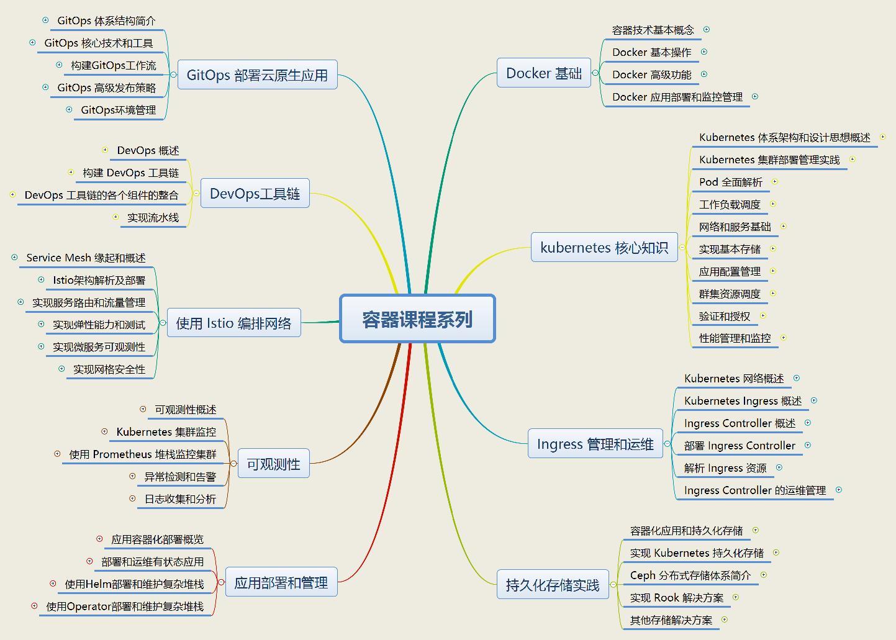

# Kubernetes 知识库 Ver 20230322

## 课程体系一览

## 课程概要

本课程体系旨在为学员提供一套全面的云原生技术学习路径，包括容器技术、Kubernetes 部署和管理、Ingress 管理、持久化存储、应用部署、可观测性、服务网格、DevOps 工具链和流水线以及 GitOps 等方面的内容。通过学习这套课程体系，学员将掌握云原生技术的关键概念、原理和实践方法，从而提升云原生应用的部署、管理和协作效率。

1.  [Docker 技术实战](01-dockerlab/README.md)：该课程专注于容器技术，通过实例教程的形式深入讲解Docker的运作原理和核心组件，并讲解如何使用Docker进行应用部署和监控管理。
2.  [Kubernetes 部署和管理实战](02-k8s-basic/README.md)：该课程为Kubernetes初学者量身打造，深入浅出地讲解Kubernetes的核心概念和基础组件，并给出大量实践演练，使学员能够熟练掌握Kubernetes的部署、管理、监控等核心技能。
3.  [Kubernetes Ingress 管理与运维](03-k8s-ingress/README.md)：该课程将帮助听众了解Kubernetes Ingress的概念、工作机制、部署方式和运维管理方法。
4.  [Kubernetes 持久化存储实践](04-k8s-storage/README.md)：该课程将讲解Kubernetes持久化存储的概念、原理、实现方式和实际应用。
5.  [Kubernetes 应用部署和管理](05-k8s-appdeloy/README.md)：该课程将讲解Kubernetes应用部署和管理的基本概念、原理和实现方法。
6.  [Kubernetes 可观测性实践](06-k8s-monitoring/readme.md)：该课程将讲解Kubernetes 可观测性实践的概念、原理和实现方法，包括监控、日志记录和分析等。
7.  [基于 Istio 的服务网格实战](07-istiolabmanual/manual.md)：该课程将讲解基于Istio的服务网格的概念、原理和实现方法，包括服务路由、流量管理、弹性能力和微服务可观测性等。
8.  [DevOps 工具链与流水线实践](08-devopslab/readme.md)：该课程将讲解DevOps工具链与流水线的概念、原理和实现方法，包括自动化构建、测试、部署和监控等。
9.  [GitOps 云原生应用的高效部署与管理](09-gitops/README.md)：这门课程旨在帮助学员全面掌握 GitOps 原理、技术和工具，提高云原生应用部署、管理和协作效率。

通过对这九门课程的学习，学员可以：

1.  熟练运用 Docker 和 Kubernetes 进行容器化应用的部署和管理。
2.  掌握 Ingress 和持久化存储在 Kubernetes 集群中的配置和管理方法。
3.  了解 Kubernetes 可观测性实践，提高应用监控、日志和分析的能力。
4.  探究 Istio 服务网格的原理和实现，实现微服务的高可用、弹性和安全。
5.  运用 DevOps 工具链和流水线实现自动化构建、测试、部署和监控。
6.  掌握 GitOps 的原理和技术，提升云原生应用的部署、管理和协作效率。

本课程体系适合对云原生技术感兴趣的开发者、运维工程师、架构师等专业人士。课程内容丰富、实践性强，旨在帮助学员在实际工作中更好地应用云原生技术，为企业的数字化转型做出贡献。

## 联系信息

如有培训需求，请联系info@cloudzun.com

